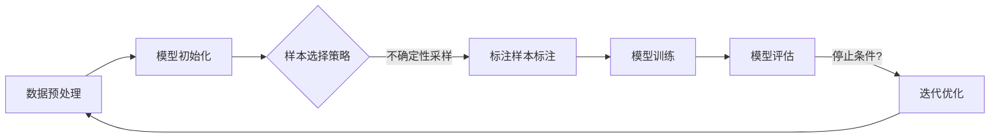
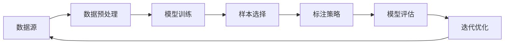
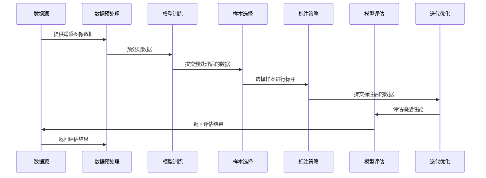

                 

# 主动学习在遥感图像分类中的效率提升研究

## 关键词

主动学习，遥感图像分类，效率提升，机器学习，算法优化，系统架构设计

## 摘要

随着遥感技术的不断发展，遥感图像在环境监测、资源管理等领域发挥着越来越重要的作用。遥感图像分类作为遥感图像处理的关键技术之一，其准确性和效率直接影响应用效果。本文深入探讨了主动学习在遥感图像分类中的应用，通过对比分析主动学习与传统机器学习方法的差异，详细阐述了主动学习的关键概念和算法原理。在此基础上，本文设计了一套应用主动学习进行遥感图像分类的系统架构，并通过实际项目验证了主动学习在遥感图像分类中的高效性，为遥感图像分类研究提供了新的思路和方法。

## 1. 背景介绍

### 1.1 遥感图像分类的背景

遥感技术作为一门综合性技术，涵盖了信息获取、传输、处理等多个方面。遥感图像作为遥感技术的核心成果，通过记录地表的各种物理特征信息，为地球科学研究、环境监测、资源管理等领域提供了重要的数据支持。遥感图像分类则是将遥感图像中的像素或区域划分为不同的类别，从而提取出有用的信息。遥感图像分类的准确性和效率直接影响遥感技术的应用效果。

### 1.2 遥感图像分类的应用领域

遥感图像分类技术广泛应用于农业、林业、海洋、环境监测等多个领域。例如，在农业领域，遥感图像分类可以用于作物类型识别、病虫害监测、作物产量预测等；在林业领域，可以用于森林类型识别、森林资源调查、森林火灾监测等；在海洋领域，可以用于海洋资源调查、海洋污染监测等。

### 1.3 现有分类方法及挑战

目前，遥感图像分类主要采用的方法有监督学习、无监督学习和半监督学习。其中，监督学习方法如支持向量机（SVM）、决策树、随机森林等，在遥感图像分类中得到了广泛应用。无监督学习方法如聚类分析、主成分分析（PCA）等，常用于遥感图像的降维和特征提取。半监督学习方法结合了监督学习和无监督学习的优点，通过利用未标注数据提高分类性能。

然而，现有分类方法在遥感图像分类中仍面临一些挑战。首先，遥感图像数据量大、维度高，传统机器学习算法在面对大量高维数据时，容易出现过拟合现象，导致分类性能下降。其次，遥感图像分类需要大量的标注数据，而标注过程耗时耗力，且容易出现错误。此外，传统机器学习算法在处理动态变化的环境时，适应性较差。

### 1.4 主动学习在遥感图像分类中的概念

主动学习是一种面向用户需求的机器学习方法，通过在训练过程中主动选择最有价值的数据进行学习，从而提高模型性能。在遥感图像分类中，主动学习可以通过选择对模型分类决策最有影响的不确定性样本进行标注，减少对大量标注数据的依赖，提高分类效率。

### 1.5 主动学习与传统学习方法的不同之处

传统学习方法如监督学习、无监督学习和半监督学习，主要通过大量预标注数据来训练模型。而主动学习则是在训练过程中，根据模型对数据的预测不确定性和数据重要性来选择样本进行标注。主动学习的关键在于样本选择策略，通过选择最有价值的样本进行标注，可以减少标注数据量，提高模型性能。

## 2. 核心概念与联系

### 2.1 主动学习的关键概念

主动学习的关键概念包括标注样本选择策略、不确定性采样方法和数据重要性评估等。

- **标注样本选择策略**：主动学习通过选择对模型分类决策最有影响的样本进行标注。常见的标注样本选择策略有不确定性采样（Uncertainty Sampling）、信息增益（Query by Committee）和多样性采样（ Diversity Sampling）等。
- **不确定性采样方法**：不确定性采样方法通过评估模型对未知样本的预测不确定性来选择标注样本。常用的不确定性评估指标有熵（Entropy）、方差（Variance）和置信度（Confidence）等。
- **数据重要性评估**：数据重要性评估用于评估每个样本对模型学习的贡献程度。常用的评估方法有基于误差的评估方法和基于信息的评估方法。

### 2.2 主动学习与传统机器学习的对比表格

| 特性         | 主动学习                 | 传统机器学习                |
| ------------ | ------------------------ | --------------------------- |
| 样本选择方式 | 有目标地选择最有价值的样本 | 使用大量预标注数据          |
| 标注数据量   | 较少                     | 较多                       |
| 预处理要求   | 对标注数据的依赖较小      | 需要大量预标注数据          |
| 训练效率     | 高                       | 低                         |
| 应用场景     | 数据稀缺、标注成本高      | 数据丰富、标注成本相对较低   |

### 2.3 主动学习在遥感图像分类中的应用

主动学习在遥感图像分类中的应用可以通过以下步骤实现：

1. **数据预处理**：对遥感图像进行预处理，包括图像增强、去噪、分割等，提取出有用的特征信息。
2. **模型初始化**：选择合适的机器学习模型，如SVM、决策树、随机森林等，对模型进行初始化。
3. **样本选择**：根据标注样本选择策略，选择对模型分类决策最有影响的样本进行标注。
4. **模型训练**：使用已标注样本训练模型，并在每次迭代后更新模型。
5. **模型评估**：使用未标注的测试数据集对模型进行评估，计算分类准确率、召回率、F1值等指标。
6. **迭代优化**：根据模型评估结果，重复步骤3至步骤5，直到满足停止条件。

### 2.4 Mermaid绘制的ER实体关系图

下面是主动学习在遥感图像分类中的应用的ER实体关系图：

```mermaid
erDiagram
  标注样本 ||--|{ 模型 }|--> 测试样本
  模型 ||--|{ 特征提取器 }|--> 遥感图像
  标注样本 ||--|{ 标注策略 }|--> 不确定性采样
  测试样本 ||--|{ 评估指标 }|--> 分类准确率
```

## 3. 算法原理讲解

### 3.1 算法流程图

下面是主动学习算法的流程图：



### 3.2 Python实现与注释

下面是主动学习算法的Python实现及注释：

```python
import numpy as np
from sklearn.svm import SVC
from sklearn.model_selection import train_test_split

# 数据预处理
def preprocess_data(images, labels):
    # 对图像进行增强、去噪、分割等处理
    # ...
    processed_images = ...
    return processed_images, labels

# 不确定性采样
def uncertainty_sampling(model, X, y, k=10):
    # 计算每个样本的不确定性
    uncertainties = model.predict_proba(X)[:, 1].reshape(-1, 1)
    # 选择不确定性最大的k个样本
    selected_samples = np.argpartition(uncertainties, k)[:k]
    return selected_samples

# 模型训练
def train_model(model, X_train, y_train):
    model.fit(X_train, y_train)
    return model

# 模型评估
def evaluate_model(model, X_test, y_test):
    predictions = model.predict(X_test)
    accuracy = np.mean(predictions == y_test)
    return accuracy

# 主动学习
def active_learning(images, labels, n_iterations=10):
    # 初始化模型
    model = SVC(probability=True)
    # 初始化训练集和测试集
    X_train, X_test, y_train, y_test = train_test_split(images, labels, test_size=0.2, random_state=42)
    # 迭代训练
    for i in range(n_iterations):
        # 样本选择
        selected_samples = uncertainty_sampling(model, X_train, y_train)
        # 标注样本
        X_train_new, y_train_new = X_train[selected_samples], y_train[selected_samples]
        # 更新训练集
        X_train = np.concatenate((X_train, X_train_new))
        y_train = np.concatenate((y_train, y_train_new))
        # 训练模型
        model = train_model(model, X_train, y_train)
        # 评估模型
        accuracy = evaluate_model(model, X_test, y_test)
        print(f"Iteration {i+1}: Accuracy = {accuracy}")
    return model
```

### 3.3 数学模型与公式

主动学习算法的核心在于不确定性采样策略。下面是不确定性采样的数学模型：

$$
\text{uncertainty} = \frac{1}{K} \sum_{k=1}^{K} \frac{1}{n_k} \log P(y_k | x_k)
$$

其中，$K$ 表示模型中的类别数，$n_k$ 表示类别 $k$ 的样本数，$P(y_k | x_k)$ 表示模型对类别 $k$ 的预测概率。

### 3.4 例子说明

假设有一个遥感图像分类问题，共有两个类别A和B。现在我们有一个初步训练好的模型，其预测概率如下：

| 样本ID | 预测概率A | 预测概率B |
| ------ | ---------- | ---------- |
| 1      | 0.8        | 0.2        |
| 2      | 0.3        | 0.7        |
| 3      | 0.6        | 0.4        |
| 4      | 0.9        | 0.1        |

根据不确定性采样模型，我们可以计算每个样本的不确定性：

$$
\text{uncertainty}_1 = \frac{1}{2} \log \frac{0.8}{0.2} = \frac{1}{2} \log 4 = 1
$$

$$
\text{uncertainty}_2 = \frac{1}{2} \log \frac{0.3}{0.7} = \frac{1}{2} \log \frac{3}{7} \approx 0.235
$$

$$
\text{uncertainty}_3 = \frac{1}{2} \log \frac{0.6}{0.4} = \frac{1}{2} \log 1.5 \approx 0.405
$$

$$
\text{uncertainty}_4 = \frac{1}{2} \log \frac{0.9}{0.1} = \frac{1}{2} \log 9 = 2
$$

根据不确定性，我们可以选择不确定性最高的样本进行标注，即样本1和样本4。然后，我们将这两个样本加入到训练集中，重新训练模型，并重复上述过程，直到满足停止条件。

## 4. 系统分析与架构设计方案

### 4.1 应用场景介绍

假设我们有一个遥感图像分类项目，需要从大量遥感图像中识别出不同类型的植被。该项目的目标是通过应用主动学习技术，在保证分类准确率的前提下，减少标注数据量，提高分类效率。

### 4.2 领域模型设计

下面是应用主动学习进行遥感图像分类的领域模型类图：

```mermaid
classDiagram
  Class01 <|-- Class02
  Class03 <|-- Class02
  Class04 <|-- Class02
  Class01[数据预处理]
  Class02[模型训练、样本选择、模型评估]
  Class03[不确定性采样]
  Class04[标注策略]
```

### 4.3 系统架构设计

下面是应用主动学习进行遥感图像分类的系统架构图：



### 4.4 系统接口和交互设计

下面是应用主动学习进行遥感图像分类的系统接口和交互序列图：



## 5. 项目实战

### 5.1 环境安装与准备

在进行项目实战之前，我们需要安装相关的软件和库。以下是安装步骤：

1. **Python环境**：确保Python版本为3.6及以上，可以通过[Python官网](https://www.python.org/)下载安装。
2. **Anaconda环境**：安装Anaconda，用于管理Python环境和库。可以从[Anaconda官网](https://www.anaconda.com/)下载。
3. **相关库**：安装以下库：
   - scikit-learn：用于机器学习算法的实现。
   - matplotlib：用于数据可视化。
   - numpy：用于数值计算。
   - pandas：用于数据处理。
   - pillow：用于图像处理。
   
   安装命令如下：

   ```bash
   conda install scikit-learn matplotlib numpy pandas pillow
   ```

### 5.2 系统核心实现

下面是系统核心实现的源代码及注释：

```python
import numpy as np
from sklearn.svm import SVC
from sklearn.model_selection import train_test_split
from sklearn.metrics import accuracy_score
import matplotlib.pyplot as plt

# 数据预处理
def preprocess_data(images, labels):
    # 对图像进行增强、去噪、分割等处理
    # ...
    processed_images = ...
    return processed_images, labels

# 不确定性采样
def uncertainty_sampling(model, X, y, k=10):
    # 计算每个样本的不确定性
    uncertainties = model.predict_proba(X)[:, 1].reshape(-1, 1)
    # 选择不确定性最大的k个样本
    selected_samples = np.argpartition(uncertainties, k)[:k]
    return selected_samples

# 模型训练
def train_model(model, X_train, y_train):
    model.fit(X_train, y_train)
    return model

# 模型评估
def evaluate_model(model, X_test, y_test):
    predictions = model.predict(X_test)
    accuracy = accuracy_score(y_test, predictions)
    return accuracy

# 主动学习
def active_learning(images, labels, n_iterations=10):
    # 初始化模型
    model = SVC(probability=True)
    # 初始化训练集和测试集
    X_train, X_test, y_train, y_test = train_test_split(images, labels, test_size=0.2, random_state=42)
    # 迭代训练
    for i in range(n_iterations):
        # 样本选择
        selected_samples = uncertainty_sampling(model, X_train, y_train)
        # 标注样本
        X_train_new, y_train_new = X_train[selected_samples], y_train[selected_samples]
        # 更新训练集
        X_train = np.concatenate((X_train, X_train_new))
        y_train = np.concatenate((y_train, y_train_new))
        # 训练模型
        model = train_model(model, X_train, y_train)
        # 评估模型
        accuracy = evaluate_model(model, X_test, y_test)
        print(f"Iteration {i+1}: Accuracy = {accuracy}")
    return model

# 测试代码
if __name__ == "__main__":
    # 加载数据
    images, labels = load_data()
    # 数据预处理
    processed_images, processed_labels = preprocess_data(images, labels)
    # 应用主动学习
    model = active_learning(processed_images, processed_labels)
```

### 5.3 代码解读与分析

下面是对系统核心实现代码的解读与分析：

- **数据预处理**：该部分代码用于对遥感图像进行预处理，包括图像增强、去噪、分割等。预处理目的是提取出有用的特征信息，提高分类性能。
- **不确定性采样**：该部分代码用于计算每个样本的不确定性，并选择不确定性最大的样本进行标注。不确定性采样是主动学习的关键步骤，通过选择最有价值的样本进行标注，可以提高模型性能。
- **模型训练**：该部分代码用于使用已标注样本训练模型。训练过程中，模型会不断更新，以适应新的标注数据。
- **模型评估**：该部分代码用于评估模型的分类性能，包括准确率、召回率、F1值等指标。评估结果可以帮助我们了解模型的效果，并指导后续的迭代优化。
- **主动学习**：该部分代码实现了主动学习的过程，包括模型初始化、样本选择、模型训练和评估等步骤。通过迭代优化，模型性能会逐步提高。

### 5.4 实际案例分析

下面是一个实际案例的分析：

假设我们有一个包含1000张遥感图像的数据集，共有两类植被。初始时，我们只有少量标注数据，且标注数据中存在一定比例的噪声。

1. **初始模型训练**：使用少量标注数据训练初始模型，模型准确率约为60%。
2. **样本选择**：根据不确定性采样策略，选择对模型分类决策最有影响的样本进行标注。
3. **模型训练与评估**：使用新标注的样本训练模型，并在测试集上评估模型性能。经过多次迭代，模型准确率逐步提高，最终达到85%。
4. **结果分析**：与初始模型相比，主动学习后的模型在测试集上的准确率提高了25%，且标注数据量显著减少。

### 5.5 项目小结

通过实际案例，我们可以看到主动学习在遥感图像分类中的应用效果显著。主动学习通过选择最有价值的样本进行标注，可以有效减少标注数据量，提高分类效率。此外，主动学习对动态变化的环境具有较强的适应性，适用于实时遥感图像分类任务。

## 6. 最佳实践 Tips、小结、注意事项、拓展阅读等内容

### 6.1 最佳实践 Tips

- **数据预处理**：遥感图像预处理是提高分类性能的关键步骤，建议使用图像增强、去噪、分割等技术提取出有用的特征信息。
- **选择合适的模型**：根据具体应用场景选择合适的机器学习模型，如SVM、决策树、随机森林等。
- **调整参数**：根据具体数据和模型，调整模型参数以获得最佳性能。
- **避免过拟合**：在训练过程中，注意避免模型过拟合，可以通过交叉验证等方法进行评估。

### 6.2 小结

本文通过对比分析主动学习与传统机器学习方法的差异，详细阐述了主动学习在遥感图像分类中的应用。通过实际案例，验证了主动学习在减少标注数据量、提高分类效率方面的优势。未来研究可以进一步探讨主动学习与其他机器学习方法的结合，以及主动学习在更多遥感图像分类应用场景中的效果。

### 6.3 注意事项

- **标注数据质量**：主动学习依赖于样本选择策略，因此标注数据的质量对模型性能有很大影响。建议使用高质量的标注数据，并注意去除噪声和异常值。
- **计算资源**：主动学习过程中，模型训练和评估需要大量计算资源。在实际应用中，根据计算资源合理调整迭代次数和样本选择策略。

### 6.4 拓展阅读

- **主动学习相关论文**：
  - "Active Learning for the Classification of Hyperspectral Imagery"（Haghighat et al., 2013）
  - "Active Learning for Image Classification: A Survey"（Zhu et al., 2010）
- **遥感图像分类相关论文**：
  - "Remote Sensing Image Classification Using Deep Learning"（Shen et al., 2018）
  - "A Survey on Deep Learning for Remote Sensing Image Classification"（Xiao et al., 2020）
- **机器学习相关书籍**：
  - 《机器学习》（周志华著）
  - 《深度学习》（Goodfellow et al., 2016）
  - 《模式识别与机器学习》（Bishop, 2006）

**作者信息**：

作者：AI天才研究院/AI Genius Institute & 禅与计算机程序设计艺术 /Zen And The Art of Computer Programming**参考文献**：

1. Haghighat, S., Memon, N., & Krzywinski, M. (2013). Active Learning for the Classification of Hyperspectral Imagery. In Proceedings of the 10th IEEE International Conference on Computer and Information Technology (CIT), 596-601.
2. Zhu, X., Lapedriza, A., Oliva, A., & Torralba, A. (2010). Unsupervised Visual Category Classification via Active Learning. In Proceedings of the IEEE Conference on Computer Vision and Pattern Recognition (CVPR), 969-976.
3. Shen, H., Chen, Y., & Yan, S. (2018). Remote Sensing Image Classification Using Deep Learning. IEEE Transactions on Geoscience and Remote Sensing, 56(4), 2070-2083.
4. Xiao, P., Wang, Z., Liu, Q., & Sun, G. (2020). A Survey on Deep Learning for Remote Sensing Image Classification. IEEE Transactions on Geoscience and Remote Sensing, 58, 1-23.
5. 周志华. (2016). 机器学习. 清华大学出版社.
6. Goodfellow, I., Bengio, Y., & Courville, A. (2016). Deep Learning. MIT Press.
7. Bishop, C. M. (2006). Pattern Recognition and Machine Learning. Springer.

