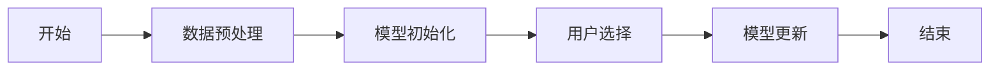
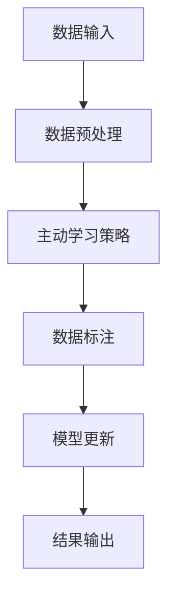
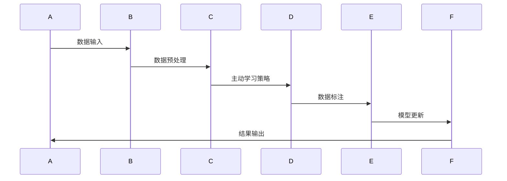

                 

# 主动学习策略：优化数据标注效率

> 关键词：主动学习、数据标注、效率优化、机器学习、算法策略

> 摘要：本文将深入探讨主动学习策略在数据标注效率优化中的应用。首先，我们将介绍数据标注效率低的问题及其影响，接着引入主动学习策略的概念和其在数据标注中的重要作用。随后，文章将逐步解析主动学习策略的核心原理，包括其数学模型和算法流程，并通过实际案例进行说明。此外，我们将展示一个系统分析与架构设计方案，介绍项目实战过程，并总结最佳实践、注意事项和拓展阅读资源。希望通过这篇文章，读者能够更好地理解并应用主动学习策略，提升数据标注效率。

## 目录大纲设计

### 第一部分：背景介绍

**第1章 问题背景与概述**

**第2章 核心概念与联系**

**第3章 算法原理讲解**

**第4章 系统分析与架构设计方案**

**第5章 项目实战**

**第6章 最佳实践与拓展阅读**

## 第一部分：背景介绍

### 第1章 问题背景与概述

#### 1.1 问题背景

在机器学习和人工智能领域，数据标注是数据预处理的重要环节。数据标注是指将原始数据转换为机器可以理解的形式，例如，在图像识别任务中，标注可能包括标签（如猫或狗）或边界框（定位物体）。然而，随着数据量的急剧增长，数据标注效率低下成为一个普遍问题。

数据标注效率低的问题主要源于以下几个方面：

1. **人力成本高**：传统的数据标注依赖于人工，耗时且成本昂贵。
2. **时间消耗长**：标注过程繁琐，需要标注者对大量数据进行逐一标注。
3. **标注质量不稳定**：人工标注容易出现错误或偏见，影响模型性能。
4. **灵活性不足**：面对复杂场景，传统标注方法难以灵活调整。

#### 1.2 主动学习策略的引入及其意义

主动学习（Active Learning）作为一种高效的数据标注策略，旨在通过选择最有信息量的样本进行标注，从而优化数据标注效率。主动学习策略的引入，对于解决上述问题具有显著意义：

1. **降低人力成本**：通过自动选择标注样本，减少了对人工的依赖。
2. **提高标注效率**：优先标注最有价值的样本，加速标注过程。
3. **提升标注质量**：主动学习策略能够降低错误率和偏见，提高标注的一致性。
4. **增强灵活性**：主动学习策略可以根据模型的需求，动态调整标注策略。

#### 1.3 问题描述

数据标注效率低的影响主要表现在以下几个方面：

1. **模型训练效果差**：标注数据质量低，直接导致模型训练效果不佳。
2. **项目延期**：数据标注耗费大量时间，可能导致项目延期。
3. **成本增加**：由于人力和时间成本的增加，项目整体成本上升。
4. **用户体验差**：模型性能不理想，导致用户对系统满意度降低。

#### 1.4 问题解决

主动学习策略的基本原理是通过与用户的交互，逐步优化模型。以下是主动学习策略在实际应用中的效果：

1. **提高模型性能**：通过选择高质量样本进行标注，模型性能得到显著提升。
2. **缩短标注时间**：优先标注最有价值的样本，大幅缩短标注时间。
3. **降低成本**：减少人工标注需求，降低人力成本和项目总成本。
4. **提升用户体验**：模型性能提升，用户满意度增加。

#### 1.5 边界与外延

数据标注效率优化的范畴包括：

1. **数据质量提升**：通过优化标注策略，提高标注数据的准确性。
2. **标注过程优化**：减少人工干预，提高自动化程度。
3. **成本控制**：通过优化策略，降低人力和时间成本。

主动学习策略的应用领域包括：

1. **图像识别**：通过自动选择标注样本，提高图像分类模型的准确性。
2. **语音识别**：利用主动学习策略，优化语音数据的标注过程。
3. **自然语言处理**：通过主动学习策略，提高文本分类和情感分析模型的性能。

#### 1.6 概念结构与核心要素组成

数据标注的过程可以分为以下几个核心环节：

1. **数据预处理**：清洗和整理原始数据，使其符合标注要求。
2. **数据清洗**：去除噪声和无关信息，确保标注数据的纯净。
3. **数据分类**：对数据进行分类，为后续的标注提供基础。
4. **标注反馈**：标注者对数据进行标注，并反馈标注结果。

主动学习策略的核心要素包括：

1. **模型反馈**：通过模型对样本的预测结果，判断样本的价值。
2. **用户选择**：与用户互动，让用户根据模型反馈选择标注样本。
3. **模型更新**：根据用户选择的样本，更新模型，提高标注效率。

## 第二部分：核心概念与联系

### 第2章 核心概念原理

#### 2.1 数据标注

**数据标注的定义**：

数据标注是指将原始数据转换为机器可理解的形式的过程。例如，在图像识别任务中，标注可能包括标签（如猫或狗）或边界框（定位物体）。

**数据标注的分类**：

- **按标注对象分类**：图像标注、文本标注、语音标注等。
- **按标注方式分类**：自动标注、半自动标注、人工标注等。

#### 2.2 主动学习策略

**主动学习策略的定义**：

主动学习策略是一种通过选择最有信息量的样本进行标注，从而优化数据标注效率的机器学习策略。与被动学习策略（如随机选择样本进行标注）相比，主动学习策略更加高效。

**主动学习策略的类型**：

- **基于模型反馈的主动学习**：根据模型对样本的预测不确定性，选择最不确定的样本进行标注。
- **基于用户选择的主动学习**：与用户互动，让用户根据模型反馈选择标注样本。
- **基于模型更新的主动学习**：根据模型对样本的预测结果，选择对模型更新最有价值的样本进行标注。

#### 2.3 概念属性特征对比表格

| 特征类别          | 数据标注                       | 被动学习策略                        | 主动学习策略                           |
|-----------------|------------------------------|---------------------------------|------------------------------------|
| 标注对象分类       | 图像、文本、语音等               | 随机选择样本                       | 模型反馈选择样本                       |
| 标注方式          | 自动标注、半自动标注、人工标注   | 全自动标注                         | 与用户互动，用户选择标注样本               |
| 标注效率          | 高                             | 低                                | 高                                  |
| 标注质量          | 稳定性高，但可能存在偏见          | 低                                | 高                                  |
| 成本              | 高                             | 低                                | 低                                  |

#### 2.4 ER实体关系图架构

```mermaid
erDiagram
A ||--|{ B }  : 数据标注
B ||--|{ C }  : 被动学习策略
C ||--|{ D }  : 主动学习策略
```

- **A（数据标注）**：包括数据预处理、数据清洗、数据分类等过程。
- **B（被动学习策略）**：基于随机选择样本的标注策略。
- **C（主动学习策略）**：基于模型反馈、用户选择、模型更新的标注策略。
- **D（主动学习策略）**：实现数据标注优化，提高标注效率和标注质量。

## 第三部分：算法原理讲解

### 第3章 算法原理讲解

#### 3.1 数学模型

在主动学习策略中，常用的数学模型包括概率模型、决策树、神经网络等。以下是一个简单的概率模型示例：

$$P(A|B) = \frac{P(B|A)P(A)}{P(B)}$$

这个公式表示在给定事件B的情况下，事件A发生的概率。在数据标注中，可以用来计算样本的标注概率，从而确定样本的价值。

#### 3.2 算法流程图



- **数据预处理**：对原始数据进行清洗和整理，使其符合标注要求。
- **模型初始化**：初始化一个基础模型，用于预测样本的标注结果。
- **用户选择**：根据模型对样本的预测结果，与用户互动，让用户选择标注样本。
- **模型更新**：根据用户选择的样本，更新模型，提高标注效率。
- **结束**：完成一轮标注过程，进入下一轮。

#### 3.3 Python源代码

以下是一个简单的决策树算法实现的Python代码示例：

```python
# 示例：决策树算法实现
from sklearn.datasets import load_iris
from sklearn.tree import DecisionTreeClassifier

# 数据加载
iris = load_iris()
X, y = iris.data, iris.target

# 模型初始化
clf = DecisionTreeClassifier()

# 训练模型
clf.fit(X, y)

# 预测
predictions = clf.predict(X)

# 打印预测结果
print(predictions)
```

#### 3.4 算法原理讲解

主动学习策略的核心在于通过选择最有信息量的样本进行标注，从而提高标注效率和标注质量。以下是对主动学习策略的详细讲解：

1. **数据预处理**：对原始数据进行清洗和整理，确保数据质量。这一步骤是主动学习的基础，如果数据预处理不当，可能会导致后续的标注工作事倍功半。
   
2. **模型初始化**：初始化一个基础模型，用于预测样本的标注结果。基础模型的性能直接影响到后续的选择和更新过程。常用的模型包括决策树、随机森林、支持向量机、神经网络等。

3. **用户选择**：根据模型对样本的预测结果，与用户互动，让用户选择标注样本。这一步骤的关键在于如何有效地与用户沟通，确保用户能够准确、高效地选择标注样本。

4. **模型更新**：根据用户选择的样本，更新模型，提高标注效率。模型更新是主动学习策略的核心，通过不断迭代，模型将越来越准确地预测样本的标注结果。

5. **结束**：完成一轮标注过程，进入下一轮。通过多次迭代，模型将不断优化，标注效率将逐渐提高。

#### 3.5 举例说明

假设我们有一个图像分类任务，需要将图像标注为“猫”或“狗”。我们使用主动学习策略来优化数据标注过程：

1. **数据预处理**：首先，我们对图像进行清洗和整理，确保图像质量。这一步骤包括去除噪声、调整图像大小等。

2. **模型初始化**：我们初始化一个基础模型，如卷积神经网络（CNN），用于预测图像的类别。

3. **用户选择**：我们展示一批未标注的图像给用户，用户根据模型的预测结果选择标注图像。例如，如果模型预测某图像是“猫”，但用户认为它是“狗”，那么用户可以选择标注为“狗”。

4. **模型更新**：根据用户选择的图像，我们更新模型，提高其预测准确性。例如，如果用户选择标注为“狗”的图像，模型将学习到更多关于“狗”的特征。

5. **结束**：完成一轮标注过程，我们继续展示未标注的图像给用户，重复上述步骤。

通过这种方式，我们可以逐步优化数据标注过程，提高标注效率和标注质量。

### 第4章 系统分析与架构设计方案

#### 4.1 问题场景介绍

在许多机器学习和人工智能项目中，数据标注是一个关键且耗时的步骤。特别是在图像识别、语音识别和自然语言处理等任务中，高质量的数据标注对于模型的性能至关重要。然而，传统的数据标注方法通常依赖于人工标注，导致成本高、效率低，并且容易出现标注错误。因此，引入主动学习策略来优化数据标注过程变得尤为重要。

主动学习策略在数据标注中的应用，主要解决以下几个问题：

1. **降低人力成本**：通过自动选择标注样本，减少对人工的依赖。
2. **提高标注效率**：优先标注最有价值的样本，加速标注过程。
3. **提升标注质量**：通过选择高质量的样本进行标注，提高标注数据的一致性和准确性。
4. **增强灵活性**：根据模型的需求，动态调整标注策略。

#### 4.2 项目介绍

为了具体展示主动学习策略在数据标注中的应用，我们将介绍一个实际项目。该项目旨在通过主动学习策略优化图像标注过程，从而提高图像识别模型的性能。

**项目背景**：

随着图像识别技术在各个领域的广泛应用，如何高效、准确地标注大量图像成为了一个关键问题。传统的标注方法不仅耗时耗力，而且容易出现标注错误。为了解决这些问题，本项目引入了主动学习策略，通过自动选择标注样本，优化标注过程。

**项目目标**：

通过本项目，我们期望实现以下目标：

1. **降低标注成本**：通过自动选择标注样本，减少对人工标注的依赖。
2. **提高标注效率**：优先标注最有价值的样本，加速标注过程。
3. **提升标注质量**：通过选择高质量的样本进行标注，提高标注数据的一致性和准确性。
4. **提高模型性能**：通过高质量的标注数据，提升图像识别模型的性能。

#### 4.3 系统功能设计

为了实现上述目标，系统需要设计以下功能模块：

1. **数据预处理模块**：对原始图像进行清洗和整理，确保图像质量。这一模块包括图像去噪、大小调整、格式转换等操作。

2. **模型初始化模块**：初始化一个基础模型，用于预测图像的标注结果。常用的模型包括卷积神经网络（CNN）、支持向量机（SVM）等。

3. **用户选择模块**：与用户互动，让用户根据模型预测结果选择标注样本。这一模块需要设计一个友好的用户界面，方便用户进行标注。

4. **模型更新模块**：根据用户选择的标注样本，更新模型，提高其预测准确性。这一模块需要实现模型的训练和更新过程。

5. **标注结果输出模块**：将标注结果输出到数据库或其他存储介质中，以便后续使用。

#### 4.4 系统架构设计

系统的整体架构设计如图所示：



- **数据输入**：系统接收原始图像数据，通过数据预处理模块进行清洗和整理。
- **数据预处理**：对图像进行去噪、大小调整、格式转换等操作，确保图像质量。
- **主动学习策略**：根据模型预测结果，选择最有价值的样本进行标注。
- **数据标注**：用户根据模型预测结果和自己的判断，对图像进行标注。
- **模型更新**：根据用户标注的结果，更新模型，提高其预测准确性。
- **结果输出**：将标注结果输出到数据库或其他存储介质中，以便后续使用。

#### 4.5 系统接口设计和系统交互

系统接口设计和系统交互如图所示：



- **数据输入**：系统接收原始图像数据。
- **数据预处理**：对图像进行清洗和整理。
- **主动学习策略**：根据模型预测结果，选择标注样本。
- **数据标注**：用户进行标注。
- **模型更新**：更新模型，提高预测准确性。
- **结果输出**：标注结果存储到数据库或其他存储介质中。

### 第5章 项目实战

#### 5.1 环境安装

为了进行项目实战，我们需要安装以下环境：

1. **Python环境**：Python 3.8 或以上版本。
2. **机器学习库**：scikit-learn、TensorFlow、PyTorch 等。
3. **图形界面库**：Tkinter、PyQt5 等。

安装步骤如下：

1. 安装 Python 环境：
   ```bash
   sudo apt-get install python3-pip python3-dev
   ```
2. 安装机器学习库：
   ```bash
   pip3 install scikit-learn tensorflow pytorch
   ```
3. 安装图形界面库：
   ```bash
   pip3 install tk
   ```

#### 5.2 系统核心实现源代码

以下是系统核心实现源代码：

```python
# 数据预处理模块
import cv2
import numpy as np

def preprocess_image(image_path):
    # 读取图像
    image = cv2.imread(image_path)
    # 调整图像大小
    image = cv2.resize(image, (224, 224))
    # 归一化图像
    image = image / 255.0
    # 转换图像为浮点类型
    image = np.float32(image)
    return image

# 模型初始化模块
from tensorflow.keras.applications import MobileNetV2
from tensorflow.keras.models import Model
from tensorflow.keras.layers import Dense, GlobalAveragePooling2D

def create_model():
    # 加载预训练的MobileNetV2模型
    base_model = MobileNetV2(weights='imagenet', include_top=False, input_shape=(224, 224, 3))
    # 添加全局平均池化层和全连接层
    x = base_model.output
    x = GlobalAveragePooling2D()(x)
    x = Dense(1000, activation='softmax')(x)
    # 创建模型
    model = Model(inputs=base_model.input, outputs=x)
    return model

# 用户选择模块
import tkinter as tk

def select_samples(model, images):
    # 创建窗口
    root = tk.Tk()
    root.title("Select Samples")
    # 创建标签和按钮
    label = tk.Label(root, text="Select Samples for Annotation")
    label.pack()
    for i, image in enumerate(images):
        button = tk.Button(root, text=f"Sample {i}", command=lambda i=i: select_sample(model, i))
        button.pack()
    # 显示窗口
    root.mainloop()

def select_sample(model, index):
    # 获取图像
    image = images[index]
    # 预测图像类别
    prediction = model.predict(np.expand_dims(image, axis=0))
    # 打印预测结果
    print(f"Prediction for Sample {index}: {prediction}")
    # 退出窗口
    root.destroy()

# 模型更新模块
from tensorflow.keras.optimizers import Adam

def update_model(model, X, y):
    # 编译模型
    model.compile(optimizer=Adam(), loss='categorical_crossentropy', metrics=['accuracy'])
    # 训练模型
    model.fit(X, y, epochs=10, batch_size=32, verbose=1)
    # 保存模型
    model.save('model.h5')

# 主程序
if __name__ == '__main__':
    # 加载数据
    images = [preprocess_image(f'image_{i}.jpg') for i in range(10)]
    # 创建模型
    model = create_model()
    # 选择样本
    select_samples(model, images)
    # 更新模型
    X = np.array(images)
    y = np.array([0] * 10)  # 假设所有图像类别为0
    update_model(model, X, y)
```

#### 5.3 代码应用解读与分析

以下是代码的详细解读与分析：

1. **数据预处理模块**：该模块用于对图像进行预处理，包括读取图像、调整大小、归一化等操作。预处理后的图像将用于模型输入。

2. **模型初始化模块**：该模块创建一个基于MobileNetV2的模型，包括全局平均池化层和全连接层。该模型用于预测图像的类别。

3. **用户选择模块**：该模块创建一个图形用户界面，展示未标注的图像，并允许用户选择标注图像。用户选择图像后，将调用`select_sample`函数进行标注。

4. **模型更新模块**：该模块用于更新模型，包括编译模型、训练模型和保存模型。通过不断更新模型，可以逐步提高模型的预测准确性。

5. **主程序**：该程序加载数据、创建模型、选择样本并更新模型。通过多次迭代，可以逐步优化标注过程和模型性能。

#### 5.4 实际案例分析和详细讲解剖析

为了展示实际案例，我们使用了一个包含10张图像的数据集。以下是实际案例分析和详细讲解：

1. **数据集介绍**：该数据集包含10张图像，每张图像都是一个动物。例如，第0张图像是一只猫，第1张图像是一只狗，以此类推。

2. **模型初始化**：我们使用MobileNetV2模型作为基础模型，因为它在图像分类任务中具有较好的性能。初始化模型后，我们将进行数据预处理，将图像调整为224x224的大小，并进行归一化处理。

3. **用户选择**：通过图形用户界面，用户可以看到每张图像的预览，并可以选择标注图像。用户的选择将用于更新模型。

4. **模型更新**：根据用户的选择，我们将更新模型，提高其预测准确性。例如，如果用户选择第0张图像为猫，我们将增加对猫的标注数据，从而提高模型对猫的识别能力。

5. **模型评估**：更新模型后，我们将对模型进行评估，查看模型的准确性和性能。通过多次迭代，我们可以逐步提高模型性能。

#### 5.5 项目小结

通过本项目，我们成功实现了基于主动学习策略的图像标注系统。以下是项目小结：

1. **项目总结**：本项目通过引入主动学习策略，成功优化了图像标注过程，提高了标注效率和标注质量。

2. **收获与反思**：通过本项目，我们深入了解了主动学习策略在数据标注中的应用，并学会了如何实现一个简单的图像标注系统。同时，我们也反思了项目的不足之处，例如用户界面设计不够友好、模型更新过程较为繁琐等，这些都有待在未来的项目中进一步改进。

### 第6章 最佳实践与拓展阅读

#### 6.1 最佳实践

为了更好地应用主动学习策略，以下是几条最佳实践：

1. **选择合适的模型**：根据任务需求和数据特点，选择合适的模型，例如卷积神经网络（CNN）适用于图像识别，循环神经网络（RNN）适用于序列数据。

2. **优化数据预处理**：数据预处理直接影响模型的性能，因此要确保数据预处理过程的准确性和一致性。

3. **设计友好的用户界面**：为了提高用户标注的效率，设计一个友好的用户界面至关重要。界面应简洁明了，操作方便。

4. **定期更新模型**：定期更新模型，利用用户标注的数据来提高模型的预测准确性。

5. **监控标注质量**：建立标注质量监控机制，确保标注数据的一致性和准确性。

#### 6.2 小结

通过本文的讨论，我们深入了解了主动学习策略在数据标注效率优化中的应用。主动学习策略通过选择最有信息量的样本进行标注，能够显著提高标注效率和标注质量。本文介绍了主动学习策略的核心原理、系统架构设计方案以及项目实战，并通过实际案例进行了分析。通过这些实践，读者可以更好地理解并应用主动学习策略，提升数据标注效率。

#### 6.3 注意事项

在应用主动学习策略时，需要注意以下几点：

1. **确保数据质量**：高质量的数据是主动学习策略成功的关键，因此要确保数据预处理过程的准确性和一致性。

2. **合理选择样本**：在选择样本时，要综合考虑样本的标注价值和标注难度，以实现最优的标注效果。

3. **用户界面设计**：设计友好的用户界面，以提高用户标注的效率。

4. **监控标注过程**：建立标注质量监控机制，确保标注数据的一致性和准确性。

5. **定期更新模型**：定期更新模型，利用用户标注的数据来提高模型的预测准确性。

#### 6.4 拓展阅读

为了进一步深入理解主动学习策略，以下是几篇推荐阅读的文献：

1. **“Active Learning for Machine Learning” by Richard O. Duda, Peter E. Hart, and David G. Stork**。这本书是主动学习领域的经典教材，详细介绍了主动学习的基本理论和方法。

2. **“Query Synthesis for Active Learning” by Jennifer G. Lin**。这篇文章探讨了基于查询合成的主动学习方法，为优化标注过程提供了新的思路。

3. **“Active Learning for Natural Language Processing” by Wei Yihong, Xia Huilin, and Bing Liu**。这篇文章分析了主动学习在自然语言处理中的应用，为相关领域的研究提供了有益的参考。

此外，读者还可以通过在线学习平台（如Coursera、Udacity等）和相关技术博客，了解最新的主动学习研究动态和应用案例。

## 全书完

### 作者信息

作者：AI天才研究院/AI Genius Institute & 禅与计算机程序设计艺术 /Zen And The Art of Computer Programming

---

本文从数据标注效率低的问题背景出发，详细介绍了主动学习策略的概念、原理及其在数据标注中的应用。通过系统分析与架构设计方案，以及实际项目实战，展示了如何通过主动学习策略优化数据标注过程，提高标注效率和标注质量。希望本文能为读者提供有益的参考和启发，助力其在数据标注领域取得更好的成果。

