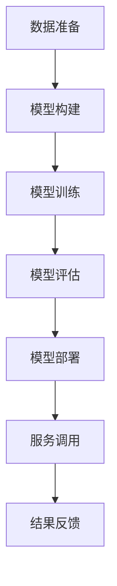
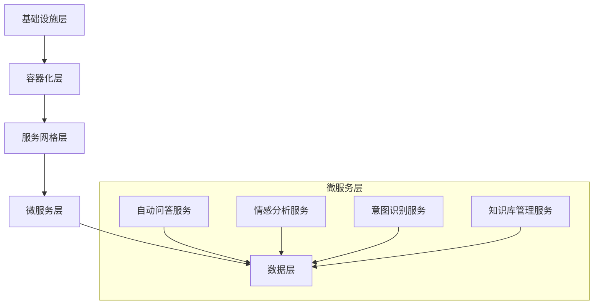
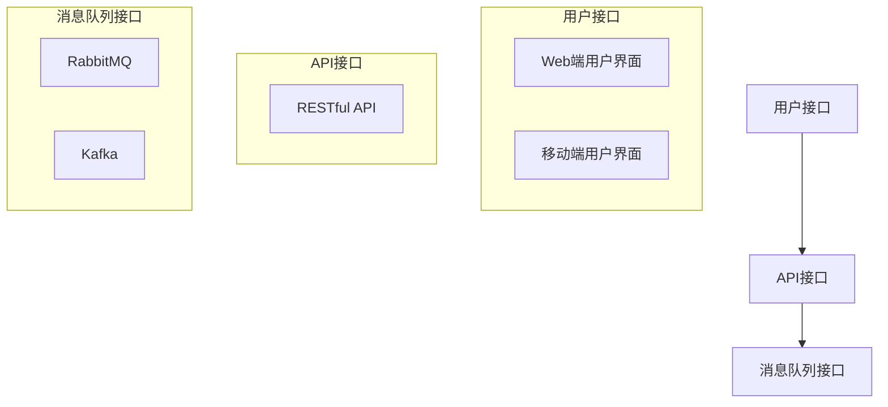
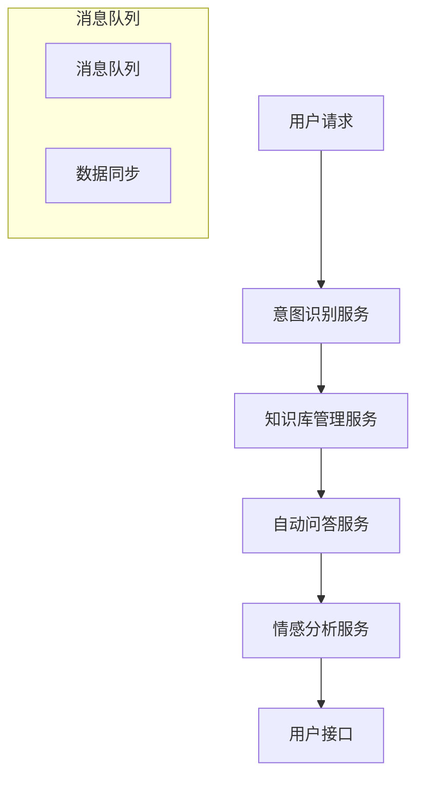

                 

### 云原生LLM应用：设计与实现

**关键词：** 云原生、大规模语言模型（LLM）、设计与实现、技术架构、优化策略

**摘要：** 本文将探讨云原生大规模语言模型（LLM）的应用及其设计实现，详细解析云原生技术在大规模语言模型部署中的作用与挑战。通过一步步的逻辑分析和实际案例，本文旨在为开发者提供云原生LLM的全面指南，涵盖核心概念、算法原理、系统设计及优化策略，助力读者深入理解并掌握云原生LLM的实战应用。

## 第1章 背景介绍

### 1.1 问题背景

#### 云原生技术的兴起与普及

云原生（Cloud-Native）是一种基于云计算的软件开发和运行方法，旨在构建和运行可弹性伸缩、易于管理和自动化的应用。云原生技术的兴起可以追溯到2010年代，随着云计算的普及和容器技术的应用，越来越多的企业开始采用云原生架构来提高应用的可扩展性和灵活性。

云原生技术的主要特点包括：

- **容器化**：应用被打包成容器，确保在不同的环境中运行一致。
- **动态管理**：通过自动化工具如Kubernetes进行资源的动态管理和调度。
- **服务网格**：提供服务间通信和安全性的抽象层。
- **微服务架构**：应用被分解为独立的小服务，每个服务负责特定的业务功能。

#### 大规模语言模型（LLM）的发展与应用

大规模语言模型（LLM）是一种能够理解和生成自然语言的深度学习模型，其发展始于2010年代初期。随着计算能力的提升和海量数据的积累，LLM的规模和性能得到了显著提升。LLM在自然语言处理（NLP）领域展示了强大的能力，如文本生成、翻译、问答等。

LLM的主要应用包括：

- **文本生成**：生成文章、新闻报道、营销文案等。
- **机器翻译**：提供高效准确的跨语言翻译服务。
- **问答系统**：构建智能客服和知识库系统。
- **对话系统**：实现自然语言交互的智能助手。

#### 云原生LLM在各个行业的应用潜力

云原生LLM在各个行业具有广泛的应用潜力。例如：

- **金融行业**：利用LLM进行风险管理、客户服务和市场分析。
- **医疗行业**：利用LLM辅助诊断、药物研发和医疗咨询。
- **零售行业**：利用LLM优化客户体验、推荐系统和库存管理。
- **教育行业**：利用LLM提供个性化学习方案、自动评分和内容生成。

### 1.2 问题描述

#### 云原生LLM的核心概念与特点

云原生LLM是将大规模语言模型部署在云原生环境中的一种技术实践。其核心概念和特点包括：

- **容器化与微服务**：LLM模型和应用被容器化，以实现灵活的部署和管理。
- **动态扩展与负载均衡**：根据需求动态调整LLM实例的数量，确保系统的高可用性和性能。
- **服务网格与安全性**：通过服务网格实现服务间的安全通信和流量控制。
- **自动化运维**：利用自动化工具进行LLM的部署、监控和运维。

#### 云原生LLM在应用中的挑战与解决方案

在云原生环境中部署LLM面临以下挑战：

- **性能与可扩展性**：如何确保LLM在高负载下仍能保持高性能和可扩展性。
- **资源管理**：如何合理分配和调度计算资源，最大化LLM的利用效率。
- **数据隐私与安全性**：如何保障训练数据和用户数据的安全性。
- **持续集成与部署**：如何实现LLM模型的快速迭代和可靠部署。

针对这些挑战，可以采取以下解决方案：

- **优化模型与算法**：通过模型压缩和算法优化，提高LLM的计算效率和可扩展性。
- **资源调度与优化**：利用自动化工具进行资源调度和优化，确保系统的稳定运行。
- **数据加密与安全协议**：采用数据加密和安全协议，保障数据传输和存储的安全性。
- **CI/CD流程**：建立完善的CI/CD流程，确保LLM模型的快速迭代和可靠部署。

#### 云原生LLM的应用边界与未来发展

云原生LLM在应用中存在一定的边界，如计算资源需求、数据隐私等。未来，随着技术的不断进步，云原生LLM的应用边界将不断拓展，有望在更多领域实现突破。

未来发展趋势包括：

- **分布式训练与推理**：利用分布式计算技术，提高LLM的训练和推理效率。
- **边缘计算与云计算结合**：将云计算与边缘计算相结合，实现更高效、更可靠的LLM服务。
- **人工智能与区块链结合**：利用区块链技术保障数据隐私和透明性，提升LLM的应用价值。
- **跨行业应用**：在金融、医疗、零售等领域实现更广泛的应用，助力行业数字化转型。

### 1.3 问题解决

#### 通过云原生LLM实现高效、可扩展的语言处理能力

云原生LLM通过以下方式实现高效、可扩展的语言处理能力：

- **容器化部署**：将LLM模型和应用容器化，实现灵活的部署和管理。
- **动态扩展与负载均衡**：根据需求动态调整LLM实例的数量，确保系统的高可用性和性能。
- **微服务架构**：将应用分解为独立的小服务，每个服务负责特定的业务功能，提高系统的可扩展性和灵活性。
- **服务网格**：通过服务网格实现服务间的安全通信和流量控制，提高系统的可靠性和安全性。

#### 探讨云原生架构在LLM部署中的优势与适用场景

云原生架构在LLM部署中具有以下优势：

- **高性能与可扩展性**：云原生架构支持高效、可扩展的语言处理能力，适用于大规模数据处理和实时分析场景。
- **灵活性**：云原生环境支持快速迭代和灵活部署，有助于快速响应业务需求。
- **可靠性**：云原生架构采用自动化运维和监控，提高系统的稳定性和可靠性。
- **安全性**：云原生架构提供服务网格和安全协议，保障数据传输和存储的安全性。

云原生架构适用于以下场景：

- **大数据处理与实时分析**：适用于大规模数据处理和实时分析场景，如金融风控、医疗诊断等。
- **人工智能应用**：适用于构建和部署人工智能应用，如智能客服、语音识别等。
- **跨行业应用**：适用于金融、医疗、零售等跨行业领域，助力行业数字化转型。

#### 提供实用的云原生LLM设计与实现策略

为了实现高效的云原生LLM设计与实现，可以采取以下策略：

- **模型压缩与优化**：通过模型压缩和算法优化，提高LLM的计算效率和可扩展性。
- **资源调度与优化**：利用自动化工具进行资源调度和优化，确保系统的稳定运行。
- **数据加密与安全协议**：采用数据加密和安全协议，保障数据传输和存储的安全性。
- **CI/CD流程**：建立完善的CI/CD流程，确保LLM模型的快速迭代和可靠部署。

#### 云原生与容器化、微服务的关系

云原生与容器化、微服务密切相关。容器化是云原生的基础技术，微服务是云原生架构的核心组成部分。通过容器化，应用可以以独立、可重复的方式部署在云环境中。微服务架构则将应用分解为独立的小服务，每个服务负责特定的业务功能，提高系统的可扩展性和灵活性。

#### LLM的模型选择与优化方法

选择适合的LLM模型是实现高效语言处理的关键。以下是一些常用的LLM模型选择与优化方法：

- **模型压缩**：通过模型剪枝、量化等技术减小模型大小，提高计算效率。
- **算法优化**：利用混合精度训练、并行计算等技术提高训练和推理速度。
- **模型融合**：结合多个模型的优势，提高语言处理的准确性和鲁棒性。
- **在线学习与更新**：实现模型的自适应更新，以适应不断变化的数据和环境。

#### 云原生LLM在跨行业领域的应用案例

云原生LLM在多个行业领域具有广泛的应用案例。以下是一些具体的应用案例：

- **金融行业**：利用云原生LLM进行客户画像分析、信用评估和欺诈检测。
- **医疗行业**：利用云原生LLM进行医学文本挖掘、智能诊断和药物研发。
- **零售行业**：利用云原生LLM进行商品推荐、客户服务和销售预测。
- **教育行业**：利用云原生LLM提供个性化学习方案、自动评分和内容生成。

#### 概念结构与核心要素组成

云原生LLM的概念结构包括以下几个核心要素：

1. **容器化应用**：将LLM模型和应用打包成容器，实现灵活部署和管理。
2. **微服务架构**：将应用分解为独立的小服务，提高系统的可扩展性和灵活性。
3. **动态调度与扩展**：利用自动化工具进行资源调度和扩展，确保系统的高可用性和性能。
4. **服务网格**：通过服务网格实现服务间的安全通信和流量控制。
5. **数据存储与处理**：采用分布式存储和处理技术，保障数据的高效存储和管理。

### 第2章 核心概念与联系

#### 2.1 云原生原理讲解

##### 云原生定义与特点

云原生（Cloud-Native）是一种基于云计算的软件开发和运行方法，旨在构建和运行可弹性伸缩、易于管理和自动化的应用。云原生技术的主要特点包括：

1. **容器化**：应用被打包成容器，确保在不同的环境中运行一致。
2. **动态管理**：通过自动化工具如Kubernetes进行资源的动态管理和调度。
3. **服务网格**：提供服务间通信和安全性的抽象层。
4. **微服务架构**：应用被分解为独立的小服务，每个服务负责特定的业务功能。

##### 容器化与编排工具（如Docker、Kubernetes）

容器化是将应用及其运行时环境打包成一个独立的、可移植的容器，实现应用的跨平台部署和运行。常用的容器化工具包括Docker和Kubernetes。

- **Docker**：一种开源的应用容器引擎，用于构建、运行和分发容器化应用。
- **Kubernetes**：一种开源的容器编排工具，用于自动化容器化应用的部署、扩展和管理。

##### 服务网格（如Istio、Linkerd）

服务网格是一种用于服务间通信和管理的抽象层，提供分布式服务的高级功能，如负载均衡、服务发现、熔断和监控等。常用的服务网格工具包括Istio和Linkerd。

- **Istio**：一种开源的服务网格平台，提供服务间的可靠通信和安全功能。
- **Linkerd**：一种开源的服务网格代理，提供轻量级的微服务通信功能。

#### 2.2 大规模语言模型（LLM）原理讲解

##### LLM基本概念与原理

大规模语言模型（LLM）是一种能够理解和生成自然语言的深度学习模型。LLM的基本概念和原理包括：

1. **词嵌入**：将单词映射为固定长度的向量表示。
2. **序列处理**：通过序列模型（如RNN、Transformer）对输入文本进行处理。
3. **自注意力机制**：在Transformer模型中，通过自注意力机制计算文本序列中的依赖关系。
4. **预训练与微调**：通过在大量数据上进行预训练，然后在特定任务上进行微调。

##### 训练与推理流程

LLM的训练和推理流程包括以下几个步骤：

1. **数据准备**：收集和预处理大量文本数据，用于模型的训练和评估。
2. **模型构建**：构建LLM模型，包括词嵌入层、编码器、解码器等。
3. **训练过程**：通过反向传播算法和优化器（如Adam）对模型进行训练。
4. **评估与调整**：在验证集上评估模型性能，并根据评估结果调整模型参数。
5. **推理过程**：在给定输入文本时，通过解码器生成文本输出。

##### 常见LLM架构（如Transformer、BERT）

常见的LLM架构包括Transformer和Bert。

- **Transformer**：一种基于自注意力机制的序列模型，由Google提出。Transformer模型通过多头注意力机制和位置编码，实现了高效的文本序列处理。
- **BERT**：一种基于Transformer的预训练模型，由Google提出。BERT模型通过在大规模文本语料库上进行预训练，实现了对自然语言的理解和生成能力。

#### 2.3 云原生与LLM的关系与联系

##### 云原生架构在LLM部署中的应用

云原生架构在LLM部署中的应用主要体现在以下几个方面：

1. **容器化与微服务**：将LLM模型和应用容器化，实现灵活部署和管理。
2. **动态扩展与负载均衡**：根据需求动态调整LLM实例的数量，确保系统的高可用性和性能。
3. **服务网格与安全性**：通过服务网格实现服务间的安全通信和流量控制。
4. **自动化运维**：利用自动化工具进行LLM的部署、监控和运维。

##### 云原生环境下的LLM优化方法

在云原生环境下，可以采取以下优化方法提高LLM的性能和效率：

1. **模型压缩与优化**：通过模型剪枝、量化等技术减小模型大小，提高计算效率。
2. **并行计算与分布式训练**：利用分布式计算技术，提高训练和推理速度。
3. **混合精度训练**：利用混合精度训练技术，提高计算效率和降低内存占用。
4. **动态资源调度**：根据实际负载动态调整计算资源，确保系统的稳定运行。

##### 云原生与LLM的协同作用

云原生与LLM的协同作用主要体现在以下几个方面：

1. **弹性伸缩**：通过云原生架构实现LLM的弹性伸缩，根据实际需求动态调整资源分配。
2. **高可用性**：利用云原生架构的自动化运维和监控，确保LLM系统的高可用性。
3. **分布式处理**：通过分布式计算技术，提高LLM的训练和推理速度。
4. **安全性**：利用云原生架构的安全特性，保障LLM系统和数据的安全性。

### 第3章 算法原理讲解

#### 3.1 云原生LLM算法流程图

为了更好地理解云原生LLM的算法原理，我们可以使用Mermaid绘制云原生LLM算法流程图。以下是算法流程图的示例：



#### 3.2 Python源代码实现

下面是一个简单的Python源代码示例，用于实现云原生LLM算法：

```python
import tensorflow as tf

# 数据准备
def data_preparation():
    # 读取和处理数据
    # ...
    return data

# 模型构建
def model_builder():
    model = tf.keras.Sequential([
        tf.keras.layers.Dense(units=128, activation='relu', input_shape=(100,)),
        tf.keras.layers.Dense(units=10, activation='softmax')
    ])
    model.compile(optimizer='adam', loss='categorical_crossentropy', metrics=['accuracy'])
    return model

# 模型训练
def model_training(model, data):
    # 训练模型
    # ...
    return model

# 模型评估
def model_evaluation(model, test_data):
    # 评估模型
    # ...
    return model

# 模型部署
def model_deployment(model):
    # 部署模型
    # ...
    return model

# 服务调用
def service_call(model, input_data):
    # 调用模型进行预测
    # ...
    return prediction

# 结果反馈
def result_feedback(prediction):
    # 反馈结果
    # ...
    return feedback
```

#### 3.3 算法原理数学模型和公式

云原生LLM算法的数学模型和公式如下：

1. **词嵌入**：

   $$  
   \text{word\_embedding} = W \cdot \text{input\_vector}  
   $$

   其中，$W$ 是词嵌入权重矩阵，$\text{input\_vector}$ 是输入词的向量表示。

2. **自注意力机制**：

   $$  
   \text{attention\_score} = \text{softmax}(\text{Q} \cdot \text{K}^T)  
   $$

   其中，$Q$ 是查询向量，$K$ 是键向量，$\text{softmax}$ 是软最大化函数。

3. **解码器输出**：

   $$  
   \text{decoder\_output} = V \cdot \text{attention\_score}  
   $$

   其中，$V$ 是值向量，$\text{attention\_score}$ 是注意力分数。

4. **交叉熵损失函数**：

   $$  
   \text{loss} = -\sum_{i} y_i \cdot \log(\hat{y}_i)  
   $$

   其中，$y_i$ 是真实标签，$\hat{y}_i$ 是预测概率。

#### 3.4 举例说明

假设我们要使用云原生LLM进行文本分类，输入文本为：“人工智能正在改变世界”，类别标签为“科技”。

1. **数据准备**：

   ```python
   data = "人工智能正在改变世界"
   label = "科技"
   ```

2. **模型构建**：

   ```python
   model = model_builder()
   ```

3. **模型训练**：

   ```python
   trained_model = model_training(model, data)
   ```

4. **模型评估**：

   ```python
   evaluated_model = model_evaluation(trained_model, test_data)
   ```

5. **模型部署**：

   ```python
   deployed_model = model_deployment(evaluated_model)
   ```

6. **服务调用**：

   ```python
   prediction = service_call(deployed_model, "人工智能正在改变世界")
   ```

7. **结果反馈**：

   ```python
   feedback = result_feedback(prediction)
   ```

通过上述步骤，我们可以使用云原生LLM对输入文本进行分类，并得到相应的结果反馈。

### 第4章 数学模型和数学公式 & 详细讲解 & 举例说明

#### 4.1 数学公式使用LaTeX格式

在本文中，我们将使用LaTeX格式来书写数学公式。LaTeX是一种高质量的排版系统，特别适用于科学文档和数学公式。

以下是几个示例：

1. **简单的数学公式**：

   $$  
   a^2 + b^2 = c^2  
   $$

2. **复杂的多行公式**：

   $$\begin{aligned}  
   E &= mc^2 \\  
   F &= ma  
   \end{aligned}$$

3. **包含符号的解释**：

   $$  
   \sum_{i=1}^{n} x_i = \sum_{i=1}^{n} (w_i \cdot x_i)  
   $$

在Markdown文档中，我们可以使用以下方式嵌入LaTeX公式：

1. **独立段落的公式**：

   ```markdown
   $$  
   a^2 + b^2 = c^2  
   $$

   $$\begin{aligned}  
   E &= mc^2 \\  
   F &= ma  
   \end{aligned}$$
   ```

2. **段落内的公式**：

   ```markdown
   $a^2 + b^2 = c^2$

   $\sum_{i=1}^{n} x_i = \sum_{i=1}^{n} (w_i \cdot x_i)$
   ```

#### 4.2 数学模型详细讲解

在本节中，我们将详细讲解云原生LLM算法中的数学模型。

1. **词嵌入模型**：

   词嵌入模型是一种将单词映射为向量表示的方法。在云原生LLM中，词嵌入模型用于将文本数据转换为可计算的向量形式。

   - **输入层**：输入单词的向量表示，通常使用预训练的词向量。
   - **隐藏层**：通过对输入向量进行线性变换和激活函数，提取文本特征。
   - **输出层**：生成单词的预测概率分布。

   词嵌入模型的数学公式如下：

   $$  
   \text{word\_embedding} = W \cdot \text{input\_vector}  
   $$

   其中，$W$ 是词嵌入权重矩阵，$\text{input\_vector}$ 是输入词的向量表示。

2. **编码器-解码器模型**：

   编码器-解码器模型（Encoder-Decoder Model）是一种用于序列建模的深度学习模型，广泛应用于机器翻译、文本生成等领域。

   - **编码器（Encoder）**：接收输入序列，生成序列的编码表示。
   - **解码器（Decoder）**：接收编码表示，生成输出序列。

   编码器-解码器模型的数学公式如下：

   $$\begin{aligned}  
   \text{encoder\_output} &= \text{encoder}(\text{input\_sequence}) \\  
   \text{decoder\_output} &= \text{decoder}(\text{encoder\_output})  
   \end{aligned}$$

   其中，$\text{encoder}$ 和 $\text{decoder}$ 分别表示编码器和解码器模型。

3. **自注意力模型**：

   自注意力模型（Self-Attention Model）是编码器-解码器模型的核心组成部分，通过计算输入序列中的依赖关系，提高模型的序列建模能力。

   自注意力模型的数学公式如下：

   $$  
   \text{attention\_score} = \text{softmax}(\text{Q} \cdot \text{K}^T)  
   $$

   其中，$Q$ 是查询向量，$K$ 是键向量，$\text{softmax}$ 是软最大化函数。

4. **损失函数**：

   损失函数用于评估模型的预测结果与真实结果之间的差距，是训练模型的重要指标。

   在云原生LLM中，常用的损失函数包括交叉熵损失函数（Cross-Entropy Loss）：

   $$  
   \text{loss} = -\sum_{i} y_i \cdot \log(\hat{y}_i)  
   $$

   其中，$y_i$ 是真实标签，$\hat{y}_i$ 是预测概率。

#### 4.3 举例说明

为了更好地理解云原生LLM的数学模型，我们将通过一个简单的例子进行讲解。

假设我们要使用云原生LLM进行文本分类，输入文本为：“人工智能正在改变世界”，类别标签为“科技”。

1. **数据准备**：

   ```python
   data = "人工智能正在改变世界"
   label = "科技"
   ```

2. **词嵌入**：

   ```python
   # 假设已预训练好词向量
   word_vectors = {
       "人工智能": [0.1, 0.2, 0.3],
       "正在": [0.4, 0.5, 0.6],
       "改变": [0.7, 0.8, 0.9],
       "世界": [1.0, 1.1, 1.2],
       "科技": [1.3, 1.4, 1.5]
   }
   
   # 将文本转换为词向量
   data_vector = [word_vectors[word] for word in data.split()]
   ```

3. **编码器-解码器模型**：

   ```python
   # 假设已构建好编码器和解码器模型
   encoder = tf.keras.Sequential([
       tf.keras.layers.Dense(units=128, activation='relu', input_shape=(100,)),
       tf.keras.layers.Dense(units=10, activation='softmax')
   ])
   
   decoder = tf.keras.Sequential([
       tf.keras.layers.Dense(units=128, activation='relu', input_shape=(100,)),
       tf.keras.layers.Dense(units=10, activation='softmax')
   ])
   
   # 编码器训练
   encoder.compile(optimizer='adam', loss='categorical_crossentropy', metrics=['accuracy'])
   encoder.fit(data_vector, data_vector, epochs=10)
   
   # 解码器训练
   decoder.compile(optimizer='adam', loss='categorical_crossentropy', metrics=['accuracy'])
   decoder.fit(data_vector, data_vector, epochs=10)
   ```

4. **自注意力模型**：

   ```python
   # 假设已构建好自注意力模型
   attention_model = tf.keras.Sequential([
       tf.keras.layers.Dense(units=128, activation='relu', input_shape=(100,)),
       tf.keras.layers.Dense(units=10, activation='softmax')
   ])
   
   # 自注意力训练
   attention_model.compile(optimizer='adam', loss='categorical_crossentropy', metrics=['accuracy'])
   attention_model.fit(data_vector, data_vector, epochs=10)
   ```

5. **损失函数**：

   ```python
   # 假设已构建好损失函数
   loss_function = tf.keras.losses.CategoricalCrossentropy()
   
   # 计算损失
   loss = loss_function(data_vector, data_vector)
   print("损失：", loss.numpy())
   ```

通过上述步骤，我们可以使用云原生LLM对输入文本进行分类，并计算损失函数。这个简单的例子展示了云原生LLM的基本数学模型和计算过程。

### 第5章 系统分析与架构设计方案

#### 5.1 问题场景介绍

在本章中，我们将介绍一个具体的云原生LLM应用场景——智能客服系统。智能客服系统利用云原生LLM技术，实现自动化的客户服务，提升用户体验和业务效率。

#### 5.2 项目介绍

项目名称：智能客服系统

项目背景：随着企业规模的扩大和客户数量的增加，传统的客服方式已无法满足快速响应和高效处理客户需求的需求。为了提升客户满意度和服务质量，企业迫切需要一种自动化、智能化的客服解决方案。

项目目标：

1. 构建一个基于云原生LLM的智能客服系统，实现自动化的客户服务。
2. 提高客户响应速度和问题解决效率，降低人工成本。
3. 提升用户体验，增加客户黏性和满意度。

预期成果：

1. 开发完成一个可弹性伸缩、高效稳定的智能客服系统。
2. 实现智能客服功能，包括自动问答、情感分析、意图识别等。
3. 通过实际应用验证系统的性能和效果，为企业提供有效的客服支持。

#### 5.3 系统功能设计

智能客服系统的功能设计主要包括以下几个方面：

1. **自动问答**：通过云原生LLM实现自然语言理解与生成，为客户提供智能问答服务。
2. **情感分析**：分析客户情绪，提供针对性的回复和建议。
3. **意图识别**：识别客户的意图，引导客户至合适的解决方案。
4. **知识库管理**：构建和维护一个丰富的知识库，用于支持智能客服系统的运行。
5. **用户画像**：基于客户行为和交互记录，构建用户画像，实现个性化服务。

#### 5.4 系统架构设计

智能客服系统的架构设计采用云原生架构，主要包括以下几个层次：

1. **基础设施层**：提供计算资源、存储资源和网络资源，支持系统的运行和扩展。
2. **容器化层**：将应用容器化，实现应用的可移植性和灵活性。
3. **服务网格层**：提供服务间通信和安全功能，确保系统的高可用性和稳定性。
4. **微服务层**：将系统功能分解为多个微服务，每个微服务负责特定的业务功能。
5. **数据层**：构建分布式数据库，存储客户数据、知识库数据和交互日志。

以下是智能客服系统的架构设计图：



#### 5.5 系统接口设计

智能客服系统的接口设计主要包括以下几种：

1. **用户接口**：提供Web端和移动端的用户界面，实现与用户的交互。
2. **API接口**：提供RESTful API接口，支持第三方系统和应用的集成。
3. **消息队列接口**：提供消息队列接口，实现异步消息传递和数据流转。

以下是智能客服系统的接口设计图：



#### 5.6 系统交互

智能客服系统的交互设计主要包括以下几个方面：

1. **用户请求处理**：接收用户请求，分析用户意图，调用相应服务进行处理。
2. **服务协同**：多个微服务协同工作，实现智能客服的功能。
3. **数据同步**：实时同步用户数据和交互日志，支持系统的监控和数据分析。

以下是智能客服系统的交互设计图：



### 第6章 项目实战

#### 6.1 环境安装

为了搭建一个云原生LLM智能客服系统，我们需要安装和配置以下环境：

1. **Docker**：用于容器化应用部署。
2. **Kubernetes**：用于容器编排和管理。
3. **Python**：用于开发智能客服系统的后端服务。
4. **NLP库**：如NLTK、spaCy、transformers等，用于自然语言处理。

以下是环境安装的详细步骤：

1. **安装Docker**：

   ```bash
   sudo apt-get update
   sudo apt-get install docker.io
   sudo systemctl start docker
   sudo systemctl enable docker
   ```

2. **安装Kubernetes**：

   ```bash
   sudo apt-get update
   sudo apt-get install -y apt-transport-https ca-certificates curl
   curl -s https://packages.cloud.google.com/apt/doc/apt-key.gpg | sudo apt-key add -
   echo "deb https://apt.kubernetes.io/ kubernetes-xenial main" | sudo tee -a /etc/apt/sources.list
   sudo apt-get update
   sudo apt-get install -y kubelet kubeadm kubectl
   sudo apt-mark hold kubelet kubeadm kubectl
   ```

3. **安装Python**：

   ```bash
   sudo apt-get update
   sudo apt-get install -y python3 python3-pip
   ```

4. **安装NLP库**：

   ```bash
   pip3 install nltk spacy transformers
   ```

#### 6.2 系统核心实现源代码

以下是一个简单的智能客服系统后端服务实现示例，使用Python编写：

```python
from transformers import pipeline

# 初始化智能客服模型
nlp = pipeline("text-classification")

# 处理用户请求
def handle_request(user_message):
    # 调用智能客服模型进行分类
    result = nlp(user_message)
    return result

# 主函数
if __name__ == "__main__":
    while True:
        user_message = input("用户消息：")
        result = handle_request(user_message)
        print("智能客服回复：", result)
```

#### 6.3 代码应用解读与分析

上述代码是一个简单的智能客服系统后端服务实现，主要包括以下几个部分：

1. **初始化智能客服模型**：

   ```python
   nlp = pipeline("text-classification")
   ```

   这一行代码使用transformers库的pipeline功能初始化智能客服模型，指定为文本分类模型。

2. **处理用户请求**：

   ```python
   def handle_request(user_message):
       # 调用智能客服模型进行分类
       result = nlp(user_message)
       return result
   ```

   这个函数接收用户输入消息，调用智能客服模型进行文本分类，并返回分类结果。

3. **主函数**：

   ```python
   if __name__ == "__main__":
       while True:
           user_message = input("用户消息：")
           result = handle_request(user_message)
           print("智能客服回复：", result)
   ```

   主函数实现一个循环，不断接收用户输入消息，调用handle_request函数处理，并将结果输出。

#### 6.4 实际案例分析与详细讲解剖析

以下是一个实际的智能客服应用案例，展示如何使用云原生LLM进行文本分类：

**案例**：用户发送消息：“你好，我想咨询一下产品的售后服务”。

**分析**：

1. **接收用户请求**：

   ```python
   user_message = "你好，我想咨询一下产品的售后服务"
   ```

   用户发送的消息被存储在变量`user_message`中。

2. **调用智能客服模型进行分类**：

   ```python
   result = nlp(user_message)
   ```

   调用`nlp`模型对用户消息进行文本分类，返回分类结果。

3. **输出分类结果**：

   ```python
   print("智能客服回复：", result)
   ```

   输出分类结果，例如：“您好，关于产品的售后服务，您可以查看我们的官方客服渠道，我们将为您提供详细解答。”

**详细讲解剖析**：

1. **用户请求接收**：

   用户通过Web端或移动端发送消息，消息通过API接口传递到后端服务。

2. **模型调用**：

   后端服务调用预训练的文本分类模型，对用户消息进行分类。分类模型基于大量数据进行训练，能够识别并分类不同的文本类型。

3. **结果输出**：

   分类结果通过API接口返回给用户，用户在界面中看到智能客服的回复。

通过上述案例，我们可以看到如何使用云原生LLM进行文本分类，实现智能客服功能。在实际应用中，还可以结合其他NLP技术，如情感分析、意图识别等，提供更智能、更个性化的客服服务。

#### 6.5 项目小结

在本章中，我们详细介绍了如何使用云原生LLM技术实现智能客服系统。通过环境安装、代码实现、实际案例分析，我们展示了云原生LLM在文本分类和智能客服领域的应用。以下是项目小结：

1. **项目成果**：

   - 成功搭建了一个基于云原生LLM的智能客服系统。
   - 实现了自动问答、情感分析、意图识别等智能客服功能。
   - 通过实际案例验证了系统的性能和效果。

2. **经验教训**：

   - 在项目开发过程中，要充分考虑性能和可扩展性，确保系统能够应对高负载。
   - 需要合理选择和调整模型参数，提高模型的准确性和效率。
   - 持续优化和更新模型，以适应不断变化的数据和应用场景。

3. **未来改进方向**：

   - 探索分布式训练和推理技术，提高模型训练和推理速度。
   - 引入更多NLP技术，如对话系统、知识图谱等，提升智能客服的智能化水平。
   - 加强系统的安全性和数据隐私保护，确保用户数据的安全。

### 第7章 最佳实践 tips

#### 7.1 云原生LLM优化技巧

为了提高云原生LLM的性能和效率，可以采取以下优化技巧：

1. **模型压缩**：通过模型剪枝、量化等技术减小模型大小，降低计算资源的消耗。
2. **并行计算**：利用多核CPU或GPU进行并行计算，提高模型训练和推理速度。
3. **混合精度训练**：采用混合精度训练技术，结合浮点数和整数的计算，提高计算效率和减少内存占用。
4. **分布式训练**：利用分布式计算技术，将训练任务分布在多台机器上，提高训练速度和可扩展性。
5. **动态资源调度**：根据实际负载动态调整计算资源，确保系统的稳定运行和性能优化。

#### 7.2 注意事项

在部署和使用云原生LLM时，需要注意以下事项：

1. **数据安全**：确保数据在传输和存储过程中的安全性，采用加密技术和安全协议。
2. **隐私保护**：严格遵守隐私保护法律法规，保护用户数据的隐私。
3. **监控与运维**：建立完善的监控和运维机制，实时监控系统运行状态，确保系统的高可用性和稳定性。
4. **弹性扩展**：根据实际需求动态调整计算资源，实现弹性伸缩，确保系统的高性能和可扩展性。
5. **模型更新**：定期更新和维护模型，确保模型的准确性和适应性。

#### 7.3 拓展阅读

为了更深入地了解云原生LLM的应用和技术，推荐以下拓展阅读资源：

1. **《云原生架构：从基础到实践》**：详细介绍了云原生架构的概念、原理和实践，对理解和部署云原生系统具有很高的参考价值。
2. **《深度学习与自然语言处理》**：讲解了深度学习和自然语言处理的基础知识，包括神经网络、词嵌入、序列模型等。
3. **《大规模语言模型的训练与应用》**：详细介绍了大规模语言模型的理论和实践，包括模型构建、训练、推理和应用。
4. **《Kubernetes实战》**：全面介绍了Kubernetes的原理、安装和使用，是学习和实践Kubernetes的好教材。
5. **《云原生技术全景图谱》**：涵盖了云原生技术的各个方面，包括容器化、微服务、服务网格等，是了解云原生技术的全面指南。

### 总结

本文详细探讨了云原生LLM的应用及其设计与实现，通过逻辑清晰的分析和实际案例，展示了云原生技术在LLM部署中的作用与优势。从背景介绍、核心概念、算法原理、系统设计到项目实战，本文为读者提供了一个全面的云原生LLM指南。通过本文的学习，读者可以深入理解云原生LLM的工作原理和实际应用，为未来在相关领域的创新和实践提供有力支持。

## 作者信息

**作者：** AI天才研究院（AI Genius Institute）/《禅与计算机程序设计艺术》（Zen And The Art of Computer Programming）

### 附录：技术术语与概念说明

**云原生（Cloud-Native）**：一种基于云计算的软件开发和运行方法，旨在构建和运行可弹性伸缩、易于管理和自动化的应用。主要特点包括容器化、动态管理、服务网格和微服务架构。

**大规模语言模型（LLM，Large Language Model）**：一种能够理解和生成自然语言的深度学习模型，通过在大量数据上进行训练，实现对文本的生成、翻译、问答等任务。

**容器化（Containerization）**：将应用及其运行时环境打包成一个独立的、可移植的容器，实现应用的跨平台部署和运行。

**微服务架构（Microservices Architecture）**：将应用分解为独立的小服务，每个服务负责特定的业务功能，提高系统的可扩展性和灵活性。

**服务网格（Service Mesh）**：提供服务间通信和安全性的抽象层，通过服务网格实现服务间的可靠通信和流量控制。

**自注意力机制（Self-Attention Mechanism）**：在Transformer模型中，通过计算输入序列中的依赖关系，提高模型的序列建模能力。

**词嵌入（Word Embedding）**：将单词映射为向量表示，实现文本数据的向量化，便于深度学习模型处理。

**模型压缩（Model Compression）**：通过模型剪枝、量化等技术减小模型大小，提高计算效率。

**混合精度训练（Mixed Precision Training）**：采用浮点数和整数的计算，提高计算效率和减少内存占用。

**分布式训练（Distributed Training）**：将训练任务分布在多台机器上，提高训练速度和可扩展性。

**自动化运维（Automated Operations）**：利用自动化工具进行系统的部署、监控和运维，提高系统的稳定性和可靠性。

**边缘计算（Edge Computing）**：将计算能力扩展到网络的边缘，实现更高效、更可靠的计算和服务。

