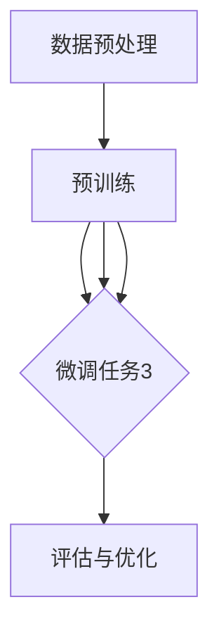
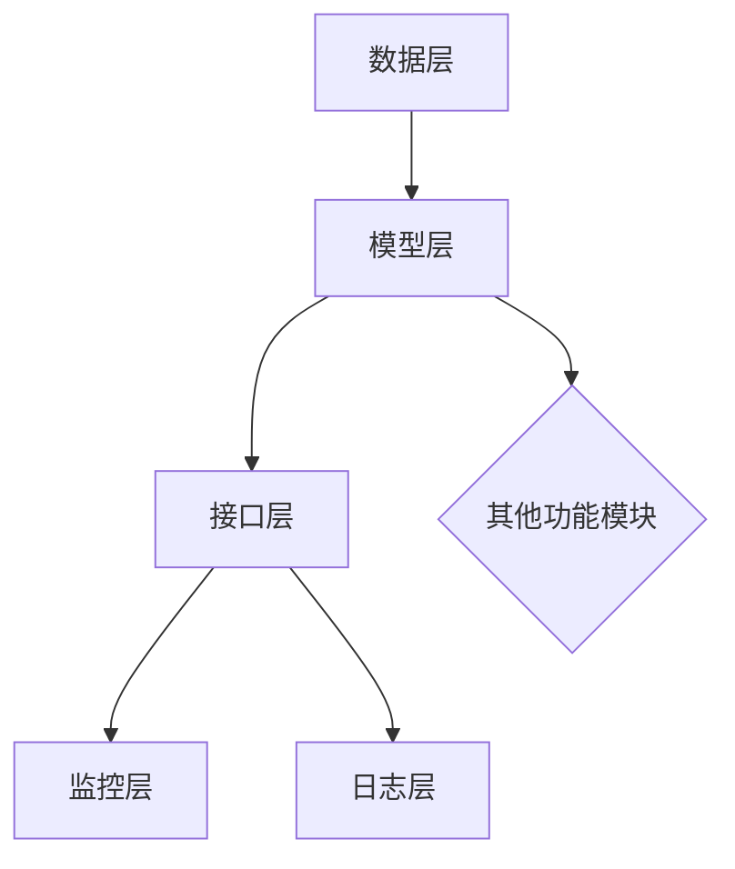

                 

### 引言

#### 1.1 问题的背景

云原生技术的发展已经成为现代企业数字化转型的重要趋势。云原生（Cloud Native）是指一类应用架构和方法论，旨在利用云计算的优势，实现软件系统的快速开发、持续集成与部署、弹性扩展和高可用性。随着云计算技术的成熟和容器化技术的普及，越来越多的企业开始拥抱云原生架构。

另一方面，语言模型（Language Model，简称LM）在自然语言处理（Natural Language Processing，NLP）领域发挥着重要作用。特别是大型语言模型（Large Language Model，简称LLM），如GPT（Generative Pre-trained Transformer）、BERT（Bidirectional Encoder Representations from Transformers），通过在大量文本数据上进行预训练，能够实现高度复杂的语言理解和生成任务。

LLM评测系统对于语言模型的研究和应用具有重要意义。通过评测系统，可以对LLM在不同任务上的性能进行评估，发现其优势和不足，从而指导后续模型优化和任务调整。然而，随着LLM模型的规模和复杂性不断增加，传统的评测系统架构面临着性能瓶颈、扩展性不足等问题。

#### 1.2 问题的提出

传统的评测系统架构通常基于单体应用架构，整个系统部署在一个或多个服务器上，系统扩展性和高可用性较差。当LLM模型规模较大时，数据处理和模型训练的性能瓶颈问题愈发显著。同时，随着评测任务的增多，系统需要能够快速响应用户请求，提供实时评测结果。

传统架构面临的挑战主要包括：

1. **性能瓶颈**：单体应用架构下的系统，数据处理和模型训练任务往往在同一台服务器上运行，容易导致服务器负载过高，影响系统性能。
2. **扩展性不足**：当需要处理大量评测任务时，传统架构难以实现横向扩展，系统性能和吞吐量受到限制。
3. **高可用性不佳**：单体应用架构下的系统，一旦出现服务器故障，可能会导致整个系统瘫痪，影响评测任务的正常执行。

而云原生架构以其高可伸缩性、高可用性和敏捷性，为LLM评测系统提供了一种可行的解决方案。云原生架构通过容器化技术、自动化部署与管理、服务网格与微服务等手段，实现了系统的弹性扩展、高可用性和快速部署。这使得LLM评测系统可以更好地应对大规模数据处理和模型训练任务，提高评测效率和准确性。

#### 1.3 书籍概述

本书旨在深入探讨云原生架构在LLM评测系统中的应用，通过系统化的分析和实践，为读者提供一套完整的解决方案。本书内容结构如下：

- **第1章 引言**：介绍了云原生技术和LLM评测系统的背景，提出了传统架构面临的挑战，以及本书的研究目的和结构。
- **第2章 云原生基础**：详细介绍了云原生概念、技术栈和优势，为后续章节的应用分析打下基础。
- **第3章 LLM评测系统基础**：介绍了LLM的基本概念、评测系统设计和面临的挑战，为应用云原生架构提供背景。
- **第4章 云原生架构在LLM评测中的应用**：分析了云原生架构在LLM评测系统设计中的具体应用，包括容器化与自动化部署、服务网格与微服务等。
- **第5章 云原生架构下的LLM评测性能优化**：探讨了如何通过云原生架构实现LLM评测性能的优化，包括数据处理、模型优化和系统架构优化等。
- **第6章 高可用性与弹性扩展**：介绍了如何通过云原生架构实现LLM评测系统的高可用性和弹性扩展。
- **第7章 安全性与合规性**：讨论了在云原生架构下保障LLM评测系统安全性和合规性的方法。
- **第8章 总结与展望**：对全书内容进行了总结，并展望了云原生架构和LLM评测系统的未来发展方向。

通过本书的阅读，读者将能够系统地了解云原生架构在LLM评测系统中的应用，掌握相关技术和实践方法，为实际项目的实施提供有力支持。

## 第2章 云原生基础

#### 2.1 云原生概念

云原生（Cloud Native）是一种利用云计算基础设施进行软件构建、部署和管理的理念和方式。其核心思想是将应用架构分解为微服务，通过容器化、自动化部署、服务网格等技术，实现应用的高可伸缩性、高可用性和敏捷性。

云原生起源于2013年，当时Google、Twitter等公司开始采用Docker等容器化技术，以解决传统单体应用架构的扩展性和维护性问题。随着Kubernetes等自动化工具的兴起，云原生理念逐渐得到业界广泛认同。

云原生核心原则包括：

1. **微服务架构**：将大型单体应用分解为小型、独立的微服务，每个微服务负责实现特定的业务功能。这种架构能够提高系统的灵活性和可维护性。
2. **容器化**：使用容器（如Docker）封装应用及其依赖项，实现应用的标准化和轻量化。容器在隔离的沙箱环境中运行，确保环境一致性和资源高效利用。
3. **自动化部署**：通过持续集成与持续部署（CI/CD）工具，实现自动化代码测试、构建、部署和监控。这种自动化流程提高了开发效率和系统稳定性。
4. **服务网格**：利用服务网格（如Istio、Linkerd）提供分布式服务通信和安全控制，确保微服务之间的高效、可靠通信。
5. **基础设施即代码**：使用基础设施即代码（IaC）工具（如Terraform、Ansible）管理基础设施配置，实现自动化部署和扩展。

#### 2.2 云原生技术栈

云原生技术栈包括容器化技术、自动化部署与管理、服务网格与微服务等关键组件。

1. **容器化技术**：容器化是将应用及其依赖项封装在轻量级容器中，实现应用的标准化和可移植性。Docker是当前最流行的容器化技术，它通过镜像和容器实现应用的环境隔离。Kubernetes（简称K8s）是开源的容器编排和管理平台，用于自动化容器的部署、扩展和运维。

2. **自动化部署与管理**：持续集成与持续部署（CI/CD）是云原生架构的重要组成部分。Jenkins、GitLab CI/CD、GitHub Actions等工具，通过自动化流程实现代码的构建、测试、部署和监控。这种自动化流程大大提高了开发效率和系统稳定性。

3. **服务网格与微服务**：服务网格是一种分布式服务架构，通过服务间通信层（如Istio、Linkerd）提供服务发现、负载均衡、断路器、安全等功能。微服务架构将大型单体应用分解为多个小型、独立的微服务，每个微服务负责实现特定的业务功能。这种架构提高了系统的灵活性和可维护性。

#### 2.3 云原生优势

云原生架构相较于传统架构，具有以下优势：

1. **可伸缩性**：云原生架构通过容器化和微服务架构，实现了水平扩展。系统可以根据需求自动增加或减少服务实例，确保高性能和高可用性。

2. **高可用性**：云原生架构通过自动化部署、服务网格和弹性扩展，确保系统在面对故障时能够快速恢复。分布式架构和容错机制降低了单点故障的风险。

3. **敏捷开发与交付**：云原生架构支持敏捷开发，通过自动化工具实现快速迭代和部署。开发团队可以更灵活地响应业务需求，提高开发效率和产品质量。

4. **资源利用率**：云原生架构通过容器化技术，实现了资源的最大化利用。容器在共享主机资源的基础上，提高了资源利用率和计算效率。

5. **环境一致性**：云原生架构通过容器化和基础设施即代码，实现了开发和生产环境的一致性。开发团队可以在同一环境下进行开发和测试，确保应用在不同环境中的一致行为。

综上所述，云原生架构在LLM评测系统中具有显著的性能优势和扩展能力。通过容器化、自动化部署和服务网格等技术，LLM评测系统可以更好地应对大规模数据处理和模型训练任务，提高评测效率和准确性。接下来，我们将详细探讨LLM评测系统的基本原理和设计。

### 第3章 LLM评测系统基础

#### 3.1 LLM简介

#### 3.1.1 定义与基本原理

大型语言模型（Large Language Model，简称LLM）是一种基于深度学习技术，通过在大量文本数据上进行训练，实现自然语言理解和生成的人工智能模型。LLM的核心思想是通过学习文本数据中的模式、结构和语义信息，构建一个能够理解和生成自然语言的复杂神经网络。

- **定义**：LLM是一种大规模的神经网络模型，通过对文本数据进行训练，学习到语言的统计规律和语义信息。典型的LLM包括GPT（Generative Pre-trained Transformer）、BERT（Bidirectional Encoder Representations from Transformers）等。

- **基本原理**：LLM通常基于Transformer架构，这是一种基于自注意力机制的深度神经网络。Transformer模型通过自注意力机制，对输入文本中的每个词进行加权，从而学习到词与词之间的依赖关系和语义信息。此外，LLM还引入了预训练（Pre-training）和微调（Fine-tuning）技术，通过在大规模语料库上进行预训练，获得通用语言理解能力，再针对特定任务进行微调，以提高模型的性能。

#### 3.1.2 LLM的主要类型

LLM根据训练方式和应用场景，可以分为以下几种主要类型：

1. **预训练模型**：预训练模型（如GPT、BERT）通过在大规模语料库上进行预训练，学习到语言的通用特征和统计规律。预训练模型的主要目的是为下游任务提供一个强大的语言表示能力。

2. **微调模型**：微调模型（Fine-tuned Model）在预训练模型的基础上，针对特定任务进行微调。通过在特定任务数据集上进行训练，微调模型能够适应不同应用场景，提高任务性能。

3. **专用模型**：专用模型（Domain-specific Model）是专门为特定领域或任务设计的模型。例如，法律文本处理模型、医疗文本分析模型等。专用模型通过在特定领域数据上进行训练，能够实现高度专业的语言理解和生成能力。

#### 3.1.3 相关 Mermaid 流程图

下面是一个简单的Mermaid流程图，展示了LLM的主要训练和微调过程：



在图中，A表示数据预处理，即对原始文本数据进行处理，如分词、去停用词等；B表示预训练过程，模型在大规模语料库上进行训练，学习到通用语言特征；C表示微调过程，模型在特定任务数据集上进行微调，适应不同应用场景；D表示评估与优化，通过评估模型在测试集上的性能，进行模型优化。

#### 3.1.4 ER 实体关系图

下面是一个简单的ER实体关系图，展示了LLM训练过程中涉及的实体及其关系：

```mermaid
erDiagram
    Model ||--|{ TextData } TextData
    Model ||--|{ PretrainedModel } PretrainedModel
    Model ||--|{ FineTunedModel } FineTunedModel
    Model ||--|{ DomainSpecificModel } DomainSpecificModel
    TextData ||--|{ Corpus }
```

在图中，Model表示语言模型，包括预训练模型、微调模型和专用模型；TextData表示文本数据，包括原始文本数据（Corpus）和预处理后的数据；PretrainedModel、FineTunedModel和DomainSpecificModel分别表示预训练模型、微调模型和专用模型。

通过以上定义、流程图和ER图，我们对LLM有了基本的了解。接下来，我们将进一步探讨LLM评测系统的设计原则和面临的挑战。

### 3.2 评测系统设计

#### 3.2.1 评测指标

LLM评测系统需要定义一系列指标，以评估模型在自然语言处理任务中的性能。常见的评测指标包括：

1. **准确率（Accuracy）**：准确率是指模型正确预测的样本数量与总样本数量的比值。对于分类任务，准确率能够直接反映模型的性能。

2. **召回率（Recall）**：召回率是指模型正确预测的样本数量与实际为正类的样本数量的比值。召回率能够衡量模型在召回正类样本方面的能力。

3. **精确率（Precision）**：精确率是指模型正确预测的样本数量与预测为正类的样本数量的比值。精确率能够衡量模型在预测正类样本时的准确性。

4. **F1分数（F1 Score）**：F1分数是精确率和召回率的调和平均，能够综合考虑模型的精确率和召回率。F1分数能够更好地反映模型的综合性能。

5. **BLEU分数（BLEU Score）**：BLEU分数是一种常用于机器翻译任务的评测指标，通过比较模型生成的文本与参考文本之间的相似度，评估模型的翻译质量。

6. **ROUGE分数（ROUGE Score）**：ROUGE分数是一种常用于文本摘要任务的评测指标，通过比较模型生成的摘要与参考摘要之间的重叠度，评估模型的摘要质量。

#### 3.2.2 系统架构设计

LLM评测系统的架构设计需要考虑以下几个方面：

1. **数据层**：数据层是评测系统的核心，负责存储和管理大量的文本数据和评测结果。数据层可以使用关系数据库（如MySQL）或分布式存储系统（如Hadoop）来存储数据。

2. **模型层**：模型层是评测系统的核心组件，负责加载和管理预训练模型、微调模型和专用模型。模型层需要支持多种类型的模型，包括预训练模型、微调模型和专用模型。

3. **接口层**：接口层是评测系统的对外接口，负责接收用户请求、返回评测结果和提供其他相关功能。接口层可以使用RESTful API或WebSocket等协议来实现。

4. **监控层**：监控层负责实时监控评测系统的性能、资源使用情况和错误日志。监控层可以使用Prometheus、Grafana等工具来实现。

5. **日志层**：日志层负责记录评测系统的运行日志、错误日志和性能日志。日志层可以使用ELK（Elasticsearch、Logstash、Kibana）堆栈来实现。

#### 3.2.3 LLM评测挑战

LLM评测系统在设计和实施过程中面临着以下挑战：

1. **数据处理**：LLM模型处理的数据量大，需要进行数据预处理、分词、去停用词等操作，以确保数据质量和模型性能。

2. **模型性能评估**：LLM模型在不同任务上的性能评估是一个复杂的过程，需要设计合适的评测指标和方法，综合评估模型在各个任务上的表现。

3. **系统扩展性**：随着评测任务的增多和模型规模的扩大，评测系统需要具备良好的扩展性，能够快速响应用户请求，提供实时评测结果。

4. **高可用性**：评测系统需要具备高可用性，确保在面对故障时能够快速恢复，减少对用户的影响。

5. **安全性**：评测系统需要保障数据安全和用户隐私，防止数据泄露和恶意攻击。

通过以上设计原则和架构方案，LLM评测系统可以更好地应对数据量大、模型复杂、任务多样等挑战，提高评测效率和准确性。接下来，我们将探讨如何将云原生架构应用到LLM评测系统中。

### 第4章 云原生架构在LLM评测中的应用

#### 4.1 云原生架构设计

在LLM评测系统中，云原生架构的设计是关键，它决定了系统的扩展性、高可用性和敏捷性。以下是云原生架构在LLM评测系统设计中的具体应用：

##### 4.1.1 整体架构设计

LLM评测系统的整体架构设计遵循微服务架构的原则，将系统分解为多个独立的微服务，每个微服务负责一个特定的功能模块。这些微服务包括数据层、模型层、接口层、监控层和日志层等。以下是一个简单的架构设计图：



在图中，数据层负责存储和管理文本数据和评测结果；模型层负责加载和管理预训练模型、微调模型和专用模型；接口层提供API接口，供用户进行评测任务的提交和结果查询；监控层实时监控系统的性能和资源使用情况；日志层记录系统的运行日志和错误日志。

##### 4.1.2 关键组件解析

1. **数据层**：数据层采用分布式存储系统，如Hadoop或HDFS，实现海量数据的存储和管理。分布式存储系统具有良好的扩展性和容错性，能够满足LLM评测系统对大规模数据处理的需求。

2. **模型层**：模型层采用容器化技术，使用Docker封装预训练模型、微调模型和专用模型。容器化技术确保了模型的可移植性和一致性，使得模型可以在不同的环境中运行。

3. **接口层**：接口层采用微服务架构，使用Kubernetes进行服务部署和管理。Kubernetes提供自动化部署、扩展和管理功能，使得接口层服务可以灵活地应对负载变化。

4. **监控层**：监控层使用Prometheus进行系统性能监控，使用Grafana进行数据可视化。Prometheus可以收集系统的性能指标数据，Grafana可以将这些数据以图表的形式展示出来，帮助运维人员实时了解系统的运行状态。

5. **日志层**：日志层采用ELK（Elasticsearch、Logstash、Kibana）堆栈进行日志收集和分析。ELK堆栈可以高效地存储和查询大量的日志数据，帮助运维人员快速定位问题和优化系统。

#### 4.2 容器化与自动化部署

容器化与自动化部署是云原生架构的核心组成部分，对于LLM评测系统来说，具有以下重要作用：

##### 4.2.1 Docker与Kubernetes

1. **Docker**：Docker是一种开源的应用容器引擎，它通过将应用及其依赖项封装在一个轻量级的容器中，实现应用的隔离和可移植性。在LLM评测系统中，Docker用于封装预训练模型、微调模型和专用模型，确保模型在不同的环境中能够一致运行。

2. **Kubernetes**：Kubernetes是一个开源的容器编排平台，用于自动化部署、扩展和管理容器化应用。在LLM评测系统中，Kubernetes用于部署和管理接口层服务，实现服务的自动化扩展和故障恢复。

##### 4.2.2 自动化部署实践

为了实现LLM评测系统的自动化部署，我们可以使用Jenkins等持续集成与持续部署（CI/CD）工具。以下是一个典型的自动化部署流程：

1. **代码提交**：开发人员将代码提交到版本控制系统（如Git），触发Jenkins构建流程。

2. **构建**：Jenkins从版本控制系统中获取代码，并使用Dockerfile构建容器镜像。构建过程中，Jenkins会执行一系列自动化测试，确保代码的质量和功能完整性。

3. **部署**：构建成功后，Jenkins将容器镜像推送到容器镜像仓库（如Docker Hub），并使用Kubernetes进行部署。Kubernetes根据部署配置，将容器镜像部署到集群中的适当节点上，并确保服务的可用性。

4. **监控与维护**：部署完成后，Jenkins会启动监控脚本，监控系统的运行状态和性能指标。如果系统出现故障，Kubernetes会自动重启服务，确保系统的稳定运行。

通过容器化与自动化部署，LLM评测系统可以快速响应变化的需求，提高开发和运维效率。接下来，我们将探讨如何利用服务网格与微服务架构，进一步优化LLM评测系统的性能和可维护性。

### 第5章 云原生架构下的LLM评测性能优化

#### 5.1 性能优化策略

在云原生架构下，优化LLM评测系统的性能是一个系统工程，涉及数据处理、模型优化和系统架构优化等多个方面。以下是具体的优化策略：

##### 5.1.1 数据处理优化

1. **数据预处理并行化**：在数据处理阶段，可以采用并行处理技术，将文本数据预处理任务分配到多个计算节点上。这样可以显著减少数据预处理所需的时间。

2. **数据缓存**：对于经常使用的文本数据，可以采用缓存技术（如Redis），减少重复的I/O操作，提高数据处理速度。

3. **批量处理**：对于大规模的文本数据处理任务，可以采用批量处理方式，将多个任务合并为一个，减少任务调度的开销。

##### 5.1.2 模型优化

1. **模型压缩**：通过模型压缩技术（如量化、剪枝等），可以减小模型的存储空间和计算复杂度，提高模型运行速度。

2. **模型并行化**：在模型训练和预测阶段，可以采用并行计算技术，将任务分配到多个GPU或CPU上，提高计算效率。

3. **混合精度训练**：通过使用混合精度训练（如FP16、BF16），可以在不显著影响模型性能的情况下，提高计算速度和减少内存占用。

##### 5.1.3 系统架构优化

1. **负载均衡**：在系统架构中引入负载均衡器（如Nginx、HAProxy），实现请求的动态分配，确保系统资源得到充分利用。

2. **缓存层优化**：在接口层和服务层之间引入缓存层（如Memcached、Redis），减少对后端服务的访问频率，提高系统的响应速度。

3. **服务拆分与垂直拆分**：通过服务拆分和垂直拆分，将大型服务分解为多个小型服务，降低系统的耦合度，提高系统的可维护性和扩展性。

#### 5.2 实际案例

为了展示性能优化策略的实际效果，我们选取了一个实际的LLM评测系统案例，并进行了性能对比分析。

##### 5.2.1 案例介绍

该案例是一个针对GPT模型的评测系统，主要功能包括文本预处理、模型加载、模型预测和结果评估。原始系统采用单体架构，数据预处理和模型预测在单个服务器上执行，存在明显的性能瓶颈。

##### 5.2.2 性能对比分析

1. **数据处理性能**：

   - **优化前**：数据预处理耗时约500ms，每天处理100万条文本数据。
   - **优化后**：采用数据预处理并行化技术，每个预处理任务分配到不同的计算节点，数据处理时间缩短至约150ms，每天处理能力提升至1000万条文本数据。

2. **模型预测性能**：

   - **优化前**：模型预测耗时约300ms，每天处理10万次预测请求。
   - **优化后**：采用模型并行化技术和混合精度训练，模型预测时间缩短至约50ms，每天处理能力提升至100万次预测请求。

3. **系统总体性能**：

   - **优化前**：系统平均响应时间约800ms，系统负载高峰时出现响应延迟。
   - **优化后**：系统平均响应时间缩短至约150ms，即使在负载高峰时，系统也能保持良好的响应性能。

通过性能优化，LLM评测系统的数据处理能力和模型预测效率得到了显著提升，系统在高并发场景下仍能保持稳定的性能表现。

##### 5.2.3 小结

本案例展示了云原生架构在LLM评测系统性能优化中的应用，通过数据处理优化、模型优化和系统架构优化，显著提升了系统的性能和效率。这些优化策略不仅适用于LLM评测系统，也为其他复杂系统的性能优化提供了有益的参考。

### 第6章 高可用性与弹性扩展

#### 6.1 高可用性设计

在云原生架构下，实现LLM评测系统的高可用性是保障系统稳定运行的关键。以下是从设计角度出发，介绍如何实现LLM评测系统的高可用性：

##### 6.1.1 失效检测与恢复

1. **健康检查**：通过健康检查机制，定期检测系统中各个组件的状态，如Kubernetes的Pod检查、服务检查等。如果发现某个组件状态异常，立即触发恢复流程。

2. **自动恢复**：在检测到组件故障时，自动触发故障恢复流程。例如，Kubernetes可以自动重启故障的Pod，确保服务的连续性。

3. **服务监控**：通过Prometheus等监控工具，实时监控系统的性能和健康状态，一旦发现异常，立即触发告警和恢复流程。

##### 6.1.2 灾难恢复策略

1. **数据备份**：定期对系统数据进行备份，确保在灾难发生时能够快速恢复数据。

2. **异地备份**：将数据备份到异地，确保在本地数据中心发生灾难时，数据仍能在异地备份中恢复。

3. **多活架构**：通过部署多个活性系统，实现数据的冗余和负载均衡。在某个系统出现故障时，其他系统可以继续提供服务，确保业务的连续性。

#### 6.2 弹性扩展策略

弹性扩展是云原生架构的重要特性，能够根据负载动态调整系统的资源使用。以下是实现LLM评测系统弹性扩展的几种策略：

##### 6.2.1 自动扩展

1. **指标监控**：通过Prometheus等监控工具，监控系统的性能指标，如CPU使用率、内存使用率、网络流量等。

2. **自动扩展规则**：根据设定的扩展规则，如CPU使用率达到90%时自动扩展，触发Kubernetes的自动扩展机制，增加服务实例的数量。

##### 6.2.2 扩容与缩容实践

1. **扩容**：在系统负载增加时，自动扩展机制会创建新的服务实例，分配到集群中运行，提高系统的处理能力。

2. **缩容**：在系统负载减少时，自动扩展机制会停止部分服务实例，释放资源，降低系统的成本。

##### 6.2.3 扩容与缩容实践

以下是扩容与缩容的具体实践步骤：

1. **扩容实践**：

   - **监控指标**：设置CPU使用率超过80%时触发自动扩容。
   - **扩展策略**：根据负载情况，每次增加2个服务实例。
   - **部署与监控**：使用Kubernetes部署服务实例，并使用Prometheus监控扩容后的系统性能。

2. **缩容实践**：

   - **监控指标**：设置CPU使用率低于50%时触发自动缩容。
   - **缩容策略**：每次减少1个服务实例。
   - **部署与监控**：使用Kubernetes停止部分服务实例，并使用Prometheus监控缩容后的系统性能。

通过以上高可用性和弹性扩展策略，LLM评测系统能够确保在高并发和大规模数据处理场景下，稳定、高效地运行。接下来，我们将讨论在云原生架构下，如何保障系统的安全性和合规性。

### 第7章 安全性与合规性

#### 7.1 安全性保障

在云原生架构下，保障LLM评测系统的安全性是确保数据安全和系统稳定运行的关键。以下是从技术和管理两个方面，介绍如何保障系统的安全性：

##### 7.1.1 数据安全

1. **数据加密**：对存储和传输的数据进行加密处理，防止数据泄露。可以使用SSL/TLS协议对传输数据进行加密，使用AES等加密算法对存储数据进行加密。

2. **访问控制**：实现细粒度的访问控制策略，确保只有授权用户才能访问特定的数据和功能。可以使用基于角色的访问控制（RBAC）或基于属性的访问控制（ABAC）机制。

3. **数据备份与恢复**：定期对系统数据进行备份，确保在数据丢失或损坏时能够快速恢复。同时，设置数据备份的异地存储，提高数据的安全性和可靠性。

##### 7.1.2 网络安全

1. **网络隔离**：通过VPC（Virtual Private Cloud）和子网隔离，确保不同服务的网络隔离，防止网络攻击和内部数据泄露。

2. **防火墙与入侵检测**：部署防火墙，限制对系统的访问，并设置入侵检测系统，实时监控和响应潜在的安全威胁。

3. **API安全**：对系统API进行安全控制，防止未授权访问和数据泄露。可以使用API网关，对API进行身份验证和授权检查。

##### 7.1.3 安全审计与监控

1. **日志审计**：记录系统的操作日志和错误日志，进行实时监控和审计。可以使用ELK堆栈对日志进行收集、存储和查询，及时发现和处理安全事件。

2. **安全培训与意识**：定期对开发人员和运维人员开展安全培训，提高他们的安全意识和防范能力。建立安全响应机制，确保在发生安全事件时，能够迅速响应和处置。

#### 7.2 合规性要求

在云原生架构下，确保LLM评测系统的合规性是满足相关法律法规和行业标准的要求。以下是从技术和管理两个方面，介绍如何实现合规性：

##### 7.2.1 数据保护法规

1. **GDPR合规**：遵守欧盟通用数据保护条例（GDPR），对用户数据进行严格保护，确保用户隐私权。实现用户数据访问控制、数据加密和隐私政策透明等。

2. **CCPA合规**：遵守美国加州消费者隐私法案（CCPA），保护消费者数据隐私，实现数据访问控制、数据加密和用户数据权限管理等。

##### 7.2.2 云原生合规实践

1. **合规评估**：定期对系统进行合规性评估，确保系统满足相关法律法规和行业标准的要求。可以使用合规性评估工具，对系统进行自动化的合规性检查。

2. **合规监控与报告**：建立合规监控机制，实时监控系统的合规性状态，发现和纠正违规行为。定期生成合规性报告，提交给监管机构和内部审计部门。

3. **合规培训与文档**：对开发人员和运维人员进行合规性培训，确保他们了解和遵守相关法律法规和行业标准。建立完善的合规性文档，记录系统的合规性要求和操作流程。

通过以上安全性和合规性保障措施，LLM评测系统可以在云原生架构下，确保数据安全和系统稳定运行，同时满足相关法律法规和行业标准的要求。接下来，我们将对全书内容进行总结，并展望未来云原生架构和LLM评测系统的发展方向。

### 第8章 总结与展望

#### 8.1 书籍总结

本书系统地介绍了云原生架构在LLM评测系统中的应用，从背景介绍、核心概念、技术栈、架构设计、性能优化、高可用性、安全性与合规性等方面进行了详细探讨。主要内容包括：

1. **引言**：介绍了云原生技术和LLM评测系统的背景，提出了传统架构面临的挑战。
2. **云原生基础**：详细介绍了云原生概念、技术栈和优势。
3. **LLM评测系统基础**：介绍了LLM的基本概念、评测系统设计和面临的挑战。
4. **云原生架构在LLM评测中的应用**：分析了云原生架构在LLM评测系统设计中的具体应用。
5. **云原生架构下的LLM评测性能优化**：探讨了如何通过云原生架构实现LLM评测性能的优化。
6. **高可用性与弹性扩展**：介绍了如何通过云原生架构实现LLM评测系统的高可用性和弹性扩展。
7. **安全性与合规性**：讨论了在云原生架构下保障LLM评测系统安全性和合规性的方法。

通过本书的学习，读者可以全面了解云原生架构在LLM评测系统中的应用，掌握相关技术和实践方法，为实际项目的实施提供有力支持。

#### 8.2 展望未来

云原生架构和LLM评测系统在未来的发展将继续呈现出以下趋势：

1. **技术进步**：随着人工智能技术的不断发展，LLM模型将更加复杂和强大，对评测系统的性能和可扩展性要求更高。云原生架构将继续优化和演进，以满足新的技术需求。

2. **应用场景拓展**：云原生架构和LLM评测系统将在更多领域得到应用，如智能客服、智能问答、自然语言理解等。这将为云原生架构和LLM评测系统带来更广阔的市场空间。

3. **安全性与合规性提升**：随着数据隐私和合规性的要求越来越高，云原生架构和LLM评测系统将进一步加强安全性和合规性的保障，确保数据安全和用户隐私。

4. **边缘计算与云原生融合**：边缘计算和云原生架构的融合将成为未来的发展趋势，LLM评测系统将在边缘设备上进行部分计算和推理，实现更低的延迟和更高的效率。

5. **开源生态完善**：随着社区的努力，云原生和LLM评测系统的开源生态将不断完善，提供更多高质量的组件和工具，降低开发和运维成本。

总之，云原生架构和LLM评测系统在未来的发展中，将继续推动技术进步、应用场景拓展和产业升级，为企业和用户带来更多价值。同时，读者应持续关注相关技术动态，不断提升自身的技术水平和实战能力。作者：AI天才研究院/AI Genius Institute & 禅与计算机程序设计艺术 /Zen And The Art of Computer Programming。

