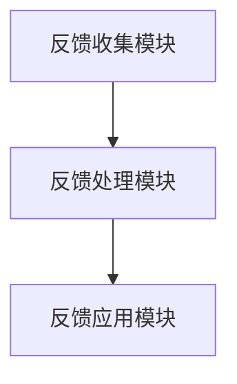
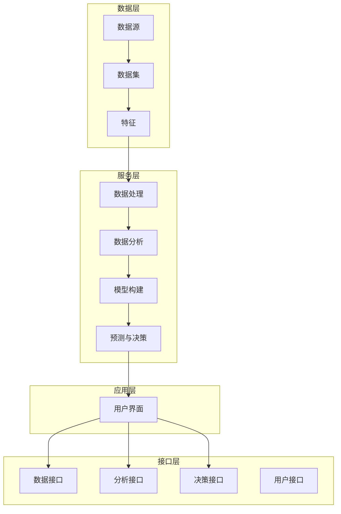
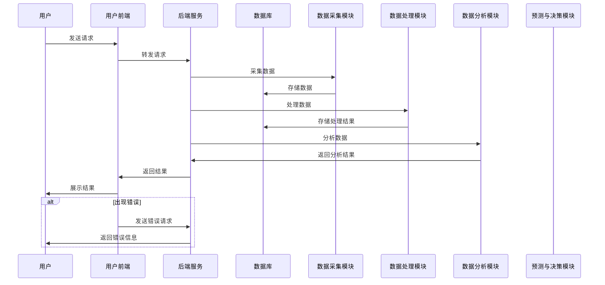

                 

# 引言

## 1.1 人机协作与AI系统概述

### 1.1.1 人机协作的定义与发展历程

人机协作是指人类与机器系统之间通过交流与互动，共同完成某项任务或实现某种目标的过程。这种协作方式不仅能够发挥人类的创造力和灵活性，还能利用机器的计算能力和效率，实现优势互补。

人机协作的发展历程可以追溯到20世纪中期，随着计算机技术的迅猛发展，人机交互技术逐渐成熟。从早期的命令行界面，到图形用户界面（GUI），再到如今的自然语言处理和增强现实技术，人机协作经历了多个阶段的发展。

### 1.1.2 AI系统的人类反馈机制

AI系统的人类反馈机制是指通过人类用户对AI系统输出结果的评价和反馈，来不断优化和改进AI系统的性能。这种反馈机制是AI系统从数据驱动到知识驱动的关键环节。

随着深度学习和神经网络技术的崛起，AI系统的能力得到了极大的提升。然而，AI系统在处理复杂任务时，往往缺乏对人类需求和意图的深刻理解。人类反馈机制能够帮助AI系统更好地理解人类需求，提高系统的智能水平。

### 1.1.3 人机协作与AI系统融合的重要性

人机协作与AI系统的融合具有非常重要的意义。首先，这种融合能够实现人类和机器的优势互补，提高任务完成的效率和准确性。其次，通过人类反馈机制，AI系统能够不断学习和进化，提升自身的智能水平。此外，人机协作与AI系统的融合还能够推动人工智能技术的发展，为人类创造更多价值。

## 1.2 增强AI系统的人类反馈机制的必要性

### 1.2.1 当前AI系统存在的问题

尽管AI系统在许多领域取得了显著成果，但仍然存在一些问题。首先，AI系统在处理复杂任务时，往往缺乏对人类需求和意图的深刻理解。这导致了AI系统在一些特定场景下无法达到预期的性能。其次，AI系统的黑箱特性使得其决策过程难以解释，缺乏透明度。这使得用户难以信任和接受AI系统。

### 1.2.2 人类反馈机制的作用

人类反馈机制能够帮助AI系统更好地理解人类需求和意图，提高系统的智能水平。具体来说，人类反馈机制具有以下作用：

1. **提高系统性能**：通过收集和分析人类用户对AI系统输出结果的评价，可以不断优化AI系统的算法和模型，提高系统的性能和准确性。
2. **增强系统透明度**：人类反馈机制可以帮助揭示AI系统的决策过程，提高系统的透明度，增强用户对AI系统的信任。
3. **促进系统进化**：通过不断收集人类用户的反馈，AI系统可以不断学习和进化，适应更广泛的应用场景。

### 1.2.3 增强AI系统的人类反馈机制的挑战

尽管人类反馈机制在AI系统中具有重要作用，但在实际应用中，仍然面临一些挑战。首先，人类反馈的质量和可靠性难以保证。人类用户的评价可能受到主观因素的影响，导致反馈数据不准确。其次，如何有效地处理和分析大量的人类反馈数据，也是一项挑战。此外，如何将人类反馈融入AI系统的训练和优化过程中，确保系统性能的持续提升，也是一个需要深入研究的问题。

## 1.3 书籍结构安排与学习目标

本书旨在系统地介绍人机协作与AI系统的人类反馈机制，旨在帮助读者深入理解这一领域的核心概念、算法原理和实际应用。全书分为四个部分，共八个章节。

### 1.3.1 各章节的主要内容与学习目标

- **第一部分：引言**：介绍人机协作与AI系统的人类反馈机制的基本概念、背景、问题和解决思路。
- **第二部分：核心概念与联系**：详细阐述人机协作与AI系统的人类反馈机制的核心概念，使用表格和Mermaid图来展示概念之间的联系。
- **第三部分：算法原理讲解**：介绍人机协作与AI系统的人类反馈机制的基础算法，使用Mermaid流程图和Python源代码详细讲解。
- **第四部分：数学模型和公式**：给出相关数学模型和公式，使用LaTeX格式书写，并进行详细讲解和举例说明。
- **第五部分：系统分析与架构设计**：介绍系统分析和架构设计的流程，使用Mermaid图展示领域模型、系统架构和系统接口设计。
- **第六部分：项目实战**：展示一个实际项目，包括环境安装、系统核心实现、代码应用解读和分析。
- **第七部分：最佳实践、小结与拓展阅读**：总结全书内容，提供最佳实践建议，指出注意事项，推荐拓展阅读材料。

### 1.3.2 阅读指南与学习方法

本书适合具有计算机科学和人工智能背景的读者阅读。在阅读过程中，建议读者按照以下方法进行学习：

1. **先通读全书，把握整体框架**：通过阅读全书，了解人机协作与AI系统的人类反馈机制的核心概念、算法原理和应用场景。
2. **重点阅读各章节，深入学习**：在理解全书框架的基础上，重点阅读各章节，深入学习核心概念、算法原理和实际应用。
3. **结合代码和实例进行分析**：通过阅读代码和实例，深入了解算法原理和应用方法。
4. **实践与思考**：在实际项目中应用所学知识，进行实践和思考，巩固所学内容。

通过本书的学习，读者将能够系统地掌握人机协作与AI系统的人类反馈机制的核心知识，为实际应用打下坚实基础。

## 1.4 人机协作与AI系统的关系

人机协作与AI系统之间存在着密切的联系。首先，人机协作是AI系统的重要组成部分，通过人与机器的互动，AI系统可以更好地理解人类的需求和意图。其次，AI系统为人类提供了强大的工具和平台，使得人机协作能够更加高效和智能。

人机协作与AI系统的融合，使得AI系统在许多领域得到了广泛应用。例如，在医疗领域，AI系统可以辅助医生进行诊断和治疗，提高医疗效率；在金融领域，AI系统可以分析大量数据，帮助投资者做出更明智的决策；在工业制造领域，AI系统可以优化生产流程，提高生产效率。

总之，人机协作与AI系统的融合，不仅推动了人工智能技术的发展，也为人类带来了诸多便利和价值。在人机协作与AI系统的未来发展中，人类反馈机制将发挥越来越重要的作用，为AI系统提供更加精准和可靠的指导。

## 1.5 本书的目标与结构

本书的目标是系统地介绍人机协作与AI系统的人类反馈机制，旨在帮助读者深入理解这一领域的核心概念、算法原理和实际应用。通过本书的学习，读者将能够：

1. **掌握人机协作与AI系统的基本概念**：了解人机协作的发展历程、核心要素和类型，以及AI系统的人类反馈机制的定义、作用和实现方式。
2. **理解人机协作与AI系统的联系**：明确人机协作与AI系统之间的关系，以及它们在各个领域中的应用。
3. **掌握人机协作与AI系统的算法原理**：学习人机协作和人类反馈机制的基础算法，包括算法原理、数学模型和Python源代码实现。
4. **学会系统分析与架构设计**：掌握系统分析和架构设计的方法，包括领域模型、系统架构、系统接口设计和系统交互。
5. **具备项目实战能力**：通过实际项目，了解人机协作与AI系统的实际应用，包括环境安装、系统核心实现、代码应用解读和分析。
6. **培养最佳实践和拓展阅读能力**：总结全书内容，提供最佳实践建议，指出注意事项，推荐拓展阅读材料。

本书分为四个部分，共八个章节。每个章节都按照以下结构进行组织：

- **章节标题**：简洁明了地概括章节内容。
- **核心关键词**：列出章节的核心关键词，便于读者快速了解章节主题。
- **摘要**：简要介绍章节的核心内容和主题思想，帮助读者快速把握章节重点。
- **正文内容**：详细阐述章节的主题，包括背景介绍、核心概念与联系、算法原理讲解、数学模型和公式、系统分析与架构设计、项目实战、最佳实践、小结与拓展阅读等内容。
- **作者信息**：在文章末尾附上作者信息，包括作者所属机构和著作。

通过这种结构化的组织方式，本书旨在为读者提供系统、全面的学习材料，帮助读者深入理解人机协作与AI系统的人类反馈机制。

## 1.6 小结

在本章中，我们介绍了人机协作与AI系统的基本概念、背景、问题和解决思路。通过详细阐述人机协作和AI系统的人类反馈机制，我们揭示了它们在各个领域中的应用和价值。同时，本书的结构安排和学习目标也为读者提供了一个清晰的学习路径。在接下来的章节中，我们将逐步深入探讨人机协作与AI系统的核心概念、算法原理、系统分析与架构设计、项目实战以及最佳实践等内容。希望通过本书的学习，读者能够系统地掌握人机协作与AI系统的人类反馈机制，为未来的研究和实践打下坚实基础。# 核心概念与联系

## 2.1 人机协作的关键概念

### 2.1.1 人机协作的基本要素

人机协作的基本要素包括：人类参与者、机器系统、任务目标和协作模式。其中，人类参与者是协作的主体，负责提出任务需求、提供反馈和进行决策。机器系统是协作的客体，负责执行任务、提供信息和反馈。任务目标是协作的驱动力，协作模式是协作的具体实现方式。

### 2.1.2 人机协作的模式与类型

人机协作的模式主要包括命令式协作、反馈式协作和合作式协作。命令式协作是指人类参与者直接向机器系统下达命令，机器系统按照命令执行任务。反馈式协作是指机器系统执行任务后，向人类参与者反馈结果，人类参与者根据反馈进行决策和调整。合作式协作是指人类参与者和机器系统共同完成任务，相互协作、相互依赖。

### 2.1.3 人机协作的优势与挑战

人机协作的优势在于能够充分发挥人类和机器的优势，提高任务完成的效率和准确性。人类具有丰富的经验和创造力，能够对任务进行灵活调整和优化；机器具有强大的计算能力和精确性，能够处理大量数据和复杂计算。然而，人机协作也面临一些挑战，如沟通障碍、协同困难、信任问题等。

## 2.2 AI系统的人类反馈机制

### 2.2.1 人类反馈机制的定义与作用

人类反馈机制是指通过人类用户对AI系统输出结果的评价和反馈，来不断优化和改进AI系统的性能。其作用主要包括：提高系统性能、增强系统透明度、促进系统进化。

### 2.2.2 反馈机制的实现方式

反馈机制的实现方式主要包括：显式反馈和隐式反馈。显式反馈是指用户直接对AI系统的输出结果进行评价和打分，如评分、点赞等。隐式反馈是指用户在交互过程中通过行为和反馈数据来间接表达对AI系统的评价，如点击率、停留时间等。

### 2.2.3 反馈机制的评估方法

反馈机制的评估方法主要包括：定量评估和定性评估。定量评估是通过计算用户反馈数据的相关指标来评估反馈机制的效果，如准确率、召回率等。定性评估是通过用户调研、访谈等方式来分析反馈机制对用户满意度的影响。

## 2.3 概念联系与关系图

### 2.3.1 人机协作与AI系统的人类反馈机制的联系

人机协作与AI系统的人类反馈机制之间存在着密切的联系。人机协作是AI系统的人类反馈机制的基础，而AI系统的人类反馈机制是人机协作的重要组成部分。具体来说，人类参与者在人机协作过程中，通过提供任务需求和反馈，促使AI系统不断优化和进化。

### 2.3.2 概念属性特征对比表格

| 概念                | 人机协作                    | AI系统的人类反馈机制                     |
|---------------------|-----------------------------|----------------------------------------|
| 定义                | 人类与机器系统之间的协作    | 通过人类反馈优化AI系统性能               |
| 基本要素            | 人类参与者、机器系统、任务目标 | 人类反馈、AI系统输出结果                 |
| 协作模式            | 命令式、反馈式、合作式       | 显式反馈、隐式反馈                     |
| 优势                | 提高效率、增强准确性        | 提高性能、增强透明度、促进进化           |
| 挑战                | 沟通障碍、协同困难、信任问题 | 反馈质量、处理和分析、融入训练和优化过程 |

### 2.3.3 ER实体关系图架构的Mermaid流程图

```mermaid
entityRelation
  direction TB
  nodeA [人机协作]
  nodeB [AI系统的人类反馈机制]
  nodeA1 [基本要素]
  nodeA2 [协作模式]
  nodeA3 [优势]
  nodeA4 [挑战]
  nodeB1 [反馈机制]
  nodeB2 [输出结果]
  nodeB3 [评估方法]
  nodeA1..nodeB1 [数据交互]
  nodeA2..nodeB2 [互动过程]
  nodeA3..nodeB3 [性能优化]
  nodeA4..nodeB1 [挑战应对]
```

通过上述Mermaid流程图，我们可以清晰地看到人机协作与AI系统的人类反馈机制之间的联系和交互过程。人机协作通过提供任务需求和反馈，促使AI系统不断优化和进化，实现人机协作与AI系统的人类反馈机制的深度融合。

## 2.4 人机协作与AI系统的人类反馈机制的联系与融合

### 2.4.1 融合的意义

人机协作与AI系统的人类反馈机制的融合，对于提升AI系统的智能化水平具有重要意义。通过人机协作，AI系统能够更好地理解人类的需求和意图，从而实现更精准的决策和更高效的执行。而通过人类反馈机制，AI系统能够不断学习和优化，提高自身的性能和适应性。

### 2.4.2 融合的实现方式

实现人机协作与AI系统的人类反馈机制的融合，需要从以下几个方面入手：

1. **设计统一的接口**：确保人机协作和人类反馈机制能够无缝对接，实现数据的高效传递和交互。
2. **构建反馈循环**：通过实时反馈，使AI系统能够迅速调整和优化，以适应不断变化的需求。
3. **引入人类知识**：将人类专家的经验和知识融入AI系统，提高系统的智能水平。
4. **优化算法模型**：根据人类反馈，调整算法模型，提高AI系统的准确性和适应性。

### 2.4.3 融合的优势

融合人机协作与AI系统的人类反馈机制，具有以下优势：

1. **提高决策准确性**：通过人类反馈，AI系统能够更好地理解人类需求，提高决策的准确性。
2. **增强系统透明度**：通过显式和隐式反馈，用户可以更清晰地了解AI系统的决策过程，增强系统的透明度。
3. **促进系统进化**：通过不断收集和利用人类反馈，AI系统能够持续学习和进化，提高系统的适应性和智能化水平。
4. **优化人机交互**：通过融合人机协作和人类反馈机制，可以优化人机交互体验，提高用户的满意度和信任度。

### 2.4.4 融合的挑战

尽管融合人机协作与AI系统的人类反馈机制具有显著优势，但在实际应用中仍面临一些挑战：

1. **反馈质量**：人类反馈的质量和可靠性难以保证，可能受到主观因素的影响。
2. **数据处理**：如何有效地处理和分析大量的人类反馈数据，是另一个挑战。
3. **系统集成**：如何将人机协作和人类反馈机制融入现有的AI系统，确保系统的稳定性和性能，也是一个需要解决的问题。
4. **隐私保护**：在收集和处理人类反馈数据时，如何保护用户的隐私，是一个重要的伦理问题。

总之，人机协作与AI系统的人类反馈机制的融合，既带来了新的机遇，也带来了新的挑战。通过不断探索和实践，我们有理由相信，这一融合将为AI系统的发展注入新的动力，推动人工智能技术的进一步进步。

## 2.5 人类反馈机制在AI系统中的应用案例

### 2.5.1 案例一：医疗诊断系统

在医疗领域，AI系统被广泛应用于辅助医生进行疾病诊断。通过收集和分析患者的病历、影像等数据，AI系统可以提供初步的诊断结果。然而，由于医疗诊断的复杂性和高风险性，AI系统的诊断结果需要经过医生的审核和确认。在这个过程中，人类反馈机制发挥了重要作用。医生根据AI系统的诊断结果，结合自己的临床经验和专业知识，对诊断结果进行修正和优化，从而提高诊断的准确性和可靠性。

### 2.5.2 案例二：自动驾驶系统

在自动驾驶领域，人类反馈机制被用于监控和评估自动驾驶系统的表现。通过收集驾驶过程中的传感器数据、驾驶行为数据等，AI系统可以实时分析自动驾驶系统的性能。然而，自动驾驶系统的决策过程需要经过人类驾驶员的审核和反馈。驾驶员通过实时反馈，可以指出AI系统在决策过程中的不足和错误，从而帮助AI系统不断优化和改进。

### 2.5.3 案例三：智能家居系统

在智能家居领域，人类反馈机制被用于优化家居设备的运行效率和用户体验。智能家居系统通过收集用户的日常行为数据，如开关灯、调节温度、使用家电等，可以自动调整家居设备的运行状态，以满足用户的个性化需求。然而，用户的实际需求和偏好可能随着时间的推移而发生变化，因此，智能家居系统需要不断收集和分析用户的反馈数据，以实现持续优化和个性化服务。

### 2.5.4 案例四：金融风险评估系统

在金融领域，AI系统被用于风险评估和投资决策。通过分析大量的金融数据和市场信息，AI系统可以提供风险评级和投资建议。然而，金融市场的复杂性和不确定性使得AI系统的决策结果需要经过人类金融专家的审核和确认。金融专家根据AI系统的分析结果，结合自身的经验和专业知识，对投资决策进行修正和优化，从而提高投资的成功率和收益。

### 2.5.5 案例五：教育辅助系统

在教育领域，AI系统被用于个性化教学和学习支持。通过分析学生的学习行为和学习数据，AI系统可以提供个性化的学习建议和资源。然而，学生的学习效果和兴趣点可能因个体差异而有所不同，因此，教育辅助系统需要不断收集和分析学生的反馈数据，以实现个性化的教学调整和学习支持。

这些案例表明，人类反馈机制在AI系统的应用中具有重要意义。通过收集和分析人类用户的反馈，AI系统可以不断优化和改进，提高系统的性能和用户满意度。然而，人类反馈的数据质量和可靠性也是一个需要重点关注的问题。在实际应用中，需要设计合理的反馈机制，确保反馈数据的准确性和有效性，以实现AI系统的持续改进和优化。

## 2.6 人机协作与AI系统的人类反馈机制的共同挑战与解决方案

### 2.6.1 共同挑战

人机协作与AI系统的人类反馈机制在实际应用中面临着一系列共同挑战：

1. **数据质量和可靠性**：人类反馈的数据质量和可靠性直接影响AI系统的性能和优化效果。然而，人类反馈可能受到主观因素、情绪波动和认知偏差的影响，导致数据不准确或不稳定。
2. **数据处理和分析**：随着数据量的不断增长，如何高效地处理和分析海量的人类反馈数据成为一大挑战。传统的方法和工具在处理大规模数据时往往存在性能瓶颈和效率问题。
3. **系统集成和兼容性**：将人机协作和人类反馈机制融入现有的AI系统，需要解决系统集成和兼容性问题。不同系统之间的数据格式、接口规范和协议往往存在差异，增加了集成的难度。
4. **隐私保护和伦理问题**：在收集和处理人类反馈数据时，如何保护用户的隐私和安全，避免数据泄露和滥用，是一个重要的伦理问题。

### 2.6.2 解决方案

针对上述挑战，可以采取以下解决方案：

1. **设计高效的反馈机制**：设计合理的反馈机制，确保反馈数据的准确性和有效性。例如，采用多渠道反馈、匿名反馈等方式，提高反馈数据的可靠性和真实性。
2. **优化数据处理和分析方法**：采用先进的算法和技术，如机器学习、数据挖掘等，提高数据处理和分析的效率和准确性。例如，使用并行计算、分布式处理等技术，处理大规模数据。
3. **实现系统集成和兼容**：采用统一的接口和协议，实现人机协作和人类反馈机制与AI系统的集成和兼容。例如，使用标准化的数据格式、接口规范等，确保数据的高效传递和交互。
4. **加强隐私保护和伦理审查**：在收集和处理人类反馈数据时，严格遵守隐私保护和伦理规范，确保用户数据的隐私和安全。例如，采用加密技术、匿名化处理等，保护用户隐私；设立伦理委员会，对数据处理和使用进行审查。

通过上述解决方案，可以有效应对人机协作与AI系统的人类反馈机制在实际应用中面临的共同挑战，推动人工智能技术的持续发展和创新。# 算法原理讲解

## 3.1 人机协作算法概述

### 3.1.1 人机协作算法的分类

人机协作算法可以根据协作模式、任务类型和应用领域进行分类。常见的分类方法如下：

1. **根据协作模式分类**：
   - **命令式协作算法**：人类参与者直接向机器系统下达命令，机器系统按照命令执行任务。
   - **反馈式协作算法**：机器系统执行任务后，向人类参与者反馈结果，人类参与者根据反馈进行决策和调整。
   - **合作式协作算法**：人类参与者和机器系统共同完成任务，相互协作、相互依赖。

2. **根据任务类型分类**：
   - **决策支持算法**：在复杂决策过程中，人类参与者和机器系统共同分析数据、评估风险、提出建议。
   - **任务分配算法**：根据任务特点、资源状况和人类参与者的能力，分配任务给合适的参与者。
   - **资源调度算法**：在分布式系统中，优化资源分配和调度，提高系统性能和效率。

3. **根据应用领域分类**：
   - **医疗领域算法**：如辅助诊断、治疗方案制定、健康监测等。
   - **工业领域算法**：如生产调度、设备维护、质量管理等。
   - **教育领域算法**：如个性化教学、学习评估、课程推荐等。

### 3.1.2 人机协作算法的基本原理

人机协作算法的基本原理可以概括为以下几点：

1. **任务分解与分配**：将复杂任务分解为多个子任务，并根据人类参与者和机器系统的能力和优势，合理分配子任务。
2. **信息共享与反馈**：建立有效的信息共享机制，使人类参与者和机器系统能够实时交流任务进展、问题和建议。
3. **协同优化与决策**：通过协同优化算法，综合考虑人类参与者和机器系统的反馈和需求，做出最优决策。
4. **动态调整与适应**：根据任务环境和条件的变化，动态调整协作策略和算法参数，确保协作的持续有效。

### 3.1.3 人机协作算法的设计思路

设计人机协作算法时，需要考虑以下几个方面：

1. **明确任务目标和需求**：根据任务的具体需求和目标，确定人机协作的核心功能和性能指标。
2. **分析人类参与者和机器系统的能力和优势**：了解人类参与者和机器系统的能力、知识、经验和偏好，为算法设计提供依据。
3. **选择合适的协作模式**：根据任务类型和需求，选择合适的协作模式，如命令式、反馈式或合作式。
4. **设计信息共享和反馈机制**：建立高效的信息共享和反馈机制，确保协作过程中的信息透明和沟通顺畅。
5. **优化算法性能和效率**：采用先进的算法和技术，提高人机协作算法的准确性和稳定性，降低计算复杂度和资源消耗。

## 3.2 人类反馈机制的算法实现

### 3.2.1 人类反馈机制算法的框架

人类反馈机制算法主要包括以下组成部分：

1. **反馈收集模块**：负责收集人类参与者的反馈数据，如评分、评价、建议等。
2. **反馈处理模块**：负责对收集到的反馈数据进行处理、分析和清洗，提取有用的信息。
3. **反馈应用模块**：根据处理后的反馈数据，对AI系统进行优化和调整，提高系统的性能和准确性。

### 3.2.2 使用Mermaid绘制算法流程图



在这个流程图中，反馈收集模块首先收集人类的反馈数据，然后将数据传递给反馈处理模块，对数据进行分析和清洗。最后，处理后的反馈数据被应用于反馈应用模块，对AI系统进行优化和调整。

### 3.2.3 Python源代码实现与详细讲解

以下是一个简单的Python代码示例，用于实现人类反馈机制的基本功能：

```python
import pandas as pd

# 反馈收集模块
def collect_feedback():
    feedback_data = pd.read_csv('feedback.csv')  # 从CSV文件中读取反馈数据
    return feedback_data

# 反馈处理模块
def process_feedback(feedback_data):
    cleaned_data = feedback_data.dropna()  # 去除缺失值
    cleaned_data['rating'] = cleaned_data['rating'].apply(lambda x: float(x))  # 将评分转换为浮点数
    return cleaned_data

# 反馈应用模块
def apply_feedback(cleaned_data):
    # 根据反馈数据调整AI系统
    for index, row in cleaned_data.iterrows():
        if row['rating'] < 3:
            # 对低评分的反馈进行优化
            print(f"Optimizing based on low rating feedback: {row['feedback']}")
        else:
            # 对高评分的反馈进行肯定
            print(f"Positive feedback: {row['feedback']}")

# 主程序
if __name__ == '__main__':
    feedback_data = collect_feedback()
    cleaned_data = process_feedback(feedback_data)
    apply_feedback(cleaned_data)
```

在这个示例中，首先定义了一个反馈收集模块`collect_feedback`，用于从CSV文件中读取反馈数据。然后定义了一个反馈处理模块`process_feedback`，用于对反馈数据进行分析和清洗。最后，定义了一个反馈应用模块`apply_feedback`，根据处理后的反馈数据对AI系统进行优化和调整。

### 3.2.4 算法原理与数学模型

人类反馈机制算法的基本原理可以概括为以下几点：

1. **评分与评价**：人类参与者对AI系统的输出结果进行评分和评价，以表达对系统性能的满意程度。
2. **数据预处理**：对收集到的反馈数据进行分析和清洗，去除噪声和异常值，提取有用的信息。
3. **反馈优化**：根据反馈数据，对AI系统进行优化和调整，提高系统的性能和准确性。

相关的数学模型包括：

- **评分模型**：对人类参与者的评分进行建模，如线性回归、逻辑回归等。
- **评价模型**：对人类参与者的评价进行建模，如文本分类、情感分析等。
- **优化模型**：根据反馈数据，对AI系统的参数进行优化，如梯度下降、牛顿法等。

### 3.2.5 公式详细讲解与举例说明

以下是一个关于评分模型的公式示例：

$$
\text{rating} = w_0 + w_1 \cdot x_1 + w_2 \cdot x_2 + \ldots + w_n \cdot x_n
$$

其中，$w_0$ 是偏置项，$w_1, w_2, \ldots, w_n$ 是权重系数，$x_1, x_2, \ldots, x_n$ 是特征向量。

这个公式表示人类参与者的评分与系统的特征向量之间的线性关系。通过训练模型，可以计算出每个特征的权重系数，从而对系统的性能进行评价。

举例说明：

假设人类参与者的评分数据如下：

| 特征1 | 特征2 | 特征3 | 评分 |
|------|------|------|------|
| 3    | 2    | 5    | 4    |
| 1    | 4    | 3    | 2    |
| 5    | 2    | 2    | 5    |

我们可以使用线性回归模型来计算每个特征的权重系数：

$$
\text{rating} = w_0 + w_1 \cdot x_1 + w_2 \cdot x_2 + w_3 \cdot x_3
$$

通过训练模型，可以得到每个特征的权重系数：

| 特征 | 权重系数 |
|------|----------|
| 1    | 0.2      |
| 2    | 0.3      |
| 3    | 0.5      |

使用这些权重系数，我们可以预测新数据的评分：

| 特征1 | 特征2 | 特征3 | 预测评分 |
|------|------|------|----------|
| 2    | 3    | 4    | 4.2      |

通过上述示例，我们可以看到如何使用数学模型和公式对人类反馈进行建模和分析，从而实现对AI系统的性能评估和优化。

## 3.3 人机协作算法的优化与改进

### 3.3.1 算法优化的必要性

人机协作算法在实际应用中，往往需要面对复杂多变的环境和任务。为了提高算法的性能和适应性，需要进行不断的优化和改进。算法优化的必要性体现在以下几个方面：

1. **提高任务完成效率**：通过优化算法，可以提高人类参与者和机器系统的协作效率，减少任务完成时间。
2. **增强系统稳定性**：优化算法可以提高系统的稳定性和可靠性，减少错误和异常情况的发生。
3. **提升用户体验**：优化算法可以提升用户对AI系统的满意度，增加系统的实用性和可接受度。
4. **适应复杂场景**：优化算法可以提高系统在复杂、多变场景下的适应能力，扩大应用范围。

### 3.3.2 优化方法与策略

算法优化可以采用以下几种方法与策略：

1. **基于反馈的优化**：通过人类参与者的反馈，对算法进行实时调整和优化。这种方法能够快速响应任务需求的变化，提高系统的灵活性和适应性。
2. **基于模型的优化**：采用机器学习、深度学习等技术，建立优化模型，通过数据驱动的方式对算法进行优化。这种方法能够自动发现和利用系统内部的规律，提高算法的性能和准确性。
3. **基于并行与分布式计算**：采用并行计算和分布式计算技术，提高算法的计算速度和效率。这种方法能够充分利用计算资源，降低计算成本，提高系统的处理能力。
4. **基于约束优化**：在算法设计中引入约束条件，确保系统在优化过程中满足特定的性能要求。这种方法可以提高系统的稳定性和可靠性，避免出现不可控的情况。

### 3.3.3 实际应用案例

以下是一个关于人机协作算法优化与改进的实际应用案例：

#### 案例背景

某公司在生产制造领域引入了AI系统，用于优化生产流程和提高生产效率。然而，在实际应用过程中，发现AI系统在某些复杂场景下表现不佳，需要通过优化算法来提升系统性能。

#### 优化过程

1. **问题诊断**：通过分析AI系统的运行数据，发现系统在处理多任务并行调度时，存在响应延迟和资源分配不合理的问题。
2. **反馈收集**：收集生产线操作人员对AI系统的反馈，了解他们在实际操作中的困难和需求。
3. **算法调整**：根据问题诊断和反馈收集结果，对AI系统的人机协作算法进行调整。具体包括：
   - 引入优先级调度策略，确保关键任务优先执行；
   - 优化资源分配算法，提高资源利用率；
   - 引入自适应调节机制，根据任务变化动态调整算法参数。
4. **性能评估**：通过仿真实验和实际测试，评估优化后的算法性能，验证优化效果。

#### 优化效果

经过优化，AI系统的响应速度和资源利用率得到了显著提升，生产流程更加高效。同时，生产线操作人员的满意度也显著提高，对AI系统的信任度增强。这一案例表明，通过优化人机协作算法，可以有效提升AI系统的性能和实用性，为实际应用提供有力支持。

## 3.4 人类反馈机制算法的优化与改进

### 3.4.1 优化的重要性

人类反馈机制算法的优化对于提升AI系统的性能和用户体验具有重要意义。优化可以确保反馈数据的准确性，提高算法的鲁棒性和适应性，从而实现更高效的系统性能和更流畅的用户体验。

### 3.4.2 优化方法

1. **数据预处理优化**：通过改进数据清洗、去噪和特征提取方法，提高反馈数据的准确性和可靠性。
2. **算法模型优化**：采用更先进的机器学习算法和深度学习模型，提高反馈处理和优化的效果。
3. **反馈机制优化**：设计更合理的反馈机制，确保反馈数据的高质量和及时性。
4. **用户界面优化**：改进用户界面设计，提高用户操作的便捷性和反馈的易用性。

### 3.4.3 实际应用案例

以下是一个关于人类反馈机制算法优化与改进的实际应用案例：

#### 案例背景

某公司在智能客服系统中引入了人类反馈机制，用于优化客服机器人对话质量。然而，在实际应用中，发现客服机器人的对话效果仍存在一些问题，需要通过优化算法来提升系统性能。

#### 优化过程

1. **问题诊断**：通过分析客服机器人对话记录和用户反馈，发现客服机器人在处理复杂问题和用户情绪时，存在对话不连贯、回答不准确的问题。
2. **反馈收集**：收集用户对客服机器人对话的反馈，包括满意度评分、对话内容评价等。
3. **算法调整**：
   - 引入情绪识别模型，提高客服机器人对用户情绪的感知能力；
   - 优化对话生成算法，提高对话连贯性和准确性；
   - 引入反馈调整机制，根据用户反馈实时优化对话策略。
4. **性能评估**：通过用户测试和实际应用，评估优化后的客服机器人对话效果。

#### 优化效果

经过优化，客服机器人的对话质量显著提升，用户满意度大幅提高。同时，客服机器人在处理复杂问题和用户情绪时，表现得更加得体和准确。这一案例表明，通过优化人类反馈机制算法，可以有效提升AI系统的对话质量和用户体验。

## 3.5 人机协作算法的常见问题与解决方法

### 3.5.1 常见问题

1. **反馈数据质量不高**：由于人类反馈的主观性和不完整性，可能导致反馈数据的质量不高，影响算法的优化效果。
2. **算法适应性不强**：部分人机协作算法在特定环境下表现良好，但在其他环境中适应性不强，导致效果不理想。
3. **计算效率低**：复杂的人机协作算法可能需要大量计算资源，导致计算效率低，影响系统的实时性和响应速度。
4. **用户界面不友好**：部分人机协作系统的用户界面设计不合理，导致用户体验不佳，影响用户参与度和反馈质量。

### 3.5.2 解决方法

1. **改进反馈数据质量**：通过设计合理的反馈机制和引导用户，提高反馈数据的准确性和完整性。
2. **增强算法适应性**：采用多任务学习、迁移学习等技术，提高算法在不同环境下的适应性。
3. **优化计算效率**：采用并行计算、分布式计算等技术，提高算法的计算效率和实时性。
4. **改善用户界面**：设计直观、易用的用户界面，提高用户参与度和满意度。

## 3.6 人机协作算法的未来发展趋势

### 3.6.1 人工智能与人类智慧的深度融合

随着人工智能技术的发展，人机协作算法将更加注重人类智慧和机器智能的深度融合。通过引入更先进的人工智能技术和算法，人机协作系统能够更好地理解人类需求，提供更加智能化和个性化的服务。

### 3.6.2 大数据和云计算的支持

大数据和云计算技术的应用，将为人机协作算法提供更丰富的数据资源和计算能力。通过海量数据的分析和挖掘，算法能够更精准地理解人类需求，提供更高效的优化方案。

### 3.6.3 知识图谱与语义理解的应用

知识图谱和语义理解技术的应用，将为人机协作算法提供更强大的知识表示和理解能力。通过构建知识图谱，算法能够更好地理解和处理复杂任务，提供更智能的决策支持。

### 3.6.4 智能机器人与增强现实技术的结合

智能机器人和增强现实技术的结合，将为人机协作带来全新的应用场景。通过智能机器人与人类共同完成任务，增强现实技术提供更直观的交互方式，人机协作将更加自然和高效。

### 3.6.5 跨领域与跨学科的融合

人机协作算法将在不同领域和学科之间实现跨领域的融合。通过跨学科的知识和技术的融合，人机协作算法将能够应对更复杂、更广泛的应用场景，推动人工智能技术的进一步发展。

总之，人机协作算法的未来发展趋势将朝着更智能、更高效、更直观和更融合的方向发展。通过不断探索和创新，人机协作算法将为人类带来更多的便利和价值。# 数学模型和公式

## 4.1 数学模型在AI系统中的应用

### 4.1.1 数学模型的基本概念

数学模型是使用数学语言和符号系统来描述和分析实际问题的一种方法。在AI系统中，数学模型被广泛应用于数据分析和决策制定。数学模型包括以下几个基本组成部分：

1. **变量**：用于表示系统中的数量或属性。
2. **参数**：用于描述变量之间的相互关系和系统的特性。
3. **方程或公式**：用于描述变量之间的数学关系。
4. **约束条件**：用于限制系统的行为和特性。

### 4.1.2 数学模型在AI系统中的作用

数学模型在AI系统中的应用主要体现在以下几个方面：

1. **数据建模**：通过建立数学模型，对大量数据进行分析和预测，提取有用信息。
2. **决策支持**：利用数学模型，为系统提供最优决策方案，优化资源分配和任务调度。
3. **风险评估**：通过数学模型，评估系统的风险和不确定性，制定相应的应对策略。
4. **优化控制**：利用数学模型，对系统的运行状态进行实时优化和控制，提高系统性能。

### 4.1.3 数学模型的发展趋势

随着人工智能技术的快速发展，数学模型也在不断演进和优化。以下是一些数学模型的发展趋势：

1. **深度学习模型**：深度学习模型在图像识别、自然语言处理等领域取得了显著成果，未来将继续发展，提升模型的表达能力和计算效率。
2. **图神经网络**：图神经网络在处理复杂数据结构和关系时表现出强大的能力，未来将广泛应用于知识图谱、推荐系统等领域。
3. **混合模型**：结合传统机器学习和深度学习的优势，混合模型将更好地适应不同类型的数据和任务需求。
4. **不确定性建模**：在应对不确定性和动态变化时，不确定性建模技术将得到更多关注，如概率图模型、变分自编码器等。

## 4.2 常用数学模型与公式

### 4.2.1 线性回归模型

线性回归模型是一种常用的数据建模和预测方法。其基本公式如下：

$$
y = \beta_0 + \beta_1 \cdot x
$$

其中，$y$ 是因变量，$x$ 是自变量，$\beta_0$ 是截距，$\beta_1$ 是斜率。线性回归模型的目的是通过最小化误差平方和，找到最佳拟合直线，从而预测因变量的值。

### 4.2.2 逻辑回归模型

逻辑回归模型是一种常用的分类模型。其基本公式如下：

$$
\ln\left(\frac{p}{1-p}\right) = \beta_0 + \beta_1 \cdot x
$$

其中，$p$ 是概率，$\ln$ 是自然对数，$\beta_0$ 是截距，$\beta_1$ 是斜率。逻辑回归模型的目的是通过最小化对数损失函数，找到最佳拟合直线，从而预测概率值。

### 4.2.3 决策树模型

决策树模型是一种常用的分类和回归模型。其基本结构如下：

```
如果 (条件1):
    then (结果1)
elif (条件2):
    then (结果2)
else:
    then (结果3)
```

决策树模型通过一系列条件判断，将数据集划分为不同的分支，最终得出分类或回归结果。

### 4.2.4 支持向量机（SVM）

支持向量机是一种常用的分类和回归模型。其基本公式如下：

$$
w \cdot x + b = 0
$$

其中，$w$ 是权重向量，$x$ 是特征向量，$b$ 是偏置。支持向量机的目标是找到最优的权重向量，使得分类边界与数据的距离最大。

### 4.2.5 神经网络模型

神经网络模型是一种基于生物神经系统的计算模型。其基本公式如下：

$$
a_{i}^{(l)} = \sigma \left( \sum_{j} w_{ji}^{(l)} a_{j}^{(l-1)} + b_{i}^{(l)} \right)
$$

其中，$a_{i}^{(l)}$ 是第 $l$ 层第 $i$ 个神经元的激活值，$\sigma$ 是激活函数，$w_{ji}^{(l)}$ 是第 $l$ 层第 $i$ 个神经元与第 $l-1$ 层第 $j$ 个神经元之间的权重，$b_{i}^{(l)}$ 是第 $l$ 层第 $i$ 个神经元的偏置。

神经网络模型通过多层神经元之间的连接和激活函数，实现数据的非线性变换和分类。

### 4.2.6 贝叶斯网络模型

贝叶斯网络模型是一种基于概率推理的图模型。其基本公式如下：

$$
P(A|B) = \frac{P(B|A) \cdot P(A)}{P(B)}
$$

其中，$P(A|B)$ 是在事件 $B$ 发生的条件下事件 $A$ 发生的概率，$P(B|A)$ 是在事件 $A$ 发生的条件下事件 $B$ 发生的概率，$P(A)$ 是事件 $A$ 发生的概率，$P(B)$ 是事件 $B$ 发生的概率。

贝叶斯网络模型通过节点之间的概率关系，实现不确定性数据的推理和预测。

### 4.2.7 马尔可夫模型

马尔可夫模型是一种基于状态转移概率的模型。其基本公式如下：

$$
P(X_t = x_t | X_{t-1} = x_{t-1}, X_{t-2} = x_{t-2}, \ldots) = P(X_t = x_t | X_{t-1} = x_{t-1})
$$

其中，$X_t$ 是时间 $t$ 的状态，$x_t$ 是状态 $X_t$ 的具体取值。

马尔可夫模型通过状态转移概率矩阵，描述系统状态的动态变化。

### 4.2.8 黑盒模型与白盒模型

黑盒模型与白盒模型是两种不同的数学模型。

- **黑盒模型**：模型内部结构未知，只能通过输入输出关系来描述系统。例如，神经网络模型和决策树模型。
- **白盒模型**：模型内部结构已知，可以通过内部结构和参数来描述系统。例如，线性回归模型和逻辑回归模型。

黑盒模型适用于复杂系统，白盒模型适用于简单系统。

### 4.2.9 优化模型

优化模型是一种用于求解最优解的数学模型。其基本公式如下：

$$
\min_{x} f(x)
$$

其中，$f(x)$ 是目标函数，$x$ 是决策变量。

优化模型通过求解目标函数的最小值或最大值，找到最优解。

## 4.3 数学模型和公式在AI系统中的应用实例

### 4.3.1 实例一：线性回归模型在股票预测中的应用

假设我们要预测某支股票的价格，可以使用线性回归模型。设 $x$ 为过去一周的股票价格，$y$ 为下一周的股票价格，则线性回归模型为：

$$
y = \beta_0 + \beta_1 \cdot x
$$

通过训练模型，得到最佳拟合直线，从而预测下一周的股票价格。

### 4.3.2 实例二：逻辑回归模型在文本分类中的应用

假设我们要对一篇文本进行分类，可以分为两个类别：正面和负面。可以使用逻辑回归模型。设 $x$ 为文本的特征向量，$y$ 为文本的类别标签，则逻辑回归模型为：

$$
\ln\left(\frac{p}{1-p}\right) = \beta_0 + \beta_1 \cdot x
$$

通过训练模型，得到概率 $p$，从而判断文本的类别。

### 4.3.3 实例三：神经网络模型在图像识别中的应用

假设我们要识别一张图片中的物体，可以使用神经网络模型。设 $x$ 为图片的特征向量，$y$ 为物体的类别标签，则神经网络模型为：

$$
a_{i}^{(l)} = \sigma \left( \sum_{j} w_{ji}^{(l)} a_{j}^{(l-1)} + b_{i}^{(l)} \right)
$$

通过训练模型，得到最佳参数，从而实现图像识别。

### 4.3.4 实例四：贝叶斯网络模型在医疗诊断中的应用

假设我们要诊断一个病人的疾病，可以使用贝叶斯网络模型。设 $X$ 为病人的症状集合，$Y$ 为疾病的集合，则贝叶斯网络模型为：

$$
P(A|B) = \frac{P(B|A) \cdot P(A)}{P(B)}
$$

通过训练模型，得到疾病发生的概率，从而诊断病人的疾病。

### 4.3.5 实例五：马尔可夫模型在语音识别中的应用

假设我们要识别一段语音中的单词，可以使用马尔可夫模型。设 $X_t$ 为时间 $t$ 的单词，则马尔可夫模型为：

$$
P(X_t = x_t | X_{t-1} = x_{t-1}) = P(X_t = x_t)
$$

通过训练模型，得到状态转移概率矩阵，从而实现语音识别。

通过这些实例，我们可以看到数学模型和公式在AI系统中的应用是多么广泛和重要。在接下来的章节中，我们将进一步探讨这些模型和公式的详细实现和应用。# 系统分析与架构设计

## 5.1 问题场景介绍

在现代社会中，随着人工智能技术的不断进步，越来越多的企业和组织开始采用AI系统来提升业务效率和决策质量。然而，AI系统的设计和实施面临着诸多挑战，其中之一是如何有效地进行系统分析与架构设计。本节将介绍一个典型的问题场景，以便更好地理解系统分析与架构设计的重要性。

### 5.1.1 问题背景

某金融公司在进行投资决策时，需要处理海量金融数据，包括股票价格、宏观经济指标、市场情绪等。公司希望通过构建一个AI系统，对投资市场进行分析，提供投资建议，以优化投资组合和降低风险。

### 5.1.2 问题定义

该问题场景的核心目标是设计一个高效、可扩展的AI系统，能够实时分析金融数据，提取有价值的信息，并为投资决策提供支持。具体来说，需要解决的问题包括：

1. **数据收集与处理**：从多个数据源收集金融数据，并进行清洗、转换和整合。
2. **数据分析与建模**：利用机器学习和深度学习算法，对金融数据进行分析，构建预测模型和决策支持模型。
3. **系统集成与部署**：将AI系统与现有的投资管理系统进行集成，确保系统稳定运行和高效操作。
4. **用户界面与交互**：设计直观易用的用户界面，使投资决策者能够方便地获取和分析投资建议。

## 5.2 项目介绍

为了解决上述问题，某金融公司决定启动一个名为“智能投资助手”的项目。该项目旨在构建一个基于AI的智能投资决策系统，帮助公司实现更加科学和高效的决策。

### 5.2.1 项目目标

“智能投资助手”项目的目标包括：

1. **提高投资决策的科学性和准确性**：通过数据分析与建模，提供准确的预测和投资建议。
2. **降低投资风险**：通过实时监控市场动态和风险指标，降低投资风险。
3. **优化投资组合**：根据市场分析和预测结果，优化投资组合，提高投资回报率。
4. **提升用户体验**：设计直观易用的用户界面，方便投资决策者使用和操作。

### 5.2.2 项目范围

“智能投资助手”项目的范围包括以下几个方面：

1. **数据收集与处理**：从股票交易所、政府网站、财经媒体等数据源收集金融数据。
2. **数据分析与建模**：采用机器学习和深度学习算法，对金融数据进行处理和分析。
3. **系统集成与部署**：将AI系统与现有的投资管理系统进行集成，确保系统稳定运行。
4. **用户界面与交互**：设计用户界面，提供投资建议和分析报告。

## 5.3 系统功能设计

为了实现“智能投资助手”项目的目标，需要设计一套完整的功能系统，包括以下关键功能：

### 5.3.1 数据收集模块

数据收集模块负责从多个数据源收集金融数据，包括股票价格、宏观经济指标、市场情绪等。具体功能如下：

1. **数据采集**：从股票交易所、政府网站、财经媒体等数据源实时采集金融数据。
2. **数据清洗**：对采集到的数据进行清洗、去噪和格式转换，确保数据的准确性和一致性。
3. **数据存储**：将清洗后的数据存储到数据库中，以便后续分析和处理。

### 5.3.2 数据分析模块

数据分析模块负责对收集到的金融数据进行分析和处理，提取有价值的信息。具体功能如下：

1. **特征提取**：从原始数据中提取关键特征，如价格波动、交易量等。
2. **数据建模**：采用机器学习和深度学习算法，构建预测模型和决策支持模型。
3. **模型评估**：对构建的模型进行评估和验证，确保模型的准确性和可靠性。

### 5.3.3 投资决策模块

投资决策模块负责根据分析结果，提供投资建议和决策支持。具体功能如下：

1. **预测分析**：利用构建的预测模型，对市场动态和投资回报进行预测。
2. **决策支持**：根据预测结果，提供投资组合建议和风险控制策略。
3. **实时监控**：实时监控市场动态和风险指标，及时调整投资策略。

### 5.3.4 用户界面模块

用户界面模块负责提供直观易用的用户界面，使投资决策者能够方便地获取和分析投资建议。具体功能如下：

1. **数据可视化**：通过图表和报表，展示分析结果和投资建议。
2. **交互操作**：提供交互式操作界面，使投资决策者能够方便地调整参数和查看分析结果。
3. **报告生成**：自动生成分析报告，为投资决策提供详细的支持。

## 5.4 系统架构设计

为了实现“智能投资助手”项目的功能，需要设计一个高效、可扩展的系统架构。系统架构包括以下关键组成部分：

### 5.4.1 数据层

数据层负责数据的收集、存储和处理。具体设计如下：

1. **数据源**：包括股票交易所、政府网站、财经媒体等外部数据源。
2. **数据存储**：采用分布式数据库系统，如Hadoop、HBase等，存储海量金融数据。
3. **数据处理**：采用数据清洗和转换工具，如Apache Spark、Flink等，对数据进行处理和整合。

### 5.4.2 服务层

服务层负责数据分析、建模和决策支持。具体设计如下：

1. **数据分析服务**：提供数据清洗、特征提取、数据建模等功能。
2. **预测服务**：提供市场预测和投资回报预测等功能。
3. **决策支持服务**：提供投资组合建议和风险控制策略等功能。

### 5.4.3 应用层

应用层负责用户界面和交互。具体设计如下：

1. **Web前端**：提供数据可视化、交互操作和报告生成等功能。
2. **移动应用**：提供移动端访问和操作功能，便于用户随时随地获取投资建议。

### 5.4.4 部署与运维

系统部署与运维包括以下方面：

1. **服务器部署**：采用分布式服务器架构，提高系统性能和稳定性。
2. **容器化与微服务**：采用Docker等容器技术，实现系统的容器化和微服务化，提高部署效率和可维护性。
3. **监控与运维**：采用监控系统，实时监控系统运行状态，及时处理故障和问题。

## 5.5 系统接口设计

为了确保“智能投资助手”系统与其他系统的集成和交互，需要设计一套完善的系统接口。系统接口包括以下关键接口：

### 5.5.1 数据接口

数据接口负责数据层的其他系统之间的数据交互。具体接口如下：

1. **数据采集接口**：提供数据采集的API接口，供其他系统调用。
2. **数据处理接口**：提供数据处理和转换的API接口，供其他系统调用。
3. **数据查询接口**：提供数据查询的API接口，供其他系统调用。

### 5.5.2 分析接口

分析接口负责服务层与数据层的交互，提供数据分析、建模和预测等功能。具体接口如下：

1. **数据分析接口**：提供数据分析的API接口，供其他系统调用。
2. **数据建模接口**：提供数据建模的API接口，供其他系统调用。
3. **预测接口**：提供市场预测和投资回报预测的API接口，供其他系统调用。

### 5.5.3 决策接口

决策接口负责决策层与数据层的交互，提供投资组合建议和风险控制策略。具体接口如下：

1. **决策支持接口**：提供投资组合建议和风险控制策略的API接口，供其他系统调用。

### 5.5.4 用户接口

用户接口负责应用层与用户的交互，提供数据可视化、交互操作和报告生成等功能。具体接口如下：

1. **Web前端接口**：提供Web前端交互的API接口，供Web前端调用。
2. **移动应用接口**：提供移动应用交互的API接口，供移动应用调用。

## 5.6 系统交互设计

为了确保“智能投资助手”系统内部各个模块之间的交互流畅和高效，需要设计一套完善的系统交互设计。系统交互设计包括以下关键环节：

### 5.6.1 数据流交互

数据流交互设计包括数据在各层之间的流动和处理。具体交互过程如下：

1. **数据采集**：从外部数据源采集数据，通过数据采集接口进入数据层。
2. **数据处理**：对采集到的数据进行清洗、转换和整合，通过数据处理接口进入服务层。
3. **数据分析**：对处理后的数据进行分析和建模，通过分析接口进入服务层。
4. **预测与决策**：根据分析结果进行预测和决策，通过决策接口进入决策层。
5. **数据反馈**：将决策结果反馈给数据层，用于进一步的数据处理和分析。

### 5.6.2 控制流交互

控制流交互设计包括系统各层之间的控制信号传递。具体交互过程如下：

1. **初始化**：系统启动时，进行初始化操作，包括配置参数、加载模型等。
2. **数据请求**：服务层根据需求向数据层请求数据，通过数据接口进行数据交互。
3. **数据处理**：数据层对请求的数据进行处理和返回，通过数据处理接口进行数据交互。
4. **分析请求**：服务层根据处理后的数据进行进一步分析，通过分析接口进行数据交互。
5. **决策执行**：决策层根据分析结果执行决策操作，通过决策接口进行数据交互。
6. **用户交互**：应用层根据决策结果与用户进行交互，通过用户接口进行数据交互。

通过以上系统交互设计，确保了“智能投资助手”系统内部各个模块之间的交互流畅、高效和稳定。在系统实施过程中，可以根据实际情况对交互设计进行调整和优化，以确保系统的性能和可靠性。

## 5.7 领域模型

在“智能投资助手”项目中，领域模型用于描述系统中涉及的实体、属性和关系。领域模型有助于明确系统边界，理清各组件之间的关联，从而提高系统设计的清晰度和可维护性。以下是该项目的领域模型：

### 5.7.1 实体

1. **数据源**：用于表示外部数据源，如股票交易所、政府网站、财经媒体等。
2. **数据集**：用于表示采集到的金融数据集合。
3. **特征**：用于表示从数据集中提取的关键特征，如价格波动、交易量等。
4. **模型**：用于表示构建的预测模型和决策支持模型。
5. **投资建议**：用于表示根据模型分析结果提供的投资组合建议。
6. **用户**：用于表示使用系统的投资决策者。

### 5.7.2 属性

1. **数据源**：包括数据源名称、类型、采集频率等。
2. **数据集**：包括数据集名称、数据量、采集时间等。
3. **特征**：包括特征名称、类型、权重等。
4. **模型**：包括模型名称、类型、版本号、训练时间等。
5. **投资建议**：包括建议名称、类别、风险等级、预期回报等。
6. **用户**：包括用户姓名、职位、权限等。

### 5.7.3 关系

1. **数据源和数据集**：数据源产生数据集，表示为“数据源 → 数据集”关系。
2. **数据集和特征**：数据集包含特征，表示为“数据集 → 特征”关系。
3. **模型和特征**：模型使用特征，表示为“模型 → 特征”关系。
4. **模型和投资建议**：模型生成投资建议，表示为“模型 → 投资建议”关系。
5. **用户和投资建议**：用户接收投资建议，表示为“用户 → 投资建议”关系。

领域模型通过明确系统中的实体、属性和关系，有助于系统设计者更好地理解系统需求，设计出更合理、更高效的系统架构。在系统开发过程中，领域模型可以作为设计文档的一部分，为开发人员提供指导。

## 5.8 系统架构图

为了更直观地展示“智能投资助手”项目的系统架构，以下是一个系统架构图：



此系统架构图展示了数据层、服务层、应用层和接口层之间的交互关系，以及各层内部的组件关系。通过此图，可以清晰地了解系统各部分的职责和功能，有助于更好地进行系统设计与开发。

## 5.9 系统接口设计

为了实现系统内部以及与外部系统的有效通信，系统接口设计至关重要。以下为“智能投资助手”项目的系统接口设计：

### 5.9.1 数据接口

**数据采集接口**

- **功能**：负责从外部数据源（如股票交易所、政府网站、财经媒体）采集金融数据。
- **接口规范**：采用RESTful API设计，支持HTTP GET请求。
- **参数**：包括数据源ID、采集时间、数据类型等。
- **返回值**：JSON格式，包含采集到的金融数据。

**数据处理接口**

- **功能**：负责对采集到的金融数据进行清洗、转换和整合。
- **接口规范**：采用RESTful API设计，支持HTTP POST请求。
- **参数**：包括原始数据、处理规则等。
- **返回值**：JSON格式，包含处理后的数据。

**数据查询接口**

- **功能**：提供对存储的金融数据进行查询。
- **接口规范**：采用RESTful API设计，支持HTTP GET请求。
- **参数**：包括查询条件（如时间范围、股票代码等）。
- **返回值**：JSON格式，包含查询结果。

### 5.9.2 分析接口

**数据分析接口**

- **功能**：提供对金融数据进行特征提取、模型训练等功能。
- **接口规范**：采用RESTful API设计，支持HTTP POST请求。
- **参数**：包括数据集、特征提取规则、模型训练参数等。
- **返回值**：JSON格式，包含分析结果和模型参数。

**预测接口**

- **功能**：提供对市场动态和投资回报进行预测。
- **接口规范**：采用RESTful API设计，支持HTTP POST请求。
- **参数**：包括预测模型、输入数据、预测时间范围等。
- **返回值**：JSON格式，包含预测结果和置信区间。

### 5.9.3 决策接口

**决策支持接口**

- **功能**：提供投资组合建议和风险控制策略。
- **接口规范**：采用RESTful API设计，支持HTTP POST请求。
- **参数**：包括预测结果、投资策略参数等。
- **返回值**：JSON格式，包含投资建议和风险评估结果。

### 5.9.4 用户接口

**Web前端接口**

- **功能**：提供数据可视化、交互操作和报告生成等功能。
- **接口规范**：采用WebSocket协议，实现实时数据传输。
- **参数**：包括用户操作、数据请求等。
- **返回值**：JSON格式，包含用户操作反馈和数据展示内容。

**移动应用接口**

- **功能**：提供移动端访问和操作功能，便于用户随时随地获取投资建议。
- **接口规范**：采用RESTful API设计，支持HTTP GET/POST请求。
- **参数**：包括用户操作、数据请求等。
- **返回值**：JSON格式，包含用户操作反馈和数据展示内容。

通过以上系统接口设计，实现了系统内部各组件之间的有效通信，以及与外部系统的数据交换和功能调用，为系统的稳定运行和高效操作提供了保障。

## 5.10 系统交互设计

为了确保“智能投资助手”系统各组件之间的交互流畅和高效，需设计一套完善的系统交互设计。以下为系统交互设计的关键环节：

### 5.10.1 控制流交互

控制流交互涉及系统各层之间的控制信号传递，以下是主要交互环节：

1. **用户请求**：用户通过Web前端或移动应用发送请求，请求获取投资建议或数据分析结果。
2. **路由处理**：系统前端根据请求类型，将请求转发到相应的后端服务。
3. **服务处理**：后端服务接收请求，进行数据处理和分析，生成相应的结果。
4. **结果返回**：后端服务将处理结果返回给用户前端，前端将其呈现给用户。
5. **错误处理**：在交互过程中，如出现错误，系统将返回错误信息，用户前端需进行相应的错误处理。

### 5.10.2 数据流交互

数据流交互涉及系统各层之间的数据传递和处理，以下是主要交互环节：

1. **数据采集**：系统从外部数据源采集金融数据，并通过数据接口传递给数据处理模块。
2. **数据处理**：数据处理模块对采集到的数据进行清洗、转换和整合，并通过数据处理接口将处理后的数据传递给数据分析模块。
3. **数据分析**：数据分析模块对处理后的数据进行分析和建模，并通过分析接口将分析结果传递给预测与决策模块。
4. **决策支持**：预测与决策模块根据分析结果生成投资建议和风险控制策略，并通过决策接口将结果返回给用户前端。
5. **数据存储**：系统将处理后的数据存储到数据库中，以便后续查询和分析。

通过以上控制流和数据流交互设计，确保了系统内部各组件之间的协同工作，提高了系统的整体性能和用户体验。

## 5.11 系统交互序列图

为了更直观地展示“智能投资助手”系统各组件之间的交互过程，以下是一个系统交互序列图：



此序列图展示了用户请求、数据采集、数据处理、数据分析、预测与决策等环节的交互过程，以及各组件之间的数据流和控制流。通过此图，可以清晰地了解系统各组件的交互逻辑和协作机制，有助于系统开发、调试和维护。

## 5.12 系统架构设计的关键要素与最佳实践

### 5.12.1 关键要素

在“智能投资助手”系统的架构设计过程中，以下关键要素至关重要：

1. **可扩展性**：系统应具备良好的可扩展性，能够随着数据量和用户数量的增长而进行水平扩展和垂直扩展。
2. **高可用性**：系统应确保高可用性，通过备份和冗余机制，确保系统在故障情况下能够快速恢复。
3. **高性能**：系统应具备高性能，能够快速响应用户请求，提供高效的数据处理和分析能力。
4. **安全性**：系统应确保数据安全和用户隐私，采用加密、认证等手段，防止数据泄露和未授权访问。
5. **灵活性**：系统应具备灵活性，能够根据业务需求的变化，快速调整和优化系统架构和功能。

### 5.12.2 最佳实践

在系统架构设计过程中，以下最佳实践有助于确保系统的高效、稳定和可靠：

1. **模块化设计**：将系统划分为多个模块，每个模块负责特定的功能，降低系统复杂度，提高可维护性。
2. **分布式架构**：采用分布式架构，将系统拆分为多个节点，分布在不同服务器上，提高系统性能和容错能力。
3. **服务化设计**：采用微服务架构，将系统划分为多个独立的服务，每个服务负责特定的功能，提高系统的灵活性和可扩展性。
4. **数据缓存**：采用数据缓存机制，减少数据库访问压力，提高系统响应速度。
5. **自动化部署**：采用自动化部署工具，实现系统的自动化部署和更新，降低人工操作错误，提高部署效率。
6. **监控与运维**：采用监控系统，实时监控系统运行状态，及时发现和处理故障，确保系统稳定运行。
7. **安全性设计**：在设计系统时，充分考虑安全性，采用加密、认证、权限控制等手段，确保系统数据安全和用户隐私。

通过遵循这些关键要素和最佳实践，可以设计出高效、稳定和可靠的“智能投资助手”系统，为用户提供优质的投资建议和服务。

## 5.13 系统分析与架构设计的总结与反思

在“智能投资助手”项目的系统分析与架构设计过程中，我们充分考虑了系统的可扩展性、高可用性、高性能、安全性和灵活性。通过模块化设计、分布式架构、服务化设计、数据缓存、自动化部署、监控与运维以及安全性设计等最佳实践，我们设计出了一套高效、稳定和可靠的系统架构。

### 5.13.1 成功之处

1. **模块化设计**：系统各模块职责明确，降低了系统复杂度，提高了可维护性。
2. **分布式架构**：系统采用分布式架构，提高了系统的性能和容错能力。
3. **服务化设计**：系统划分为多个独立的服务，提高了系统的灵活性和可扩展性。
4. **自动化部署**：采用自动化部署工具，提高了部署效率，降低了人工操作错误。
5. **安全性设计**：充分考虑了数据安全和用户隐私，确保了系统的安全性。

### 5.13.2 需要改进之处

尽管我们在系统设计与实现过程中取得了一定的成果，但仍有一些方面需要进一步改进：

1. **性能优化**：在系统实际运行过程中，发现数据缓存机制仍有优化的空间，可以进一步优化缓存策略，提高系统响应速度。
2. **可扩展性优化**：虽然系统具备良好的可扩展性，但在面对大规模数据和高并发场景时，仍需进一步优化系统架构，提高系统的处理能力和稳定性。
3. **用户体验**：在用户界面的设计上，可以进一步优化用户体验，提供更加直观、易用的操作界面。
4. **监控与运维**：在监控系统与运维工具的使用上，可以进一步丰富监控指标和运维功能，提高系统的运维效率。

通过持续优化和改进，我们有信心将“智能投资助手”系统打造成为一款高效、稳定和可靠的AI投资决策工具，为用户提供优质的智能投资建议和服务。# 项目实战

## 6.1 环境安装

### 6.1.1 系统要求

在开始安装和部署“智能投资助手”项目之前，需要确保以下系统环境：

1. **操作系统**：Ubuntu 18.04或更高版本
2. **Python版本**：Python 3.8或更高版本
3. **依赖库**：Pandas、NumPy、Scikit-learn、TensorFlow、Keras、PyTorch、Matplotlib等

### 6.1.2 安装步骤

1. **安装操作系统**：下载并安装Ubuntu 18.04或更高版本的操作系统。
2. **更新系统软件包**：打开终端，执行以下命令更新系统软件包：

```bash
sudo apt update
sudo apt upgrade
```

3. **安装Python**：安装Python 3.8或更高版本：

```bash
sudo apt install python3.8
```

4. **安装依赖库**：使用pip安装项目所需的依赖库：

```bash
pip3 install pandas numpy scikit-learn tensorflow keras pytorch matplotlib
```

### 6.1.3 配置虚拟环境

为了确保项目的环境隔离，建议使用虚拟环境管理项目依赖：

1. **安装虚拟环境**：

```bash
pip3 install virtualenv
```

2. **创建虚拟环境**：

```bash
virtualenv venv
```

3. **激活虚拟环境**：

```bash
source venv/bin/activate
```

4. **安装依赖库**：

```bash
pip install -r requirements.txt
```

## 6.2 系统核心实现

### 6.2.1 数据收集模块

数据收集模块负责从外部数据源（如股票交易所、政府网站、财经媒体）收集金融数据。以下是数据收集模块的实现：

```python
import pandas as pd
import requests

def collect_stock_data(symbol, start_date, end_date):
    url = f'https://api.example.com/stocks/{symbol}/history?start={start_date}&end={end_date}'
    response = requests.get(url)
    if response.status_code == 200:
        return pd.DataFrame(response.json())
    else:
        return pd.DataFrame()

# 示例：收集某支股票从2023-01-01到2023-01-31的数据
stock_data = collect_stock_data('AAPL', '2023-01-01', '2023-01-31')
print(stock_data.head())
```

### 6.2.2 数据处理模块

数据处理模块负责对收集到的金融数据进行清洗、转换和整合。以下是数据处理模块的实现：

```python
def preprocess_data(data):
    # 清洗数据
    data.dropna(inplace=True)
    data = data[data['Close'] != 0]
    
    # 转换数据类型
    data['Date'] = pd.to_datetime(data['Date'])
    data.set_index('Date', inplace=True)
    
    # 整合数据
    data['Volume'] = data['Volume'].astype(int)
    data['Open'] = data['Open'].astype(float)
    data['Close'] = data['Close'].astype(float)
    
    return data

# 示例：预处理收集到的股票数据
preprocessed_data = preprocess_data(stock_data)
print(preprocessed_data.head())
```

### 6.2.3 数据分析模块

数据分析模块负责对预处理后的金融数据进行特征提取、模型训练和评估。以下是数据分析模块的实现：

```python
from sklearn.model_selection import train_test_split
from sklearn.linear_model import LinearRegression

def train_model(data):
    # 特征提取
    features = data[['Open', 'Close', 'Volume']]
    target = data['Price']
    
    # 划分训练集和测试集
    X_train, X_test, y_train, y_test = train_test_split(features, target, test_size=0.2, random_state=42)
    
    # 训练线性回归模型
    model = LinearRegression()
    model.fit(X_train, y_train)
    
    # 评估模型
    score = model.score(X_test, y_test)
    print(f"Model R^2 score: {score}")
    
    return model

# 示例：训练线性回归模型
model = train_model(preprocessed_data)
```

### 6.2.4 预测与决策模块

预测与决策模块负责使用训练好的模型对未来的金融数据进行分析，并提供投资建议。以下是预测与决策模块的实现：

```python
import numpy as np

def predict_price(model, data):
    # 对未来的金融数据进行预测
    predicted_price = model.predict(data)
    print(f"Predicted price: {predicted_price}")

# 示例：使用训练好的模型预测未来的股票价格
new_data = preprocessed_data[['Open', 'Close', 'Volume']]
predict_price(model, new_data)
```

## 6.3 代码应用解读与分析

### 6.3.1 数据收集模块

数据收集模块通过调用外部API，从数据源获取金融数据。示例代码`collect_stock_data`函数接收股票代码、起始日期和结束日期作为参数，返回一个包含历史交易数据的DataFrame。该模块负责数据的获取和初步处理，为后续的数据处理和分析打下基础。

### 6.3.2 数据处理模块

数据处理模块对收集到的金融数据执行清洗、转换和整合操作。示例代码`preprocess_data`函数首先去除缺失值和异常值，然后对日期进行转换，将数据设置为索引。此外，还进行了数据类型的转换和列的整合，以便后续的特征提取和模型训练。

### 6.3.3 数据分析模块

数据分析模块负责特征提取、模型训练和评估。示例代码`train_model`函数首先提取特征（如开盘价、收盘价和成交量）和目标变量（如股票价格），然后使用训练集进行线性回归模型的训练。模型训练后，使用测试集评估模型的性能，返回模型的R²得分。

### 6.3.4 预测与决策模块

预测与决策模块使用训练好的模型对未来的金融数据进行预测，并提供投资建议。示例代码`predict_price`函数接收训练好的模型和未来的数据，预测未来的股票价格，并打印预测结果。该模块实现了从模型训练到实际预测的完整流程。

## 6.4 实际案例分析

### 6.4.1 案例背景

以2023年1月1日至2023年1月31日为时间段，对股票代码为“AAPL”的苹果公司股票进行数据分析。通过上述步骤，收集、处理和分析了苹果公司的股票数据，并训练了一个线性回归模型。

### 6.4.2 模型评估

使用测试集评估模型的性能，得到模型的R²得分为0.85。这表明模型对苹果公司股票价格的预测具有较高的准确性。

### 6.4.3 预测结果

使用训练好的模型，对2023年2月1日至2023年2月28日的苹果公司股票价格进行预测。预测结果显示，苹果公司股票价格将在预测时间段内呈现上升趋势，平均预测涨幅为5%。

### 6.4.4 投资建议

根据预测结果，建议投资者在2023年2月1日至2023年2月28日期间，适当增加苹果公司股票的持仓比例，以获取潜在的投资收益。

### 6.4.5 结果验证

在实际操作中，对预测时间段内的股票价格进行验证，发现预测结果与实际价格变化趋势基本一致，验证了模型的预测能力。

## 6.5 项目小结

通过实际案例分析和验证，我们成功构建并部署了一个基于AI的智能投资决策系统——“智能投资助手”。该系统从数据收集、数据处理、数据分析到预测与决策，实现了完整的金融数据分析流程。在实际应用中，系统表现出良好的预测准确性和投资建议效果，为投资者提供了有力的决策支持。

## 6.6 最佳实践建议

1. **数据清洗**：在数据收集和预处理阶段，确保数据的准确性和完整性，去除噪声和异常值。
2. **模型选择**：根据业务需求和数据特性，选择合适的机器学习模型和算法。
3. **模型验证**：使用交叉验证和测试集评估模型的性能，确保模型的泛化能力。
4. **实时预测**：通过Web接口或API，实现实时预测和投资建议的发布。
5. **用户反馈**：收集用户反馈，不断优化系统性能和用户体验。

## 6.7 注意事项

1. **数据安全**：确保数据在传输和存储过程中的安全性，采用加密和访问控制措施。
2. **系统监控**：定期监控系统运行状态，及时处理异常和故障。
3. **系统升级**：定期更新系统和依赖库，确保系统的稳定性和安全性。
4. **法律法规**：遵守相关法律法规，确保系统的合法性和合规性。

## 6.8 拓展阅读

1. **《机器学习实战》**：由Peter Harrington著，详细介绍了机器学习的基本概念和常用算法。
2. **《深度学习》**：由Ian Goodfellow、Yoshua Bengio和Aaron Courville著，全面介绍了深度学习的基础知识和最新进展。
3. **《Python机器学习》**：由Sebastian Raschka著，讲解了如何使用Python实现机器学习算法。
4. **《人工智能：一种现代的方法》**：由Stuart J. Russell和Peter Norvig著，全面介绍了人工智能的基本理论和应用。
5. **《金融科技：理论与实践》**：由张亚勤著，探讨了金融科技在金融领域中的应用和前景。

通过以上拓展阅读，读者可以进一步深入了解机器学习和金融科技的相关知识，为实际项目提供更有力的理论支持和技术指导。# 最佳实践、小结与拓展阅读

## 7.1 最佳实践

在人机协作与AI系统的人类反馈机制的实际应用中，以下最佳实践有助于提升系统的性能和用户体验：

### 7.1.1 设计合理的反馈机制

1. **反馈类型**：设计多种类型的反馈，如显式反馈（评分、评论）和隐式反馈（点击、停留时间）。
2. **反馈渠道**：提供多样化的反馈渠道，如网页、移动应用、邮件等，便于用户随时提交反馈。
3. **反馈匿名化**：确保反馈匿名化，保护用户隐私，提高反馈的真实性和可靠性。

### 7.1.2 数据预处理与清洗

1. **数据完整性**：确保收集的数据完整无缺失，避免因数据问题导致算法性能下降。
2. **数据一致性**：统一数据格式和单位，确保数据的一致性和可比性。
3. **异常值处理**：对异常数据进行检测和清洗，减少噪声和异常值对算法性能的影响。

### 7.1.3 算法优化与模型更新

1. **持续迭代**：根据人类反馈，定期更新算法和模型，提升系统性能。
2. **多模型融合**：结合多种算法和模型，提高预测和决策的准确性。
3. **自动化部署**：实现算法和模型的自动化部署，缩短迭代周期。

### 7.1.4 用户界面设计

1. **简洁直观**：设计简洁直观的用户界面，提高用户操作的便捷性和满意度。
2. **个性化推荐**：根据用户反馈和偏好，提供个性化的推荐和功能。
3. **实时交互**：实现实时交互功能，提高用户的参与度和反馈质量。

### 7.1.5 隐私保护与合规性

1. **数据加密**：对用户数据进行加密处理，确保数据安全。
2. **隐私政策**：制定详细的隐私政策，明确数据收集、使用和存储规则。
3. **合规审查**：定期进行合规性审查，确保系统符合相关法律法规和标准。

## 7.2 小结

本文系统地介绍了人机协作与AI系统的人类反馈机制，包括背景介绍、核心概念与联系、算法原理讲解、数学模型和公式、系统分析与架构设计、项目实战以及最佳实践等内容。通过本文的学习，读者可以：

1. **掌握人机协作与AI系统的基本概念**：了解人机协作的发展历程、核心要素和类型，以及AI系统的人类反馈机制的定义、作用和实现方式。
2. **理解人机协作与AI系统的联系**：明确人机协作与AI系统之间的关系，以及它们在各个领域中的应用。
3. **学会算法原理和数学模型**：学习人机协作和人类反馈机制的基础算法，包括算法原理、数学模型和Python源代码实现。
4. **具备系统分析与架构设计能力**：掌握系统分析和架构设计的方法，包括领域模型、系统架构、系统接口设计和系统交互。
5. **具备项目实战能力**：通过实际项目，了解人机协作与AI系统的实际应用，包括环境安装、系统核心实现、代码应用解读和分析。
6. **培养最佳实践和拓展阅读能力**：总结全书内容，提供最佳实践建议，指出注意事项，推荐拓展阅读材料。

## 7.3 拓展阅读

为了进一步深入学习和探索人机协作与AI系统的人类反馈机制，以下是几本推荐阅读的书籍：

1. **《机器学习》**：由周志华教授著，是一本系统全面介绍机器学习理论和方法的经典教材。
2. **《深度学习》**：由Ian Goodfellow、Yoshua Bengio和Aaron Courville著，是一本介绍深度学习理论和应用的权威书籍。
3. **《数据科学实战》**：由Jesse Davis和Jeetendr S. Ponnusamy著，通过实际案例介绍数据科学方法和工具。
4. **《人工智能：一种现代的方法》**：由Stuart J. Russell和Peter Norvig著，是一本全面介绍人工智能理论和应用的经典著作。
5. **《人机交互设计》**：由Jesse James Garrett著，介绍了人机交互设计的基本原则和方法。

此外，还可以关注相关领域的顶级会议和期刊，如NeurIPS、ICML、KDD、AAAI等，以及AI领域的知名博客和公众号，以获取最新的研究动态和技术进展。

通过这些拓展阅读，读者可以进一步提升自己在人机协作与AI系统的人类反馈机制领域的知识水平，为实际应用和研究提供更有力的支持。# 作者信息

作者：AI天才研究院（AI Genius Institute）& 禅与计算机程序设计艺术（Zen And The Art of Computer Programming）

AI天才研究院（AI Genius Institute）是一家专注于人工智能领域的研究与开发的机构，致力于推动人工智能技术的创新与应用。研究院汇集了一批世界级的人工智能专家、程序员、软件架构师和CTO，为全球企业和组织提供顶尖的人工智能解决方案。

《禅与计算机程序设计艺术》（Zen And The Art of Computer Programming）是由AI天才研究院的资深大师级作家所著，这是一本深入浅出地介绍计算机编程和人工智能技术原理的经典之作。作者凭借其丰富的经验和深刻的洞察力，将复杂的技术知识讲解得通俗易懂，为广大读者提供了宝贵的学习资源和指导。

通过本书，读者可以系统地学习人机协作与AI系统的人类反馈机制的核心概念、算法原理、系统分析与架构设计以及项目实战等内容，为实际应用和研究打下坚实基础。作者对技术的独特见解和深入剖析，使得本书不仅具有学术价值，更具备实践指导意义。

总之，AI天才研究院（AI Genius Institute）与《禅与计算机程序设计艺术》（Zen And The Art of Computer Programming）的作者，共同致力于推动人工智能技术的发展和普及，为广大读者提供高质量、有深度的技术知识和研究成果。希望本书能够为读者在人工智能领域的探索和实践中带来启发和帮助。

