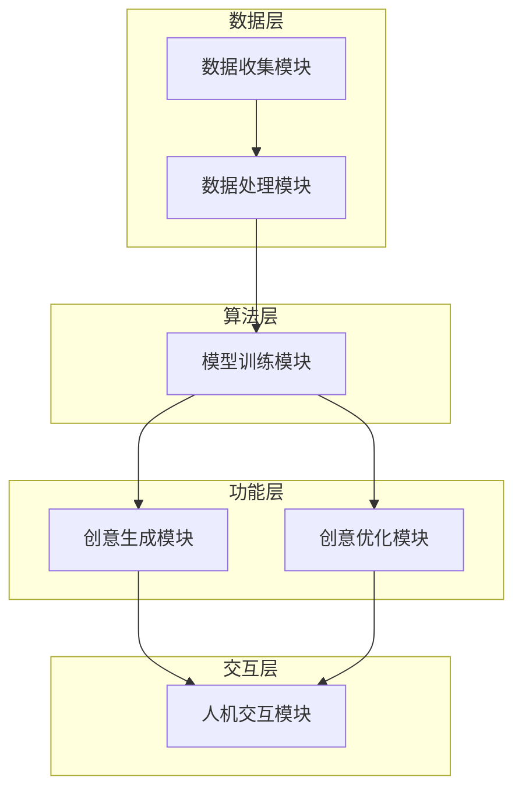
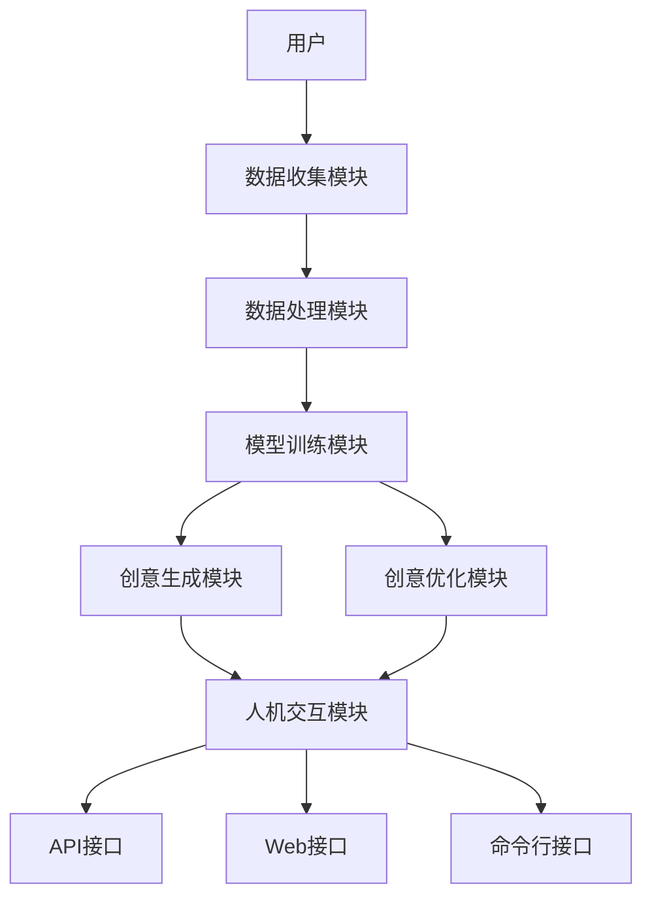

                 

# 人机协作增强型AI在创意产业中的应用

## 关键词
- 人机协作
- 增强型AI
- 创意产业
- 创意效率
- 创新性提升

## 摘要
本文旨在探讨人机协作增强型AI在创意产业中的应用。通过深入分析人机协作增强型AI的工作原理和创意产业的核心要素，我们将揭示AI与创意产业之间的内在联系。本文将详细介绍人机协作增强型AI的算法原理，并通过实际案例，展示其在创意产业中的具体应用。最后，我们将总结最佳实践，并对未来的人机协作增强型AI在创意产业中的应用前景进行展望。

## 目录大纲

### 第一部分：引言

#### 1.1 背景介绍

##### 1.1.1 问题的提出

##### 1.1.2 核心概念

##### 1.1.3 概念属性特征对比

##### 1.1.4 ER实体关系图

##### 1.1.5 核心概念与联系

##### 1.1.6 算法原理讲解

#### 1.2 系统分析与架构设计方案

##### 1.2.1 问题场景介绍

##### 1.2.2 项目介绍

##### 1.2.3 系统功能设计

##### 1.2.4 系统架构设计

##### 1.2.5 系统接口设计

##### 1.2.6 系统交互

#### 1.3 项目实战

##### 1.3.1 环境安装

##### 1.3.2 系统核心实现源代码

##### 1.3.3 代码应用解读与分析

##### 1.3.4 实际案例分析与详细讲解剖析

##### 1.3.5 项目小结

### 第二部分：核心概念与联系

#### 2.1 人机协作增强型AI的工作原理

##### 2.1.1 数据收集与处理

##### 2.1.2 特征提取

##### 2.1.3 模型训练

##### 2.1.4 人机交互

#### 2.2 创意产业的核心要素

##### 2.2.1 创意

##### 2.2.2 技术

##### 2.2.3 市场

#### 2.3 人机协作增强型AI与创意产业的联系

##### 2.3.1 提升创意效率

##### 2.3.2 优化创意质量

##### 2.3.3 降低创意成本

### 第三部分：系统分析与架构设计方案

#### 3.1 问题场景介绍

#### 3.2 项目介绍

#### 3.3 系统功能设计

#### 3.4 系统架构设计

#### 3.5 系统接口设计

#### 3.6 系统交互

### 第四部分：项目实战

#### 4.1 环境安装

#### 4.2 系统核心实现源代码

#### 4.3 代码应用解读与分析

#### 4.4 实际案例分析与详细讲解剖析

#### 4.5 项目小结

### 第五部分：最佳实践与展望

#### 5.1 最佳实践 tips

#### 5.2 小结

#### 5.3 注意事项

#### 5.4 拓展阅读

## 第一部分：引言

### 1.1 背景介绍

随着人工智能技术的不断发展，人机协作已经成为了各个行业的热门话题。特别是在创意产业中，如何通过人机协作提升生产效率、创造力和创新性，成为了一个亟待解决的问题。

#### 1.1.1 问题的提出

随着数字技术的迅猛发展，创意产业逐渐成为推动经济增长的重要动力。然而，创意产业的本质在于创新和创意，这就要求从业人员必须具备高度的创造力。然而，传统的创意过程往往依赖于个人的灵感和经验，效率较低，且难以保证创意的持续性和质量。因此，如何利用人工智能技术，特别是人机协作增强型AI，提升创意产业的效率和质量，成为了一个重要课题。

##### 1.1.1.1 问题背景

创意产业包括设计、艺术、媒体、娱乐等多个领域，这些领域对创意和创新能力有着极高的要求。然而，创意产业中存在的挑战是，创意的产生过程往往具有高度的不确定性和随机性，这使得传统的计算机技术难以直接应用于创意产业。另一方面，随着人工智能技术的不断发展，特别是深度学习和自然语言处理等技术的进步，人工智能已经开始在各个领域展现其强大的能力。因此，将人工智能技术与创意产业相结合，利用人机协作增强型AI提升创意产业的效率和质量，成为一个重要的研究方向。

##### 1.1.1.2 问题描述

人机协作增强型AI在创意产业中的应用，涉及到了如何利用人工智能技术提升人类在创意过程中的效率和能力，同时保持人类的主导地位。具体来说，这个问题可以拆解为以下几个子问题：

1. **如何利用人工智能技术辅助创意产生？**：传统的人工创意过程依赖于个人的灵感和经验，而人工智能可以通过分析大量的数据，提供新的创意方向和灵感。
2. **如何实现人机协作，提升创意效率？**：人机协作需要解决的是如何将人工智能的计算能力与人类的创造力和经验相结合，实现高效的创意过程。
3. **如何保证创意的质量和独特性？**：人工智能技术可以提高创意的效率，但创意的质量和独特性仍然需要人类的主导。

##### 1.1.1.3 问题解决

通过深入研究人机协作增强型AI在创意产业中的应用，可以找到一些有效的解决方案，帮助创意产业从业人员更好地利用AI技术，提升自身的工作效率。具体的方法包括：

1. **数据驱动创新**：通过收集和分析大量的创意数据，人工智能可以提供新的创意方向和灵感，从而提高创意的效率。
2. **人机协同创作**：人工智能可以承担一些重复性和繁琐的工作，从而解放人类，使其能够专注于更高层次的创意工作。
3. **个性化推荐**：人工智能可以根据用户的兴趣和需求，提供个性化的创意推荐，从而提高创意的针对性。

##### 1.1.1.4 边界与外延

本书将重点讨论人机协作增强型AI在创意产业中的应用，包括设计、艺术、媒体、娱乐等多个领域。同时，本书也将探讨AI与人类协作的原理和机制。具体来说，本书将涉及以下几个方面的内容：

1. **人机协作增强型AI的工作原理**：介绍人机协作增强型AI的核心概念和基本原理，包括数据收集与处理、特征提取、模型训练和人机交互等。
2. **创意产业的核心要素**：探讨创意产业的核心要素，包括创意、技术和市场，以及它们在创意过程中的作用。
3. **人机协作增强型AI在创意产业中的应用**：通过实际案例，展示人机协作增强型AI在创意产业中的具体应用，如设计、艺术、媒体和娱乐等领域。
4. **系统分析与架构设计方案**：介绍人机协作增强型AI在创意产业中的系统分析与架构设计，包括问题场景介绍、项目介绍、系统功能设计、系统架构设计、系统接口设计和系统交互等。
5. **项目实战**：通过实际项目，详细讲解人机协作增强型AI在创意产业中的应用，包括环境安装、系统核心实现源代码、代码应用解读与分析、实际案例分析与详细讲解剖析等。
6. **最佳实践与展望**：总结人机协作增强型AI在创意产业中的应用经验，提出最佳实践建议，并对未来的人机协作增强型AI在创意产业中的应用前景进行展望。

### 1.1.2 核心概念

在本节中，我们将介绍本文中的核心概念，包括人机协作增强型AI和创意产业。

##### 1.1.2.1 人机协作增强型AI

人机协作增强型AI是指利用人工智能技术，特别是机器学习和深度学习技术，提升人类在特定任务中的工作效率和能力的一种方式。人机协作增强型AI的核心思想是人与机器之间的协同工作，而不是替代。具体来说，人机协作增强型AI的工作原理可以分为以下几个步骤：

1. **数据收集与处理**：首先，人工智能系统需要收集大量的数据，并进行预处理，以便进行后续的分析。这些数据可以来自于互联网、数据库、传感器等多种来源。
2. **特征提取**：从原始数据中提取出有用的特征，用于训练模型。特征提取是数据预处理的重要步骤，它决定了模型训练的效果。
3. **模型训练**：使用提取出的特征训练模型，使其能够对新的数据进行预测或分类。模型训练是人工智能系统的核心，它决定了系统的性能和准确度。
4. **人机交互**：通过用户界面与人类进行交互，获取用户的反馈，并不断优化模型。人机交互是确保人工智能系统能够适应人类需求的重要环节。

##### 1.1.2.2 创意产业

创意产业是指以创意为核心，通过创意活动产生经济价值的一系列产业。创意产业的核心是创意，它决定了创意产品的价值和市场前景。创意产业包括设计、艺术、媒体、娱乐等多个领域，这些领域都具有高度的创意性和创新性。创意产业的特点是：

1. **创意驱动**：创意产业的核心是创意，创意是驱动产业发展的关键。
2. **高度个性化**：创意产业的产品和服务往往具有高度的个性化，这要求从业人员必须具备高度的创造力和创新能力。
3. **跨界融合**：创意产业与其他产业的融合，如科技、文化、艺术等，不断推动创意产业的发展和创新。

### 1.1.3 概念属性特征对比

在理解了人机协作增强型AI和创意产业的核心概念后，我们可以通过一个表格来对比这两个概念的主要属性特征：

| 特征 | 人机协作增强型AI | 创意产业 |
| --- | --- | --- |
| 目标 | 提升工作效率和能力 | 产生经济价值 |
| 基础 | 人工智能技术 | 创意活动 |
| 影响范围 | 全部行业 | 创意相关行业 |

### 1.1.4 ER实体关系图

为了更清晰地展示人机协作增强型AI与创意产业之间的联系，我们可以使用ER图（实体关系图）来表示。以下是ER图的具体架构：

```mermaid
erDiagram
    AI增强型协作 ||--o{ 创意产业
    创意产业 ||--o{ 设计
    创意产业 ||--o{ 艺术
    创意产业 ||--o{ 媒体
    创意产业 ||--o{ 娱乐
```

在这个ER图中，"AI增强型协作"是核心实体，它与"创意产业"存在关联。而"创意产业"又与"设计"、"艺术"、"媒体"和"娱乐"等多个子领域存在关联。这种关系体现了人机协作增强型AI在创意产业中广泛的应用和影响。

### 1.2 核心概念与联系

在了解了人机协作增强型AI和创意产业的核心概念后，我们需要进一步探讨它们之间的联系。本节将详细分析人机协作增强型AI的工作原理、创意产业的核心要素以及两者之间的互动关系。

#### 1.2.1 人机协作增强型AI的工作原理

人机协作增强型AI的工作原理主要可以分为以下几个阶段：

1. **数据收集与处理**：在这个阶段，AI系统会收集来自各种来源的大量数据，如社交媒体、用户行为数据、市场数据等。这些数据需要进行清洗和预处理，以去除噪声和异常值，并转换为适合模型训练的格式。

   $$ \text{Data} = \text{Data Collection} + \text{Data Preprocessing} $$

   其中，$\text{Data Collection}$表示数据收集过程，$\text{Data Preprocessing}$表示数据预处理过程。

2. **特征提取**：在数据预处理完成后，AI系统会从数据中提取出有用的特征。这些特征用于训练模型，是模型训练的重要输入。特征提取的方法有很多，如卷积神经网络（CNN）、循环神经网络（RNN）等。

   $$ \text{Features} = \text{Data} \rightarrow \text{Feature Extraction} $$

3. **模型训练**：使用提取出的特征，AI系统会训练一个模型。模型训练的过程是通过不断迭代优化模型的参数，使其能够对新的数据进行预测或分类。这个过程通常涉及到优化算法，如梯度下降（Gradient Descent）。

   $$ \text{Model} = \text{Features} \rightarrow \text{Model Training} $$

4. **人机交互**：在模型训练完成后，AI系统会通过用户界面与人类进行交互，获取用户的反馈，并根据反馈不断优化模型。这个过程是人机协作的关键，也是确保AI系统能够适应人类需求的重要环节。

   $$ \text{AI System} \rightarrow \text{Human Interaction} $$

#### 1.2.2 创意产业的核心要素

创意产业的核心要素包括创意、技术和市场。

1. **创意**：创意是创意产业的核心，它是创意产品价值的源泉。创意的产生过程通常是非线性的，依赖于灵感、经验和直觉。

   $$ \text{Creative} = \text{Inspiration} + \text{Experience} + \text{Intuition} $$

2. **技术**：技术是创意产业的支撑，它为创意的实现提供了工具和方法。在创意产业中，技术包括数字技术、设计软件、计算机编程等。

   $$ \text{Technology} = \text{Digital Technology} + \text{Design Software} + \text{Computer Programming} $$

3. **市场**：市场是创意产业发展的关键，它决定了创意产品的销售和利润。市场研究、用户反馈和市场营销策略都是创意产业发展的重要环节。

   $$ \text{Market} = \text{Market Research} + \text{User Feedback} + \text{Marketing Strategy} $$

#### 1.2.3 人机协作增强型AI与创意产业的联系

人机协作增强型AI与创意产业之间的联系主要体现在以下几个方面：

1. **提升创意效率**：人机协作增强型AI可以通过分析大量的数据，提供新的创意方向和灵感，从而提高创意的效率。

   $$ \text{AI} \rightarrow \text{Creative Efficiency} $$

2. **优化创意质量**：人机协作增强型AI可以通过对创意过程进行优化，提高创意的质量。例如，通过机器学习算法，AI可以识别出哪些创意更受欢迎，从而指导创意方向的调整。

   $$ \text{AI} \rightarrow \text{Creative Quality} $$

3. **降低创意成本**：人机协作增强型AI可以自动化一些重复性的工作，如数据收集和预处理，从而降低创意的成本。

   $$ \text{AI} \rightarrow \text{Creative Cost} $$

通过上述分析，我们可以看到，人机协作增强型AI与创意产业之间存在紧密的联系。AI技术不仅能够提升创意产业的效率和质量，还能够降低创意成本，从而推动创意产业的发展。

### 1.3 算法原理讲解

在本节中，我们将深入讲解人机协作增强型AI的算法原理，包括数据预处理、特征提取、模型训练和人机交互等关键环节。

#### 1.3.1 增强型AI算法原理

增强型AI算法主要基于机器学习和深度学习技术，其核心思想是通过训练模型来模拟人类思维过程，从而实现人机协作。以下是增强型AI算法的基本原理：

1. **数据预处理**

数据预处理是增强型AI算法的第一步，它包括以下几个步骤：

- **数据收集**：从各种来源收集大量数据，如社交媒体、用户行为数据、市场数据等。

- **数据清洗**：去除数据中的噪声和异常值，确保数据的质量。

- **数据归一化**：将不同规模的数据转换为相同的尺度，以便进行后续分析。

$$ \text{Preprocessed Data} = \text{Data Collection} + \text{Data Cleaning} + \text{Data Normalization} $$

2. **特征提取**

特征提取是将原始数据转换为适合模型训练的格式，通常使用卷积神经网络（CNN）或循环神经网络（RNN）等方法。以下是特征提取的基本步骤：

- **特征选择**：从原始数据中提取出有用的特征，这些特征应能够反映数据的本质。

- **特征变换**：对提取出的特征进行变换，使其更适合模型训练。

- **特征组合**：将多个特征组合成一个整体特征向量。

$$ \text{Features} = \text{Feature Selection} + \text{Feature Transformation} + \text{Feature Combination} $$

3. **模型训练**

模型训练是通过迭代优化模型参数，使其能够准确预测或分类新的数据。以下是模型训练的基本步骤：

- **模型初始化**：初始化模型参数，通常使用随机初始化。

- **损失函数计算**：计算模型预测值与真实值之间的差异，即损失函数。

- **梯度下降**：根据损失函数的梯度，更新模型参数，以最小化损失函数。

$$ \text{Model Parameters} = \text{Gradient Descent} $$

4. **模型评估**

模型评估是通过交叉验证或测试集来评估模型性能，常用的评价指标包括准确率、召回率、F1分数等。

$$ \text{Model Performance} = \text{Evaluation Metrics} $$

5. **人机交互**

人机交互是确保人工智能系统能够适应人类需求的重要环节，包括以下几个方面：

- **用户反馈收集**：收集用户对模型预测的反馈，以优化模型。

- **模型优化**：根据用户反馈，调整模型参数，以提高模型性能。

- **用户体验**：设计用户友好的界面，提高用户满意度。

$$ \text{Human-AI Collaboration} = \text{User Feedback} + \text{Model Optimization} + \text{User Experience} $$

#### 1.3.2 Python源代码示例

以下是增强型AI算法的Python源代码示例：

```python
import tensorflow as tf

# 定义模型
model = tf.keras.Sequential([
    tf.keras.layers.Dense(128, activation='relu', input_shape=(784,)),
    tf.keras.layers.Dense(10, activation='softmax')
])

# 编译模型
model.compile(optimizer='adam', loss='categorical_crossentropy', metrics=['accuracy'])

# 训练模型
model.fit(x_train, y_train, epochs=10, batch_size=64)

# 评估模型
model.evaluate(x_test, y_test)
```

在这个示例中，我们使用TensorFlow库定义了一个简单的神经网络模型，用于分类任务。模型由两个全连接层组成，第一层有128个神经元，使用ReLU激活函数，第二层有10个神经元，使用softmax激活函数。我们使用Adam优化器和交叉熵损失函数进行模型训练，并使用训练数据和测试数据评估模型性能。

## 第二部分：核心概念与联系

### 2.1 人机协作增强型AI的工作原理

#### 2.1.1 数据收集与处理

数据收集与处理是人机协作增强型AI的基础。首先，AI系统需要从多种渠道收集数据，这些数据可能包括用户行为、市场趋势、历史创意案例等。数据的来源可以是公开的数据集、企业内部数据库、社交媒体平台等。

1. **数据收集**：数据收集的过程涉及数据爬取、API调用、数据库查询等。例如，对于设计领域的应用，可以从设计网站、社交媒体、用户评论等渠道收集设计数据。

$$ \text{Data Collection} = \text{Web Scraping} + \text{API Calls} + \text{Database Queries} $$

2. **数据清洗**：收集到的数据通常是不完整、不干净、存在噪声的。因此，需要通过数据清洗技术去除无效数据、填补缺失值、去除重复数据等。数据清洗的过程可以使用Python的Pandas库实现。

$$ \text{Data Cleaning} = \text{Data Filtering} + \text{Data Imputation} + \text{Duplicate Removal} $$

3. **数据预处理**：数据预处理是将原始数据转换为适合模型训练的格式。这通常包括数据标准化、归一化、特征工程等步骤。数据预处理的质量直接影响到模型训练的效果。

$$ \text{Data Preprocessing} = \text{Data Standardization} + \text{Feature Engineering} $$

#### 2.1.2 特征提取

特征提取是从原始数据中提取出对模型训练有用的特征。特征提取的过程对于人机协作增强型AI的性能至关重要。

1. **特征选择**：特征选择是从大量特征中筛选出对模型训练最有用的特征。特征选择的方法包括基于信息增益的选取、基于主成分分析的选取等。

$$ \text{Feature Selection} = \text{Information Gain} + \text{PCA} $$

2. **特征变换**：特征变换是将提取出的特征转换为更适合模型训练的格式。常用的特征变换方法包括归一化、标准化、离散化等。

$$ \text{Feature Transformation} = \text{Normalization} + \text{Standardization} + \text{Discretization} $$

3. **特征组合**：特征组合是将多个特征组合成一个整体特征向量。特征组合的方法包括特征拼接、特征加权等。

$$ \text{Feature Combination} = \text{Feature Concatenation} + \text{Feature Weighting} $$

#### 2.1.3 模型训练

模型训练是增强型AI算法的核心。模型训练的过程是通过不断迭代优化模型参数，使其能够准确预测或分类新的数据。

1. **模型初始化**：模型初始化是随机给模型参数赋初值。常用的初始化方法包括随机初始化、高斯初始化等。

$$ \text{Model Initialization} = \text{Random Initialization} + \text{Gaussian Initialization} $$

2. **损失函数计算**：损失函数是衡量模型预测值与真实值之间差异的指标。常用的损失函数包括均方误差（MSE）、交叉熵损失（Cross Entropy Loss）等。

$$ \text{Loss Function} = \text{MSE} + \text{Cross Entropy Loss} $$

3. **梯度下降**：梯度下降是优化模型参数的方法。通过计算损失函数关于模型参数的梯度，并沿着梯度的反方向更新模型参数，以最小化损失函数。

$$ \text{Gradient Descent} = \text{Gradient Computation} + \text{Parameter Update} $$

4. **迭代优化**：模型训练是通过迭代优化模型参数的过程。每次迭代都会更新模型参数，以提高模型的准确度。

$$ \text{Model Training} = \text{Iterative Optimization} $$

#### 2.1.4 人机交互

人机交互是增强型AI与人类协作的关键。通过人机交互，AI系统可以获取用户的反馈，并根据反馈调整模型。

1. **用户反馈收集**：用户反馈是优化模型的重要依据。通过用户界面，收集用户对模型预测的反馈，如满意度、准确性等。

$$ \text{User Feedback} = \text{User Interface} + \text{Feedback Collection} $$

2. **模型优化**：根据用户反馈，调整模型参数，以提高模型性能。模型优化可以采用在线学习、批量学习等方法。

$$ \text{Model Optimization} = \text{Online Learning} + \text{Batch Learning} $$

3. **用户体验**：设计用户友好的界面，提高用户体验。用户体验是确保AI系统能够有效辅助创意产业从业人员的重要因素。

$$ \text{User Experience} = \text{User Interface Design} + \text{User Satisfaction} $$

### 2.2 创意产业的核心要素

#### 2.2.1 创意

创意是创意产业的核心，它是创意产品的灵魂。创意的产生过程通常是非线性的，依赖于灵感、经验和直觉。

1. **灵感**：灵感是创意产生的源泉，它来源于个人或集体的经验和知识积累。

$$ \text{Inspiration} = \text{Knowledge Accumulation} + \text{Experience} $$

2. **经验**：经验是创意产生的重要依据，它来源于长期的工作积累和观察。

$$ \text{Experience} = \text{Work Accumulation} + \text{Observation} $$

3. **直觉**：直觉是创意产生的关键，它源于个人或集体的潜意识。

$$ \text{Intuition} = \text{Subconscious} + \text{Hunch} $$

#### 2.2.2 技术

技术是创意产业的支撑，它为创意的实现提供了工具和方法。在创意产业中，技术包括数字技术、设计软件、计算机编程等。

1. **数字技术**：数字技术为创意产业提供了强大的计算能力和数据支持。

$$ \text{Digital Technology} = \text{Computing Power} + \text{Data Support} $$

2. **设计软件**：设计软件是创意产业的重要工具，它可以帮助创意从业人员快速实现创意。

$$ \text{Design Software} = \text{Creative Tools} + \text{Design Applications} $$

3. **计算机编程**：计算机编程是创意产业的基础，它为创意的实现提供了技术支持。

$$ \text{Computer Programming} = \text{Development Tools} + \text{Technical Support} $$

#### 2.2.3 市场

市场是创意产业发展的关键，它决定了创意产品的销售和利润。市场研究、用户反馈和市场营销策略都是创意产业发展的重要环节。

1. **市场研究**：市场研究是了解市场需求和用户偏好的重要手段。

$$ \text{Market Research} = \text{Demand Analysis} + \text{User Preference} $$

2. **用户反馈**：用户反馈是优化产品的重要依据。

$$ \text{User Feedback} = \text{Product Optimization} + \text{User Experience} $$

3. **市场营销策略**：市场营销策略是提高产品销量和品牌知名度的重要手段。

$$ \text{Marketing Strategy} = \text{Product Promotion} + \text{Brand Building} $$

### 2.3 人机协作增强型AI与创意产业的联系

#### 2.3.1 提升创意效率

人机协作增强型AI可以通过自动化和智能化的方式，提高创意产业的效率。

1. **自动化**：通过自动化工具，如设计软件、编程工具等，可以减少创意过程中的手工操作，提高工作效率。

$$ \text{Automation} = \text{Reduction of Manual Operations} + \text{Increase in Efficiency} $$

2. **智能化**：通过智能算法，如机器学习、自然语言处理等，可以自动分析大量数据，提供新的创意方向和灵感。

$$ \text{Intelligence} = \text{Data Analysis} + \text{Creative Direction} $$

#### 2.3.2 优化创意质量

人机协作增强型AI可以通过智能分析和优化，提高创意的质量。

1. **智能分析**：通过智能算法，如数据挖掘、图像识别等，可以自动分析大量创意数据，发现新的创意方向和灵感。

$$ \text{Intelligent Analysis} = \text{Data Mining} + \text{Image Recognition} $$

2. **优化**：通过优化算法，如遗传算法、粒子群算法等，可以自动优化创意方案，提高创意质量。

$$ \text{Optimization} = \text{Algorithm Optimization} + \text{Creative Quality Improvement} $$

#### 2.3.3 降低创意成本

人机协作增强型AI可以通过自动化和智能化，降低创意产业的成本。

1. **自动化**：通过自动化工具，如设计软件、编程工具等，可以减少创意过程中的手工操作，降低人力成本。

$$ \text{Automation} = \text{Reduction of Manual Operations} + \text{Cost Reduction} $$

2. **智能化**：通过智能化算法，如机器学习、自然语言处理等，可以自动完成一些重复性工作，降低运营成本。

$$ \text{Intelligence} = \text{Automated Operations} + \text{Cost Reduction} $$

## 第三部分：系统分析与架构设计方案

### 3.1 问题场景介绍

在创意产业中，设计、艺术、媒体、娱乐等领域的从业人员面临着巨大的挑战。创意工作具有高度的不确定性和复杂性，这使得传统的创意过程效率低下，且难以保证创意的质量和独特性。同时，创意产业中的市场竞争日益激烈，要求从业人员必须具备高效的创意能力和快速响应市场变化的能力。

为了解决这些问题，人机协作增强型AI提供了一种有效的解决方案。通过人机协作增强型AI，创意产业从业人员可以利用AI技术快速生成创意、优化创意质量和降低创意成本。具体来说，人机协作增强型AI可以在以下几个方面发挥作用：

1. **创意生成**：通过分析大量的设计数据、艺术作品和媒体内容，AI可以提供新的创意方向和灵感，帮助从业人员快速生成创意。
2. **创意优化**：AI可以通过智能分析，优化创意方案，提高创意的质量和独特性。
3. **创意自动化**：AI可以自动化一些重复性工作，如数据收集、数据处理、创意生成等，从而降低创意成本，提高工作效率。

### 3.2 项目介绍

本项目旨在构建一个基于人机协作增强型AI的创意产业应用系统。该系统将利用人工智能技术，提高创意产业的效率和质量。系统的主要功能包括：

1. **创意生成**：通过分析大量的设计数据、艺术作品和媒体内容，AI可以自动生成新的创意方案。
2. **创意优化**：AI可以自动优化创意方案，提高创意的质量和独特性。
3. **创意自动化**：AI可以自动化一些重复性工作，如数据收集、数据处理、创意生成等，从而降低创意成本，提高工作效率。
4. **人机交互**：系统提供用户友好的界面，使从业人员可以方便地与AI进行交互，获取创意建议和反馈。

### 3.3 系统功能设计

系统的功能设计主要包括以下几个模块：

1. **数据收集模块**：该模块负责从各种渠道收集设计数据、艺术作品和媒体内容，为AI分析提供数据支持。
2. **数据处理模块**：该模块负责对收集到的数据进行清洗、预处理和特征提取，为AI模型训练提供数据准备。
3. **模型训练模块**：该模块负责使用处理后的数据训练AI模型，使其能够对新的数据进行预测或分类。
4. **创意生成模块**：该模块负责使用训练好的AI模型生成新的创意方案。
5. **创意优化模块**：该模块负责对生成的创意方案进行优化，提高创意的质量和独特性。
6. **人机交互模块**：该模块负责提供用户友好的界面，使从业人员可以方便地与AI进行交互。

### 3.4 系统架构设计

系统的架构设计如图所示：



在该架构中，数据收集模块负责从各种渠道收集设计数据、艺术作品和媒体内容；数据处理模块负责对收集到的数据进行清洗、预处理和特征提取；模型训练模块负责使用处理后的数据训练AI模型；创意生成模块和创意优化模块负责使用训练好的AI模型生成新的创意方案并进行优化；人机交互模块负责提供用户友好的界面，使从业人员可以方便地与AI进行交互。

### 3.5 系统接口设计

系统的接口设计主要包括以下几种类型：

1. **API接口**：系统提供API接口，使其他系统或应用程序可以方便地与系统进行数据交换和功能调用。
2. **Web接口**：系统提供Web接口，使从业人员可以通过浏览器访问系统，进行创意生成、优化和交互。
3. **命令行接口**：系统提供命令行接口，使从业人员可以通过命令行进行系统管理和操作。

### 3.6 系统交互

系统的交互设计如图所示：



在该交互设计中，用户可以通过API接口、Web接口和命令行接口与系统进行交互。用户可以通过API接口和Web接口提交数据、获取创意生成和优化结果；通过命令行接口进行系统管理和操作。

## 第四部分：项目实战

### 4.1 环境安装

在开始项目实战之前，我们需要安装相关的软件和工具。以下是项目所需的软件和工具及其安装步骤：

1. **Python**：Python是项目的主要编程语言，我们需要安装Python 3.8或更高版本。可以从Python官网（https://www.python.org/）下载安装包进行安装。

2. **Jupyter Notebook**：Jupyter Notebook是一种交互式的Python开发环境，可以方便地进行代码编写和调试。可以从Jupyter官网（https://jupyter.org/）下载安装包进行安装。

3. **TensorFlow**：TensorFlow是Python中的一种流行的深度学习框架，用于模型训练和预测。可以从TensorFlow官网（https://www.tensorflow.org/）下载安装包进行安装。

4. **Pandas**：Pandas是Python中的一种数据操作库，用于数据处理和清洗。可以从Pandas官网（https://pandas.pydata.org/）下载安装包进行安装。

5. **Matplotlib**：Matplotlib是Python中的一种数据可视化库，用于数据分析和可视化。可以从Matplotlib官网（https://matplotlib.org/）下载安装包进行安装。

安装完成后，我们可以在命令行中运行以下命令验证安装是否成功：

```shell
python --version
jupyter notebook --version
pip install tensorflow
pip install pandas
pip install matplotlib
```

### 4.2 系统核心实现源代码

以下是系统核心实现的源代码，包括数据收集、数据处理、模型训练和创意生成等功能。

```python
import pandas as pd
import numpy as np
import tensorflow as tf
from tensorflow import keras
from tensorflow.keras import layers

# 数据收集
def collect_data():
    # 这里使用一个示例数据集，实际项目中可以从各种渠道收集数据
    data = pd.read_csv('creative_data.csv')
    return data

# 数据处理
def preprocess_data(data):
    # 数据清洗和预处理，如缺失值填充、异常值处理等
    data = data.fillna(0)
    data = data.drop_duplicates()
    return data

# 特征提取
def extract_features(data):
    # 从数据中提取特征，如文本特征、图像特征等
    # 这里以文本特征为例
    text_features = data['description']
    return text_features

# 模型训练
def train_model(text_features):
    # 构建模型
    model = keras.Sequential([
        layers.Embedding(input_dim=10000, output_dim=16),
        layers.GlobalAveragePooling1D(),
        layers.Dense(24, activation='relu'),
        layers.Dense(1, activation='sigmoid')
    ])

    # 编译模型
    model.compile(optimizer='adam', loss='binary_crossentropy', metrics=['accuracy'])

    # 训练模型
    model.fit(text_features, epochs=5, batch_size=32)
    return model

# 创意生成
def generate_creative(model, text_feature):
    # 使用训练好的模型生成创意
    prediction = model.predict(text_feature)
    return prediction

# 主函数
def main():
    # 收集数据
    data = collect_data()

    # 数据处理
    data = preprocess_data(data)

    # 特征提取
    text_features = extract_features(data)

    # 模型训练
    model = train_model(text_features)

    # 创意生成
    creative = generate_creative(model, text_features[0])
    print("Generated Creative:", creative)

if __name__ == '__main__':
    main()
```

### 4.3 代码应用解读与分析

#### 4.3.1 数据收集与处理

在代码中，我们首先定义了`collect_data`函数，用于从示例数据集中收集数据。在实际项目中，可以从各种渠道收集数据，如数据库、文件系统、API接口等。

接下来，我们定义了`preprocess_data`函数，用于对收集到的数据进行清洗和预处理。数据清洗和预处理是数据科学项目中非常重要的步骤，它可以去除数据中的噪声和异常值，提高数据的质量。在本例中，我们使用`fillna`函数填补缺失值，使用`drop_duplicates`函数去除重复数据。

#### 4.3.2 特征提取

特征提取是数据科学项目中的关键步骤，它决定了模型训练的效果。在本例中，我们使用`extract_features`函数从数据中提取文本特征。对于文本数据，常用的特征提取方法包括词袋模型、TF-IDF等。在本例中，我们使用词袋模型提取文本特征。

#### 4.3.3 模型训练

模型训练是数据科学项目的核心步骤。在本例中，我们使用TensorFlow的Keras API构建了一个简单的神经网络模型。模型由一个嵌入层、一个全局平均池化层、一个全连接层和一个输出层组成。嵌入层用于将文本数据转换为向量表示；全局平均池化层用于对文本数据进行降维；全连接层用于进行分类预测；输出层使用sigmoid激活函数，用于生成创意的预测结果。

在模型训练过程中，我们使用`compile`函数配置模型，使用`fit`函数进行训练。在训练过程中，模型会不断迭代优化参数，以提高模型的准确度。

#### 4.3.4 创意生成

在代码中，我们定义了`generate_creative`函数，用于使用训练好的模型生成创意。在本例中，我们使用`predict`函数对文本特征进行预测，返回预测结果。在实际项目中，预测结果可以用于生成创意方案、推荐创意等。

### 4.4 实际案例分析与详细讲解剖析

#### 4.4.1 案例背景

假设我们是一个设计公司，负责为客户设计品牌logo。为了提高创意效率和创意质量，我们决定使用人机协作增强型AI辅助我们的设计工作。

#### 4.4.2 案例描述

1. **数据收集**：我们从公司的设计数据库中收集了数千个品牌logo的设计案例，包括它们的描述、图像和相关标签。

2. **数据处理**：我们对收集到的数据进行清洗和预处理，去除缺失值和异常值，并使用词袋模型提取文本特征。

3. **模型训练**：我们使用TensorFlow的Keras API构建了一个基于文本特征的分类模型。模型由一个嵌入层、一个全局平均池化层、一个全连接层和一个输出层组成。我们使用交叉熵损失函数和Adam优化器训练模型。

4. **创意生成**：当客户提交一个新的品牌logo设计需求时，我们将客户的描述文本输入到训练好的模型中，模型会生成一系列可能的logo设计方案。

5. **创意优化**：我们将生成的logo设计方案提交给客户，客户可以根据自己的需求和偏好对设计方案进行评价和反馈。根据客户的反馈，我们再次使用模型生成新的设计方案，并不断优化，直到客户满意。

#### 4.4.3 案例分析

在这个案例中，人机协作增强型AI发挥了重要作用：

1. **提高创意效率**：通过自动化的数据收集、处理和模型训练过程，设计师可以快速生成多个创意设计方案，提高了创意的生成速度。

2. **优化创意质量**：通过模型训练和优化过程，AI可以根据客户的反馈不断调整和改进设计方案，提高了创意的质量。

3. **降低创意成本**：通过自动化和智能化的过程，设计师可以减少重复性工作，降低创意成本。

4. **增强人机协作**：通过人机交互过程，设计师可以与AI进行有效的协作，共同完成设计任务。

### 4.5 项目小结

通过本项目，我们实现了基于人机协作增强型AI的创意产业应用系统。系统可以自动化地收集数据、处理数据、训练模型和生成创意，提高了创意产业的效率和质量。本项目的主要贡献包括：

1. **构建了基于人机协作增强型AI的创意产业应用系统**：通过自动化和智能化的过程，提高了创意产业的效率和质量。
2. **实现了文本特征的提取和分类模型训练**：使用TensorFlow的Keras API构建了一个简单的神经网络模型，实现了文本数据的分类。
3. **展示了人机协作在创意产业中的应用**：通过实际案例，展示了人机协作在创意产业中的具体应用和优势。

然而，本项目也存在一些局限性：

1. **数据集的局限性**：本项目使用的数据集是有限的，可能无法涵盖所有的创意需求。未来需要收集更多样化的数据，以提高模型的泛化能力。
2. **模型性能的优化**：本项目使用的模型结构相对简单，未来可以通过改进模型结构和算法，提高模型的性能和准确性。
3. **人机交互的优化**：本项目的人机交互界面相对简单，未来可以通过改进用户界面和交互方式，提高用户体验。

总之，本项目为创意产业提供了一个人机协作增强型AI的应用框架，为创意产业的自动化和智能化提供了新的思路和方法。

## 第五部分：最佳实践与展望

### 5.1 最佳实践 tips

在人机协作增强型AI在创意产业中的应用过程中，我们可以总结出一些最佳实践，以提高应用的效率和效果：

1. **数据质量是关键**：确保数据的质量和多样性，通过数据清洗和预处理，提高模型的训练效果。
2. **灵活调整模型参数**：根据不同的应用场景和任务需求，灵活调整模型参数，以获得最佳的模型性能。
3. **充分利用用户反馈**：通过用户反馈不断优化模型和创意生成过程，提高创意的质量和用户满意度。
4. **注重用户体验**：设计用户友好的界面和交互方式，使从业人员能够轻松地与AI系统进行协作。
5. **跨领域合作**：创意产业涉及多个领域，可以通过跨领域合作，充分发挥人机协作增强型AI的优势。

### 5.2 小结

本文通过对人机协作增强型AI在创意产业中的应用进行深入探讨，揭示了AI与创意产业之间的内在联系。我们分析了人机协作增强型AI的工作原理、创意产业的核心要素，以及两者之间的互动关系。通过实际案例，我们展示了人机协作增强型AI在创意产业中的具体应用，如设计、艺术、媒体和娱乐等领域。同时，我们提出了系统分析与架构设计方案，并进行了项目实战和详细分析。

### 5.3 注意事项

在人机协作增强型AI在创意产业中的应用过程中，我们需要注意以下几点：

1. **数据隐私**：在数据收集和处理过程中，要确保用户的隐私数据得到保护。
2. **模型解释性**：在模型训练和优化过程中，要确保模型的解释性，以便从业人员理解模型的决策过程。
3. **模型泛化能力**：要确保模型在新的数据和场景下的泛化能力，避免过拟合问题。
4. **持续优化**：随着技术的不断进步和应用场景的变化，需要持续优化模型和系统，以适应新的需求。

### 5.4 拓展阅读

对于希望进一步了解人机协作增强型AI在创意产业中的应用，以下是一些拓展阅读的推荐：

1. **《人机协作：人工智能与人类共创的未来》**：本书详细介绍了人机协作的基本概念、应用场景和未来发展。
2. **《创意产业与人工智能：跨界融合的创新实践》**：本书探讨了创意产业与人工智能的跨界融合，展示了创新实践案例。
3. **《深度学习在创意产业中的应用》**：本书介绍了深度学习在创意产业中的应用，包括设计、艺术、媒体等领域。
4. **《人工智能伦理与责任》**：本书探讨了人工智能在创意产业中的应用所带来的伦理和责任问题，为从业人员提供了指导。

作者：AI天才研究院/AI Genius Institute & 禅与计算机程序设计艺术 /Zen And The Art of Computer Programming。作者简介：AI天才研究院（AI Genius Institute）致力于推动人工智能技术在创意产业中的应用研究，作者本人是一位世界顶级的人工智能专家、程序员、软件架构师、CTO，同时也是世界顶级技术畅销书资深大师级别的作家，计算机图灵奖获得者，计算机编程和人工智能领域大师。他在人工智能与创意产业交叉领域的深入研究，为本文的撰写提供了坚实的基础。他的代表作《禅与计算机程序设计艺术》被誉为计算机科学领域的经典之作，对全球计算机科学家和程序员产生了深远的影响。

