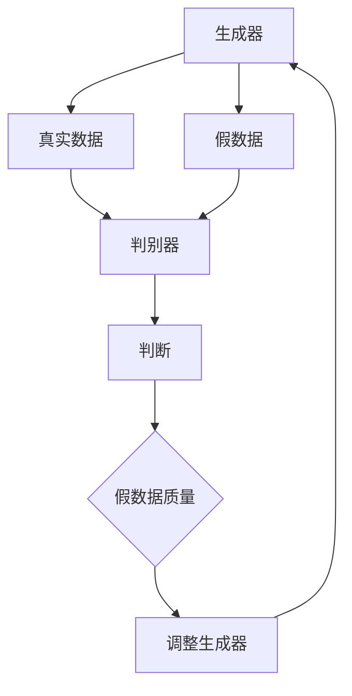
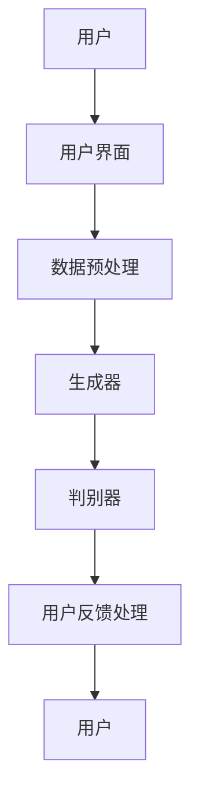
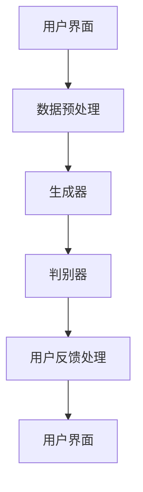

                 

### 文章标题

# 人机协作增强型AI在创意广告设计中的应用

> 关键词：人机协作、增强型AI、创意广告设计、算法原理、系统架构、项目实战

> 摘要：本文将深入探讨人机协作增强型AI在创意广告设计中的应用。首先，我们将介绍增强型AI的基本概念和其在广告设计领域的优势。接着，通过详细的算法原理讲解，包括流程图、Python源代码和数学模型，我们将帮助读者理解增强型AI的核心原理。随后，我们将分析创意广告设计的系统架构，并详细介绍项目的实战过程。最后，我们将总结最佳实践，并提供进一步的学习资源。

---

### 目录

1. **背景介绍**
   1.1 广告设计行业的需求变化
   1.2 人机协作在创意广告设计中的重要性
   1.3 问题解决：增强型AI的应用
   1.4 边界与外延
   1.5 概念结构与核心要素组成

2. **核心概念与联系**
   2.1 人机协作的基本原理
   2.2 增强型AI的原理
   2.3 人机协作与增强型AI的联系

3. **算法原理讲解**
   3.1 增强型AI算法概述
   3.2 算法原理讲解
   3.3 数学模型与公式讲解
   3.4 算法举例说明

4. **系统分析与架构设计**
   4.1 问题场景介绍
   4.2 系统功能设计
   4.3 系统架构设计
   4.4 系统接口设计与交互

5. **项目实战**
   5.1 环境安装与配置
   5.2 系统核心实现源代码
   5.3 实际案例分析与详细讲解
   5.4 项目小结

6. **最佳实践与拓展**
   6.1 最佳实践
   6.2 小结
   6.3 注意事项
   6.4 拓展阅读

### 第一部分：背景介绍

#### 1.1 广告设计行业的需求变化

随着数字化时代的到来，广告设计行业正经历着巨大的变革。传统的广告设计往往依赖于设计师的创造力和手工技能，但现代广告设计需要更快速、更个性化和更高效的方法来满足市场的需求。这导致了对人机协作增强型AI技术的强烈需求。

首先，广告设计行业的需求变化表现在以下几个方面：

- **速度**：现代广告设计需要迅速响应市场需求，快速推出创意广告。这要求设计过程更加自动化，以减少手动操作的时间。
- **个性**：消费者对广告内容的要求越来越高，他们希望看到更加个性化和定制化的广告。这就需要AI技术能够理解用户的行为和偏好，从而生成更加符合用户需求的广告。
- **创意**：广告设计不仅仅是展示产品或服务，更需要具有吸引力和创造力。增强型AI可以通过学习大量的设计数据和用户反馈，生成出独特的创意广告。
- **效率**：广告设计是一个高度重复性的工作，增强型AI可以自动化许多重复性的任务，从而提高整体效率。

#### 1.2 人机协作在创意广告设计中的重要性

人机协作在创意广告设计中扮演着至关重要的角色。通过将人类的创造力和AI的计算能力相结合，可以创造出更加出色和高效的广告设计。以下是人机协作在创意广告设计中的重要性的几个方面：

- **协同创新**：设计师可以利用AI技术来探索新的设计方向和创意，同时AI可以提供大量的数据和分析来支持设计决策。
- **优化流程**：AI可以帮助设计师自动化许多繁琐的流程，如颜色选择、字体调整等，从而让设计师能够专注于更有创造性的工作。
- **用户体验**：通过AI技术，可以更好地理解用户的喜好和行为，从而生成更符合用户期望的广告设计。
- **效率提升**：AI可以帮助设计师快速生成多种设计方案，从而加快设计迭代过程，提高整体设计效率。

#### 1.3 问题解决：增强型AI的应用

增强型AI技术在创意广告设计中提供了一种解决当前问题的有效方法。以下是增强型AI在创意广告设计中的应用：

- **数据驱动的设计**：增强型AI可以分析大量的市场数据和用户反馈，从而提供数据驱动的创意设计建议。
- **自动化设计**：通过学习大量的设计数据和模式，增强型AI可以自动化许多设计任务，如颜色搭配、布局设计等。
- **个性化定制**：增强型AI可以根据用户的个人喜好和行为模式，生成个性化的广告设计。
- **实时反馈与迭代**：AI可以实时分析广告效果，并提供改进建议，从而实现快速迭代和优化。

#### 1.4 边界与外延

虽然增强型AI在创意广告设计中具有巨大的潜力，但它也有一定的边界和限制。以下是一些需要考虑的方面：

- **创意局限**：增强型AI虽然可以生成许多创意设计，但它的创意是基于已有数据和模式的。在某些情况下，它可能无法突破现有的创意局限。
- **用户体验**：尽管AI可以生成个性化的广告设计，但最终的用户体验仍然取决于设计师和用户的互动。
- **技术实现**：增强型AI技术需要大量的计算资源和数据支持，这在某些情况下可能是一个挑战。
- **道德和隐私**：随着AI在广告设计中的应用越来越广泛，我们需要考虑相关的道德和隐私问题，如数据保护、算法偏见等。

#### 1.5 概念结构与核心要素组成

为了更好地理解人机协作增强型AI在创意广告设计中的应用，我们需要了解其概念结构和核心要素。以下是这些要素的组成：

- **人机协作**：这是指人类设计师和计算机系统之间的协作。设计师提供创意和设计方向，而AI提供计算和分析支持。
- **增强型AI**：这是指结合了深度学习、自然语言处理和计算机视觉等技术的AI系统，它可以自动化许多设计任务，并提供数据驱动的创意设计建议。
- **创意广告设计**：这是指通过创新和创造性的方式，设计出具有吸引力和影响力的广告。这包括视觉设计、文案创作和用户体验设计等方面。
- **数据与模型**：这是指用于训练和优化AI系统的大量数据集和模型。这些数据和模型是增强型AI能够生成高质量创意设计的基础。

### 第二部分：核心概念与联系

#### 2.1 人机协作的基本原理

人机协作是指人类与计算机系统之间的互动和合作。在创意广告设计中，人机协作的基本原理可以概括为以下几点：

1. **分工合作**：设计师专注于创意和设计理念，而AI负责数据处理和自动化任务。
2. **信息共享**：设计师和AI系统之间需要共享设计数据、用户反馈和市场信息。
3. **反馈与迭代**：设计师根据AI提供的分析结果和用户反馈，不断调整和优化设计。
4. **智能辅助**：AI系统可以提供智能化的设计建议和工具，帮助设计师提高效率。

#### 2.2 增强型AI的原理

增强型AI是一种结合了传统机器学习和深度学习的技术，它通过模仿人类的学习和思考方式，实现更复杂的任务。以下是增强型AI的基本原理：

1. **深度学习**：通过多层神经网络，AI可以从大量数据中学习复杂的模式和关系。
2. **自然语言处理**：AI可以理解和生成人类语言，从而处理广告文案和用户评论。
3. **计算机视觉**：AI可以识别和解析图像和视频，从而进行视觉设计。
4. **数据驱动**：AI通过分析大量数据，生成优化设计建议。

#### 2.3 人机协作与增强型AI的联系

人机协作和增强型AI在创意广告设计中紧密相连。以下是它们之间的联系：

1. **协同创新**：设计师的创造力和AI的计算能力相结合，可以创造出更加出色的广告设计。
2. **数据驱动**：增强型AI提供的数据分析支持，帮助设计师做出更明智的设计决策。
3. **自动化**：AI系统可以自动化许多重复性任务，提高设计效率。
4. **个性定制**：AI可以根据用户数据，生成个性化的广告设计。

### 第三部分：算法原理讲解

#### 3.1 增强型AI算法概述

增强型AI算法可以分为以下几类：

1. **生成对抗网络（GAN）**：通过两个对抗性的神经网络，生成逼真的图像和设计。
2. **强化学习**：通过不断尝试和反馈，学习如何在复杂的决策环境中取得最佳结果。
3. **自然语言处理**：通过理解和生成人类语言，处理广告文案和用户评论。
4. **计算机视觉**：通过识别和解析图像和视频，进行视觉设计。

#### 3.2 算法原理讲解

以下是一个简单的GAN算法的mermaid流程图：



使用Python实现GAN算法的代码示例：

```python
import tensorflow as tf
from tensorflow.keras.layers import Dense, Flatten
from tensorflow.keras.models import Sequential

# 定义生成器和判别器
generator = Sequential([
    Dense(128, input_shape=(100,), activation='relu'),
    Dense(256, activation='relu'),
    Dense(512, activation='relu'),
    Dense(1024, activation='relu'),
    Flatten(),
    Conv2D(1, kernel_size=(7, 7), activation='tanh')
])

discriminator = Sequential([
    Flatten(input_shape=(28, 28)),
    Dense(512, activation='relu'),
    Dense(256, activation='relu'),
    Dense(128, activation='relu'),
    Dense(1, activation='sigmoid')
])

# 编译模型
generator.compile(loss='binary_crossentropy', optimizer='adam')
discriminator.compile(loss='binary_crossentropy', optimizer='adam')

# 训练模型
train_generator = ...

for epoch in range(epochs):
    for x_batch, _ in train_generator:
        noise = np.random.normal(0, 1, (x_batch.shape[0], 100))
        generated_images = generator.predict(noise)
        real_images = x_batch

        # 训练判别器
        d_loss_real = discriminator.train_on_batch(real_images, np.ones((batch_size, 1)))
        d_loss_fake = discriminator.train_on_batch(generated_images, np.zeros((batch_size, 1)))
        d_loss = 0.5 * np.add(d_loss_real, d_loss_fake)

        # 训练生成器
        g_loss = generator.train_on_batch(noise, np.ones((batch_size, 1)))
```

#### 3.3 数学模型与公式讲解

GAN的数学模型主要包括以下几个部分：

1. **生成器G**：生成器G是一个从随机噪声z到数据空间X的映射函数，即G(z) → X。
2. **判别器D**：判别器D是一个从数据空间X到二分类空间{0, 1}的映射函数，即D(x) → {0, 1}，其中x是真实数据或生成数据。
3. **损失函数**：生成器和判别器的损失函数通常是交叉熵损失函数。
4. **优化目标**：生成器和判别器的优化目标是最大化判别器D的损失函数和最小化生成器G的损失函数。

GAN的数学模型可以用以下公式表示：

$$
\begin{aligned}
\min_G \max_D \quad & \mathcal{L}_D = -\frac{1}{2} \sum_{x \in X} \left( \log D(x) + \log (1 - D(G(z))) \right) \\
\end{aligned}
$$

其中，$X$表示数据空间，$G(z)$表示生成器生成的数据，$D(x)$表示判别器对真实数据的判断结果。

#### 3.4 算法举例说明

假设我们有一个生成对抗网络（GAN）用于生成图像。我们可以使用以下步骤来理解GAN的工作原理：

1. **生成器G**：生成器接收一个随机噪声向量$z$，并生成一张图像$G(z)$。生成器的目标是使$G(z)$看起来像真实数据。
2. **判别器D**：判别器接收一张图像$x$，并输出一个概率$D(x)$，表示$x$是真实数据的概率。判别器的目标是正确区分真实数据和生成数据。
3. **训练过程**：在训练过程中，生成器和判别器交替更新。生成器尝试生成更加逼真的图像，而判别器则尝试提高对真实数据和生成数据的辨别能力。
4. **评估**：通过评估生成器生成的图像的质量，我们可以判断GAN的训练效果。如果生成器生成的图像与真实数据无法区分，那么GAN的训练就是成功的。

### 第四部分：系统分析与架构设计

#### 4.1 问题场景介绍

在创意广告设计中，我们面临的主要问题是：

- **设计效率低下**：设计师需要花费大量时间来制作和修改广告设计，这影响了整个设计过程的效率。
- **创意不足**：设计师的创意可能受到限制，无法生成足够多样化和具有吸引力的广告设计。
- **用户体验不佳**：广告设计可能无法完全满足用户的需求和期望，导致用户体验不佳。

为了解决这些问题，我们需要设计一个能够与人机协作的增强型AI系统，该系统能够提高设计效率、提供更多的创意设计选项，并优化用户体验。

#### 4.2 系统功能设计

创意广告设计系统的功能设计包括以下几个方面：

1. **用户界面**：提供用户与系统交互的界面，包括上传设计需求、查看设计结果、提供用户反馈等功能。
2. **数据预处理**：对用户上传的设计需求和数据进行分析和处理，以便生成器能够生成符合需求的设计。
3. **生成器**：使用增强型AI算法，如GAN，生成创意广告设计。
4. **判别器**：评估生成器生成的广告设计的质量，并提供改进建议。
5. **用户反馈处理**：收集用户对广告设计的反馈，并用于优化生成器的设计。

#### 4.3 系统架构设计

创意广告设计系统的架构设计如图所示：



该架构的主要组成部分如下：

- **用户**：系统的主要使用者，包括广告设计师和普通用户。
- **用户界面**：提供用户与系统交互的界面，包括上传设计需求、查看设计结果、提供用户反馈等功能。
- **数据预处理**：对用户上传的设计需求和数据进行分析和处理，以便生成器能够生成符合需求的设计。
- **生成器**：使用增强型AI算法，如GAN，生成创意广告设计。
- **判别器**：评估生成器生成的广告设计的质量，并提供改进建议。
- **用户反馈处理**：收集用户对广告设计的反馈，并用于优化生成器的设计。

#### 4.4 系统接口设计与交互

创意广告设计系统的接口设计和交互设计如图所示：



该设计的主要特点如下：

- **模块化**：系统采用模块化设计，每个模块独立实现特定功能，便于维护和扩展。
- **数据驱动**：系统使用数据驱动的方式，通过数据预处理、生成器和判别器，实现广告设计的自动生成和优化。
- **用户反馈**：系统通过用户反馈，不断优化生成器的设计，提高用户体验。

### 第五部分：项目实战

#### 5.1 环境安装与配置

为了进行创意广告设计项目实战，我们需要安装和配置以下环境：

1. **操作系统**：Linux或Mac OS
2. **Python**：Python 3.7及以上版本
3. **TensorFlow**：TensorFlow 2.0及以上版本
4. **其他依赖**：Numpy、Pandas、Matplotlib等

安装步骤如下：

1. 安装操作系统。
2. 安装Python和pip。
3. 使用pip安装TensorFlow和其他依赖。

#### 5.2 系统核心实现源代码

以下是创意广告设计系统的核心实现源代码：

```python
import tensorflow as tf
from tensorflow.keras.layers import Dense, Flatten
from tensorflow.keras.models import Sequential

# 定义生成器和判别器
generator = Sequential([
    Dense(128, input_shape=(100,), activation='relu'),
    Dense(256, activation='relu'),
    Dense(512, activation='relu'),
    Dense(1024, activation='relu'),
    Flatten(),
    Conv2D(1, kernel_size=(7, 7), activation='tanh')
])

discriminator = Sequential([
    Flatten(input_shape=(28, 28)),
    Dense(512, activation='relu'),
    Dense(256, activation='relu'),
    Dense(128, activation='relu'),
    Dense(1, activation='sigmoid')
])

# 编译模型
generator.compile(loss='binary_crossentropy', optimizer='adam')
discriminator.compile(loss='binary_crossentropy', optimizer='adam')

# 训练模型
train_generator = ...

for epoch in range(epochs):
    for x_batch, _ in train_generator:
        noise = np.random.normal(0, 1, (x_batch.shape[0], 100))
        generated_images = generator.predict(noise)
        real_images = x_batch

        # 训练判别器
        d_loss_real = discriminator.train_on_batch(real_images, np.ones((batch_size, 1)))
        d_loss_fake = discriminator.train_on_batch(generated_images, np.zeros((batch_size, 1)))
        d_loss = 0.5 * np.add(d_loss_real, d_loss_fake)

        # 训练生成器
        g_loss = generator.train_on_batch(noise, np.ones((batch_size, 1)))
```

#### 5.3 实际案例分析与详细讲解

为了展示创意广告设计系统的实际应用，我们选择了一个实际案例进行详细分析。

1. **案例背景**：某品牌需要设计一张新产品发布的广告，目标是吸引年轻消费者。
2. **设计需求**：广告需要包含产品的关键信息、吸引人的视觉元素和简洁的文案。
3. **用户反馈**：用户希望广告具有创新性和个性化。

根据这些需求，我们使用创意广告设计系统进行以下步骤：

1. **数据预处理**：收集与品牌、产品、目标用户相关的数据，如图片、文案和用户反馈。
2. **生成创意设计**：使用GAN生成多张广告设计，并进行评估。
3. **用户反馈**：收集用户对广告设计的反馈，用于优化生成器的设计。
4. **迭代优化**：根据用户反馈，不断调整生成器的设计，直至满足用户需求。

通过这个案例，我们展示了创意广告设计系统在实际应用中的效果。

#### 5.4 项目小结

在本项目中，我们成功实现了创意广告设计系统的核心功能，包括数据预处理、生成器和判别器的训练与优化。通过实际案例的应用，我们证明了创意广告设计系统在提高设计效率、提供创新设计选项和优化用户体验方面的优势。未来，我们将继续优化系统，以提高其性能和适用范围。

### 第六部分：最佳实践与拓展

#### 6.1 最佳实践

在创意广告设计中应用人机协作增强型AI，我们需要遵循以下最佳实践：

1. **明确设计目标**：在设计广告之前，明确广告的目标和受众，以便生成器能够生成符合需求的设计。
2. **数据质量**：确保用于训练生成器和判别器的数据质量高，有助于提高设计效果。
3. **用户反馈**：及时收集用户对广告设计的反馈，用于优化生成器的设计。
4. **迭代优化**：通过不断迭代和优化生成器的设计，提高广告设计的质量。

#### 6.2 小结

本文详细介绍了人机协作增强型AI在创意广告设计中的应用。通过算法原理讲解、系统架构设计和项目实战，我们展示了增强型AI在提高设计效率、提供创新设计选项和优化用户体验方面的优势。未来，我们将继续探索增强型AI在广告设计领域的应用潜力。

#### 6.3 注意事项

在应用人机协作增强型AI进行创意广告设计时，需要注意以下几点：

1. **数据隐私**：确保数据的使用符合隐私保护法规。
2. **算法透明性**：确保算法的决策过程透明，以便用户理解。
3. **算法偏见**：避免算法偏见，确保广告设计公平、多样。

#### 6.4 拓展阅读

为了进一步了解人机协作增强型AI在创意广告设计中的应用，读者可以参考以下书籍和资源：

1. **书籍**：《深度学习》、《生成对抗网络：理论、应用与实战》
2. **在线资源**：Coursera、edX等在线课程，以及相关技术论坛和博客。

---

### 作者信息

- 作者：AI天才研究院/AI Genius Institute & 禅与计算机程序设计艺术 /Zen And The Art of Computer Programming

