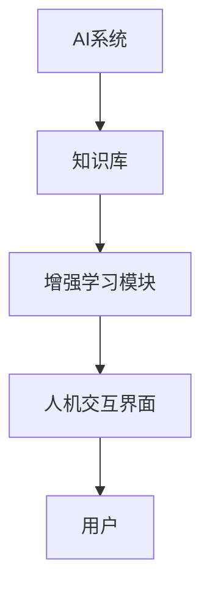
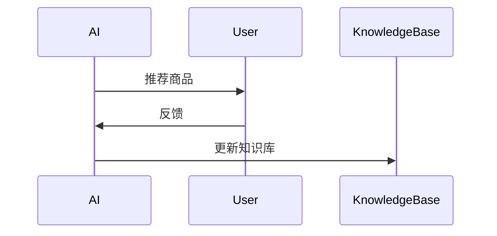

                 

### 人机协作增强学习：结合人类专家知识

> 关键词：人机协作、增强学习、人类专家知识、AI、知识共享、机器学习算法

在当今数字化时代，人工智能（AI）正以前所未有的速度改变着各行各业。然而，尽管AI在处理大量数据和执行重复性任务方面表现出色，但它仍然面临着复杂问题和未知领域的挑战。为了克服这些限制，研究者们提出了人机协作增强学习（Human-AI Collaboration Enhanced Learning）的概念，将人类专家的知识与AI的强大计算能力相结合，以实现更高效、更智能的学习过程。本文旨在探讨人机协作增强学习的核心概念、应用场景以及未来的发展方向。

### 摘要

本文首先介绍了人机协作增强学习的基本概念，包括人机协作和增强学习的定义与原理，并阐述了人机协作增强学习的优势和应用领域。接着，本文分析了当前人机协作面临的问题以及增强学习在复杂任务中的挑战，并提出了人机协作增强学习的解决思路。随后，本文详细讨论了人机协作增强学习的关键技术，包括知识共享与知识融合机制以及增强学习的优化策略与算法。最后，本文探讨了人机协作增强学习的适用场景、局限性以及未来的发展趋势与研究方向。

### 目录大纲

```markdown
----------------------------------------------------------------
# 第一部分: 背景介绍

## 第1章: 人机协作增强学习概述

### 1.1 问题背景

#### 1.1.1 人机协作的概念

#### 1.1.2 增强学习的定义与原理

#### 1.1.3 人机协作增强学习的优势与应用领域

### 1.2 问题描述

#### 1.2.1 当前人机协作面临的问题

#### 1.2.2 增强学习在复杂任务中的挑战

#### 1.2.3 人机协作增强学习的解决思路

### 1.3 问题解决

#### 1.3.1 人机协作增强学习的关键技术

#### 1.3.2 知识共享与知识融合机制

#### 1.3.3 增强学习的优化策略与算法

### 1.4 边界与外延

#### 1.4.1 人机协作增强学习的适用场景

#### 1.4.2 人机协作增强学习的局限性

#### 1.4.3 未来发展趋势与研究方向

## 第二部分: 核心概念与联系

### 2.1 核心概念

#### 2.1.1 人类专家知识

#### 2.1.2 机器学习模型

#### 2.1.3 人机交互界面

### 2.2 概念属性特征对比

#### 2.2.1 人类专家知识的特点

#### 2.2.2 机器学习模型的特点

#### 2.2.3 人机交互界面的特点

### 2.3 ER实体关系图架构

```mermaid
erDiagram
  AI系统 ||--|{ 人类专家知识 : 知识来源 }
  AI系统 ||--|{ 机器学习模型 : 学习核心 }
  AI系统 ||--|{ 人机交互界面 : 操作界面 }
```

## 第三部分: 增强学习算法原理讲解

### 3.1 算法简介

#### 3.1.1 增强学习的基本原理

#### 3.1.2 主要的增强学习算法

### 3.2 算法mermaid流程图


### 3.3 算法原理

#### 3.3.1 增强学习的数学模型

$$ J(\theta) = \sum_{i=1}^{n} (y_i - \hat{y}_i)^2 $$

#### 3.3.2 Q-learning算法

##### Q-learning的目标函数：
$$ Q^*(s, a) = \max_{a'} \left[ R(s, a') + \gamma \max_{a''} Q^*(s', a'') \right] $$

##### Q-learning的更新规则：
$$ Q(s, a) \leftarrow Q(s, a) + \alpha [r + \gamma \max_{a'} Q(s', a') - Q(s, a)] $$

### 3.4 算法举例说明

#### 示例1：智能推荐系统中的增强学习

##### 情境：用户在电商平台上进行购物，系统根据用户的历史行为推荐商品。

##### 过程：

1. 初始状态：用户进入平台，系统随机推荐商品A。
2. 感知环境：用户对商品A进行浏览或购买。
3. 评估反馈：根据用户行为，系统更新推荐策略，增加用户可能感兴趣的商品。
4. 执行行动：系统根据更新后的策略推荐商品B。
5. 观察结果：用户对商品B的反应。
6. 评估性能：系统根据用户对商品B的反应，调整推荐策略。

## 第四部分: 数学模型和数学公式

### 4.1 基本概念

#### 4.1.1 增强学习中的随机过程

#### 4.1.2 增强学习中的策略评估与优化

### 4.2 数学公式

$$
\begin{aligned}
&\text{回报率：} \quad r = \frac{\text{实际收益}}{\text{预期收益}}, \\
&\text{累积回报：} \quad R_t = \sum_{k=0}^{t} r_k, \\
&\text{策略价值函数：} \quad V^*(s) = \max_a Q^*(s, a), \\
&\text{策略迭代：} \quad \pi_t = \arg\max_a \sum_s p(s|\pi_{t-1}) \cdot Q^*(s, a).
\end{aligned}
$$

## 第五部分: 系统分析与架构设计

### 5.1 问题场景介绍

### 5.2 系统功能设计

#### 5.2.1 领域模型mermaid类图

```mermaid
classDiagram
  Class01 <|-- Class02
  Class03 --|{ Class04 }
  Class05 << Interface: MyInterface
  Class06 ..|> Class07
  Class08 <= Class09
  Class10 {name}
```

### 5.3 系统架构设计

#### 5.3.1 mermaid架构图



### 5.4 系统接口设计和系统交互

#### 5.4.1 mermaid序列图



## 第六部分: 项目实战

### 6.1 环境安装

### 6.2 系统核心实现源代码

### 6.3 代码应用解读与分析

### 6.4 实际案例分析和详细讲解剖析

### 6.5 项目小结

## 第七部分: 最佳实践 tips、小结、注意事项、拓展阅读

----------------------------------------------------------------
```

