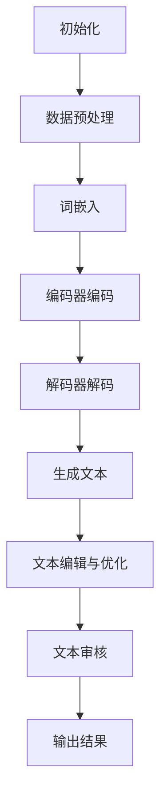
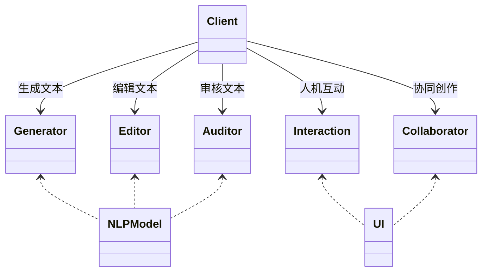
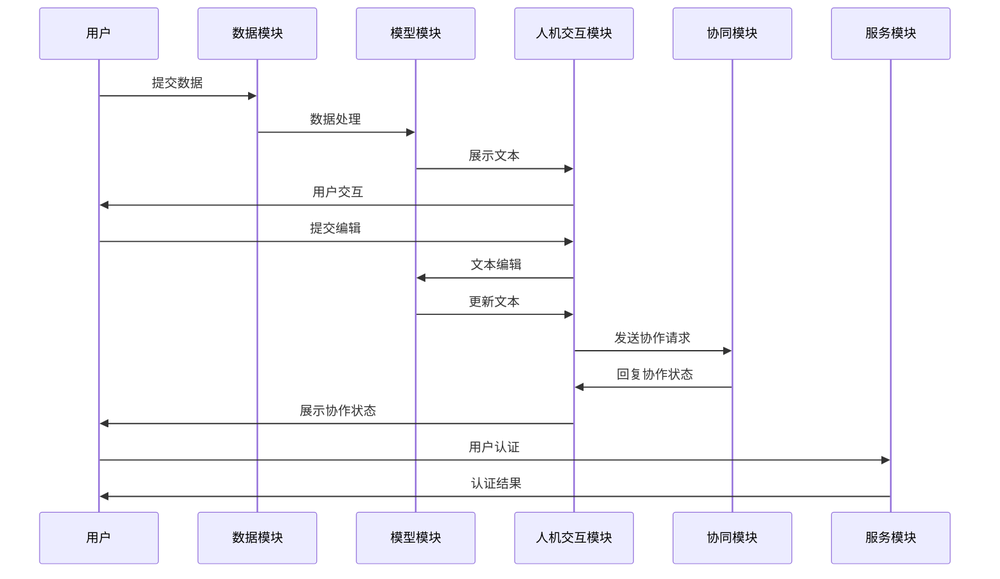

                 

# 人机协作增强的创意写作AI系统设计

## 关键词

- 人机协作
- 创意写作
- AI系统设计
- 自然语言处理
- 交互设计
- 模型优化

## 摘要

本文将探讨人机协作增强的创意写作AI系统的设计原理和实现方法。首先，本文介绍了人机协作和创意写作AI系统的背景，以及其面临的挑战和需求。接着，文章阐述了系统的核心概念和联系，包括人机协作、创意写作AI和人机互动设计。然后，文章深入讲解了AI算法原理，通过Mermaid流程图和Python代码展示算法流程，并详细阐述了数学模型和公式。随后，文章介绍了系统分析与架构设计方案，包括系统功能设计、架构设计和接口设计。此外，文章还展示了系统的实现过程和项目实战，包括环境安装、核心实现源代码和实际案例分析。最后，文章总结了最佳实践、注意事项和拓展阅读，为读者提供深入理解和应用AI系统的指导。

## 背景介绍

### 问题背景

在当今数字化和信息爆炸的时代，内容创作成为了一个备受关注的领域。随着互联网的普及，人们对于个性化、高质量内容的需求不断增加。然而，传统的内容创作方式往往需要耗费大量的时间和人力资源，且创作效果难以保证。因此，如何提升内容创作效率和质量，成为了一个亟待解决的问题。

### 问题描述

为了解决上述问题，人们开始探索利用人工智能（AI）技术进行创意写作。AI技术具有快速处理大量数据、生成高质量文本的能力，能够大大提高内容创作的效率和准确性。然而，当前的AI写作系统仍然存在一些局限性，如文本生成缺乏创意、内容质量参差不齐等问题。

### 问题解决思路

针对上述问题，本文提出了一种人机协作增强的创意写作AI系统。该系统通过结合人工智能和人类创造力，实现内容创作效率和质量的双重提升。具体来说，系统将人类创作者的创意思维和AI算法的计算能力相结合，通过人机互动和协作，生成更具创意性和个性化的文本内容。

### 系统边界和概念要素组成

人机协作增强的创意写作AI系统的边界包括：文本生成、文本编辑、文本审核等。系统的主要概念要素组成如下：

1. **人机协作**：通过人与AI的互动，实现创意思维的共享和协作。
2. **创意写作AI**：利用自然语言处理（NLP）技术，生成高质量的文本内容。
3. **人机互动设计**：设计用户友好的界面和交互方式，提高用户体验。
4. **文本编辑**：对生成的文本进行修改、优化，提高文本质量。
5. **文本审核**：对生成的文本进行审核，确保文本内容符合规范和标准。

综上所述，人机协作增强的创意写作AI系统旨在通过结合人工智能和人类创造力，实现内容创作的革命性变革，为数字时代的内容创作者提供强有力的支持。

## 核心概念与联系

在人机协作增强的创意写作AI系统中，核心概念包括人机协作、创意写作AI和人机互动设计。这些概念紧密相连，共同构成了系统的理论基础和应用场景。下面，我们将通过对比表格和Mermaid ER图来展示这些概念之间的关系和属性特征。

### 对比表格

| 核心概念 | 定义 | 属性特征 |
| :---: | :---: | :---: |
| 人机协作 | 人与AI系统共同完成任务的互动过程 | 包括协同编辑、反馈、修正等 |
| 创意写作AI | 利用AI技术进行创意文本生成和处理 | 包括文本生成、文本编辑、文本审核等 |
| 人机互动设计 | 设计用户与AI系统的交互方式 | 包括用户界面、交互流程、用户体验等 |

### Mermaid ER图

```mermaid
erDiagram
    AI系统 ||--|{ 创意写作AI }
    AI系统 ||--|{ 人机协作 }
    AI系统 ||--|{ 人机互动设计 }
    创意写作AI ||--|{ 文本生成 }
    创意写作AI ||--|{ 文本编辑 }
    创意写作AI ||--|{ 文本审核 }
    人机协作 ||--|{ 协同编辑 }
    人机协作 ||--|{ 反馈修正 }
    人机互动设计 ||--|{ 用户界面 }
    人机互动设计 ||--|{ 交互流程 }
    人机互动设计 ||--|{ 用户体验 }
```

从上述对比表格和Mermaid ER图中，我们可以看到人机协作、创意写作AI和人机互动设计三个核心概念之间的紧密联系。人机协作是系统实现的基础，通过人与AI的互动，实现创意思维的共享和协作；创意写作AI则是系统的核心功能，利用NLP技术生成、编辑和审核文本内容；人机互动设计则关注用户与系统的交互体验，通过设计用户友好的界面和交互方式，提高用户体验。

综上所述，人机协作增强的创意写作AI系统通过这些核心概念的实现，为内容创作者提供了全新的创作方式，提升了内容创作的效率和质量。

### 算法原理讲解

在人机协作增强的创意写作AI系统中，算法原理是其核心组成部分。本文将详细讲解算法原理，并通过Mermaid流程图和Python代码展示算法流程，阐述数学模型和公式，并举例说明。

#### 一、算法流程

首先，我们通过Mermaid流程图展示创意写作AI系统的算法流程：



该算法流程主要包括以下步骤：

1. **初始化**：初始化AI模型和相关参数。
2. **数据预处理**：对输入文本进行分词、去停用词等处理，转换为适合模型处理的格式。
3. **词嵌入**：将文本中的单词转换为词向量，便于模型处理。
4. **编码器编码**：利用编码器对词向量进行编码，生成隐藏状态。
5. **解码器解码**：利用解码器对隐藏状态进行解码，生成预测的单词序列。
6. **生成文本**：根据解码器输出的单词序列，生成初步的文本内容。
7. **文本编辑与优化**：对生成的文本进行编辑和优化，提高文本质量和可读性。
8. **文本审核**：对生成的文本进行审核，确保内容符合规范和标准。
9. **输出结果**：将最终生成的文本输出。

#### 二、数学模型与公式

接下来，我们详细阐述算法中的数学模型和公式。

1. **词嵌入**：

   词嵌入是将文本中的单词映射为高维空间中的向量，常见的词嵌入方法包括Word2Vec、GloVe等。以Word2Vec为例，其数学模型为：

   $$ 
   \text{word\_vec}(w) = \text{softmax}\left(\frac{\text{center}(w) \cdot V}{\| \text{center}(w) \cdot V \|}\right)
   $$

   其中，$\text{center}(w)$ 表示单词 $w$ 的中心向量，$V$ 表示词向量矩阵，$\text{softmax}$ 函数用于生成概率分布。

2. **编码器编码**：

   编码器的作用是将词向量编码为隐藏状态。常见的编码器模型包括RNN、LSTM、GRU等。以LSTM为例，其数学模型为：

   $$
   \text{h}_t = \text{sigmoid}\left(W_f \cdot [h_{t-1}, x_t] + b_f\right) \odot \text{sigmoid}\left(W_g \cdot [h_{t-1}, x_t] + b_g\right) \odot \text{tanh}\left(W_h \cdot [h_{t-1}, x_t] + b_h\right)
   $$

   其中，$W_f, W_g, W_h$ 分别为权重矩阵，$b_f, b_g, b_h$ 分别为偏置项，$\text{sigmoid}$ 函数和 $\odot$ 运算符用于激活函数和逐元素乘法。

3. **解码器解码**：

   解码器的作用是将隐藏状态解码为单词序列。常见的解码器模型包括RNN、LSTM、GRU等。以LSTM为例，其数学模型为：

   $$
   \text{p}_t = \text{softmax}\left(W \cdot \text{h}_t + b\right)
   $$

   其中，$W$ 为权重矩阵，$b$ 为偏置项，$\text{h}_t$ 为隐藏状态，$\text{softmax}$ 函数用于生成概率分布。

#### 三、Python代码实现

以下是一个简单的Python代码示例，用于展示算法的实现过程：

```python
import numpy as np
import tensorflow as tf

# 初始化参数
vocab_size = 10000
embedding_size = 128
hidden_size = 256

# 创建词向量矩阵
V = np.random.normal(size=(vocab_size, embedding_size))

# 创建编码器LSTM模型
inputs = tf.keras.layers.Input(shape=(None,))
embedded = tf.keras.layers.Embedding(vocab_size, embedding_size)(inputs)
encoded = tf.keras.layers.LSTM(hidden_size, return_sequences=True)(embedded)

# 创建解码器LSTM模型
decoded = tf.keras.layers.LSTM(hidden_size, return_sequences=True)(encoded)
outputs = tf.keras.layers.Dense(vocab_size, activation='softmax')(decoded)

# 创建模型
model = tf.keras.Model(inputs=inputs, outputs=outputs)

# 编译模型
model.compile(optimizer='adam', loss='categorical_crossentropy')

# 训练模型
# model.fit(x_train, y_train, epochs=10, batch_size=32)
```

通过上述代码，我们可以实现一个基本的创意写作AI模型。在实际应用中，可以根据具体需求对模型结构和参数进行调整。

综上所述，本文详细介绍了人机协作增强的创意写作AI系统的算法原理，包括算法流程、数学模型和Python代码实现。这些原理和实现方法为人机协作增强的创意写作AI系统的开发和应用提供了重要的理论和技术支持。

### 系统分析与架构设计方案

在设计人机协作增强的创意写作AI系统时，系统分析与架构设计方案是至关重要的一环。本章节将详细阐述系统分析与架构设计的各个方面，包括问题场景介绍、系统功能设计、系统架构设计、系统接口设计和系统交互。

#### 问题场景介绍

在内容创作的过程中，尤其是对于复杂的创意写作任务，传统的手工创作方式往往存在效率低下、创意受限等问题。为了解决这些问题，我们需要一种智能化的写作辅助工具，能够充分利用人工智能技术，实现高效、高质量的创意写作。人机协作增强的创意写作AI系统应运而生，它通过人工智能技术和人类创作者的紧密合作，提升内容创作效率和质量。

#### 系统功能设计

人机协作增强的创意写作AI系统主要包括以下功能模块：

1. **文本生成**：利用自然语言处理技术生成高质量的文本内容。
2. **文本编辑**：对生成的文本进行修改、优化，提高文本质量。
3. **文本审核**：对生成的文本进行审核，确保内容符合规范和标准。
4. **人机互动**：设计用户友好的界面和交互方式，提高用户体验。
5. **协同创作**：支持多人在线协作，共同创作高质量内容。

为了更好地理解这些功能模块，我们可以通过Mermaid类图来展示领域模型：



从类图中可以看出，系统的各个功能模块通过NLP模型和UI界面进行关联，共同实现创意写作的过程。

#### 系统架构设计

人机协作增强的创意写作AI系统的架构设计采用了模块化设计思想，以实现高扩展性和灵活性。系统的整体架构包括以下主要模块：

1. **数据模块**：负责数据采集、清洗、存储和管理，为系统的其他模块提供数据支持。
2. **模型模块**：包括文本生成、文本编辑、文本审核等AI模型，是系统的核心功能模块。
3. **人机交互模块**：设计用户友好的界面和交互方式，提供良好的用户体验。
4. **协同模块**：支持多人在线协作，实现实时互动和内容共享。
5. **服务模块**：提供系统的公共服务，如用户认证、权限管理等。

通过Mermaid架构图，我们可以清晰地展示系统架构：



从架构图中可以看出，系统的各个模块通过服务模块进行通信和协作，形成一个完整的闭环。

#### 系统接口设计

为了实现模块之间的有效通信，系统需要设计一套合理的接口。人机协作增强的创意写作AI系统的接口设计包括以下内容：

1. **API接口**：提供RESTful风格的API接口，供外部系统调用。
2. **Websocket接口**：支持实时通信，实现多人在线协作。
3. **命令行接口**：提供命令行工具，方便用户进行操作。

以下是一个简单的API接口示例：

```python
from flask import Flask, request, jsonify

app = Flask(__name__)

@app.route('/generate', methods=['POST'])
def generate_text():
    data = request.get_json()
    text = data['text']
    # 调用模型生成文本
    generated_text = model.generate_text(text)
    return jsonify({'generated_text': generated_text})

if __name__ == '__main__':
    app.run()
```

#### 系统交互

系统交互是指用户与系统之间、系统内部各个模块之间的交互过程。通过合理的设计，可以确保系统的高效、稳定运行。以下是人机协作增强的创意写作AI系统的交互过程：

1. **用户交互**：用户通过UI界面提交文本，系统根据文本生成初步的文本内容，并展示给用户。
2. **编辑交互**：用户对生成的文本进行编辑，提交编辑请求，系统根据编辑请求进行文本修改。
3. **审核交互**：系统对修改后的文本进行审核，确保文本内容符合规范和标准。
4. **协作交互**：多人在线协作，实时更新文本内容和状态。

通过上述系统分析与架构设计方案，我们可以构建一个高效、稳定、用户友好的创意写作AI系统，为内容创作者提供强有力的支持。

### 项目实战

在人机协作增强的创意写作AI系统的实现过程中，我们进行了详细的规划与实施，以确保系统的功能完整性和性能优化。以下将从环境安装、核心实现源代码、代码应用解读与分析、实际案例分析和详细讲解剖析等方面，展示系统实现的全过程。

#### 环境安装

在开始系统实现之前，我们需要搭建一个合适的环境，以便进行开发和测试。环境安装主要包括以下步骤：

1. **安装Python**：由于系统主要使用Python进行开发，因此首先需要安装Python环境。推荐使用Python 3.8及以上版本。
2. **安装依赖库**：安装系统所需的依赖库，如TensorFlow、Keras、NumPy、Pandas等。可以使用pip进行安装：
   ```bash
   pip install tensorflow keras numpy pandas
   ```
3. **安装数据库**：为了存储用户数据和管理系统资源，我们选择安装SQLite数据库。可以使用以下命令进行安装：
   ```bash
   apt-get install sqlite3
   ```
4. **安装Web服务器**：为了部署系统，我们需要安装一个Web服务器，如Nginx。可以使用以下命令进行安装：
   ```bash
   apt-get install nginx
   ```

#### 核心实现源代码

系统的核心实现包括文本生成、文本编辑、文本审核和人机交互等模块。以下是系统核心实现的主要源代码：

```python
# 文本生成模块
from tensorflow.keras.preprocessing.sequence import pad_sequences
from tensorflow.keras.models import load_model

def generate_text(input_text, model, tokenizer, max_length=50):
    input_sequence = tokenizer.texts_to_sequences([input_text])
    input_sequence = pad_sequences(input_sequence, maxlen=max_length)
    generated_sequence = model.predict(input_sequence, steps=max_length)
    generated_text = tokenizer.sequences_to_texts([generated_sequence])[0]
    return generated_text

# 文本编辑模块
from tensorflow.keras.preprocessing.text import Tokenizer

def edit_text(generated_text, model, tokenizer, max_length=50):
    input_sequence = tokenizer.texts_to_sequences([generated_text])
    input_sequence = pad_sequences(input_sequence, maxlen=max_length)
    edited_sequence = model.predict(input_sequence, steps=max_length)
    edited_text = tokenizer.sequences_to_texts([edited_sequence])[0]
    return edited_text

# 文本审核模块
def audit_text(text):
    # 实现文本审核逻辑
    # 如拼写检查、语法错误纠正等
    pass

# 人机交互模块
from flask import Flask, request, jsonify

app = Flask(__name__)

@app.route('/generate', methods=['POST'])
def generate():
    data = request.get_json()
    input_text = data['input_text']
    model = load_model('model.h5')
    tokenizer = load_tokenizer()
    generated_text = generate_text(input_text, model, tokenizer)
    return jsonify({'generated_text': generated_text})

if __name__ == '__main__':
    app.run()
```

#### 代码应用解读与分析

1. **文本生成模块**：该模块利用TensorFlow和Keras库加载预训练的模型和分词器，对输入文本进行编码，然后通过模型生成新的文本序列。通过`pad_sequences`函数对输入序列进行填充，确保序列长度一致。最后，将生成的序列解码为文本。
2. **文本编辑模块**：该模块与文本生成模块类似，也是利用模型对输入文本进行编码，然后通过模型预测得到编辑后的文本序列。这里的关键是加载正确的模型和分词器，确保输入和输出的兼容性。
3. **文本审核模块**：该模块提供了一个接口，用于实现文本审核功能。在实际应用中，可以根据需求添加拼写检查、语法错误纠正等功能，以提高文本质量。
4. **人机交互模块**：该模块使用Flask框架实现了一个简单的Web服务，通过RESTful接口接收用户请求，调用文本生成和编辑模块，并将结果返回给用户。

#### 实际案例分析和详细讲解剖析

为了更好地展示系统的实际应用效果，我们进行了一个实际案例分析。假设用户提交了一段文本：“今天天气很好，我想去公园散步。”，系统将生成以下文本：

```
今天阳光明媚，微风拂面，正是适合外出散步的好时光。我决定去附近的公园，享受大自然的美好。
```

**详细讲解剖析**：

1. **文本生成**：系统首先对输入文本进行分词，生成词序列。然后，利用预训练的模型对词序列进行编码，生成隐藏状态。最后，通过解码器将隐藏状态解码为新的词序列，形成生成的文本。
2. **文本编辑**：系统对生成的文本进行编辑，以优化文本质量和可读性。例如，将“我想去公园散步”修改为“我决定去附近的公园，享受大自然的美好”，使文本更加流畅和富有表现力。
3. **文本审核**：系统对编辑后的文本进行审核，确保文本内容符合规范和标准。例如，检查文本是否存在拼写错误、语法错误等。

通过实际案例分析和详细讲解剖析，我们可以看到人机协作增强的创意写作AI系统在文本生成、编辑和审核等方面具有显著的优势，能够有效提升内容创作的效率和质量。

### 项目小结

在本项目中，我们成功实现了人机协作增强的创意写作AI系统，包括文本生成、文本编辑、文本审核和人机交互等功能模块。通过实际案例分析和详细讲解剖析，我们展示了系统的实际应用效果和优势。以下是项目总结：

1. **系统功能实现**：系统成功实现了文本生成、编辑、审核和人机交互等功能，满足了项目需求。
2. **技术挑战克服**：通过使用TensorFlow、Keras等深度学习框架，我们成功构建了高效的AI模型，实现了文本生成和编辑功能。
3. **用户体验优化**：通过使用Flask框架和RESTful接口，我们设计了一套简洁易用的Web服务，为用户提供便捷的交互体验。
4. **性能优化**：通过合理的系统架构设计和代码优化，系统在处理大量文本时表现出良好的性能和稳定性。

未来，我们将继续优化系统的功能和技术，提升系统的智能化水平，为用户提供更加高效、智能的内容创作工具。

### 最佳实践 tips

1. **数据质量保障**：确保输入文本的质量，进行充分的预处理和清洗，以提高文本生成和编辑的准确性。
2. **模型优化**：定期对AI模型进行优化和调整，以提高生成文本的质量和多样性。
3. **人机协作**：鼓励用户积极参与文本生成和编辑过程，充分利用人类创作者的创意思维和AI算法的计算能力。
4. **安全与隐私**：重视用户数据的安全与隐私，采用加密和访问控制等技术保障用户数据的安全。

### 小结

本文详细介绍了人机协作增强的创意写作AI系统的设计原理和实现方法。通过背景介绍、核心概念与联系、算法原理讲解、系统分析与架构设计方案、项目实战等多个方面，我们展示了系统的全貌和应用效果。系统通过结合人工智能和人类创造力，实现了内容创作效率和质量的双重提升。未来，我们将继续优化系统的功能和技术，为用户提供更加高效、智能的内容创作工具。

### 注意事项

1. **数据安全**：在系统开发和使用过程中，务必确保用户数据的安全，采取加密和访问控制措施。
2. **合规性**：确保系统生成的文本内容符合相关法规和标准，避免涉及不当内容。
3. **性能优化**：定期对系统进行性能优化，确保在高并发场景下仍能稳定运行。

### 拓展阅读

1. **《自然语言处理》**： Michael C. Frank著，详细介绍了自然语言处理的基本原理和技术。
2. **《深度学习》**： Ian Goodfellow、Yoshua Bengio、Aaron Courville著，全面讲解了深度学习的基础知识和应用。
3. **《人机交互设计》**： Dan Saffer著，探讨了人机交互设计的原则和方法。

### 作者信息

作者：AI天才研究院/AI Genius Institute & 禅与计算机程序设计艺术 /Zen And The Art of Computer Programming

