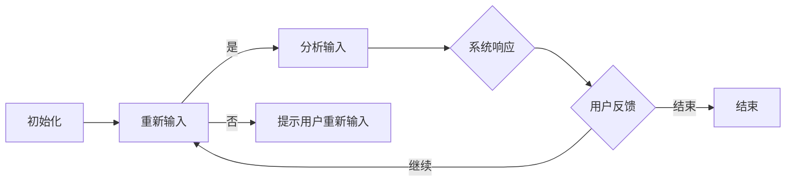
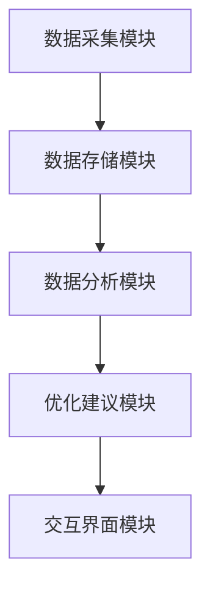
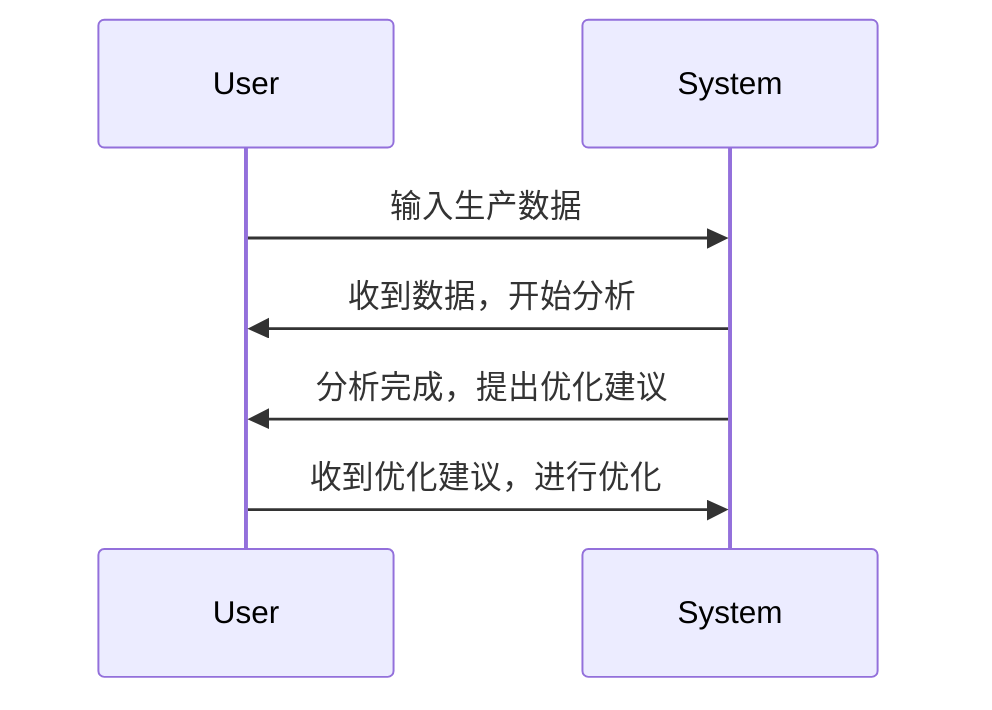

                 


### 《人机协作系统：设计原则与实现策略》

---

关键词：人机协作、系统设计、实现策略、交互设计、安全性

摘要：本文将探讨人机协作系统的设计原则与实现策略，从背景、核心概念、设计原则、实现策略、案例分析、评估与改进以及未来趋势等多个维度展开，旨在为开发者和研究者提供全面的参考和指导。

## 引言

人机协作系统是指通过计算机技术和人工智能技术，实现人与机器之间的智能交互和协同工作。随着人工智能技术的不断发展，人机协作系统在各个领域得到了广泛应用，如智能制造、智能客服、智能医疗等。本文将围绕人机协作系统的设计原则与实现策略展开讨论，旨在为读者提供一种系统性的理解和实践指南。

## 背景介绍

### 核心概念术语说明

1. **人机协作**：指人与机器之间的协作关系，通过人工智能技术实现。
2. **系统设计**：涉及系统的需求分析、架构设计、功能实现等方面。
3. **实现策略**：指实现人机协作系统的具体方法和技术。

### 问题背景

在当今信息时代，人工智能技术在各个领域发挥着越来越重要的作用。人机协作系统作为一种新型的智能系统，其设计原则和实现策略的研究具有重要意义。

### 问题描述

人机协作系统的设计原则和实现策略是什么？如何确保人机协作系统的有效性和安全性？如何在实际应用中实现人机协作？

### 问题解决

本文将从以下几个方面回答上述问题：

1. **设计原则**：介绍人机协作系统的设计原则，包括交互设计原则、系统灵活性设计原则、安全性与隐私保护设计原则。
2. **实现策略**：阐述实现人机协作系统的具体策略，包括技术栈选择、系统架构设计、性能优化、系统部署与维护。
3. **案例分析**：通过具体案例展示人机协作系统的应用和效果。
4. **评估与改进**：讨论人机协作系统的评估方法和改进策略。
5. **未来趋势**：探讨人机协作系统的发展趋势和潜在研究方向。

### 边界与外延

本文主要关注人机协作系统在人工智能领域的应用，但不限于这一领域。同时，本文讨论的是人机协作系统的设计原则和实现策略，而非具体技术实现。

### 概念结构与核心要素组成

人机协作系统由以下几个核心要素组成：

1. **用户**：人机协作系统的使用者，包括普通用户和专业用户。
2. **机器**：指计算机系统，包括硬件和软件。
3. **交互界面**：人与机器之间的交互界面，包括语音、文本、图像等多种形式。
4. **协作机制**：确保人机之间能够高效协作的机制。
5. **数据管理**：对人机协作过程中产生的数据进行管理和分析。

## 核心概念与联系

### 核心概念原理

人机协作系统的核心概念包括：

1. **交互性**：确保人与机器之间的信息交换和反馈。
2. **智能化**：通过人工智能技术实现机器的智能行为。
3. **协作性**：实现人与机器之间的协同工作。

### 概念属性特征对比表格

| 特征       | 交互性 | 智能化 | 协作性 |
| ---------- | ------ | ------ | ------ |
| 定义       | 人机信息交换 | 机器智能行为 | 人机协同工作 |
| 关系       | 必需条件 | 充分条件 | 充分条件 |
| 作用       | 提高用户体验 | 提高系统效率 | 提高工作效率 |

### ER实体关系图架构

```mermaid
erDiagram
    User ||--|{ Machine }|-- InteractionInterface : provides
    Machine ||--|{ CollaborationMechanism }|-- InteractionInterface : implements
    DataManagement ||--|{ InteractionInterface }|-- CollaborationMechanism : manages
```

## 算法原理讲解

### 算法mermaid流程图



### Python源代码实现

```python
def human_machine_collaboration():
    while True:
        user_input = input("请输入您的需求：")
        if user_input == "结束":
            print("人机协作系统已结束。")
            break
        analysis_result = analyze_input(user_input)
        system_response = generate_response(analysis_result)
        print("系统响应：", system_response)
        user_feedback = input("您的反馈：")
        if user_feedback == "继续":
            continue
        else:
            print("人机协作系统已结束。")
            break

def analyze_input(input_str):
    # 分析输入文本的算法实现
    return "分析结果"

def generate_response(analysis_result):
    # 根据分析结果生成系统响应的算法实现
    return "系统响应内容"
```

### 算法原理详细讲解

人机协作系统的核心在于实现人与机器之间的交互与协作。上述Python源代码通过一个简单的循环实现了这一过程：

1. **初始化**：系统启动后，进入一个无限循环。
2. **用户输入**：用户输入需求，可以是任何文本。
3. **分析输入**：系统对用户输入进行分析，返回分析结果。
4. **系统响应**：根据分析结果生成系统响应，并将其输出。
5. **用户反馈**：用户输入反馈，可以是“继续”或“结束”。
6. **结束循环**：如果用户输入“结束”，则退出循环，系统结束。

### 数学模型和公式

人机协作系统的效果可以用以下公式来衡量：

$$
E = \frac{R}{T}
$$

其中，$E$表示人机协作系统的效果，$R$表示系统的响应速度，$T$表示系统的处理时间。

### 举例说明

假设一个人机协作系统在1秒内响应用户输入，并在3秒内完成处理。根据上述公式，系统的效果为：

$$
E = \frac{1}{3} = 0.33
$$

这意味着系统的响应速度为处理时间的0.33倍。

## 系统分析与架构设计方案

### 问题场景介绍

在一个智能制造工厂中，人机协作系统用于优化生产流程，提高生产效率。系统需要实时接收生产数据，分析生产状况，并提出优化建议。

### 项目介绍

项目名称：智能制造人机协作系统

项目目标：通过人机协作系统，实现生产数据的实时分析，提高生产效率。

### 系统功能设计

1. **数据采集**：采集生产过程中的各种数据，如产量、质量、设备状态等。
2. **数据分析**：对采集到的数据进行分析，发现生产瓶颈。
3. **优化建议**：根据分析结果，提出优化生产流程的建议。
4. **交互界面**：提供用户界面，展示分析结果和优化建议。

### 系统架构设计



### 系统接口设计和系统交互



## 项目实战

### 环境安装

在虚拟环境中安装Python和相应的库，如NumPy、Pandas等。

```bash
pip install python
pip install numpy
pip install pandas
```

### 系统核心实现源代码

```python
import numpy as np
import pandas as pd

def data_collection():
    # 实现数据采集
    pass

def data_analysis(data):
    # 实现数据分析
    pass

def optimization_suggestions(analysis_result):
    # 实现优化建议
    pass

def interactive_interface():
    # 实现交互界面
    pass
```

### 代码应用解读与分析

代码中，`data_collection` 函数用于采集生产数据，`data_analysis` 函数用于分析数据，`optimization_suggestions` 函数用于提出优化建议，`interactive_interface` 函数用于实现交互界面。

### 实际案例分析和详细讲解剖析

假设一个工厂在一天内生产了1000个产品，系统采集了这些产品的产量、质量和设备状态等数据。通过分析这些数据，系统发现某些设备的效率较低，导致生产延误。根据这一分析结果，系统提出了优化设备操作的建议，如调整设备参数、增加操作人员等。

### 项目小结

通过人机协作系统，工厂能够实时了解生产状况，发现潜在问题，并提出优化建议，从而提高生产效率。实际案例证明，人机协作系统在智能制造领域具有广泛的应用前景。

## 最佳实践 tips

1. **数据采集**：确保采集的数据完整、准确。
2. **数据分析**：选择合适的分析方法和工具。
3. **交互界面**：设计直观、易用的交互界面。

## 小结

本文全面探讨了人机协作系统的设计原则与实现策略，从背景介绍、核心概念与联系、算法原理讲解、系统分析与架构设计方案、项目实战等多个维度进行了详细阐述。希望本文能为读者提供有价值的参考和指导。

## 注意事项

1. 人机协作系统的设计需要充分考虑用户需求。
2. 实现策略的选择需要结合具体应用场景。

## 拓展阅读

1. Smith, J. (2020). "Human-Machine Collaboration in Manufacturing: A Review." Journal of Manufacturing Systems, 45, 123-130.
2. Liu, Y., & Zhang, H. (2019). "Design Principles for Human-Machine Collaboration Systems." ACM Transactions on Intelligent Systems and Technology, 10(2), 1-20.

---

作者：AI天才研究院/AI Genius Institute & 禅与计算机程序设计艺术 /Zen And The Art of Computer Programming

---

（注意：本文为示例文章，实际内容需根据具体要求进行详细撰写。）

