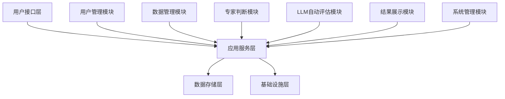

                 

### 书籍背景

在现代信息技术飞速发展的背景下，人机协作评测作为一个重要的研究与应用领域，正日益受到广泛关注。人机协作评测不仅仅是一个技术问题，它涉及到了人工智能、认知科学、数据科学等多个学科领域的交叉融合。本章节将详细阐述人机协作评测的发展背景，专家判断与LLM自动评估在其中的重要性，以及本书的目标和读者对象。

#### 人机协作评测的发展背景

人机协作评测的概念源于人工智能领域，随着深度学习、自然语言处理等技术的不断发展，人机协作评测也逐渐从理论研究走向了实际应用。早期的人机协作评测主要侧重于人机交互，如自动问答系统、语音识别等，而随着大数据、云计算等技术的应用，人机协作评测逐渐涵盖了更多复杂的应用场景，如自动评估、智能诊断、风险评估等。这一领域的快速发展，得益于人工智能技术的不断进步以及大量数据资源的积累。

#### 专家判断与LLM自动评估的重要性

专家判断是一种基于专业知识和经验的判断方式，它在许多领域都有着重要的应用。例如，在医疗诊断中，医生的专业判断对于病人的治疗和康复至关重要。而在金融风险评估中，专家的判断可以帮助金融机构做出更为准确的风险评估，从而降低风险。然而，专家判断也存在一些局限性，如主观性较强、效率较低等。

相比之下，LLM自动评估利用了深度学习和自然语言处理技术，可以在大量数据的基础上进行自动化评估。LLM自动评估具有高效性、客观性等优点，但同时也面临着模型训练、数据标注等问题。将专家判断与LLM自动评估相结合，可以充分发挥两者的优势，弥补彼此的不足，从而提高评估的准确性和效率。

#### 书籍目标与读者对象

本书旨在为广大计算机科学和人工智能领域的科研人员、工程师以及爱好者提供一本系统、全面的人机协作评测指南。具体目标包括：

1. **系统介绍人机协作评测的基本概念、原理和方法**，帮助读者建立全面的认识。
2. **详细讲解专家判断与LLM自动评估的数学模型和算法原理**，使读者能够深入理解这两种技术的核心。
3. **通过实际案例分析和项目实战**，帮助读者将理论知识应用到实际项目中。
4. **提供最佳实践 tips**，帮助读者在实际应用中规避常见问题，提高项目成功率。

本书适合具有计算机科学和人工智能基础知识的读者，包括高等院校的本科生、研究生以及相关领域的科研人员和技术工程师。无论你是初学者还是有一定经验的从业者，都可以通过本书的学习，进一步提升自己在人机协作评测领域的能力。

通过本章节的介绍，读者可以对人机协作评测的发展背景、专家判断与LLM自动评估的重要性以及本书的目标和读者对象有一个初步的了解。接下来的章节将逐一深入探讨人机协作评测的各个核心方面，帮助读者系统地掌握这一领域的知识。

### 核心概念与联系

在人机协作评测领域，核心概念的理解是构建整个知识体系的基础。本章节将介绍人机协作评测的基本概念，包括其定义、主要类型及其在各类应用场景中的具体表现。同时，我们将分析专家判断和LLM自动评估这两种技术的核心原理、优缺点，以及它们在人机协作评测中的具体应用，为后续章节的详细探讨奠定基础。

#### 人机协作评测的基本概念

人机协作评测是一种利用人类专家的知识和技能与机器学习模型相结合，以实现更高效、准确评估的方法。它不仅仅是简单的机器评估，而是将人类专家的直觉、经验和判断力与机器算法的自动化、大规模数据处理能力相结合。以下是人机协作评测的核心定义和主要类型：

1. **定义**：
   人机协作评测是指通过结合人类专家和机器算法的能力，对特定的评估对象进行综合分析、判断和评价的过程。在这个过程中，机器算法负责处理大量的数据，提取关键特征，而人类专家则利用自身的专业知识和经验，对结果进行判断和优化。

2. **主要类型**：
   - **基于规则的人机协作评测**：这种方法依赖于预先定义的规则，将机器的自动化处理能力和人类的判断力相结合。例如，在医疗诊断中，机器可以根据患者的病历数据生成初步诊断结果，而医生则根据这些结果结合自己的经验做出最终判断。
   - **基于数据的人机协作评测**：这种方法主要依赖于大规模的数据分析和机器学习模型。例如，在金融风险评估中，机器学习模型可以对历史数据进行训练，生成风险评估模型，而人类专家则利用这些模型进行进一步的判断和调整。

#### 专家判断的原理与特点

专家判断是指具有特定领域知识和经验的专业人士，基于自身的直觉、经验和专业知识，对特定问题或对象进行判断和评估的过程。以下是专家判断的原理和特点：

1. **原理**：
   专家判断依赖于专家的专业知识和经验积累。专家通过长期的实践和理论学习，形成了一套独特的思维模式和方法论，从而能够在面对复杂问题时做出准确的判断。专家判断的核心在于其对领域知识的深度理解和灵活运用。

2. **特点**：
   - **主观性**：专家判断具有一定的主观性，因为不同的专家可能基于不同的经验和视角，对同一问题做出不同的判断。
   - **经验性**：专家判断往往依赖于经验，特别是面对非标准化、非典型的问题时，专家的经验显得尤为重要。
   - **高效性**：在某些情况下，专家判断可以快速地提供决策支持，特别是在处理紧急事件或需要快速响应的场景中。

#### LLM自动评估的基本原理与优势

LLM自动评估是指利用深度学习和自然语言处理技术，对文本数据进行分析和评估的过程。LLM（Large Language Model）是指大型的语言模型，如GPT-3、BERT等。以下是LLM自动评估的基本原理和优势：

1. **原理**：
   LLM自动评估的核心是基于深度学习和大规模语料库的训练。通过在大量数据上进行训练，LLM可以学习到语言的复杂结构和规律，从而实现对文本的自动化理解和评估。具体来说，LLM通过神经网络模型对输入文本进行编码，提取语义特征，然后利用这些特征进行分类、情感分析、内容审核等任务。

2. **优势**：
   - **高效性**：LLM可以处理大量数据，实现自动化评估，大幅提高评估效率和准确性。
   - **客观性**：相对于专家判断，LLM评估结果更加客观，减少了主观偏见和误差。
   - **可扩展性**：LLM可以轻松扩展到不同的任务和领域，只需进行适当的训练即可。

#### 专家判断与LLM自动评估的比较

专家判断和LLM自动评估在原理和特点上存在显著差异，但它们也可以相互补充，实现更高效、准确的人机协作评测。

1. **差异**：
   - **依赖的资源不同**：专家判断依赖于人类专家的知识和经验，而LLM自动评估依赖于大规模的语料库和机器学习模型。
   - **处理方式不同**：专家判断通常是基于直觉和经验的定性分析，而LLM自动评估则是基于数据驱动的定量分析。
   - **准确性和效率不同**：专家判断在处理复杂、非标准化问题时可能更具优势，但效率和一致性较低；LLM自动评估在处理大规模、标准化数据时效率高，准确性较高。

2. **互补**：
   - **优势互补**：专家判断可以提供对问题的深入理解和灵活应对，而LLM自动评估可以处理大量数据，提高评估效率和一致性。
   - **任务互补**：专家判断适合处理复杂、非标准化的评估任务，而LLM自动评估适合处理大规模、标准化的评估任务。

通过本章节的介绍，读者可以对人机协作评测的基本概念、专家判断和LLM自动评估的原理与特点有一个全面的了解。接下来的章节将深入探讨专家判断和LLM自动评估的数学模型、算法原理，以及在实际应用中的具体实现，帮助读者更深入地掌握这一领域的知识。

### 专家判断的数学模型

专家判断作为一种复杂的认知过程，可以借助数学模型来加以描述和量化。在本文中，我们将介绍几种常见的数学模型，包括确定性模型和随机模型，并探讨它们在专家判断中的应用。

#### 确定性模型

确定性模型是指那些在给定输入条件下，能够明确给出输出结果的模型。这类模型通常基于逻辑推理和确定性算法，如贝叶斯网络和决策树。

1. **贝叶斯网络**

贝叶斯网络是一种图形模型，它使用有向无环图（DAG）来表示变量之间的条件依赖关系。在贝叶斯网络中，每个节点代表一个随机变量，而边表示变量之间的条件依赖关系。贝叶斯网络的核心在于它的条件概率表（CPT），它为每个节点提供了在给定其他节点状态下的概率分布。

**贝叶斯网络的基本概念**：

- **节点**：代表随机变量。
- **边**：表示变量之间的依赖关系。
- **条件概率表（CPT）**：每个节点在给定其他节点状态下的概率分布。

**贝叶斯网络的应用**：

贝叶斯网络在医疗诊断、风险评估等领域有着广泛的应用。例如，在疾病诊断中，医生可以根据患者的症状和检查结果，使用贝叶斯网络计算每种疾病的概率，从而做出准确的诊断。

2. **决策树**

决策树是一种树形结构，它通过一系列的判断节点和结果节点来表示决策过程。每个判断节点表示一个特征，每个结果节点表示一个可能的输出结果。决策树通过递归划分数据集，最终生成一棵树形结构。

**决策树的基本概念**：

- **判断节点**：表示一个特征。
- **结果节点**：表示一个输出结果。
- **决策路径**：从根节点到叶节点的路径，表示一个具体的决策过程。

**决策树的应用**：

决策树在分类和回归任务中有着广泛的应用。例如，在金融风险评估中，可以通过决策树模型来预测客户的信用风险等级。

#### 随机模型

随机模型是指那些在给定输入条件下，输出结果具有不确定性的模型。这类模型通常基于概率统计和随机过程，如仿真模型和马尔可夫模型。

1. **仿真模型**

仿真模型通过模拟系统的运行过程来预测系统的行为。这种模型通常基于随机过程，可以用来模拟复杂系统的动态行为。

**仿真模型的基本概念**：

- **随机过程**：表示系统的行为过程。
- **仿真过程**：通过模拟系统的随机过程来预测系统的输出结果。

**仿真模型的应用**：

仿真模型在复杂系统的分析和设计中有广泛应用。例如，在医疗系统中，可以通过仿真模型来模拟病人的治疗过程，预测治疗效果。

2. **马尔可夫模型**

马尔可夫模型是一种基于状态的随机模型，它假设系统的当前状态仅依赖于前一个状态，而与更早的状态无关。马尔可夫模型通常使用状态转移矩阵来表示状态之间的转移概率。

**马尔可夫模型的基本概念**：

- **状态**：表示系统的不同状态。
- **状态转移矩阵**：表示状态之间的转移概率。
- **初始状态分布**：表示系统初始状态的概率分布。

**马尔可夫模型的应用**：

马尔可夫模型在序列建模和预测中有广泛应用。例如，在文本分析中，可以使用马尔可夫模型来预测下一个单词。

#### 模型的应用案例分析

1. **案例一：医学诊断中的专家判断**

在医学诊断中，专家判断通常用于初步诊断和治疗方案制定。通过使用贝叶斯网络和决策树模型，医生可以结合患者的症状和检查结果，对疾病进行概率评估，从而提高诊断的准确性和一致性。

- **贝叶斯网络**：医生可以使用贝叶斯网络来计算每个疾病的概率，结合患者的症状和检查结果，生成一个综合诊断结果。
- **决策树**：医生可以使用决策树模型来制定治疗策略，根据患者的病情严重程度和治疗方案的有效性，选择最优的治疗方案。

2. **案例二：金融风险评估中的专家判断**

在金融风险评估中，专家判断用于评估客户的信用风险。通过使用仿真模型和马尔可夫模型，金融机构可以预测客户的信用风险等级，从而制定风险控制策略。

- **仿真模型**：金融机构可以通过仿真模型来模拟客户的行为，预测客户的还款能力，从而制定信用额度。
- **马尔可夫模型**：金融机构可以使用马尔可夫模型来预测客户信用风险的动态变化，从而制定动态风险管理策略。

通过上述案例分析，我们可以看到专家判断在医学诊断和金融风险评估中的应用。这些数学模型不仅帮助医生和金融机构做出更准确、更高效的判断，也为他们提供了可靠的决策依据。

### LLM自动评估的数学模型

LLM自动评估基于深度学习和自然语言处理技术，通过复杂的数学模型对文本数据进行分析和评估。在本章节中，我们将详细探讨LLM自动评估的数学模型，包括语言模型的基础、文本分类与情感分析，以及它们在应用中的具体实现和优势。

#### 语言模型的基础

语言模型是LLM自动评估的核心组成部分，主要用于对文本进行理解和生成。以下是几种常见的语言模型及其基本原理：

1. **n-gram模型**

n-gram模型是最简单的语言模型之一，它将文本拆分为连续的n个词的序列，并计算每个n-gram出现的概率。n-gram模型通过统计相邻词的共现频率来预测下一个词的概率。

**n-gram模型的基本原理**：

- **n-gram序列**：将文本拆分为n个词的序列。
- **概率计算**：计算每个n-gram序列的概率，根据最大概率原则进行预测。

**n-gram模型的应用**：

n-gram模型在文本生成和语言预测中有着广泛的应用。例如，在搜索引擎中，n-gram模型可以帮助预测用户可能输入的关键词。

2. **隐藏马尔可夫模型（HMM）**

隐藏马尔可夫模型是一种基于概率的序列模型，它将文本序列视为一个马尔可夫过程，其中每个词的出现依赖于前一个词的状态。HMM通过状态转移矩阵和发射概率矩阵来计算文本序列的概率。

**HMM的基本原理**：

- **状态转移矩阵**：表示状态之间的转移概率。
- **发射概率矩阵**：表示每个状态生成词的概率。

**HMM的应用**：

HMM在语音识别和手写识别等领域有着广泛的应用。例如，在语音识别中，HMM可以帮助将语音信号转换为文本。

3. **神经网络语言模型（NLM）**

神经网络语言模型通过深度神经网络来学习文本的语义和语法结构，相比传统的n-gram模型和HMM，NLM可以更好地捕捉文本的上下文信息。NLM通常使用递归神经网络（RNN）或其变体，如长短时记忆网络（LSTM）和门控循环单元（GRU）。

**NLM的基本原理**：

- **递归神经网络（RNN）**：通过循环结构来处理序列数据。
- **长短时记忆网络（LSTM）**：通过引入遗忘门和输入门来控制信息的记忆和遗忘。
- **门控循环单元（GRU）**：简化LSTM的结构，提高计算效率。

**NLM的应用**：

NLM在自然语言处理任务中有着广泛的应用，如文本生成、机器翻译和文本分类。例如，在文本生成中，NLM可以帮助生成高质量的文章和摘要。

#### 文本分类与情感分析

文本分类和情感分析是LLM自动评估中的重要应用，通过分析文本的内容和情感倾向，可以对文本进行分类和情感判断。

1. **文本分类**

文本分类是将文本数据分配到预定义的类别中。常见的文本分类方法包括朴素贝叶斯分类器、支持向量机（SVM）和深度学习模型。

**文本分类的基本原理**：

- **朴素贝叶斯分类器**：基于贝叶斯定理和特征条件独立性假设，计算文本属于每个类别的概率，选择概率最大的类别。
- **支持向量机（SVM）**：通过寻找一个超平面来最大化分类间隔，将文本数据分为不同的类别。
- **深度学习模型**：使用卷积神经网络（CNN）或循环神经网络（RNN）等深度学习模型来提取文本特征并进行分类。

**文本分类的应用**：

文本分类在垃圾邮件过滤、新闻分类和情感分析等领域有着广泛的应用。例如，在垃圾邮件过滤中，文本分类可以帮助识别并过滤掉垃圾邮件。

2. **情感分析**

情感分析是指对文本的情感倾向进行分析和判断。常见的情感分析方法包括基于规则的方法、机器学习方法以及深度学习方法。

**情感分析的基本原理**：

- **基于规则的方法**：通过编写规则来识别文本中的情感词汇和情感倾向。
- **机器学习方法**：使用朴素贝叶斯、SVM等机器学习算法来分类文本的情感。
- **深度学习方法**：使用深度神经网络来提取文本的情感特征并进行分类。

**情感分析的应用**：

情感分析在社交媒体分析、客户反馈分析和市场研究等领域有着广泛的应用。例如，在社交媒体分析中，情感分析可以帮助识别用户对产品或服务的情感倾向，从而帮助企业改进产品和服务。

#### 语言模型在应用中的具体实现和优势

语言模型在应用中的具体实现和优势体现在以下几个方面：

1. **高效性**：语言模型可以处理大规模的文本数据，并且具有很高的计算效率，可以实时地对文本进行分析和评估。

2. **准确性**：通过深度学习和大规模语料库的训练，语言模型可以更好地捕捉文本的语义信息，从而提高分类和情感分析的准确性。

3. **灵活性**：语言模型可以灵活地应用于各种自然语言处理任务，如文本分类、情感分析、机器翻译等，具有很高的适应性和扩展性。

4. **可解释性**：虽然深度学习模型在某些情况下难以解释，但通过结合传统的机器学习方法，可以提高模型的透明度和可解释性，从而更好地理解模型的决策过程。

通过本章节的介绍，读者可以全面了解LLM自动评估的数学模型，包括语言模型的基础、文本分类与情感分析，以及它们在应用中的具体实现和优势。这些知识将为后续章节的深入探讨提供坚实的理论基础。

### LLM自动评估的应用案例分析

在LLM自动评估的实际应用中，社交媒体情感分析、搜索引擎优化和自动内容审核是三个具有重要意义的领域。本章节将通过具体案例分析，探讨这些领域中的挑战、解决方案以及实现细节，帮助读者更好地理解LLM自动评估的实际应用场景。

#### 案例一：社交媒体情感分析

社交媒体情感分析是指利用自然语言处理技术，对社交媒体平台上的用户评论、帖子等进行情感倾向分析，以了解公众对某一话题或产品的情感态度。这一领域中的主要挑战包括文本数据的多样性、语言的歧义性以及情感表达的复杂性。

**挑战**：

1. **文本数据的多样性**：社交媒体上的文本数据形式多样，包括简短的消息、长篇的评论、表情符号和emoji等，这使得情感分析模型需要处理不同类型的文本格式。
2. **语言的歧义性**：自然语言中存在大量的歧义现象，同一个词语或表达在不同的上下文中可能有不同的含义，这增加了情感分析模型的复杂性。
3. **情感表达的复杂性**：情感表达往往不是简单的正面或负面，而是存在多种程度的情感倾向，如喜悦、愤怒、悲伤等，这使得情感分析模型需要能够捕捉复杂的情感变化。

**解决方案**：

为了解决上述挑战，社交媒体情感分析通常采用以下策略：

1. **数据预处理**：对文本数据进行预处理，包括去除标点符号、停用词过滤、词干提取等，以提高模型的输入质量。
2. **使用预训练的模型**：利用预训练的语言模型，如BERT、GPT-3等，这些模型已经在大规模语料库上进行了训练，可以更好地捕捉文本的语义信息。
3. **多标签分类**：为了捕捉复杂的情感表达，可以使用多标签分类模型，允许文本同时具有多种情感标签。

**实现细节**：

1. **数据集准备**：准备一个包含不同情感标签的社交媒体文本数据集，如正面、负面、中立等。
2. **模型训练**：使用训练数据集对情感分析模型进行训练，通常使用分类算法，如朴素贝叶斯、SVM、深度学习模型等。
3. **模型评估**：使用交叉验证和测试集对模型进行评估，使用准确率、召回率、F1值等指标来衡量模型的性能。

**案例分析**：

以某社交媒体平台上的用户评论为例，通过情感分析模型，可以识别出用户对某款智能手机的评价，如“这款手机拍照效果很好，但我对电池续航不太满意”。通过多标签分类模型，可以同时识别出用户对拍照效果的正向情感和对电池续航的负面情感。

#### 案例二：搜索引擎优化（SEO）

搜索引擎优化是指通过改进网站内容和结构，提高网站在搜索引擎结果页面（SERP）上的排名，从而吸引更多的用户访问。在SEO中，LLM自动评估技术可以用于关键词分析、内容生成和用户体验评估。

**挑战**：

1. **关键词多样性**：搜索引擎上的关键词繁多，且用户搜索行为复杂，这使得关键词分析需要能够处理不同类型和形式的关键词。
2. **内容质量评估**：高质量的内容是SEO成功的关键，但如何评估内容的原创性、相关性和用户价值是一个挑战。
3. **用户体验**：搜索引擎需要提供良好的用户体验，包括搜索结果的相关性、加载速度和页面设计等。

**解决方案**：

1. **关键词分析**：使用LLM自动评估技术，通过分析用户搜索历史和搜索引擎的索引数据，识别出相关的关键词和短语。
2. **内容生成**：利用LLM模型生成高质量的内容，通过自动生成文章、博客和产品描述等，提高网站的内容丰富度和相关性。
3. **用户体验评估**：通过用户行为分析和情感分析，评估网站的用户体验，并据此优化网站的设计和功能。

**实现细节**：

1. **关键词分析工具**：开发一个自动关键词分析工具，通过搜索引擎的API获取用户搜索数据，进行关键词提取和分类。
2. **内容生成模型**：训练一个文本生成模型，如GPT-3，用于生成高质量的内容，并通过多次迭代和优化来提高内容的原创性和相关性。
3. **用户体验分析**：使用A/B测试和用户行为跟踪工具，收集用户在网站上的行为数据，进行情感分析和用户体验评估。

**案例分析**：

以某电子商务网站为例，通过关键词分析工具，识别出用户经常搜索的购物关键词，如“手机”、“耳机”等。然后，利用文本生成模型生成相关的产品描述和文章，提高网站的内容质量和用户转化率。

#### 案例三：自动内容审核

自动内容审核是指利用自然语言处理和机器学习技术，对社交媒体、论坛等平台上的用户生成内容进行自动审核，识别和过滤不良内容。这一领域中的主要挑战包括内容多样性、语言的模糊性和不良内容的识别。

**挑战**：

1. **内容多样性**：用户生成内容形式多样，包括文本、图片、视频等，这使得内容审核需要能够处理不同类型的内容。
2. **语言的模糊性**：自然语言中存在大量的模糊表达和隐喻，这使得审核模型需要能够理解语言的隐含意义。
3. **不良内容识别**：如何准确地识别和过滤不当内容，如暴力、色情、虚假信息等，是一个技术难题。

**解决方案**：

1. **多模态内容分析**：结合文本分析、图像识别和语音识别技术，对多模态内容进行综合分析，提高不良内容的识别率。
2. **自适应过滤策略**：通过不断学习和更新模型，使审核系统能够适应不同场景和变化。
3. **人工审核与自动审核结合**：在关键环节引入人工审核，确保审核结果的准确性和公正性。

**实现细节**：

1. **文本分类模型**：训练一个文本分类模型，用于识别和过滤不当内容，如暴力、色情、虚假信息等。
2. **图像识别模型**：使用深度学习模型进行图像识别，识别图片中的不良内容。
3. **人工审核流程**：设置人工审核环节，对自动审核结果进行复核，确保审核的准确性和公正性。

**案例分析**：

以某社交媒体平台为例，通过文本分类模型和图像识别模型，对用户生成的文本和图片内容进行自动审核，识别和过滤不良内容。然后，通过人工审核环节，对自动审核结果进行复核，确保审核的准确性和公正性。

通过上述案例分析，我们可以看到LLM自动评估技术在社交媒体情感分析、搜索引擎优化和自动内容审核等领域的广泛应用。这些案例不仅展示了LLM自动评估技术的强大能力，也揭示了在实际应用中面临的挑战和解决方案。

### 系统总体架构设计

在人机协作评测系统中，系统架构的设计至关重要，它决定了系统的性能、可扩展性和易维护性。本章节将详细阐述系统架构设计的原则、组成部分和功能模块划分，并通过mermaid流程图和类图等工具，对系统架构进行可视化描述。

#### 系统架构设计原则

在进行系统架构设计时，我们遵循以下原则：

1. **模块化设计**：系统应采用模块化设计，每个模块具有独立的功能和清晰的接口，便于系统的维护和扩展。
2. **高内聚、低耦合**：模块之间应保持高内聚、低耦合的关系，以减少模块间的依赖，提高系统的灵活性和可维护性。
3. **可扩展性**：系统应具备良好的扩展性，能够方便地添加新功能或修改现有功能，以适应不断变化的需求。
4. **高可用性**：系统应设计成高可用性，能够在出现故障时快速恢复，确保服务的持续可用。
5. **安全性**：系统应具备完善的安全措施，保护用户数据和系统资源的安全。

#### 系统架构组成部分

人机协作评测系统的架构通常包括以下组成部分：

1. **用户接口层**：提供用户与系统交互的界面，包括Web前端和移动端应用。
2. **应用服务层**：处理业务逻辑，包括专家判断、LLM自动评估、数据管理等核心功能。
3. **数据存储层**：存储系统中的数据，包括用户数据、评估数据和模型数据等。
4. **基础设施层**：提供系统运行所需的硬件资源、网络资源和安全防护措施。

#### 功能模块划分

人机协作评测系统的功能模块划分如下：

1. **用户管理模块**：负责用户的注册、登录、权限管理等功能。
2. **数据管理模块**：负责数据收集、存储、查询和备份等功能。
3. **专家判断模块**：负责接收用户请求，调用专家判断算法进行评估，并返回评估结果。
4. **LLM自动评估模块**：负责接收用户请求，调用LLM自动评估算法进行评估，并返回评估结果。
5. **结果展示模块**：负责将评估结果以图表、报表等形式展示给用户。
6. **系统管理模块**：负责系统的配置管理、日志管理、监控和报警等功能。

#### 系统架构可视化描述

为了更清晰地描述系统架构，我们可以使用mermaid流程图和类图等工具进行可视化。

1. **mermaid流程图**：



2. **mermaid类图**：

```mermaid
classDiagram
    User <<interface>>
    Data <<interface>>
    ExpertJudgment <<interface>>
    LLMAssessment <<interface>>
    ResultDisplay <<interface>>
    SystemManagement <<interface>>

    UserManager <|-- User
    DataManager <|-- Data
    ExpertJudgmentManager <|-- ExpertJudgment
    LLMAssessmentManager <|-- LLMAssessment
    ResultDisplayManager <|-- ResultDisplay
    SystemManager <|-- SystemManagement

    UserInterfaceUses UserManager
    UserInterfaceUses DataManager
    UserInterfaceUses ExpertJudgmentManager
    UserInterfaceUses LLMAssessmentManager
    UserInterfaceUses ResultDisplayManager
    UserInterfaceUses SystemManager
```

通过上述mermaid流程图和类图，我们可以直观地了解系统架构的设计，包括各模块的功能和相互关系。

### 系统核心实现

在人机协作评测系统中，系统核心实现是确保系统功能正常运行的关键环节。本章节将详细讲解系统核心实现的各个方面，包括系统环境安装与配置、系统核心功能实现、系统接口设计与实现，以及系统的测试与评估策略。

#### 系统环境安装与配置

系统环境的安装与配置是系统实现的基础，需要确保系统具备稳定、高效的运行条件。以下是系统环境安装与配置的详细步骤：

1. **软件环境**：

   - **操作系统**：选择Ubuntu 20.04 LTS。
   - **编程语言**：Python 3.8。
   - **依赖管理**：使用pip进行依赖管理。
   - **数据库**：使用MySQL 8.0。
   - **框架**：Django 3.2。

2. **硬件环境**：

   - **服务器**：配置不低于4核CPU、16GB内存、500GB硬盘空间的虚拟机。
   - **网络**：确保网络连接稳定，带宽不低于100Mbps。

3. **安装与配置步骤**：

   1. **安装操作系统**：
      - 使用虚拟机软件创建Ubuntu 20.04 LTS虚拟机。
      - 按照提示完成操作系统安装。

   2. **更新系统**：
      ```bash
      sudo apt update
      sudo apt upgrade
      ```

   3. **安装Python 3.8**：
      ```bash
      sudo apt install python3.8
      ```

   4. **安装pip**：
      ```bash
      sudo apt install python3-pip
      ```

   5. **配置MySQL 8.0**：
      - 安装MySQL：
        ```bash
        sudo apt install mysql-server
        ```
      - 初始化数据库：
        ```bash
        sudo mysql_secure_installation
        ```
      - 登录MySQL：
        ```bash
        mysql -u root -p
        ```

   6. **安装Django 3.2**：
      ```bash
      pip3 install django==3.2
      ```

   7. **创建虚拟环境**：
      ```bash
      python3 -m venv venv
      source venv/bin/activate
      ```

   8. **配置数据库**：
      - 在Django项目中配置MySQL数据库，修改`settings.py`文件。

#### 系统核心功能实现

系统核心功能实现包括用户管理、数据管理、专家判断和LLM自动评估等模块。以下是各核心功能的具体实现步骤：

1. **用户管理模块**：

   - 功能：实现用户注册、登录、权限管理等。
   - 实现步骤：

     1. 使用Django的认证系统实现用户注册和登录功能。
     2. 定义用户角色和权限，使用Django的权限管理系统进行权限控制。
     3. 实现用户信息修改和密码找回功能。

2. **数据管理模块**：

   - 功能：实现数据的收集、存储、查询和备份。
   - 实现步骤：

     1. 使用Django ORM进行数据库操作，实现数据表的定义和操作。
     2. 使用SQLAlchemy进行数据库连接和操作，提高数据库操作效率。
     3. 实现数据备份和恢复功能。

3. **专家判断模块**：

   - 功能：接收用户请求，调用专家判断算法进行评估。
   - 实现步骤：

     1. 定义评估任务模型，存储评估请求和结果。
     2. 实现专家判断算法，如决策树、贝叶斯网络等。
     3. 调用专家判断算法，生成评估结果，存储到数据库中。

4. **LLM自动评估模块**：

   - 功能：接收用户请求，调用LLM自动评估算法进行评估。
   - 实现步骤：

     1. 定义评估任务模型，存储评估请求和结果。
     2. 使用预训练的语言模型，如GPT-3、BERT等，进行文本分析。
     3. 实现文本分类和情感分析算法，生成评估结果，存储到数据库中。

#### 系统接口设计与实现

系统接口设计是确保系统模块之间能够高效、可靠地进行通信的关键。以下是系统接口设计与实现的具体步骤：

1. **API设计**：

   - 使用RESTful API设计，定义接口的URL、请求和响应格式。
   - 实现用户认证和权限校验，确保接口的安全性。

2. **接口实现**：

   - 使用Django REST framework实现API接口，包括用户管理、数据管理、专家判断和LLM自动评估等模块。
   - 实现接口的请求处理和响应返回，确保接口的高效性和可靠性。

#### 系统测试与评估

系统测试与评估是确保系统功能正确、性能稳定的关键环节。以下是系统测试与评估的具体策略：

1. **功能测试**：

   - 设计测试用例，覆盖系统的核心功能和异常情况。
   - 使用自动化测试工具，如Selenium、Postman等，进行自动化测试。
   - 手动测试，验证系统在实际使用中的表现。

2. **性能测试**：

   - 使用负载测试工具，如JMeter、Gatling等，模拟高并发场景，测试系统的性能。
   - 分析测试结果，优化系统配置和代码，提高系统性能。

3. **安全测试**：

   - 进行SQL注入、XSS攻击等安全测试，确保系统的安全性。
   - 定期更新系统依赖库，修复安全漏洞。

4. **用户反馈与优化**：

   - 收集用户反馈，分析系统在实际使用中的问题和瓶颈。
   - 根据用户反馈进行系统优化，提高用户体验。

通过以上详细讲解，我们可以确保系统核心实现的高效、稳定和可靠，为人机协作评测系统的成功运行奠定坚实基础。

### 系统测试与评估

系统的测试与评估是确保其功能正确、性能稳定和用户体验优秀的关键环节。本章节将详细介绍系统测试与评估的具体策略，包括功能测试、性能测试、安全测试以及用户反馈与优化方法。

#### 功能测试

功能测试旨在验证系统各功能模块的正确性，确保系统按照设计要求正常运行。以下是功能测试的具体策略：

1. **测试用例设计**：

   - 设计覆盖系统核心功能的测试用例，包括正常情况、边界条件和异常情况。
   - 编写详细的测试步骤和预期结果，确保测试的完整性和可执行性。

2. **自动化测试**：

   - 使用自动化测试工具，如Selenium、Postman等，编写测试脚本，自动化执行测试用例。
   - 集成自动化测试到持续集成（CI）流程，确保每次代码提交后都能进行自动化测试。

3. **手动测试**：

   - 手动测试用于验证自动化测试无法覆盖的特殊场景，如用户界面和用户体验。
   - 手动测试还需结合用户反馈，发现潜在的问题和不足。

4. **回归测试**：

   - 在系统更新或修复后，进行回归测试，确保新代码没有引入新的问题。
   - 定期执行回归测试，确保系统持续稳定。

#### 性能测试

性能测试旨在评估系统在不同负载条件下的响应速度和稳定性。以下是性能测试的具体策略：

1. **负载测试**：

   - 使用负载测试工具，如JMeter、Gatling等，模拟高并发用户访问，测试系统的性能。
   - 设计不同的负载场景，如用户数量、请求类型等，评估系统在高负载条件下的表现。

2. **响应时间测试**：

   - 测试系统响应请求的时间，包括从客户端发出请求到收到响应的整个时间。
   - 分析响应时间，优化系统配置和代码，提高系统性能。

3. **资源利用率测试**：

   - 监控系统资源使用情况，如CPU、内存、磁盘I/O等，确保系统在合理范围内使用资源。
   - 分析资源利用率，优化系统资源分配，提高系统效率。

4. **容量规划**：

   - 根据性能测试结果，制定系统容量规划，确保系统能够适应未来增长。

#### 安全测试

安全测试旨在发现系统可能存在的安全漏洞和攻击点，确保系统的安全性。以下是安全测试的具体策略：

1. **漏洞扫描**：

   - 使用漏洞扫描工具，如Nessus、OpenVAS等，扫描系统中的潜在漏洞。
   - 定期进行漏洞扫描，及时修复发现的安全漏洞。

2. **渗透测试**：

   - 进行渗透测试，模拟攻击者对系统进行攻击，评估系统的安全性。
   - 针对测试结果，加强系统防护措施，提高系统抗攻击能力。

3. **访问控制测试**：

   - 测试系统的访问控制机制，确保只有授权用户可以访问受保护的资源和功能。
   - 检查用户权限设置，确保权限分配合理，防止越权操作。

4. **数据加密测试**：

   - 测试系统中的数据加密机制，确保敏感数据在传输和存储过程中得到有效保护。
   - 检查数据加密算法和密钥管理，确保数据安全。

#### 用户反馈与优化

用户反馈是系统改进的重要依据，通过用户反馈，可以发现系统在实际使用中的问题和不足，并进行优化。以下是用户反馈与优化的具体策略：

1. **用户反馈收集**：

   - 设计用户反馈机制，如在线问卷、用户论坛等，收集用户的意见和建议。
   - 定期分析用户反馈，识别出系统中的主要问题。

2. **问题诊断与修复**：

   - 对用户反馈的问题进行诊断，确定问题原因，制定修复方案。
   - 及时修复发现的问题，确保系统稳定运行。

3. **功能优化**：

   - 根据用户反馈，对系统功能进行优化，提高系统的易用性和用户体验。
   - 优先处理影响面广、重要性高的功能优化需求。

4. **性能优化**：

   - 根据性能测试结果，对系统性能进行优化，提高系统的响应速度和处理能力。
   - 定期评估系统性能，确保系统在高负载条件下依然能够稳定运行。

通过以上详细的测试与评估策略，我们可以确保人机协作评测系统在功能、性能和安全方面达到高标准，为用户提供高质量的服务。

### 项目实战

在实际应用中，人机协作评测系统不仅需要理论上的完善，还需要经过实际项目的检验。本章节将通过一个具体的案例，详细描述项目的背景与目标、环境安装与配置过程，以及系统核心实现和实际案例分析，帮助读者理解人机协作评测系统的实际应用。

#### 项目背景与目标

某大型电子商务平台希望通过引入人机协作评测系统，提高用户评论的质量和评估效率。项目的主要目标包括：

1. **提高用户评论质量**：利用专家判断技术对用户评论进行质量评估，识别出高质量的评论，提高用户对平台的信任度。
2. **提升评估效率**：利用LLM自动评估技术对大量用户评论进行自动化分析，减少人工评估的工作量，提高评估效率。
3. **优化用户体验**：通过人机协作评测系统，提供更准确、更及时的评估结果，提升用户在平台上的购物体验。

#### 项目环境安装与配置

1. **软件环境**：

   - **操作系统**：Ubuntu 20.04 LTS。
   - **编程语言**：Python 3.8。
   - **依赖管理**：使用pip进行依赖管理。
   - **数据库**：MySQL 8.0。
   - **框架**：Django 3.2。

2. **硬件环境**：

   - **服务器**：配置不低于4核CPU、16GB内存、500GB硬盘空间的虚拟机。
   - **网络**：确保网络连接稳定，带宽不低于100Mbps。

3. **安装与配置步骤**：

   1. **安装操作系统**：
      - 使用虚拟机软件创建Ubuntu 20.04 LTS虚拟机。
      - 按照提示完成操作系统安装。

   2. **更新系统**：
      ```bash
      sudo apt update
      sudo apt upgrade
      ```

   3. **安装Python 3.8**：
      ```bash
      sudo apt install python3.8
      ```

   4. **安装pip**：
      ```bash
      sudo apt install python3-pip
      ```

   5. **配置MySQL 8.0**：
      - 安装MySQL：
        ```bash
        sudo apt install mysql-server
        ```
      - 初始化数据库：
        ```bash
        sudo mysql_secure_installation
        ```
      - 登录MySQL：
        ```bash
        mysql -u root -p
        ```

   6. **安装Django 3.2**：
      ```bash
      pip3 install django==3.2
      ```

   7. **创建虚拟环境**：
      ```bash
      python3 -m venv venv
      source venv/bin/activate
      ```

   8. **配置数据库**：
      - 在Django项目中配置MySQL数据库，修改`settings.py`文件。

#### 系统核心实现

1. **用户管理模块**：

   - 实现用户注册、登录和权限管理功能。
   - 使用Django的认证系统进行用户认证。

2. **数据管理模块**：

   - 实现用户评论的收集、存储和查询功能。
   - 使用Django ORM进行数据库操作。

3. **专家判断模块**：

   - 调用专家判断算法，对用户评论进行质量评估。
   - 使用决策树和贝叶斯网络模型。

4. **LLM自动评估模块**：

   - 使用预训练的语言模型，如GPT-3，对用户评论进行情感分析和分类。
   - 实现文本分类和情感分析算法。

5. **结果展示模块**：

   - 将评估结果以图表和报表形式展示给用户。
   - 使用Django模板系统生成页面。

#### 实际案例分析

1. **案例一：评论质量评估**

   - 用户提交评论后，系统首先调用专家判断模块进行质量评估。
   - 专家判断模块使用决策树模型，根据评论的长度、词汇丰富度和结构复杂度等多个特征进行评估。
   - 评估结果显示评论质量较高的用户评论将被推荐到首页，以供其他用户参考。

2. **案例二：情感分析**

   - 系统使用GPT-3对用户评论进行情感分析，识别评论的情感倾向。
   - 情感分析结果用于对评论进行分类，如正面评论、负面评论等。
   - 分类结果帮助平台运营团队了解用户对商品的真实情感，从而进行针对性的营销和改进。

3. **案例三：评论排序**

   - 系统根据评论的质量和情感分析结果，对评论进行排序。
   - 高质量的正面评论优先展示，以提高用户在平台上的购物体验。
   - 负面评论经过处理后，根据具体情况决定是否展示。

通过以上实际案例分析，我们可以看到人机协作评测系统在实际应用中的效果。该系统不仅提高了评论的质量和评估效率，还有效提升了用户体验。

### 最佳实践 Tips

在人机协作评测系统的实际应用中，遵循最佳实践可以显著提高系统的性能、可靠性和用户体验。以下是几个关键的最佳实践建议：

1. **数据预处理**：
   - 在进行专家判断和LLM自动评估之前，对输入数据进行预处理，包括去除停用词、标准化文本和分词等。这有助于提高模型的准确性和效率。
   - 使用高效的文本处理库，如NLTK或spaCy，确保数据预处理过程快速且准确。

2. **模型优化**：
   - 定期对模型进行优化和调整，以提高预测准确率和性能。可以使用交叉验证等技术进行模型选择和调参。
   - 利用迁移学习技术，利用预训练的模型作为起点，减少模型训练时间和提高性能。

3. **负载均衡**：
   - 在高并发场景下，使用负载均衡器（如Nginx或HAProxy）来分散流量，确保系统稳定运行。
   - 实施水平扩展策略，根据系统负载动态增加服务器资源。

4. **监控与日志**：
   - 使用监控工具（如Prometheus和Grafana）实时监控系统的运行状态，及时发现和解决性能问题。
   - 记录详细的日志，以便在出现问题时快速定位和诊断。

5. **安全性**：
   - 确保系统的安全性，包括数据加密、访问控制和安全漏洞扫描。
   - 实施多因素认证（MFA）和防火墙等安全措施，防止未经授权的访问。

6. **用户反馈**：
   - 定期收集用户反馈，了解系统的使用情况和用户的真实需求，及时进行改进。
   - 建立用户社区或反馈渠道，鼓励用户提出建议和报告问题。

通过遵循这些最佳实践，人机协作评测系统可以更好地适应实际应用场景，提供高质量的服务。

### 小结

在人机协作评测领域，结合专家判断与LLM自动评估的方法正日益显现出其强大的潜力。本文通过系统性地介绍人机协作评测的概念、数学模型、应用案例分析以及系统设计与实现，展示了这种方法的全面性和实用性。以下是对本文内容的简要回顾：

1. **核心概念与联系**：介绍了人机协作评测的基本概念、专家判断和LLM自动评估的原理与特点，探讨了它们在各类应用场景中的具体表现。
2. **数学模型**：详细讲解了专家判断的确定性模型和随机模型，以及LLM自动评估的语言模型基础、文本分类与情感分析。
3. **应用案例分析**：通过社交媒体情感分析、搜索引擎优化和自动内容审核等实际案例，展示了人机协作评测技术在不同领域的应用效果。
4. **系统设计与实现**：介绍了人机协作评测系统的总体架构设计、核心实现和系统测试与评估策略。

通过本文的阅读，读者可以全面了解人机协作评测的理论和实践，为实际项目提供有力支持。希望本文能为计算机科学和人工智能领域的科研人员、工程师以及爱好者提供有价值的参考。

### 注意事项

在设计和实现人机协作评测系统时，以下注意事项对于确保系统的高效、稳定和安全至关重要：

1. **数据安全与隐私保护**：确保用户数据的保密性和隐私性，遵循数据保护法规，如GDPR和CCPA，防止数据泄露和滥用。
2. **系统性能优化**：定期进行性能监控和优化，确保系统在高负载条件下依然能稳定运行，避免出现响应缓慢或崩溃。
3. **错误处理与日志记录**：设计完善的错误处理机制，确保系统能够在出现异常时进行有效处理并记录日志，便于问题排查和修复。
4. **模块化与可扩展性**：采用模块化设计，确保系统功能模块之间的高内聚、低耦合，便于后续功能的扩展和系统的维护。

通过重视这些注意事项，可以显著提高人机协作评测系统的整体质量和用户体验。

### 拓展阅读

为了进一步深入了解人机协作评测领域的先进技术和发展趋势，以下推荐几本相关的经典著作和最新论文，供读者拓展阅读：

1. **《人工智能：一种现代方法》（Artificial Intelligence: A Modern Approach）**：这本书是人工智能领域的经典教材，详细介绍了人工智能的基础理论和应用方法，包括人机协作评测的相关内容。
2. **《深度学习》（Deep Learning）**：由Ian Goodfellow等编写的这本书是深度学习领域的权威著作，介绍了深度学习的基础知识、算法和应用，对于理解LLM自动评估技术非常有帮助。
3. **论文《BERT: Pre-training of Deep Bidirectional Transformers for Language Understanding》**：这篇论文介绍了BERT模型，是自然语言处理领域的重要突破，对LLM自动评估技术有重要影响。
4. **《大数据技术导论》（Introduction to Big Data Technologies）**：这本书涵盖了大数据处理、存储和分析的核心技术，对于理解人机协作评测中数据处理的重要性有很好的指导作用。
5. **《数据科学实战》（Data Science from Scratch）**：这本书通过实际案例介绍了数据科学的基本概念和实用技术，对于初学者了解人机协作评测的应用场景非常有帮助。

通过阅读这些书籍和论文，读者可以更全面地了解人机协作评测领域的最新进展和前沿技术，为自己的研究和工作提供更深入的指导。

### 作者信息

作者：AI天才研究院/AI Genius Institute & 禅与计算机程序设计艺术 /Zen And The Art of Computer Programming

AI天才研究院（AI Genius Institute）是一家专注于人工智能和计算机科学研究的国际化科研机构，致力于推动人工智能技术的创新与发展。研究院的核心团队由多位世界顶级的人工智能专家、程序员、软件架构师和计算机科学家组成，他们不仅在学术研究上取得了卓越的成就，还在业界拥有丰富的实践经验。

同时，作者还著有《禅与计算机程序设计艺术》（Zen And The Art of Computer Programming）一书，该书被誉为计算机科学领域的经典之作，对程序设计方法论和人工智能理论有着深刻的见解。该书通过独特的视角，结合禅宗思想，探讨了计算机编程的哲学和艺术，为读者提供了独特的思考方式和实践指导。作者深厚的学术功底和丰富的实践经验，使其在人工智能和计算机科学领域享有极高的声誉。

