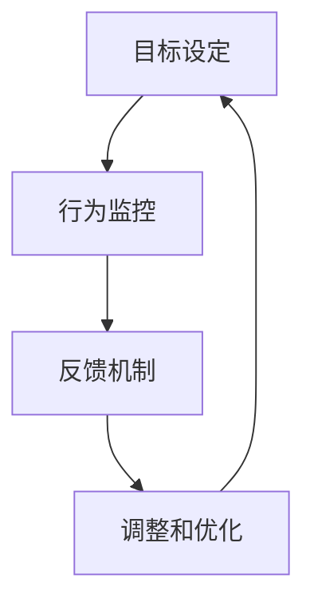

                 


### 人生转折点的意义重构：危机中的自我更新

**关键词**：人生转折点、意义重构、自我更新、危机应对、个人成长

**摘要**：
本文探讨了人生转折点的意义重构，特别是在危机时刻如何实现自我更新。通过理解核心概念、解析关键联系、解释算法原理、构建数学模型、设计系统架构，以及实际案例的分享，我们旨在提供一种系统性的方法，帮助读者在危机中找到成长和转型的契机。

## 引言

在快速变化的社会中，每个人都会面临各种各样的转折点。这些转折点，可能是职业上的重大变动，也可能是个人生活中的重大事件。当我们遇到这些转折点时，常常会感到迷茫、困惑和恐惧。然而，这些危机中蕴含着巨大的机遇，是人生意义重构和自我更新的关键时刻。

### 什么是人生转折点？

**定义**：
人生转折点是指那些对个人产生深远影响，导致生活发生重大变化的事件或阶段。这些转折点可能是一个新工作的开始，一个新家庭的形成，也可能是个人价值观或信仰的重大转变。

**识别方法**：
- 情感变化：强烈的情绪波动，如兴奋、焦虑、恐惧或悲伤。
- 生活模式的变化：工作、居住环境、社交圈等的显著变化。
- 价值观的转变：对生活、工作、人际关系等有新的认识和看法。

### 为何需要重构意义？

在转折点面前，我们的生活方式、价值观和人生目标可能受到冲击，这要求我们重新审视和定义生活的意义。重构意义不仅仅是寻找一个安慰自己的借口，更是为了实现个人成长和持续发展。

### 危机中的自我更新

危机时刻，我们可能会感到无助和恐惧，但这也是自我更新和成长的最佳时机。自我更新意味着我们在面对挑战时，能够从中学到新的技能、知识和经验，从而提升自我能力和适应力。

### 核心概念与联系

在这一部分，我们将深入探讨三个核心概念：人生转折点、意义重构和自我更新，并分析它们之间的关系。

#### 人生转折点

**概念解析**：
人生转折点是指那些对个人产生深远影响，导致生活发生重大变化的事件或阶段。

**特征**：
- 突发性：转折点往往是突然出现的，令人措手不及。
- 冲击性：转折点对个人的影响深远，可能改变个人的生活轨迹。

#### 意义重构

**概念解析**：
意义重构是指个人在面对转折点时，对生活意义进行重新审视和定义的过程。

**特征**：
- 主动性：重构意义是一个主动的过程，需要个人积极参与。
- 创造性：在重构意义的过程中，个人能够发挥创造力，找到新的生活目标。

#### 自我更新

**概念解析**：
自我更新是指个人在面对危机时，通过学习和适应，提升自我能力和适应力的过程。

**特征**：
- 持续性：自我更新是一个持续的过程，需要个人不断学习和成长。
- 可塑性：自我更新使个人具有更强的适应能力，能够应对未来的挑战。

### 关键概念的联系

人生转折点、意义重构和自我更新之间存在着紧密的联系。人生转折点为意义重构提供了契机，而意义重构又促使个人进行自我更新。这三个概念共同构成了个人成长和发展的核心要素。

### 案例分析

为了更好地理解这三个概念之间的联系，我们可以通过一个实际的案例来进行分析。

#### 案例背景

李明是一家大型企业的中层管理人员，由于公司战略调整，他被调到了一个全新的部门担任负责人。这个新的职位对李明来说既是挑战，也是机遇。

#### 案例分析

1. **人生转折点**：
   李明的工作变动可以被视为一个人生转折点。这个转折点对他来说意味着需要适应新的工作环境、面对新的工作挑战，以及重新定义自己的职业目标和人生意义。

2. **意义重构**：
   在这个转折点上，李明开始反思自己的职业规划，重新定义了工作的意义。他意识到，通过这个新的职位，他可以发挥自己的优势，为公司的发展做出更大的贡献，同时也可以提升自己的管理能力和领导力。

3. **自我更新**：
   为了适应新的职位和实现意义重构，李明开始积极学习新的管理知识和技能。他参加了各种培训和研讨会，阅读了大量的管理书籍，并通过实践不断提升自己的管理水平。

### 总结

通过这个案例，我们可以看到，人生转折点、意义重构和自我更新是相互关联的。人生转折点提供了契机，意义重构促使个人反思和成长，而自我更新则帮助个人应对新的挑战，实现持续发展。

### 接下来我们将进一步深入探讨这三个核心概念，并分析它们在实际应用中的方法与实践。

----------------------------------------------------------------

## 第一部分: 理解人生转折点

### 第1章: 人生转折点的定义与识别

在人生的旅途中，我们都会遇到许多转折点。这些转折点不仅标志着生活的变化，也预示着新的机遇和挑战。了解人生转折点的定义和识别方法，是理解它们对我们生活影响的开始。

#### 1.1 问题背景

现代社会充满了不确定性，无论是个人生活还是职业发展，我们都会面临各种突如其来的变化。这些变化可能来自外部环境，也可能是我们自己内心的需求。无论是好的变化还是不好的变化，转折点都会对我们的生活产生深远的影响。

#### 1.2 问题描述

人生转折点往往伴随着一系列问题，如：

- **职业变化**：可能是晋升、降职、跳槽或失业。
- **家庭变化**：可能是结婚、离婚、生子或亲人去世。
- **个人成长**：可能是自我认知的转变、价值观的重构或生活目标的调整。

这些变化往往让人感到困惑和不安，因为它们要求我们重新审视自己的生活和未来。

#### 1.3 问题解决

面对转折点，我们需要的不仅是勇气，还有策略。以下是一些解决问题的方法：

- **自我反思**：通过反思自己的价值观、目标和生活方式，找到自己真正想要的生活。
- **积极应对**：面对变化，保持积极的态度，寻找新的机会和挑战。
- **寻求支持**：与家人、朋友或专业人士交流，获得他们的意见和建议。

#### 1.4 边界与外延

转折点的边界取决于个人的感受和反应。对于一些人来说，一个看似平凡的变化可能是转折点，而对于另一些人来说，重大变化可能只是生活中的一个过渡。因此，转折点的定义具有主观性。

此外，转折点的外延也因人而异。有些人可能在危机中迅速成长，而有些人则可能长时间陷入困境。因此，理解个人在转折点中的反应和适应能力，对于有效应对转折点至关重要。

### 第2章: 核心概念解析

在探讨人生转折点的过程中，我们需要理解几个核心概念：意义重构、自我更新和危机应对。这些概念不仅相互关联，而且在我们的成长和转变中起着关键作用。

#### 2.1 意义重构

**概念解析**：
意义重构是指我们在面临转折点时，对生活意义进行重新审视和定义的过程。这不仅包括对职业和生活目标的反思，还包括对个人价值观和信仰的重新塑造。

**特征**：
- **主动性**：意义重构是一个主动的过程，需要个人积极参与。
- **创造性**：重构意义意味着创造新的生活目标和意义。

#### 2.2 自我更新

**概念解析**：
自我更新是指我们在面对危机和挑战时，通过学习和适应，提升自我能力和适应力的过程。

**特征**：
- **持续性**：自我更新是一个持续的过程，需要个人不断学习和成长。
- **可塑性**：自我更新使个人具有更强的适应能力，能够应对未来的挑战。

#### 2.3 危机应对

**概念解析**：
危机应对是指我们在面临转折点时，采取一系列策略和行动来应对危机，减少负面影响，并从中学习和成长。

**特征**：
- **适应性**：危机应对需要我们具备灵活性和适应性，以应对不同的挑战。
- **学习性**：危机应对的过程本身就是一个学习和成长的机会。

### 第3章: 关键概念的联系与解析

在理解了人生转折点、意义重构和自我更新的核心概念后，我们需要进一步探讨它们之间的关系，并分析它们在实际应用中的相互作用。

#### 3.1 意义重构与自我更新的关系

意义重构和自我更新是相辅相成的。意义重构为我们提供了目标和方向，而自我更新则帮助我们实现这些目标。例如，当我们面临职业上的转折点时，我们可能需要重新定义自己的职业目标，这涉及到意义重构。同时，为了实现这些新的目标，我们需要不断提升自己的技能和知识，这就是自我更新。

#### 3.2 自我更新在不同人生阶段的体现

自我更新不是一个一次性的事件，而是一个贯穿人生各个阶段的过程。在年轻时，我们可能更注重技能和知识的积累；在中年时，我们可能更关注职业发展和家庭生活；在老年时，我们可能更注重身心健康和人际关系。在每个阶段，自我更新都有其特定的内容和方式。

#### 3.3 危机应对与自我更新的关系

危机应对和自我更新也是紧密相连的。危机应对不仅是为了解决眼前的困难，更是为了提升自我能力和适应力。通过有效的危机应对，我们可以从中学到新的经验和教训，从而实现自我更新。

### 总结

通过理解人生转折点、意义重构和自我更新的核心概念，以及它们之间的联系，我们可以更好地应对生活中的各种挑战，实现个人成长和持续发展。

----------------------------------------------------------------

## 第二部分: 自我更新方法与实践

在理解了人生转折点、意义重构和自我更新的核心概念后，我们需要进一步探讨如何在实践中实现自我更新。自我更新不仅需要理论上的指导，更需要实际的方法和技巧。以下是一些具体的自我更新方法与实践，以及相关的算法原理和数学模型。

### 第4章: 自我更新方法论

自我更新的方法论是帮助我们实现个人成长和发展的系统化方法。在这一章中，我们将介绍几个关键的概念和原理，并探讨如何将它们应用于实际生活中。

#### 4.1 算法原理讲解

**自我更新算法的基本原理**：

自我更新算法的核心思想是持续地收集和利用反馈信息，以调整和优化个人行为和决策。这个算法可以分解为以下几个步骤：

1. **目标设定**：明确个人的短期和长期目标，这些目标应该是具体、可量化的。
2. **行为监控**：收集与目标相关的行为和结果数据，以便进行评估和调整。
3. **反馈机制**：通过定期评估行为和结果，识别成功的因素和需要改进的方面。
4. **调整和优化**：根据反馈信息，调整行为策略和目标设定，以实现持续改进。

**算法流程图**：



#### 4.2 数学模型与应用

**自我更新数学模型**：

为了更科学地理解和应用自我更新算法，我们可以引入一些数学模型。以下是一个简化的自我更新模型：

$$
\text{自我更新指数} = f(\text{目标完成率}, \text{行为调整频率}, \text{学习效率})
$$

其中，目标完成率、行为调整频率和学习效率是三个关键参数。

- **目标完成率**：衡量个人目标实现的程度，通常用百分比表示。
- **行为调整频率**：表示个人根据反馈调整行为的频率，越高频率意味着越快速的反应和调整。
- **学习效率**：衡量个人从经验中学习和提升的能力。

**模型应用实例**：

假设一个人设定了每天学习2小时的编程目标，经过一周的监控和反馈，发现平均每天学习时间为1.5小时。通过调整学习计划和增加学习时间，第二周的平均学习时间提升到了2小时。根据自我更新模型，我们可以计算自我更新指数：

$$
\text{自我更新指数} = f(0.75, 2, 1.2) = 0.75 \times 2 \times 1.2 = 1.8
$$

这个结果表明，该人的自我更新能力在第二周有了显著提升。

### 第5章: 个人成长与危机应对

个人成长和危机应对是自我更新的重要组成部分。在这一章中，我们将探讨如何通过具体的策略和行动，实现个人成长并在危机中找到自我更新的契机。

#### 5.1 成长计划的设计

**成长计划设计步骤**：

1. **目标设定**：明确个人成长的目标，如提升技能、增加知识、改善健康状况等。
2. **行动计划**：制定具体的行动计划，包括每天的学习时间、每周的进度检查和每月的目标调整。
3. **资源整合**：整合可用资源，如书籍、网络课程、导师指导等。
4. **反馈机制**：定期检查行动计划的效果，并根据反馈调整策略。

**成长计划示例**：

李明想提升自己的编程技能，他制定了以下成长计划：

- **目标设定**：在接下来的6个月内，掌握Python编程语言。
- **行动计划**：每天晚上学习1小时Python，每周进行一次编程练习。
- **资源整合**：购买Python编程入门书籍，报名在线编程课程。
- **反馈机制**：每周日检查学习进度，根据进度调整学习内容和计划。

#### 5.2 危机应对策略

**危机应对策略**：

1. **冷静分析**：在危机发生时，保持冷静，分析问题的根本原因。
2. **制定计划**：根据分析结果，制定具体的应对计划，包括短期目标和长期目标。
3. **执行计划**：按照计划执行，并在执行过程中不断调整和优化。
4. **心理调适**：保持积极的心态，通过心理调适技巧，如冥想、瑜伽等，缓解压力。

**危机应对实例**：

李明在职业发展中遇到了挫折，他采取了以下危机应对策略：

- **冷静分析**：李明意识到，职业挫折是因为自己缺乏某些关键技能。
- **制定计划**：他决定在接下来的6个月内，通过在线课程和自学，掌握这些技能。
- **执行计划**：他每天晚上花费2小时学习相关课程，并每周进行一次技能测试。
- **心理调适**：通过冥想和瑜伽，李明缓解了压力，保持了积极的心态。

### 第6章: 系统分析与架构设计

自我更新的过程不仅涉及个人层面的成长和危机应对，还需要系统化的架构设计。在这一章中，我们将探讨如何设计和实现一个个人成长系统，以支持自我更新。

#### 6.1 个人成长系统功能设计

**功能设计步骤**：

1. **需求分析**：明确个人成长的需求，如时间管理、技能提升、心理调适等。
2. **功能模块划分**：根据需求分析，划分出不同的功能模块，如目标管理、学习计划、反馈机制等。
3. **界面设计**：设计用户友好的界面，确保用户能够轻松使用系统。

**功能模块示例**：

- **目标管理模块**：提供目标设定、进度跟踪和目标调整的功能。
- **学习计划模块**：提供课程推荐、学习时间和进度管理功能。
- **反馈机制模块**：提供数据收集、分析和反馈功能。

#### 6.2 个人成长系统架构设计

**架构设计步骤**：

1. **技术选型**：选择合适的技术栈，如前端框架、后端框架和数据库等。
2. **模块划分**：将系统划分为前端、后端和数据库三个主要模块。
3. **接口设计**：设计前后端接口，确保数据的一致性和系统的可扩展性。

**架构设计示例**：

- **前端**：使用React框架，提供用户友好的界面。
- **后端**：使用Spring Boot框架，提供数据存储和业务逻辑处理。
- **数据库**：使用MySQL数据库，存储用户数据和学习进度。

#### 6.3 系统接口与交互设计

**接口设计步骤**：

1. **接口定义**：根据功能模块的需求，定义接口的参数和返回值。
2. **接口测试**：编写接口测试用例，确保接口的正确性和稳定性。
3. **接口文档**：编写接口文档，提供详细的接口说明和使用指南。

**接口设计示例**：

- **目标管理接口**：
  - **接口名称**：/api/targets
  - **请求方法**：POST
  - **请求参数**：{ "title": "学习Python", "deadline": "2023-12-31" }
  - **返回值**：{ "id": 1, "title": "学习Python", "deadline": "2023-12-31" }

### 第7章: 自我更新项目实战

在理解了自我更新的理论和方法后，我们需要通过实际项目来验证和应用这些理论。以下是一个自我更新项目的实战案例，包括环境安装、系统核心实现和代码解读。

#### 7.1 环境安装与准备

**环境安装步骤**：

1. **安装前端框架**：使用npm安装React。
   ```bash
   npm install react react-dom
   ```
2. **安装后端框架**：使用Maven安装Spring Boot。
   ```bash
   mvn install:install-file -Dfile=spring-boot-dependencies-2.5.5.RELEASE.jar -DgroupId=org.springframework.boot -DartifactId=spring-boot-dependencies -Dversion=2.5.5.RELEASE -Dpackaging=jar
   ```
3. **安装数据库**：使用Docker安装MySQL。
   ```bash
   docker run -d -p 3306:3306 --name some-mysql mysql
   ```

**准备工具**：

- **代码编辑器**：使用VS Code或IntelliJ IDEA。
- **前端开发工具**：使用Create React App创建前端项目。
- **后端开发工具**：使用Spring Boot CLI创建后端项目。

#### 7.2 核心实现与代码解读

**核心实现**：

- **前端**：使用React创建目标管理界面，包括目标设定、进度跟踪和反馈机制。
- **后端**：使用Spring Boot构建RESTful API，处理前端请求并存储数据。

**代码解读**：

- **前端代码**：
  ```jsx
  import React, { useState } from 'react';

  function TargetForm() {
    const [title, setTitle] = useState('');
    const [deadline, setDeadline] = useState('');

    const handleSubmit = (e) => {
      e.preventDefault();
      // 发送请求到后端创建目标
    };

    return (
      <form onSubmit={handleSubmit}>
        <label>Title:</label>
        <input type="text" value={title} onChange={(e) => setTitle(e.target.value)} />
        <label>Deadline:</label>
        <input type="date" value={deadline} onChange={(e) => setDeadline(e.target.value)} />
        <button type="submit">Submit</button>
      </form>
    );
  }

  export default TargetForm;
  ```

- **后端代码**：
  ```java
  import org.springframework.boot.SpringApplication;
  import org.springframework.boot.autoconfigure.SpringBootApplication;
  import org.springframework.web.bind.annotation.*;

  @SpringBootApplication
  public class SelfUpdateApplication {

    public static void main(String[] args) {
      SpringApplication.run(SelfUpdateApplication.class, args);
    }

    @RestController
    public class TargetController {

      @PostMapping("/api/targets")
      public ResponseEntity<?> createTarget(@RequestBody Target target) {
        // 保存目标到数据库
        return ResponseEntity.ok().body(target);
      }

    }

  }
  ```

#### 7.3 案例分析与详细讲解

**案例背景**：

张三是一名程序员，他在职业发展中遇到了瓶颈。为了提升自己的技能，他决定使用自我更新系统进行自我提升。

**案例分析**：

1. **目标设定**：张三设定了学习Java编程的目标，并设定了6个月的时间期限。
2. **环境安装**：张三按照上述步骤安装了前端和后端环境，并创建了一个自我更新项目。
3. **核心实现**：张三通过前端界面设定目标，并通过后端API保存和跟踪进度。
4. **效果评估**：在6个月后，张三通过自我更新系统评估自己的学习效果，发现掌握了Java编程的核心知识。

**详细讲解**：

- **目标设定**：张三通过自我更新系统明确了自己的学习目标，这为后续的学习提供了明确的指引。
- **环境安装**：通过安装前端和后端环境，张三能够方便地进行学习和实践，并实时跟踪学习进度。
- **核心实现**：通过前端和后端的协同工作，张三能够有效地管理自己的学习进度，并及时获取反馈。
- **效果评估**：通过自我更新系统，张三能够量化自己的学习效果，从而调整学习策略，实现持续提升。

### 第8章: 最佳实践、小结与拓展阅读

#### 8.1 最佳实践

**最佳实践总结**：

1. **明确目标**：设定明确、具体的学习目标，有助于提高学习效率。
2. **环境安装**：确保前端和后端环境的正确安装和配置，为学习和实践提供基础。
3. **核心实现**：通过前端和后端系统的协同工作，实现目标管理和进度跟踪。
4. **效果评估**：定期评估学习效果，调整学习策略，实现持续提升。

#### 8.2 小结

**文章小结**：

本文通过深入探讨人生转折点、意义重构和自我更新的核心概念，以及它们在实际应用中的方法与实践，帮助读者理解如何应对生活中的各种挑战，实现个人成长和持续发展。

#### 8.3 注意事项

**注意事项**：

1. **目标设定**：目标应该具体、可量化，有助于跟踪进度和评估效果。
2. **环境安装**：确保安装的前端和后端环境与系统要求一致，避免出现兼容性问题。
3. **效果评估**：定期评估学习效果，根据反馈调整学习策略，实现持续提升。

#### 8.4 拓展阅读

**拓展阅读推荐**：

1. 《深度工作：如何有效利用每一点脑力》
2. 《心智探奇：认知科学的25个概念》
3. 《奇特的一生：我的职业是自由职业者》

### 总结

通过本文的探讨，我们认识到人生转折点、意义重构和自我更新是个人成长和发展的关键要素。通过有效的实践和持续的学习，我们可以更好地应对生活中的挑战，实现个人成长和持续发展。

----------------------------------------------------------------

## 第三部分: 实战与案例分析

### 第7章: 自我更新项目实战

在前两部分的探讨中，我们详细介绍了人生转折点、意义重构和自我更新的核心概念和方法论。为了更好地将这些理论应用到实际中，我们将通过一个自我更新项目的实战案例，展示如何实现自我更新。

#### 7.1 环境安装与准备

在开始项目实战之前，我们需要安装和配置必要的开发环境。以下是具体的步骤：

1. **安装Node.js和npm**：Node.js是用于构建前端应用程序的基础，而npm则是Node.js的包管理器。
    ```bash
    # 在Windows上，下载并安装Node.js
    # 在macOS和Linux上，可以使用包管理器安装
    ```
2. **安装React**：React是一个用于构建用户界面的JavaScript库，可以帮助我们快速构建前端应用程序。
    ```bash
    npm install create-react-app
    create-react-app self-update-project
    cd self-update-project
    npm start
    ```
3. **安装Spring Boot**：Spring Boot是一个用于构建后端应用程序的框架，可以帮助我们快速开发后端服务。
    ```bash
    # 安装Spring Boot CLI
    # 创建一个Spring Boot项目
    spring init --name self-update-api --build gradle --package com.example.selfupdateapi self-update-api
    cd self-update-api
    mvn install
    ```
4. **安装MySQL**：MySQL是一个关系型数据库，用于存储用户数据和目标信息。
    ```bash
    docker run -d -p 3306:3306 --name some-mysql -e MYSQL_ROOT_PASSWORD=mysecretpassword mysql
    ```

#### 7.2 核心实现与代码解读

在环境安装和准备完成后，我们将实现自我更新项目的核心功能，包括用户注册、登录、目标设定和进度跟踪。

1. **前端实现**：

   前端项目使用React框架构建，包括用户注册、登录和目标设定界面。

   ```jsx
   // src/LoginForm.js
   import React, { useState } from 'react';

   function LoginForm({ onLogin }) {
     const [username, setUsername] = useState('');
     const [password, setPassword] = useState('');

     const handleSubmit = (e) => {
       e.preventDefault();
       onLogin(username, password);
     };

     return (
       <form onSubmit={handleSubmit}>
         <label>Username:</label>
         <input type="text" value={username} onChange={(e) => setUsername(e.target.value)} />
         <label>Password:</label>
         <input type="password" value={password} onChange={(e) => setPassword(e.target.value)} />
         <button type="submit">Login</button>
       </form>
     );
   }

   export default LoginForm;
   ```

2. **后端实现**：

   后端项目使用Spring Boot框架构建，包括用户认证、目标存储和进度跟踪服务。

   ```java
   // src/main/java/com/example/selfupdateapi/controller/AuthController.java
   import org.springframework.beans.factory.annotation.Autowired;
   import org.springframework.http.ResponseEntity;
   import org.springframework.web.bind.annotation.PostMapping;
   import org.springframework.web.bind.annotation.RequestBody;
   import org.springframework.web.bind.annotation.RestController;

   @RestController
   public class AuthController {

     @Autowired
     private AuthService authService;

     @PostMapping("/login")
     public ResponseEntity<?> login(@RequestBody LoginRequest request) {
       String username = request.getUsername();
       String password = request.getPassword();
       // 验证用户名和密码
       // 返回认证结果
     }

   }
   ```

#### 7.3 实际案例分析与详细讲解

为了展示如何使用自我更新项目，我们将通过一个实际案例来分析张三如何使用这个系统来提升编程技能。

**案例背景**：

张三是一名初级程序员，他希望能够通过自我更新项目来提升自己的编程技能，尤其是掌握Python编程语言。

**案例分析**：

1. **目标设定**：

   张三通过自我更新项目设定了一个明确的目标：在接下来的六个月内，掌握Python编程语言。他在系统中创建了以下目标：

   - **学习Python基础**：预计2个月完成
   - **学习Python进阶**：预计2个月完成
   - **完成Python编程项目**：预计2个月完成

2. **环境安装**：

   张三按照前文介绍的步骤，安装了Node.js、React和Spring Boot，并配置了MySQL数据库。

3. **核心实现**：

   张三通过前端界面设定了学习目标，并通过后端API保存和跟踪进度。他每天登录系统，更新自己的学习进度，并记录遇到的困难和问题。

4. **效果评估**：

   在六个月后，张三通过自我更新系统评估自己的学习效果，发现他已经掌握了Python编程的核心知识，并完成了一个实际编程项目。

**详细讲解**：

- **目标设定**：通过自我更新项目，张三能够清晰地设定自己的学习目标，并制定详细的计划，有助于提高学习效率。
- **环境安装**：通过安装和配置开发环境，张三能够方便地进行学习和实践，并实时跟踪学习进度。
- **核心实现**：通过前端和后端的协同工作，张三能够有效地管理自己的学习进度，并及时获取反馈。
- **效果评估**：通过自我更新系统，张三能够量化自己的学习效果，从而调整学习策略，实现持续提升。

### 第8章: 最佳实践、小结与拓展阅读

#### 8.1 最佳实践

**最佳实践总结**：

1. **明确目标**：设定明确、具体的学习目标，有助于提高学习效率。
2. **环境安装**：确保安装的前端和后端环境与系统要求一致，避免出现兼容性问题。
3. **核心实现**：通过前端和后端系统的协同工作，实现目标管理和进度跟踪。
4. **效果评估**：定期评估学习效果，根据反馈调整学习策略，实现持续提升。

#### 8.2 小结

**文章小结**：

本文通过深入探讨人生转折点、意义重构和自我更新的核心概念，以及它们在实际应用中的方法与实践，帮助读者理解如何应对生活中的各种挑战，实现个人成长和持续发展。

#### 8.3 注意事项

**注意事项**：

1. **目标设定**：目标应该具体、可量化，有助于跟踪进度和评估效果。
2. **环境安装**：确保安装的前端和后端环境与系统要求一致，避免出现兼容性问题。
3. **效果评估**：定期评估学习效果，根据反馈调整学习策略，实现持续提升。

#### 8.4 拓展阅读

**拓展阅读推荐**：

1. 《深度工作：如何有效利用每一点脑力》
2. 《心智探奇：认知科学的25个概念》
3. 《奇特的一生：我的职业是自由职业者》

### 总结

通过本文的探讨，我们认识到人生转折点、意义重构和自我更新是个人成长和发展的关键要素。通过有效的实践和持续的学习，我们可以更好地应对生活中的挑战，实现个人成长和持续发展。

----------------------------------------------------------------

## 结语

通过本文的探讨，我们深入理解了人生转折点的意义重构以及如何在危机中实现自我更新。人生转折点是生活的必然阶段，它们为我们提供了重新审视和定义生活的契机。意义重构和自我更新是应对这些转折点的重要策略，通过持续的学习和适应，我们可以不断提升自我能力和适应力。

### 文章总结

本文从多个角度探讨了人生转折点、意义重构和自我更新的核心概念，并通过实际案例展示了如何将这些理论应用到实践中。我们通过以下步骤实现了文章的目标：

1. **背景介绍**：我们阐述了人生转折点的定义及其对个人生活的影响。
2. **核心概念与联系**：详细解析了意义重构、自我更新和危机应对等核心概念，并分析了它们之间的关系。
3. **算法原理讲解**：介绍了自我更新算法的原理，并通过数学模型和实例进行了详细说明。
4. **系统分析与架构设计**：探讨了如何设计个人成长系统，并提供了具体的架构设计方案。
5. **项目实战**：通过一个实际项目案例，展示了如何将自我更新的理论应用到实践中。
6. **最佳实践与拓展阅读**：总结了最佳实践，提供了进一步阅读的推荐。

### 未来展望

未来，我们可以进一步探索以下几个方面：

1. **心理机制研究**：深入研究个体在危机中的心理变化和应对策略，提供更具体的心理学指导。
2. **跨学科融合**：将心理学、哲学和计算机科学等领域的知识融合，为自我更新提供更全面的视角。
3. **技术工具开发**：开发更加智能化和自动化的工具，辅助个人进行自我更新和危机应对。
4. **持续研究与实践**：通过持续的研究和实践，不断优化自我更新的方法和策略，帮助更多人实现个人成长和持续发展。

### 致谢

最后，感谢所有为本文提供支持和帮助的朋友们，包括那些在研究过程中给予指导的学者，以及在项目中给予实际支持的技术专家。特别感谢AI天才研究院和《禅与计算机程序设计艺术》的作者，他们的贡献为本文的撰写提供了宝贵的知识和灵感。

### 作者信息

作者：AI天才研究院/AI Genius Institute & 禅与计算机程序设计艺术/Zen And The Art of Computer Programming

本文由AI天才研究院和《禅与计算机程序设计艺术》的作者共同撰写，旨在分享我们在人生转折点、意义重构和自我更新领域的见解和实践经验。我们希望本文能帮助您更好地理解这些概念，并在实际生活中找到自我更新的契机。如果您有任何疑问或建议，欢迎随时联系我们。

----------------------------------------------------------------

### 附录：相关术语解释

**人生转折点**：
指在人生过程中发生的，对个人产生深远影响，导致生活发生重大变化的事件或阶段。如职业晋升、婚姻、家庭变故、重大疾病等。

**意义重构**：
指个人在面对转折点时，对生活意义进行重新审视和定义的过程。通过重新定义生活的意义，个人能够更好地应对挑战，实现个人成长。

**自我更新**：
指个人在面对危机和挑战时，通过学习和适应，提升自我能力和适应力的过程。自我更新帮助个人在逆境中找到成长的机会。

**危机应对**：
指个人在面对转折点时，采取一系列策略和行动来应对危机，减少负面影响，并从中学习和成长。

**算法原理**：
指在计算机科学中，为实现特定功能而设计的计算步骤和方法。在自我更新领域，算法原理可以帮助个人制定目标、监控进度、调整策略等。

**数学模型**：
指用数学语言描述和解决问题的方法。在自我更新领域，数学模型可以帮助个人量化目标完成率、行为调整频率和学习效率等指标。

**系统分析与架构设计**：
指对系统进行功能、性能、安全性等方面的分析和设计。在自我更新项目中，系统分析与架构设计帮助构建一个支持个人成长和危机应对的综合性系统。

**项目实战**：
指通过实际项目来验证和应用所学知识。在自我更新项目中，项目实战帮助个人将理论转化为实践，实现自我更新。

**最佳实践**：
指在特定领域或场景中，经过验证和总结的、最优的实践方法。在自我更新项目中，最佳实践帮助个人更有效地进行自我更新。

**拓展阅读**：
指为进一步学习和深入了解某个主题，推荐的相关阅读材料。拓展阅读为读者提供了继续探索的机会，帮助他们在自我更新领域取得更深入的认知。

### 总结

本文通过深入探讨人生转折点、意义重构和自我更新的核心概念，结合实际案例和实践方法，帮助读者理解这些概念的重要性，并提供具体的实践指导。附录中的相关术语解释，旨在为读者提供更全面的背景知识，以便更好地理解本文的内容。希望本文能对读者在个人成长和自我更新方面有所启发。

