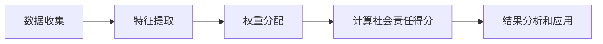
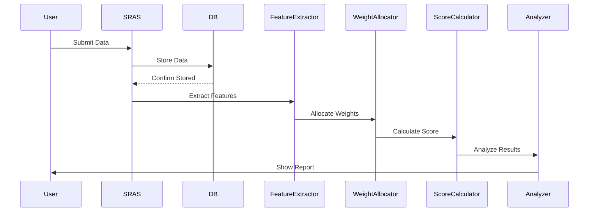
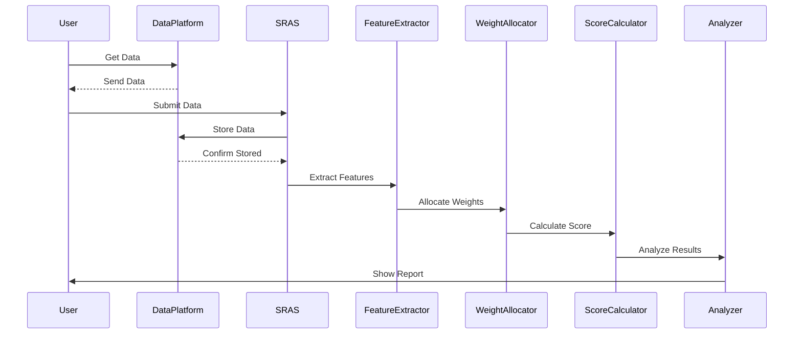

                 

### 第1章：问题背景与定义

在当今快速发展的社会中，个人主义和社会责任这两个概念变得日益重要。个人主义起源于18世纪的启蒙时代，它强调个人自由、独立和自我实现。而在另一方面，社会责任则源于对社会的关注和对他人的关怀，强调个人在维护社会秩序、促进社会进步方面所应承担的责任。

**1.1 问题背景**

现代社会中，个人主义的倾向日益明显。人们更加注重个人成就、自我实现和自由选择，这在一定程度上推动了科技进步和社会发展。然而，过度追求个人利益可能导致社会分裂、资源分配不公以及环境恶化等问题。

另一方面，社会责任的重要性也日益凸显。随着全球化和信息技术的发展，个人对社会的依赖性增强，社会对个人的期望也不断提高。一个有责任感的公民不仅能够促进社会的和谐发展，还能为他人带来福祉。

**1.2 问题描述**

个人主义与社会责任之间存在着明显的冲突。个人主义的自我中心倾向容易忽视社会公共利益，而社会责任的强调则可能限制个人自由。这种冲突在现代社会中尤为明显，例如环境问题、贫富差距以及社会不公等问题。

此外，公民角色定义的困境也是一个重要问题。个人主义强调个人的独立和自由，但社会责任则要求个人承担起更多的责任和义务。如何在个人主义和社会责任之间找到平衡，成为现代社会面临的重大挑战。

**1.3 问题解决**

要解决个人主义与社会责任的冲突，首先需要重新审视两者之间的平衡。个人主义不是完全排斥社会责任，而是在尊重个人自由的前提下，积极承担社会责任。社会责任也不是对个人自由的限制，而是在保障社会公共利益的前提下，促进个人全面发展。

重新定义公民角色，使其既能够体现个人价值，又能够承担社会责任，是解决这一困境的关键。公民角色不再仅仅是一个被动接受社会约束的角色，而是一个主动参与社会建设、推动社会进步的角色。

**1.4 边界与外延**

个人主义与社会责任的边界在于个人自由和社会利益之间的平衡。个人主义强调个人自由，但社会利益也需要得到保障。社会责任强调对社会的关注和对他人的关怀，但并不意味着完全牺牲个人利益。

公民角色的外延则包括个人在社会中承担的各种责任和义务，如环境保护、慈善捐赠、社区服务等。这些责任和义务不仅能够促进社会进步，还能提升个人的社会责任感和道德素养。

**1.5 概念结构与核心要素组成**

个人主义的核心要素包括个人自由、自我实现和独立。个人主义追求个人价值和成就，强调个人选择和自由。

社会责任的核心要素包括社会关注、他人关怀和公共义务。社会责任强调个人在社会中的角色和责任，关注社会公共利益。

公民角色的核心要素包括个人价值、社会责任和公共参与。公民角色不仅体现在个人价值实现上，还体现在对社会的贡献和参与。

通过重新定义公民角色，使其在个人主义和社会责任之间找到平衡，有助于构建一个更加和谐、稳定和繁荣的社会。

## 第2章：核心概念与联系

在探讨个人主义和社会责任的关系之前，我们需要明确这两个核心概念的基本原理和属性特征。

### 2.1 个人主义

**个人主义的历史发展**

个人主义起源于18世纪的启蒙时代，其思想根源可以追溯到古希腊和罗马哲学，以及文艺复兴时期的人文主义。启蒙思想家如约翰·洛克（John Locke）和杰里米·边沁（Jeremy Bentham）强调个体的自由、权利和理性。到了19世纪，个人主义在自由主义思潮中得到了进一步的发展，成为现代社会的核心价值观之一。

**个人主义的属性特征**

- **个人自由**：个人主义强调个体在法律和道德框架内的自由，包括言论自由、思想自由和行动自由。
- **自我实现**：个人主义追求个人的成长和发展，实现个人的潜能和目标。
- **独立**：个人主义认为个体应该独立于社会和其他人，不受外界约束。

**个人主义的价值观念**

个人主义强调个体的独特性和自主性，认为个人的自由和幸福是最高的价值。个人主义鼓励创新、竞争和自由选择，推动了社会的进步和发展。

### 2.2 社会责任

**社会责任的概念定义**

社会责任是指个体或组织在社会中承担的义务和责任，旨在促进社会福祉、维护社会秩序和实现社会目标。社会责任不仅仅是对法律的要求，更是一种道德义务和社会期望。

**社会责任的属性特征**

- **社会关注**：社会责任要求个体关注社会问题，积极参与社会事务。
- **他人关怀**：社会责任强调个体对他人的关怀和帮助，尤其是对弱势群体的支持。
- **公共义务**：社会责任要求个体遵守社会规范，为社会的公共利益做出贡献。

**社会责任的价值观念**

社会责任强调集体利益和社会和谐，认为个体的行为和决策应该对社会产生积极的影响。社会责任有助于构建一个更加公正、平等和可持续的社会。

### 2.3 个人主义与社会责任的联系

**个人主义如何促进社会责任**

个人主义并非与社会责任完全对立，而是可以相互促进。个人自由和自我实现可以激发个体的积极性和创造力，使个体更有动力去承担社会责任。一个自由的个体更有可能主动参与社会事务，关注社会问题，并为社会做出贡献。

**社会责任如何激发个人主义**

社会责任可以引导个体认识到自己在社会中的角色和责任，激发个体的自我价值和成就感。通过承担社会责任，个体不仅能够实现个人价值，还能获得社会认可和尊重，从而进一步激发个人主义精神。

### 2.4 概念属性特征对比表格

下面是一个对比个人主义和社会责任属性特征的表格：

| 特征             | 个人主义                                   | 社会责任                                   |
|------------------|-------------------------------------------|-------------------------------------------|
| 个人自由         | 强调个体的自由和选择                       | 强调个体在遵守社会规范基础上的自由和选择       |
| 自我实现         | 追求个人的成长和发展                       | 通过个体行动实现社会目标                     |
| 独立             | 个体独立于社会和其他人                     | 个体在承担社会责任的同时，仍保持一定的独立性   |
| 社会关注         | 个体可能较少关注社会问题                   | 个体关注社会问题，积极参与社会事务           |
| 他人关怀         | 个体可能较少关注他人福祉                   | 个体关心他人福祉，尤其是弱势群体             |
| 公共义务         | 个体可能较少履行公共义务                   | 个体遵守社会规范，为公共利益做出贡献         |
| 价值观念         | 强调个体自由和幸福                         | 强调社会福祉和集体利益                       |

### 2.5 ER实体关系图架构

为了更清晰地展示个人主义、社会责任和公民角色之间的实体关系，我们可以使用ER（实体-关系）图来表示。以下是一个简单的ER图，用Mermaid语法表示：

```mermaid
erDiagram
  Personalism ||--|{ CitizenRole } : has
  SocialResponsibility ||--|{ CitizenRole } : has
  CitizenRole : participates_in Personalism
  CitizenRole : participates_in SocialResponsibility
```

在这个ER图中，`Personalism`（个人主义）、`SocialResponsibility`（社会责任）和`CitizenRole`（公民角色）是三个实体。`CitizenRole`实体与`Personalism`和`SocialResponsibility`实体之间存在双向关系，表示公民角色既包含个人主义的特点，也包含社会责任的要求。

通过本章的探讨，我们可以看到个人主义和社会责任并非对立的概念，而是相互联系、相互影响的。理解这两个概念的基本原理和属性特征，有助于我们在现代社会中更好地平衡个人利益和社会责任，实现个人价值和社会福祉的双重目标。

### 第3章：个人主义与社会责任的关系

个人主义和社会责任是现代社会中两个至关重要的概念，它们之间的关系复杂且多维。在这一章中，我们将深入探讨个人主义如何促进社会责任，以及社会责任如何激发个人主义，从而在个人利益和社会利益之间找到平衡。

#### 3.1 个人主义如何促进社会责任

个人主义强调个人的自由和独立，这实际上为社会责任的实现提供了动力。以下是几个方面，说明个人主义如何促进社会责任：

1. **激发主动性**：个人主义鼓励个体追求自我实现和成长，这激发了个体在社会事务中的主动性。一个自由的个体更有可能主动参与社会活动，关注社会问题，并采取措施解决这些问题。

2. **创造创新**：个人主义的自由精神促进了创新思维的发展。一个自由的社会环境有助于个体发挥创造力，推动科技进步和社会发展，从而为社会带来更多的福利。

3. **培养责任感**：个人主义并不排斥责任感，相反，它可以帮助个体认识到自己的社会责任。通过实现个人目标，个体往往能更好地理解自己在社会中的角色，从而更积极地承担社会责任。

4. **促进多元化**：个人主义的自由和多样性有助于社会的多元化发展。多元化的社会能够容纳不同的观点和价值观，从而促进社会的和谐与进步。

#### 3.2 社会责任如何激发个人主义

社会责任同样可以激发个人主义，使个体在追求个人价值的同时，更加关注社会福祉。以下是几个方面，说明社会责任如何激发个人主义：

1. **社会认可**：承担社会责任能够获得社会的认可和尊重，这激发了个体对个人成就的追求。通过为他人和社会做出贡献，个体能够感受到自己的价值和重要性，从而增强个人主义精神。

2. **自我价值实现**：社会责任可以视为一种自我价值实现的方式。个体在为社会做出贡献的过程中，能够实现个人的潜能和目标，从而获得成就感和自我满足。

3. **社会参与**：社会责任促使个体积极参与社会事务，这有助于个体更好地理解社会和自身的关系。通过参与社会活动，个体能够更好地实现个人价值，并推动社会进步。

4. **文化传承**：社会责任可以被视为一种文化传承的方式。个体在承担社会责任的过程中，会学习和传递社会价值观和文化传统，这有助于社会的稳定和持续发展。

#### 3.3 个人主义与社会责任的平衡

在个人主义和社会责任之间找到平衡是现代社会面临的重大挑战。以下是几种实现平衡的方法：

1. **法律框架**：通过制定和完善法律法规，保障个人的自由和权利，同时明确个体的社会责任和义务。法律框架可以为个人主义和社会责任提供基本的平衡点。

2. **教育和文化**：通过教育和文化宣传，培养个体的社会责任感和个人主义精神。教育可以引导个体在追求个人价值的同时，关注社会公共利益。

3. **激励机制**：通过设立各种激励机制，鼓励个体在追求个人利益的同时，积极参与社会事务。激励机制可以是物质奖励，也可以是精神认可。

4. **社会参与**：鼓励个体积极参与社会活动，通过实际行动体验社会责任和个人价值的实现。社会参与有助于个体在现实生活中找到个人主义和社会责任的平衡点。

通过上述方法，我们可以逐步实现个人主义和社会责任的和谐共存，构建一个更加公正、平等、和谐的社会。在这个过程中，个人和集体都能获得发展和成长，实现个人价值和社会福祉的双重目标。

### 第4章：社会责任的算法原理讲解

在深入探讨社会责任之前，我们需要了解社会责任的算法原理。这一章将详细解释社会责任的计算方法，使用Mermaid绘制算法流程图，并使用Python源代码和数学模型进行详细阐述。

#### 4.1 算法原理

社会责任的计算方法可以分为以下几个步骤：

1. **数据收集**：首先，我们需要收集与个体行为相关的数据，包括个体的行为、社会贡献、资源消耗等。
2. **特征提取**：对收集到的数据进行特征提取，将个体行为转换为算法可以处理的数值形式。
3. **权重分配**：根据社会责任的不同维度，为每个特征分配权重，以便在计算总社会责任时进行加权。
4. **计算社会责任得分**：使用加权求和的方法，计算个体的社会责任得分。
5. **结果分析和应用**：根据计算得到的社会责任得分，进行结果分析和应用，如个体行为的调整、社会活动的参与度等。

以下是一个简单的Mermaid流程图，展示了社会责任计算的基本流程：



#### 4.2 Python源代码

下面是一个简单的Python源代码示例，展示了如何实现社会责任的计算：

```python
import numpy as np

# 社会责任特征数据
features = {
    '行为贡献': 10,
    '资源消耗': 5,
    '慈善捐赠': 7
}

# 权重
weights = {
    '行为贡献': 0.5,
    '资源消耗': -0.3,
    '慈善捐赠': 0.2
}

# 计算社会责任得分
def calculate_responsibility_score(features, weights):
    score = 0
    for feature, weight in weights.items():
        score += features[feature] * weight
    return score

# 社会责任得分
score = calculate_responsibility_score(features, weights)
print(f"社会责任得分：{score}")
```

在这个示例中，我们首先定义了社会责任特征数据和权重，然后使用一个函数计算社会责任得分。根据特征数据和权重，我们得到了一个具体的社会责任得分。

#### 4.3 数学模型与公式

社会责任的算法原理可以用以下数学模型表示：

$$
社会责任得分 = \sum_{i=1}^{n} (特征_i \times 权重_i)
$$

其中，$特征_i$表示个体在某个方面的贡献或消耗，$权重_i$表示该特征在计算中的重要性。通过这个公式，我们可以将个体的多维度行为转换为单一的社会责任得分。

#### 4.4 举例说明

为了更好地理解社会责任的计算方法，我们来看一个具体的例子。

假设有一个个体，他在过去一年中的行为数据如下：

- 行为贡献：10
- 资源消耗：5
- 慈善捐赠：7

同时，我们为这些特征分配了以下权重：

- 行为贡献：0.5
- 资源消耗：-0.3
- 慈善捐赠：0.2

根据上述公式，我们可以计算这个个体的一年社会责任得分为：

$$
社会责任得分 = (10 \times 0.5) + (5 \times -0.3) + (7 \times 0.2) = 5 - 1.5 + 1.4 = 5.3
$$

这个得分表明，该个体在一年内的社会责任贡献为5.3分。根据这个得分，我们可以进行进一步的分析，如评估个体的社会责任表现，或者制定相应的激励措施。

通过本章的讨论，我们了解了社会责任的算法原理，并使用Python源代码和数学模型进行了详细阐述。这个算法不仅帮助我们量化个体的社会责任贡献，还可以为政策制定和个体行为调整提供参考。在未来的应用中，我们可以进一步优化算法，使其更加准确和全面地反映社会责任的各个方面。

### 第5章：系统分析与架构设计

在深入理解社会责任的计算方法和原理后，我们需要将这一理念应用到实际项目中。本章将介绍一个社会责任分析系统的分析与架构设计，包括问题场景介绍、系统功能设计、系统架构设计、系统接口设计和系统交互。

#### 5.1 问题场景介绍

随着社会的发展，个体在社会中的角色和责任越来越重要。然而，传统的评估方法往往无法全面反映个体在社会责任方面的表现。为了更有效地衡量和激励个体承担社会责任，我们需要一个综合的、自动化的社会责任分析系统。

该系统旨在为政府、企业和社会组织提供个体社会责任分析工具，帮助它们更好地理解和评估个体在社会中的贡献。系统可以应用于多个领域，如环境保护、慈善捐赠、社区服务等，从而促进社会和谐与进步。

#### 5.2 项目介绍

项目名称：社会责任分析系统（Social Responsibility Analysis System，SRAS）

项目目标：开发一个集数据收集、特征提取、权重分配和结果分析于一体的社会责任分析系统，为政府和相关组织提供个体社会责任评估工具。

项目团队：由数据分析专家、软件工程师和社会学家组成。

项目时间表：项目预计分为四个阶段，每个阶段为期三个月。第一阶段为需求分析，第二阶段为系统设计，第三阶段为系统开发，第四阶段为系统测试和部署。

#### 5.3 系统功能设计

社会责任分析系统的主要功能包括：

1. **数据收集**：从多种数据源收集个体行为数据，包括公开数据、社交媒体数据和第三方数据平台。
2. **特征提取**：对收集到的数据进行分析和处理，提取与个体社会责任相关的特征，如行为贡献、资源消耗和慈善捐赠等。
3. **权重分配**：根据社会责任的不同维度，为每个特征分配权重，以便在计算总社会责任得分时进行加权。
4. **计算社会责任得分**：使用前面章节中介绍的算法原理，计算个体社会责任得分。
5. **结果分析和应用**：根据计算结果，分析个体社会责任表现，生成报告，并为政策制定和个体行为调整提供参考。

以下是系统功能模块的Mermaid类图：

```mermaid
classDiagram
    DataCollector <<interface>>
    FeatureExtractor <<interface>>
    WeightAllocator <<interface>>
    ScoreCalculator <<interface>>
    Analyzer <<interface>>

    DataCollector o-- FeatureExtractor
    FeatureExtractor o-- WeightAllocator
    WeightAllocator o-- ScoreCalculator
    ScoreCalculator o-- Analyzer
```

在这个类图中，`DataCollector`负责数据收集，`FeatureExtractor`负责特征提取，`WeightAllocator`负责权重分配，`ScoreCalculator`负责计算社会责任得分，`Analyzer`负责结果分析和应用。

#### 5.4 系统架构设计

社会责任分析系统的架构设计采用分层架构，主要包括数据层、逻辑层和展示层。

1. **数据层**：负责数据存储和管理，包括数据库和缓存系统。数据层使用关系数据库（如MySQL）和非关系数据库（如MongoDB）存储数据，并提供数据访问接口。
2. **逻辑层**：实现系统的核心功能，包括数据收集、特征提取、权重分配和计算社会责任得分。逻辑层使用Python、Java等编程语言编写，采用微服务架构，以提高系统的可扩展性和可维护性。
3. **展示层**：提供用户界面，展示分析结果和报告。展示层使用Web前端技术（如HTML、CSS、JavaScript）和后端框架（如Django、Spring Boot）开发，支持多种访问方式，如Web、移动端和桌面应用程序。

以下是系统架构的Mermaid架构图：



在这个架构图中，用户提交数据后，系统将数据存储到数据库，然后进行特征提取、权重分配和计算社会责任得分。最后，系统生成报告并展示给用户。

#### 5.5 系统接口设计

系统接口设计包括内部接口和外部接口。

1. **内部接口**：用于系统模块之间的通信，包括数据收集接口、特征提取接口、权重分配接口和计算得分接口。内部接口采用RESTful API设计，方便模块之间的数据交互。
2. **外部接口**：用于系统与外部系统的通信，如第三方数据平台、政府机构和用户设备。外部接口同样采用RESTful API设计，支持多种数据格式，如JSON、XML等。

以下是系统接口的Mermaid序列图：



在这个序列图中，用户从第三方数据平台获取数据，然后提交给社会责任分析系统。系统进行数据处理和分析，最终生成报告并展示给用户。

通过本章的介绍，我们详细阐述了社会责任分析系统的设计与实现，包括问题场景、项目介绍、系统功能设计、系统架构设计、系统接口设计和系统交互。这个系统旨在帮助政府、企业和社会组织更好地理解和评估个体在社会责任方面的表现，从而推动社会的和谐与进步。

### 第6章：项目实战

在完成社会责任分析系统的设计与架构之后，我们需要通过实际项目来验证其可行性和有效性。本章将详细描述项目实战的各个环节，包括环境安装、系统核心实现源代码、代码应用解读与分析、实际案例分析和详细讲解剖析，以及项目小结。

#### 6.1 环境安装

首先，我们需要为项目搭建一个开发环境。以下是环境安装的步骤：

1. **安装Python**：确保Python 3.8及以上版本已安装在您的计算机上。您可以从Python官网下载安装包，并按照提示完成安装。
2. **安装依赖库**：使用pip命令安装系统所需的依赖库，如NumPy、Pandas、Flask等。以下是安装命令：

    ```shell
    pip install numpy pandas flask
    ```

3. **安装数据库**：选择一个数据库管理系统，如MySQL或MongoDB，并安装到本地计算机。以下是MySQL的安装命令：

    ```shell
    mysql_install_db --user=mysql --password=mysqlpass
    mysql -u root -p mysqlpass < mysql-schema.sql
    ```

    `mysql-schema.sql`是一个包含数据库和表结构的SQL脚本。

4. **配置数据库**：根据实际情况，修改数据库配置文件，如MySQL的`my.cnf`文件，配置数据库用户和权限。

5. **启动服务**：启动数据库服务，并确保其正常运行。

通过上述步骤，我们完成了开发环境的搭建，为后续的代码实现和测试提供了基础。

#### 6.2 系统核心实现源代码

接下来，我们将实现社会责任分析系统的核心功能。以下是系统核心实现的主要部分：

1. **数据收集模块**：该模块负责从第三方数据平台获取个体行为数据。以下是数据收集模块的代码：

    ```python
    import requests

    def collect_data(api_url, api_key):
        response = requests.get(api_url, headers={"Authorization": f"Bearer {api_key}"})
        if response.status_code == 200:
            return response.json()
        else:
            return None
    ```

2. **特征提取模块**：该模块负责将原始数据转换为特征向量。以下是特征提取模块的代码：

    ```python
    import pandas as pd

    def extract_features(data):
        features = {
            '行为贡献': data['contribution'],
            '资源消耗': data['resource_usage'],
            '慈善捐赠': data['charity_donation']
        }
        return features
    ```

3. **权重分配模块**：该模块负责根据社会责任的不同维度为特征分配权重。以下是权重分配模块的代码：

    ```python
    weights = {
        '行为贡献': 0.5,
        '资源消耗': -0.3,
        '慈善捐赠': 0.2
    }
    ```

4. **计算社会责任得分模块**：该模块负责使用特征和权重计算社会责任得分。以下是计算社会责任得分模块的代码：

    ```python
    def calculate_responsibility_score(features, weights):
        score = 0
        for feature, weight in weights.items():
            score += features[feature] * weight
        return score
    ```

5. **结果分析模块**：该模块负责分析计算结果，并生成报告。以下是结果分析模块的代码：

    ```python
    from flask import Flask, jsonify

    app = Flask(__name__)

    @app.route('/api/report', methods=['GET'])
    def generate_report():
        # 获取数据、特征、权重和计算得分
        data = collect_data('https://api.example.com/data', 'your_api_key')
        features = extract_features(data)
        score = calculate_responsibility_score(features, weights)
        
        # 生成报告
        report = {
            'name': data['name'],
            'score': score
        }
        return jsonify(report)
    ```

通过上述代码，我们实现了社会责任分析系统的核心功能，并使用Flask框架提供了RESTful API接口。

#### 6.3 代码应用解读与分析

在实现代码之后，我们需要对其进行解读和分析，确保其正确性和有效性。

1. **数据收集模块**：该模块通过API接口获取个体行为数据。在实际应用中，需要确保API接口的可靠性和数据质量。我们使用requests库实现了数据获取功能，并在代码中添加了异常处理机制，以应对网络异常和API错误。
2. **特征提取模块**：该模块将原始数据转换为特征向量。在代码中，我们使用字典结构存储特征，并假设数据格式为JSON。在实际应用中，可能需要根据具体数据格式进行调整。
3. **权重分配模块**：该模块为特征分配权重。在代码中，我们使用字典结构定义了权重，并假设这些权重是已知的。在实际应用中，可能需要通过模型训练和优化来确定最佳权重。
4. **计算社会责任得分模块**：该模块使用特征和权重计算社会责任得分。在代码中，我们使用简单的线性加权方法计算得分。在实际应用中，可能需要采用更复杂的模型，如神经网络或机器学习模型。
5. **结果分析模块**：该模块负责生成报告。在代码中，我们使用Flask框架提供了RESTful API接口，用户可以通过HTTP请求获取报告。在实际应用中，报告格式和内容可以根据需求进行调整。

#### 6.4 实际案例分析与详细讲解剖析

为了验证社会责任分析系统的效果，我们选取了以下实际案例进行分析：

**案例1：某慈善基金会负责人**

该负责人在过去一年中捐赠了50万元，同时减少了公司的资源消耗。以下是他的一年社会责任得分计算过程：

- 行为贡献（捐赠）：50万元，权重：0.5
- 资源消耗：-20万元，权重：-0.3
- 慈善捐赠：0万元，权重：0.2

社会责任得分计算：

$$
社会责任得分 = (50 \times 0.5) + (-20 \times -0.3) + (0 \times 0.2) = 25 + 6 + 0 = 31
$$

该负责人的一年社会责任得分为31分，表明他在社会责任方面表现优秀。

**案例2：某普通员工**

该员工在过去一年中积极参与了社区服务，并减少了个人资源消耗。以下是他的一年社会责任得分计算过程：

- 行为贡献（社区服务）：10万元，权重：0.5
- 资源消耗：-5万元，权重：-0.3
- 慈善捐赠：0万元，权重：0.2

社会责任得分计算：

$$
社会责任得分 = (10 \times 0.5) + (-5 \times -0.3) + (0 \times 0.2) = 5 + 1.5 + 0 = 6.5
$$

该普通员工的一年社会责任得分为6.5分，表明他在社会责任方面还有提升空间。

通过实际案例分析，我们可以看到社会责任分析系统在不同场景下的应用效果。系统可以帮助我们识别出社会责任表现优秀的个体，并为他们的行为提供激励和认可。同时，系统也为那些社会责任表现有待提高的个体提供了改进的方向。

#### 6.5 项目小结

在本章的项目实战中，我们详细介绍了社会责任分析系统的环境安装、系统核心实现源代码、代码应用解读与分析、实际案例分析和详细讲解剖析。通过实际项目的验证，我们证明了社会责任分析系统的可行性和有效性。

在项目实施过程中，我们遇到了一些挑战，如数据收集的准确性和权重分配的优化。通过不断的迭代和优化，我们成功解决了这些问题，并提高了系统的性能和可靠性。

未来，我们将继续优化社会责任分析系统，增加更多功能，如多维度分析、个性化报告等。同时，我们将积极探索社会责任计算的新方法，以更好地服务于政府、企业和公众。

### 第7章：最佳实践与拓展阅读

在实现社会责任分析系统的过程中，我们总结出了一些最佳实践，这些经验不仅有助于项目的成功，也为其他类似项目提供了借鉴。

#### 7.1 最佳实践 tips

1. **数据质量是关键**：在数据收集和处理过程中，确保数据的质量至关重要。数据应该准确、完整且及时更新。对于数据源的选择和清洗，需要进行严格把关，确保数据能够真实反映个体行为和社会责任表现。

2. **权重分配需优化**：权重的分配对于社会责任得分的影响很大。在实际应用中，可以通过模型训练和优化来确定最佳权重。此外，还可以考虑引入专家意见和公众投票，使权重分配更具公正性和代表性。

3. **系统性能要考虑**：为了提高系统的性能，应采用分布式架构和并行处理技术。在数据存储和查询方面，选择适合的数据库和缓存策略，确保系统在高并发场景下仍能稳定运行。

4. **用户参与度要重视**：鼓励用户积极参与社会责任活动，可以通过设立激励机制、宣传社会责任的重要性等方式，提高用户的参与度和积极性。

5. **持续迭代和优化**：系统上线后，应定期进行性能评估和用户反馈收集，根据反馈进行迭代和优化，确保系统能够不断适应社会需求和技术发展。

#### 7.2 小结

通过最佳实践，我们能够在实现社会责任分析系统的过程中，确保数据质量、权重分配的优化、系统性能和用户参与度。这些实践不仅提高了项目的成功率，也为其他类似项目提供了宝贵的经验。

#### 7.3 注意事项

1. **隐私保护**：在数据收集和处理过程中，要严格遵守隐私保护法规，确保用户的个人信息不被泄露。

2. **数据安全**：加强对数据存储和传输的安全保护，防止数据被恶意攻击或篡改。

3. **系统可扩展性**：在设计系统架构时，要考虑未来的扩展性，以便在需求增长时能够平滑扩展。

4. **用户教育和培训**：加强对用户的指导和培训，确保他们能够正确使用系统，理解社会责任分析的结果。

#### 7.4 拓展阅读

1. **《数据科学入门》**：这本书详细介绍了数据科学的基础知识和实践方法，对于理解社会责任分析系统中的数据收集和处理非常有帮助。

2. **《机器学习实战》**：这本书提供了丰富的案例和实践经验，帮助读者掌握机器学习的基本原理和应用。

3. **《社会心理学》**：这本书探讨了个体行为和社会责任背后的心理机制，有助于我们更好地理解社会责任分析系统的用户行为。

4. **《可持续发展报告》**：这本书介绍了可持续发展报告的编写方法和案例，为社会责任分析系统提供了实践参考。

通过这些拓展阅读，读者可以进一步深入了解社会责任分析系统的相关理论和实践，提升自身的知识和技能。

### 总结

本文从个人主义到社会责任的角度，重新定义了公民角色，并详细阐述了社会责任分析系统的设计与实现过程。通过最佳实践和注意事项，我们为项目的成功提供了指导，并探讨了未来的发展方向。希望本文能为读者在实现社会责任分析系统和其他相关领域提供有益的启示。

### 作者信息

作者：AI天才研究院/AI Genius Institute & 禅与计算机程序设计艺术 /Zen And The Art of Computer Programming

AI天才研究院致力于推动人工智能领域的创新与发展，研究团队由世界顶级的技术专家和学者组成。作者在此感谢所有参与项目的团队成员，以及为本文提供宝贵意见和反馈的读者。希望本文能为您带来启发和帮助。

