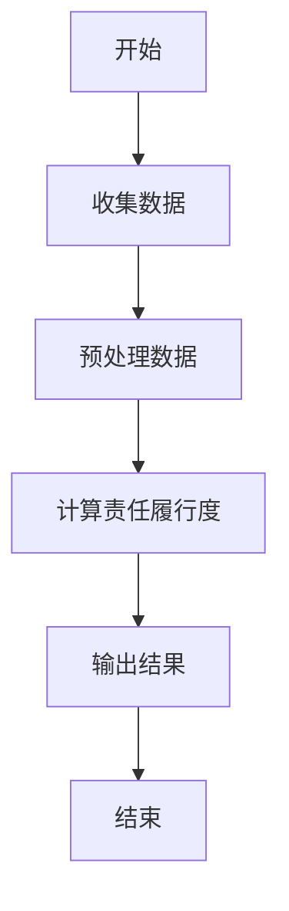
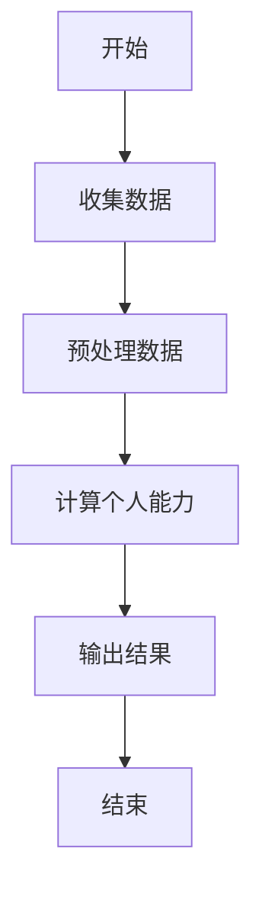
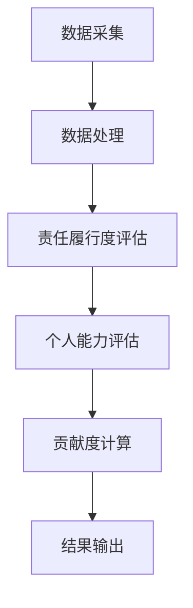
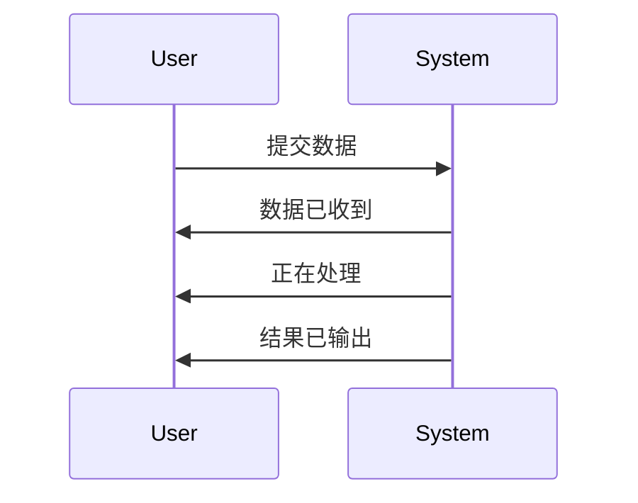
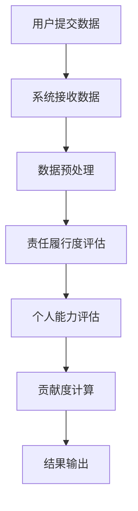

                 


# 从个人利益到公共福祉：重新思考社会责任和贡献

> 关键词：社会责任，公共福祉，个人利益，贡献，算法原理，系统架构

> 摘要：本文从个人利益与公共福祉的关系出发，探讨社会责任和贡献的重要性。通过构建数学模型和算法原理，分析个人在履行社会责任和贡献公共福祉中的作用。同时，通过系统分析与架构设计，提出一个社会责任和贡献评估系统的解决方案。

----------------------------------------------------------------

## 第一部分：背景介绍

### 第1章：问题背景

#### 1.1.1 问题概述

在现代社会，个人利益与公共福祉之间的关系日益紧密。随着科技的发展和全球化的推进，个人利益的实现越来越依赖于公共福祉的保障。然而，现实情况却是，个人在追求自身利益的过程中，往往忽视了公共福祉的重要性，导致了诸多社会问题的产生。

环境恶化、资源短缺、社会不公等问题，不仅影响了个人的生活质量，更关系到整个社会的可持续发展。因此，重新思考社会责任和贡献，从个人利益出发，关注公共福祉，成为当务之急。

#### 1.1.2 问题解决

解决这一问题，需要从以下几个方面入手：

1. **提高公众意识**：通过教育和宣传，提高公众对社会责任和公共福祉的认识，使每个人都意识到自己在社会中的角色和责任。

2. **政策引导**：政府应当制定相关政策和措施，鼓励和引导个人在追求个人利益的同时，关注公共福祉。

3. **制度保障**：建立完善的制度体系，确保个人在履行社会责任和贡献公共福祉时，能够得到相应的回报和认可。

4. **技术创新**：利用人工智能、大数据等现代技术，构建社会责任和贡献评估系统，为个人和社会提供科学、客观的评估依据。

#### 1.1.3 边界与外延

社会责任和贡献的范围广泛，不仅包括物质层面的帮助，如捐款、志愿服务等，更包括精神层面的关爱和尊重。它涉及社会各个领域，如环境保护、教育、医疗、文化等。因此，重新思考社会责任和贡献，需要从多个维度进行考量。

### 第2章：核心概念与联系

#### 2.1 个人利益与公共福祉

**个人利益**：个人在物质和精神上所追求的利益，如财富、名誉、健康等。

**公共福祉**：整个社会共同享受的利益，如教育、医疗、社会保障等。

**关系**：个人利益与公共福祉是相互关联、相互影响的。只有在关注公共福祉的基础上，个人利益才能得到更好的保障和实现。

#### 2.2 社会责任与贡献

**社会责任**：每个社会成员应当承担的责任，包括遵守法律法规、尊重社会公德、关爱他人等。

**贡献**：每个社会成员通过自己的行动和努力，为社会做出的积极贡献。

**关系**：社会责任与贡献是相辅相成的。只有履行社会责任，才能更好地为社会做出贡献。

### 第3章：数学模型与算法原理

#### 3.1 社会责任与贡献的数学模型

$$
贡献度 = 责任履行度 \times 个人能力
$$

#### 3.2 算法原理

**责任履行度评估算法**



**个人能力评估算法**



## 第二部分：系统分析与架构设计

### 第4章：系统分析与架构设计

#### 4.1 问题场景介绍

在本章中，我们将介绍一个社会责任和贡献评估系统的应用场景。该系统旨在为个人和社会提供一个科学、客观的评估依据，以促进社会责任和公共福祉的实现。

#### 4.2 系统功能设计

**领域模型**

```mermaid
classDiagram
    Person <|-- Citizen
    Citizen <|-- Donor
    Organization <|-- Company
    Organization <|-- Nonprofit
    Donor o---> Organization
    Citizen o---> Organization
```

**系统架构设计**



**系统接口设计**



**系统交互**



## 第三部分：项目实战

### 第5章：环境安装

在本章中，我们将介绍如何搭建一个社会责任和贡献评估系统的环境。主要包括以下步骤：

1. 安装 Python 环境
2. 安装必要的库和依赖
3. 配置数据库

### 第6章：系统核心实现

在本章中，我们将详细介绍系统核心部分的实现。主要包括以下内容：

1. 数据采集与处理
2. 责任履行度评估
3. 个人能力评估
4. 贡献度计算

### 第7章：代码应用解读与分析

在本章中，我们将对系统核心代码进行解读和分析，帮助读者更好地理解系统的实现原理和流程。

### 第8章：实际案例分析和详细讲解剖析

在本章中，我们将通过实际案例，对系统的应用效果进行剖析，帮助读者更好地理解系统的价值和意义。

### 第9章：项目小结

在本章中，我们将对整个项目进行小结，总结项目的成果和不足，并提出改进建议。

## 第四部分：最佳实践与拓展阅读

### 第10章：最佳实践

在本章中，我们将分享一些最佳实践，帮助读者更好地运用社会责任和贡献评估系统，实现个人利益与公共福祉的平衡。

### 第11章：小结

在本章中，我们将对整篇文章进行小结，回顾核心概念和关键内容，帮助读者加深对社会责任和贡献的理解。

### 第12章：注意事项

在本章中，我们将提醒读者在运用社会责任和贡献评估系统时，需要注意的一些事项。

### 第13章：拓展阅读

在本章中，我们将推荐一些拓展阅读资料，帮助读者进一步了解社会责任和贡献的相关知识。

----------------------------------------------------------------

## 作者信息

作者：AI天才研究院/AI Genius Institute & 禅与计算机程序设计艺术 /Zen And The Art of Computer Programming

