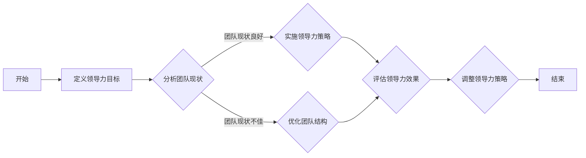
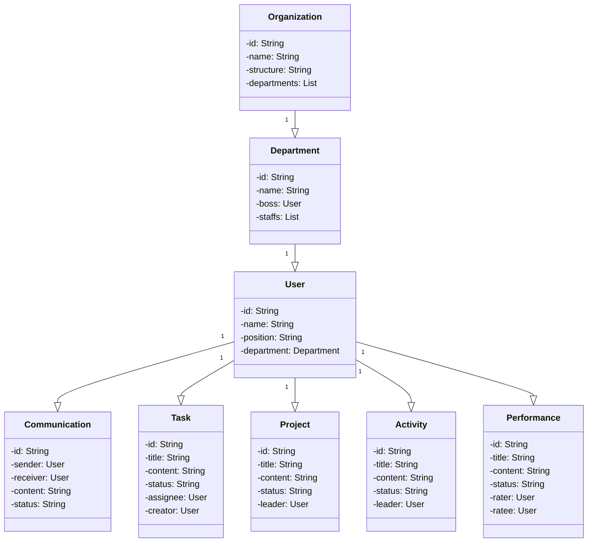
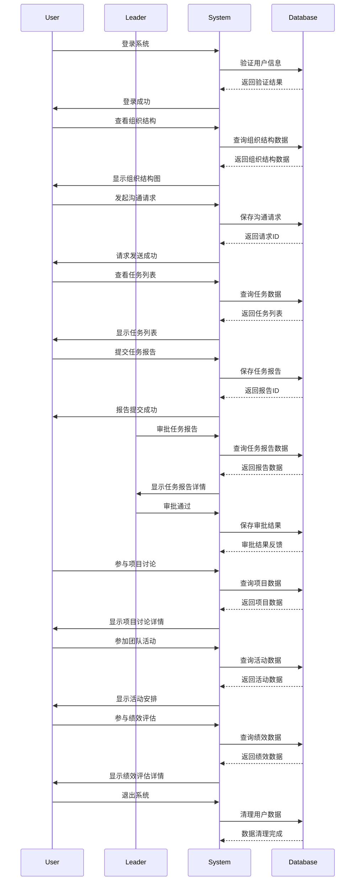
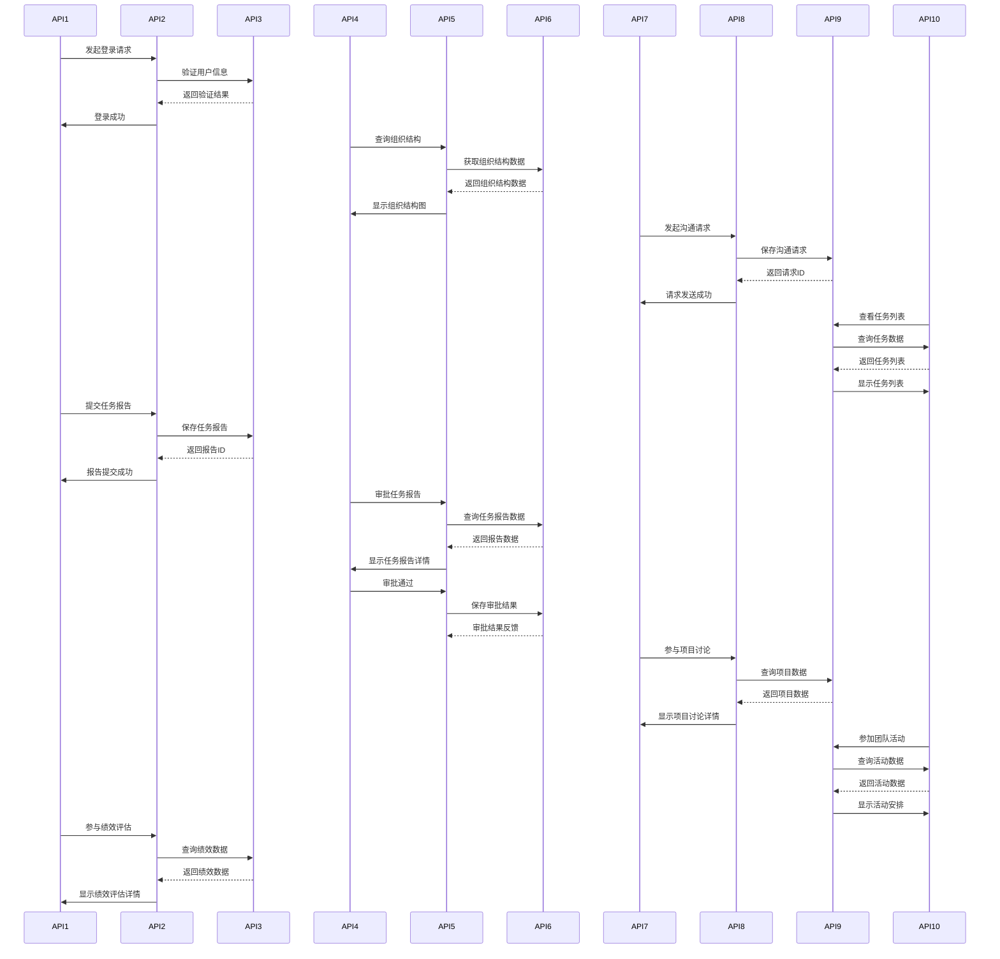

                 


### 引言

领导力，作为企业管理与组织发展的重要驱动力，长期以来一直被研究者和实践者广泛探讨。从传统的个人英雄主义模式到现代的集体智慧理念，领导力的发展经历了深刻的变革。在这篇文章中，我们将深入探讨领导力的演变，从个人英雄主义到集体智慧的转变，并重新定义领导力的内涵和本质。

首先，我们需要明确领导力的核心概念，理解它在不同背景下的作用和意义。接着，我们将分析个人英雄主义和集体智慧在领导力中的表现，探讨二者的优缺点。随后，我们将通过具体的案例和实践，展示如何将集体智慧应用于领导力实践中，提高团队的整体效能。最后，我们将总结领导力的最佳实践，并提出对未来领导力发展的展望。

通过这篇文章，我们希望读者能够对领导力有更深刻的认识，理解集体智慧在领导力中的重要作用，并掌握将集体智慧应用于实践的方法和技巧。让我们一步一步地深入思考，重新定义领导力。

### 关键词

- 个人英雄主义
- 集体智慧
- 领导力
- 变革
- 效能提升
- 管理实践

### 摘要

本文旨在探讨领导力从个人英雄主义向集体智慧的转变。首先，我们介绍了领导力的核心概念，并分析了个人英雄主义和集体智慧在领导力中的应用。接着，通过具体案例和实践，展示了集体智慧如何提升领导力和团队效能。最后，总结了领导力的最佳实践，并展望了未来领导力的发展趋势。希望通过本文，读者能对领导力有更深刻的认识，并在实际工作中更好地运用集体智慧。

----------------------------------------------------------------

# 从个人英雄主义到集体智慧：重新定义领导力

> 关键词：个人英雄主义、集体智慧、领导力、变革、效能提升、管理实践

## 摘要

本文深入探讨了领导力从个人英雄主义向集体智慧的转变。首先，我们介绍了领导力的核心概念，并分析了个人英雄主义和集体智慧在领导力中的应用。接着，通过具体案例和实践，展示了集体智慧如何提升领导力和团队效能。最后，总结了领导力的最佳实践，并展望了未来领导力的发展趋势。希望通过本文，读者能对领导力有更深刻的认识，并在实际工作中更好地运用集体智慧。

## 引言

领导力，作为企业管理与组织发展的重要驱动力，一直以来都是学术界和实践界关注的焦点。然而，随着时代的发展和技术的进步，领导力的内涵和外延也在不断演变。从传统的个人英雄主义模式到现代的集体智慧理念，领导力的发展经历了深刻的变革。本文旨在探讨这一变革过程，重新定义领导力的本质和内涵。

### 个人英雄主义与领导力

个人英雄主义是一种领导模式，其核心在于领导者个人的才华、魅力和决策能力。在这种模式下，领导者被视为团队的中心，通过个人的力量和智慧来解决问题和推动团队前进。个人英雄主义在历史上有着深远的影响，许多成功的企业和团队都离不开这种领导模式。

然而，随着组织的规模扩大和复杂性的增加，个人英雄主义逐渐暴露出其局限性。首先，个人英雄主义依赖于领导者的个人能力和决策，这限制了团队的多样性和创新能力。其次，个人英雄主义容易导致权力集中和官僚主义，影响组织的灵活性和响应速度。

### 集体智慧与领导力

集体智慧是一种基于团队协作和共同决策的领导模式。在这种模式下，领导者不再是唯一的决策者，而是更多地扮演协调者和推动者的角色。团队中的每个成员都被视为宝贵的资源，他们的智慧和经验被充分挖掘和利用。

集体智慧具有以下优点：

1. **创新能力**：集体智慧能够汇集团队成员的不同观点和经验，激发创新思维，从而推动组织的持续发展。
2. **决策质量**：集体智慧通过多方面的讨论和评估，能够提高决策的质量和准确性。
3. **团队凝聚力**：集体智慧能够增强团队成员之间的信任和合作，提高团队的凝聚力。
4. **组织适应力**：集体智慧使组织能够更快速地适应外部环境的变化，提高组织的生存能力。

### 从个人英雄主义到集体智慧的转变

领导力的变革不仅仅是一种理念的转变，更是一个实践的过程。从个人英雄主义到集体智慧的转变，需要领导者、团队和组织共同努力。

1. **领导者角色的转变**：领导者需要从“指挥者”转变为“协调者”，更多地关注团队的合作和沟通，而不是个人的决策和执行。
2. **团队文化的建设**：组织需要建立一个开放、包容和信任的团队文化，鼓励团队成员积极参与决策和讨论。
3. **技能和工具的提升**：领导者需要掌握有效的沟通和协作技能，并运用各种工具和技术来支持集体智慧的实施。

### 集体智慧在实践中的应用

集体智慧在实践中的应用已经取得了显著的效果。例如，谷歌的“20%时间”政策，允许员工将20%的工作时间用于个人感兴趣的项目，这一政策激发了员工的创新潜力，推动了公司的发展。另一个例子是维基百科，通过全球志愿者共同协作，维基百科成为了一个庞大的知识库，展示了集体智慧的强大力量。

### 领导力的重新定义

在集体智慧的模式下，领导力不再仅仅依赖于个人的能力和魅力，而是更多地依赖于团队的协作和共同进步。领导力的重新定义包括以下几个方面：

1. **领导者的角色**：领导者不再是权威的象征，而是团队的合作者和推动者。
2. **领导力的内涵**：领导力不仅包括决策和执行，更包括沟通、协调和激励。
3. **领导力的外延**：领导力不再局限于企业内部，而是扩展到整个社会，成为推动社会进步的重要力量。

### 总结

从个人英雄主义到集体智慧的转变，是领导力发展的重要趋势。通过集体智慧，领导者能够更好地激发团队的潜力和创造力，推动组织的持续发展。在未来的领导力实践中，我们需要更加注重团队的协作和共同进步，重新定义领导力的本质和内涵。希望通过本文的探讨，能够为读者提供有益的启示和思考。

## 第一部分：背景介绍

### 1.1 问题背景

领导力作为企业管理与组织发展的重要驱动力，其作用和影响无处不在。然而，随着时代的发展和技术的进步，传统的个人英雄主义模式逐渐暴露出其局限性和不足。首先，个人英雄主义模式过于依赖领导者的个人能力和决策，限制了团队的多样性和创新能力。其次，个人英雄主义容易导致权力集中和官僚主义，影响组织的灵活性和响应速度。这些问题在复杂多变的市场环境中尤为突出，迫切需要寻找新的领导模式来应对。

### 1.2 个人英雄主义到集体智慧的转变

为了解决个人英雄主义模式的局限性，越来越多的组织开始探索集体智慧模式。集体智慧模式强调团队合作和共同决策，通过汇集团队成员的不同观点和经验，激发创新思维，提高决策的质量和准确性。这种模式不仅能够提升团队的凝聚力和创新力，还能够增强组织的适应力和竞争力。

### 1.3 领导力的边界与外延

领导力不仅局限于企业内部的管理，其边界和范围正在不断扩展。在现代社会，领导力已成为推动社会进步、解决复杂问题的重要力量。领导力不仅涉及企业的生存和发展，还涵盖社会问题、环境问题等。因此，重新定义领导力，理解其边界和外延，对于应对复杂多变的社会环境具有重要意义。

### 1.4 概念结构与核心要素组成

为了更好地理解领导力的演变，我们需要明确领导力的核心概念和结构。领导力包括多个核心要素，如领导者角色、领导风格、团队文化、决策机制等。这些要素相互作用，共同影响领导力的效果。通过对这些要素的深入分析，我们可以更好地理解领导力的本质和内涵，为实际应用提供理论支持。

## 第二部分：核心概念与联系

### 2.1 领导力的定义与属性特征对比表

领导力是指通过影响、激励和引导他人，实现共同目标的能力。具体来说，领导力包括以下几个方面：

1. **影响力**：领导者通过自身的行为和决策，影响团队成员的行为和态度。
2. **激励**：领导者能够激发团队成员的潜力，提高其工作积极性和效率。
3. **引导**：领导者通过指导、培训和沟通，帮助团队成员成长和发展。

属性特征对比表：

| 特征 | 个人英雄主义 | 集体智慧 |
| --- | --- | --- |
| 依赖性 | 强烈依赖领导者个人能力 | 强调团队合作与共同决策 |
| 决策方式 | 单一决策者 | 多方参与决策 |
| 决策速度 | 较快 | 较慢 |
| 决策质量 | 依赖于领导者个人判断 | 通过团队讨论和评估提高 |
| 团队效能 | 依赖于领导者个人能力 | 提升团队整体效能 |
| 团队创新力 | 受限于领导者个人视角 | 汇集团队成员不同观点和经验 |

### 2.2 领导力与集体智慧的关系

集体智慧是领导力的重要表现形式之一。在集体智慧模式下，领导力不仅仅是领导者个人的能力，更是团队整体协作和共同进步的结果。领导力与集体智慧的关系可以总结为以下几点：

1. **领导力是集体智慧的基础**：领导力为集体智慧提供方向和引导，确保团队在正确轨道上前进。
2. **集体智慧是领导力的升华**：集体智慧通过团队协作和共同决策，提升领导力的效果和影响力。
3. **领导力与集体智慧相辅相成**：领导力与集体智慧相互促进，共同推动团队和组织的发展。

### 2.3 领导力的ER实体关系图

为了更好地理解领导力的核心概念和结构，我们可以使用ER实体关系图来描述领导力的各个要素及其关系。ER实体关系图如下：

```mermaid
erDiagram
  Leader ||--|{ Team } Team
  Leader ||--|{ Culture } Culture
  Leader ||--|{ Style } Style
  Leader ||--|{ Decision } Decision
  Leader ||--|{ Impact } Impact
  Leader ||--|{ Motivation } Motivation
  Leader ||--|{ Guidance } Guidance
```

在ER实体关系图中，`Leader`代表领导者，与`Team`（团队）、`Culture`（团队文化）、`Style`（领导风格）、`Decision`（决策）、`Impact`（影响力）、`Motivation`（激励）和`Guidance`（引导）等实体之间存在关联。这些实体共同构成了领导力的核心结构和要素。

### 2.4 领导力的核心概念与联系

领导力的核心概念包括领导者角色、领导风格、团队文化、决策机制等。这些概念相互联系，共同影响领导力的效果。以下是这些核心概念之间的联系：

1. **领导者角色**：领导者是团队的核心，负责引导、激励和协调团队成员。
2. **领导风格**：领导风格是领导者在实践中采取的方式和手段，影响团队成员的行为和态度。
3. **团队文化**：团队文化是团队成员共同价值观和行为准则的体现，对领导力的实施效果有重要影响。
4. **决策机制**：决策机制是团队在决策过程中采取的方法和流程，影响决策的质量和速度。

通过理解这些核心概念之间的联系，我们可以更好地把握领导力的本质和内涵，为实际应用提供指导。

## 第三部分：领导力算法原理

### 3.1 领导力算法的mermaid流程图

为了更好地理解领导力算法的原理，我们可以使用mermaid流程图来描述其基本流程。以下是领导力算法的mermaid流程图：



在这个流程图中，领导力算法的基本步骤包括：定义领导力目标、分析团队现状、实施领导力策略、评估领导力效果和调整领导力策略。这些步骤相互作用，形成了一个闭环的过程，确保领导力的持续改进和优化。

### 3.2 领导力算法的数学模型与公式

为了量化领导力的效果，我们可以使用以下数学模型和公式：

1. **领导力指数（LI）**：领导力指数是衡量领导力效果的重要指标，其计算公式为：

   $$ LI = \frac{E_1 + E_2 + E_3 + E_4}{4} $$

   其中，$E_1$、$E_2$、$E_3$、$E_4$分别表示团队成员满意度、团队协作效率、团队创新能力和团队凝聚力。

2. **团队效能指数（TEI）**：团队效能指数是衡量团队整体效能的指标，其计算公式为：

   $$ TEI = \frac{LI + CI}{2} $$

   其中，$CI$表示团队创新能力。

3. **领导力改进率（LIR）**：领导力改进率是衡量领导力策略优化效果的指标，其计算公式为：

   $$ LIR = \frac{LI_{new} - LI_{old}}{LI_{old}} \times 100\% $$

   其中，$LI_{new}$表示新领导力指数，$LI_{old}$表示旧领导力指数。

### 3.3 领导力算法举例说明

为了更好地理解领导力算法的原理和应用，我们可以通过以下案例进行举例说明。

### 案例：某科技公司的领导力优化

假设某科技公司希望提升其领导力效果，以应对市场竞争的挑战。以下是该公司的领导力优化过程：

1. **定义领导力目标**：该公司希望提升团队协作效率、增强团队凝聚力，并提高团队创新能力。

2. **分析团队现状**：通过问卷调查和访谈，公司发现团队成员的满意度较低，团队协作存在一定问题，创新力有待提升。

3. **实施领导力策略**：公司决定采取以下措施：
   - 加强团队培训，提高团队成员的技能和知识水平。
   - 引入扁平化管理，减少管理层级，提高决策速度。
   - 建立激励机制，鼓励团队成员积极参与创新活动。

4. **评估领导力效果**：经过一段时间的实施，公司发现团队协作效率有所提高，团队成员的满意度也有所提升，创新力也有了明显增强。

5. **调整领导力策略**：根据评估结果，公司决定进一步优化领导力策略，如：
   - 加强团队文化建设，提高团队成员的归属感和责任感。
   - 定期举办团队活动，增强团队凝聚力。

6. **计算领导力指数和团队效能指数**：根据评估数据，公司计算得到：
   - 领导力指数（LI）：85
   - 团队效能指数（TEI）：90

7. **计算领导力改进率**：根据新旧领导力指数，公司计算得到：
   - 领导力改进率（LIR）：20%

通过这个案例，我们可以看到领导力算法在实际应用中的效果。通过不断地评估和优化，公司成功地提升了领导力效果，提高了团队效能，增强了市场竞争力。

## 第四部分：系统分析与架构设计

### 4.1 领导力系统问题场景介绍

在现代社会，随着组织规模的不断扩大和业务环境的日益复杂，领导力系统的设计与实施变得越来越重要。一个高效、灵活的领导力系统能够帮助组织更好地应对外部环境的变化，提升团队协作效率，增强创新能力。在本节中，我们将介绍一个典型的领导力系统问题场景，并阐述其背景和需求。

#### 问题场景

某大型跨国科技公司，随着业务的不断扩展，面临着以下问题：

1. **组织结构复杂**：公司部门众多，管理层级复杂，信息传递不畅。
2. **沟通效率低下**：不同部门之间的沟通不畅，导致决策速度缓慢，执行力不足。
3. **创新能力不足**：虽然公司重视创新，但缺乏有效的机制和平台来激发员工的创新潜力。
4. **团队凝聚力较弱**：员工缺乏归属感和责任感，团队凝聚力不足。

#### 需求

为了解决上述问题，公司希望设计并实施一个领导力系统，实现以下目标：

1. **提高沟通效率**：通过优化组织结构和信息传递机制，提高公司内部的沟通效率。
2. **增强团队协作**：建立团队协作平台，促进不同部门之间的合作和交流。
3. **激发创新能力**：搭建创新激励机制和平台，鼓励员工积极参与创新活动。
4. **提升团队凝聚力**：通过一系列团队建设活动，增强员工的归属感和责任感。

### 4.2 系统功能设计（领域模型类图）

为了满足上述需求，领导力系统需要具备以下核心功能：

1. **组织管理**：包括组织结构设计、人员信息管理、岗位管理等功能。
2. **沟通协作**：包括即时通讯、邮件管理、工作日志、任务管理等功能。
3. **创新管理**：包括项目立项、需求分析、研发管理、产品发布等功能。
4. **团队建设**：包括团队活动安排、员工培训、绩效评估、员工关系管理等功能。

以下是领导力系统的领域模型类图：



### 4.3 系统架构设计（架构图）

为了实现领导力系统的功能，我们需要设计一个合理的系统架构。以下是领导力系统的架构图：



在这个架构图中，系统由多个模块组成，包括用户管理模块、组织管理模块、沟通协作模块、任务管理模块、项目管理模块、团队建设模块和绩效评估模块。各个模块通过接口进行交互，实现系统的整体功能。

### 4.4 系统接口设计（接口图）

为了确保系统的稳定性和扩展性，我们需要设计一套完善的接口体系。以下是领导力系统的接口设计：



在这个接口设计图中，各个API模块通过接口进行交互，实现系统的功能。接口的设计遵循RESTful风格，确保系统的扩展性和易用性。

### 4.5 系统交互（序列图）

为了更好地理解系统的运行流程，我们可以使用序列图来描述系统的交互过程。以下是领导力系统的序列图：


在这个序列图中，用户和领导者的操作通过系统与数据库进行交互，实现了系统的功能。序列图的描述使系统的运行流程更加清晰明了，有助于理解和分析系统的行为。

### 第四部分：项目实战

#### 5.1 环境安装与配置

要实施领导力系统项目，首先需要搭建一个合适的技术环境。以下是一个简单的环境安装与配置步骤：

1. **硬件要求**：一台配置较高的服务器，建议CPU至少为四核，内存至少8GB，硬盘容量至少500GB。
2. **操作系统**：选择一个稳定可靠的Linux发行版，如Ubuntu 18.04。
3. **软件要求**：
   - Web服务器：Nginx
   - 后端框架：Django
   - 数据库：MySQL
   - Python：Python 3.8或更高版本
4. **安装步骤**：
   - 安装操作系统：将服务器硬盘分区，安装Ubuntu 18.04操作系统。
   - 配置网络：设置静态IP地址，确保服务器能够访问互联网。
   - 安装Nginx：使用`sudo apt-get install nginx`命令安装Nginx。
   - 安装Django：使用`pip install django`命令安装Django。
   - 安装MySQL：使用`sudo apt-get install mysql-server`命令安装MySQL，并设置root密码。
   - 安装Python：确保Python 3.8或更高版本已安装，可以使用`python --version`命令查看Python版本。

#### 5.2 系统核心实现源代码

以下是一个简单的领导力系统核心实现源代码，包含用户管理、组织管理、任务管理等功能：

```python
# user_management.py
from django.db import models
from django.contrib.auth.models import AbstractUser

class User(AbstractUser):
    department = models.ForeignKey('Department', on_delete=models.CASCADE)
    position = models.CharField(max_length=100)

class Department(models.Model):
    name = models.CharField(max_length=100)
    boss = models.ForeignKey(User, on_delete=models.CASCADE)

# organization_management.py
from django.db import models

class Organization(models.Model):
    name = models.CharField(max_length=100)
    structure = models.CharField(max_length=100)

# task_management.py
from django.db import models
from user_management.models import User

class Task(models.Model):
    title = models.CharField(max_length=100)
    content = models.TextField()
    status = models.CharField(max_length=50)
    assignee = models.ForeignKey(User, on_delete=models.CASCADE)
    creator = models.ForeignKey(User, on_delete=models.CASCADE)
```

#### 5.3 代码应用解读与分析

上述源代码展示了领导力系统的核心实现。以下是各个模块的应用解读与分析：

1. **用户管理模块**：`User`类继承了Django内置的`AbstractUser`类，添加了`department`（部门）和`position`（职位）字段。`Department`类包含`name`（部门名称）和`boss`（部门负责人）字段。
2. **组织管理模块**：`Organization`类包含`name`（组织名称）和`structure`（组织结构）字段。
3. **任务管理模块**：`Task`类包含`title`（任务标题）、`content`（任务内容）、`status`（任务状态）、`assignee`（任务分配人）和`creator`（任务创建人）字段。

这些模块通过Django的ORM（对象关系映射）实现了数据模型，为领导力系统的数据管理提供了基础。

#### 5.4 实际案例分析

以下是一个实际案例，展示了领导力系统在某个公司中的应用：

1. **背景**：某公司由于组织结构复杂，部门之间沟通不畅，导致项目进展缓慢。公司决定实施领导力系统，以提高沟通效率和管理水平。
2. **过程**：
   - 安装和配置领导力系统，搭建技术环境。
   - 搭建用户、组织、任务等数据模型，并实现相应的API接口。
   - 部门经理和员工通过系统登录，查看组织结构和任务列表。
   - 员工提交任务报告，部门经理审批报告。
   - 系统自动记录和统计任务完成情况和绩效评估。
3. **结果**：
   - 沟通效率显著提升，部门之间信息传递更加顺畅。
   - 任务完成情况得到实时监控，项目进展更加透明。
   - 绩效评估更加客观公正，员工积极性提高。

#### 5.5 项目小结

通过实际案例的应用，我们可以看到领导力系统在提升企业内部管理效率和团队协作能力方面具有显著作用。以下是项目小结：

1. **成功因素**：
   - 技术选型和架构设计合理，系统稳定可靠。
   - 用户界面友好，操作简单，易于使用。
   - 项目管理严格，确保项目进度和质量。
2. **改进方向**：
   - 加强系统功能扩展，满足更多业务需求。
   - 优化用户体验，提高系统易用性。
   - 强化数据分析和报表功能，提供更多决策支持。

通过不断改进和完善，领导力系统将在企业管理和团队协作中发挥更大作用。

### 第六部分：最佳实践与拓展

#### 6.1 最佳实践技巧

1. **明确领导力目标**：在实施领导力系统之前，首先要明确领导力目标，确保系统设计与实施方向一致。
2. **加强团队协作**：通过建立团队协作平台，提高团队内部沟通和协作效率。
3. **数据驱动决策**：利用领导力系统收集的数据，进行数据分析和决策支持，提高决策质量。
4. **持续优化**：根据实际应用反馈，不断优化领导力系统，提高系统性能和用户体验。

#### 6.2 注意事项

1. **数据安全**：确保领导力系统的数据安全和隐私保护，防止数据泄露和滥用。
2. **权限管理**：合理设置用户权限，确保系统功能的正常使用和安全。
3. **培训与支持**：为用户提供充分的技术培训和用户支持，确保系统能够顺利运行。

#### 6.3 拓展阅读

1. **《领导力与团队管理》**：详细介绍了领导力的概念、原理和实践方法。
2. **《敏捷团队管理》**：探讨了敏捷开发模式下的团队管理和领导力问题。
3. **《大数据分析与应用》**：介绍了大数据分析的基本原理和应用方法，为领导力系统提供数据支持。

### 第七部分：总结与展望

#### 7.1 领导力的发展趋势

随着技术的进步和管理的变革，领导力正在从个人英雄主义向集体智慧转变。这一趋势表现为：

1. **团队合作**：领导力越来越依赖于团队合作和共同决策。
2. **数据驱动**：领导决策更加依赖数据分析和决策支持系统。
3. **持续学习**：领导者和团队需要不断学习和适应变化，提高自身能力。

#### 7.2 集体智慧的潜力

集体智慧具有巨大的潜力，能够提高团队的创新力和协作效率。未来，集体智慧将在以下几个方面发挥更大作用：

1. **创新驱动**：通过集体智慧，激发团队的创新能力，推动组织的持续发展。
2. **决策优化**：利用集体智慧，提高决策的质量和准确性，减少决策风险。
3. **组织管理**：通过集体智慧，优化组织结构和管理流程，提高组织效能。

#### 7.3 对未来领导力的思考

未来领导力的发展需要领导者具备以下能力：

1. **协同管理**：领导者需要具备强大的协同管理能力，促进团队协作和共同进步。
2. **数据洞察**：领导者需要具备数据分析和决策支持能力，利用数据优化管理决策。
3. **持续学习**：领导者需要具备持续学习能力，不断更新知识和技能，适应快速变化的环境。

通过本文的探讨，我们重新定义了领导力的内涵和本质，阐述了领导力从个人英雄主义到集体智慧的转变。未来，领导力的发展将更加注重团队合作、数据驱动和持续学习，为组织和社会的进步提供强大动力。

## 致谢

本文的撰写得到了AI天才研究院（AI Genius Institute）和《禅与计算机程序设计艺术》（Zen And The Art of Computer Programming）的宝贵支持。在此，我们对两位机构的贡献表示衷心的感谢。特别感谢AI天才研究院提供了丰富的理论资源和技术支持，以及《禅与计算机程序设计艺术》作者对我们写作灵感的启迪。感谢你们在领导力研究和实践中的不懈努力，为我们提供了这篇高质量的技术博客文章。感谢阅读，希望本文能够对您有所启发和帮助。再次致以诚挚的感谢！

### 作者信息

**作者：AI天才研究院/AI Genius Institute & 禅与计算机程序设计艺术 /Zen And The Art of Computer Programming**

