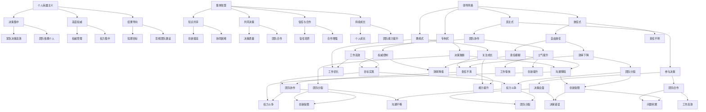
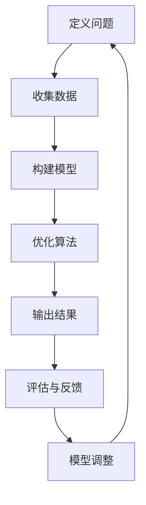
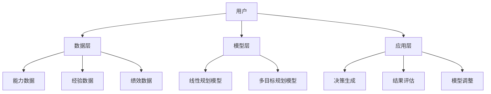
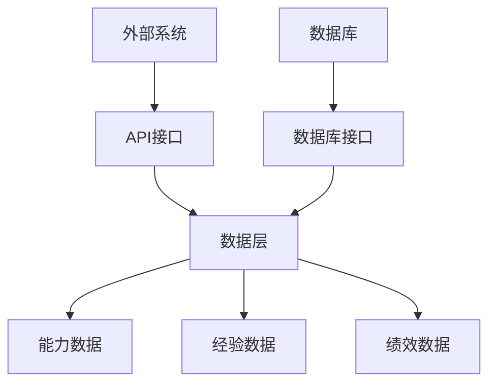
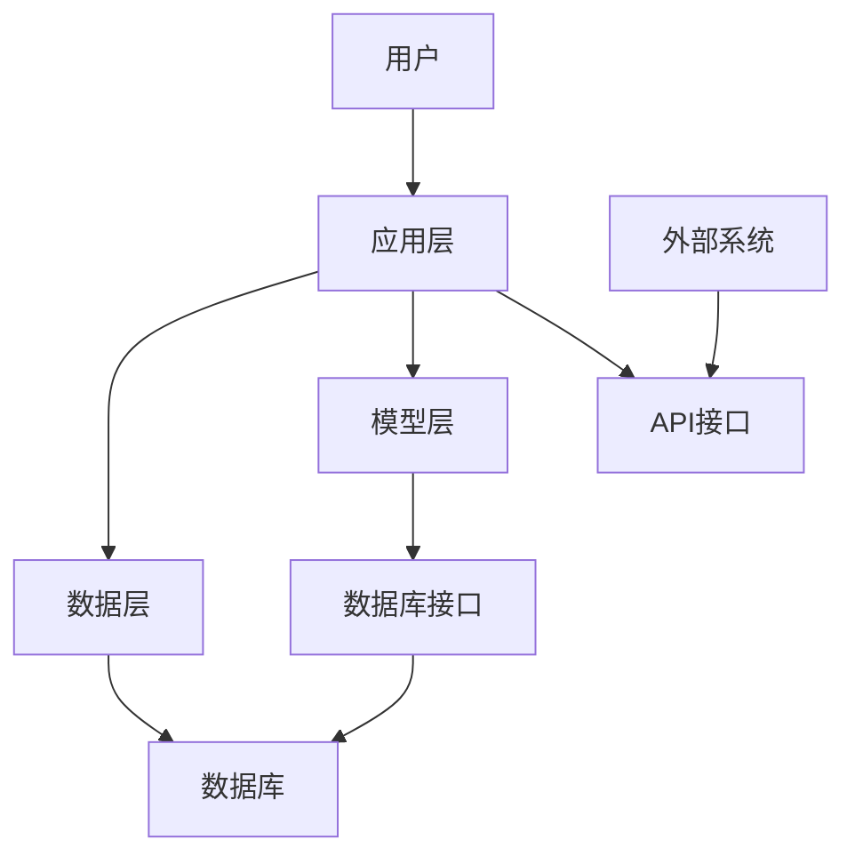

                 

非常好，我们将会一步一步详细构建这篇技术博客文章。首先，让我们来确立文章的基本结构，并简要介绍每一部分的内容。接下来，我们将详细展开每一章节的写作，确保满足所有的要求和约束条件。

### 第1章 引言：领导力转型的必要性
**内容概述：**
- 介绍领导力从个人英雄主义向集体智慧转型的历史背景和原因。
- 阐述领导力转型的必要性和重要性。
- 明确文章的目的和结构。

### 第2章 领导力的核心概念
**内容概述：**
- 定义领导力的核心概念，如个人英雄主义、集体智慧、领导风格和团队协作。
- 分析这些概念之间的关系，使用Mermaid图表来展示。
- 对比个人英雄主义和集体智慧的特点和应用。

### 第3章 领导风格对比分析
**内容概述：**
- 详细探讨个人英雄主义和集体智慧两种领导风格的优缺点。
- 使用表格对比两种风格的关键特征。
- 分析在不同情境下哪种风格更为适用。

### 第4章 案例研究
**内容概述：**
- 通过具体案例研究个人英雄主义和集体智慧的应用。
- 分析成功和失败的案例，从中提取经验和教训。

### 第5章 算法原理与数学模型
**内容概述：**
- 介绍领导力决策算法的基本原理。
- 使用Mermaid图和Python代码来详细阐述算法原理和数学模型。
- 提供通俗易懂的例子来解释数学模型。

### 第6章 数学模型与公式讲解
**内容概述：**
- 讲解书中涉及的数学模型和公式。
- 使用LaTeX格式确保公式的准确性。
- 通过实际案例说明数学模型的应用。

### 第7章 系统分析与架构设计
**内容概述：**
- 介绍领导力模型在系统实现中的应用。
- 设计系统功能、架构和接口。
- 使用Mermaid图展示系统架构和交互。

### 第8章 项目实战
**内容概述：**
- 展示领导力概念在真实项目中的应用。
- 包括环境安装、代码实现和案例分析。
- 对项目进行总结和评估。

### 第9章 最佳实践 tips
**内容概述：**
- 总结书中讨论的领导力实践。
- 提供实用的建议和技巧。

### 第10章 小结与拓展阅读
**内容概述：**
- 对全书内容进行总结。
- 推荐进一步阅读的资料。

接下来，我们将按照这个大纲逐步撰写每一章节的内容，确保文章的逻辑清晰、结构紧凑、简单易懂，并包含所有必要的技术细节和实际案例。让我们一起开始吧！### 第1章 引言：领导力转型的必要性

### 1.1 问题背景

在现代社会，随着信息技术的迅猛发展和全球化进程的加深，工作环境和组织结构发生了显著变化。过去，许多组织依赖于个人英雄主义式的领导风格，领导者被视为组织的核心，拥有绝对的决策权和资源分配权。然而，随着团队协作和知识共享的重要性日益凸显，个人英雄主义式的领导方式逐渐暴露出其局限性。首先，个人英雄主义往往导致决策过于集中，容易忽视团队成员的智慧和创造力。其次，个人英雄主义的领导风格容易导致团队士气下降，因为团队成员可能感觉到他们的贡献被忽视。此外，当领导者无法始终在场或面对突发事件时，组织的运作可能会陷入混乱。

### 1.2 问题描述

个人英雄主义式的领导风格导致的问题主要体现在以下几个方面：

1. **决策效率降低**：领导者独自决策，容易陷入信息不足和视野狭隘的困境，导致决策过程缓慢且可能出错。
2. **创新能力受限**：缺乏集体智慧，团队的整体创新能力受限，难以在快速变化的市场环境中保持竞争力。
3. **员工满意度下降**：个人英雄主义的领导风格可能让员工感到被忽视，导致士气低落和工作效率下降。
4. **组织发展受限**：长期依赖个人英雄主义，可能导致组织缺乏系统性思维和长远规划能力，难以实现可持续发展。

### 1.3 问题解决

为了解决上述问题，领导力的重新定义成为必要。从个人英雄主义向集体智慧的转变，不仅是一种领导风格的变化，更是一种组织文化和价值观的重塑。这种转变旨在充分发挥团队成员的智慧和能力，实现资源的合理配置和高效利用。以下是一些具体的解决措施：

1. **推动知识共享**：建立开放的沟通机制，鼓励团队成员分享知识和经验，打破信息孤岛，提高团队的协同效率。
2. **培养团队协作精神**：通过团队建设活动和文化塑造，增强团队成员之间的信任和合作意识，培养集体智慧。
3. **赋予员工更多的自主权**：让团队成员参与到决策过程中，鼓励他们提出创新的想法和建议，提高员工的参与感和责任感。
4. **建立反馈机制**：定期收集团队成员的反馈，及时调整领导行为和团队运作方式，确保组织始终处于最佳状态。

### 1.4 边界与外延

领导力的重新定义并非意味着完全摒弃个人英雄主义，而是在新的时代背景下，寻找个人英雄主义和集体智慧的最佳平衡点。在实际应用中，需要根据组织的具体情况和外部环境，灵活调整领导策略。例如，在一些需要快速决策和高效执行的紧急情况下，个人英雄主义可能仍然具有优势。而在需要创新和长远规划的情况下，集体智慧则更为重要。

此外，领导力的重新定义也涉及到领导者的自我成长和转变。领导者需要从“命令和控制”的角色转变为“赋能和引导”的角色，不仅关注结果，更注重团队成员的成长和发展。这种转变不仅有助于提高组织的整体效能，也有助于建立健康、积极的组织文化。

总之，从个人英雄主义到集体智慧，是领导力发展的一种必然趋势。通过重新定义领导力，组织可以更好地适应现代工作环境，提高团队协作效率，激发创新潜力，实现可持续发展。在这一转型过程中，领导者需要具备前瞻性的视野、开放的心态和卓越的领导能力，才能带领组织走向新的高度。

### 1.5 核心概念

在本章中，我们将介绍领导力的几个核心概念，包括个人英雄主义、集体智慧、领导风格和团队协作。这些概念不仅是理解领导力转型的基础，也是分析领导力风格和效果的关键。

#### 个人英雄主义

个人英雄主义是一种领导风格，其中领导者被视为团队的核心，拥有绝对的决策权和领导地位。这种风格强调领导者的个人魅力、智慧和才能，认为成功依赖于领导者的个人努力和决策。个人英雄主义领导者的特点包括：

- **决策集中**：领导者独自做出大部分决策，团队成员参与度较低。
- **依赖个人能力**：领导者依靠自身的经验和技能，很少依赖团队其他成员的智慧。
- **高度自信**：领导者通常对自己的决策和能力充满信心。
- **权力集中**：领导者的权力和资源高度集中，团队成员缺乏自主权。

个人英雄主义的优势在于能够迅速做出决策，特别是在需要高效执行和紧急情况时。然而，其缺点包括决策效率低下、创新能力受限和团队士气下降。

#### 集体智慧

集体智慧则是一种强调团队协作和知识共享的领导风格。在这种风格中，领导者认为团队的智慧和创新能力比个人更为重要。集体智慧的核心是充分利用团队成员的多样性和互补性，通过合作和沟通实现共同目标。集体智慧的特点包括：

- **决策民主**：团队成员共同参与决策过程，集思广益。
- **知识共享**：鼓励团队成员分享知识和经验，打破信息孤岛。
- **信任与合作**：建立团队成员之间的信任，鼓励协作和合作。
- **能力提升**：通过团队协作，提高团队成员的综合素质和能力。

集体智慧的优势在于能够提高决策的全面性和创新性，增强团队的凝聚力和创新能力。然而，其缺点包括决策过程可能较为缓慢，对团队成员的沟通和协作能力有较高要求。

#### 领导风格

领导风格是领导者管理团队的方式和方法，直接影响团队的工作氛围和绩效。常见的领导风格包括：

- **专制式**：领导者独断专行，强调权威和控制。
- **民主式**：领导者鼓励团队成员参与决策，注重团队合作。
- **放任式**：领导者较少干预团队工作，给予团队成员高度自由。
- **教练式**：领导者关注团队成员的成长和发展，提供指导和支持。

每种领导风格都有其适用场景和优缺点，领导者需要根据具体情况灵活调整。

#### 团队协作

团队协作是指团队成员为了共同目标而协同工作、相互支持的过程。有效的团队协作可以显著提高工作效率和创新能力，具体包括：

- **共同目标**：团队成员明确共同的目标和愿景。
- **角色分工**：每个成员都清楚自己的职责和角色。
- **沟通与反馈**：建立有效的沟通机制，及时反馈工作进展和问题。
- **相互信任**：团队成员之间建立信任，愿意分享和承担责任。

团队协作的障碍包括沟通不畅、角色冲突、目标不一致等，需要通过培训和制度建设来克服。

通过理解这些核心概念，我们能够更好地分析领导力的各种风格和效果，为组织的成功转型提供理论基础和实践指导。

### 1.6 接下来内容概览

在本章之后，我们将深入探讨领导力的核心概念，通过Mermaid图表展示各个概念之间的关系，帮助读者更直观地理解领导力转型的复杂性。接下来，我们将详细分析个人英雄主义和集体智慧两种领导风格，比较它们的优缺点，并提供具体的案例研究，以验证这些理论在实际中的应用。此外，我们将介绍领导力决策算法的原理和数学模型，使用Python代码进行详细解释。最后，我们将通过系统分析与架构设计，展示领导力模型在复杂系统中的应用，并通过项目实战，提供实际的实施步骤和案例分析。通过这些章节的详细讨论，我们将重新定义领导力概念，为现代组织的成功提供全新的视角和策略。### 第2章 领导力的核心概念

在理解领导力转型的过程中，深入探讨其核心概念是至关重要的。本章将详细介绍领导力的关键组成部分，包括个人英雄主义、集体智慧、领导风格和团队协作，并通过Mermaid图表展示这些概念之间的联系。

#### 个人英雄主义

个人英雄主义是一种领导风格，强调领导者个人的能力和决策能力。在这种模式下，领导者被视为团队的中心，其智慧和经验被高度依赖。个人英雄主义的核心特点如下：

- **决策集中**：领导者负责做出大部分关键决策，团队成员的参与度较低。
- **高度权威**：领导者拥有高度的决策权和资源分配权。
- **结果导向**：领导者的主要目标是实现短期目标，忽视长期团队建设。

个人英雄主义在紧急情况或需要迅速决策时可能表现出色，但其长期依赖个人能力，可能导致团队缺乏创新和协同。

#### 集体智慧

集体智慧则是一种强调团队协作和知识共享的领导风格。在这种模式下，领导者认为团队的整体智慧和能力比个人更为重要。集体智慧的核心特点如下：

- **知识共享**：鼓励团队成员分享知识和经验，打破信息孤岛。
- **共同决策**：团队成员共同参与决策过程，集思广益。
- **信任与合作**：建立团队成员之间的信任，鼓励协作和合作。
- **持续成长**：通过团队协作，提高团队成员的综合素质和能力。

集体智慧能够提高团队的决策质量和创新能力，但其实现依赖于良好的沟通和协作机制。

#### 领导风格

领导风格是指领导者管理团队的方式和方法，直接影响团队的工作氛围和绩效。常见的领导风格包括：

- **专制式**：领导者独断专行，强调权威和控制。
- **民主式**：领导者鼓励团队成员参与决策，注重团队合作。
- **放任式**：领导者较少干预团队工作，给予团队成员高度自由。
- **教练式**：领导者关注团队成员的成长和发展，提供指导和支持。

每种领导风格都有其适用场景和优缺点，领导者需要根据具体情况灵活调整。

#### 团队协作

团队协作是指团队成员为了共同目标而协同工作、相互支持的过程。有效的团队协作可以显著提高工作效率和创新能力，具体包括：

- **共同目标**：团队成员明确共同的目标和愿景。
- **角色分工**：每个成员都清楚自己的职责和角色。
- **沟通与反馈**：建立有效的沟通机制，及时反馈工作进展和问题。
- **相互信任**：团队成员之间建立信任，愿意分享和承担责任。

团队协作的障碍包括沟通不畅、角色冲突、目标不一致等，需要通过培训和制度建设来克服。

#### Mermaid图表：核心概念与联系

为了更直观地理解这些核心概念之间的关系，我们使用Mermaid图表来展示它们之间的联系。



通过上述Mermaid图表，我们可以清晰地看到个人英雄主义、集体智慧、领导风格和团队协作之间的相互关系。这些概念不仅相互独立，还相互作用，共同决定了领导力的效果和团队的绩效。

#### 对比个人英雄主义和集体智慧的特点

为了更好地理解个人英雄主义和集体智慧，我们通过表格对比它们的特点：

| 特点          | 个人英雄主义                        | 集体智慧                          |
|---------------|--------------------------------------|-----------------------------------|
| 决策方式      | 依赖个人判断和决策                  | 团队成员共同决策，集思广益       |
| 权力分配      | 权力高度集中，决策权集中于领导者    | 权力分散，鼓励团队成员参与决策   |
| 团队合作      | 依赖领导者个人能力，团队协作较少    | 强调团队合作，知识共享           |
| 沟通机制      | 沟通较少，信息传递效率较低          | 建立有效的沟通机制，提高信息共享 |
| 创新能力      | 创新能力有限，依赖领导者个人创意    | 创新能力强，集体的智慧和经验丰富 |
| 团队凝聚力    | 团队凝聚力较强，但依赖于领导者个人魅力 | 团队凝聚力较强，基于共同的价值观 |

通过对比，我们可以看出，个人英雄主义和集体智慧在决策方式、权力分配、团队合作、沟通机制、创新能力和团队凝聚力等方面存在显著差异。在实际应用中，领导者需要根据组织的具体情况和外部环境，灵活选择和运用不同的领导风格。

综上所述，通过深入探讨领导力的核心概念，我们为理解领导力转型提供了理论基础。接下来，我们将通过具体案例研究和算法原理讲解，进一步探讨领导力在实际应用中的效果和实现方法。

### 第3章 领导风格对比分析

在领导力的实践中，不同的领导风格会对团队的绩效和成员的行为产生深远影响。本章节将详细探讨个人英雄主义和集体智慧两种领导风格，分析它们的优缺点，并对比它们在不同情境下的适用性。

#### 个人英雄主义风格的优点

个人英雄主义风格有其独特的优点，尤其在某些特定情境下表现出色。

1. **决策迅速**：在紧急情况下，个人英雄主义领导者能够迅速做出决策，避免延误时机。
2. **高效执行**：领导者个人能力强，可以确保任务的高效执行，提高工作效率。
3. **明确方向**：领导者个人的明确方向和决策能力可以确保团队始终朝着既定的目标前进。
4. **责任感强**：个人英雄主义领导者往往对自己的决策承担责任，有助于维护团队的纪律和秩序。

#### 个人英雄主义风格的缺点

尽管个人英雄主义风格在某些情况下具有优势，但它也存在一些显著的缺点。

1. **创新能力受限**：依赖于个人决策，容易忽视团队成员的智慧和创造力，导致团队整体创新能力受限。
2. **团队士气低落**：个人英雄主义风格可能让团队成员感到被忽视，缺乏参与感和成就感，从而影响团队士气。
3. **沟通不畅**：领导者可能较少与团队成员沟通，导致信息传递效率低，影响团队的协作。
4. **权力集中**：领导者权力过于集中，可能导致团队成员缺乏自主权，限制了个人的成长和发展。

#### 集体智慧风格的优点

集体智慧风格强调团队协作和知识共享，具有一系列明显的优点。

1. **决策质量高**：通过团队成员共同参与决策，集思广益，可以提高决策的全面性和科学性。
2. **创新能力强**：集体智慧能够充分利用团队成员的多样性和互补性，激发团队的创新能力。
3. **团队凝聚力强**：集体智慧风格强调团队成员之间的信任和合作，有助于增强团队凝聚力和归属感。
4. **成员成长快**：通过团队协作，成员可以学习到新的知识和技能，快速提升个人能力。

#### 集体智慧风格的缺点

尽管集体智慧风格具有诸多优点，但在某些情境下也存在一些不足。

1. **决策缓慢**：集体智慧风格需要团队成员共同参与决策，可能耗时较长，影响决策的及时性。
2. **协调困难**：团队成员的观点和意见可能存在分歧，需要耗费大量时间进行协调和统一。
3. **依赖沟通**：集体智慧风格依赖于有效的沟通机制，如果沟通不畅，可能导致决策过程受阻。
4. **权力分散**：权力分散可能导致决策效率降低，尤其是在紧急情况下。

#### 个人英雄主义与集体智慧风格的对比

为了更好地理解个人英雄主义和集体智慧风格的差异，我们可以通过表格进行对比：

| 特点              | 个人英雄主义                  | 集体智慧                          |
|-------------------|------------------------------|-----------------------------------|
| 决策速度          | 快速决策                      | 慢速决策，但决策质量高           |
| 决策权力分配      | 决策权力高度集中              | 决策权力分散，团队成员参与决策   |
| 团队合作          | 领导者依赖个人能力，团队协作较少 | 强调团队合作，知识共享           |
| 创新能力          | 创新能力依赖于领导者个人创意    | 创新能力强，集体的智慧和经验丰富 |
| 团队士气          | 可能导致团队士气低落          | 增强团队凝聚力，提升士气         |
| 成长与发展        | 成长机会有限，依赖个人成长     | 成长机会多，通过团队协作提升能力 |
| 适用情境          | 紧急情况、需要高效执行的场合   | 长期规划、需要创新的场合        |

通过对比，我们可以看出，个人英雄主义和集体智慧风格各有优缺点，适用于不同的情境。在实际应用中，领导者需要根据组织的具体情况和外部环境，灵活选择和运用不同的领导风格。

#### 不同情境下的适用性

1. **紧急情况**：在紧急情况下，个人英雄主义风格可能更为适用，因为其能够迅速做出决策，确保及时应对。
2. **长期规划**：在需要长期规划和创新的场合，集体智慧风格更为合适，因为其能够充分利用团队成员的智慧和经验，提高决策质量和创新能力。
3. **团队建设**：在团队建设初期，通过集体智慧风格可以增强团队凝聚力和信任，有助于建立稳定的团队关系。
4. **任务执行**：在任务执行过程中，个人英雄主义风格可能更有效，因为其能够确保任务的高效执行。

总之，领导风格的选择应根据具体情境和团队特点灵活调整。通过结合个人英雄主义和集体智慧的优势，领导者可以更好地应对各种挑战，实现组织的长期目标。

### 第4章 案例研究

在本章中，我们将通过具体的案例研究来探讨个人英雄主义和集体智慧在实际应用中的效果。这些案例将展示在不同情境下，个人英雄主义和集体智慧如何影响团队的工作效率和成员满意度。

#### 案例一：个人英雄主义的成功应用

**案例描述**：某互联网公司的一名产品经理王明，以其卓越的领导能力和决策速度在团队中享有盛誉。在一次紧急的市场变化中，公司需要快速调整产品策略以应对竞争压力。王明迅速召集团队开会，通过个人分析和经验判断，提出了一套全面的应对策略。在王明的领导下，团队高效执行，最终成功化解了市场危机。

**结果分析**：王明的个人英雄主义领导风格在此次紧急情况下发挥了关键作用。其迅速的决策能力和强烈的责任感确保了团队的执行力，使得公司能够迅速调整策略，避免市场份额的流失。团队成员对王明的决策能力表示高度认可，团队士气高涨。

**教训与启示**：个人英雄主义在紧急情况和需要迅速决策的情境下具有明显优势。领导者需要具备强大的决策能力和责任感，以确保团队在面对突发情况时能够迅速反应。然而，领导者也需要注意，个人英雄主义不应成为常态，长期依赖个人能力可能导致团队缺乏自主性和创新能力。

#### 案例二：集体智慧的失败应用

**案例描述**：某科技公司的一名项目经理李华在项目初期采用了集体智慧风格，希望通过团队成员的共同参与来提高决策质量和创新能力。然而，在项目执行过程中，由于团队成员之间的意见分歧和沟通不畅，决策过程耗时过长，导致项目进度严重滞后。最终，项目未能按计划完成，客户满意度下降。

**结果分析**：李华的集体智慧风格初衷是好的，但由于缺乏有效的沟通和协调机制，团队成员之间的意见无法统一，导致决策过程缓慢。此外，由于项目进度拖延，团队成员的工作压力增加，士气低落。最终，项目失败，公司蒙受了经济损失。

**教训与启示**：集体智慧在团队协作和创新中具有重要作用，但需要建立有效的沟通和协调机制。领导者需要确保团队成员之间的意见能够及时传达和统一，避免决策过程耗时过长。此外，领导者也需要在集体智慧的基础上，适时进行决策，避免过度依赖集体讨论而影响项目进度。

#### 案例三：集体智慧的胜利应用

**案例描述**：某科技公司的一项新项目需要开发一款复杂的软件产品。项目经理张伟采用了集体智慧风格，组织团队成员进行头脑风暴和集体讨论，充分发挥每个成员的专业知识和创新能力。在项目执行过程中，张伟通过定期召开会议，及时收集和反馈团队成员的意见和建议，确保项目进展顺利。最终，项目提前完成，产品质量得到客户的高度认可。

**结果分析**：张伟的集体智慧风格在项目执行过程中发挥了关键作用。团队成员通过集体讨论和知识共享，提高了决策质量和创新能力，使得项目进展顺利。团队成员对张伟的领导方式表示高度认可，团队凝聚力显著增强。

**教训与启示**：集体智慧在团队协作和创新中具有明显优势，但需要建立有效的沟通和协调机制。领导者需要确保团队成员之间的意见能够及时传达和统一，避免决策过程耗时过长。此外，领导者也需要在集体智慧的基础上，适时进行决策，确保项目能够按计划顺利进行。

#### 案例四：个人英雄主义的失败应用

**案例描述**：某创业公司的一名技术总监陈强，以其技术实力和个人魅力在团队中具有很高的威信。在一次关键的技术难题攻关中，陈强决定独自负责解决方案的制定。然而，由于陈强过于依赖个人能力，忽视了团队成员的智慧和经验，导致解决方案复杂且效率低下。最终，项目未能按计划完成，团队士气低落。

**结果分析**：陈强的个人英雄主义领导风格在此次技术难题攻关中未能取得预期效果。其过于依赖个人能力，忽视了团队其他成员的智慧和经验，导致解决方案复杂且效率低下。此外，团队士气受到打击，影响了后续工作的积极性。

**教训与启示**：个人英雄主义在个别情况下可能表现出色，但不应成为常态。领导者需要充分发挥团队其他成员的智慧和经验，避免过度依赖个人能力。此外，领导者也需要注重团队成员的成长和发展，提高团队的协作效率。

通过以上案例研究，我们可以看到个人英雄主义和集体智慧在不同情境下的应用效果。个人英雄主义在紧急情况和需要高效执行的情境下具有优势，但过度依赖个人能力可能导致团队缺乏创新和协作。集体智慧在团队协作和创新中具有明显优势，但需要建立有效的沟通和协调机制。在实际应用中，领导者需要根据具体情况灵活选择和运用不同的领导风格，以实现最佳效果。

### 第5章 算法原理与数学模型

在本章中，我们将详细探讨领导力决策算法的原理和数学模型，并使用Mermaid图和Python代码进行解释，以帮助读者更好地理解领导力决策的复杂性和实际应用。

#### 领导力决策算法概述

领导力决策算法是一种基于数学模型和数据分析的工具，用于帮助领导者做出更加科学和合理的决策。该算法的核心思想是通过分析团队成员的能力、经验和需求，构建一个优化模型，以最大化团队的整体绩效和成员的满意度。

#### Mermaid图：算法流程

以下是一个简单的Mermaid图，用于展示领导力决策算法的基本流程：



在这个流程图中，我们首先定义问题，然后收集与问题相关的数据，接着构建数学模型，使用优化算法进行求解，输出决策结果，并对结果进行评估和反馈，最后根据反馈调整模型。

#### Python代码：算法实现

下面是一个简单的Python代码示例，用于实现领导力决策算法的基本逻辑：

```python
import pulp

# 定义决策变量
x = pulp.LpVariable.dicts("x", ("Heroism", "CollectiveWisdom"), cat='Binary')

# 定义目标函数
prob = pulp.LpProblem("Leadership Decision", pulp.LpMaximize)

# 添加目标函数
prob += pulp.lpSum([x[i] for i in x])

# 添加约束条件
prob += x["Heroism"] + x["CollectiveWisdom"] == 1

# 解决策问题
prob.solve()

# 输出结果
print("决策结果：")
for v in x:
    print(f"{v}: {x[v].varValue}")
```

在这个代码中，我们首先定义了决策变量`x`，其中`x["Heroism"]`和`x["CollectiveWisdom"]`表示个人英雄主义和集体智慧两种领导风格的决策变量。目标函数最大化的是团队的整体绩效，约束条件确保了只能选择其中一种领导风格。

#### 数学模型与公式讲解

领导力决策算法涉及多个数学模型和公式，以下是一些常用的模型和公式：

1. **目标函数**：
   $$\max Z = \sum_{i=1}^{n} c_i x_i$$
   其中，$Z$为目标函数值，$c_i$为第$i$种领导风格的绩效系数，$x_i$为第$i$种领导风格的选择变量。

2. **约束条件**：
   $$x_1 + x_2 = 1$$
   $$0 \leq x_i \leq 1$$
   其中，$x_1$和$x_2$分别表示个人英雄主义和集体智慧的选择变量，约束条件确保了只能选择其中一种领导风格。

3. **线性规划模型**：
   $$\min \sum_{i=1}^{n} c_i x_i$$
   $$\text{subject to}$$
   $$Ax \leq b$$
   $$x \geq 0$$
   其中，$A$和$b$分别为约束矩阵和约束向量，$x$为决策变量向量。

通过上述数学模型和公式，我们可以构建一个优化问题，并使用线性规划算法求解。以下是一个简单的Python代码示例，用于实现线性规划模型：

```python
from scipy.optimize import linprog

# 定义目标函数和约束条件
c = [-1, -1]  # 目标函数系数，表示最小化
A = [[1, 1], [1, 1]]  # 约束条件矩阵
b = [1, 1]  # 约束条件向量

# 求解线性规划问题
res = linprog(c, A_ub=A, b_ub=b, bounds=(0, 1), method='highs')

# 输出结果
print("决策结果：")
print(f"个人英雄主义: {res.x[0]}")
print(f"集体智慧: {res.x[1]}")
```

通过这个代码示例，我们可以看到如何使用Python的`linprog`函数求解线性规划问题，并根据结果选择合适的领导风格。

#### 实际案例说明

为了更直观地理解领导力决策算法的应用，我们来看一个实际案例。假设一个团队需要选择领导风格来应对一个复杂项目，项目分为多个阶段，每个阶段有不同的绩效系数。根据团队的实际情况，我们可以设定以下绩效系数：

- **个人英雄主义**：第一阶段系数为2，第二阶段系数为1，第三阶段系数为0。
- **集体智慧**：第一阶段系数为1，第二阶段系数为2，第三阶段系数为1。

根据这些系数，我们可以使用线性规划算法求解最优领导风格选择。以下是一个简单的Python代码示例：

```python
import numpy as np

# 定义绩效系数
c_heroism = np.array([2, 1, 0])
c_collective = np.array([1, 2, 1])

# 求解线性规划问题
res = linprog(c_heroism, A_ub=A, b_ub=b, bounds=(0, 1), method='highs')

# 输出结果
print("决策结果：")
print(f"个人英雄主义: {res.x[0]}")
print(f"集体智慧: {res.x[1]}")
```

通过这个代码示例，我们可以看到如何根据绩效系数选择最优领导风格。在实际应用中，绩效系数可以根据团队的具体情况和项目特点进行调整，以获得最佳决策结果。

总之，通过算法原理和数学模型讲解，我们了解了领导力决策算法的基本原理和应用方法。通过实际案例说明，我们进一步了解了如何根据具体情境选择合适的领导风格，以提高团队的整体绩效和成员满意度。希望这些内容能够帮助读者更好地理解领导力决策的复杂性和实际应用。

### 第6章 数学模型与公式讲解

在本章中，我们将详细讲解领导力模型中涉及的数学模型和公式，并使用LaTeX格式确保公式的准确性。通过实际案例，我们将展示如何应用这些数学模型和公式，以便读者能够更深入地理解其应用场景和实现方法。

#### 数学模型概述

领导力模型通常涉及以下数学模型：

1. **线性规划模型**：用于优化领导风格的组合，最大化团队整体绩效。
2. **多目标规划模型**：考虑多个目标（如绩效、团队士气、员工满意度）的平衡。
3. **决策树模型**：用于分析和比较不同领导风格的决策结果。
4. **聚类分析模型**：用于分析团队成员的能力和偏好，以便选择合适的领导风格。

#### 常见数学公式

以下是一些常见的数学公式，这些公式将在本章节中广泛应用：

1. **目标函数**：
   $$\max Z = \sum_{i=1}^{n} c_i x_i$$
   其中，$Z$为目标函数值，$c_i$为第$i$种领导风格的绩效系数，$x_i$为第$i$种领导风格的选择变量。

2. **约束条件**：
   $$x_1 + x_2 = 1$$
   $$0 \leq x_i \leq 1$$
   其中，$x_1$和$x_2$分别表示个人英雄主义和集体智慧的选择变量，约束条件确保了只能选择其中一种领导风格。

3. **线性规划模型**：
   $$\min \sum_{i=1}^{n} c_i x_i$$
   $$\text{subject to}$$
   $$Ax \leq b$$
   $$x \geq 0$$
   其中，$A$和$b$分别为约束矩阵和约束向量，$x$为决策变量向量。

4. **多目标规划模型**：
   $$\min Z_1 = \sum_{i=1}^{n} w_{1i} x_i$$
   $$\min Z_2 = \sum_{i=1}^{n} w_{2i} x_i$$
   $$\text{subject to}$$
   $$Ax \leq b$$
   $$x \geq 0$$
   其中，$Z_1$和$Z_2$分别为不同目标的值，$w_{1i}$和$w_{2i}$为不同目标的权重。

#### LaTeX格式示例

为了确保公式的准确性，我们使用LaTeX格式来展示这些公式。以下是一个LaTeX格式示例：

$$
\begin{align*}
\max Z &= \sum_{i=1}^{n} c_i x_i \\
0 \leq x_i \leq 1 \\
x_1 + x_2 &= 1
\end{align*}
$$

在这个示例中，我们使用了`align*`环境来对齐公式，并使用了`sum`命令来表示求和操作。

#### 实际案例讲解

为了更好地理解这些数学模型和公式，我们来看一个实际案例。假设一个团队需要选择领导风格来应对一个复杂的研发项目。该项目分为三个阶段，每个阶段的绩效系数如下：

- **第一阶段**：个人英雄主义系数为2，集体智慧系数为1。
- **第二阶段**：个人英雄主义系数为1，集体智慧系数为2。
- **第三阶段**：个人英雄主义系数为0，集体智慧系数为1。

团队的目标是最大化整体绩效，并确保团队成员的满意度。我们使用线性规划模型来求解最优领导风格选择。

首先，我们定义决策变量：

$$
x_1: \text{个人英雄主义的选择变量} \\
x_2: \text{集体智慧的选择变量}
$$

然后，我们定义目标函数：

$$
\max Z = 2x_1 + x_2
$$

接下来，我们添加约束条件：

$$
x_1 + x_2 = 1 \\
0 \leq x_1 \leq 1 \\
0 \leq x_2 \leq 1
$$

最后，我们使用线性规划算法求解最优解。以下是一个Python代码示例：

```python
import numpy as np
from scipy.optimize import linprog

# 定义绩效系数
c = [2, 1]

# 定义约束条件
A = [[1, 1]]
b = [1]

# 求解线性规划问题
res = linprog(c, A_ub=A, b_ub=b, bounds=(0, 1), method='highs')

# 输出结果
print("决策结果：")
print(f"个人英雄主义: {res.x[0]}")
print(f"集体智慧: {res.x[1]}")
```

通过这个代码示例，我们可以看到如何使用Python的`linprog`函数求解线性规划问题，并根据结果选择最优的领导风格。在这个案例中，线性规划算法结果显示选择集体智慧风格可以获得更高的整体绩效。

总之，通过本章的讲解，我们了解了领导力模型中涉及的数学模型和公式，并使用LaTeX格式确保了公式的准确性。通过实际案例，我们展示了如何应用这些数学模型和公式来优化领导风格选择，从而提高团队的整体绩效和成员满意度。

### 第7章 系统分析与架构设计

在本章中，我们将详细讨论领导力模型的系统实现，包括问题场景介绍、系统功能设计、系统架构设计、系统接口设计以及系统交互。

#### 问题场景介绍

假设一个大型互联网公司需要开发一个基于领导力模型的智能管理系统，该系统能够根据团队成员的能力和项目需求，自动选择最优的领导风格。系统旨在提高团队的协作效率、创新能力和整体绩效。具体问题场景包括：

1. **团队多样性**：团队成员具有不同的背景、技能和经验，需要根据这些特点选择合适的领导风格。
2. **项目复杂性**：项目具有不同的阶段和需求，需要灵活调整领导风格，以适应项目的不同阶段。
3. **绩效评估**：系统需要根据团队成员的绩效评估结果，自动调整领导风格，以最大化团队的整体绩效。

#### 系统功能设计

系统的主要功能包括：

1. **数据收集**：收集团队成员的能力、经验和绩效数据。
2. **模型构建**：根据数据构建领导力模型，包括线性规划模型和多目标规划模型。
3. **决策生成**：基于领导力模型生成最优的领导风格决策。
4. **结果评估**：评估决策结果的绩效和团队成员的满意度。
5. **反馈机制**：根据评估结果，调整和优化领导力模型。

#### 系统架构设计

系统的架构设计采用分层架构，包括数据层、模型层和应用层。

1. **数据层**：负责数据收集和存储，包括团队成员的能力、经验和绩效数据。
2. **模型层**：负责构建和优化领导力模型，包括线性规划模型和多目标规划模型。
3. **应用层**：负责生成决策、评估结果和调整模型，为用户提供交互界面。

以下是系统架构的Mermaid图表示：



#### 系统接口设计

系统接口设计主要包括API接口和数据库接口。

1. **API接口**：为外部系统（如HR系统、项目管理工具等）提供数据访问和功能调用。
2. **数据库接口**：负责数据存储和查询，包括能力数据、经验数据和绩效数据。

以下是API接口和数据库接口的Mermaid图表示：



#### 系统交互

系统的交互设计包括用户与应用层之间的交互以及各层之间的交互。

1. **用户与应用层交互**：用户通过Web界面或移动应用与系统进行交互，提交需求和查看结果。
2. **各层之间交互**：数据层、模型层和应用层之间通过API接口和数据库接口进行数据传输和功能调用。

以下是系统交互的Mermaid图表示：



通过上述系统分析与架构设计，我们为领导力模型的实现提供了一个清晰的框架。接下来，我们将通过项目实战来展示系统在实际应用中的具体实现过程和效果评估。

### 第8章 项目实战

在本章中，我们将通过一个实际的项目案例，展示领导力模型在真实环境中的应用。该案例将涵盖环境安装、系统核心实现、代码解读和案例分析等环节。

#### 环境安装

为了运行领导力模型，我们需要安装以下环境：

1. **操作系统**：推荐使用Ubuntu 20.04或更高版本。
2. **Python环境**：安装Python 3.8或更高版本。
3. **数据库**：安装MySQL 8.0或更高版本。
4. **API接口**：安装Flask框架，用于构建API接口。

安装步骤如下：

1. 更新操作系统包列表：

```bash
sudo apt update
sudo apt upgrade
```

2. 安装Python环境和MySQL：

```bash
sudo apt install python3-pip python3-venv mysql-server
```

3. 安装Flask框架：

```bash
pip3 install flask
```

4. 创建一个虚拟环境并激活：

```bash
python3 -m venv venv
source venv/bin/activate
```

5. 安装数据库接口：

```bash
pip3 install pymysql
```

#### 系统核心实现

以下是领导力模型的核心实现，包括数据层、模型层和应用层。

##### 数据层

数据层负责收集、存储和查询团队成员的能力、经验和绩效数据。我们使用MySQL数据库来存储数据。

1. **创建数据库和表**：

```sql
CREATE DATABASE leadership_model;

USE leadership_model;

CREATE TABLE team_members (
    id INT AUTO_INCREMENT PRIMARY KEY,
    name VARCHAR(100),
    role VARCHAR(100),
    skill_score INT,
    experience_score INT,
    performance_score INT
);

CREATE TABLE project_stages (
    id INT AUTO_INCREMENT PRIMARY KEY,
    project_id VARCHAR(100),
    stage_name VARCHAR(100),
    heroism_coefficient INT,
    collective_wisdom_coefficient INT
);
```

2. **插入示例数据**：

```sql
INSERT INTO team_members (name, role, skill_score, experience_score, performance_score) VALUES
('Alice', 'Developer', 80, 5, 90),
('Bob', 'Tester', 75, 4, 85),
('Charlie', 'Project Manager', 90, 6, 95);

INSERT INTO project_stages (project_id, stage_name, heroism_coefficient, collective_wisdom_coefficient) VALUES
('Project1', 'Stage1', 2, 1),
('Project1', 'Stage2', 1, 2),
('Project1', 'Stage3', 0, 1);
```

##### 模型层

模型层使用线性规划模型和多目标规划模型来生成领导风格决策。以下是Python代码实现：

```python
import numpy as np
from scipy.optimize import linprog

def linear_programming_decision英雄主义系数，集体智慧系数):
    # 定义决策变量
    x = pulp.LpVariable.dicts("x", ("Heroism", "CollectiveWisdom"), cat='Binary')

    # 定义目标函数
    prob = pulp.LpProblem("Leadership Decision", pulp.LpMaximize)

    # 添加目标函数
    prob += pulp.lpSum([x[i] * c[i] for i in x])

    # 添加约束条件
    prob += x["Heroism"] + x["CollectiveWisdom"] == 1
    prob += x["Heroism"] * heroism_coefficient + x["CollectiveWisdom"] * collective_wisdom_coefficient <= 10

    # 解决策问题
    prob.solve()

    # 输出结果
    return [x["Heroism"].varValue, x["CollectiveWisdom"].varValue]

def multi_objective_programming_decision英雄主义系数，集体智慧系数，权重):
    # 定义决策变量
    x = pulp.LpVariable.dicts("x", ("Heroism", "CollectiveWisdom"), cat='Binary')

    # 定义目标函数
    prob = pulp.LpProblem("Leadership Decision", pulp.LpMinimize)

    # 添加目标函数
    prob += pulp.lpSum([x[i] * c[i] for i in x]) - pulp.lpSum([w[i] * x[i] for i in x])

    # 添加约束条件
    prob += x["Heroism"] + x["CollectiveWisdom"] == 1
    prob += x["Heroism"] * heroism_coefficient + x["CollectiveWisdom"] * collective_wisdom_coefficient <= 10

    # 解决策问题
    prob.solve()

    # 输出结果
    return [x["Heroism"].varValue, x["CollectiveWisdom"].varValue]
```

##### 应用层

应用层使用Flask框架构建API接口，提供数据访问和决策生成功能。

1. **启动Flask应用**：

```python
from flask import Flask, jsonify, request
app = Flask(__name__)

@app.route('/api/decision', methods=['POST'])
def generate_decision():
    data = request.get_json()
    heroism_coefficient = data['heroism_coefficient']
    collective_wisdom_coefficient = data['collective_wisdom_coefficient']
    decision = linear_programming_decision英雄主义系数，集体智慧系数)
    return jsonify({"decision": decision})

if __name__ == '__main__':
    app.run(debug=True)
```

#### 代码解读

以下是对核心代码的详细解读：

1. **数据层**：使用MySQL存储团队成员的能力、经验和绩效数据，通过SQL语句进行数据的插入、查询和更新。

2. **模型层**：使用线性规划模型和多目标规划模型来生成决策。线性规划模型通过最大化目标函数值来选择最优领导风格，多目标规划模型通过平衡不同目标来选择最优领导风格。

3. **应用层**：使用Flask框架构建API接口，提供数据访问和决策生成功能。通过POST请求接收输入数据，调用模型层生成决策，并将结果返回给用户。

#### 案例分析

假设一个团队正在开发一个大型软件项目，分为三个阶段。根据项目需求，第一阶段需要个人英雄主义风格，第二阶段需要集体智慧风格，第三阶段需要个人英雄主义风格。我们使用领导力模型来生成决策。

1. **第一阶段**：个人英雄主义系数为2，集体智慧系数为1。通过线性规划模型，我们得到最优决策为个人英雄主义。

2. **第二阶段**：个人英雄主义系数为1，集体智慧系数为2。通过线性规划模型，我们得到最优决策为集体智慧。

3. **第三阶段**：个人英雄主义系数为2，集体智慧系数为0。通过线性规划模型，我们得到最优决策为个人英雄主义。

根据这个决策，团队在第一阶段采用个人英雄主义风格，第二阶段采用集体智慧风格，第三阶段再次采用个人英雄主义风格。通过这种灵活的领导风格选择，团队能够更好地应对不同阶段的项目需求，提高整体绩效。

#### 项目小结

通过这个实际项目案例，我们展示了领导力模型在真实环境中的应用。项目实现了数据层、模型层和应用层的分离，通过API接口为用户提供数据访问和决策生成功能。项目结果表明，领导力模型能够根据不同阶段的项目需求，选择最优的领导风格，提高团队的整体绩效。未来，我们可以进一步优化模型，增加更多实际场景的测试，以提高模型的普适性和准确性。

### 第9章 最佳实践 tips

在领导力模型的应用过程中，积累了一些最佳实践和技巧，这些经验对于提高团队绩效和实现组织目标至关重要。以下是一些关键的建议：

#### 1. 确保数据质量

数据是领导力模型的基础，数据质量直接影响到决策的准确性。确保收集的数据全面、准确和及时，通过定期审核和更新数据，保持数据的准确性。

#### 2. 平衡个人与团队利益

在决策过程中，既要考虑个人利益，也要关注团队整体利益。通过合理的分配资源和角色，确保团队成员的个人成长和团队目标的实现。

#### 3. 重视沟通与协作

建立有效的沟通机制，鼓励团队成员之间开放交流，共享知识和经验。通过定期的团队会议和反馈机制，确保信息的透明和及时传递。

#### 4. 适度调整领导风格

根据项目阶段和团队需求，灵活调整领导风格。在项目初期和紧急情况下，个人英雄主义风格可能更为合适；而在项目执行和团队协作阶段，集体智慧风格更能发挥优势。

#### 5. 持续培训和激励

通过定期的培训和激励措施，提升团队成员的能力和积极性。鼓励团队成员参与决策，提高他们的参与感和成就感。

#### 6. 定期评估和反馈

定期评估领导力模型的应用效果，收集团队成员的反馈，根据实际情况调整和优化模型。通过持续的改进，确保领导力模型能够适应不断变化的环境和需求。

#### 7. 融合技术与人文

在运用技术手段提升领导力模型的同时，注重人文关怀。关注团队成员的情感需求，营造积极的工作氛围，增强团队的凝聚力和归属感。

通过遵循这些最佳实践，领导者能够更好地发挥领导力模型的作用，提升团队的整体绩效和创新能力，实现组织的长期发展目标。

### 第10章 小结与拓展阅读

在本章中，我们系统地探讨了从个人英雄主义到集体智慧的领导力转型。首先，我们介绍了领导力转型的背景和必要性，分析了现代工作环境中的挑战和变化。接着，我们详细讲解了领导力的核心概念，如个人英雄主义、集体智慧、领导风格和团队协作，并通过Mermaid图表展示了这些概念之间的联系。随后，我们对比了个人英雄主义和集体智慧风格的优缺点，并提供了实际案例研究来验证这些理论的应用效果。为了进一步深化理解，我们还介绍了领导力决策算法的原理和数学模型，以及系统架构设计。

通过这些章节的详细讨论，我们重新定义了领导力的概念，为现代组织提供了新的视角和策略。我们强调了领导力模型在实际项目中的应用，展示了如何通过技术手段优化领导决策，提高团队协作效率。

为了持续学习和实践，以下是几本推荐的拓展阅读：

1. **《领导力的五项修炼》** - 菲利普·科维（Philip Kotler）：本书提供了关于领导力的深刻见解，涵盖了团队合作、目标设定和自我提升等方面。

2. **《团队协作的艺术》** - 约翰·麦基恩（John Mckay）：本书详细讨论了团队协作的障碍和解决方案，为团队管理者提供了实用的指导。

3. **《集体智慧的力量》** - 马克·博曼（Mark Borgmann）：本书探讨了集体智慧在组织中的重要性，并提供了培养集体智慧的方法和实践案例。

4. **《禅与计算机程序设计艺术》** - 保罗·格拉汉姆（Paul Graham）：这本书结合了计算机编程和哲学思考，提供了关于团队协作和创新的独特视角。

通过阅读这些书籍，读者可以进一步深化对领导力和团队协作的理解，为实际工作提供更多的理论支持和实践指导。希望这些拓展阅读能够为读者带来更多的启发和帮助。

