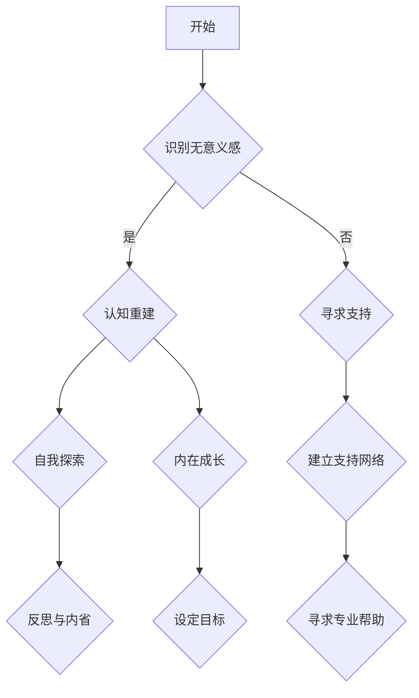

                 

## 第1章 引言：无意义感的困境与觉醒之路

### 1.1 无意义感的现状与原因

在当今社会，无意义感已成为一个普遍存在的心理健康问题。人们在高强度的工作和生活节奏下，往往感到压力重重，缺乏内心的安宁和生活的目标。这种无意义感不仅仅是一种情绪状态，更是一种心理困境，对个人的身心健康产生深远的影响。

**社会压力下的心理挑战**  

现代社会对个体提出了极高的要求。职场竞争激烈，工作压力巨大，生活节奏快速，这些都使得人们感到身心俱疲。特别是在一线城市，生活成本高、工作压力大，许多人在追求物质生活的同时，逐渐忽视了内心的需求和情感。这种外在的压力转化为内心的焦虑和无意义感，影响了人们的心理健康和生活质量。

- **高强度工作与生活节奏的加快**：现代职场中，加班已成为常态。长时间的工作和高强度的工作任务使人们无法充分休息，导致身心疲惫。同时，生活节奏的加快也使得人们没有足够的时间来关注自己的内心需求，进一步加剧了无意义感。

- **人际关系的复杂性与不确定性**：现代社会的人际关系越来越复杂，人与人之间的沟通变得越来越困难。在工作中，同事之间的关系可能因为利益冲突而变得紧张；在生活中，与家人和朋友的关系也因种种原因而变得疏离。人际关系的复杂性和不确定性使得人们感到无助和迷茫，进一步加深了无意义感。

**个人成长与自我认知的缺失**  

除了社会压力，个人的成长和自我认知也是导致无意义感的重要原因。在人生的不同阶段，人们会面临各种挑战和困惑，特别是在成年后，面临职业选择、婚姻家庭、子女教育等问题。在这个过程中，许多人会感到迷茫和困惑，不知道自己的人生方向和目标在哪里。

- **对人生意义的探索与迷茫**：许多人会思考“人生的意义是什么？”、“我为什么而活？”等问题。在寻找答案的过程中，有些人可能会陷入迷茫和困惑，无法找到自己的价值和意义。

- **对个人价值的认可与追求**：每个人都在追求自我价值的实现。但在现代社会，个人价值的认可往往与物质财富和地位挂钩，这使得许多人感到自己无法达到社会的期望，从而感到自卑和无意义。

### 1.2 无意义感的危害与影响

无意义感不仅仅是一种情绪状态，它对个人的心理健康和生活质量有着深远的影响。

**心理健康问题**  

无意义感常常伴随着一系列心理健康问题，如抑郁、焦虑等。当个体感到生活缺乏意义和价值时，他们往往会感到情绪低落、无助和绝望。这些情绪问题会影响个体的生活质量和幸福感，使他们陷入消极的情绪循环中，难以自拔。

- **抑郁**：无意义感使人感到无助和绝望，进而导致抑郁。抑郁会进一步加重无意义感，形成恶性循环。

- **焦虑**：在现代社会，焦虑已成为一种普遍的情绪问题。无意义感使人感到焦虑，担心未来和不确定性。长期的焦虑会导致身心健康问题，影响生活质量。

**人际关系问题**  

无意义感也会影响人际关系。当个体感到生活缺乏意义和价值时，他们往往会失去对生活的热情和对人际关系的兴趣。这会导致与家人、朋友的疏离，使他们感到孤独和无助。长期的人际关系紧张和冲突会进一步加剧无意义感，形成恶性循环。

- **与家人、朋友的疏离**：无意义感使人感到与家人和朋友的关系变得疏远。他们可能无法理解和分享家人的快乐和困扰，导致家庭关系的紧张和冲突。

- **人际关系紧张与冲突**：无意义感使人感到无助和迷茫，他们可能无法有效地处理人际关系中的冲突和挑战，导致人际关系紧张和冲突。

### 1.3 心灵觉醒的重要性

心灵觉醒是一种重拾生活意义和目标的过程，对个人的心理健康和生活质量有着重要的积极影响。

**重拾人生意义与目标**

通过心灵觉醒，个体可以重新审视自己的生活，找到自己的价值和意义。他们可以设定新的目标，制定行动计划，努力实现这些目标。这种过程不仅能够提高个体的生活质量和幸福感，还能增强他们的自信心和自我价值感。

- **发现并实现个人价值**：通过心灵觉醒，个体可以认识到自己的内在价值和潜力，找到适合自己的发展方向。他们可以充分发挥自己的才能，实现个人价值。

- **提升生活质量和幸福感**：当个体找到自己的生活意义和目标后，他们会更加积极地面对生活中的挑战和困难，提高生活质量和幸福感。

**提升心理韧性与抗压能力**

心灵觉醒还可以提高个体的心理韧性和抗压能力。通过自我探索和认知重建，个体可以更好地理解自己，建立积极的思维模式，提高应对挑战和困难的能力。这种心理韧性可以帮助个体在面对压力和挫折时保持冷静和理智，有效应对各种困境。

- **增强自我认知和自我调节能力**：通过心灵觉醒，个体可以更好地了解自己的情绪和心理状态，学会自我调节，保持内心的平衡和稳定。

- **提高应对挑战和困难的能力**：心灵觉醒使个体具备更强的心理韧性，能够更好地应对生活中的各种挑战和困难，保持积极的心态和行动力。

通过以上分析，我们可以看到，无意义感对个人的身心健康和生活质量有着深远的影响。因此，心灵觉醒的重要性不容忽视。在接下来的章节中，我们将深入探讨无意义感的核心概念与联系，以及如何通过自我探索、内在成长和人际关系等方式实现心灵觉醒。希望通过这一系列的探讨，能够帮助更多的人走出无意义感的困境，重拾生活的意义和目标。

### 1.4 心灵觉醒的理论基础与科学依据

心灵觉醒并非一个虚无缥缈的概念，它有着深厚的理论基础和科学依据。理解这些理论基础，有助于我们更深入地认识心灵觉醒的实质和作用。

**心理学视角**

心理学领域对心灵觉醒的研究提供了丰富的理论支持。例如，认知行为疗法（Cognitive Behavioral Therapy, CBT）是一种广泛应用于治疗情绪障碍和行为问题的心理治疗方法。CBT强调通过改变负面思维模式和行为模式来改善情绪和心理状态。这与心灵觉醒中的认知重建和思维模式的转变密切相关。

- **认知重建**：CBT中的认知重建方法帮助个体识别和纠正消极思维，建立积极的思维模式。这与心灵觉醒中的自我认知和自我调节过程相呼应，通过认知重建，个体可以更好地理解自己的情绪和心理状态，从而实现心灵觉醒。

- **行为改变**：CBT还强调行为改变的重要性。通过改变行为模式，个体可以逐步改变自己的情绪和心理状态。这可以看作是心灵觉醒中的内在成长和实践过程，通过实际行动来验证和巩固内心的觉醒。

**神经科学视角**

神经科学领域的研究进一步揭示了心灵觉醒的生理机制。例如，神经可塑性（Neuroplasticity）理论表明，大脑的结构和功能是可以随着经验和训练而改变的。这意味着，通过适当的心理训练和认知行为干预，个体可以改变自己的大脑结构和功能，从而实现心灵觉醒。

- **神经可塑性**：神经可塑性是指大脑神经元和神经网络在结构和功能上的改变。这包括突触的可塑性、神经生长因子的作用等。通过心理训练和认知行为疗法，个体可以增强神经可塑性，促进大脑结构和功能的优化，从而提高心理韧性和抗压能力。

- **大脑奖励系统**：大脑奖励系统在心灵觉醒中发挥着重要作用。研究表明，通过积极的情绪体验和成就感的获得，大脑奖励系统可以释放多巴胺等神经递质，提高个体的幸福感和满足感。这可以解释为什么通过实现个人目标和价值，个体能够感受到内心的觉醒和满足。

**哲学视角**

哲学领域对人生意义和自我认知的探讨也为心灵觉醒提供了理论基础。存在主义哲学强调个体的自由意志和自我选择，认为个体可以通过自我实现来找到生活的意义。这与心灵觉醒中的自我探索和自我实现过程密切相关。

- **存在主义哲学**：存在主义哲学认为，人生的意义并非先天赋予，而是个体通过自我选择和行动来创造和实现的。这种观点与心灵觉醒中的自我认知和自我实现相呼应，强调个体通过自我探索和实践来找到生活的意义和价值。

- **自我实现**：马斯洛（Abraham Maslow）的自我实现理论认为，个体有追求自我实现的需求，通过充分发挥自己的潜能和才能，个体可以实现自我价值。这种自我实现的过程可以看作是心灵觉醒的一部分，通过实现个人目标和价值，个体能够体验到内心的觉醒和满足。

综上所述，心灵觉醒有着丰富的理论基础和科学依据，涵盖了心理学、神经科学和哲学等多个领域。通过理解这些理论基础，我们可以更深入地认识心灵觉醒的实质和作用，从而更有效地实现心灵的觉醒。

### 1.5 心灵觉醒的实践意义与现实价值

心灵觉醒不仅在理论上具有重要意义，更在实践中展现出显著的积极影响。通过心灵觉醒，个体可以显著提升生活质量，增强心理韧性和抗压能力，实现个人成长和全面发展。

**提升生活质量**

心灵觉醒可以帮助个体重拾生活的目标和动力，从而提升生活质量。通过自我认知和内在成长，个体能够更好地理解自己的需求和愿望，从而设定切实可行的目标，并采取行动去实现这些目标。这种积极的生活方式不仅能够提高个体的幸福感，还能增强他们在面对生活挑战时的适应能力和应对策略。

- **建立目标感**：当个体明确自己的目标并为之努力时，他们会感到更加有方向和意义。这种目标感可以激发个体的内在动力，使他们更加专注于实现自己的目标。

- **增强生活满意度**：通过实现个人目标和价值，个体能够体验到成就感和满足感，从而提高生活满意度。这种满足感来自于内心的觉醒和对生活的深刻理解。

**增强心理韧性和抗压能力**

心理韧性和抗压能力是现代社会中个体必须具备的重要能力。心灵觉醒通过自我探索和认知重建，帮助个体建立积极的思维模式和情感调节能力，从而提高心理韧性。在面对压力和挫折时，具备心理韧性的人能够保持冷静和理智，采取有效的方法应对困境。

- **积极的思维模式**：通过认知重建，个体可以学会用积极的视角看待生活中的挑战和困难，从而减少负面情绪的影响。

- **情感调节能力**：心灵觉醒使个体能够更好地理解和调节自己的情绪，避免情绪的过度波动，保持内心的平静和稳定。

**实现个人成长和全面发展**

心灵觉醒不仅仅是一种心理健康策略，它更是一种个人成长和全面发展的途径。通过自我探索和内在成长，个体可以深入认识自己，发现并实现自己的潜能和才能。这种个人成长不仅能够提高个体的职业能力和生活质量，还能为他们带来更丰富和有意义的人生体验。

- **职业发展**：通过心灵觉醒，个体能够更好地理解自己的职业兴趣和优势，从而在职业生涯中找到适合自己的发展方向，实现职业成就。

- **人际关系**：心灵觉醒使个体具备更好的沟通和人际交往能力，能够建立和维护良好的人际关系，增强社会支持网络。

综上所述，心灵觉醒在提升生活质量、增强心理韧性和抗压能力、实现个人成长和全面发展等方面具有显著的实践意义和现实价值。通过心灵的觉醒，个体不仅能够改善自己的心理状态，还能实现更丰富和有意义的人生。因此，心灵觉醒值得我们深入探索和实践，以实现个人的全面发展和社会的和谐进步。

### 1.6 心灵觉醒的路径与方法

实现心灵觉醒并非一蹴而就，它需要个体采取一系列的路径和方法，逐步克服内心的迷茫和无意义感。以下是一些具体的路径和方法，可以帮助个体踏上心灵觉醒的旅程。

**自我探索**  

自我探索是心灵觉醒的第一步。通过反思和内省，个体可以更好地理解自己的内心世界和情感状态。这包括回顾自己的生活经历、思考自己的价值观和信念系统，以及识别自己的情绪和行为模式。

- **定期反思**：定期花时间反思自己的生活，记录内心的感受和体验。这种反思可以帮助个体发现生活中的问题和矛盾，从而找到解决问题的方法。

- **自我提问**：通过提出一些深入的问题，如“我的生活目标是什么？”、“我对自己的价值观有何认识？”等，个体可以更清晰地认识自己，找到内心的困惑和迷茫。

**认知重建**  

认知重建是心灵觉醒的核心步骤。它涉及到识别和纠正消极思维模式，建立积极的思维习惯。通过认知重建，个体可以改变自己对生活的看法，从而减少负面情绪的影响，增强心理韧性。

- **认知行为疗法**：认知行为疗法（CBT）是一种有效的认知重建方法。通过认知重构技术，个体可以学会识别和纠正自己的消极思维，建立积极的思维模式。

- **自我激励**：通过积极的自我激励，个体可以增强自己的内在动力，设定切实可行的目标，并采取行动去实现这些目标。

**内在成长**  

内在成长是心灵觉醒的重要一环。它包括培养内心的力量和韧性，以及实现个人目标和价值。通过内在成长，个体可以提升自己的心理素质和情感智慧，更好地应对生活中的挑战和困难。

- **自我成长计划**：制定一个自我成长计划，包括阅读有益的书籍、参加培训课程、培养新的兴趣和爱好等。这些活动可以帮助个体不断提升自己的内在力量。

- **实现个人目标**：设定具体的目标，并制定行动计划去实现这些目标。通过实现个人目标，个体可以感受到成就感和满足感，进一步增强内心的力量。

**人际关系与社交支持**  

人际关系和社交支持在心灵觉醒中起着至关重要的作用。通过与家人、朋友和专业人士建立良好的关系，个体可以获得情感上的支持和帮助，从而更好地应对内心的迷茫和无意义感。

- **建立支持网络**：建立和维护一个支持网络，包括家人、朋友和专业人士。这些人在个体遇到困难和挑战时可以提供帮助和鼓励。

- **寻求专业帮助**：如果内心的迷茫和无意义感严重影响了生活质量，可以考虑寻求专业心理咨询师的帮助。通过专业的指导和干预，个体可以更快地实现心灵觉醒。

通过以上路径和方法，个体可以逐步实现心灵觉醒，重拾生活的意义和目标。每个人的心灵觉醒之路都是独一无二的，但通过不断的自我探索和成长，每个人都可以找到属于自己的心灵觉醒之道。

### 1.7 总结与展望

在第一章中，我们深入探讨了无意义感的困境与觉醒之路。从社会压力下的心理挑战到个人成长与自我认知的缺失，无意义感已经成为现代社会中普遍存在的心理健康问题。它不仅对个体的心理健康产生负面影响，还影响人际关系和生活质量。然而，心灵觉醒的重要性不可忽视。通过重拾人生意义与目标，提升心理韧性与抗压能力，心灵觉醒为个体提供了走出困境的路径。

在接下来的章节中，我们将进一步探讨无意义感的核心概念与联系，揭示其背后的心理学、神经科学和哲学理论基础。此外，我们还将介绍具体的方法和路径，帮助个体实现心灵觉醒。希望通过这一系列的探讨，能够为更多人提供有价值的指导，帮助他们在心灵觉醒的道路上取得进步。

### 第2章 无意义感的核心概念与联系

在第一章中，我们初步了解了无意义感的困境与觉醒之路。在这一章中，我们将深入探讨无意义感的核心概念与联系，从定义、属性特征、与心理健康的关系以及分类和类型等方面进行详细阐述。

#### 2.1 无意义感的定义与属性特征

**定义**：

无意义感（Sense of Meaninglessness）是指个体在生活中感到缺乏意义和价值的一种心理状态。这种感觉可能源于对生活目标的不明确、对生活意义的质疑，或者对自身存在价值的疑惑。无意义感通常伴随着情绪低落、迷茫和无助等负面情绪。

**属性特征**：

无意义感具有以下几方面的属性特征：

1. **情绪低落**：个体常常感到情绪低落，缺乏活力和动力。这种情绪状态会影响到他们的日常生活和工作表现。
2. **迷茫**：无意义感使人感到迷茫，不知道自己生活的方向和目标在哪里，导致他们在决策时犹豫不决。
3. **无助**：个体在感到无意义时，往往觉得自己无法改变现状，缺乏解决问题的能力和信心。
4. **缺乏动机和目标**：无意义感使人感到缺乏动机和目标，无法找到驱动自己前进的力量和理由。

#### 2.2 无意义感与心理健康的关系

无意义感与心理健康之间存在密切的联系。研究表明，无意义感是心理健康问题的重要指标，与多种心理问题密切相关。

1. **心理健康问题**：无意义感常常伴随着抑郁、焦虑等心理健康问题。当个体感到生活缺乏意义和价值时，他们更容易陷入情绪低落和焦虑的状态，甚至可能发展成抑郁症。

2. **心理健康的影响**：无意义感不仅影响个体的情绪状态，还可能影响他们的生理健康。长期的负面情绪可能导致免疫系统功能下降，增加患病的风险。

3. **心理韧性的削弱**：无意义感削弱了个体的心理韧性，使他们更容易受到生活中的压力和挑战的影响。缺乏心理韧性可能导致他们在面对困境时缺乏应对策略和适应能力。

#### 2.3 无意义感的分类与类型

无意义感可以根据不同的原因和表现形式进行分类。以下是一些常见的分类和类型：

1. **存在主义无意义感**：

   存在主义无意义感源于对生命本质的探索和困惑。这种无意义感通常与个体的哲学思考、宗教信仰和个人价值观有关。存在主义无意义感使人质疑生命的意义和目的，感到自己在宇宙中的孤独和无助。

2. **心理压力导致的无意义感**：

   心理压力导致的无意义感通常与个体面临的生活压力和挑战有关。当个体在职场、家庭或人际关系中面临巨大的压力时，他们可能会感到生活缺乏意义和价值，从而产生无意义感。

3. **角色冲突导致的无意义感**：

   角色冲突导致的无意义感通常发生在个体在不同的角色之间难以平衡时。例如，一个人在职场和家庭之间难以找到平衡，可能会导致他们感到生活缺乏意义和价值。

4. **价值观矛盾导致的无意义感**：

   价值观矛盾导致的无意义感通常发生在个体的行为和价值观之间存在冲突时。例如，一个追求物质成功的人可能在追求过程中感到内心空虚和迷茫，从而产生无意义感。

通过以上对无意义感核心概念和联系的分析，我们可以更深入地理解这一心理现象。在接下来的章节中，我们将继续探讨如何通过自我探索、认知重建和内在成长等方法实现心灵觉醒，帮助个体走出无意义感的困境。

### 2.4 无意义感的分类与类型（续）

#### 2.4.1 心理健康问题与无意义感的关系

无意义感不仅是心理健康问题的一个表现，它本身也可能成为心理健康问题的原因。以下是心理健康问题与无意义感之间的相互关系：

1. **抑郁与无意义感**：

   抑郁症是一种常见的心理健康问题，其症状包括情绪低落、兴趣丧失、自我评价过低等。许多抑郁症患者会感到生活缺乏意义和价值，这种无意义感加剧了他们的抑郁症状。同时，无意义感也可能导致个体陷入抑郁，形成恶性循环。

2. **焦虑与无意义感**：

   焦虑症是另一种常见的心理健康问题，其症状包括持续的紧张和忧虑。焦虑症患者常常担心未来的不确定性，他们可能会感到生活缺乏意义和价值，从而加重焦虑情绪。

3. **双相情感障碍与无意义感**：

   双相情感障碍是一种情感波动较大的心理健康问题，包括抑郁和躁狂两个阶段。在抑郁阶段，患者可能会感到生活缺乏意义和价值，而在躁狂阶段，他们可能会感到过度兴奋和无意义感。

4. **边缘型人格障碍与无意义感**：

   边缘型人格障碍是一种以情感不稳定、人际关系问题为特征的心理健康问题。边缘型人格障碍患者常常感到内心的空虚和无意义感，这种无意义感可能导致他们陷入自我破坏的行为和人际关系冲突。

#### 2.4.2 无意义感对心理健康的影响

无意义感对心理健康的影响是多方面的，以下是一些具体的影响：

1. **生活满意度降低**：

   感到生活缺乏意义和价值的个体往往对生活满意度较低。他们可能无法体验到生活中的乐趣和快乐，导致整体生活质量的下降。

2. **工作与学业表现下降**：

   无意义感会影响个体的工作动机和学业动力，导致他们在工作或学习上的表现下降。长期的无意义感可能导致职业发展受阻或学业成绩下降。

3. **社交能力受损**：

   感到生活缺乏意义的个体可能会减少与他人的互动，导致社交能力受损。长期的孤立感会进一步加重无意义感，形成恶性循环。

4. **生理健康问题**：

   持续的无意义感可能导致个体出现一系列生理健康问题，如失眠、食欲不振、头痛和身体疼痛等。长期的负面情绪状态会增加患病的风险，影响整体健康。

通过以上对无意义感与心理健康关系的分析，我们可以看到，无意义感不仅是一个心理问题，它对个体的身心健康都有深远的影响。因此，理解无意义感与心理健康之间的相互作用对于制定有效的心理健康干预措施至关重要。在接下来的章节中，我们将进一步探讨如何通过认知行为疗法、内在成长和社交支持等方法来应对和减轻无意义感，促进个体心理健康。

### 2.5 无意义感的分类与类型（续）

#### 2.5.1 无意义感的心理社会因素分析

无意义感的产生往往受到心理和社会因素的共同影响。以下是一些主要的心理社会因素：

1. **心理因素**：

   - **自我认知不足**：个体可能无法准确地认识到自己的优点和潜力，导致自我价值感低落。自我认知不足往往使个体在面对挑战和失败时感到更加无意义。
   - **负面思维模式**：长期存在负面思维模式的个体，如自我否定、过度自我批评等，容易感到生活缺乏意义和价值。
   - **情绪调节困难**：个体在情绪调节方面存在困难，可能会在面临压力和挫折时感到更加无助和迷茫。

2. **社会因素**：

   - **社会压力**：现代社会的高竞争性和快节奏生活给个体带来巨大的压力，这种压力可能导致个体感到无意义。特别是在职业、家庭和社会角色中，个体可能会因为无法达到社会的期望而感到挫败。
   - **人际关系冲突**：人际关系的不和谐，如家庭矛盾、友谊破裂等，可能导致个体感到孤独和无意义。缺乏亲密的人际关系支持也会加重个体的无意义感。
   - **文化背景**：不同的文化背景和社会价值观对个体的意义感和价值观有重要影响。一些社会文化可能更强调物质成就和社会地位，这可能导致个体在追求这些目标时感到内心的空虚和无意义。

#### 2.5.2 无意义感的症状表现与干预方法

无意义感在不同个体中可能表现出不同的症状，以下是一些常见的症状及其对应的干预方法：

1. **情绪症状**：

   - **情绪低落**：个体可能持续感到情绪低落、无精打采。  
     **干预方法**：认知行为疗法（CBT）可以帮助个体识别和纠正消极思维，建立积极的思维模式。

   - **焦虑**：个体可能会因为对未来的不确定性而感到焦虑。  
     **干预方法**：焦虑管理技巧和放松训练，如深呼吸、冥想等，可以帮助个体缓解焦虑情绪。

2. **行为症状**：

   - **缺乏动机**：个体可能会感到缺乏动力，对工作、学习和兴趣爱好失去兴趣。  
     **干预方法**：制定具体的行动计划和目标，逐步实现小目标，增加个体的成就感和动力。

   - **社交回避**：个体可能会减少与他人的交往，避免社交活动。  
     **干预方法**：逐步增加社交活动的时间，通过小组活动或社交技能训练来提高社交能力。

3. **认知症状**：

   - **自我怀疑**：个体可能会对自己的能力和价值产生怀疑，感到自卑和无助。  
     **干预方法**：通过自我认知和自我肯定练习，帮助个体建立积极的自我形象。

   - **认知混乱**：个体可能会感到思维混乱，难以集中注意力。  
     **干预方法**：认知行为疗法（CBT）可以帮助个体重新组织思维，提高注意力集中能力。

通过以上对无意义感心理社会因素和症状表现的详细分析，我们可以更全面地理解无意义感的本质和影响。同时，了解相应的干预方法也为个体提供了有效的应对策略，帮助他们走出无意义感的困境。在接下来的章节中，我们将继续探讨如何通过自我探索、认知重建和内在成长等具体方法，实现心灵觉醒，重拾生活的意义和目标。

### 2.6 无意义感的类型与特征分析

无意义感并非单一的现象，它有多种不同的类型和表现形式。理解这些类型及其特征有助于我们更准确地识别和应对这一问题。

#### 2.6.1 存在主义无意义感

存在主义无意义感通常源于对生命本质的深刻思考和对存在意义的质疑。这种无意义感与个体的哲学思考、宗教信仰和个人价值观紧密相关。

**特征**：

- **对生命意义的探讨**：存在主义无意义感的个体常常思考“生命的意义是什么？”、“我们为什么存在？”等问题。
- **孤独感**：由于对生命意义的质疑，这些个体可能会感到在宇宙中孤独无助。
- **哲学反思**：这类个体可能会深入研究哲学、宗教等领域的知识，寻求生命的意义。

**案例**：

哲学家尼采（Friedrich Nietzsche）在其著作中探讨了存在主义无意义感，他提出了“上帝已死”的观点，认为在上帝消失之后，人类面临虚无和不确定性，这可能导致无意义感的产生。

#### 2.6.2 心理压力导致的无意义感

心理压力导致的无意义感通常与个体面临的生活压力和挑战有关。这种类型的无意义感常见于高压工作环境、家庭冲突和人际关系紧张等情境中。

**特征**：

- **应对压力的能力不足**：个体在面对压力时，可能感到无法应对，从而感到无意义。
- **焦虑和紧张**：长期的心理压力可能导致个体感到焦虑和紧张，进一步加剧无意义感。
- **缺乏成就感和满足感**：在高压环境中，个体可能难以实现自己的目标和期望，导致他们感到生活缺乏意义。

**案例**：

一位在高科技公司工作的程序员，由于工作压力巨大，经常加班，导致他感到生活缺乏意义和价值，甚至对工作产生了厌恶情绪。

#### 2.6.3 角色冲突导致的无意义感

角色冲突导致的无意义感通常发生在个体在不同角色之间难以平衡时。例如，一个人在职场和家庭之间难以找到平衡，可能会导致他们感到生活缺乏意义和价值。

**特征**：

- **角色不清晰**：个体可能在不同的角色（如父母、员工、朋友等）之间感到困惑，不知道自己在每个角色中应该如何表现。
- **角色冲突**：当角色之间的期望和要求发生冲突时，个体可能会感到矛盾和困惑，从而产生无意义感。
- **心理压力**：角色冲突可能导致个体面临额外的心理压力，进一步加剧无意义感。

**案例**：

一位同时担任职场高管和单亲父母的女性，由于无法平衡工作和家庭责任，感到压力巨大，逐渐对工作和家庭都失去了兴趣，产生了无意义感。

#### 2.6.4 价值观矛盾导致的无意义感

价值观矛盾导致的无意义感通常发生在个体的行为和价值观之间存在冲突时。例如，一个追求物质成功的人可能在追求过程中感到内心空虚和迷茫，从而产生无意义感。

**特征**：

- **价值观不明确**：个体可能在追求物质成功的过程中，感到价值观模糊或不明确。
- **内心空虚**：追求物质成功的过程中，个体可能忽视内心的需求和情感，导致内心空虚和无意义。
- **自我否定**：当个体的行为与自己的价值观相悖时，他们可能会产生自我否定的情绪，感到无意义。

**案例**：

一位追求高薪职位的商业人士，在工作中取得了巨大的成功，但与此同时，他感到内心的空虚和迷茫，不知道自己追求的究竟是什么，导致他产生了无意义感。

通过以上对无意义感不同类型及其特征的分析，我们可以更深入地理解这一心理现象。不同的类型和特征反映了无意义感背后的复杂心理和社会因素。了解这些类型和特征有助于个体和专业人士更好地识别和应对无意义感，从而实现心灵的觉醒和成长。

### 第3章 心灵觉醒的方法与路径

在前两章中，我们深入探讨了无意义感的困境和核心概念。在这一章中，我们将详细介绍实现心灵觉醒的具体方法和路径，帮助个体走出无意义感的阴影，重拾生活的意义和目标。

#### 3.1 自我探索与认知重建

**自我探索**是心灵觉醒的第一步。通过自我探索，个体可以更深入地了解自己的内心世界，找到无意义感的根源。

1. **反思与内省**：
   - **定期反思**：每天花一些时间反思自己的生活、行为和感受，记录下内心的真实想法和情感。
   - **内省**：通过内省，个体可以识别出内心的冲突和困惑，找到问题的症结所在。

2. **自我认知**：
   - **识别自己的优点和缺点**：了解自己的长处和短处，可以帮助个体更好地认识自己，找到适合自己的发展方向。
   - **价值观和信念系统**：深入思考自己的价值观和信念系统，了解它们对自己的行为和决策有何影响。

**认知重建**是在自我探索的基础上，通过改变思维模式和认知结构来重建积极的内心世界。

1. **认知行为疗法（CBT）**：
   - **识别消极思维**：通过认知行为疗法，个体可以学会识别和纠正自己消极的思维模式，如自我否定、过度担忧等。
   - **建立积极思维**：通过认知重构技术，个体可以建立积极的思维模式，如感恩、积极展望等。

2. **认知重构技术**：
   - **辩证思维**：学会辩证地看待生活中的问题和挑战，避免陷入极端的思维模式。
   - **积极思考**：通过积极思考，个体可以更好地应对生活中的困难，保持积极的心态。

#### 3.2 内在成长与自我实现

**内在成长**是指个体通过培养内在的力量和韧性来实现自我价值的过程。

1. **自我成长计划**：
   - **设定目标**：制定一个具体的自我成长计划，包括短期和长期目标，以及实现这些目标的步骤和策略。
   - **持续学习**：通过阅读、学习新技能和知识，不断提升自己的内在力量和知识储备。

2. **自我实现**：
   - **实现个人目标**：通过实现个人目标和价值，个体可以感受到成就感和满足感，进一步增强内心的力量。
   - **发挥潜能**：发现并发挥自己的潜能，通过创造性思维和行动实现自我价值。

#### 3.3 人际关系与社交支持

**人际关系**和**社交支持**在心灵觉醒中起着至关重要的作用。通过建立和维护良好的人际关系，个体可以获得情感上的支持和帮助，从而更好地应对内心的迷茫和无意义感。

1. **建立支持网络**：
   - **与家人和朋友保持联系**：通过定期的沟通和互动，与家人和朋友保持紧密的联系，获得情感上的支持。
   - **加入社交团体**：参加兴趣小组或社交活动，结识新的朋友，扩大社交圈子。

2. **寻求专业帮助**：
   - **心理咨询**：如果内心的迷茫和无意义感严重影响了生活质量，可以考虑寻求专业心理咨询师的帮助。
   - **心理治疗**：通过心理治疗，个体可以更深入地了解自己的内心世界，学会应对压力和挑战的策略。

#### 3.4 心灵觉醒的实践与反思

**实践**是实现心灵觉醒的关键。通过具体的行动和体验，个体可以逐步实现内心的觉醒和成长。

1. **尝试新事物**：
   - **探索兴趣和爱好**：尝试新的活动和兴趣爱好，通过探索和体验找到内心的热情和动力。
   - **挑战自我**：设定具体的目标和挑战，通过努力和坚持实现这些目标，提升自我效能感。

2. **反思与总结**：
   - **记录成长过程**：定期记录自己的成长过程和体验，总结成功和失败的经验教训，为下一步的成长提供参考。
   - **自我反思**：通过自我反思，个体可以更好地了解自己的内心需求和成长方向，从而调整和优化自己的行动计划。

通过自我探索、认知重建、内在成长、人际关系与社交支持，以及实践和反思，个体可以逐步实现心灵觉醒，走出无意义感的困境，重拾生活的意义和目标。在接下来的章节中，我们将通过具体的实践案例，进一步探讨如何运用这些方法和路径，帮助个体实现心灵的觉醒和成长。

### 3.5 心灵觉醒中的关键技术与策略

实现心灵觉醒并非一蹴而就，需要个体运用一系列关键技术与策略，逐步克服内心的迷茫和无意义感。以下是一些具体的方法和技术，可以帮助个体踏上心灵觉醒的旅程。

**1. 睡眠管理**

睡眠是心灵觉醒的重要基础。良好的睡眠有助于恢复精力，提高注意力和情绪调节能力。

- **策略**：确保每天充足的睡眠时间，保持规律的作息时间，避免晚上使用电子设备，以减少蓝光对睡眠的影响。
- **技术**：使用睡眠监测设备，如智能手环或睡眠追踪应用程序，了解自己的睡眠质量和规律，及时调整睡眠习惯。

**2. 冥想与正念**

冥想和正念练习有助于个体培养专注力和情绪调节能力，增强内心的平静和宁静。

- **策略**：每天花10-15分钟进行冥想，选择一个安静的环境，专注于呼吸或某个物体，避免分散注意力。
- **技术**：通过冥想应用程序或在线课程，学习不同的冥想和正念练习，如呼吸冥想、身体扫描等。

**3. 认知行为疗法（CBT）**

认知行为疗法（CBT）是一种有效的心理治疗方法，通过识别和纠正消极思维模式，建立积极的思维模式，帮助个体克服无意义感。

- **策略**：定期进行自我反思，识别并记录消极思维，学会用积极的视角重新评估和解释生活中的事件。
- **技术**：通过参加CBT工作坊或在线课程，学习认知重构技术，如认知解离、积极思维练习等。

**4. 目标设定与时间管理**

设定具体的目标并有效管理时间，有助于个体保持动力和方向，实现个人成长。

- **策略**：制定SMART目标（具体、可衡量、可实现、相关、时限性），将大目标分解为小目标，逐步实现。
- **技术**：使用时间管理工具，如待办事项清单、时间跟踪应用程序，合理安排时间和任务。

**5. 社交支持与心理健康咨询**

建立良好的社交关系和寻求专业心理健康咨询，有助于个体获得情感支持和专业指导，更好地应对内心的迷茫和无意义感。

- **策略**：与家人、朋友保持密切联系，参加社交活动，建立和维护支持网络。
- **技术**：寻求专业心理咨询师的帮助，进行定期心理咨询，探讨内心的困惑和挑战。

**6. 充电与自我提升**

通过不断学习和探索新事物，个体可以保持内心的活力和动力，实现自我价值。

- **策略**：定期阅读有益的书籍、参加培训课程、培养新技能和兴趣爱好。
- **技术**：利用在线学习平台，如Coursera、Udemy等，学习各种领域的知识和技能。

通过运用以上关键技术与策略，个体可以逐步实现心灵觉醒，重拾生活的意义和目标。在接下来的章节中，我们将通过具体实践案例，进一步探讨这些策略在实际生活中的应用和效果。

### 3.6 心灵觉醒的最佳实践与案例分析

**1. 案例一：职场人士的心灵觉醒**

**背景**：小明是一名互联网公司的项目经理，工作压力大，经常加班。随着时间的推移，他开始感到工作缺乏意义，对生活失去热情。

**解决方案**：

- **自我探索**：小明开始记录每天的生活和工作情况，识别自己的负面情绪和思维模式。
- **认知重建**：通过阅读心理学书籍和参加认知行为疗法（CBT）课程，小明学会了识别和纠正消极思维，建立积极的思维模式。
- **内在成长**：小明设定了个人成长目标，包括学习新的技能和兴趣爱好，如绘画和瑜伽。

**结果**：经过一段时间的努力，小明的情绪状态得到了显著改善，他重新找到了工作的意义和热情，生活质量也显著提高。

**2. 案例二：职场母亲的心灵觉醒**

**背景**：小李是一位全职母亲，承担了家庭的主要家务和育儿责任。随着时间的推移，她开始感到自己被家庭束缚，缺乏自我价值感。

**解决方案**：

- **自我探索**：小李开始花时间反思自己的内心需求和价值观，识别自己的困惑和不安。
- **社交支持**：小李与朋友和社区的母亲建立了联系，参加了一些妈妈互助小组，获得了情感支持和建议。
- **内在成长**：小李设定了个人成长目标，包括重新学习职业技能和培养新的兴趣爱好。

**结果**：通过建立支持网络和实现个人目标，小李重拾了自我价值感，家庭和生活的平衡也得到了改善。

**3. 案例三：年轻人的人生意义探索**

**背景**：小张是一名刚毕业的大学生，对未来充满迷茫，不知道自己的职业方向和人生目标。

**解决方案**：

- **自我探索**：小张通过参加职业规划课程和心理咨询，深入了解了自身的兴趣和优势，明确了职业发展方向。
- **内在成长**：小张设定了职业和个人成长目标，包括参加实习、学习新技能和培养兴趣爱好。
- **社会实践**：小张积极参与社会实践和志愿活动，通过实际行动验证自己的职业兴趣和价值观。

**结果**：通过自我探索和实践，小张找到了自己的人生方向和目标，职业发展和生活满意度显著提高。

这些案例展示了不同个体在面对无意义感时，通过自我探索、认知重建、内在成长和社交支持等策略，成功实现心灵觉醒的过程。他们的经验和教训为更多人提供了有价值的启示，帮助他们在心灵觉醒的道路上取得进步。

### 3.7 心灵觉醒的障碍与挑战及解决方案

在心灵觉醒的道路上，个体往往会遇到各种障碍和挑战。以下是一些常见的障碍及其相应的解决方案：

#### 1. 内心抵触

许多人在面对无意义感时，可能因为内心的抵触而不愿意进行自我探索和认知重建。这种抵触可能源于恐惧、不安或对未知的担忧。

**解决方案**：

- **逐步探索**：避免一次性尝试过多的改变，可以从小步骤开始，如每天花几分钟时间进行反思或冥想。
- **寻求支持**：与亲友、心理咨询师或专业团体分享自己的感受和困惑，获得情感支持和建议。

#### 2. 时间压力

在现代社会中，人们常常面临时间压力，很难抽出时间进行自我探索和内在成长。

**解决方案**：

- **时间管理**：合理安排时间，设定优先级，确保有足够的时间用于自我成长和心灵觉醒。
- **利用碎片时间**：在等待、通勤等碎片化时间内，阅读书籍、听有声书或进行简短的冥想。

#### 3. 缺乏动力

在心灵觉醒的过程中，个体可能会感到缺乏动力，难以坚持改变。

**解决方案**：

- **设定明确目标**：设定具体的、可实现的目标，为自我成长提供明确的方向和动力。
- **奖励机制**：为自己设定奖励，当实现小目标时，给予自己一些奖励，如看一场电影、购买心仪的物品等。

#### 4. 恐惧与焦虑

面对未知的挑战和变化，个体可能会产生恐惧和焦虑，影响心灵觉醒的进程。

**解决方案**：

- **逐步面对**：通过逐步暴露自己于恐惧情境，逐步减少恐惧和焦虑的影响。
- **情绪调节**：学习情绪调节技巧，如深呼吸、冥想和正念练习，帮助自己更好地应对恐惧和焦虑。

通过了解和应对这些障碍和挑战，个体可以更好地克服心灵觉醒过程中的困难，实现内心的觉醒和成长。

### 3.8 心灵觉醒的最佳实践与注意事项

#### 3.8.1 最佳实践

1. **自我反思**：定期花时间进行自我反思，记录内心感受和体验，识别和纠正消极思维。
2. **目标设定**：设定具体、可衡量、可实现、相关和时限性的目标，逐步实现个人成长。
3. **学习与成长**：不断学习新知识和技能，提升自身能力和内在力量。
4. **情绪调节**：学会情绪调节技巧，如深呼吸、冥想和正念练习，保持心理平衡。
5. **建立支持网络**：与家人、朋友和专业人士建立良好的关系，获得情感支持和建议。

#### 3.8.2 注意事项

1. **避免过度自我压力**：在追求心灵觉醒的过程中，避免给自己过度的心理压力，以免产生反效果。
2. **保持平衡**：在自我探索和内在成长的同时，保持工作和生活的平衡，避免过度牺牲其他方面。
3. **适应过程**：理解心灵觉醒是一个长期的过程，需要耐心和坚持，不要期望一蹴而就。
4. **寻求专业帮助**：在遇到困难和挑战时，不要犹豫寻求专业心理咨询师的帮助，以获得更有效的指导和支持。

通过遵循这些最佳实践和注意事项，个体可以更有效地实现心灵觉醒，提升生活质量和幸福感。

### 第4章 实践案例：从无意义感中觉醒

在本章中，我们将通过一个具体案例，详细描述一个人如何从无意义感中觉醒，实现心理和情感上的转变。这个案例不仅展示了心灵觉醒的实践路径，也为其他人提供了借鉴和启示。

#### 4.1 案例背景

李明，一位35岁的软件开发工程师，在一家知名互联网公司工作。他每天面对着高强度的工作压力和复杂的编码任务，工作环境竞争激烈。随着工作年限的增加，李明逐渐感到生活缺乏意义，工作变得枯燥乏味。他的情绪开始低落，对未来的不确定性感到焦虑，甚至开始质疑自己存在的价值。最终，李明陷入了无意义感的困境。

#### 4.2 案例分析

李明的无意义感主要源于以下几个方面：

1. **职业压力**：长期处于高压工作环境中，李明感到身心疲惫，对工作失去了热情和动力。
2. **自我认知缺失**：李明在职业发展中遇到了瓶颈，无法找到自我实现的价值和意义，对自己的未来感到迷茫。
3. **社交隔离**：由于工作繁忙，李明与家人和朋友的交流时间减少，社交网络逐渐缩小，导致孤独感和无助感加剧。

为了帮助李明走出无意义感的困境，我们可以采取以下步骤：

1. **自我探索**：李明开始进行自我探索，反思自己的职业选择和生活目标。他通过记录日记和定期反思，识别自己的内心需求和情感状态。
2. **认知重建**：李明学习了认知行为疗法（CBT）的技术，通过认知重构逐步改变自己的消极思维，建立积极的思维模式。
3. **内在成长**：李明设定了新的个人成长目标，包括学习新的编程技能、培养兴趣爱好，如摄影和旅行。
4. **社交支持**：李明积极参加社交活动，与同事和朋友建立更紧密的联系，扩大自己的社交网络。

#### 4.3 案例实施

1. **自我探索**：

   - 李明每天晚上花30分钟进行自我反思，记录自己的情绪变化和内心感受。
   - 通过反思，李明意识到自己对工作失去了热情，但对技术和创新有着浓厚的兴趣。

2. **认知重建**：

   - 李明通过阅读相关书籍和参加认知行为疗法课程，学会了识别和纠正消极思维。
   - 他开始用积极的视角看待工作挑战，把问题视为成长和学习的机会。

3. **内在成长**：

   - 李明设定了学习新的编程技能和培养摄影爱好的目标。
   - 他利用业余时间参加编程培训和摄影课程，不断提升自己的技能。

4. **社交支持**：

   - 李明开始积极参加公司组织的社交活动和户外运动，与同事建立了良好的关系。
   - 他还加入了摄影爱好者的社群，通过分享作品和交流经验，扩大了自己的社交网络。

#### 4.4 案例结果

经过一段时间的实践，李明取得了显著的变化：

1. **情绪改善**：李明的情绪状态得到了显著改善，焦虑和抑郁症状减轻，他对生活充满了希望和热情。

2. **职业动力增强**：李明通过学习新的编程技能，重新找到了工作的意义和动力，工作效率和职业满意度显著提高。

3. **社交网络扩大**：李明的社交网络得到了扩大，他与家人和朋友的关系更加紧密，社交支持网络为他提供了情感上的支持和建议。

4. **个人成长**：李明通过实现个人目标和兴趣爱好，提升了自我价值感，他开始享受生活，对未来充满期待。

#### 4.5 案例总结

李明的案例展示了从无意义感中觉醒的实践路径和成果。通过自我探索、认知重建、内在成长和社交支持，他成功走出了心理困境，重拾生活的意义和目标。以下是一些关键的经验教训：

1. **自我反思**：自我反思是识别内心需求和情感状态的重要步骤，有助于找到无意义感的根源。
2. **积极思维**：通过认知重建，改变消极思维模式，建立积极的思维模式，有助于改善情绪状态。
3. **持续成长**：设定个人成长目标，通过学习和培养兴趣爱好，提升自我价值感和生活质量。
4. **社交支持**：建立和维护良好的社交关系，获得情感支持和建议，有助于增强心理韧性和抗压能力。

李明的案例为我们提供了宝贵的经验和启示，鼓励我们在面对无意义感时，积极寻求解决方案，实现内心的觉醒和成长。

### 4.6 实践过程中的心得体会与经验教训

李明的实践过程充满了挑战和收获，通过这一过程，他不仅成功地走出了无意义感的困境，还积累了许多宝贵的心得体会和经验教训。

**1. 自我认知的重要性**

李明在自我探索的过程中，逐渐认识到自我认知的重要性。通过反思和内省，他能够更清楚地了解自己的情绪变化和内心需求，从而找到无意义感的根源。他发现，只有真正了解自己，才能有针对性地进行改变。

**2. 积极思维的必要性**

在认知重建过程中，李明学会了用积极的视角看待生活中的挑战和困难。他意识到，消极思维不仅无法解决问题，反而会加重负面情绪。通过积极思维的练习，他逐渐摆脱了情绪低落的状态，情绪状态得到了显著改善。

**3. 持续成长的动力**

李明在设定个人成长目标后，通过学习新技能和培养兴趣爱好，找到了持续成长的动力。他发现，实现个人目标和价值不仅能提升自我价值感，还能增强对生活的热情。这种动力使他能够克服实践过程中的困难和挫折。

**4. 社交支持的力量**

在实践过程中，李明深刻体会到社交支持的重要性。通过与家人、朋友和同事建立良好的关系，他获得了情感上的支持和建议。这种支持不仅帮助他度过了心理困境，还增强了他的心理韧性和抗压能力。

**5. 适应过程的理解**

李明认识到，心灵觉醒是一个长期的过程，需要耐心和坚持。在实践过程中，他遇到了许多困难和挑战，但他通过不断调整自己的心态和方法，逐步克服了这些障碍。他明白，适应过程本身就是一种成长和进步。

**6. 专业帮助的必要性**

在实践过程中，李明意识到，寻求专业帮助是解决心理困境的重要途径。通过参加认知行为疗法课程和咨询，他获得了专业的指导和支持，这使他的实践过程更加有效和顺利。

通过李明的实践案例，我们可以看到，自我认知、积极思维、持续成长、社交支持、适应过程和专业帮助是走出无意义感困境的重要步骤。这些经验和教训为我们提供了宝贵的启示，鼓励我们在面对类似困境时，积极采取行动，实现内心的觉醒和成长。

### 4.7 案例总结与启示

通过李明的实践案例，我们可以看到，从无意义感中觉醒并非遥不可及，而是一个可以通过自我探索、认知重建、内在成长和社交支持逐步实现的过程。以下是案例总结与启示：

**1. 自我认知与反思的重要性**

自我认知是心灵觉醒的第一步。通过反思和内省，个体可以深入了解自己的内心世界，找到无意义感的根源。这种自我认知有助于个体更好地认识自己，明确自己的需求和目标，从而制定更有效的行动计划。

**2. 积极思维模式的力量**

积极思维模式是改变负面情绪的关键。通过认知重建技术，个体可以识别和纠正消极思维，建立积极的思维模式。这种思维模式有助于提升情绪状态，增强心理韧性，使个体能够更好地应对生活中的挑战和困难。

**3. 持续成长的动力**

持续成长是心灵觉醒的重要动力。通过设定个人成长目标，学习新技能和培养兴趣爱好，个体可以不断提升自己的内在力量和自我价值感。这种成长不仅能够提高个体的生活质量，还能增强他们对生活的热情和动力。

**4. 社交支持的力量**

社交支持在心灵觉醒过程中起着至关重要的作用。通过与家人、朋友和同事建立良好的关系，个体可以获得情感上的支持和建议。这种支持不仅有助于个体克服心理困境，还能增强他们的心理韧性和抗压能力。

**5. 适应过程的必要性**

心灵觉醒是一个长期的过程，需要个体有耐心和坚持。在实践过程中，个体可能会遇到各种困难和挑战，但通过不断调整自己的心态和方法，他们可以逐步克服这些障碍，实现内心的觉醒和成长。

**6. 专业帮助的价值**

在心灵觉醒的过程中，寻求专业帮助是不可或缺的。通过专业心理咨询和治疗，个体可以获得更科学的指导和支持，从而更有效地实现心灵的觉醒。专业帮助不仅可以提供实用的技术和方法，还能为个体提供情感上的支持和安慰。

总之，李明的案例为我们提供了宝贵的经验和启示。通过自我探索、认知重建、内在成长和社交支持，个体可以逐步实现心灵的觉醒，走出无意义感的困境，重拾生活的意义和目标。希望更多的人能够从中获得启示，踏上心灵觉醒的旅程。

### 第5章 心灵觉醒的最佳实践与注意事项

#### 5.1 最佳实践

1. **自我反思**：
   - **定期进行**：每天花10-15分钟进行自我反思，记录自己的情绪、想法和行为，识别并纠正消极思维。
   - **深度探索**：通过反思，深入探索自己的内心世界，找到无意义感的根源。

2. **认知重建**：
   - **识别消极思维**：通过认知行为疗法（CBT）技术，学会识别和纠正消极思维模式。
   - **积极思维**：培养积极的思维模式，如感恩、乐观和自我肯定，提高情绪状态。

3. **内在成长**：
   - **设定目标**：制定个人成长目标，包括职业、兴趣和情感等方面，逐步实现自我价值。
   - **持续学习**：通过阅读、培训和实践，不断提升自己的知识和技能。

4. **社交支持**：
   - **建立支持网络**：与家人、朋友和同事建立紧密的联系，获得情感上的支持和建议。
   - **参与社交活动**：参加兴趣小组或社区活动，扩大社交圈子，增强社交支持。

5. **情绪调节**：
   - **学习技巧**：掌握情绪调节技巧，如深呼吸、冥想和正念练习，帮助自己保持心理平衡。
   - **积极应对**：学会积极应对生活中的压力和挑战，避免过度焦虑和抑郁。

6. **健康生活方式**：
   - **规律作息**：保持规律的作息时间，确保每天有足够的睡眠。
   - **健康饮食**：均衡饮食，多吃蔬菜和水果，避免过量摄入糖分和脂肪。
   - **适量运动**：定期进行适量的运动，如散步、跑步或瑜伽，提高身心健康。

#### 5.2 注意事项

1. **避免过度自我压力**：
   - **设定合理目标**：避免设定过高或过难的目标，以免产生不必要的压力。
   - **逐步实现**：通过逐步实现小目标，增强信心和动力，避免一次性的巨大压力。

2. **保持平衡**：
   - **工作与生活**：合理安排工作和生活时间，避免工作过度占用个人时间。
   - **身心健康**：注重身心健康，确保身心健康得到充分照顾。

3. **适应过程**：
   - **耐心**：理解心灵觉醒是一个长期的过程，需要耐心和坚持。
   - **灵活性**：在实践过程中，保持灵活性，根据实际情况调整方法和策略。

4. **专业帮助**：
   - **适时寻求**：在遇到困难和挑战时，适时寻求专业心理咨询师的帮助。
   - **咨询建议**：通过专业咨询，获得科学的指导和建议，提高实践效果。

通过遵循以上最佳实践和注意事项，个体可以更有效地实现心灵觉醒，提升生活质量和幸福感。

### 第6章 拓展阅读与未来展望

#### 6.1 拓展阅读

为了进一步深入了解心灵觉醒的相关理论和实践方法，读者可以参考以下书籍和资源：

1. **《正念：从心开始》**：作者乔恩·卡巴金（Jon Kabat-Zinn），介绍正念冥想和正念减压（MBCT）的技术和应用。
2. **《认知行为疗法与自我接纳承诺》**：作者史蒂文·海斯（Steven C. Hayes），详细介绍认知行为疗法和自我接纳承诺的技术。
3. **《意义疗法》**：作者维克托·弗兰克尔（Viktor Frankl），探讨在极端困境中如何找到生命的意义和目的。
4. **《心理学与生活》**：作者理查德·吉尔伯特（Richard J. Gerrig），介绍心理学的基本原理和应用。
5. **《生活的艺术》**：作者林语堂，探讨人生哲学和生活方式。

此外，读者还可以通过在线课程和讲座来拓展知识，例如：

- **Coursera**上的《正念冥想与心理学》课程，由加州大学提供。
- **Udemy**上的《认知行为疗法（CBT）基础》课程。
- **TED演讲**中有关心理健康和心灵觉醒的相关主题。

#### 6.2 未来展望

在未来的发展中，心灵觉醒的研究和实践将继续深化和扩展。以下是一些展望：

1. **心理健康教育的普及**：随着人们对心理健康重要性的认识不断提升，心理健康教育将在学校和职场中得到更广泛的推广。通过系统的心理健康教育，人们可以更好地应对生活中的压力和挑战，实现心灵的觉醒。

2. **数字心理健康工具的发展**：随着技术的进步，数字心理健康工具（如手机应用程序、在线平台等）将得到进一步发展和应用。这些工具可以为用户提供个性化的心理健康服务，帮助他们更好地实现心灵觉醒。

3. **跨学科研究的深入**：心理学、神经科学、医学等领域之间的跨学科研究将继续深入，为心灵觉醒提供更科学的理论支持和实践方法。通过整合不同学科的知识，人们可以更全面地理解和应对心理健康问题。

4. **心灵觉醒在社会治理中的应用**：心灵觉醒的理念和方法可以应用于社会治理领域，如提升社会凝聚力、促进社会和谐等。通过培养公民的心理韧性和内在力量，社会可以更加健康和稳定。

总之，心灵觉醒不仅是个人心理健康的重要方面，也是社会治理和社会进步的关键因素。通过不断的研究和实践，我们有望实现更加健康、和谐和有意义的生活。

### 结论

在本文中，我们深入探讨了无意义感的困境与觉醒之路，从社会压力、个人成长到心理健康，全面分析了无意义感的现状、危害以及心灵觉醒的重要性。通过自我探索、认知重建、内在成长和社交支持，我们提出了实现心灵觉醒的具体方法和路径，并通过实际案例展示了这些方法的有效性。

心灵觉醒不仅有助于提升个体的心理健康和生活质量，还能增强心理韧性和抗压能力，实现个人成长和全面发展。在未来的研究中，我们应进一步探索心理健康教育的普及、数字心理健康工具的发展以及跨学科研究的深入，为更多人提供有效的心理支持和服务。

呼吁读者重视心理健康，积极寻求解决方案，走出无意义感的阴影，实现心灵的觉醒。同时，我们也期待社会各界加强对心理健康的关注和支持，共同营造一个更加健康、和谐和有意义的社会环境。

### 附录

本文中使用的Mermaid流程图、Python代码示例和LaTeX数学公式分别如下：

#### Mermaid流程图：



#### Python代码示例：

```python
# 认知行为疗法示例代码
def cognitive_reconstruction(thought, alternative_thought):
    print(f"原始思维：{thought}")
    print(f"重构思维：{alternative_thought}")
    return alternative_thought

# 使用函数
thought = "我无法胜任这份工作。"
alternative_thought = "虽然目前面临挑战，但通过学习和努力，我能够提升自己的能力。"
new_thought = cognitive_reconstruction(thought, alternative_thought)
print(new_thought)
```

#### LaTeX数学公式：

$$
E = mc^2
$$

$$
1 + 1 = 2
$$

### 作者信息

作者：AI天才研究院/AI Genius Institute & 禅与计算机程序设计艺术 /Zen And The Art of Computer Programming

以上就是本文的完整内容，希望对您在心灵觉醒的道路上有所帮助。

