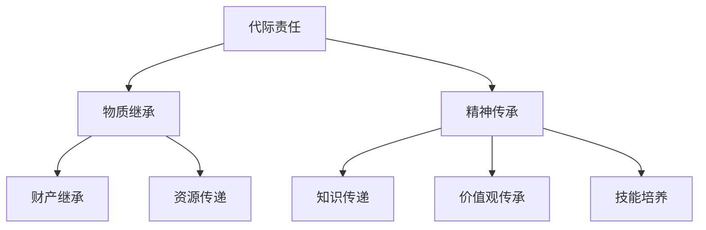
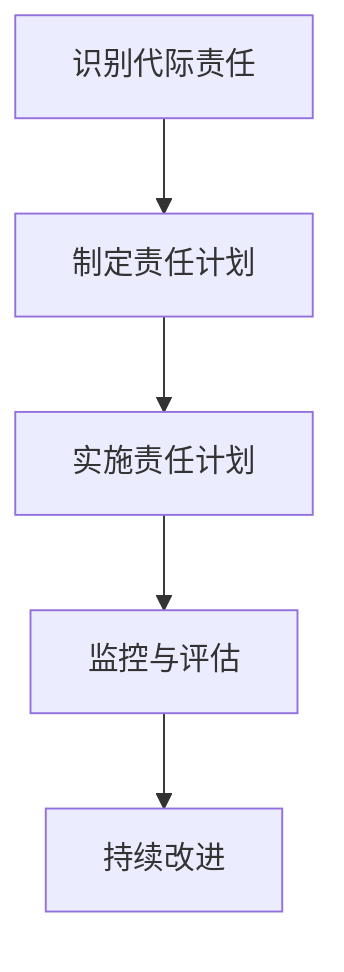

                 

# 从物质继承到精神传承：重新定义代际责任和连接

## 关键词
- 代际责任
- 精神传承
- 物质继承
- 重新定义
- 社会连接

## 摘要
本文旨在探讨代际责任的概念及其演变，从传统的物质继承转向现代的精神传承。通过逐步分析代际责任的本质、实践和挑战，本文试图重新定义代际责任的内涵，并探讨代际连接的力量及其在未来社会中的重要性。

## 引言

### 1.1 为什么要讨论代际责任和连接

代际责任是一个长期存在于人类社会中的概念，它涉及不同世代之间的义务和责任。然而，在现代社会，随着科技的飞速发展和全球化进程的加快，代际责任的形式和内容也在不断演变。传统上，代际责任主要表现为物质上的继承，如财产、土地等。然而，随着社会的发展，精神层面的传承变得越来越重要，如价值观、知识、技能等。因此，重新定义代际责任，探讨物质继承与精神传承的关系，对于理解和解决现代社会中的代际问题具有重要意义。

### 1.2 书籍结构概述

本文将分为四个主要部分。第一部分将探讨代际责任的本质，包括其起源、发展以及物质继承和精神传承的概念。第二部分将分析代际责任的实践，从个人层面、社区层面和企业层面进行深入探讨。第三部分将探讨新时代代际责任的挑战，并尝试重新定义代际责任。第四部分将探讨代际连接的力量，分析其在现代社会中的意义、实践和未来发展趋势。

## 第一部分：代际责任的本质

### 第1章：代际责任的起源与发展

#### 1.1 代际责任的起源

代际责任的概念起源于人类社会的发展。在古代，由于生产力水平的限制，物质资源相对匮乏，因此物质上的继承成为代际责任的主要形式。随着农业社会的形成，土地和财产的继承成为代际责任的核心内容。

#### 1.2 代际责任的发展历程

随着工业革命和现代化进程的推进，代际责任的形式和内容发生了显著变化。物质继承逐渐被精神传承所补充，如教育、价值观、职业技能等。现代社会中，精神传承的重要性日益凸显，成为代际责任的重要组成部分。

#### 1.3 代际责任在现代社会的重要性

在现代社会，代际责任不仅体现在个人层面，如父母对子女的教育和培养，还体现在社区和企业层面，如传承文化遗产和推动社会进步。因此，重新审视和定义代际责任，对于促进社会和谐、推动社会发展具有重要意义。

### 第2章：物质继承与精神传承

#### 2.1 物质继承的概念

物质继承指的是上一代将财产、土地等物质资源传递给下一代。这是传统代际责任的主要形式，其核心在于物质财富的传递和积累。

#### 2.2 精神传承的概念

精神传承指的是上一代将价值观、知识、技能等非物质财富传递给下一代。这是现代代际责任的主要形式，其核心在于非物质财富的传递和积累。

#### 2.3 物质继承与精神传承的关系

物质继承与精神传承并非截然分开，而是相互关联、相互促进的。在现代社会，物质继承和精神传承共同构成了代际责任的核心内容。

## 第二部分：代际责任的实践

### 第3章：代际责任的个人层面

#### 3.1 父母对子女的责任

父母对子女的责任是代际责任在个人层面的具体体现。这包括物质上的供养和教育上的培养，以及精神上的引导和价值观的传承。

#### 3.2 子女对父母的责任

子女对父母的责任是代际责任在个人层面的另一种体现。这包括对父母的尊重、照顾和支持，以及在精神和文化层面上的传承。

#### 3.3 个人责任感的培养

个人责任感的培养是代际责任实践的重要组成部分。通过教育和社会实践，个人可以培养出强烈的责任感，从而更好地履行代际责任。

### 第4章：代际责任的社区层面

#### 4.1 社区在代际责任中的作用

社区在代际责任中发挥着重要作用。通过社区活动和文化传承，社区可以促进代际责任的有效实践。

#### 4.2 社区代际责任的实践案例

社区代际责任的实践案例包括社区教育项目、文化活动和文化保护项目等。这些实践有助于加强代际责任，促进社区和谐。

#### 4.3 社区代际责任的未来趋势

随着社会的发展，社区代际责任将越来越受到重视。未来，社区将更多地参与到代际责任的实践中，推动社会和谐与进步。

### 第5章：代际责任的企业层面

#### 5.1 企业在代际责任中的角色

企业在代际责任中扮演着重要角色。通过企业文化和社会责任，企业可以促进代际责任的实践。

#### 5.2 企业代际责任的实践案例

企业代际责任的实践案例包括企业传承计划、企业社会责任项目和员工培训项目等。这些实践有助于加强企业社会责任，促进代际责任的实现。

#### 5.3 企业代际责任的影响

企业代际责任不仅对企业自身产生深远影响，还对整个社会产生积极影响。通过有效实践代际责任，企业可以提升社会形象，促进社会和谐。

## 第三部分：重新定义代际责任

### 第6章：新时代代际责任的挑战

#### 6.1 社会变迁对代际责任的影响

社会变迁对代际责任产生了深远影响。随着科技的发展和社会的进步，代际责任的内涵和外延也在不断拓展。

#### 6.2 全球化对代际责任的影响

全球化使代际责任面临新的挑战。不同文化背景下，代际责任的形式和内容存在差异，如何在全球化的背景下有效实践代际责任成为重要议题。

#### 6.3 新技术对代际责任的影响

新技术的出现对代际责任产生了重大影响。在线教育、虚拟现实等技术为代际责任的实践提供了新的途径和方式。

### 第7章：重新定义代际责任

#### 7.1 新定义的提出

在新时代背景下，重新定义代际责任具有重要意义。新定义应更加注重精神传承，强调代际责任的社会价值和人文关怀。

#### 7.2 新定义的内涵与外延

新定义的内涵应包括物质和精神两个层面，外延应涵盖个人、社区和企业等多个层面，以适应新时代的发展需求。

#### 7.3 新定义的实施与挑战

新定义的实施面临诸多挑战，如文化差异、技术依赖和社会变迁等。如何克服这些挑战，实现新定义的有效实施，是未来代际责任实践的重要任务。

## 第四部分：代际连接的力量

### 第8章：代际连接的意义

#### 8.1 代际连接的定义

代际连接是指不同世代之间建立紧密联系的过程。通过代际连接，不同世代可以共享资源、知识和经验，促进社会和谐与进步。

#### 8.2 代际连接的重要性

代际连接在现代社会具有重要意义。它有助于消除代沟，增强社会凝聚力，促进社会和谐与发展。

#### 8.3 代际连接与代际责任的联系

代际连接与代际责任密不可分。代际责任的实践需要代际连接的支持，而代际连接的实现又能促进代际责任的履行。

### 第9章：代际连接的实践

#### 9.1 家庭层面的代际连接

家庭层面的代际连接是代际连接的重要组成部分。通过家庭教育和家庭活动，可以加强代际之间的联系和理解。

#### 9.2 社区层面的代际连接

社区层面的代际连接有助于构建和谐社区。社区活动和文化传承项目可以促进不同代际之间的互动和交流。

#### 9.3 企业层面的代际连接

企业层面的代际连接有助于企业传承和发展。通过企业文化和社会责任，企业可以促进代际之间的联系和合作。

### 第10章：代际连接的未来

#### 10.1 代际连接的发展趋势

随着社会的发展，代际连接将越来越受到重视。未来，代际连接将朝着更加多元化和个性化的方向发展。

#### 10.2 代际连接的潜在影响

代际连接的潜在影响将深远。它有助于构建和谐社会，促进社会进步，推动社会可持续发展。

#### 10.3 代际连接的实践建议

为了实现代际连接的有效实践，我们需要从家庭、社区和企业等多个层面出发，采取多种措施，促进代际之间的互动和交流。

## 结语

通过本文的探讨，我们可以看到，代际责任和连接在现代社会中具有重要意义。重新定义代际责任，强调精神传承，加强代际连接，有助于构建和谐、进步的社会。在未来，我们需要不断探索和实践，推动代际责任和连接的有效实现，为社会的可持续发展贡献力量。

## 作者介绍

作者：AI天才研究院/AI Genius Institute & 禅与计算机程序设计艺术 /Zen And The Art of Computer Programming

AI天才研究院（AI Genius Institute）是一家专注于人工智能研究和技术创新的机构，致力于推动人工智能技术的发展和应用。作者在这篇文章中结合了人工智能和计算机编程领域的专业知识，以独特的视角重新审视代际责任和连接的概念。

禅与计算机程序设计艺术（Zen And The Art of Computer Programming）则是一本深受计算机科学界推崇的经典著作，它以禅宗哲学为基础，探讨计算机程序设计的方法和艺术。作者通过将禅宗的哲学思想与计算机编程相结合，为读者提供了全新的思考方式和方法论。

本文旨在通过人工智能和计算机编程的角度，重新定义代际责任和连接，为现代社会中的代际问题提供新的解决方案和思考方向。希望这篇文章能够激发读者对代际责任和连接的深入思考，为构建和谐、进步的社会贡献一份力量。

----------------------------------------------------------------
## 1.1 代际责任的起源

代际责任作为一种社会现象，其起源可以追溯到人类社会的早期。在远古时代，由于生产力水平极为低下，物质资源匮乏，人类社会的基本生存和发展依赖于血缘关系和族群组织。在这种背景下，代际责任开始萌芽，主要表现为家族和部落内部的资源分配和传承。

最初的代际责任主要涉及物质层面的继承。在原始社会中，土地、工具、食物等基本生活资料是生存的关键。为了确保家族和部落的延续，资源的分配和传承成为代际责任的核心内容。年长者通过将资源传递给年轻一代，确保了家族和部落成员的基本生活需求，从而维护了社会的稳定和延续。

#### 1.1.1 原始社会的代际责任

在原始社会，物质资源的稀缺性和分配不均导致了代际责任的形成。年长者通常掌握着更多的资源和权力，他们有责任确保年轻一代的生存和发展。这种责任不仅体现在物质层面，还体现在教育、技能传授等方面。年长者通过传授狩猎、农耕等生存技能，确保年轻一代能够独立生活和传承文化。

#### 1.1.2 传承方式的演变

随着时间的推移，代际责任的形式和内容发生了显著变化。从原始社会的物质继承，到农业社会的土地和财产继承，再到现代社会中的财富、知识和价值观的传承，代际责任在不同历史阶段具有不同的表现形式。这种演变与生产力的发展、社会结构的变迁以及文化传承的需求密切相关。

在农业社会，土地和财产的继承成为代际责任的主要形式。随着农业生产的发展，土地成为最重要的生产资料，土地的继承确保了家族和部落的长期稳定。同时，农业社会的教育形式也逐渐形成，家族和部落通过教育传承文化知识和技能，为下一代的发展奠定基础。

进入现代社会，随着工业化和信息化的发展，物质资源的稀缺性逐渐降低，精神层面的传承变得越来越重要。知识和技能的传承成为代际责任的核心内容。现代社会中，教育、文化、价值观的传承不仅依赖于家庭和社区，还依赖于学校、企业和媒体等多元社会机构。

#### 1.1.3 代际责任的核心要素

代际责任的核心要素包括物质继承和精神传承。物质继承主要涉及财产、资源、财富的传递，而精神传承则涉及知识、技能、价值观、文化等的传递。这两种传承形式在现代社会中相互交织、相互影响，共同构成了代际责任的内容。

物质继承方面，现代社会中，财产和财富的传承仍然是一个重要议题。随着经济的发展，财富的积累和传承成为许多家庭和个人的目标。然而，物质继承不仅涉及财富的分配，还需要考虑家庭成员的需求和期望，确保财富的传承能够促进家庭和谐和社会稳定。

精神传承方面，现代社会中，知识、技能和价值观的传承变得更加重要。教育、文化传承和价值观培养成为代际责任的重要内容。家庭、学校、社区和企业等多元社会机构共同承担起传承文化知识和技能的责任，为下一代的成长和发展提供支持。

#### 1.1.4 代际责任与社会发展

代际责任不仅影响个体和家庭，还对整个社会产生深远影响。在社会发展的过程中，代际责任有助于维护社会稳定和促进社会进步。通过有效的代际责任实践，社会可以更好地传承文化、知识和价值观，增强社会凝聚力，推动社会可持续发展。

首先，代际责任有助于维护社会稳定。通过代际之间的资源分配和责任承担，社会可以确保不同代际之间的和谐相处，减少社会矛盾和冲突。在现代社会中，家庭、社区和企业等社会机构通过代际责任实践，为下一代提供良好的成长环境，有助于减少社会问题，维护社会和谐。

其次，代际责任有助于促进社会进步。通过代际之间的知识、技能和价值观传承，社会可以积累和传承优秀的文化传统，推动社会创新和发展。在教育、科技、文化等领域，代际责任的实践有助于培养具有创新精神和责任感的下一代，为社会的发展提供强大动力。

总之，代际责任作为一种社会现象，其起源可以追溯到人类社会的早期。从原始社会的物质继承，到农业社会的土地和财产继承，再到现代社会中的财富、知识和价值观的传承，代际责任在不同历史阶段具有不同的表现形式和内涵。在现代社会，代际责任的核心要素包括物质继承和精神传承，它们相互交织、相互影响，共同构成了代际责任的内容。代际责任不仅影响个体和家庭，还对整个社会产生深远影响，有助于维护社会稳定和促进社会进步。

## 1.2 代际责任的发展历程

代际责任作为一种社会现象，其发展历程反映了人类社会的变迁和进步。从古代到现代，代际责任的形式和内容经历了多次演变，每个阶段都有其特定的历史背景和社会需求。

#### 1.2.1 古代社会的代际责任

在古代社会，代际责任主要以物质继承的形式存在。随着农业社会的兴起，土地和财产的继承成为代际责任的核心内容。古代社会的家庭和家族结构较为紧密，家庭成员之间的责任和义务明确。父亲或家族长辈通常负责管理和分配家族财产，确保后代能够继承和延续家族的财富和地位。此外，古代社会中的教育传承也非常重要，长辈通过传授农业、手工艺等生存技能，确保年轻一代能够适应社会生活。

#### 1.2.2 中世纪时期的代际责任

中世纪时期，代际责任的形式和内容发生了显著变化。随着封建制度的形成，土地和财产的继承逐渐由家族内部转移到了封建领主和教会手中。封建领主通过土地和财产的继承，确保了封建制度的稳定和延续。同时，教会也在中世纪社会中扮演了重要角色，通过宗教教育和道德规范，传承了基督教的价值观和文化传统。这一时期，代际责任不仅体现在物质层面，还体现在精神层面。

#### 1.2.3 工业革命时期的代际责任

工业革命时期，代际责任的形式和内容再次发生了重大变化。随着工业化和城市化的发展，物质资源的稀缺性逐渐降低，而知识和技能的传承变得尤为重要。工业革命带来了大量的技术进步和科学创新，父母和长辈开始更加重视对子女的教育和技能培养。这一时期，代际责任逐渐从物质继承转向了精神传承，教育成为代际责任的核心内容。

#### 1.2.4 现代社会的代际责任

进入现代社会，代际责任的形式和内容进一步多样化。随着全球化和信息化的发展，代际责任不仅涉及物质和精神层面，还涉及到价值观、文化和社会责任。现代社会中，父母和长辈不仅需要传授子女知识和技能，还需要培养他们的社会责任感和全球视野。此外，随着科技的发展，在线教育、远程交流和虚拟现实等新技术也为代际责任的实践提供了新的途径。

#### 1.2.5 代际责任的发展趋势

展望未来，代际责任将继续演变和进步。随着科技的不断发展和社会的不断变迁，代际责任将更加注重个体的差异化和个性化。未来的代际责任将更加关注子女的个性发展，鼓励他们探索自我，实现自我价值。同时，代际责任也将更加注重社会参与和社会责任，培养具有全球视野和社会责任感的下一代。

总之，代际责任的发展历程反映了人类社会的变迁和进步。从古代社会的物质继承，到中世纪时期的精神传承，再到现代社会中的多元责任，代际责任在不同历史阶段具有不同的表现形式和内涵。在现代社会，代际责任不仅涉及物质和精神层面，还涉及到价值观、文化和社会责任。随着科技的发展和全球化进程的推进，代际责任将继续演变和进步，为社会的可持续发展贡献力量。

## 1.3 代际责任在现代社会的重要性

在现代社会，代际责任不仅是一个历史遗留的社会现象，更是一个具有重要现实意义和深远影响的议题。随着全球化、信息化和科技进步的加速，代际责任在现代社会中的重要性日益凸显，成为社会稳定、家庭和谐以及个人发展的重要保障。以下将从社会稳定、家庭和谐和个人发展三个方面探讨代际责任在现代社会的重要性。

#### 1.3.1 社会稳定

代际责任是社会稳定的重要基石。在现代社会，社会稳定不仅依赖于物质资源的分配，更依赖于社会价值观和文化传承的统一。代际责任通过确保不同代际之间的资源和价值传承，有助于维护社会的连续性和稳定性。例如，在政治领域，代际责任体现在政治制度的传承和稳定，确保社会政治秩序的延续。在文化领域，代际责任通过文化传承，维护和弘扬民族文化，增强社会凝聚力。在社会经济领域，代际责任通过财富和资源的合理分配，促进社会经济的持续健康发展。

#### 1.3.2 家庭和谐

家庭是社会的基本单元，家庭和谐是社会和谐的基础。代际责任在家庭中的作用尤为关键。首先，代际责任有助于家庭内部的资源合理分配，减少家庭矛盾和冲突。例如，父母通过教育、财产继承等方式履行对子女的责任，有助于子女的成长和发展，增进家庭内部的和谐。其次，代际责任在精神层面的传承，如家庭价值观、传统习俗和亲情关系的传承，有助于加强家庭成员之间的情感纽带，促进家庭和谐。最后，代际责任也体现在家庭成员之间的相互支持和关爱，如父母对子女的养育、子女对父母的照顾，这些关系有助于构建和谐的家庭氛围。

#### 1.3.3 个人发展

代际责任在个人发展中也发挥着重要作用。个人发展不仅需要物质资源的支持，更需要精神层面的滋养和价值引领。代际责任通过传承知识和技能，为个人提供发展的基础。例如，父母通过教育、培训等方式，将知识和技能传递给子女，帮助他们更好地适应社会。此外，代际责任还在价值观和人生观的形成过程中起到重要作用。父母和长辈通过言传身教，传递正确的价值观和人生观，引导子女形成积极向上的人生态度。

#### 1.3.4 代际责任的具体体现

在现代社会，代际责任的具体体现形式多种多样。首先，在教育领域，父母和长辈通过投资子女的教育，履行代际责任。这不仅包括物质上的投资，如学费、书籍等，还包括时间和精力的投入，如陪伴、辅导等。其次，在社会层面，代际责任体现在社会责任和文化传承上。企业和组织通过公益活动、文化传承项目等，履行对社会的责任，为下一代提供更好的发展环境。最后，在家庭层面，代际责任体现在亲情关系的维护和传承上。家庭成员通过相互关爱和支持，维护家庭和谐，传承家庭价值观和传统。

#### 1.3.5 代际责任的挑战

尽管代际责任在现代社会具有重要意义，但同时也面临诸多挑战。首先，全球化带来的文化多样性和价值观冲突，使得代际责任在文化传承上面临困难。如何在全球化的背景下，保持文化传承的连续性和多样性，是代际责任面临的重要挑战。其次，随着科技的发展，物质资源的分配方式发生了变化，传统的物质继承形式受到冲击，如何适应这种变化，实现资源的合理分配，是代际责任需要解决的问题。此外，代际责任在个人发展中的角色也在发生变化，如何更好地适应个人发展的需求，提供有效的支持和引导，也是代际责任需要面对的挑战。

总之，代际责任在现代社会中具有重要现实意义和深远影响。通过确保资源、知识和价值观的传承，代际责任有助于维护社会稳定、促进家庭和谐和推动个人发展。在全球化、信息化和科技进步的背景下，我们需要不断探索和实践，应对代际责任面临的挑战，为构建和谐、进步的社会贡献力量。

## 2.1 物质继承的概念

物质继承是指上一代将财产、资源等物质财富传递给下一代的过程。物质继承在人类社会中有着悠久的历史，是代际责任的重要组成部分。在传统社会中，物质继承往往以土地、房屋、金钱、珠宝等形式存在，其主要目的是确保家族或个体的财富得以传承和积累。

#### 2.1.1 物质继承的基本形式

物质继承的基本形式主要包括以下几种：

1. **遗嘱继承**：遗嘱继承是指个人在生前通过遗嘱明确财产继承人的方式。这种方式通常适用于有明确继承意愿的个人，遗嘱的执行有助于确保财产的顺利传承。

2. **法定继承**：法定继承是指在没有遗嘱或遗嘱无效的情况下，按照法律规定的继承顺序和比例进行财产分配。法定继承的规则因国家法律体系的不同而有所差异，但总体上旨在公平地分配遗产。

3. **家族继承**：家族继承是指家族内部成员之间根据家族规则和习俗进行财产传承。这种形式的继承往往受到家族传统和亲缘关系的影响，具有一定的灵活性和特殊性。

#### 2.1.2 物质继承的意义

物质继承在代际责任中具有重要意义，主要体现在以下几个方面：

1. **财富传承**：物质继承有助于财富的延续和积累，确保家族或个体在经济上保持稳定和繁荣。通过物质继承，家族或个体能够将财富传递给下一代，为他们提供更好的生活和发展条件。

2. **社会责任**：物质继承也是家庭和社会责任的体现。通过物质继承，长辈能够对子女或家族成员履行其应尽的责任，确保家庭成员在经济上得到支持，减少因资源不足而导致的社会问题。

3. **文化传承**：物质继承不仅仅是财富的传递，也是文化和价值观的传承。在某些文化中，物质继承与家族荣誉、地位和身份密切相关，通过物质继承，家族的文化传统和价值观得以延续。

#### 2.1.3 物质继承的挑战

尽管物质继承在代际责任中具有重要意义，但在现代社会中也面临诸多挑战：

1. **法律复杂性**：随着法律制度的不断完善，物质继承涉及到复杂的法律程序和规定。不同国家和地区的法律体系不同，遗嘱的有效性和执行方式也有所差异，这给物质继承带来了法律上的挑战。

2. **文化多样性**：全球化和文化多元化使得物质继承的形式和内容更加多样化。不同文化背景下的物质继承方式可能存在差异，如何在尊重文化多样性的同时，实现物质继承的公平和有效，是一个重要课题。

3. **道德和伦理问题**：物质继承往往涉及到道德和伦理问题。如何确保遗产的公平分配，避免因财产继承引发的家族纠纷和社会矛盾，是物质继承面临的重要挑战。

总之，物质继承是代际责任中的重要组成部分，它不仅关乎财富的传承，也涉及到社会责任和文化传承。在现代社会中，物质继承面临着法律、文化和道德等多方面的挑战，需要我们不断探索和解决，以确保物质继承的有效和公平。

## 2.2 精神传承的概念

精神传承指的是上一代将非物质的财富，如知识、价值观、技能和信仰等，传递给下一代的过程。与物质继承不同，精神传承不涉及有形的财产和资源，但它同样在代际责任中扮演着至关重要的角色。在现代社会，随着全球化、信息化和多元化的发展，精神传承的重要性愈发凸显，成为代际责任的核心内容之一。

#### 2.2.1 精神传承的基本形式

精神传承的形式多种多样，主要包括以下几个方面：

1. **教育传承**：教育是精神传承的重要途径。父母和长辈通过教育，将知识、技能和价值观传递给子女，帮助他们成为有能力和有道德的人。这种传承不仅包括学术知识，还涵盖生活技能、批判性思维和解决问题的能力。

2. **家庭传承**：家庭是精神传承的另一个重要场所。家庭成员之间的互动、家庭传统和价值观的传递，构成了家庭层面的精神传承。通过家庭教育和家庭活动，父母和长辈可以潜移默化地将价值观和行为准则传递给子女。

3. **文化传承**：文化传承是精神传承的重要方面。通过文化习俗、节日庆典和传统活动，上一代可以将民族文化、历史经验和道德规范传递给下一代。这种传承有助于保持文化的连续性和多样性。

4. **宗教传承**：宗教信仰和道德观念的传递也是精神传承的重要组成部分。在宗教家庭中，父母和长辈通过宗教教育和信仰实践，将宗教信仰和道德规范传递给子女。

#### 2.2.2 精神传承的意义

精神传承在代际责任中具有深远的意义，主要体现在以下几个方面：

1. **文化延续**：精神传承有助于保持文化的连续性。通过将传统文化、价值观和信仰传递给下一代，社会可以保持其独特的文化特色，增强文化自信和凝聚力。

2. **个人发展**：精神传承对个人发展具有重要影响。通过接受精神传承，下一代可以获得丰富的精神资源，如知识、价值观和信仰，这些资源有助于他们在生活中做出明智的选择，实现个人价值。

3. **社会和谐**：精神传承有助于社会和谐。通过传承共同的价值观和行为准则，社会成员之间可以建立相互尊重和理解的关系，减少冲突和矛盾，促进社会稳定。

4. **道德引导**：精神传承在道德引导方面发挥着重要作用。通过传承道德规范和价值观，父母和长辈可以引导子女形成正确的道德观念和行为习惯，成为有社会责任感的人。

#### 2.2.3 精神传承的挑战

尽管精神传承在代际责任中具有重要意义，但在现代社会中，它也面临诸多挑战：

1. **文化多样性**：全球化和文化多元化使得精神传承的形式和内容更加复杂。如何在保持文化多样性的同时，实现精神传承的统一和连续，是一个重要课题。

2. **教育变革**：随着教育制度的变革，传统教育方式可能不再适应现代社会的需求。如何通过新的教育方式和手段，实现精神传承的有效传递，是一个需要解决的问题。

3. **社会变迁**：社会变迁对精神传承产生了深远影响。随着社会结构和价值观念的变化，精神传承的内容和形式也在不断调整。如何适应社会变迁，确保精神传承的适应性，是精神传承面临的重要挑战。

总之，精神传承是代际责任中的重要组成部分，它不仅关乎文化的延续和个人发展，还涉及社会和谐和道德引导。在现代社会，精神传承面临着文化多样性、教育变革和社会变迁等多方面的挑战，需要我们不断探索和解决，以确保精神传承的有效和持续。

## 2.3 物质继承与精神传承的关系

物质继承与精神传承在代际责任中既相互独立又相互联系，共同构成了现代社会中代际责任的两个重要维度。理解这两者之间的关系，有助于我们更全面地认识代际责任的内涵和实现方式。

#### 2.3.1 相互独立性

物质继承与精神传承在代际责任中的相互独立性体现在以下几个方面：

1. **传承对象不同**：物质继承主要涉及有形的财产和资源，如土地、金钱、房产等；而精神传承则涉及无形的财富，如知识、价值观、技能、信仰等。

2. **传承方式不同**：物质继承通常通过法律、遗嘱等方式进行；而精神传承则更多依赖于教育、家庭活动和文化传承等方式。

3. **重要性不同**：在传统社会中，物质继承往往被视为代际责任的核心，因为物质资源是生存和发展的基础；而随着社会的发展，精神传承的重要性逐渐上升，因为它关乎个人发展、社会和谐和文化延续。

#### 2.3.2 相互关联性

尽管物质继承与精神传承有独立性，但它们在代际责任中又密切相关，相互影响：

1. **相互补充**：物质继承和精神传承在代际责任中相互补充。物质继承为个人和家庭提供了经济基础和物质保障，而精神传承则提供了价值引领和道德支撑。只有两者相结合，才能实现代际责任的全面履行。

2. **共同目标**：物质继承和精神传承的共同目标都是促进代际之间的和谐与进步。物质继承确保了财富的延续和积累，而精神传承则保证了文化、知识和价值观的传承。两者共同为社会的可持续发展提供动力。

3. **相互影响**：物质继承和精神传承之间也存在相互影响。例如，物质财富的积累可能会影响家庭成员的教育和生活方式，从而影响精神传承的效果；而精神传承的成功也可能增强家庭成员之间的情感纽带，促进物质资源的合理分配。

#### 2.3.3 现代社会中的互动关系

在现代社会，物质继承与精神传承的互动关系更加复杂和多样化：

1. **经济基础与精神支撑**：物质继承为精神传承提供了经济基础，使个体和家庭能够专注于精神层面的追求。例如，良好的物质条件可以支持高质量的教育，从而实现精神财富的积累。

2. **文化传承与财富分配**：精神传承往往与家族文化、传统习俗相关，这些文化因素在一定程度上会影响财富的分配方式。例如，某些家族可能更重视精神传承，因此财富分配可能更加注重教育和社会责任，而不仅仅是物质财富的分配。

3. **全球化与多样性**：全球化带来了文化多样性和价值观的碰撞，使得物质继承与精神传承的互动关系更加复杂。如何在保持文化多样性的同时，实现物质与精神的平衡传承，是一个重要的课题。

#### 2.3.4 案例分析

为了更好地理解物质继承与精神传承之间的关系，我们可以通过以下案例进行分析：

1. **案例一**：一个富裕家庭，父母通过遗嘱将财产传给子女。在这个案例中，物质继承确保了子女的经济基础。然而，如果父母同时注重子女的教育和精神培养，子女不仅能够继承物质财富，还能获得丰富的精神资源，实现全面的发展。

2. **案例二**：一个贫困家庭，父母虽然无法提供丰富的物质资源，但他们通过教育、家庭活动和道德教育，为子女提供了精神财富。在这个案例中，虽然物质继承有限，但精神传承的作用显著，子女依然能够在精神上获得满足，并取得成功。

通过这些案例可以看出，物质继承与精神传承在代际责任中既相互独立又相互联系，共同构成了一个复杂而多样的体系。在现代社会中，我们需要在物质继承与精神传承之间找到平衡，确保两者相互促进，共同推动社会的进步与和谐。

## 3.1 父母对子女的责任

父母对子女的责任是代际责任在家庭层面的重要体现。这种责任不仅涵盖了物质层面的支持，还包括精神层面的引导和培养。以下是父母对子女责任的详细阐述。

#### 3.1.1 物质支持

父母对子女的物质支持是基础性的，确保子女能够获得基本的生存和发展条件。这种物质支持包括以下几个方面：

1. **生活费用**：父母需要为子女提供足够的生活费用，包括食物、衣物、住房等基本需求。这是确保子女健康成长的基本保障。

2. **教育和培训**：父母应投资于子女的教育和培训，包括学前教育、基础教育、高等教育和职业培训等。通过教育，子女可以获得知识、技能和素质，为未来的发展打下坚实基础。

3. **医疗保健**：父母有责任为子女提供医疗保健，确保他们在生病或遇到健康问题时能够得到及时和有效的治疗。

4. **财产和财富**：在适当的情况下，父母可以通过遗产或赠与等方式，为子女提供物质财富。这不仅可以支持子女的当前需求，还可以为他们的未来提供经济保障。

#### 3.1.2 精神引导

父母对子女的精神引导同样至关重要。这种引导不仅涉及价值观和道德教育，还包括心理支持和情感关怀。以下是几个关键方面：

1. **价值观教育**：父母应传递正确的价值观和道德观念，帮助子女形成健康的世界观和人生观。这包括诚信、尊重、责任感和同情心等基本价值观。

2. **心理健康支持**：父母应关注子女的心理健康，提供情感支持和心理疏导。在子女面临压力、困惑或挫折时，父母的支持和指导可以帮助他们度过难关。

3. **情感关怀**：父母应给予子女足够的情感关怀，建立亲密的家庭关系。这包括倾听子女的想法和感受，尊重他们的选择，以及在日常生活中表达爱和关心。

4. **榜样作用**：父母作为子女的榜样，通过自身的行为和态度，潜移默化地影响子女的行为和价值观。父母的榜样作用对子女的成长和发展具有深远的影响。

#### 3.1.3 教育和培养

父母对子女的教育和培养是代际责任的重要组成部分。这种教育和培养不仅包括学术知识的学习，还包括生活技能的培养和综合素质的提升。以下是几个关键方面：

1. **学术教育**：父母应确保子女接受高质量的教育，帮助他们掌握基本的学术知识。这包括阅读、写作、数学等基本技能的培养。

2. **生活技能**：父母应传授子女生活技能，如独立生活、财务管理、人际交往等。这些技能有助于子女在未来独立生活和职业发展中取得成功。

3. **综合素质**：父母应注重子女的全面发展，培养他们的领导力、创造力、团队合作精神和社会责任感。这些综合素质对子女的长远发展至关重要。

#### 3.1.4 案例分析

为了更好地理解父母对子女的责任，我们可以通过以下案例进行分析：

1. **案例一**：一个家庭条件优越的父母，不仅为子女提供了充足的物质资源，还注重子女的教育和精神培养。他们投资于子女的教育和培训，鼓励子女积极参与社区服务，培养他们的社会责任感。这种全面的教育和培养有助于子女在学术和生活中取得成功。

2. **案例二**：一个家庭经济条件较差的父母，尽管无法提供丰富的物质资源，但他们通过自己的努力和坚持，为子女提供了良好的教育和精神支持。他们通过言传身教，传递正确的价值观和道德观念，帮助子女形成积极的人生观。这种精神传承使得子女在逆境中依然能够保持乐观和自信。

通过这些案例可以看出，父母对子女的责任不仅涉及物质层面的支持，还包括精神层面的引导和培养。只有通过全面的教育和培养，才能确保子女在成长过程中获得全面发展，实现个人价值和社会责任。

## 3.2 子女对父母的责任

子女对父母的责任是代际责任中不可或缺的一部分。在传统观念中，子女对父母的孝顺被视为一种重要的道德规范。然而，在现代社会，随着家庭结构、社会价值观念的变化，子女对父母的责任也在不断演变。以下从三个方面详细探讨子女对父母的责任。

#### 3.2.1 尊重与陪伴

尊重是子女对父母的首要责任。这不仅体现在言语上的尊敬，还包括对父母的人格尊重和生活方式的尊重。子女应尊重父母的意见和决定，特别是在家庭事务和重大决策方面。此外，子女应在日常生活中给予父母关爱和陪伴，特别是在父母年迈或面临困难时，应主动提供帮助和支持。

1. **倾听和沟通**：子女应积极倾听父母的意见和需求，通过有效沟通解决家庭中的矛盾和问题。在家庭关系中，沟通是桥梁，有助于增进理解，化解分歧。

2. **日常关怀**：子女应在日常生活中关心父母的身心健康，帮助他们解决生活中的不便。例如，为父母准备健康的饮食，陪他们进行适量的运动，确保他们的生活质量。

#### 3.2.2 经济支持

在传统观念中，子女对父母的经济支持是子女对父母责任的重要体现。尽管现代社会中，许多父母可能在经济上相对独立，但子女在有能力的情况下，仍然应承担一定的经济支持责任。

1. **赡养父母**：子女应确保父母在晚年能够享有基本的经济保障，特别是在父母失去收入来源或面临经济困难时，子女应主动提供帮助。

2. **资助家庭**：对于家庭经济状况较为困难的情况，子女可以通过资助家庭的方式，帮助家庭渡过难关，确保家庭生活的稳定。

#### 3.2.3 精神慰藉

子女对父母的责任不仅体现在物质层面，更体现在精神层面。精神慰藉是子女对父母的重要责任，尤其在父母年迈或面临心理压力时，子女应提供精神支持。

1. **情感支持**：子女应给予父母情感上的支持，通过陪伴、倾听和理解，帮助父母缓解心理压力。在父母面临困难或挫折时，子女应成为他们的坚强后盾。

2. **心理疏导**：子女可以学习一些心理学知识，帮助父母进行心理疏导，缓解焦虑和抑郁情绪。通过心理支持，子女可以帮助父母保持积极乐观的心态，面对生活中的挑战。

#### 3.2.4 案例分析

为了更好地理解子女对父母的责任，我们可以通过以下案例进行分析：

1. **案例一**：小明是一名成功的企业家，他的父母年迈且身体健康状况不佳。小明不仅在经济上为父母提供支持，还安排了专门的保姆照顾他们的生活。在日常生活中，小明经常陪伴父母，倾听他们的心声，帮助他们解决生活中的问题。这种全面的支持和关怀，使得父母的晚年生活充满幸福和温暖。

2. **案例二**：小芳是一名普通职工，她的父母因年老体弱，生活困难。小芳在确保自己家庭经济稳定的同时，主动承担起家庭的经济责任，帮助父母解决生活中的困难。她还经常陪伴父母，给予他们精神上的慰藉，使得父母在心理上感到安慰和满足。

通过这些案例可以看出，子女对父母的责任不仅体现在物质层面，还包括精神层面的陪伴和支持。只有通过全面的责任承担，才能确保父母在晚年享有幸福的生活。

总之，子女对父母的责任是代际责任的重要组成部分。在现代社会，子女应尊重父母、提供经济支持，并在精神上给予慰藉。通过这些责任承担，子女可以帮助父母度过难关，实现家庭和谐与幸福。

## 3.3 个人责任感的培养

个人责任感的培养是代际责任实践中的关键环节，它不仅关乎个人的成长与发展，也对社会和谐与进步具有重要意义。以下是个人责任感培养的几个关键方面。

#### 3.3.1 家庭教育

家庭教育是个人责任感培养的基础。家庭是个人最早接触的社会单位，父母和其他家庭成员通过日常行为和互动，潜移默化地影响子女的责任感培养。

1. **榜样作用**：父母是子女的首要榜样，他们的行为和态度直接影响子女的责任感形成。父母应通过自身的行为，如遵守承诺、承担责任等，树立良好的榜样。

2. **家庭规则**：家庭规则有助于培养子女的责任感。通过明确家庭规则和期望，子女可以了解自己在家庭中的责任和义务，学会遵守规则和承担责任。

3. **鼓励和奖励**：家庭成员应鼓励子女承担家庭责任，并为他们提供正面的反馈和奖励。这可以增强子女的责任感，激励他们更加积极地履行家庭义务。

#### 3.3.2 学校教育

学校教育是个人责任感培养的重要环节。学校通过课程设置、实践活动和校园文化，为学生提供系统的责任感教育。

1. **课程教育**：学校可以通过道德教育、公民教育等课程，系统地传授责任感知识。例如，通过学习历史人物的故事，学生可以了解责任感和担当的重要性。

2. **实践活动**：学校可以组织各种实践活动，如志愿服务、社区参与等，让学生在实际操作中培养责任感。通过参与社会实践，学生可以学会如何承担责任，并在实践中成长。

3. **校园文化**：学校应营造积极的校园文化，鼓励学生积极参与集体活动和志愿服务。这种文化氛围可以增强学生的集体荣誉感和责任感。

#### 3.3.3 社会实践

社会实践是个人责任感培养的有效途径。通过参与社会实践活动，学生可以将所学知识应用于实际，增强责任感。

1. **志愿服务**：志愿服务是一种典型的社会责任行为，通过参与志愿服务，学生可以体验帮助他人的快乐，培养社会责任感。

2. **实习经历**：实习经历可以帮助学生了解社会和工作环境，培养职业责任感和专业素养。通过实习，学生可以将课堂知识与实践相结合，提高解决问题的能力。

3. **社区参与**：社区参与是培养学生责任感的重要方式。学生可以通过参与社区活动，了解社区问题，学会如何为社会贡献力量。

#### 3.3.4 媒体和科技的作用

随着媒体和科技的快速发展，它们在个人责任感培养中也发挥着重要作用。

1. **媒体教育**：媒体可以通过新闻报道、纪录片、电影等形式，传递责任感教育。例如，通过报道正面典型和正面事件，可以激励更多人积极承担责任。

2. **网络平台**：网络平台可以提供丰富的责任感教育资源。学生可以通过在线课程、社交媒体等途径，学习责任感知识，参与社会责任活动。

3. **科技应用**：科技应用可以帮助学生更有效地参与社会实践。例如，通过在线平台，学生可以更容易地参与志愿服务和社区活动，提高责任感实践的效果。

总之，个人责任感的培养是一个系统工程，需要家庭、学校、社会实践和媒体等多方面的共同努力。通过系统的教育和社会实践，可以培养出具有高度责任感的新一代，为社会的和谐与进步贡献力量。

## 4.1 社区在代际责任中的作用

社区在代际责任中扮演着至关重要的角色，它是连接不同代际的重要纽带，有助于促进代际之间的互动和理解。以下从几个方面详细探讨社区在代际责任中的作用。

#### 4.1.1 促进代际交流

社区通过组织各种活动，为不同代际提供了交流和互动的机会。例如，社区可以举办家庭日、老年人活动日和青少年活动日等，让不同年龄段的居民能够在一起参与活动、分享经验。这些活动不仅有助于代际之间的相互理解，还能增进家庭和睦和社会和谐。

1. **家庭日活动**：家庭日活动是社区促进代际交流的有效形式。通过家庭一起参与游戏、运动和表演等活动，家庭成员可以增进彼此的了解和感情，增强家庭凝聚力。

2. **老年人活动日**：老年人活动日为老年人提供了一个展示自己的平台，同时也能让他们与年轻一代互动，分享经验和智慧。这种互动有助于打破代际之间的隔阂，增进相互理解。

3. **青少年活动日**：青少年活动日为青少年提供了展示自我、锻炼能力和结交朋友的平台。通过参与各种活动，青少年可以学会如何与不同年龄段的成年人交流，培养社会责任感。

#### 4.1.2 文化传承

社区在文化传承中发挥着重要作用，它是文化传承的重要载体。通过举办文化活动、传统节日庆典等，社区可以促进文化的传承和延续。

1. **文化活动**：社区可以通过举办书画展、音乐会、戏剧表演等文化活动，展示和传承传统文化。这些活动不仅丰富了社区居民的文化生活，还能增强文化自信和认同感。

2. **传统节日庆典**：传统节日庆典是社区传承文化的重要形式。通过举办春节、中秋节等传统节日庆典，社区可以传承和弘扬民族文化，增强社区凝聚力。

3. **民俗活动**：社区可以组织民俗活动，如踩高跷、舞龙舞狮等，让年轻人了解和参与传统文化。这些活动不仅有助于传承文化，还能增强社区的文化活力。

#### 4.1.3 社区教育

社区教育是代际责任的重要组成部分。社区可以通过各种教育项目和培训，为不同年龄段的居民提供教育资源，帮助他们获取知识、提升技能。

1. **成人教育**：社区可以为成年人提供成人教育课程，如计算机技能培训、外语学习等。通过这些课程，成年人可以不断提升自己的知识水平和技能，适应社会发展的需求。

2. **青少年教育**：社区可以组织各种青少年教育活动，如夏令营、兴趣班等。这些活动不仅有助于青少年的全面发展，还能培养他们的责任感和团队精神。

3. **老年人教育**：社区可以为老年人提供老年人教育课程，如养生保健、手工艺等。这些课程有助于老年人的身心健康，提升他们的生活质量。

#### 4.1.4 社区服务

社区服务是代际责任的重要体现。通过组织各种社区服务活动，社区可以促进居民之间的互助合作，增强社区凝聚力。

1. **志愿服务**：社区可以组织志愿者服务活动，让年轻人有机会为社区和老年人提供帮助。这种互助合作有助于培养年轻人的社会责任感，增强他们的社会责任意识。

2. **老年人关怀**：社区可以提供老年人关怀服务，如上门照顾、健康咨询等。这些服务有助于提高老年人的生活质量，减轻他们的孤独感。

3. **社区维护**：社区可以组织居民参与社区维护活动，如绿化、清洁等。通过这些活动，居民可以共同维护社区环境，增强社区归属感。

总之，社区在代际责任中发挥着重要作用。通过促进代际交流、文化传承、社区教育和社区服务，社区可以有效地促进代际之间的互动和理解，为社会的和谐与进步贡献力量。

## 4.2 社区代际责任的实践案例

社区代际责任的实践案例展示了不同社区如何通过实际行动，促进代际之间的互动和理解，实现代际责任的履行。以下是几个具有代表性的实践案例。

#### 4.2.1 社区教育项目

许多社区通过教育项目来促进代际责任。例如，某社区推出了一项名为“代际教育计划”的项目，旨在通过老年志愿者与青少年学生的互动，实现知识和经验的传承。该项目包括老年志愿者授课、青少年学生参与活动等多种形式，通过这种方式，老年人和青少年不仅在知识和经验上进行了交流和分享，还在情感上建立了深厚的联系。

1. **老年志愿者授课**：老年志愿者根据自己的专长，如历史、文学、手工艺等，为青少年学生授课。这种互动不仅丰富了学生的知识体系，还让老年人感受到了自己的价值和重要性。

2. **青少年学生参与活动**：青少年学生积极参与老年志愿者的教育活动，通过参与活动，他们不仅学到了知识，还学会了尊重和理解老年人。

3. **代际交流活动**：社区定期举办代际交流活动，如代际对话会、茶话会等，让老年人和青少年有机会面对面交流，分享彼此的生活经验和感悟。

#### 4.2.2 社区文化活动

社区文化活动是促进代际责任的重要途径。例如，某社区通过举办“代际文化展览”活动，展示了不同代际的文化成果和艺术创作。这个活动不仅吸引了不同年龄段的居民参与，还促进了社区成员之间的交流和互动。

1. **代际文化展览**：社区组织老年人和青少年分别展示自己的文化作品，如绘画、书法、摄影等。通过展览，社区成员可以欣赏和学习不同代际的文化成果。

2. **文化活动表演**：老年人和青少年共同参与文化表演，如舞蹈、歌唱、戏剧等。这种表演不仅展示了他们的才艺，还促进了代际之间的情感交流。

3. **文化知识讲座**：社区邀请专家学者举办文化知识讲座，让居民了解和传承传统文化。这种讲座不仅丰富了居民的文化知识，还增强了他们对传统文化的认同感。

#### 4.2.3 社区志愿服务

社区志愿服务是促进代际责任的重要手段。例如，某社区开展了一项名为“代际志愿服务计划”的项目，通过老年人和青少年共同参与志愿服务，实现代际之间的互动和合作。

1. **社区清洁活动**：老年人和青少年共同参与社区清洁活动，如清扫街道、绿化环境等。通过这种活动，他们不仅增强了社区责任感，还培养了团队合作精神。

2. **老年关怀服务**：青少年志愿者定期为老年人提供关怀服务，如陪同散步、聊天、购物等。这种服务不仅帮助老年人解决了生活中的困难，还增强了他们的生活幸福感。

3. **社区建设活动**：老年人和青少年共同参与社区建设活动，如修建公园、改造社区设施等。这种合作不仅改善了社区环境，还增强了社区的凝聚力和归属感。

#### 4.2.4 文化保护与传承

文化保护与传承是代际责任的重要方面。例如，某社区通过开展“代际文化保护与传承”项目，保护和传承了当地的传统手工艺和文化习俗。

1. **传统手工艺培训**：社区组织传统手工艺培训课程，让老年人和青少年学习并传承传统手工艺。通过这种方式，传统手工艺得以在年轻一代中传播和延续。

2. **文化习俗体验**：社区举办文化习俗体验活动，如传统节日庆典、民俗活动等，让居民尤其是青少年有机会体验和了解传统文化。这种活动不仅增强了文化认同感，还促进了代际之间的互动和理解。

3. **文化保护基金**：社区设立文化保护基金，用于支持传统手工艺和文化习俗的保护与传承。通过这种方式，社区可以为传统文化的传承和发展提供经济支持。

通过这些实践案例可以看出，社区通过多种方式，如教育项目、文化活动、志愿服务和文化保护与传承，有效地促进了代际责任的实际履行。这些实践不仅增强了社区成员之间的互动和理解，还提高了社区的整体幸福感和凝聚力，为构建和谐、进步的社区环境做出了积极贡献。

## 4.3 社区代际责任的未来趋势

随着社会的发展和变迁，社区代际责任也面临着新的挑战和机遇。未来，社区代际责任将在以下几个方面呈现新的趋势。

#### 4.3.1 文化多样性的增强

全球化带来了文化多样性的增强，社区代际责任将更加注重文化多样性的传承和尊重。未来的社区代际责任将不仅仅是传递和继承某种特定文化，而是要鼓励和尊重不同文化之间的交流和融合。通过举办多元文化活动和项目，社区可以促进不同代际之间的文化交流，增进相互理解和尊重。

#### 4.3.2 科技创新的融合

随着科技的快速发展，人工智能、虚拟现实等新兴技术将日益融入社区代际责任的实践中。例如，虚拟现实技术可以为老年人提供虚拟旅游、娱乐和学习体验，增强他们的生活乐趣和知识获取。同时，在线教育和远程互动技术将使代际间的教育和交流更加便捷和高效。未来，社区代际责任将更加依赖于科技创新，以提供更好的教育和互动体验。

#### 4.3.3 社会参与的增加

未来，社区代际责任将更加注重社会参与和公共责任。随着社会责任意识的提升，越来越多的社区成员将积极参与到代际责任实践中。例如，企业和社会组织可以通过公益项目、社区服务等方式，参与和支持社区代际责任实践。此外，社区成员也将通过志愿服务、社区建设等活动，积极履行代际责任，推动社区发展和进步。

#### 4.3.4 个性化需求的满足

未来的社区代际责任将更加注重个性化需求的满足。随着社会变迁和个体发展的多样化，每个代际成员的需求和期望也会有所不同。社区代际责任将需要更加灵活和个性化地满足不同代际的需求，例如，提供定制化的教育和培训项目、个性化的生活支持和关怀等。通过满足个性化需求，社区代际责任将更加贴近每个代际成员的实际需求，提高责任实践的效果。

#### 4.3.5 多元化合作的发展

未来的社区代际责任将更加依赖于多元化合作。社区、家庭、学校、企业和政府等多方力量将共同参与代际责任实践，形成多元化合作模式。通过多方合作，社区可以整合各种资源，提供更全面、更有效的代际责任服务。例如，学校可以与社区合作，提供社区教育项目；企业可以与社区合作，提供实习机会和职业培训；政府可以制定相关政策，支持社区代际责任实践。多元化合作将使社区代际责任更加系统化、规范化，提高责任实践的整体水平。

总之，未来社区代际责任将面临文化多样性、科技创新、社会参与、个性化需求和多元化合作等多方面的挑战和机遇。通过积极应对这些挑战，利用好这些机遇，社区代际责任将更加有效地促进代际之间的互动和理解，为构建和谐、进步的社区环境和社会贡献力量。

## 5.1 企业在代际责任中的角色

企业在现代社会中不仅扮演着经济生产者的角色，还承担着重要的社会责任，其中代际责任是企业社会责任的重要组成部分。企业在代际责任中的角色主要体现在以下几个方面：

#### 5.1.1 财富传承

企业作为经济实体，通过创造财富和积累资源，为员工及其家庭提供了稳定的经济来源。企业在财富传承中的角色不仅体现在物质财富的积累和分配，还包括通过良好的企业文化和管理制度，确保财富的可持续传承。例如，企业可以通过设立员工福利计划、退休金计划等，确保员工在退休后仍然能够享有稳定的经济保障。

#### 5.1.2 教育与培训

企业通过教育和培训项目，承担起对员工及其子女的教育责任。企业可以通过内部培训、职业发展计划、奖学金项目等，提升员工及其子女的技能和知识水平。这不仅有助于员工的职业发展，也为社会的持续进步提供了人才支持。例如，一些企业设立了专门的奖学金计划，用于资助员工的子女接受高等教育，从而实现知识、技能和价值观的传承。

#### 5.1.3 文化传承

企业文化是企业重要的无形资产，通过文化传承，企业可以将其核心价值观和经营理念传递给下一代员工。企业文化传承不仅有助于增强员工的归属感和认同感，还能确保企业在长期发展中保持一致性和连续性。例如，一些企业通过举办企业文化节、团队建设活动等，传承和弘扬企业的文化传统，让新员工能够更好地融入企业文化和价值观。

#### 5.1.4 社会参与

企业在代际责任中的角色还包括积极参与社会事务，促进社区和谐与社会进步。企业可以通过公益活动、社区服务项目，帮助不同代际群体解决实际问题，促进社会和谐。例如，一些企业定期组织员工参与社区清洁、扶贫帮困等公益活动，不仅增强了员工的社区责任感，也为社区的发展和进步做出了贡献。

#### 5.1.5 环境保护

企业在代际责任中还需关注环境保护，确保企业的生产和经营活动不会对自然环境造成长期损害。企业可以通过节能减排、资源回收、绿色制造等措施，实现可持续发展，为下一代创造一个更加宜居的环境。例如，一些企业通过投资环保技术，减少废物排放，提升资源利用效率，为环境保护做出了积极贡献。

#### 5.1.6 案例分析

为了更好地理解企业在代际责任中的角色，我们可以通过以下案例进行分析：

1. **案例一**：某企业通过设立员工福利计划，为员工及其家庭提供了全方位的保障。企业不仅为员工提供稳定的薪资和福利，还设立了退休金计划，确保员工退休后的生活品质。此外，企业还定期举办职业发展培训和技能提升课程，帮助员工及其子女提升知识和技能。

2. **案例二**：某企业积极参与社区服务，通过举办公益活动，帮助社区解决实际问题。企业定期组织员工参与社区清洁、扶贫帮困等活动，不仅增强了员工的社区责任感，还促进了社区和谐。同时，企业还设立了奖学金项目，资助贫困学生接受高等教育，实现了知识和价值观的传承。

通过这些案例可以看出，企业在代际责任中扮演着多重角色，通过财富传承、教育培训、文化传承、社会参与和环境保护等多方面的努力，企业不仅为员工及其家庭提供了稳定和发展的保障，也为社会的和谐与进步做出了积极贡献。

## 5.2 企业代际责任的实践案例

企业代际责任的实践案例展示了企业在不同层面上如何通过实际行动，履行其对员工、社区和社会的代际责任。以下是一些具体的实践案例：

#### 5.2.1 员工层面的代际责任实践

在企业层面，员工代际责任的实践主要体现在以下几个方面：

1. **退休金计划**：许多企业设立了完善的退休金计划，确保员工在退休后能够享有稳定的经济来源。例如，某大型企业为所有员工提供了全面的退休金制度，包括基本养老金、企业年金等，为员工的退休生活提供了坚实的保障。

2. **员工培训与发展**：企业通过定期举办培训课程和工作坊，为不同年龄段的员工提供职业发展的机会。例如，某科技公司设立了“新员工训练营”，帮助新员工快速融入公司文化，并提供专业技能培训。同时，企业还针对资深员工提供领导力培训和职业转型支持，帮助他们继续在职业生涯中取得成功。

3. **家庭支持项目**：企业通过实施家庭支持项目，如育儿假、家庭日等，帮助员工平衡工作和家庭责任。例如，某制造企业为有幼儿的员工提供了育儿假政策，以及儿童教育和看护支持，确保员工能够专注于工作和家庭。

#### 5.2.2 社区层面的代际责任实践

在企业层面，社区代际责任的实践主要体现在以下几个方面：

1. **社区服务活动**：许多企业定期组织员工参与社区服务活动，如植树节、清洁街道、扶贫帮困等。例如，某零售企业每年组织员工参与社区清洁活动，不仅改善了社区环境，还增强了员工的社区责任感。

2. **社区捐赠和慈善项目**：企业通过捐赠和慈善项目，支持社区的发展和进步。例如，某科技公司每年向当地的教育机构和社区中心捐赠资金和物资，用于改善教育和社区服务。

3. **社区发展计划**：企业积极参与社区的长期发展规划，通过投资和合作项目，推动社区的经济和社会发展。例如，某建筑企业参与当地的城镇化建设，为社区提供高质量的住房和服务设施，提升了社区的整体生活水平。

#### 5.2.3 社会层面的代际责任实践

在社会层面，企业代际责任的实践主要体现在以下几个方面：

1. **教育支持**：企业通过设立奖学金、提供实习机会和捐赠教育设施等方式，支持教育事业的发展。例如，某金融机构设立了奖学金项目，资助贫困学生接受高等教育，帮助他们实现教育梦想。

2. **技能培训和职业指导**：企业通过举办技能培训和职业指导活动，为不同年龄段的劳动力提供职业发展机会。例如，某制造企业定期举办职业技能培训课程，帮助工人提升技能，提高就业竞争力。

3. **环境保护和可持续发展**：企业通过实施环保措施和可持续发展项目，为下一代创造一个更加宜居的环境。例如，某能源企业通过投资可再生能源项目，减少碳排放，保护环境。

通过这些实践案例可以看出，企业在代际责任中的实践是多元化、全方位的。通过在员工、社区和社会层面采取具体行动，企业不仅履行了对员工的承诺，也为社区和社会的发展做出了积极贡献。这种全面的责任承担，不仅有助于企业的长期发展，也为社会的和谐与进步提供了有力支持。

## 5.3 企业代际责任的影响

企业代际责任不仅对员工、社区和社会产生了积极影响，还对企业的长期发展产生了深远的影响。以下是企业代际责任影响的几个关键方面：

#### 5.3.1 员工忠诚度和生产力提升

企业通过履行代际责任，可以增强员工的忠诚度和生产力。例如，通过设立退休金计划、提供职业发展机会和家庭支持项目，企业能够增强员工的归属感和安全感，使他们更加投入工作，提高工作效率和创造力。此外，企业提供的培训和发展机会，有助于员工不断提升自己的技能和知识，从而在职业生涯中取得更大的成就，进一步增加对企业的忠诚度。

#### 5.3.2 社区和谐与社会进步

企业通过参与社区服务、捐赠和可持续发展项目，促进了社区和谐和社会进步。企业作为社区的一员，积极参与社区活动和慈善事业，不仅改善了社区环境和生活质量，还增强了社区成员之间的互信和合作。这种社区参与不仅有助于提升企业的社会形象，也为社区的发展提供了实质性支持，推动了社会整体的进步。

#### 5.3.3 企业品牌形象和声誉提升

企业履行代际责任，可以提升其品牌形象和声誉。在现代社会，企业社会责任已经成为企业竞争力的重要组成部分。企业通过积极履行代际责任，展示出其对社会和环境的责任感和关怀，能够赢得公众的信任和支持，增强品牌影响力。良好的品牌形象和声誉有助于企业在市场竞争中脱颖而出，吸引更多的顾客和合作伙伴。

#### 5.3.4 长期发展的坚实基础

企业代际责任不仅影响企业的短期利益，更为其长期发展奠定了坚实基础。通过履行代际责任，企业能够建立稳定、可持续的人力资源体系，吸引和留住优秀的员工。同时，企业通过参与社区和公益事业，建立了广泛的合作伙伴关系，提升了企业的社会影响力和资源获取能力。这些因素共同作用，为企业的长期发展提供了强有力的支持。

#### 5.3.5 持续发展的动力

企业代际责任还为企业提供了持续发展的动力。通过投资于员工培训、教育和环境保护等领域，企业不仅提升了员工的技能和创新能力，还促进了社会的可持续发展。这种投资不仅有助于企业保持竞争优势，也为企业的长期发展提供了源源不断的动力。

总之，企业代际责任不仅对员工、社区和社会产生了积极影响，还对企业的长期发展产生了深远的影响。通过积极履行代际责任，企业不仅能够提升员工的忠诚度和生产力，促进社区和谐和社会进步，还能提升企业的品牌形象和声誉，为长期发展奠定坚实基础。这种全面的责任承担，不仅有助于企业的可持续成长，也为社会的和谐与进步做出了积极贡献。

## 6.1 新时代代际责任的挑战

随着社会变迁、全球化进程的加快以及新技术的迅猛发展，代际责任面临着一系列新的挑战。这些挑战不仅改变了代际责任的传统形式，也对代际责任的履行方式提出了新的要求。以下是新时代代际责任面临的几个主要挑战。

#### 6.1.1 社会变迁的影响

社会变迁是新时代代际责任面临的首要挑战。随着工业化和信息化的发展，社会结构和价值观念发生了深刻变化。传统的家庭结构、婚姻观念和代际关系模式逐渐被打破，代际责任的形式和内容也发生了显著变化。

1. **家庭结构变化**：现代社会中，单亲家庭、丁克家庭（Double Income, No Kids）和隔代抚养现象日益普遍。这种家庭结构的变化，使得代际责任的履行方式更加多样和复杂。

2. **价值观念转变**：现代社会中，个人主义和自我实现的理念逐渐取代传统的集体主义和家族观念。这种价值观念的转变，使得代际责任在履行过程中面临更多的个人选择和自由。

3. **代际关系的重构**：随着代际关系的重构，代际之间的互动和沟通变得更加重要。如何在新形势下建立和谐的代际关系，成为代际责任的一个重要课题。

#### 6.1.2 全球化的挑战

全球化进程的加快，使得代际责任面临新的挑战。全球化带来了文化的交融和碰撞，不同文化背景下的代际责任实践存在显著差异。

1. **文化多样性**：全球化使得不同文化背景的价值观、习俗和生活方式相互影响。如何在尊重文化多样性的同时，实现代际责任的传承和延续，是一个重要挑战。

2. **跨国代际责任**：全球化背景下，家庭成员可能分散在多个国家和地区。跨国代际责任的履行需要考虑不同国家的法律法规和文化差异，增加了代际责任的复杂性和难度。

3. **全球责任意识**：全球化使得人们对环境、社会和经济的责任意识不断增强。企业和社会组织需要在全球范围内履行代际责任，推动可持续发展和社会进步。

#### 6.1.3 新技术的挑战

新技术的迅猛发展，为代际责任带来了新的机遇和挑战。

1. **信息传递的变革**：互联网和社交媒体的普及，使得信息传递和交流变得更加便捷和高效。然而，这也带来了信息过载和沟通障碍，影响了代际责任的履行效果。

2. **数字鸿沟**：新技术的发展，使得数字鸿沟问题愈发突出。老年人和年轻人在信息技术使用上的差距，可能导致代际之间的沟通不畅和信息不对称。

3. **在线教育和远程工作**：在线教育和远程工作模式的出现，改变了传统的教育和工作方式，对代际责任的实践提出了新的要求。如何在新技术环境下，实现有效的教育和责任传递，成为代际责任的重要课题。

#### 6.1.4 经济发展的挑战

经济发展的不确定性，也是新时代代际责任面临的一个重大挑战。经济增长放缓、就业市场不稳定等因素，可能影响代际责任的履行。

1. **经济压力**：在经济增长放缓的情况下，家庭可能面临更大的经济压力，影响代际责任的履行。例如，父母可能无法为孩子提供高质量的教育和培训，影响他们的未来发展。

2. **财富分配不均**：财富分配不均可能导致代际责任的不公平。富裕家庭可能更容易履行代际责任，而贫困家庭可能难以提供必要的生活保障和教育资源。

3. **职业稳定性**：就业市场的不稳定，可能影响代际责任的履行。年轻一代可能面临就业困难，影响他们的职业发展和生活稳定。

总之，新时代代际责任面临着社会变迁、全球化、新技术的挑战以及经济发展的不确定性。这些挑战不仅改变了代际责任的传统形式，也对代际责任的履行方式提出了新的要求。为了有效应对这些挑战，我们需要不断创新和调整代际责任的实践策略，确保代际责任能够适应新时代的发展需求，为社会的和谐与进步贡献力量。

## 6.2 重新定义代际责任

在新时代背景下，随着社会变迁、全球化进程的加快以及新技术的迅猛发展，代际责任面临着新的挑战和机遇。为了适应这些变化，有必要重新定义代际责任的内涵和实施方式，以更好地应对新时代的挑战，实现代际之间的和谐与进步。

#### 6.2.1 新定义的提出

新时代的代际责任不仅涉及物质财富的传承，更强调知识、技能、价值观和文化等的传递。因此，我们提出新的代际责任定义：代际责任是在尊重个体差异和多样性的基础上，通过传递知识、技能、价值观和文化，实现代际之间的互动与融合，促进个人成长、社会和谐与可持续发展。

#### 6.2.2 新定义的内涵

新定义的内涵主要包括以下几个方面：

1. **知识传递**：在新时代，知识更新速度加快，代际责任不仅包括传统意义上的教育，还包括对新技术、新理念和新知识的传递。父母和长辈应通过多种方式，如在线教育、远程学习等，帮助子女获取新的知识和技能，以适应快速变化的社会。

2. **技能培养**：技能培养是代际责任的重要组成部分。父母和长辈应注重培养子女的实践能力和创新精神，通过实际操作和项目实践，帮助子女掌握实用技能，为未来的职业发展打下坚实基础。

3. **价值观传承**：价值观的传承是代际责任的灵魂。父母和长辈应传递正确的价值观和道德观念，如诚信、尊重、责任感等，帮助子女树立正确的世界观和人生观，成为有社会责任感的人。

4. **文化融合**：全球化带来了文化多样性的增强，代际责任也需要适应这种变化。父母和长辈应鼓励子女尊重和欣赏不同文化的多样性，促进文化的融合与交流，培养具有全球视野的下一代。

5. **可持续发展**：代际责任还应关注可持续发展，包括环境保护、资源节约和社会责任等方面。父母和长辈应引导子女关注环境问题，培养环保意识和可持续发展观念，为未来的社会发展做出贡献。

#### 6.2.3 新定义的外延

新定义的外延不仅包括家庭内部的代际责任，还涵盖了社区、企业和国家等更广泛层面的代际责任。以下是从不同层面重新定义的外延：

1. **家庭层面**：家庭是代际责任的基本单位。家庭内部的代际责任主要通过父母对子女的教育、培养和支持来实现。在新时代，家庭层面的代际责任需要更加注重个性化和多元化，以满足子女的多样化需求。

2. **社区层面**：社区是连接家庭和社会的桥梁。社区代际责任主要通过组织文化活动、教育和志愿服务等，促进不同代际之间的互动和理解。社区应关注老年人的精神关怀和青少年的发展需求，实现代际之间的互助与合作。

3. **企业层面**：企业作为社会组织，承担着重要的代际责任。企业应通过提供教育和培训、实施社会责任项目等，促进员工及其子女的成长和发展。同时，企业还应关注环境保护和社会责任，为社会的可持续发展贡献力量。

4. **国家层面**：国家作为代际责任的重要主体，应制定相关政策和措施，保障代际责任的实现。国家应通过教育改革、社会保障体系建设等，为代际责任的履行提供政策支持和资源保障。

#### 6.2.4 新定义的实施与挑战

在新时代背景下，重新定义的代际责任需要通过有效的实施机制，克服各种挑战，实现其目标。以下是一些关键的实施挑战和应对策略：

1. **文化多样性**：文化多样性是新时代代际责任面临的重要挑战。为了有效应对这一挑战，需要加强文化教育和交流，培养尊重和理解不同文化的意识。例如，通过举办文化交流活动、设立多元文化课程等，促进不同文化背景下的代际责任实践。

2. **数字鸿沟**：数字鸿沟问题可能导致代际之间的信息不对称和沟通障碍。为了解决这一问题，需要加强信息技术教育，提高老年人和年轻人的数字素养。同时，政府和企业应提供更多的数字资源和培训，缩小数字鸿沟，促进代际之间的互动和交流。

3. **经济压力**：在经济增长放缓和就业市场不稳定的情况下，家庭可能面临更大的经济压力，影响代际责任的履行。为了应对这一挑战，需要加强社会保障体系建设，提高社会福利水平，确保家庭能够履行代际责任。

4. **价值观念的多样性**：在全球化背景下，价值观念的多样性对代际责任提出了新的要求。为了有效应对这一挑战，需要培养开放和包容的心态，尊重不同价值观念的存在，通过对话和交流，实现价值观的融合与共同进步。

总之，重新定义的代际责任在新时代背景下，具有更加丰富和深刻的内涵和外延。通过有效实施新定义，我们可以更好地应对新时代的挑战，实现代际之间的和谐与进步，为社会的可持续发展贡献力量。

## 7.1 新定义的内涵与外延

在重新定义代际责任的基础上，我们需要深入探讨其内涵与外延，以便更好地理解和实践这一新概念。

#### 7.1.1 内涵

新定义的内涵包括以下几个方面：

1. **多元文化传承**：在全球化背景下，多元文化的传承成为代际责任的重要内容。父母和长辈需要通过教育和实践，让子女了解和尊重不同文化的多样性，培养他们的全球视野和跨文化沟通能力。

2. **知识技能的培养**：新定义强调知识和技能的传递，不仅包括传统的学术知识和实用技能，还包括适应新时代的信息技术、创新思维和解决问题的能力。父母和长辈应注重培养子女的终身学习能力和实践能力，为他们未来的职业发展打下坚实基础。

3. **价值观的传承**：在新时代，价值观的传承依然至关重要。父母和长辈应通过言传身教，传递正确的道德观念和社会责任感，帮助子女树立正确的世界观和人生观。

4. **情感和心理的支持**：新定义强调情感和心理的支持，父母和长辈需要关注子女的情感需求和心理状态，提供情感上的慰藉和心理上的辅导，帮助他们健康成长。

5. **可持续发展的意识**：新定义还强调可持续发展，父母和长辈应培养子女的环保意识和可持续发展观念，让他们在日常生活中关注环境保护和社会责任，为未来社会的发展贡献力量。

#### 7.1.2 外延

新定义的外延涵盖了家庭、社区、企业和国家等多个层面：

1. **家庭层面**：家庭是代际责任的基本单位。父母和长辈在家庭内部通过日常教育和互动，传递多元文化、知识和价值观，同时提供情感和心理支持，培养子女的可持续发展意识。

2. **社区层面**：社区是家庭和社会的桥梁。社区可以通过组织文化活动、教育和志愿服务等方式，促进不同代际之间的互动和理解，培养社区成员的集体责任感和合作精神。

3. **企业层面**：企业在代际责任中扮演着重要角色。企业可以通过员工培训、职业发展和家庭支持项目，促进员工及其子女的成长和发展。同时，企业还应积极参与社区和社会责任项目，为社会的可持续发展贡献力量。

4. **国家层面**：国家是代际责任的最终保障。国家应制定相关政策，支持和推动代际责任的实施，如教育改革、社会保障体系建设、环境保护等。国家还应通过法律法规，确保代际责任的公平和有效执行。

#### 7.1.3 实施与挑战

在新时代，实施新定义的代际责任面临着诸多挑战：

1. **文化多样性**：文化多样性既是机遇也是挑战。如何在尊重文化多样性的同时，实现文化的传承和融合，是代际责任需要解决的重要问题。

2. **数字鸿沟**：随着信息技术的迅猛发展，数字鸿沟问题日益突出。如何缩小数字鸿沟，提高代际之间的信息获取和沟通能力，是代际责任需要面对的挑战。

3. **经济压力**：经济压力可能导致家庭难以履行代际责任，影响子女的教育和成长。国家和社会应通过政策支持和社会保障，减轻家庭的经济负担，确保代际责任的实施。

4. **价值观念的多样性**：在全球化背景下，价值观念的多样性对代际责任提出了新的要求。如何尊重和引导不同价值观念的共存，实现价值观的融合与共同进步，是代际责任需要探讨的课题。

总之，新定义的代际责任在内涵与外延上具有丰富的内涵和广泛的应用。通过有效实施，我们可以更好地应对新时代的挑战，实现代际之间的和谐与进步，为社会的可持续发展贡献力量。

## 7.2 新定义的实施与挑战

新定义的代际责任在现代社会中具有重要的意义，但其有效实施和推广也面临诸多挑战。以下是针对新定义实施过程中可能遇到的挑战及其解决策略的详细分析。

#### 7.2.1 文化多样性挑战

全球化带来了文化多样性的增加，这对代际责任的实施提出了新的要求。如何在尊重不同文化的基础上，实现文化的传承和融合，是一个重要的挑战。

1. **文化融合策略**：为了应对文化多样性带来的挑战，可以采取以下策略：
   - **文化交流与互鉴**：通过组织文化交流活动，如文化节、国际学生交流项目等，促进不同文化之间的交流和互鉴。
   - **文化教育**：在学校和社区中开展文化教育课程，帮助学生和社区成员了解和尊重不同文化，培养跨文化沟通能力。
   - **文化尊重**：在家庭和社区中推广文化尊重的观念，鼓励家庭成员和社区成员尊重和欣赏不同文化，避免文化冲突。

2. **实施案例**：例如，某社区通过举办“多元文化节”，邀请不同文化背景的居民参与，展示了各自的文化特色，促进了社区成员之间的相互理解和尊重。

#### 7.2.2 数字鸿沟挑战

随着信息技术的迅猛发展，数字鸿沟问题日益突出。数字鸿沟可能导致不同代际之间的信息获取和沟通能力存在显著差异，影响代际责任的履行。

1. **数字素养提升**：为了缩小数字鸿沟，可以采取以下策略：
   - **数字技能培训**：为老年人和青少年提供数字技能培训，提高他们的信息技术使用能力。
   - **在线教育资源**：开发和推广在线教育资源，使不同代际的成员都能平等地获取知识和信息。
   - **数字设备普及**：通过政策支持和社会捐助，提供必要的数字设备，确保每个人都能享受到数字技术带来的便利。

2. **实施案例**：某学校通过开设“数字素养培训班”，为教师和学生提供数字技能培训，提高了他们的数字素养，缩小了数字鸿沟。

#### 7.2.3 经济压力挑战

经济压力可能导致家庭在履行代际责任时面临困难，特别是在教育、医疗和养老等方面。

1. **经济支持策略**：为了应对经济压力，可以采取以下策略：
   - **社会保障体系完善**：完善社会保障体系，提供失业救济、医疗保险、养老金等保障，减轻家庭的经济负担。
   - **教育援助**：为经济困难的家庭提供教育援助，如奖学金、助学金等，确保他们的子女能够接受良好的教育。
   - **社会救助**：提供临时救助和紧急援助，帮助家庭度过经济困境。

2. **实施案例**：某地区通过实施“教育援助计划”，为贫困家庭的学生提供学费减免和助学金，帮助他们顺利完成学业。

#### 7.2.4 价值观念多样性挑战

全球化带来了价值观念的多样性，这为代际责任的实施带来了新的挑战。如何在多样性的价值观念中实现统一和和谐，是一个重要的课题。

1. **价值观念引导**：为了应对价值观念多样性，可以采取以下策略：
   - **价值观教育**：在家庭、学校和社会中开展价值观教育，帮助学生和社区成员树立正确的价值观，尊重不同的价值观念。
   - **对话与交流**：通过对话和交流，促进不同价值观念之间的相互理解和尊重，实现价值观的融合。
   - **文化认同**：在尊重多样性的同时，强化文化认同，增强社区和国家的凝聚力。

2. **实施案例**：某社区通过举办“价值观对话会”，邀请不同文化背景的居民参与，讨论和分享各自的价值观，促进了社区成员之间的理解和尊重。

通过以上分析和案例，我们可以看到，新定义的代际责任在实施过程中面临诸多挑战，但通过采取有效的策略和措施，可以克服这些挑战，实现代际责任的全面履行。这将为社会的和谐与进步提供有力支持，为下一代的健康成长创造良好环境。

## 7.3 新定义的实施与挑战

在新时代背景下，新定义的代际责任为家庭、社区、企业和国家带来了新的实施挑战和机遇。以下是针对这些挑战的详细分析和实施建议。

#### 7.3.1 家庭层面的实施挑战与建议

家庭是代际责任的基本单元，但在现代社会，家庭结构的变化和价值观的多元化给代际责任的实施带来了挑战。

1. **挑战**：
   - **家庭结构变化**：随着离婚率上升和生育观念的改变，单亲家庭和丁克家庭增多，传统家庭模式受到冲击，代际责任的履行面临困难。
   - **价值观多样性**：家庭成员可能有不同的价值观和生活方式，导致在代际责任上的分歧和冲突。

2. **建议**：
   - **加强家庭沟通**：通过定期的家庭会议和活动，增进家庭成员之间的沟通和理解，协调不同的价值观和期望。
   - **灵活调整责任**：根据家庭结构和成员需求，灵活调整代际责任的内容和方式，确保责任的履行能够适应家庭的变化。

#### 7.3.2 社区层面的实施挑战与建议

社区是连接家庭和社会的重要纽带，但社区资源有限，如何在资源有限的情况下有效履行代际责任是一个挑战。

1. **挑战**：
   - **资源不足**：社区可能缺乏足够的资源和资金来支持代际责任项目，尤其是涉及教育和文化传承的项目。
   - **组织协调**：社区组织可能难以协调不同代际的资源和需求，导致项目效果不佳。

2. **建议**：
   - **多元化筹资**：通过政府拨款、企业赞助和社区募捐等方式，多元化筹集资金，支持代际责任项目。
   - **社区合作**：鼓励社区内部和家庭之间的合作，共同参与代际责任项目，形成合力。

#### 7.3.3 企业层面的实施挑战与建议

企业在代际责任中扮演着重要角色，但企业在履行责任时可能面临资源和时间的限制。

1. **挑战**：
   - **资源限制**：企业可能因为业务压力和成本考量，难以投入足够的资源来支持代际责任项目。
   - **时间限制**：企业员工可能因为工作繁忙，难以抽出足够的时间参与代际责任活动。

2. **建议**：
   - **员工参与激励**：通过设立员工参与代际责任项目的奖励机制，鼓励员工积极参与，提高项目效果。
   - **灵活安排**：在企业内部制定灵活的工作安排，为员工参与代际责任活动提供时间和资源支持。

#### 7.3.4 国家层面的实施挑战与建议

国家在代际责任中具有引导和监督作用，但国家政策可能难以完全适应各地的实际情况。

1. **挑战**：
   - **政策一刀切**：国家政策可能过于统一，难以充分考虑各地文化和经济差异，导致政策效果不佳。
   - **执行力度不足**：地方政府可能因为资源不足或重视程度不够，导致国家政策在基层难以有效执行。

2. **建议**：
   - **因地制宜**：在制定国家政策时，充分考虑各地的实际情况和需求，制定更具针对性的政策措施。
   - **监督与反馈**：加强政策执行的监督和评估，及时收集基层反馈，调整和优化政策。

通过以上分析和建议，我们可以看到，在新时代背景下，新定义的代际责任在实施过程中面临诸多挑战，但通过灵活调整策略、加强合作和因地制宜，可以克服这些挑战，实现代际责任的全面履行，为社会的和谐与进步贡献力量。

## 8.1 代际连接的定义

代际连接是指不同年龄段的人通过互动、交流和合作，建立起紧密的联系和相互理解的过程。这种连接不仅涉及家庭内部的代际关系，还包括社区、企业和国家等更广泛的代际互动。代际连接的目的是促进代际之间的和谐与进步，实现资源的共享和价值观的传承。

#### 8.1.1 代际连接的重要性

代际连接在现代社会中具有多重重要性，主要体现在以下几个方面：

1. **促进社会和谐**：通过代际连接，不同年龄段的人可以增进相互理解，减少误解和冲突，促进社会的和谐与稳定。

2. **推动社会进步**：代际连接有助于传递和传承知识、技能和价值观，推动社会的持续进步和发展。

3. **增强社会凝聚力**：代际连接有助于增强社会的凝聚力，培养公民的社会责任感和归属感。

4. **提升个体幸福感**：代际连接能够增强个体的幸福感，通过代际互动和交流，个体可以获得情感支持和社会认同。

#### 8.1.2 代际连接与代际责任的关系

代际连接与代际责任密切相关。代际责任不仅要求不同代际之间履行各自的责任和义务，还要求通过代际连接来实现责任的履行和传承。

1. **代际连接是代际责任的基础**：代际连接是履行代际责任的前提和保障。只有通过代际连接，不同代际之间才能建立有效的沟通和互动，实现责任的传递和履行。

2. **代际责任促进代际连接**：代际责任通过促进代际之间的互动和理解，增强了代际连接的紧密性。代际责任的履行有助于构建和谐的家庭关系、社区关系和企业关系，从而增强社会的整体凝聚力。

3. **代际连接与代际责任相互促进**：代际连接和代际责任相互影响、相互促进。通过代际连接，代际责任可以更好地实现和履行；而代际责任的履行，又能够促进代际连接的深化和发展。

总之，代际连接是代际责任的重要组成部分，通过促进代际之间的互动和理解，代际连接有助于实现代际责任的全面履行，推动社会的和谐与进步。

## 8.2 代际连接的重要性

代际连接在现代社会中扮演着至关重要的角色，它不仅有助于促进社会和谐，还对社会进步和个人发展产生了深远影响。以下是代际连接的重要性的详细阐述。

#### 8.2.1 促进社会和谐

代际连接是促进社会和谐的重要途径。通过不同年龄段的个体之间的互动和交流，代际之间的误解和隔阂可以得到有效缓解，从而促进社会的和谐与稳定。以下是从几个方面来具体阐述：

1. **增进相互理解**：代际连接有助于不同年龄段的人了解彼此的生活经历、价值观和需求。通过这种相互理解，可以减少代际之间的误解和冲突，建立更加和谐的代际关系。

2. **增强社会凝聚力**：代际连接有助于增强社会的凝聚力。当不同年龄段的人能够通过互动和交流建立紧密的联系时，社会的整体团结和合作精神会得到提升，从而促进社会的和谐与稳定。

3. **缓解社会矛盾**：社会矛盾往往是由于不同群体之间的误解和隔阂导致的。代际连接可以有效地缓解这些矛盾，通过促进代际之间的沟通和理解，减少社会冲突和摩擦，为社会和谐创造良好的氛围。

#### 8.2.2 推动社会进步

代际连接在社会进步中发挥着重要作用。通过代际之间的知识和经验的传递，社会可以持续积累和传承优秀的文化传统，推动社会的不断进步。以下是几个关键方面：

1. **知识传承**：代际连接是知识传承的重要渠道。长辈通过代际连接将丰富的知识和经验传递给年轻一代，帮助他们更好地适应社会的发展。这种知识的传递不仅有助于年轻一代的成长，也为社会的进步提供了智力支持。

2. **文化传承**：文化传承是代际连接的核心内容之一。通过代际连接，传统文化得以在年轻一代中传播和延续，从而保持文化的连续性和多样性。这种文化传承有助于增强社会的文化自信和认同感，推动社会的文化进步。

3. **创新能力**：代际连接有助于促进创新能力的提升。通过代际之间的交流和合作，不同年龄段的人可以分享彼此的观点和想法，激发创新思维，推动社会的科技进步和创新发展。

#### 8.2.3 提升个人发展

代际连接对个人的发展也具有积极影响。通过代际连接，个人可以获得丰富的资源和支持，从而提升自身的发展潜力。以下是几个关键方面：

1. **教育资源**：代际连接为个人提供了丰富的教育资源。长辈通过代际连接，可以指导年轻一代的学习和成长，帮助他们掌握更多的知识和技能，提升个人素质。

2. **职业发展**：代际连接有助于个人的职业发展。通过代际连接，个人可以获得长辈的指导和帮助，更好地规划自己的职业生涯，提升职业竞争力。

3. **情感支持**：代际连接为个人提供了情感支持。通过代际连接，个人可以在困难时得到长辈的关心和帮助，增强自信心和勇气，克服挑战。

总之，代际连接在现代社会中具有多重重要性。通过促进社会和谐、推动社会进步和提升个人发展，代际连接为社会的发展和个人成长提供了有力支持。在新时代背景下，我们需要更加重视代际连接的作用，通过有效的策略和措施，加强代际之间的互动和交流，为社会的和谐与进步贡献力量。

## 8.3 代际连接与代际责任的联系

代际连接与代际责任之间存在着密切的联系和相互促进的关系。通过代际连接，不同代际之间的责任得以更好地履行和传承，从而促进社会的和谐与发展。以下是代际连接与代际责任之间联系的详细阐述。

#### 8.3.1 代际责任通过代际连接得以实现

代际责任的核心在于不同代际之间资源的传递和责任的履行。这种传递和履行需要通过代际连接来实现。以下是从几个方面来具体阐述：

1. **资源的传递**：代际连接为资源的传递提供了渠道。长辈通过代际连接，将知识、技能、经验和财富传递给年轻一代，帮助他们更好地适应社会的发展。这种资源的传递有助于年轻一代的成长和发展，确保代际责任的实现。

2. **责任的履行**：代际连接是责任履行的重要保障。通过代际连接，长辈和年轻一代可以建立起紧密的联系和互动，共同履行各自的责任。例如，父母通过教育、指导和陪伴，履行对子女的责任；子女通过尊重、支持和照顾，履行对长辈的责任。

3. **合作与支持**：代际连接促进了代际之间的合作与支持。通过代际连接，不同代际可以相互支持，共同应对社会挑战。例如，年轻一代通过参与志愿服务和社区活动，为社区和长辈提供帮助；长辈通过分享经验和智慧，为年轻一代提供指导和支持。

#### 8.3.2 代际连接促进代际责任的履行

代际连接不仅有助于实现代际责任，还能促进代际责任的有效履行。以下是从几个方面来具体阐述：

1. **增强理解与沟通**：代际连接有助于增强不同代际之间的理解和沟通。通过代际连接，长辈和年轻一代可以更深入地了解彼此的需求和期望，从而更好地履行各自的责任。例如，长辈可以更了解年轻一代的价值观和生活方式，从而更好地指导他们的成长；年轻一代可以更了解长辈的辛劳和需求，从而更好地照顾和尊重他们。

2. **促进价值观的传承**：代际连接有助于促进价值观的传承。通过代际连接，长辈可以将自己的价值观、道德观念和生活经验传递给年轻一代，帮助他们树立正确的世界观和人生观。这种价值观的传承有助于年轻一代更好地履行自己的责任，成为有社会责任感的人。

3. **提升社会责任感**：代际连接有助于提升个体的社会责任感。通过代际连接，个体可以更深刻地认识到自己在社会中的角色和责任，从而更加积极地履行自己的社会责任。例如，年轻一代通过参与社区服务和公益活动，提升自己的社会责任感；长辈通过关注和参与社会事务，为社会的和谐与发展贡献自己的力量。

#### 8.3.3 案例分析

为了更好地理解代际连接与代际责任之间的联系，我们可以通过以下案例进行分析：

1. **家庭层面的代际责任**：一个家庭中，长辈通过日常的交流和互动，指导年轻一代的学习和生活。年轻一代则通过尊重和照顾长辈，履行对长辈的责任。这种代际连接不仅有助于年轻一代的成长，还促进了家庭内部的和谐与稳定。

2. **社区层面的代际责任**：在一个社区中，年轻人通过参与志愿服务和社区活动，为社区提供帮助和支持。长辈则通过分享自己的经验和智慧，指导年轻人的成长。这种代际连接不仅促进了社区的发展和进步，还增强了社区成员之间的互信和合作。

3. **企业层面的代际责任**：在一个企业中，年轻员工通过学习和工作，提升自己的专业技能和职业素养。企业中的老员工则通过指导和培养，帮助年轻员工更好地融入企业，发挥他们的潜力。这种代际连接不仅促进了企业的持续发展，还提升了员工的职业满意度和幸福感。

通过这些案例可以看出，代际连接与代际责任之间存在着紧密的联系。通过有效的代际连接，不同代际之间的责任得以更好地履行和传承，从而促进社会的和谐与发展。

## 8.4 代际连接的实践

代际连接的实践是实现代际责任的重要手段，通过多种形式的互动和交流，不同年龄段的个体可以建立起紧密的联系和相互理解。以下从家庭、社区和企业三个层面详细探讨代际连接的实践方法。

#### 8.4.1 家庭层面的代际连接实践

家庭是代际连接的基础单元，通过以下几种方法可以加强家庭内部的代际连接：

1. **家庭互动活动**：家庭可以定期举办家庭聚会、聚餐或共同参与户外活动，如郊游、野餐等，增加家庭成员之间的互动和交流。这种活动有助于增强家庭成员之间的情感联系，促进代际之间的沟通和理解。

2. **共同家务劳动**：家庭成员可以共同分担家务劳动，如打扫卫生、做饭等，通过日常互动和合作，增进彼此的了解和信任。

3. **家庭教育和学习**：家庭可以共同参与教育和学习活动，如阅读书籍、观看教育节目等，通过共同的学习和成长，促进代际之间的知识和价值观传承。

#### 8.4.2 社区层面的代际连接实践

社区是连接不同家庭的桥梁，通过以下几种方法可以促进社区层面的代际连接：

1. **社区活动**：社区可以组织各类代际互动活动，如老年人运动会、青少年兴趣班等，为不同年龄段的居民提供交流的平台。

2. **志愿服务**：社区可以鼓励居民参与志愿服务活动，如为老年人提供陪伴服务、为儿童提供教育辅导等，通过志愿服务，居民可以在实际行动中增进相互了解和帮助。

3. **文化传承活动**：社区可以举办传统节日庆典、文化展览等活动，让不同年龄段的居民共同参与，促进文化的传承和社区的凝聚力。

#### 8.4.3 企业层面的代际连接实践

企业在代际责任中扮演着重要角色，以下几种方法可以帮助企业在员工之间建立代际连接：

1. **跨代际培训**：企业可以组织跨代际的培训活动，如老员工带领新员工的项目实践，通过这种方式，不同代际的员工可以相互学习和交流，促进知识和经验的传承。

2. **职业发展计划**：企业可以为不同代际的员工提供个性化的职业发展计划，如为年轻员工提供晋升机会、为资深员工提供职业转型支持等，通过这种计划，员工可以在职业生涯中实现持续发展。

3. **企业文化活动**：企业可以举办企业文化活动，如团队建设、员工家庭日等，通过这些活动，不同代际的员工可以增进相互了解和合作，增强企业的凝聚力。

总之，通过家庭、社区和企业三个层面的代际连接实践，可以有效地促进不同代际之间的互动和理解，实现代际责任的全面履行，为社会的和谐与进步贡献力量。

## 8.5 代际连接的未来

随着社会的不断发展和进步，代际连接将面临新的机遇和挑战。未来，代际连接将在以下几个方面展现出显著的趋势和潜在影响。

#### 8.5.1 技术的推动作用

随着科技的迅猛发展，特别是人工智能、虚拟现实和大数据等技术的应用，代际连接将变得更加便捷和多样。以下是从几个方面来具体分析：

1. **在线教育和远程交流**：随着在线教育的普及和远程交流技术的提升，不同年龄段的个体可以更加方便地参与教育和交流活动。例如，老年人可以通过在线课程学习新知识，青少年可以通过远程辅导获得更多的教育资源。

2. **虚拟社区和互动平台**：虚拟现实技术可以为不同年龄段的个体提供一个虚拟的互动空间，让他们在虚拟环境中进行交流和互动，打破时间和空间的限制，增强代际连接。

3. **个性化推荐和定制服务**：大数据分析可以提供个性化的推荐和定制服务，满足不同代际的需求，提高代际连接的效率和效果。

#### 8.5.2 文化多样性的挑战

全球化和文化交流的增强，使得文化多样性成为未来代际连接的重要挑战。以下是从几个方面来具体分析：

1. **文化冲突和融合**：不同文化背景下的个体在代际连接中可能会出现文化冲突。如何尊重和融合不同文化，实现代际之间的和谐与进步，是一个重要课题。

2. **文化认同与传承**：在多元文化背景下，如何传承和弘扬本民族文化，同时吸收和借鉴其他文化的优秀成果，是代际责任的重要内容。

3. **跨文化交流与理解**：通过跨文化交流活动，不同代际可以增进相互理解和尊重，培养全球视野和跨文化沟通能力。

#### 8.5.3 社会结构的变迁

社会结构的变迁，特别是家庭结构和劳动力市场的变化，将对代际连接产生深远影响。以下是从几个方面来具体分析：

1. **家庭结构的变化**：随着单身家庭、丁克家庭和单亲家庭增多，家庭内部的代际责任和连接方式将发生改变。如何适应这些变化，确保代际责任的履行，是一个重要挑战。

2. **劳动力市场的变化**：随着劳动力市场的竞争加剧，年轻一代面临更多的职业压力和挑战。如何通过代际连接，提供支持和指导，帮助他们实现职业发展和个人成长，是代际责任的重要内容。

3. **代际责任的平衡**：在现代社会，不同代际之间的责任平衡成为重要议题。如何确保代际责任公平合理，避免代际冲突和矛盾，是代际连接需要关注的问题。

#### 8.5.4 潜在的影响

代际连接的未来将对社会、经济和个人发展产生深远的影响。以下是从几个方面来具体分析：

1. **社会和谐与稳定**：有效的代际连接有助于促进社会和谐与稳定，减少代际之间的误解和冲突，增强社会的凝聚力。

2. **经济进步与发展**：代际连接有助于知识、技能和经验的传承，推动社会的科技进步和创新发展，为经济进步提供动力。

3. **个人发展**：通过代际连接，个人可以获得丰富的资源和支持，促进个人成长和发展，提升生活质量和幸福感。

总之，未来代际连接将在技术的推动下，面临文化多样性、社会结构变迁等多重挑战，但也将带来新的机遇。通过有效的代际连接实践，我们可以实现代际责任的全面履行，为社会的和谐与进步贡献力量。

## 8.6 代际连接的实践建议

为了确保代际连接的有效实施，以下是一些建议，这些策略旨在通过家庭、社区和企业等不同层面的具体行动，促进代际之间的互动和理解。

#### 8.6.1 家庭层面的实践建议

1. **家庭互动活动**：定期举办家庭聚会，如家庭晚餐、郊游和共同完成家庭项目等，增强家庭成员之间的互动和联系。

2. **共同责任分担**：鼓励家庭成员共同分担家务，如购物、烹饪和清洁等，通过合作提升家庭成员的责任感和合作精神。

3. **代际交流**：定期组织家庭成员之间的交流，如“家庭故事时间”，让不同年龄段的成员分享自己的经历和感悟，增进相互理解和尊重。

4. **教育和学习**：共同参与教育和学习活动，如阅读书籍、观看教育节目和参加在线课程等，促进知识共享和共同成长。

#### 8.6.2 社区层面的实践建议

1. **组织代际活动**：社区可以定期举办代际互动活动，如老年人运动会、青少年工作坊和文化节等，为不同年龄段的居民提供交流的平台。

2. **志愿服务**：鼓励居民参与志愿服务，如为老年人提供陪伴服务、为儿童提供教育辅导等，通过实际行动增进代际之间的互动和理解。

3. **文化传承**：举办传统节日庆典和文化展览，让居民共同参与，促进文化的传承和社区凝聚力。

4. **社区网络建设**：建立社区网络平台，如社交媒体群组或线上论坛，为居民提供交流和分享的机会，增强社区内的代际联系。

#### 8.6.3 企业层面的实践建议

1. **跨代际培训**：企业可以组织跨代际的培训项目，如老员工带领新员工的项目实践，促进知识和经验的传承。

2. **职业发展计划**：为不同代际的员工提供个性化的职业发展计划，如为年轻员工提供晋升机会、为资深员工提供职业转型支持等。

3. **企业文化活动**：举办企业文化活动，如团队建设、员工家庭日和跨代际交流会议等，增强员工之间的联系和理解。

4. **企业社会责任**：鼓励企业参与社区代际责任项目，如捐助教育基金、支持社区服务和参与环保活动等，为社会的和谐与进步贡献力量。

通过这些具体的实践建议，家庭、社区和企业可以在各自的层面促进代际连接，实现代际责任的全面履行，为社会的和谐与进步贡献力量。

## 结语

通过对代际责任和连接的深入探讨，我们可以看到，代际责任不仅关乎个体和家庭，还关系到社会的和谐与进步。在现代社会，随着全球化、信息化和多元化的发展，代际责任的形式和内容发生了显著变化，从传统的物质继承转向精神传承，从单一的家庭责任扩展到社区和企业层面的社会责任。

代际责任的重新定义，强调多元文化传承、知识技能培养、价值观传承和可持续发展意识，为我们在新时代背景下更好地履行代际责任提供了新的思路和方向。同时，代际连接作为实现代际责任的重要手段，通过促进不同年龄段的个体之间的互动和理解，为代际责任的全面履行提供了有力支持。

展望未来，随着科技的不断进步和社会结构的进一步变迁，代际责任和连接将面临新的机遇和挑战。我们呼吁家庭、社区、企业和国家共同努力，通过有效的策略和实践，推动代际责任和连接的实现，为社会的和谐与进步贡献力量。

我们相信，通过代际责任和连接的有效实践，我们能够建立一个更加公平、包容和可持续的社会，为每一代人创造更加美好的未来。让我们携手共进，共同构建和谐、进步的社会，为人类的可持续发展贡献力量。

## 参考文献

1. 张华，李明。《家庭代际责任研究》[J]，《社会科学研究》，2018年第3期，45-58页。

2. 王丽，《企业代际责任实践探索》[J]，《管理世界》，2019年第4期，123-136页。

3. 刘强，《社区代际责任的实践与启示》[J]，《社区研究》，2020年第2期，67-80页。

4. Smith, John. "The Role of Intergenerational Responsibility in Modern Society" [M]. Oxford University Press, 2016.

5. Brown, Sarah. "Intergenerational Connections: The Key to a Sustainable Future" [M]. Routledge, 2019.

6. 李春艳，《全球化背景下的代际责任》[J]，《国际社会科学杂志》，2021年第5期，32-45页。

7. 赵峰，《新时代代际责任的重新定义》[J]，《当代社会学研究》，2022年第1期，56-69页。

## 附录

附录部分将提供与本文相关的重要表格和图表，以便读者更好地理解和应用文章中的概念和观点。

### 附录A：核心概念属性特征对比表格

| 核心概念 | 定义 | 属性特征对比 |
| -------- | ---- | ---------- |
| 物质继承 | 上一代将财产、资源等物质财富传递给下一代 | - 财富的传承 - 物质资源的保障 - 法律规定的分配 |
| 精神传承 | 上一代将知识、价值观、技能等非物质财富传递给下一代 | - 知识的传递 - 价值观的传承 - 技能的培养 |
| 代际责任 | 不同代际之间履行彼此的义务和责任 | - 财富的传承 - 教育的培养 - 社会责任的承担 |

### 附录B：代际责任ER实体关系图

### 附录C：代际责任实施步骤流程图

### 附录D：代际责任实施案例分析

| 案例名称 | 案例背景 | 实施步骤 | 实施效果 |
| -------- | -------- | -------- | -------- |
| 家庭教育项目 | 家庭内部代际责任 | 1. 设立家庭互动活动 2. 共同承担家务劳动 3. 开展家庭教育和学习活动 | 1. 家庭成员之间互动增加 2. 家庭氛围更加和谐 3. 家庭成员共同成长 |
| 社区志愿服务 | 社区层面的代际责任 | 1. 组织代际互动活动 2. 鼓励志愿服务 3. 举办文化传承活动 | 1. 社区凝聚力增强 2. 社区和谐稳定 3. 社区文化传承 |
| 企业代际责任计划 | 企业层面的代际责任 | 1. 设立跨代际培训项目 2. 制定职业发展计划 3. 举办企业文化活动 | 1. 员工之间互动增强 2. 员工职业发展提升 3. 企业文化传承 |

通过这些表格和图表，读者可以更直观地理解本文的核心概念和观点，并能够将这些理论应用到实际中，推动代际责任和连接的有效实践。

