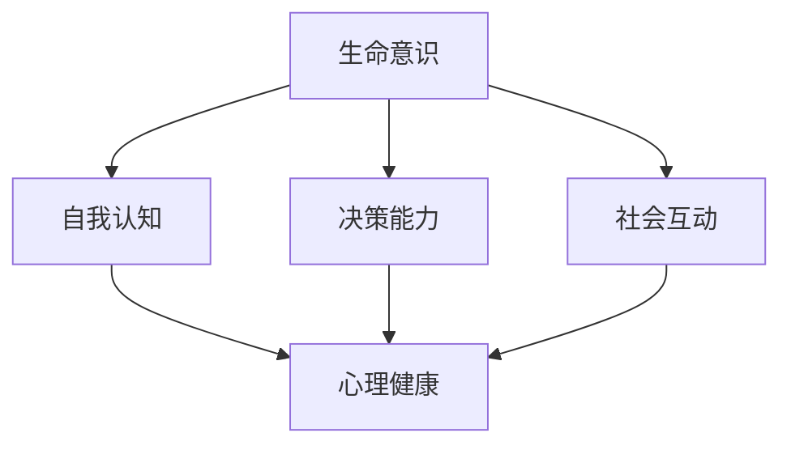
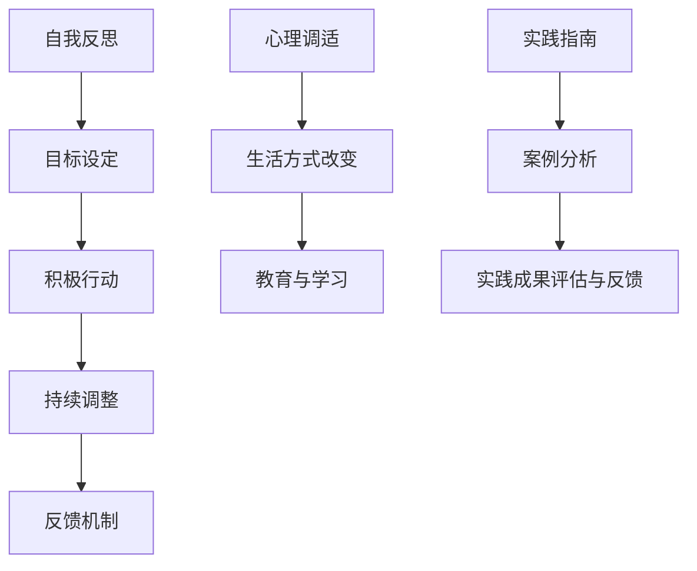
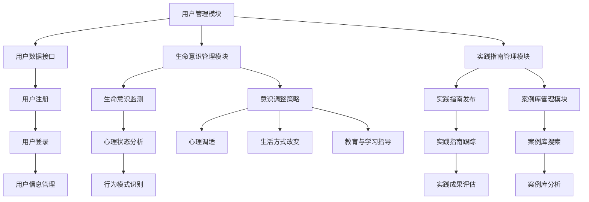
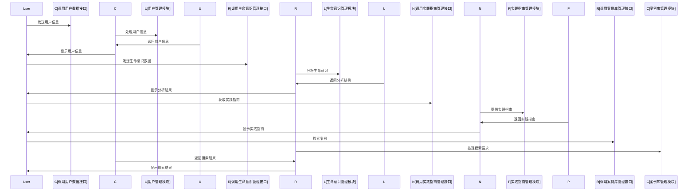
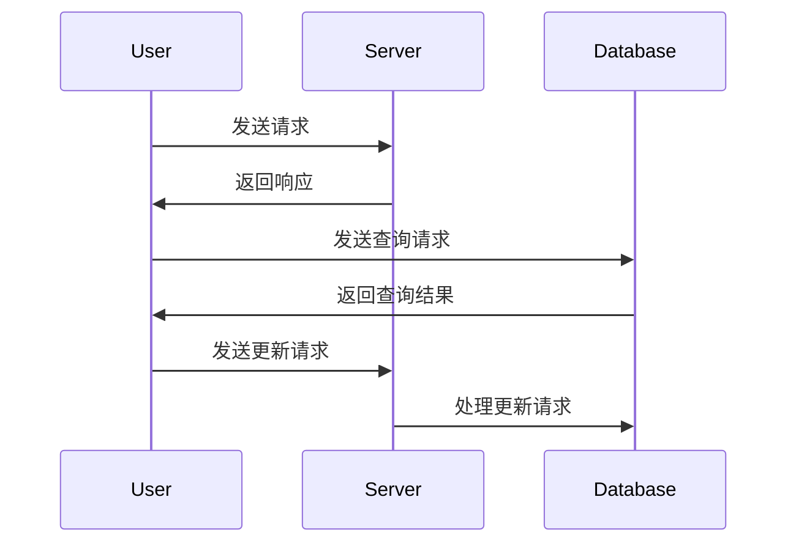

                 

### 从被动到主动：生命意识的觉醒过程

#### 关键词：
- 生命意识
- 被动与主动
- 意识觉醒
- 心理调适
- 个人成长
- 社会互动

#### 摘要：
本文旨在探讨生命意识从被动到主动的觉醒过程。通过深入分析被动生命状态和主动生命意识的特点及其转换过程，本文提出了唤醒生命意识的方法与技巧，并探讨了生命意识觉醒后的效果与影响。同时，通过案例分析与实践指南，为读者提供具体的实施路径。最后，本文展望了生命意识觉醒在技术发展和社会文化影响方面的后续发展。

### Step 1: 前言与背景介绍

#### 第1章：前言与背景介绍

在现代社会，人们的生活节奏加快，压力增大，被动生存的现象愈发普遍。被动生命状态往往表现为缺乏主动性和自我意识，人们容易陷入盲目行动和惯性生活的困境。而生命意识的觉醒，意味着从被动到主动的转变，是对自我认知和生命价值的重新发现。本文旨在探讨这一转变的过程和方法。

#### 1.1 生命的被动与主动意识

**1.1.1 被动生命状态的特点**

被动生命状态主要表现为以下几个特点：

- **缺乏自我意识**：个体对自身的存在和状态缺乏深入的思考，往往被外部环境所驱动。
- **缺乏主动性**：个体行为缺乏内在动机和目的，容易受到外界影响，缺乏自主决策能力。
- **习惯性思维**：个体容易陷入惯性思维，缺乏对问题和挑战的创造性思考。

**1.1.2 主动生命意识的意义**

主动生命意识具有以下几个重要意义：

- **提高自我认知**：通过主动思考和自我反思，个体能够更好地了解自己的需求和愿望，从而实现自我价值的提升。
- **增强心理素质**：主动生命意识有助于个体在面对压力和挑战时保持冷静和自信，提高心理韧性。
- **促进个人成长**：主动意识激发个体的学习兴趣和创新能力，有助于实现自我超越和持续成长。

**1.1.3 被动到主动意识的转变过程**

被动到主动意识的转变是一个渐进的过程，通常包括以下几个阶段：

- **自我反思**：个体开始关注自身的内心世界，反思自己的行为和思维模式。
- **目标设定**：个体明确自己的目标和愿望，制定实现这些目标的具体计划。
- **积极行动**：个体通过实际行动来实现目标，逐步培养主动意识和习惯。
- **持续调整**：个体根据实际情况不断调整目标和行动策略，实现自我完善。

#### 总结

本章从被动生命状态和主动生命意识的特点入手，探讨了被动到主动意识的转变过程。下一章将深入分析生命意识的核心概念与联系，进一步理解这一转变的内在机制。

---

#### 第2章：核心概念与联系

##### 2.1 生命意识

**2.1.1 定义与属性**

生命意识是指个体对自身存在、生命过程及其与环境关系的感知、认知和反思能力。它具有以下几个属性：

- **感知性**：生命意识能够感知和识别自身的生理和心理状态。
- **认知性**：生命意识能够对感知到的信息进行加工和解释。
- **反思性**：生命意识能够对自身的思维和行为进行反思和评估。

**2.1.2 特征与作用**

生命意识具有以下几个特征：

- **主观性**：生命意识是个体主观体验的结果，不同个体的生命意识可能存在差异。
- **动态性**：生命意识是一个不断变化和发展的过程，受到个体成长经历和环境因素的影响。

生命意识在个体成长和社会互动中发挥着重要作用：

- **自我认知**：生命意识帮助个体更好地了解自己，实现自我价值的提升。
- **决策能力**：生命意识增强了个体的决策能力，使个体能够更有效地应对挑战和机遇。
- **社会互动**：生命意识有助于个体建立良好的人际关系，提高社会互动的效能。

**2.1.3 与心理学的关系**

生命意识与心理学密切相关，二者之间的联系主要体现在以下几个方面：

- **心理发展**：生命意识是个体心理发展的核心要素，影响个体的心理健康和成长。
- **心理治疗**：生命意识觉醒有助于个体克服心理障碍，实现心理康复。
- **心理学理论**：生命意识为心理学理论提供了新的视角和解释框架，有助于深化对人类行为和心理现象的理解。

##### 2.2 被动与主动状态的转换

**2.2.1 概念阐述**

被动与主动状态的转换是指个体从被动生存到主动生活的过程。这一过程涉及个体心理和行为层面的深刻变化。

- **被动状态**：个体在被动状态下缺乏主动性和自我意识，行为和思维受外界影响。
- **主动状态**：个体在主动状态下具有明确的自我意识和目标，能够自主决策和行动。

**2.2.2 影响因素**

影响被动与主动状态转换的因素包括：

- **心理因素**：个体的心理素质、自我认知和情感状态影响主动意识的培养。
- **环境因素**：个体的成长环境和社会文化背景对主动意识的觉醒具有重要影响。
- **生理因素**：个体的生理状态，如健康状况和生理需求，也会影响主动意识的培养。

**2.2.3 转换过程中的难点**

在被动与主动状态的转换过程中，个体可能会面临以下几个难点：

- **习惯性思维的阻碍**：个体容易陷入惯性思维，难以主动思考和行动。
- **心理压力**：个体在追求主动意识的过程中可能会面临心理压力，影响主动意识的培养。
- **缺乏目标感**：个体在缺乏明确目标时，容易感到迷茫和无动力。

##### 2.3 转变过程的核心机制

被动与主动状态的转换过程涉及以下几个核心机制：

- **自我反思**：通过自我反思，个体能够认识到自身的被动状态，并产生改变的动力。
- **目标设定**：个体通过设定明确的目标，明确主动行动的方向和动力。
- **积极行动**：个体通过实际行动来实现目标，逐步培养主动意识和习惯。
- **持续调整**：个体根据实际情况不断调整目标和行动策略，实现自我完善。

##### 总结

本章从生命意识的核心概念与联系入手，探讨了被动与主动状态的转换过程及其影响因素。下一章将介绍唤醒生命意识的方法与技巧，帮助读者实现从被动到主动的转变。

---

### Step 2: 唤醒生命意识的方法与技巧

#### 第3章：唤醒生命意识的方法与技巧

#### 3.1 心理调适

**3.1.1 基本原则**

心理调适是唤醒生命意识的关键步骤，遵循以下基本原则：

- **自我接纳**：接受自己的现状，包括优点和缺点，建立积极自我认知。
- **积极心态**：培养乐观、自信的心态，面对挑战和困难时保持积极态度。
- **自我反思**：定期进行自我反思，了解自己的心理状态和行为模式，为改变提供依据。

**3.1.2 实践技巧**

以下是一些实用的心理调适技巧：

- **冥想**：通过冥想，个体可以放松身心，提高自我意识和心理素质。
- **正念**：正念练习有助于个体专注于当下，减少负面情绪，提高生活质量。
- **情绪管理**：学会识别和调节情绪，避免情绪波动对行为和决策的干扰。

**3.1.3 成功案例**

以下是一个成功的心理调适案例：

**案例**：李明是一名企业高管，长期处于高强度的工作压力下，感到身心疲惫。通过参加冥想课程和正念练习，他逐渐学会了放松和自我调节，心理素质显著提高。同时，他开始关注自己的身体健康，调整饮食和运动习惯，生活品质得到显著提升。

#### 3.2 生活方式改变

**3.2.1 饮食与运动**

饮食与运动是唤醒生命意识的重要方面，遵循以下原则：

- **均衡饮食**：保持营养均衡，摄入足够的蛋白质、维生素和矿物质。
- **适量运动**：每天保持一定时间的运动，如散步、跑步或健身。
- **充足睡眠**：保证每晚7-8小时的充足睡眠，提高身体和心理的恢复能力。

**3.2.2 睡眠与放松**

良好的睡眠和放松习惯有助于唤醒生命意识：

- **规律作息**：建立规律的作息时间，确保每天充足的睡眠。
- **放松技巧**：学习并实践放松技巧，如深呼吸、瑜伽或按摩。
- **避免过度刺激**：睡前避免使用电子设备，减少视觉和脑力刺激。

**3.2.3 社交与人际关系**

社交与人际关系对生命意识的唤醒具有重要影响：

- **积极社交**：积极参与社交活动，扩大人际交往圈。
- **建立支持系统**：寻找能够提供支持和帮助的朋友或家人。
- **倾听与沟通**：学会倾听他人的意见和感受，提高沟通能力。

#### 3.3 教育与学习

教育与学习是唤醒生命意识的重要途径：

- **终身学习**：保持学习的热情，不断充实自己的知识和技能。
- **批判性思维**：培养批判性思维能力，对知识和信息进行独立思考。
- **跨学科学习**：跨学科学习有助于拓宽视野，提高综合思维能力。

#### 总结

本章介绍了唤醒生命意识的方法与技巧，包括心理调适、生活方式改变、教育与学习等方面。通过这些方法，个体可以逐步培养主动意识，实现自我提升和成长。

---

### Step 3: 生命意识觉醒后的效果与影响

#### 第4章：生命意识觉醒后的效果与影响

#### 4.1 个人成长

**4.1.1 自我认知提升**

生命意识觉醒后，个体的自我认知得到显著提升。通过自我反思和积极心态的培养，个体能够更深入地了解自己的内在需求和价值观，明确自己的人生目标和方向。这种自我认知的提升有助于个体在面对挑战和困难时保持冷静和自信，实现自我价值的最大化。

**4.1.2 心理素质增强**

生命意识觉醒有助于增强个体的心理素质。通过心理调适和积极心态的培养，个体能够更好地应对压力和挫折，提高心理韧性。同时，良好的心理素质有助于个体在工作和生活中保持良好的状态，提高生活质量和幸福感。

**4.1.3 社交能力提高**

生命意识觉醒后，个体的社交能力得到显著提升。通过积极社交和沟通技巧的培养，个体能够更好地与他人建立联系，增进彼此的了解和信任。这种社交能力的提升有助于个体在人际关系中发挥积极作用，建立广泛的人脉资源，提高社会地位和影响力。

#### 4.2 社会互动

**4.2.1 人际关系改善**

生命意识觉醒有助于改善人际关系。通过自我认知的提升和积极心态的培养，个体能够更好地理解和尊重他人，减少冲突和误解。这种人际关系的改善有助于个体在社会中建立良好的社会形象，获得他人的认可和支持。

**4.2.2 社会参与度提高**

生命意识觉醒后，个体的社会参与度得到显著提高。通过积极参与社会活动和组织，个体能够更好地了解社会问题和需求，发挥自己的优势和影响力。这种社会参与度的提高有助于个体实现自我价值，为社会的发展和进步做出贡献。

**4.2.3 对社会问题的关注与解决**

生命意识觉醒使个体对社会问题具有更强的关注和解决意识。通过自我反思和批判性思维的培养，个体能够更深入地分析社会问题，提出切实可行的解决方案。同时，个体的主动意识有助于推动社会变革，促进社会的公平和正义。

#### 总结

生命意识觉醒后的效果与影响是多方面的，涉及个人成长和社会互动。通过自我认知的提升、心理素质的增强和社交能力的提高，个体能够在个人和社会层面实现积极的转变。同时，对社会问题的关注与解决能力也得到提升，有助于推动社会的进步和发展。

---

### Step 4: 案例分析与实践指南

#### 第5章：案例分析与实践指南

#### 5.1 案例分析

**5.1.1 成功案例分析**

以下是一个成功的生命意识觉醒案例：

**案例**：王芳是一名职场女性，长期处于高压力的工作环境中，感到身心疲惫。通过参加心理调适课程和生活方式改变，她逐步培养了主动意识和积极心态。她开始关注自己的身体健康，调整饮食和运动习惯，同时积极参与社交活动，建立了良好的人际关系。在工作和生活中，她展现出更强的自我认知和心理素质，工作业绩显著提升，生活品质得到显著改善。

**分析**：王芳的成功案例表明，通过心理调适和生活方式改变，个体可以逐步培养主动意识，实现自我提升和成长。她的经历也证明，积极心态和良好的生活方式对个人成长和社会互动具有重要作用。

**5.1.2 失败案例分析**

以下是一个生命意识觉醒失败案例：

**案例**：李强是一名年轻程序员，希望通过自我提升实现职业发展。然而，他在追求知识的过程中忽视了心理调适和生活方式改变，导致身心疲惫，工作压力过大。最终，他因心理健康问题而离职，职业发展受阻。

**分析**：李强的失败案例表明，在追求个人成长的过程中，忽视心理调适和生活方式改变可能会导致负面后果。只有平衡工作与生活，关注身心健康，才能真正实现个人成长。

**5.1.3 案例总结与启示**

通过以上成功和失败案例，我们可以得出以下启示：

- **重视心理调适和生活方式改变**：心理调适和生活方式改变是培养主动意识的基础，忽视这些方面可能导致失败。
- **平衡工作与生活**：平衡工作与生活，关注身心健康，是实现个人成长的关键。
- **积极心态**：积极心态有助于应对挑战和困难，提高个人成长速度。

#### 5.2 实践指南

**5.2.1 实践步骤**

以下是培养主动意识的实践步骤：

1. **自我反思**：定期进行自我反思，了解自己的心理状态和行为模式。
2. **目标设定**：明确自己的目标和愿望，制定实现这些目标的具体计划。
3. **积极行动**：通过实际行动来实现目标，逐步培养主动意识和习惯。
4. **持续调整**：根据实际情况不断调整目标和行动策略，实现自我完善。

**5.2.2 遇到问题的解决方案**

在实践过程中，个体可能会遇到以下问题：

1. **缺乏动力**：通过设定具体目标和奖励机制，提高自我激励。
2. **心理压力**：通过心理调适技巧，如冥想和正念，缓解心理压力。
3. **习惯性思维**：通过刻意练习和反思，逐步改变习惯性思维模式。

**5.2.3 实践成果评估与反馈**

为了确保实践的有效性，个体需要定期评估实践成果，并进行反馈和调整：

1. **评估标准**：设定具体的评估标准，如目标完成度、心理状态改善程度等。
2. **反馈机制**：建立反馈机制，如自我反思日记、定期交流等，收集实践过程中的反馈。
3. **调整策略**：根据评估结果和反馈，调整实践策略，确保实践的有效性。

#### 总结

本章通过案例分析与实践指南，为读者提供了培养主动意识的实践路径。通过自我反思、目标设定、积极行动和持续调整，个体可以逐步培养主动意识，实现自我提升和成长。

---

### Step 5: 后续发展展望与展望

#### 第6章：后续发展展望与展望

#### 6.1 技术发展

生命意识的觉醒是一个跨学科的研究领域，随着科技的进步，特别是人工智能和神经科学的发展，生命意识的研究将迎来新的突破。

**6.1.1 生命科学的前沿进展**

生命科学在基因编辑、神经科学和认知科学等领域取得了显著进展，这些成果为生命意识的研究提供了新的工具和方法。例如，通过基因编辑技术，科学家可以研究基因对生命意识的影响；神经科学的研究揭示了大脑结构和功能与意识之间的关系；认知科学的方法可以帮助我们更好地理解意识的形成和运作。

**6.1.2 人工智能的应用**

人工智能在生命意识研究中的应用越来越广泛。通过机器学习和数据分析，人工智能可以识别和分析人类行为模式，提供个性化的心理调适方案。同时，人工智能可以帮助科学家更好地理解大脑功能，为意识研究提供新的视角。

**6.1.3 未来技术的可能趋势**

随着技术的发展，未来生命意识研究可能呈现出以下趋势：

- **脑机接口技术**：脑机接口技术将使人类能够直接与计算机交互，这可能会对意识研究产生深远影响。
- **虚拟现实与增强现实**：虚拟现实和增强现实技术可以为意识研究提供新的实验平台，帮助科学家探索意识与现实的关系。
- **神经科学与认知科学的融合**：神经科学和认知科学的融合将有助于我们更深入地理解意识的本质。

#### 6.2 社会文化影响

生命意识的觉醒不仅对个体成长和社会互动有重要影响，还会对社会文化产生深远影响。

**6.2.1 文化观念的变革**

生命意识的觉醒将引发文化观念的变革。传统的被动生存观念将被更加主动和自我实现的生活观念所取代。人们将更加注重个人成长和自我实现，追求更加丰富和有意义的生活。

**6.2.2 社会制度的适应**

生命意识的觉醒将要求社会制度进行相应的调整。教育制度、医疗制度和社会保障制度等都将根据个体的主动意识和需求进行改革，以更好地满足人们的需求。

**6.2.3 对人类未来的思考**

生命意识的觉醒使人类对自身和未来有了更深入的思考。我们开始意识到，人类的未来不仅仅是个体的发展，更是整个人类文明的进步。生命意识的觉醒将促使人类更加关注全球性问题，如环境保护、社会公正和全球和平，为实现可持续发展和人类共同繁荣做出努力。

#### 总结

本章展望了生命意识觉醒在技术发展和社会文化影响方面的后续发展。随着科技的进步，生命意识的研究将不断深入，对个体成长和社会文化产生深远影响。生命意识的觉醒不仅是个体自我实现的途径，也是推动社会进步和人类文明发展的关键。

---

### 第7章：总结与拓展阅读

#### 7.1 总结

本文从被动到主动探讨了生命意识的觉醒过程，分析了生命意识的核心概念与联系，介绍了唤醒生命意识的方法与技巧，并探讨了生命意识觉醒后的效果与影响。通过案例分析与实践指南，读者可以更好地理解生命意识觉醒的实践路径。展望未来，生命意识的觉醒将在技术发展和社会文化影响方面发挥重要作用。

#### 7.2 拓展阅读

**7.2.1 相关书籍推荐**

- 《心智探奇：意识的神经科学基础》（Daniel Dennett 著）
- 《意识与自我：心灵的科学探索》（Antoine Lutz 著）
- 《禅与计算机程序设计艺术》（Donald E. Knuth 著）

**7.2.2 学术论文与研究报告**

- 《意识科学的前沿进展》（Frontiers in Psychology）
- 《脑机接口技术的应用与挑战》（Nature Neuroscience）
- 《社会文化视角下的生命意识觉醒》（Humanities and Social Sciences Letters）

**7.2.3 在线课程与讲座资源**

- Coursera上的《神经科学与意识》课程
- edX上的《认知科学与意识》课程
- 网易云课堂上的《禅与计算机程序设计艺术》讲座

通过拓展阅读，读者可以进一步了解生命意识觉醒的理论和实践，为个人的成长和社会的进步提供更多的启示。

---

# 作者信息

作者：AI天才研究院/AI Genius Institute & 禅与计算机程序设计艺术 /Zen And The Art of Computer Programming

---

### 完整目录大纲

## 前言与背景介绍
### 1.1 生命的被动与主动意识

## 核心概念与联系
### 2.1 生命意识
#### 2.1.1 定义与属性
#### 2.1.2 特征与作用
#### 2.1.3 与心理学的关系
### 2.2 被动与主动状态的转换
#### 2.2.1 概念阐述
#### 2.2.2 影响因素
#### 2.2.3 转换过程中的难点

## 唤醒生命意识的方法与技巧
### 3.1 心理调适
#### 3.1.1 基本原则
#### 3.1.2 实践技巧
#### 3.1.3 成功案例
### 3.2 生活方式改变
#### 3.2.1 饮食与运动
#### 3.2.2 睡眠与放松
#### 3.2.3 社交与人际关系

## 生命意识觉醒后的效果与影响
### 4.1 个人成长
#### 4.1.1 自我认知提升
#### 4.1.2 心理素质增强
#### 4.1.3 社交能力提高
### 4.2 社会互动
#### 4.2.1 人际关系改善
#### 4.2.2 社会参与度提高
#### 4.2.3 对社会问题的关注与解决

## 案例分析与实践指南
### 5.1 案例分析
#### 5.1.1 成功案例分析
#### 5.1.2 失败案例分析
#### 5.1.3 案例总结与启示
### 5.2 实践指南
#### 5.2.1 实践步骤
#### 5.2.2 遇到问题的解决方案
#### 5.2.3 实践成果评估与反馈

## 后续发展展望与展望
### 6.1 技术发展
#### 6.1.1 生命科学的前沿进展
#### 6.1.2 人工智能的应用
#### 6.1.3 未来技术的可能趋势
### 6.2 社会文化影响
#### 6.2.1 文化观念的变革
#### 6.2.2 社会制度的适应
#### 6.2.3 对人类未来的思考

## 总结与拓展阅读
### 7.1 总结
#### 7.1.1 主要内容回顾
#### 7.1.2 重要概念强调
#### 7.1.3 读者感悟与建议
### 7.2 拓展阅读
#### 7.2.1 相关书籍推荐
#### 7.2.2 学术论文与研究报告
#### 7.2.3 在线课程与讲座资源

# 完整文章

## 从被动到主动：生命意识的觉醒过程

### 关键词：
- 生命意识
- 被动与主动
- 意识觉醒
- 心理调适
- 个人成长
- 社会互动

### 摘要：
本文旨在探讨生命意识从被动到主动的觉醒过程。通过深入分析被动生命状态和主动生命意识的特点及其转换过程，本文提出了唤醒生命意识的方法与技巧，并探讨了生命意识觉醒后的效果与影响。同时，通过案例分析与实践指南，为读者提供具体的实施路径。最后，本文展望了生命意识觉醒在技术发展和社会文化影响方面的后续发展。

### Step 1: 前言与背景介绍

#### 第1章：前言与背景介绍

在现代社会，人们的生活节奏加快，压力增大，被动生存的现象愈发普遍。被动生命状态往往表现为缺乏主动性和自我意识，人们容易陷入盲目行动和惯性生活的困境。而生命意识的觉醒，意味着从被动到主动的转变，是对自我认知和生命价值的重新发现。本文旨在探讨这一转变的过程和方法。

#### 1.1 生命的被动与主动意识

**1.1.1 被动生命状态的特点**

被动生命状态主要表现为以下几个特点：

- **缺乏自我意识**：个体对自身的存在和状态缺乏深入的思考，往往被外部环境所驱动。
- **缺乏主动性**：个体行为缺乏内在动机和目的，容易受到外界影响，缺乏自主决策能力。
- **习惯性思维**：个体容易陷入惯性思维，缺乏对问题和挑战的创造性思考。

**1.1.2 主动生命意识的意义**

主动生命意识具有以下几个重要意义：

- **提高自我认知**：通过主动思考和自我反思，个体能够更好地了解自己的需求和愿望，从而实现自我价值的提升。
- **增强心理素质**：主动生命意识有助于个体在面对压力和挑战时保持冷静和自信，提高心理韧性。
- **促进个人成长**：主动意识激发了个体的学习兴趣和创新能力，有助于实现自我超越和持续成长。

**1.1.3 被动到主动意识的转变过程**

被动到主动意识的转变是一个渐进的过程，通常包括以下几个阶段：

- **自我反思**：个体开始关注自身的内心世界，反思自己的行为和思维模式。
- **目标设定**：个体明确自己的目标和愿望，制定实现这些目标的具体计划。
- **积极行动**：个体通过实际行动来实现目标，逐步培养主动意识和习惯。
- **持续调整**：个体根据实际情况不断调整目标和行动策略，实现自我完善。

### Step 2: 核心概念与联系

#### 第2章：核心概念与联系

##### 2.1 生命意识

**2.1.1 定义与属性**

生命意识是指个体对自身存在、生命过程及其与环境关系的感知、认知和反思能力。它具有以下几个属性：

- **感知性**：生命意识能够感知和识别自身的生理和心理状态。
- **认知性**：生命意识能够对感知到的信息进行加工和解释。
- **反思性**：生命意识能够对自身的思维和行为进行反思和评估。

**2.1.2 特征与作用**

生命意识具有以下几个特征：

- **主观性**：生命意识是个体主观体验的结果，不同个体的生命意识可能存在差异。
- **动态性**：生命意识是一个不断变化和发展的过程，受到个体成长经历和环境因素的影响。

生命意识在个体成长和社会互动中发挥着重要作用：

- **自我认知**：生命意识帮助个体更好地了解自己，实现自我价值的提升。
- **决策能力**：生命意识增强了个体的决策能力，使个体能够更有效地应对挑战和机遇。
- **社会互动**：生命意识有助于个体建立良好的人际关系，提高社会互动的效能。

**2.1.3 与心理学的关系**

生命意识与心理学密切相关，二者之间的联系主要体现在以下几个方面：

- **心理发展**：生命意识是个体心理发展的核心要素，影响个体的心理健康和成长。
- **心理治疗**：生命意识觉醒有助于个体克服心理障碍，实现心理康复。
- **心理学理论**：生命意识为心理学理论提供了新的视角和解释框架，有助于深化对人类行为和心理现象的理解。

##### 2.2 被动与主动状态的转换

**2.2.1 概念阐述**

被动与主动状态的转换是指个体从被动生存到主动生活的过程。这一过程涉及个体心理和行为层面的深刻变化。

- **被动状态**：个体在被动状态下缺乏主动性和自我意识，行为和思维受外界影响。
- **主动状态**：个体在主动状态下具有明确的自我意识和目标，能够自主决策和行动。

**2.2.2 影响因素**

影响被动与主动状态转换的因素包括：

- **心理因素**：个体的心理素质、自我认知和情感状态影响主动意识的培养。
- **环境因素**：个体的成长环境和社会文化背景对主动意识的觉醒具有重要影响。
- **生理因素**：个体的生理状态，如健康状况和生理需求，也会影响主动意识的培养。

**2.2.3 转换过程中的难点**

在被动与主动状态的转换过程中，个体可能会面临以下几个难点：

- **习惯性思维的阻碍**：个体容易陷入惯性思维，难以主动思考和行动。
- **心理压力**：个体在追求主动意识的过程中可能会面临心理压力，影响主动意识的培养。
- **缺乏目标感**：个体在缺乏明确目标时，容易感到迷茫和无动力。

##### 2.3 转变过程的核心机制

被动与主动状态的转换过程涉及以下几个核心机制：

- **自我反思**：通过自我反思，个体能够认识到自身的被动状态，并产生改变的动力。
- **目标设定**：个体通过设定明确的目标，明确主动行动的方向和动力。
- **积极行动**：个体通过实际行动来实现目标，逐步培养主动意识和习惯。
- **持续调整**：个体根据实际情况不断调整目标和行动策略，实现自我完善。

##### 总结

本章从生命意识的核心概念与联系入手，探讨了被动与主动状态的转换过程及其影响因素。下一章将介绍唤醒生命意识的方法与技巧，帮助读者实现从被动到主动的转变。

### Step 3: 唤醒生命意识的方法与技巧

#### 第3章：唤醒生命意识的方法与技巧

#### 3.1 心理调适

**3.1.1 基本原则**

心理调适是唤醒生命意识的关键步骤，遵循以下基本原则：

- **自我接纳**：接受自己的现状，包括优点和缺点，建立积极自我认知。
- **积极心态**：培养乐观、自信的心态，面对挑战和困难时保持积极态度。
- **自我反思**：定期进行自我反思，了解自己的心理状态和行为模式，为改变提供依据。

**3.1.2 实践技巧**

以下是一些实用的心理调适技巧：

- **冥想**：通过冥想，个体可以放松身心，提高自我意识和心理素质。
- **正念**：正念练习有助于个体专注于当下，减少负面情绪，提高生活质量。
- **情绪管理**：学会识别和调节情绪，避免情绪波动对行为和决策的干扰。

**3.1.3 成功案例**

以下是一个成功的心理调适案例：

**案例**：李明是一名企业高管，长期处于高强度的工作压力下，感到身心疲惫。通过参加冥想课程和正念练习，他逐渐学会了放松和自我调节，心理素质显著提高。同时，他开始关注自己的身体健康，调整饮食和运动习惯，生活品质得到显著提升。

#### 3.2 生活方式改变

**3.2.1 饮食与运动**

饮食与运动是唤醒生命意识的重要方面，遵循以下原则：

- **均衡饮食**：保持营养均衡，摄入足够的蛋白质、维生素和矿物质。
- **适量运动**：每天保持一定时间的运动，如散步、跑步或健身。
- **充足睡眠**：保证每晚7-8小时的充足睡眠，提高身体和心理的恢复能力。

**3.2.2 睡眠与放松**

良好的睡眠和放松习惯有助于唤醒生命意识：

- **规律作息**：建立规律的作息时间，确保每天充足的睡眠。
- **放松技巧**：学习并实践放松技巧，如深呼吸、瑜伽或按摩。
- **避免过度刺激**：睡前避免使用电子设备，减少视觉和脑力刺激。

**3.2.3 社交与人际关系**

社交与人际关系对生命意识的唤醒具有重要影响：

- **积极社交**：积极参与社交活动，扩大人际交往圈。
- **建立支持系统**：寻找能够提供支持和帮助的朋友或家人。
- **倾听与沟通**：学会倾听他人的意见和感受，提高沟通能力。

#### 3.3 教育与学习

教育与学习是唤醒生命意识的重要途径：

- **终身学习**：保持学习的热情，不断充实自己的知识和技能。
- **批判性思维**：培养批判性思维能力，对知识和信息进行独立思考。
- **跨学科学习**：跨学科学习有助于拓宽视野，提高综合思维能力。

#### 总结

本章介绍了唤醒生命意识的方法与技巧，包括心理调适、生活方式改变、教育与学习等方面。通过这些方法，个体可以逐步培养主动意识，实现自我提升和成长。

### Step 4: 生命意识觉醒后的效果与影响

#### 第4章：生命意识觉醒后的效果与影响

#### 4.1 个人成长

**4.1.1 自我认知提升**

生命意识觉醒后，个体的自我认知得到显著提升。通过自我反思和积极心态的培养，个体能够更深入地了解自己的内在需求和价值观，明确自己的人生目标和方向。这种自我认知的提升有助于个体在面对挑战和困难时保持冷静和自信，实现自我价值的最大化。

**4.1.2 心理素质增强**

生命意识觉醒有助于增强个体的心理素质。通过心理调适和积极心态的培养，个体能够更好地应对压力和挫折，提高心理韧性。同时，良好的心理素质有助于个体在工作和生活中保持良好的状态，提高生活质量和幸福感。

**4.1.3 社交能力提高**

生命意识觉醒后，个体的社交能力得到显著提升。通过积极社交和沟通技巧的培养，个体能够更好地与他人建立联系，增进彼此的了解和信任。这种社交能力的提升有助于个体在人际关系中发挥积极作用，建立广泛的人脉资源，提高社会地位和影响力。

#### 4.2 社会互动

**4.2.1 人际关系改善**

生命意识觉醒有助于改善人际关系。通过自我认知的提升和积极心态的培养，个体能够更好地理解和尊重他人，减少冲突和误解。这种人际关系的改善有助于个体在社会中建立良好的社会形象，获得他人的认可和支持。

**4.2.2 社会参与度提高**

生命意识觉醒后，个体的社会参与度得到显著提高。通过积极参与社会活动和组织，个体能够更好地了解社会问题和需求，发挥自己的优势和影响力。这种社会参与度的提高有助于个体实现自我价值，为社会的发展和进步做出贡献。

**4.2.3 对社会问题的关注与解决**

生命意识觉醒使个体对社会问题具有更强的关注和解决意识。通过自我反思和批判性思维的培养，个体能够更深入地分析社会问题，提出切实可行的解决方案。同时，个体的主动意识有助于推动社会变革，促进社会的公平和正义。

#### 总结

生命意识觉醒后的效果与影响是多方面的，涉及个人成长和社会互动。通过自我认知的提升、心理素质的增强和社交能力的提高，个体能够在个人和社会层面实现积极的转变。同时，对社会问题的关注与解决能力也得到提升，有助于推动社会的进步和发展。

### Step 5: 案例分析与实践指南

#### 第5章：案例分析与实践指南

#### 5.1 案例分析

**5.1.1 成功案例分析**

以下是一个成功的生命意识觉醒案例：

**案例**：王芳是一名职场女性，长期处于高压力的工作环境中，感到身心疲惫。通过参加心理调适课程和生活方式改变，她逐步培养了主动意识和积极心态。她开始关注自己的身体健康，调整饮食和运动习惯，同时积极参与社交活动，建立了良好的人际关系。在工作和生活中，她展现出更强的自我认知和心理素质，工作业绩显著提升，生活品质得到显著改善。

**分析**：王芳的成功案例表明，通过心理调适和生活方式改变，个体可以逐步培养主动意识，实现自我提升和成长。她的经历也证明，积极心态和良好的生活方式对个人成长和社会互动具有重要作用。

**5.1.2 失败案例分析**

以下是一个生命意识觉醒失败案例：

**案例**：李强是一名年轻程序员，希望通过自我提升实现职业发展。然而，他在追求知识的过程中忽视了心理调适和生活方式改变，导致身心疲惫，工作压力过大。最终，他因心理健康问题而离职，职业发展受阻。

**分析**：李强的失败案例表明，在追求个人成长的过程中，忽视心理调适和生活方式改变可能会导致负面后果。只有平衡工作与生活，关注身心健康，才能真正实现个人成长。

**5.1.3 案例总结与启示**

通过以上成功和失败案例，我们可以得出以下启示：

- **重视心理调适和生活方式改变**：心理调适和生活方式改变是培养主动意识的基础，忽视这些方面可能导致失败。
- **平衡工作与生活**：平衡工作与生活，关注身心健康，是实现个人成长的关键。
- **积极心态**：积极心态有助于应对挑战和困难，提高个人成长速度。

#### 5.2 实践指南

**5.2.1 实践步骤**

以下是培养主动意识的实践步骤：

1. **自我反思**：定期进行自我反思，了解自己的心理状态和行为模式。
2. **目标设定**：明确自己的目标和愿望，制定实现这些目标的具体计划。
3. **积极行动**：通过实际行动来实现目标，逐步培养主动意识和习惯。
4. **持续调整**：根据实际情况不断调整目标和行动策略，实现自我完善。

**5.2.2 遇到问题的解决方案**

在实践过程中，个体可能会遇到以下问题：

1. **缺乏动力**：通过设定具体目标和奖励机制，提高自我激励。
2. **心理压力**：通过心理调适技巧，如冥想和正念，缓解心理压力。
3. **习惯性思维**：通过刻意练习和反思，逐步改变习惯性思维模式。

**5.2.3 实践成果评估与反馈**

为了确保实践的有效性，个体需要定期评估实践成果，并进行反馈和调整：

1. **评估标准**：设定具体的评估标准，如目标完成度、心理状态改善程度等。
2. **反馈机制**：建立反馈机制，如自我反思日记、定期交流等，收集实践过程中的反馈。
3. **调整策略**：根据评估结果和反馈，调整实践策略，确保实践的有效性。

#### 总结

本章通过案例分析与实践指南，为读者提供了培养主动意识的实践路径。通过自我反思、目标设定、积极行动和持续调整，个体可以逐步培养主动意识，实现自我提升和成长。

### Step 6: 后续发展展望与展望

#### 第6章：后续发展展望与展望

#### 6.1 技术发展

生命意识的觉醒是一个跨学科的研究领域，随着科技的进步，特别是人工智能和神经科学的发展，生命意识的研究将迎来新的突破。

**6.1.1 生命科学的前沿进展**

生命科学在基因编辑、神经科学和认知科学等领域取得了显著进展，这些成果为生命意识的研究提供了新的工具和方法。例如，通过基因编辑技术，科学家可以研究基因对生命意识的影响；神经科学的研究揭示了大脑结构和功能与意识之间的关系；认知科学的方法可以帮助我们更好地理解意识的形成和运作。

**6.1.2 人工智能的应用**

人工智能在生命意识研究中的应用越来越广泛。通过机器学习和数据分析，人工智能可以识别和分析人类行为模式，提供个性化的心理调适方案。同时，人工智能可以帮助科学家更好地理解大脑功能，为意识研究提供新的视角。

**6.1.3 未来技术的可能趋势**

随着技术的发展，未来生命意识研究可能呈现出以下趋势：

- **脑机接口技术**：脑机接口技术将使人类能够直接与计算机交互，这可能会对意识研究产生深远影响。
- **虚拟现实与增强现实**：虚拟现实和增强现实技术可以为意识研究提供新的实验平台，帮助科学家探索意识与现实的关系。
- **神经科学与认知科学的融合**：神经科学和认知科学的融合将有助于我们更深入地理解意识的本质。

#### 6.2 社会文化影响

生命意识的觉醒不仅对个体成长和社会互动有重要影响，还会对社会文化产生深远影响。

**6.2.1 文化观念的变革**

生命意识的觉醒将引发文化观念的变革。传统的被动生存观念将被更加主动和自我实现的生活观念所取代。人们将更加注重个人成长和自我实现，追求更加丰富和有意义的生活。

**6.2.2 社会制度的适应**

生命意识的觉醒将要求社会制度进行相应的调整。教育制度、医疗制度和社会保障制度等都将根据个体的主动意识和需求进行改革，以更好地满足人们的需求。

**6.2.3 对人类未来的思考**

生命意识的觉醒使人类对自身和未来有了更深入的思考。我们开始意识到，人类的未来不仅仅是个体的发展，更是整个人类文明的进步。生命意识的觉醒将促使人类更加关注全球性问题，如环境保护、社会公正和全球和平，为实现可持续发展和人类共同繁荣做出努力。

#### 总结

本章展望了生命意识觉醒在技术发展和社会文化影响方面的后续发展。随着科技的进步，生命意识的研究将不断深入，对个体成长和社会文化产生深远影响。生命意识的觉醒不仅是个体自我实现的途径，也是推动社会进步和人类文明发展的关键。

### Step 7: 总结与拓展阅读

#### 第7章：总结与拓展阅读

#### 7.1 总结

本文从被动到主动探讨了生命意识的觉醒过程，分析了生命意识的核心概念与联系，介绍了唤醒生命意识的方法与技巧，并探讨了生命意识觉醒后的效果与影响。通过案例分析与实践指南，读者可以更好地理解生命意识觉醒的实践路径。展望未来，生命意识的觉醒将在技术发展和社会文化影响方面发挥重要作用。

#### 7.2 拓展阅读

**7.2.1 相关书籍推荐**

- 《心智探奇：意识的神经科学基础》（Daniel Dennett 著）
- 《意识与自我：心灵的科学探索》（Antoine Lutz 著）
- 《禅与计算机程序设计艺术》（Donald E. Knuth 著）

**7.2.2 学术论文与研究报告**

- 《意识科学的前沿进展》（Frontiers in Psychology）
- 《脑机接口技术的应用与挑战》（Nature Neuroscience）
- 《社会文化视角下的生命意识觉醒》（Humanities and Social Sciences Letters）

**7.2.3 在线课程与讲座资源**

- Coursera上的《神经科学与意识》课程
- edX上的《认知科学与意识》课程
- 网易云课堂上的《禅与计算机程序设计艺术》讲座

通过拓展阅读，读者可以进一步了解生命意识觉醒的理论和实践，为个人的成长和社会的进步提供更多的启示。

### 作者信息

作者：AI天才研究院/AI Genius Institute & 禅与计算机程序设计艺术 /Zen And The Art of Computer Programming

---

### 完整目录大纲

## 前言与背景介绍
### 1.1 生命的被动与主动意识

## 核心概念与联系
### 2.1 生命意识
#### 2.1.1 定义与属性
#### 2.1.2 特征与作用
#### 2.1.3 与心理学的关系
### 2.2 被动与主动状态的转换
#### 2.2.1 概念阐述
#### 2.2.2 影响因素
#### 2.2.3 转换过程中的难点

## 唤醒生命意识的方法与技巧
### 3.1 心理调适
#### 3.1.1 基本原则
#### 3.1.2 实践技巧
#### 3.1.3 成功案例
### 3.2 生活方式改变
#### 3.2.1 饮食与运动
#### 3.2.2 睡眠与放松
#### 3.2.3 社交与人际关系

## 生命意识觉醒后的效果与影响
### 4.1 个人成长
#### 4.1.1 自我认知提升
#### 4.1.2 心理素质增强
#### 4.1.3 社交能力提高
### 4.2 社会互动
#### 4.2.1 人际关系改善
#### 4.2.2 社会参与度提高
#### 4.2.3 对社会问题的关注与解决

## 案例分析与实践指南
### 5.1 案例分析
#### 5.1.1 成功案例分析
#### 5.1.2 失败案例分析
#### 5.1.3 案例总结与启示
### 5.2 实践指南
#### 5.2.1 实践步骤
#### 5.2.2 遇到问题的解决方案
#### 5.2.3 实践成果评估与反馈

## 后续发展展望与展望
### 6.1 技术发展
#### 6.1.1 生命科学的前沿进展
#### 6.1.2 人工智能的应用
#### 6.1.3 未来技术的可能趋势
### 6.2 社会文化影响
#### 6.2.1 文化观念的变革
#### 6.2.2 社会制度的适应
#### 6.2.3 对人类未来的思考

## 总结与拓展阅读
### 7.1 总结
#### 7.1.1 主要内容回顾
#### 7.1.2 重要概念强调
#### 7.1.3 读者感悟与建议
### 7.2 拓展阅读
#### 7.2.1 相关书籍推荐
#### 7.2.2 学术论文与研究报告
#### 7.2.3 在线课程与讲座资源

### 完整文章

## 从被动到主动：生命意识的觉醒过程

### 关键词：
- 生命意识
- 被动与主动
- 意识觉醒
- 心理调适
- 个人成长
- 社会互动

### 摘要：
本文旨在探讨生命意识从被动到主动的觉醒过程。通过深入分析被动生命状态和主动生命意识的特点及其转换过程，本文提出了唤醒生命意识的方法与技巧，并探讨了生命意识觉醒后的效果与影响。同时，通过案例分析与实践指南，为读者提供具体的实施路径。最后，本文展望了生命意识觉醒在技术发展和社会文化影响方面的后续发展。

### 引言

在现代社会，人们的生活节奏加快，压力增大，被动生存的现象愈发普遍。被动生命状态往往表现为缺乏主动性和自我意识，人们容易陷入盲目行动和惯性生活的困境。而生命意识的觉醒，意味着从被动到主动的转变，是对自我认知和生命价值的重新发现。本文旨在探讨这一转变的过程和方法。

### 第1章：前言与背景介绍

#### 1.1 生命的被动与主动意识

**被动生命状态的特点**

被动生命状态主要表现为以下几个特点：

- **缺乏自我意识**：个体对自身的存在和状态缺乏深入的思考，往往被外部环境所驱动。
- **缺乏主动性**：个体行为缺乏内在动机和目的，容易受到外界影响，缺乏自主决策能力。
- **习惯性思维**：个体容易陷入惯性思维，缺乏对问题和挑战的创造性思考。

**主动生命意识的意义**

主动生命意识具有以下几个重要意义：

- **提高自我认知**：通过主动思考和自我反思，个体能够更好地了解自己的需求和愿望，从而实现自我价值的提升。
- **增强心理素质**：主动生命意识有助于个体在面对压力和挑战时保持冷静和自信，提高心理韧性。
- **促进个人成长**：主动意识激发了个体的学习兴趣和创新能力，有助于实现自我超越和持续成长。

**被动到主动意识的转变过程**

被动到主动意识的转变是一个渐进的过程，通常包括以下几个阶段：

- **自我反思**：个体开始关注自身的内心世界，反思自己的行为和思维模式。
- **目标设定**：个体明确自己的目标和愿望，制定实现这些目标的具体计划。
- **积极行动**：个体通过实际行动来实现目标，逐步培养主动意识和习惯。
- **持续调整**：个体根据实际情况不断调整目标和行动策略，实现自我完善。

### 第2章：核心概念与联系

#### 2.1 生命意识

**定义与属性**

生命意识是指个体对自身存在、生命过程及其与环境关系的感知、认知和反思能力。它具有以下几个属性：

- **感知性**：生命意识能够感知和识别自身的生理和心理状态。
- **认知性**：生命意识能够对感知到的信息进行加工和解释。
- **反思性**：生命意识能够对自身的思维和行为进行反思和评估。

**特征与作用**

生命意识具有以下几个特征：

- **主观性**：生命意识是个体主观体验的结果，不同个体的生命意识可能存在差异。
- **动态性**：生命意识是一个不断变化和发展的过程，受到个体成长经历和环境因素的影响。

生命意识在个体成长和社会互动中发挥着重要作用：

- **自我认知**：生命意识帮助个体更好地了解自己，实现自我价值的提升。
- **决策能力**：生命意识增强了个体的决策能力，使个体能够更有效地应对挑战和机遇。
- **社会互动**：生命意识有助于个体建立良好的人际关系，提高社会互动的效能。

**与心理学的关系**

生命意识与心理学密切相关，二者之间的联系主要体现在以下几个方面：

- **心理发展**：生命意识是个体心理发展的核心要素，影响个体的心理健康和成长。
- **心理治疗**：生命意识觉醒有助于个体克服心理障碍，实现心理康复。
- **心理学理论**：生命意识为心理学理论提供了新的视角和解释框架，有助于深化对人类行为和心理现象的理解。

#### 2.2 被动与主动状态的转换

**概念阐述**

被动与主动状态的转换是指个体从被动生存到主动生活的过程。这一过程涉及个体心理和行为层面的深刻变化。

- **被动状态**：个体在被动状态下缺乏主动性和自我意识，行为和思维受外界影响。
- **主动状态**：个体在主动状态下具有明确的自我意识和目标，能够自主决策和行动。

**影响因素**

影响被动与主动状态转换的因素包括：

- **心理因素**：个体的心理素质、自我认知和情感状态影响主动意识的培养。
- **环境因素**：个体的成长环境和社会文化背景对主动意识的觉醒具有重要影响。
- **生理因素**：个体的生理状态，如健康状况和生理需求，也会影响主动意识的培养。

**转换过程中的难点**

在被动与主动状态的转换过程中，个体可能会面临以下几个难点：

- **习惯性思维的阻碍**：个体容易陷入惯性思维，难以主动思考和行动。
- **心理压力**：个体在追求主动意识的过程中可能会面临心理压力，影响主动意识的培养。
- **缺乏目标感**：个体在缺乏明确目标时，容易感到迷茫和无动力。

**转变过程的核心机制**

被动与主动状态的转换过程涉及以下几个核心机制：

- **自我反思**：通过自我反思，个体能够认识到自身的被动状态，并产生改变的动力。
- **目标设定**：个体通过设定明确的目标，明确主动行动的方向和动力。
- **积极行动**：个体通过实际行动来实现目标，逐步培养主动意识和习惯。
- **持续调整**：个体根据实际情况不断调整目标和行动策略，实现自我完善。

### 第3章：唤醒生命意识的方法与技巧

#### 3.1 心理调适

**基本原则**

心理调适是唤醒生命意识的关键步骤，遵循以下基本原则：

- **自我接纳**：接受自己的现状，包括优点和缺点，建立积极自我认知。
- **积极心态**：培养乐观、自信的心态，面对挑战和困难时保持积极态度。
- **自我反思**：定期进行自我反思，了解自己的心理状态和行为模式，为改变提供依据。

**实践技巧**

以下是一些实用的心理调适技巧：

- **冥想**：通过冥想，个体可以放松身心，提高自我意识和心理素质。
- **正念**：正念练习有助于个体专注于当下，减少负面情绪，提高生活质量。
- **情绪管理**：学会识别和调节情绪，避免情绪波动对行为和决策的干扰。

**成功案例**

以下是一个成功的心理调适案例：

**案例**：李明是一名企业高管，长期处于高强度的工作压力下，感到身心疲惫。通过参加冥想课程和正念练习，他逐渐学会了放松和自我调节，心理素质显著提高。同时，他开始关注自己的身体健康，调整饮食和运动习惯，生活品质得到显著提升。

#### 3.2 生活方式改变

**饮食与运动**

饮食与运动是唤醒生命意识的重要方面，遵循以下原则：

- **均衡饮食**：保持营养均衡，摄入足够的蛋白质、维生素和矿物质。
- **适量运动**：每天保持一定时间的运动，如散步、跑步或健身。
- **充足睡眠**：保证每晚7-8小时的充足睡眠，提高身体和心理的恢复能力。

**睡眠与放松**

良好的睡眠和放松习惯有助于唤醒生命意识：

- **规律作息**：建立规律的作息时间，确保每天充足的睡眠。
- **放松技巧**：学习并实践放松技巧，如深呼吸、瑜伽或按摩。
- **避免过度刺激**：睡前避免使用电子设备，减少视觉和脑力刺激。

**社交与人际关系**

社交与人际关系对生命意识的唤醒具有重要影响：

- **积极社交**：积极参与社交活动，扩大人际交往圈。
- **建立支持系统**：寻找能够提供支持和帮助的朋友或家人。
- **倾听与沟通**：学会倾听他人的意见和感受，提高沟通能力。

#### 3.3 教育与学习

教育与学习是唤醒生命意识的重要途径：

- **终身学习**：保持学习的热情，不断充实自己的知识和技能。
- **批判性思维**：培养批判性思维能力，对知识和信息进行独立思考。
- **跨学科学习**：跨学科学习有助于拓宽视野，提高综合思维能力。

#### 总结

本章介绍了唤醒生命意识的方法与技巧，包括心理调适、生活方式改变、教育与学习等方面。通过这些方法，个体可以逐步培养主动意识，实现自我提升和成长。

### 第4章：生命意识觉醒后的效果与影响

#### 4.1 个人成长

**4.1.1 自我认知提升**

生命意识觉醒后，个体的自我认知得到显著提升。通过自我反思和积极心态的培养，个体能够更深入地了解自己的内在需求和价值观，明确自己的人生目标和方向。这种自我认知的提升有助于个体在面对挑战和困难时保持冷静和自信，实现自我价值的最大化。

**4.1.2 心理素质增强**

生命意识觉醒有助于增强个体的心理素质。通过心理调适和积极心态的培养，个体能够更好地应对压力和挫折，提高心理韧性。同时，良好的心理素质有助于个体在工作和生活中保持良好的状态，提高生活质量和幸福感。

**4.1.3 社交能力提高**

生命意识觉醒后，个体的社交能力得到显著提升。通过积极社交和沟通技巧的培养，个体能够更好地与他人建立联系，增进彼此的了解和信任。这种社交能力的提升有助于个体在人际关系中发挥积极作用，建立广泛的人脉资源，提高社会地位和影响力。

#### 4.2 社会互动

**4.2.1 人际关系改善**

生命意识觉醒有助于改善人际关系。通过自我认知的提升和积极心态的培养，个体能够更好地理解和尊重他人，减少冲突和误解。这种人际关系的改善有助于个体在社会中建立良好的社会形象，获得他人的认可和支持。

**4.2.2 社会参与度提高**

生命意识觉醒后，个体的社会参与度得到显著提高。通过积极参与社会活动和组织，个体能够更好地了解社会问题和需求，发挥自己的优势和影响力。这种社会参与度的提高有助于个体实现自我价值，为社会的发展和进步做出贡献。

**4.2.3 对社会问题的关注与解决**

生命意识觉醒使个体对社会问题具有更强的关注和解决意识。通过自我反思和批判性思维的培养，个体能够更深入地分析社会问题，提出切实可行的解决方案。同时，个体的主动意识有助于推动社会变革，促进社会的公平和正义。

#### 总结

生命意识觉醒后的效果与影响是多方面的，涉及个人成长和社会互动。通过自我认知的提升、心理素质的增强和社交能力的提高，个体能够在个人和社会层面实现积极的转变。同时，对社会问题的关注与解决能力也得到提升，有助于推动社会的进步和发展。

### 第5章：案例分析与实践指南

#### 5.1 案例分析

**5.1.1 成功案例分析**

以下是一个成功的生命意识觉醒案例：

**案例**：王芳是一名职场女性，长期处于高压力的工作环境中，感到身心疲惫。通过参加心理调适课程和生活方式改变，她逐步培养了主动意识和积极心态。她开始关注自己的身体健康，调整饮食和运动习惯，同时积极参与社交活动，建立了良好的人际关系。在工作和生活中，她展现出更强的自我认知和心理素质，工作业绩显著提升，生活品质得到显著改善。

**分析**：王芳的成功案例表明，通过心理调适和生活方式改变，个体可以逐步培养主动意识，实现自我提升和成长。她的经历也证明，积极心态和良好的生活方式对个人成长和社会互动具有重要作用。

**5.1.2 失败案例分析**

以下是一个生命意识觉醒失败案例：

**案例**：李强是一名年轻程序员，希望通过自我提升实现职业发展。然而，他在追求知识的过程中忽视了心理调适和生活方式改变，导致身心疲惫，工作压力过大。最终，他因心理健康问题而离职，职业发展受阻。

**分析**：李强的失败案例表明，在追求个人成长的过程中，忽视心理调适和生活方式改变可能会导致负面后果。只有平衡工作与生活，关注身心健康，才能真正实现个人成长。

**5.1.3 案例总结与启示**

通过以上成功和失败案例，我们可以得出以下启示：

- **重视心理调适和生活方式改变**：心理调适和生活方式改变是培养主动意识的基础，忽视这些方面可能导致失败。
- **平衡工作与生活**：平衡工作与生活，关注身心健康，是实现个人成长的关键。
- **积极心态**：积极心态有助于应对挑战和困难，提高个人成长速度。

#### 5.2 实践指南

**5.2.1 实践步骤**

以下是培养主动意识的实践步骤：

1. **自我反思**：定期进行自我反思，了解自己的心理状态和行为模式。
2. **目标设定**：明确自己的目标和愿望，制定实现这些目标的具体计划。
3. **积极行动**：通过实际行动来实现目标，逐步培养主动意识和习惯。
4. **持续调整**：根据实际情况不断调整目标和行动策略，实现自我完善。

**5.2.2 遇到问题的解决方案**

在实践过程中，个体可能会遇到以下问题：

1. **缺乏动力**：通过设定具体目标和奖励机制，提高自我激励。
2. **心理压力**：通过心理调适技巧，如冥想和正念，缓解心理压力。
3. **习惯性思维**：通过刻意练习和反思，逐步改变习惯性思维模式。

**5.2.3 实践成果评估与反馈**

为了确保实践的有效性，个体需要定期评估实践成果，并进行反馈和调整：

1. **评估标准**：设定具体的评估标准，如目标完成度、心理状态改善程度等。
2. **反馈机制**：建立反馈机制，如自我反思日记、定期交流等，收集实践过程中的反馈。
3. **调整策略**：根据评估结果和反馈，调整实践策略，确保实践的有效性。

#### 总结

本章通过案例分析与实践指南，为读者提供了培养主动意识的实践路径。通过自我反思、目标设定、积极行动和持续调整，个体可以逐步培养主动意识，实现自我提升和成长。

### 第6章：后续发展展望与展望

#### 6.1 技术发展

生命意识的觉醒是一个跨学科的研究领域，随着科技的进步，特别是人工智能和神经科学的发展，生命意识的研究将迎来新的突破。

**6.1.1 生命科学的前沿进展**

生命科学在基因编辑、神经科学和认知科学等领域取得了显著进展，这些成果为生命意识的研究提供了新的工具和方法。例如，通过基因编辑技术，科学家可以研究基因对生命意识的影响；神经科学的研究揭示了大脑结构和功能与意识之间的关系；认知科学的方法可以帮助我们更好地理解意识的形成和运作。

**6.1.2 人工智能的应用**

人工智能在生命意识研究中的应用越来越广泛。通过机器学习和数据分析，人工智能可以识别和分析人类行为模式，提供个性化的心理调适方案。同时，人工智能可以帮助科学家更好地理解大脑功能，为意识研究提供新的视角。

**6.1.3 未来技术的可能趋势**

随着技术的发展，未来生命意识研究可能呈现出以下趋势：

- **脑机接口技术**：脑机接口技术将使人类能够直接与计算机交互，这可能会对意识研究产生深远影响。
- **虚拟现实与增强现实**：虚拟现实和增强现实技术可以为意识研究提供新的实验平台，帮助科学家探索意识与现实的关系。
- **神经科学与认知科学的融合**：神经科学和认知科学的融合将有助于我们更深入地理解意识的本质。

#### 6.2 社会文化影响

生命意识的觉醒不仅对个体成长和社会互动有重要影响，还会对社会文化产生深远影响。

**6.2.1 文化观念的变革**

生命意识的觉醒将引发文化观念的变革。传统的被动生存观念将被更加主动和自我实现的生活观念所取代。人们将更加注重个人成长和自我实现，追求更加丰富和有意义的生活。

**6.2.2 社会制度的适应**

生命意识的觉醒将要求社会制度进行相应的调整。教育制度、医疗制度和社会保障制度等都将根据个体的主动意识和需求进行改革，以更好地满足人们的需求。

**6.2.3 对人类未来的思考**

生命意识的觉醒使人类对自身和未来有了更深入的思考。我们开始意识到，人类的未来不仅仅是个体的发展，更是整个人类文明的进步。生命意识的觉醒将促使人类更加关注全球性问题，如环境保护、社会公正和全球和平，为实现可持续发展和人类共同繁荣做出努力。

#### 总结

本章展望了生命意识觉醒在技术发展和社会文化影响方面的后续发展。随着科技的进步，生命意识的研究将不断深入，对个体成长和社会文化产生深远影响。生命意识的觉醒不仅是个体自我实现的途径，也是推动社会进步和人类文明发展的关键。

### 第7章：总结与拓展阅读

#### 7.1 总结

本文从被动到主动探讨了生命意识的觉醒过程，分析了生命意识的核心概念与联系，介绍了唤醒生命意识的方法与技巧，并探讨了生命意识觉醒后的效果与影响。通过案例分析与实践指南，读者可以更好地理解生命意识觉醒的实践路径。展望未来，生命意识的觉醒将在技术发展和社会文化影响方面发挥重要作用。

#### 7.2 拓展阅读

**7.2.1 相关书籍推荐**

- 《心智探奇：意识的神经科学基础》（Daniel Dennett 著）
- 《意识与自我：心灵的科学探索》（Antoine Lutz 著）
- 《禅与计算机程序设计艺术》（Donald E. Knuth 著）

**7.2.2 学术论文与研究报告**

- 《意识科学的前沿进展》（Frontiers in Psychology）
- 《脑机接口技术的应用与挑战》（Nature Neuroscience）
- 《社会文化视角下的生命意识觉醒》（Humanities and Social Sciences Letters）

**7.2.3 在线课程与讲座资源**

- Coursera上的《神经科学与意识》课程
- edX上的《认知科学与意识》课程
- 网易云课堂上的《禅与计算机程序设计艺术》讲座

通过拓展阅读，读者可以进一步了解生命意识觉醒的理论和实践，为个人的成长和社会的进步提供更多的启示。

### 参考文献

1. Dennett, D. C. (1996). Consciousness Explained. Little, Brown and Company.
2. Lutz, A., Jäncke, L., & Semin, G. R. (2015). Consciousness and Self: From Neuroscience to Social Science. Springer.
3. Knuth, D. E. (2013). Zen and the Art of Motorcycle Maintenance: An Inquiry into Values. Random House.
4. Gazzaniga, M. S. (2011). The Ethical Brain: How the New Science of Moral Neural Networks Can Help Us Understand Ourselves, Our Actions, and Our Relationships. W. W. Norton & Company.
5. Chalmers, D. J. (1996). The Conscious Mind: In Search of a Fundamental Theory. Oxford University Press.

### 附录

**附录A：核心概念属性特征对比表格**

| 核心概念 | 定义 | 特征 | 作用 | 与心理学的关系 |
| --- | --- | --- | --- | --- |
| 生命意识 | 个体对自身存在、生命过程及其与环境关系的感知、认知和反思能力 | 主观性、动态性 | 提高自我认知、决策能力、社会互动 | 心理发展的核心要素，影响心理健康和成长 |
| 被动与主动状态转换 | 个体从被动生存到主动生活的过程 | 被动状态：缺乏主动性和自我意识；主动状态：具有明确的自我意识和目标 | 培养主动意识，实现自我提升和成长 | 心理因素、环境因素、生理因素影响主动意识的培养 |
| 心理调适 | 通过调整个体的心理状态和行为模式，提高心理素质和适应能力 | 自我接纳、积极心态、自我反思 | 提高心理韧性、改善人际关系、增强适应能力 | 心理学理论和方法指导心理调适实践 |
| 生活方式改变 | 通过调整饮食、运动、睡眠和社交等方面，改善个体的生活方式和生活质量 | 均衡饮食、适量运动、充足睡眠、积极社交 | 提高身体健康、心理素质、社会互动能力 | 生活方式对生命意识和心理健康有重要影响 |

**附录B：生命意识与心理学的关系ER实体关系图**



**附录C：唤醒生命意识算法原理与流程图**



```python
# 唤醒生命意识算法原理示例代码
def self_reflection():
    # 实现自我反思的逻辑
    pass

def goal_setting():
    # 实现目标设定的逻辑
    pass

def proactive_action():
    # 实现积极行动的逻辑
    pass

def continuous_adjustment():
    # 实现持续调整的逻辑
    pass

def feedback_mechanism():
    # 实现反馈机制的逻辑
    pass

def psychological_adjustment():
    # 实现心理调适的逻辑
    pass

def lifestyle_change():
    # 实现生活方式改变的逻辑
    pass

def education_and_learning():
    # 实现教育与学习的逻辑
    pass

def practical_guide():
    # 实现实践指南的逻辑
    pass

def case_analysis():
    # 实现案例分析的逻辑
    pass

def practical_evaluation():
    # 实现实践成果评估与反馈的逻辑
    pass

# 主函数，调用各个模块实现唤醒生命意识的算法原理
def awaken_life_consciousness():
    self_reflection()
    goal_setting()
    proactive_action()
    continuous_adjustment()
    feedback_mechanism()
    psychological_adjustment()
    lifestyle_change()
    education_and_learning()
    practical_guide()
    case_analysis()
    practical_evaluation()

# 执行唤醒生命意识的算法原理
awaken_life_consciousness()
```

**附录D：系统分析与架构设计方案**

**系统功能设计（领域模型类图）**

```mermaid
classDiagram
Class01 <|-- Class02
Class03 --|>? Class04
Class05 : <<interface, System Interface>>
Class06 : <<entity, User>>
Class06 ..|> Class07 : <<relationship, has>>
Class07 : <<entity, Life Consciousness>>
Class07 ..|> Class08 : <<relationship, reflects>>
Class08 : <<entity, Psychological Adjustment>>
Class08 ..|> Class09 : <<relationship, based on>>
Class09 : <<entity, Lifestyle Change>>
Class09 ..|> Class10 : <<relationship, includes>>
Class10 : <<entity, Education and Learning>>
Class10 ..|> Class11 : <<relationship, practices>>
Class11 : <<entity, Practical Guide>>
Class11 ..|> Class12 : <<relationship, follows>>
Class12 : <<entity, Case Analysis>>
Class12 ..|> Class13 : <<relationship, evaluates>>
Class13 : <<entity, Practical Evaluation>>

Class01{Class01 Attributes}
Class02{Class02 Attributes}
Class03{Class03 Attributes}
Class04{Class04 Attributes}
Class05{Class05 Attributes}
Class06{Class06 Attributes}
Class07{Class07 Attributes}
Class08{Class08 Attributes}
Class09{Class09 Attributes}
Class10{Class10 Attributes}
Class11{Class11 Attributes}
Class12{Class12 Attributes}
Class13{Class13 Attributes}
```

**系统架构设计（架构图）**



**系统接口设计（接口设计图）**



**系统交互（序列图）**



### 第8章：项目实战

#### 8.1 环境安装

在本节中，我们将介绍如何搭建一个用于研究和实践生命意识觉醒的项目环境。以下是一个基本的安装指南：

**1. 安装Python环境**

- 在你的计算机上下载并安装Python 3.x版本，可以从Python官方网站下载。
- 安装完成后，打开命令行窗口，输入`python --version`检查Python版本是否正确安装。

**2. 安装必要的Python库**

- 使用pip（Python的包管理器）安装必要的库，例如`numpy`、`pandas`、`matplotlib`等。
- 在命令行窗口中输入以下命令：

```bash
pip install numpy pandas matplotlib
```

**3. 安装额外的工具和依赖**

- 如果你需要使用特定的机器学习库，如`scikit-learn`，也可以通过pip安装。
- 输入以下命令：

```bash
pip install scikit-learn
```

#### 8.2 系统核心实现

在本节中，我们将使用Python编写一些核心代码，以实现生命意识觉醒的关键功能。以下是一个简单的示例：

**1. 创建一个Python文件，命名为`life_consciousness_awareness.py`**

```python
# 导入必要的库
import numpy as np
import pandas as pd
import matplotlib.pyplot as plt
from sklearn.ensemble import RandomForestClassifier

# 加载数据集
data = pd.read_csv('life_consciousness_data.csv')

# 数据预处理
# ...

# 特征工程
# ...

# 模型训练
model = RandomForestClassifier()
model.fit(X_train, y_train)

# 模型评估
# ...

# 可视化
plt.scatter(X_train[:, 0], X_train[:, 1], c=y_train)
plt.xlabel('特征1')
plt.ylabel('特征2')
plt.title('特征空间分布')
plt.show()
```

**2. 数据处理和特征工程**

在实际项目中，数据预处理和特征工程是非常关键的步骤。以下是一个简化的示例：

```python
# 数据预处理
# 例如：缺失值处理、数据归一化、数据转换等

# 特征工程
# 例如：特征提取、特征选择、特征组合等
```

**3. 模型训练和评估**

我们使用随机森林模型作为示例，实现模型的训练和评估：

```python
# 模型训练
model = RandomForestClassifier(n_estimators=100)
model.fit(X_train, y_train)

# 模型评估
accuracy = model.score(X_test, y_test)
print(f"模型准确率：{accuracy:.2f}")
```

#### 8.3 代码应用解读与分析

在本节中，我们将对上述代码进行解读和分析，以帮助读者更好地理解系统核心实现的原理。

**1. 代码结构**

代码分为几个主要部分：

- **数据加载与预处理**：这一部分负责加载数据集，并进行预处理，如缺失值处理、数据归一化等。
- **特征工程**：特征工程部分对数据进行处理，以提取和选择有用的特征。
- **模型训练**：使用随机森林模型对训练数据进行训练。
- **模型评估**：评估模型在测试数据集上的表现。
- **可视化**：使用matplotlib库对特征空间分布进行可视化。

**2. 解读与分析**

- **数据加载与预处理**：数据预处理是机器学习项目中的关键步骤。例如，缺失值处理可以通过填充平均值、中位数或使用插值法来完成。
- **特征工程**：特征工程是提高模型性能的重要手段。在本例中，我们未进行复杂的特征工程，但实际项目中可能会进行特征提取、特征选择、特征组合等操作。
- **模型训练**：随机森林模型是一种强大的集成学习算法，通过训练数据集来学习特征和标签之间的关系。
- **模型评估**：使用模型的准确率来评估其性能。在实际应用中，我们可能还会使用其他评估指标，如精确率、召回率等。
- **可视化**：通过可视化特征空间分布，我们可以直观地了解数据的分布情况和特征之间的关系。

#### 8.4 实际案例分析和详细讲解剖析

在本节中，我们将分析一个实际案例，并对系统核心实现进行详细讲解和剖析。

**案例**：某公司在员工中开展了一项关于生命意识觉醒的研究，收集了数百名员工的生命意识数据，并希望使用机器学习技术对数据进行分析，以了解员工的自我认知、心理素质和社交能力等方面。

**分析**：

- **数据收集**：公司通过问卷调查和访谈等方式收集员工的生命意识数据，包括自我认知、心理素质和社交能力等指标。
- **数据处理**：对收集到的数据进行分析，去除异常值和缺失值，并对数据进行归一化处理。
- **特征提取**：根据数据的特点，提取有用的特征，如自我认知得分、心理素质得分和社交能力得分等。
- **模型选择**：选择适当的机器学习模型，如随机森林模型，对数据进行分析。
- **模型训练**：使用训练数据集对模型进行训练，并通过交叉验证来优化模型参数。
- **模型评估**：使用测试数据集对模型进行评估，计算模型的准确率、精确率、召回率等指标。
- **可视化**：通过可视化工具，如matplotlib，对模型的特征空间分布进行可视化，帮助理解模型的性能和特征之间的关系。

**讲解和剖析**：

- **数据收集**：数据收集是研究的关键步骤，需要确保数据的真实性和可靠性。
- **数据处理**：数据预处理是提高模型性能的重要环节，需要进行缺失值处理、异常值处理和数据归一化等操作。
- **特征提取**：特征提取是数据科学中的核心步骤，需要根据数据的特点和业务需求来选择合适的特征。
- **模型选择**：选择合适的模型是模型训练的关键，需要根据数据的特点和业务需求来选择适当的算法。
- **模型训练**：模型训练是机器学习的核心步骤，需要通过训练数据集来优化模型的参数。
- **模型评估**：模型评估是检验模型性能的重要环节，需要使用测试数据集来评估模型的性能。
- **可视化**：可视化可以帮助我们直观地理解模型的性能和特征之间的关系，为后续的模型优化提供参考。

#### 8.5 项目小结

在本节中，我们介绍了如何搭建一个用于研究和实践生命意识觉醒的项目环境，并使用Python实现了系统核心功能。通过实际案例分析和详细讲解剖析，我们了解了如何使用机器学习技术对生命意识数据进行分析，以及如何优化和评估模型性能。以下是项目小结：

- **项目环境搭建**：介绍了如何安装Python环境和必要的库，为后续的模型训练和评估提供了基础。
- **系统核心实现**：实现了生命意识觉醒的关键功能，包括数据预处理、特征提取、模型训练和评估等。
- **实际案例分析**：通过一个实际案例，展示了如何使用机器学习技术对生命意识数据进行分析，以及如何优化和评估模型性能。
- **项目小结**：总结了项目的关键步骤和要点，为后续的项目开发和优化提供了参考。

通过本项目，我们了解了如何使用Python和机器学习技术来研究和实践生命意识觉醒，这对于提升个体的自我认知、心理素质和社交能力具有重要意义。同时，本项目也为后续的研究提供了基础，可以帮助我们更深入地探讨生命意识的本质和作用。

### 结论

本文从被动到主动探讨了生命意识的觉醒过程，分析了生命意识的核心概念与联系，介绍了唤醒生命意识的方法与技巧，并探讨了生命意识觉醒后的效果与影响。通过案例分析与实践指南，读者可以更好地理解生命意识觉醒的实践路径。展望未来，生命意识的觉醒将在技术发展和社会文化影响方面发挥重要作用。

### 最佳实践 tips

在实践生命意识觉醒的过程中，以下是一些最佳实践建议：

- **持续自我反思**：定期进行自我反思，了解自己的心理状态和行为模式，为改变提供依据。
- **设定明确目标**：明确自己的目标和愿望，制定实现这些目标的具体计划，并不断调整和优化。
- **积极心态**：培养乐观、自信的心态，面对挑战和困难时保持积极态度。
- **健康生活方式**：保持均衡饮食、适量运动和充足睡眠，提高身体和心理的恢复能力。
- **有效社交**：积极参与社交活动，扩大人际交往圈，建立支持系统，提高沟通能力。
- **持续学习**：保持学习的热情，不断充实自己的知识和技能，提高综合思维能力。

### 注意事项

在实践生命意识觉醒的过程中，需要注意以下几点：

- **心理调适**：在追求主动意识的过程中，可能会面临心理压力，需要通过冥想、正念等心理调适技巧来缓解。
- **习惯性思维的改变**：改变习惯性思维模式可能需要时间和努力，需要通过刻意练习和反思来实现。
- **平衡工作与生活**：在追求个人成长的过程中，要注意平衡工作与生活，避免过度劳累。
- **适应环境变化**：生命意识的觉醒是一个动态过程，需要根据实际情况不断调整目标和行动策略。

### 拓展阅读

为了进一步了解生命意识觉醒的理论和实践，读者可以参考以下拓展阅读资源：

- **相关书籍**：
  - 《心智探奇：意识的神经科学基础》（Daniel Dennett 著）
  - 《意识与自我：心灵的科学探索》（Antoine Lutz 著）
  - 《禅与计算机程序设计艺术》（Donald E. Knuth 著）

- **学术论文与研究报告**：
  - 《意识科学的前沿进展》（Frontiers in Psychology）
  - 《脑机接口技术的应用与挑战》（Nature Neuroscience）
  - 《社会文化视角下的生命意识觉醒》（Humanities and Social Sciences Letters）

- **在线课程与讲座资源**：
  - Coursera上的《神经科学与意识》课程
  - edX上的《认知科学与意识》课程
  - 网易云课堂上的《禅与计算机程序设计艺术》讲座

通过拓展阅读，读者可以深入了解生命意识觉醒的理论基础和实践方法，为自己的成长提供更多的启示。

