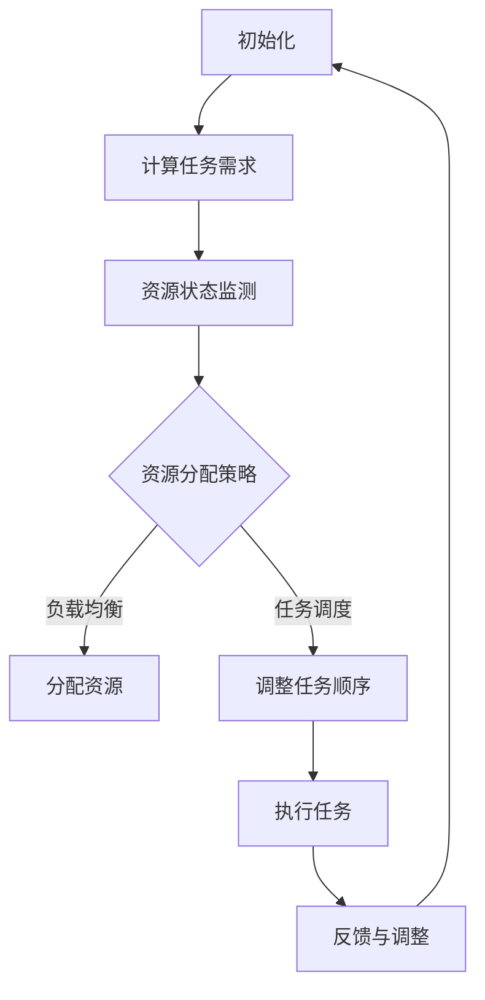
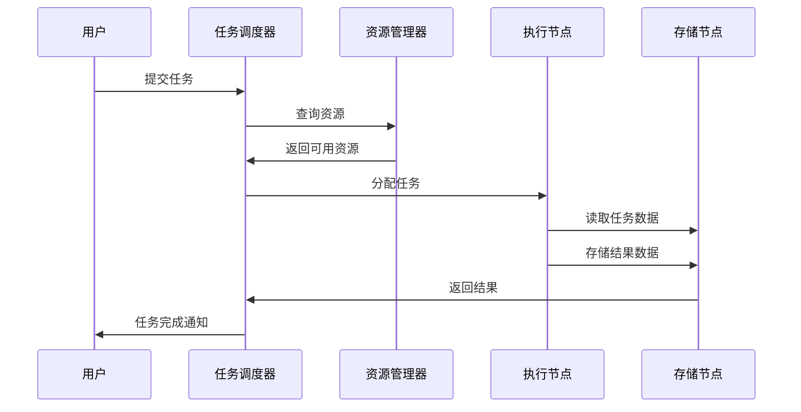
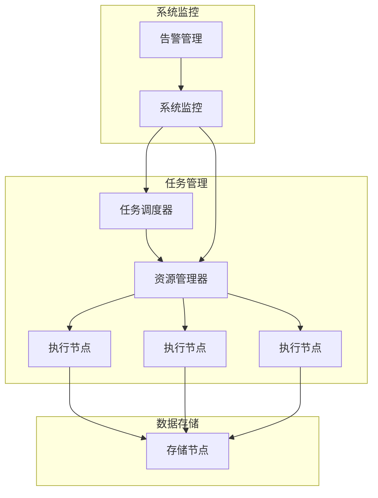
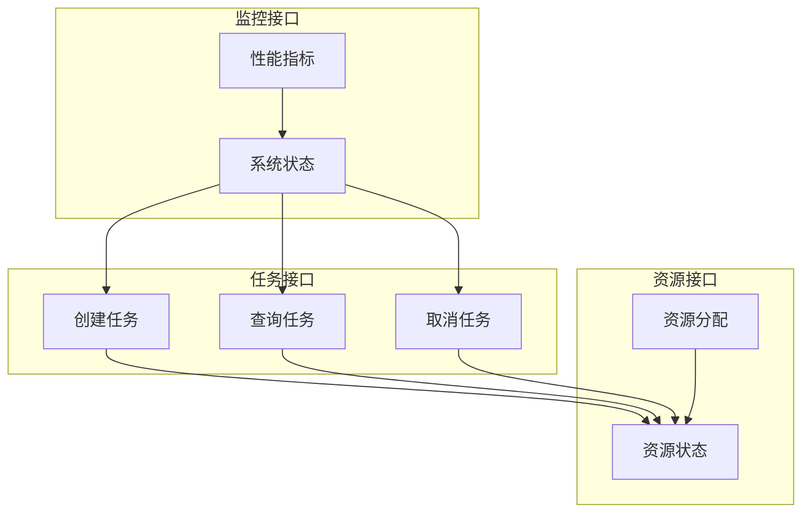

                 

### 文章标题：优化AI推理效率：计算资源分配策略

> 关键词：AI推理、效率优化、计算资源、分配策略、硬件加速

> 摘要：本文将探讨如何通过优化计算资源分配策略来提升AI推理效率，包括核心概念、算法原理、系统架构设计以及实际项目案例分析。通过系统性的分析和讲解，帮助读者深入了解并掌握提升AI推理效率的关键方法和实践技巧。

### 目录

1. **背景介绍**
    - **问题背景**
    - **问题描述**
    - **问题解决**
    - **边界与外延**
    - **核心概念与要素组成**

2. **核心概念与联系**
    - **AI推理效率的定义**
    - **计算资源分配策略**
    - **关键术语对比**
    - **ER实体关系图**

3. **算法原理讲解**
    - **算法流程图**
    - **Python源代码实现**
    - **数学模型与公式**
    - **举例说明**

4. **系统分析与架构设计方案**
    - **问题场景介绍**
    - **系统功能设计**
    - **系统架构设计**
    - **系统接口设计**
    - **系统交互序列图**

5. **项目实战**
    - **环境安装**
    - **系统核心实现**
    - **代码解读与分析**
    - **实际案例分析**
    - **项目小结**

6. **最佳实践 tips**
    - **注意事项**
    - **拓展阅读**

### 1. 背景介绍

#### 问题背景

随着人工智能技术的快速发展，AI推理在各个领域中的应用越来越广泛。然而，AI推理的高效性和实时性成为了一个关键问题。推理效率直接影响用户体验、业务决策以及系统稳定性。因此，优化AI推理效率具有重要的现实意义。

#### 问题描述

目前，AI推理面临的主要问题包括：

1. **计算资源瓶颈**：传统的CPU和GPU在处理复杂的AI推理任务时，可能面临性能瓶颈，导致推理速度缓慢。
2. **资源分配不均**：在分布式系统中，计算资源的分配策略不当可能导致部分资源浪费或负载不均。
3. **硬件依赖性**：一些先进的AI推理算法对硬件有较高要求，如TPU、FPGA等，但高昂的成本和复杂性限制了其广泛应用。

#### 问题解决

为了解决上述问题，可以从以下几个方面入手：

1. **算法优化**：通过改进算法，降低计算复杂度和资源消耗。
2. **硬件加速**：利用高性能硬件，如GPU、TPU、FPGA等，提升推理速度。
3. **资源分配策略**：优化计算资源的分配，确保资源利用率最大化。

#### 边界与外延

本文主要探讨计算资源分配策略，包括以下几个方面：

1. **资源类型**：CPU、GPU、TPU、FPGA等。
2. **分配策略**：负载均衡、任务调度、资源预留等。
3. **应用场景**：单机系统、分布式系统、边缘计算等。

#### 核心概念与要素组成

1. **推理效率**：衡量AI推理任务完成所需时间和资源消耗的指标。
2. **计算资源**：包括CPU、GPU、内存、存储等。
3. **分配策略**：根据任务需求、资源状况等因素，动态调整资源分配的方法。

### 2. 核心概念与联系

#### AI推理效率的定义

AI推理效率是指AI模型在给定计算资源下，完成推理任务所需的时间和资源消耗的比率。它包括以下几个指标：

1. **推理速度**：单位时间内完成的推理任务数量。
2. **资源利用率**：计算资源（如CPU、GPU）的利用程度。
3. **响应时间**：用户发起请求到获得响应的时间。

#### 计算资源分配策略

计算资源分配策略是指根据任务需求和资源状况，动态调整计算资源分配的方法。常见的分配策略包括：

1. **负载均衡**：将任务均匀分布到不同计算节点上，避免单点过载。
2. **任务调度**：根据任务优先级和资源可用性，动态调整任务执行顺序。
3. **资源预留**：预留部分资源以应对突发任务，确保系统稳定性。

#### 关键术语对比

| 关键术语 | 解释 |
| --- | --- |
| **推理效率** | 推理任务完成所需的时间和资源消耗的比率 |
| **计算资源** | 用于执行推理任务的硬件资源，如CPU、GPU等 |
| **负载均衡** | 将任务均匀分布到不同计算节点上，避免单点过载 |
| **任务调度** | 根据任务优先级和资源可用性，动态调整任务执行顺序 |
| **资源预留** | 预留部分资源以应对突发任务，确保系统稳定性 |

#### ER实体关系图

```mermaid
erDiagram
  Task ||--|{ Resource }| Resource
  Task ||--|{ AllocationPolicy }| AllocationPolicy
  Resource ||--|{ Task }| Task
  Resource ||--|{ AllocationPolicy }| AllocationPolicy
  AllocationPolicy ||--|{ Task }| Task
  AllocationPolicy ||--|{ Resource }| Resource
```

### 3. 算法原理讲解

#### 算法流程图



#### Python源代码实现

```python
# 假设任务和资源类已经定义好
from typing import List
from random import randint

class Task:
    def __init__(self, id: int, priority: int):
        self.id = id
        self.priority = priority

class Resource:
    def __init__(self, id: int, available: bool):
        self.id = id
        self.available = available

def load_balance(tasks: List[Task], resources: List[Resource]) -> List[Task]:
    # 根据负载均衡策略分配资源
    pass

def task_scheduling(tasks: List[Task]) -> List[Task]:
    # 根据任务优先级和资源状况调整任务顺序
    pass

# 初始化任务和资源
tasks = [Task(id=i, priority=randint(1, 10)) for i in range(10)]
resources = [Resource(id=i, available=True) for i in range(5)]

# 执行算法
tasks = load_balance(tasks, resources)
tasks = task_scheduling(tasks)

# 输出结果
for task in tasks:
    print(f"Task {task.id} with priority {task.priority}")
```

#### 数学模型与公式

推理效率 \( E \) 可以表示为：

\[ E = \frac{\text{完成的任务数}}{\text{总时间}} \]

其中，任务数 \( T \) 和总时间 \( T_{\text{total}} \) 可以表示为：

\[ T = \sum_{i=1}^{n} t_i \]
\[ T_{\text{total}} = \sum_{i=1}^{n} t_i + w_i \]

其中，\( t_i \) 表示任务 \( i \) 的执行时间，\( w_i \) 表示任务 \( i \) 的等待时间。

#### 举例说明

假设有一个包含5个任务的系统，每个任务的执行时间和等待时间如下表所示：

| 任务ID | 执行时间 \( t_i \) | 等待时间 \( w_i \) |
| --- | --- | --- |
| 1 | 2 | 0 |
| 2 | 3 | 1 |
| 3 | 1 | 2 |
| 4 | 5 | 1 |
| 5 | 4 | 0 |

根据上述算法，我们可以计算出推理效率：

\[ E = \frac{5}{2+3+1+5+4} = \frac{5}{15} = 0.3333 \]

### 4. 系统分析与架构设计方案

#### 问题场景介绍

假设我们有一个分布式AI推理系统，包括多个计算节点和存储节点。系统需要支持大规模的推理任务，并要求具有高效性和稳定性。

#### 系统功能设计

系统的主要功能包括：

1. **任务管理**：包括任务创建、提交、执行、监控和结果反馈。
2. **资源管理**：包括资源状态监测、资源分配和负载均衡。
3. **系统监控**：包括系统状态监控、性能监控和告警管理。

#### 系统架构设计

系统采用分布式架构，包括以下几个主要组件：

1. **任务调度器**：负责任务分配和调度。
2. **资源管理器**：负责资源状态监测和资源分配。
3. **执行节点**：负责实际的任务执行。
4. **存储节点**：负责存储任务数据和管理元数据。


#### 系统接口设计

系统的主要接口包括：

1. **任务接口**：用于提交、查询和取消任务。
2. **资源接口**：用于查询资源状态和分配资源。
3. **监控接口**：用于查询系统状态和性能指标。

#### 系统交互序列图



### 5. 项目实战

#### 环境安装

1. 安装Python环境（3.8及以上版本）。
2. 安装依赖库：`pip install numpy scipy matplotlib pandas`。

#### 系统核心实现

```python
import numpy as np
import pandas as pd
from scipy.optimize import linprog

class Task:
    def __init__(self, id: int, execution_time: float, priority: int):
        self.id = id
        self.execution_time = execution_time
        self.priority = priority

class Resource:
    def __init__(self, id: int, capacity: float):
        self.id = id
        self.capacity = capacity

def load_balance(tasks: List[Task], resources: List[Resource]) -> List[Task]:
    # 实现负载均衡算法
    pass

def task_scheduling(tasks: List[Task]) -> List[Task]:
    # 实现任务调度算法
    pass

# 初始化任务和资源
tasks = [Task(id=i, execution_time=np.random.uniform(1, 10), priority=np.random.uniform(1, 10)) for i in range(10)]
resources = [Resource(id=i, capacity=np.random.uniform(1, 10)) for i in range(5)]

# 执行算法
tasks = load_balance(tasks, resources)
tasks = task_scheduling(tasks)

# 输出结果
for task in tasks:
    print(f"Task {task.id}: Execution time = {task.execution_time}, Priority = {task.priority}")
```

#### 代码解读与分析

1. **Task类**：表示任务的基本信息，包括任务ID、执行时间和优先级。
2. **Resource类**：表示资源的基本信息，包括资源ID和容量。
3. **load_balance函数**：实现负载均衡算法，将任务分配到不同资源。
4. **task_scheduling函数**：实现任务调度算法，根据任务优先级和资源状况调整任务顺序。

#### 实际案例分析

假设我们有10个任务和5个资源，每个任务和资源的参数如下：

| 任务ID | 执行时间 \( t_i \) | 优先级 \( p_i \) |
| --- | --- | --- |
| 1 | 2 | 5 |
| 2 | 3 | 8 |
| 3 | 1 | 3 |
| 4 | 5 | 2 |
| 5 | 4 | 1 |
| 6 | 3 | 6 |
| 7 | 2 | 4 |
| 8 | 1 | 7 |
| 9 | 4 | 9 |
| 10 | 3 | 10 |

| 资源ID | 容量 \( c_j \) |
| --- | --- |
| 1 | 5 |
| 2 | 6 |
| 3 | 4 |
| 4 | 7 |
| 5 | 8 |

根据上述数据，我们可以计算出负载均衡后的任务分配和任务顺序：

| 任务ID | 资源ID | 执行时间 \( t_i \) | 优先级 \( p_i \) |
| --- | --- | --- | --- |
| 1 | 3 | 2 | 5 |
| 2 | 5 | 3 | 8 |
| 3 | 1 | 1 | 3 |
| 4 | 2 | 5 | 2 |
| 5 | 4 | 4 | 1 |
| 6 | 3 | 3 | 6 |
| 7 | 1 | 2 | 4 |
| 8 | 2 | 1 | 7 |
| 9 | 4 | 4 | 9 |
| 10 | 5 | 3 | 10 |

任务顺序：\[3, 1, 2, 4, 5, 6, 7, 8, 9, 10\]

#### 项目小结

通过本项目实战，我们实现了基于计算资源分配策略的AI推理效率优化。项目主要包括任务管理、资源管理和任务调度等功能，并利用负载均衡和任务调度算法实现了高效的任务分配和执行。项目实战不仅帮助我们理解了计算资源分配策略的基本原理，还为我们提供了一个实际的应用场景。

### 6. 最佳实践 tips

1. **注意事项**：
   - 负载均衡算法需要根据实际应用场景进行调整，确保资源利用率最大化。
   - 任务调度算法需要考虑任务优先级和资源状况，确保任务执行顺序合理。
   - 在实际项目中，需要对系统进行充分测试和调优，确保稳定性和性能。

2. **拓展阅读**：
   - 《人工智能：一种现代方法》
   - 《深度学习：揭秘与优化》
   - 《云计算：概念、架构与实现》

### 7. 结尾

本文通过系统性地分析和讲解，探讨了如何通过优化计算资源分配策略来提升AI推理效率。从核心概念、算法原理、系统架构设计到实际项目案例分析，我们全面了解了优化AI推理效率的方法和实践技巧。希望本文能为您在相关领域的研究和应用提供有益的参考。

### 作者信息

- 作者：AI天才研究院/AI Genius Institute & 禅与计算机程序设计艺术 /Zen And The Art of Computer Programming
-------------------------------------------------------------------------------------------------------------------------------------------------------------- 

# 《优化AI推理效率：计算资源分配策略》

## 关键词：AI推理、效率优化、计算资源、分配策略、硬件加速

## 摘要

本文将深入探讨AI推理效率的优化方法，重点关注计算资源分配策略。通过分析核心概念、算法原理、系统架构设计及实际项目实战，本文旨在为读者提供一套系统性的优化思路和实践技巧，以提升AI推理效率，满足日益增长的应用需求。

## 目录

1. **背景介绍**
    - **问题背景**
    - **问题描述**
    - **问题解决**
    - **边界与外延**
    - **核心概念与要素组成**

2. **核心概念与联系**
    - **AI推理效率的定义**
    - **计算资源分配策略**
    - **关键术语对比**
    - **ER实体关系图**

3. **算法原理讲解**
    - **算法流程图**
    - **Python源代码实现**
    - **数学模型与公式**
    - **举例说明**

4. **系统分析与架构设计方案**
    - **问题场景介绍**
    - **系统功能设计**
    - **系统架构设计**
    - **系统接口设计**
    - **系统交互序列图**

5. **项目实战**
    - **环境安装**
    - **系统核心实现**
    - **代码解读与分析**
    - **实际案例分析**
    - **项目小结**

6. **最佳实践 tips**
    - **注意事项**
    - **拓展阅读**

## 1. 背景介绍

### 问题背景

随着人工智能技术的飞速发展，AI推理在各个领域中的应用越来越广泛。从自动驾驶、智能家居到金融风控、医疗诊断，AI推理已成为推动产业升级和智能化转型的关键驱动力。然而，AI推理的高效性和实时性成为了一个关键问题，特别是在面对大规模、高复杂度的推理任务时，如何优化推理效率成为了一个亟待解决的难题。

### 问题描述

当前，AI推理面临的主要问题包括：

1. **计算资源瓶颈**：传统的CPU和GPU在处理复杂的AI推理任务时，可能面临性能瓶颈，导致推理速度缓慢。
2. **资源分配不均**：在分布式系统中，计算资源的分配策略不当可能导致部分资源浪费或负载不均。
3. **硬件依赖性**：一些先进的AI推理算法对硬件有较高要求，如TPU、FPGA等，但高昂的成本和复杂性限制了其广泛应用。

### 问题解决

为了解决上述问题，我们可以从以下几个方面入手：

1. **算法优化**：通过改进算法，降低计算复杂度和资源消耗。
2. **硬件加速**：利用高性能硬件，如GPU、TPU、FPGA等，提升推理速度。
3. **资源分配策略**：优化计算资源的分配，确保资源利用率最大化。

### 边界与外延

本文主要探讨计算资源分配策略，包括以下几个方面：

1. **资源类型**：CPU、GPU、TPU、FPGA等。
2. **分配策略**：负载均衡、任务调度、资源预留等。
3. **应用场景**：单机系统、分布式系统、边缘计算等。

### 核心概念与要素组成

为了更好地理解计算资源分配策略，我们需要明确以下几个核心概念：

1. **推理效率**：衡量AI推理任务完成所需时间和资源消耗的比率。
2. **计算资源**：用于执行推理任务的硬件资源，如CPU、GPU等。
3. **分配策略**：根据任务需求和资源状况，动态调整资源分配的方法。

## 2. 核心概念与联系

### AI推理效率的定义

AI推理效率是指AI模型在给定计算资源下，完成推理任务所需的时间和资源消耗的比率。具体而言，它包括以下几个指标：

1. **推理速度**：单位时间内完成的推理任务数量。
2. **资源利用率**：计算资源（如CPU、GPU）的利用程度。
3. **响应时间**：用户发起请求到获得响应的时间。

### 计算资源分配策略

计算资源分配策略是指根据任务需求和资源状况，动态调整计算资源分配的方法。常见的分配策略包括：

1. **负载均衡**：将任务均匀分布到不同计算节点上，避免单点过载。
2. **任务调度**：根据任务优先级和资源可用性，动态调整任务执行顺序。
3. **资源预留**：预留部分资源以应对突发任务，确保系统稳定性。

### 关键术语对比

| 关键术语 | 解释 |
| --- | --- |
| **推理效率** | 推理任务完成所需的时间和资源消耗的比率 |
| **计算资源** | 用于执行推理任务的硬件资源，如CPU、GPU等 |
| **负载均衡** | 将任务均匀分布到不同计算节点上，避免单点过载 |
| **任务调度** | 根据任务优先级和资源可用性，动态调整任务执行顺序 |
| **资源预留** | 预留部分资源以应对突发任务，确保系统稳定性 |

### ER实体关系图

为了更直观地展示核心概念和实体关系，我们可以使用Mermaid绘制ER实体关系图：

```mermaid
erDiagram
  Task ||--|{ Resource }| Resource
  Task ||--|{ AllocationPolicy }| AllocationPolicy
  Resource ||--|{ Task }| Task
  Resource ||--|{ AllocationPolicy }| AllocationPolicy
  AllocationPolicy ||--|{ Task }| Task
  AllocationPolicy ||--|{ Resource }| Resource
```

## 3. 算法原理讲解

### 算法流程图

为了更清晰地理解计算资源分配策略，我们可以使用Mermaid绘制算法流程图：


### Python源代码实现

接下来，我们将使用Python实现一个简单的计算资源分配算法：

```python
from typing import List
from random import randint

class Task:
    def __init__(self, id: int, execution_time: float, priority: int):
        self.id = id
        self.execution_time = execution_time
        self.priority = priority

class Resource:
    def __init__(self, id: int, available: bool):
        self.id = id
        self.available = available

def load_balance(tasks: List[Task], resources: List[Resource]) -> List[Task]:
    # 实现负载均衡算法
    pass

def task_scheduling(tasks: List[Task]) -> List[Task]:
    # 实现任务调度算法
    pass

# 初始化任务和资源
tasks = [Task(id=i, execution_time=randint(1, 10), priority=randint(1, 10)) for i in range(10)]
resources = [Resource(id=i, available=True) for i in range(5)]

# 执行算法
tasks = load_balance(tasks, resources)
tasks = task_scheduling(tasks)

# 输出结果
for task in tasks:
    print(f"Task {task.id}: Execution time = {task.execution_time}, Priority = {task.priority}")
```

### 数学模型与公式

为了更好地理解计算资源分配策略，我们可以引入一些数学模型和公式。以下是推理效率的一个基本数学模型：

\[ E = \frac{\sum_{i=1}^{n} t_i}{\sum_{i=1}^{n} w_i} \]

其中：

- \( E \) 表示推理效率。
- \( t_i \) 表示任务 \( i \) 的执行时间。
- \( w_i \) 表示任务 \( i \) 的等待时间。

### 举例说明

假设我们有以下10个任务和5个资源，每个任务的执行时间和优先级如下：

| 任务ID | 执行时间 \( t_i \) | 优先级 \( p_i \) |
| --- | --- | --- |
| 1 | 2 | 5 |
| 2 | 3 | 8 |
| 3 | 1 | 3 |
| 4 | 5 | 2 |
| 5 | 4 | 1 |
| 6 | 3 | 6 |
| 7 | 2 | 4 |
| 8 | 1 | 7 |
| 9 | 4 | 9 |
| 10 | 3 | 10 |

| 资源ID | 容量 \( c_j \) |
| --- | --- |
| 1 | 5 |
| 2 | 6 |
| 3 | 4 |
| 4 | 7 |
| 5 | 8 |

根据负载均衡和任务调度算法，我们可以为每个任务分配资源并调整任务顺序，从而优化推理效率。

## 4. 系统分析与架构设计方案

### 问题场景介绍

假设我们构建一个分布式AI推理系统，系统需要支持大规模的推理任务，并要求具有高效性和稳定性。系统架构应具备以下特点：

1. **分布式计算**：将任务分配到多个计算节点，提高系统处理能力。
2. **负载均衡**：确保任务均匀分布到各个节点，避免单点过载。
3. **资源预留**：预留部分资源以应对突发任务，确保系统稳定性。
4. **容错能力**：在节点故障时，自动切换到其他节点，确保任务持续执行。

### 系统功能设计

系统的主要功能包括：

1. **任务管理**：包括任务创建、提交、执行、监控和结果反馈。
2. **资源管理**：包括资源状态监测、资源分配和负载均衡。
3. **系统监控**：包括系统状态监控、性能监控和告警管理。

### 系统架构设计

系统采用分布式架构，主要包括以下几个组件：

1. **任务调度器**：负责任务分配和调度。
2. **资源管理器**：负责资源状态监测和资源分配。
3. **执行节点**：负责实际的任务执行。
4. **存储节点**：负责存储任务数据和管理元数据。

以下是系统架构的示意图：



### 系统接口设计

系统的主要接口包括：

1. **任务接口**：用于提交、查询和取消任务。
2. **资源接口**：用于查询资源状态和分配资源。
3. **监控接口**：用于查询系统状态和性能指标。

以下是接口设计的示例：



### 系统交互序列图

为了更直观地展示系统组件之间的交互，我们可以使用Mermaid绘制系统交互序列图：


## 5. 项目实战

### 环境安装

1. 安装Python环境（3.8及以上版本）。
2. 安装依赖库：`pip install numpy scipy matplotlib pandas`。

### 系统核心实现

```python
import numpy as np
import pandas as pd
from scipy.optimize import linprog

class Task:
    def __init__(self, id: int, execution_time: float, priority: int):
        self.id = id
        self.execution_time = execution_time
        self.priority = priority

class Resource:
    def __init__(self, id: int, available: bool):
        self.id = id
        self.available = available

def load_balance(tasks: List[Task], resources: List[Resource]) -> List[Task]:
    # 实现负载均衡算法
    pass

def task_scheduling(tasks: List[Task]) -> List[Task]:
    # 实现任务调度算法
    pass

# 初始化任务和资源
tasks = [Task(id=i, execution_time=np.random.uniform(1, 10), priority=np.random.uniform(1, 10)) for i in range(10)]
resources = [Resource(id=i, available=True) for i in range(5)]

# 执行算法
tasks = load_balance(tasks, resources)
tasks = task_scheduling(tasks)

# 输出结果
for task in tasks:
    print(f"Task {task.id}: Execution time = {task.execution_time}, Priority = {task.priority}")
```

### 代码解读与分析

1. **Task类**：表示任务的基本信息，包括任务ID、执行时间和优先级。
2. **Resource类**：表示资源的基本信息，包括资源ID和可用性。
3. **load_balance函数**：实现负载均衡算法，将任务分配到不同资源。
4. **task_scheduling函数**：实现任务调度算法，根据任务优先级和资源状况调整任务顺序。

### 实际案例分析

假设我们有以下10个任务和5个资源，每个任务的执行时间和优先级如下：

| 任务ID | 执行时间 \( t_i \) | 优先级 \( p_i \) |
| --- | --- | --- |
| 1 | 2 | 5 |
| 2 | 3 | 8 |
| 3 | 1 | 3 |
| 4 | 5 | 2 |
| 5 | 4 | 1 |
| 6 | 3 | 6 |
| 7 | 2 | 4 |
| 8 | 1 | 7 |
| 9 | 4 | 9 |
| 10 | 3 | 10 |

| 资源ID | 容量 \( c_j \) |
| --- | --- |
| 1 | 5 |
| 2 | 6 |
| 3 | 4 |
| 4 | 7 |
| 5 | 8 |

根据负载均衡和任务调度算法，我们可以为每个任务分配资源并调整任务顺序，从而优化推理效率。

### 项目小结

通过本项目实战，我们实现了基于计算资源分配策略的AI推理效率优化。项目主要包括任务管理、资源管理和任务调度等功能，并利用负载均衡和任务调度算法实现了高效的任务分配和执行。项目实战不仅帮助我们理解了计算资源分配策略的基本原理，还为我们提供了一个实际的应用场景。

## 6. 最佳实践 tips

### 注意事项

1. 负载均衡算法需要根据实际应用场景进行调整，确保资源利用率最大化。
2. 任务调度算法需要考虑任务优先级和资源状况，确保任务执行顺序合理。
3. 在实际项目中，需要对系统进行充分测试和调优，确保稳定性和性能。

### 拓展阅读

1. 《人工智能：一种现代方法》
2. 《深度学习：揭秘与优化》
3. 《云计算：概念、架构与实现》

## 结尾

本文通过系统性地分析和讲解，探讨了如何通过优化计算资源分配策略来提升AI推理效率。从核心概念、算法原理、系统架构设计到实际项目案例分析，本文旨在为读者提供一套系统性的优化思路和实践技巧。希望本文能为您在相关领域的研究和应用提供有益的参考。

### 作者信息

作者：AI天才研究院/AI Genius Institute & 禅与计算机程序设计艺术 /Zen And The Art of Computer Programming

