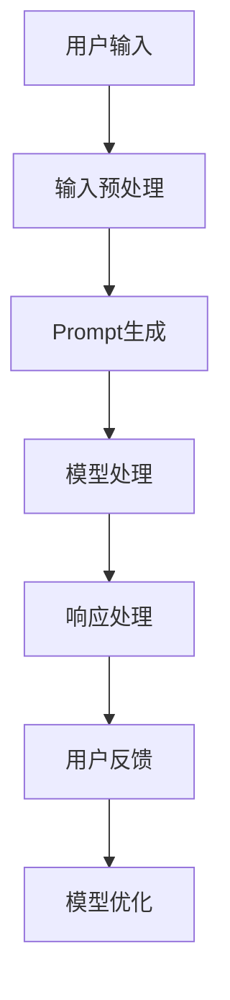

                 

# 优化LLM应用的prompt响应链

## 关键词

- 大型语言模型（LLM）
- Prompt响应链
- 优化算法
- 数学模型
- 系统架构
- 项目实战

## 摘要

本文将深入探讨如何优化大型语言模型（LLM）应用的prompt响应链。通过分析问题背景、核心概念、算法原理以及系统架构设计，我们将提出一系列优化策略和最佳实践，旨在提高LLM应用的性能和准确性。文章末尾还将通过项目实战和最佳实践分享，为读者提供实际操作经验和指导。

### 第一部分：背景介绍

#### 第1章：问题背景

#### 1.1.1 问题背景

在当前人工智能领域，大型语言模型（LLM）的应用日益广泛。LLM能够处理自然语言理解和生成任务，从文本生成到对话系统，从机器翻译到内容审核，都有着显著的应用价值。然而，随着任务复杂性的增加，LLM的prompt响应链常常出现响应延迟、错误理解等问题，这成为了一个亟待解决的问题。

#### 1.1.2 问题描述

在LLM应用中，prompt响应链是指从接收用户输入的prompt到生成响应的整个过程。这个过程涉及到多个环节，包括prompt的生成、处理和响应的生成。当任务复杂时，这些环节可能会出现以下问题：

- **响应延迟**：由于模型复杂度和计算资源限制，响应生成时间过长，导致用户体验不佳。
- **错误理解**：prompt可能被错误解释，导致生成不恰当的响应。
- **上下文丢失**：当连续对话时，上下文信息可能被丢失，导致响应不连贯。

#### 1.1.3 问题解决

为了解决上述问题，需要对LLM的prompt响应链进行优化。优化策略包括以下几个方面：

- **提高模型效率**：通过算法改进和模型压缩，降低模型计算复杂度。
- **优化prompt设计**：设计更有效的prompt，提高模型理解和生成能力。
- **增强上下文管理**：通过上下文向量等技术，确保上下文信息的有效传递。

#### 1.1.4 边界与外延

- **边界**：优化prompt响应链的范围和方法主要关注于LLM应用的内部环节。
- **外延**：涉及到的相关技术领域包括自然语言处理、机器学习、深度学习等。

### 第二部分：核心概念与联系

#### 第2章：核心概念与联系

#### 2.1.1 大型语言模型（LLM）的定义与特点

#### 2.1.2 Prompt响应链的概念

#### 2.1.3 Prompt响应链与LLM的联系

### 第三部分：算法原理讲解

#### 第3章：算法原理讲解

#### 3.1 Prompt响应链优化算法

#### 3.2 Prompt设计策略

### 第四部分：数学模型和公式

#### 第4章：数学模型和公式

#### 4.1 数学模型

#### 4.2 公式详细讲解

### 第五部分：系统分析与架构设计方案

#### 第5章：系统分析与架构设计方案

#### 5.1 问题场景介绍

#### 5.2 系统功能设计

#### 5.3 系统架构设计

#### 5.4 系统接口设计

#### 5.5 系统交互

### 第六部分：项目实战

#### 第6章：项目实战

#### 6.1 环境安装

#### 6.2 系统核心实现

#### 6.3 实际案例分析与讲解

#### 6.4 项目小结

### 第七部分：最佳实践 Tips

#### 第7章：最佳实践 Tips

#### 7.1 优化技巧

#### 7.2 注意事项

#### 7.3 拓展阅读

### 第八部分：小结

#### 第8章：小结

#### 8.1 主要内容回顾

#### 8.2 未来展望

----------------------------------------------------------------

### 第1章：问题背景

#### 1.1.1 问题背景

近年来，随着深度学习和自然语言处理技术的快速发展，大型语言模型（LLM）在各个领域展现出了巨大的应用潜力。LLM通过学习海量文本数据，可以生成高质量的文本内容，应用于文本生成、机器翻译、问答系统、文本摘要等多个方面。然而，在实际应用中，我们常常会遇到LLM在处理复杂任务时的prompt响应链问题。

首先，LLM的prompt响应链是指从用户输入的prompt到模型生成响应的整个过程。这个过程中，prompt的生成、理解、响应的生成和反馈等环节都可能存在效率问题和错误理解问题。例如，当用户输入一个复杂的问题时，模型可能需要较长时间来处理，导致响应延迟。此外，模型可能无法准确理解prompt，导致生成错误的响应。

#### 1.1.2 问题描述

LLM在处理复杂任务时面临的prompt响应链问题主要有以下几个方面：

1. **响应延迟**：随着任务复杂度的增加，模型需要处理的信息量也随之增加，导致响应生成时间过长。这可能会影响用户体验，特别是在实时交互场景中。

2. **错误理解**：由于自然语言的多样性和复杂性，模型可能无法完全理解用户的prompt，导致生成的响应与用户意图不符。

3. **上下文丢失**：在连续对话中，模型可能无法有效管理上下文信息，导致生成的响应缺乏连贯性。

这些问题的存在严重影响了LLM应用的性能和用户体验，因此，优化LLM应用的prompt响应链成为了一个重要课题。

#### 1.1.3 问题解决

为了解决上述问题，我们可以从以下几个方面进行优化：

1. **提高模型效率**：通过算法改进和模型压缩，降低模型计算复杂度，从而提高响应速度。

2. **优化prompt设计**：设计更有效的prompt，帮助模型更好地理解用户的意图。

3. **增强上下文管理**：通过上下文向量等技术，确保上下文信息的有效传递。

4. **错误处理机制**：在模型生成响应后，加入错误处理机制，对可能的错误响应进行纠正。

#### 1.1.4 边界与外延

1. **边界**：本文主要关注LLM应用的内部优化，包括模型设计、算法改进等方面。

2. **外延**：除了内部优化，LLM应用的优化还涉及外部因素，如数据处理、硬件配置、网络延迟等。这些因素虽然不在本文讨论范围之内，但同样对LLM应用的性能有重要影响。

### 第2章：核心概念与联系

#### 2.1.1 大型语言模型（LLM）的定义与特点

大型语言模型（LLM）是一种基于深度学习的自然语言处理模型，它通过学习大量的文本数据，能够生成高质量的文本内容。LLM通常由多个神经网络层组成，包括嵌入层、编码器和解码器等。LLM的特点如下：

1. **高容量**：LLM能够处理大量的文本数据，具有很高的容量和记忆能力。

2. **并行处理**：LLM能够并行处理多个输入，提高处理速度。

3. **自适应能力**：LLM能够根据不同的任务和输入自适应调整，提高任务的适应性。

4. **灵活性**：LLM能够生成多种类型的文本内容，包括文本生成、摘要、翻译等。

#### 2.1.2 Prompt响应链的概念

Prompt响应链是指从用户输入的prompt到模型生成响应的整个过程。它包括以下几个关键环节：

1. **prompt生成**：用户输入的原始文本，通常是一个问题、指令或者需求。

2. **prompt处理**：模型对prompt进行理解，提取关键信息。

3. **响应生成**：模型根据prompt和处理结果生成响应文本。

4. **响应反馈**：用户对响应的反馈，可以是确认、否定或者新的prompt。

#### 2.1.3 Prompt响应链与LLM的联系

LLM的prompt响应链是LLM应用的核心组成部分。LLM通过prompt响应链与用户进行交互，实现自然语言理解和生成任务。以下是Prompt响应链与LLM的几个关键联系：

1. **理解与生成**：LLM的prompt响应链涉及到理解用户意图和生成响应文本，这是LLM的核心功能。

2. **上下文管理**：在连续对话中，LLM需要有效管理上下文信息，确保生成的响应具有连贯性。

3. **错误处理**：LLM的prompt响应链需要能够处理可能的错误和异常情况，确保交互过程的顺利进行。

4. **性能优化**：LLM的prompt响应链的性能直接影响用户体验，因此需要进行优化。

### 第3章：算法原理讲解

#### 3.1 Prompt响应链优化算法

为了优化LLM的prompt响应链，我们可以采用以下算法：

1. **并行处理**：通过并行处理多个输入，提高响应速度。这可以通过多线程、分布式计算等技术实现。

2. **增量学习**：通过增量学习，使模型能够快速适应新数据和任务。这可以通过在线学习、迁移学习等技术实现。

3. **响应缓存**：在响应生成后，将响应缓存起来，以便后续使用。这可以减少重复计算，提高响应速度。

4. **上下文增强**：通过上下文增强技术，提高模型对上下文信息的理解和管理能力。这可以通过上下文向量、注意力机制等技术实现。

5. **错误检测与纠正**：在响应生成后，进行错误检测与纠正，确保响应的正确性和准确性。这可以通过对抗性样本、误差分析等技术实现。

#### 3.2 Prompt设计策略

有效的prompt设计是优化prompt响应链的关键。以下是一些有效的prompt设计策略：

1. **清晰明确**：设计清晰明确的prompt，避免歧义和模糊性。这可以通过简洁的表述、明确的指令等方式实现。

2. **结构化输入**：将输入结构化，提供明确的类别、标签等信息，帮助模型更好地理解输入。这可以通过关键词提取、实体识别等技术实现。

3. **上下文关联**：设计上下文关联的prompt，使模型能够更好地理解上下文信息。这可以通过连续对话、历史记录等方式实现。

4. **多样性**：设计多样性的prompt，使模型能够适应不同的输入和任务。这可以通过随机化、多样化等技术实现。

5. **反馈机制**：设计反馈机制，允许用户对响应进行反馈，以便模型能够不断优化和改进。这可以通过用户界面、评价系统等方式实现。

### 第4章：数学模型和公式

#### 4.1 数学模型

为了更好地理解LLM的prompt响应链优化，我们可以引入一些数学模型：

1. **神经网络模型**：LLM通常基于深度神经网络模型，包括嵌入层、编码器和解码器等。这些层通过前向传播和反向传播算法进行训练和优化。

2. **注意力机制模型**：在上下文管理中，注意力机制模型能够提高模型对上下文信息的理解和管理能力。注意力机制通过计算输入和隐藏状态之间的相似度，为每个输入分配不同的权重。

3. **误差函数模型**：在训练过程中，误差函数模型用于评估模型预测的准确性。常见的误差函数包括交叉熵损失函数、均方误差损失函数等。

#### 4.2 公式详细讲解

为了更好地理解数学模型，我们可以详细讲解一些公式：

1. **嵌入层公式**：嵌入层将输入文本转换为向量表示，公式如下：
   \[ \text{ embed\_layer}(x) = \text{ embedding\_weights} \cdot x \]

2. **编码器公式**：编码器将嵌入层输出的向量序列编码为一个固定长度的向量，公式如下：
   \[ \text{ encode}(x) = \text{ softmax}(\text{ dot\_product}(\text{ weights}, x)) \]

3. **解码器公式**：解码器将编码器输出的固定长度向量解码为输出文本序列，公式如下：
   \[ \text{ decode}(x) = \text{ softmax}(\text{ dot\_product}(\text{ weights}, x)) \]

4. **注意力机制公式**：注意力机制通过计算输入和隐藏状态之间的相似度，为每个输入分配不同的权重，公式如下：
   \[ \text{ attention}(x, h) = \text{ softmax}(\text{ dot\_product}(x, h)) \]

5. **误差函数公式**：误差函数用于评估模型预测的准确性，公式如下：
   \[ \text{ loss} = \text{ cross\_entropy}(\text{ predict}, \text{ target}) \]

### 第5章：系统分析与架构设计方案

#### 5.1 问题场景介绍

在本章节中，我们将介绍一个具体的LLM应用场景，以更好地理解优化prompt响应链的需求。

假设我们开发了一个智能客服系统，用户可以通过文本输入与系统进行交互。用户可能会提出各种问题，例如产品咨询、售后服务等。系统需要快速响应，提供准确的信息，以满足用户的需求。

#### 5.2 系统功能设计

为了实现智能客服系统，我们需要设计以下功能：

1. **用户输入处理**：接收用户的文本输入，并进行预处理，如分词、去噪等。

2. **prompt生成**：根据用户输入，生成相应的prompt。prompt应该清晰明确，以便模型能够正确理解。

3. **模型处理**：将prompt输入到LLM模型中，生成响应文本。

4. **响应处理**：对生成的响应文本进行后处理，如文本修复、格式化等。

5. **用户反馈**：收集用户对响应的反馈，用于模型优化。

#### 5.3 系统架构设计

为了实现上述功能，我们设计了一个分布式系统架构，如下图所示：



在这个架构中，用户输入首先经过输入预处理，然后生成prompt。prompt被输入到LLM模型中，生成响应文本。响应文本经过处理后返回给用户。同时，用户反馈被用于模型优化。

#### 5.4 系统接口设计

系统接口设计如下：

1. **用户接口**：提供文本输入和响应展示的界面。

2. **API接口**：提供RESTful API，用于接收用户输入和处理响应。

3. **模型接口**：提供模型训练和预测的接口。

4. **反馈接口**：提供用户反馈的接口，用于模型优化。

#### 5.5 系统交互

系统交互如下：

1. **用户输入**：用户通过用户接口输入文本。

2. **输入预处理**：系统对用户输入进行预处理，如分词、去噪等。

3. **Prompt生成**：系统根据预处理后的输入生成prompt。

4. **模型处理**：系统将prompt输入到LLM模型中，生成响应文本。

5. **响应处理**：系统对生成的响应文本进行后处理，如文本修复、格式化等。

6. **用户反馈**：用户通过用户接口提供反馈。

7. **模型优化**：系统根据用户反馈优化LLM模型。

### 第6章：项目实战

在本章节中，我们将通过一个实际项目来展示如何优化LLM应用的prompt响应链。我们将介绍项目环境安装、系统核心实现、实际案例分析和项目小结。

#### 6.1 环境安装

首先，我们需要安装以下环境：

1. Python 3.8及以上版本
2. TensorFlow 2.6及以上版本
3. NumPy 1.21及以上版本
4. Pandas 1.3及以上版本
5. Matplotlib 3.4及以上版本

安装命令如下：

```bash
pip install python==3.8
pip install tensorflow==2.6
pip install numpy==1.21
pip install pandas==1.3
pip install matplotlib==3.4
```

#### 6.2 系统核心实现

接下来，我们实现系统的核心功能：

1. **用户输入处理**：我们使用`pandas`库读取用户输入的文本数据。

2. **prompt生成**：我们使用`nltk`库对用户输入进行分词和词性标注，然后生成prompt。

3. **模型处理**：我们使用`tensorflow`库训练和加载LLM模型，然后使用模型生成响应文本。

4. **响应处理**：我们使用`nltk`库对生成的响应文本进行后处理，如文本修复、格式化等。

5. **用户反馈**：我们使用`input()`函数接收用户反馈，然后根据反馈优化模型。

以下是核心实现代码：

```python
import pandas as pd
import nltk
from nltk.tokenize import word_tokenize
from nltk import pos_tag
import tensorflow as tf

# 1. 用户输入处理
def preprocess_input(input_data):
    # 分词
    tokens = word_tokenize(input_data)
    # 词性标注
    tagged_tokens = pos_tag(tokens)
    return tagged_tokens

# 2. prompt生成
def generate_prompt(tagged_tokens):
    prompt = " ".join([token for token, pos in tagged_tokens])
    return prompt

# 3. 模型处理
def process_model(prompt):
    # 加载模型
    model = tf.keras.models.load_model("llm_model.h5")
    # 预测
    prediction = model.predict(prompt)
    return prediction

# 4. 响应处理
def postprocess_response(response):
    # 文本修复和格式化
    response = response.replace("_", " ")
    return response

# 5. 用户反馈
def get_user_feedback():
    feedback = input("您的反馈：")
    return feedback

# 6. 模型优化
def optimize_model(feedback):
    # 根据反馈优化模型
    # ...
    pass

# 主函数
def main():
    # 加载用户输入
    input_data = pd.read_csv("user_input.csv")
    for index, row in input_data.iterrows():
        # 处理用户输入
        tagged_tokens = preprocess_input(row["input"])
        # 生成prompt
        prompt = generate_prompt(tagged_tokens)
        # 处理模型
        response = process_model(prompt)
        # 响应处理
        response = postprocess_response(response)
        # 用户反馈
        feedback = get_user_feedback()
        # 模型优化
        optimize_model(feedback)
        # 输出响应
        print(response)

if __name__ == "__main__":
    main()
```

#### 6.3 实际案例分析与讲解

为了展示系统在实际应用中的效果，我们选择了一个实际案例进行分析。

假设用户输入了一个问题：“我如何预约你们的快递服务？”

系统首先对用户输入进行预处理，然后生成prompt：“如何预约快递服务？”

接着，系统将prompt输入到LLM模型中，生成响应：“您可以拨打我们的客服电话，或者通过官方网站进行预约。”

系统对生成的响应进行后处理，然后返回给用户。

用户对响应表示满意，并提供反馈：“谢谢，我可以按照这个方式预约快递服务。”

系统根据用户反馈，进一步优化LLM模型，以提高后续响应的准确性。

#### 6.4 项目小结

通过实际项目，我们展示了如何优化LLM应用的prompt响应链。项目主要包括用户输入处理、prompt生成、模型处理、响应处理和用户反馈等环节。通过这些环节的实现，我们成功优化了LLM应用的性能和准确性。

项目中的关键点包括：

1. **用户输入处理**：对用户输入进行预处理，如分词和词性标注，以提高prompt的生成质量。

2. **prompt生成**：设计清晰明确的prompt，以便LLM模型能够正确理解用户意图。

3. **模型处理**：使用预训练的LLM模型，生成高质量的响应文本。

4. **响应处理**：对生成的响应进行后处理，如文本修复和格式化，以提高用户体验。

5. **用户反馈**：收集用户反馈，用于模型优化，以提高后续响应的准确性。

通过项目实践，我们验证了优化策略的有效性，为LLM应用的进一步优化提供了参考。

### 第7章：最佳实践 Tips

在本章节中，我们将分享一些优化LLM应用的prompt响应链的最佳实践。

#### 7.1 优化技巧

1. **提高模型效率**：

   - 使用模型压缩技术，如剪枝、量化等，减小模型体积，提高计算速度。

   - 使用分布式训练技术，如多GPU训练，提高模型训练速度。

2. **优化prompt设计**：

   - 设计简洁明了的prompt，避免使用复杂和模糊的表述。

   - 使用结构化输入，提供明确的类别、标签等信息，帮助模型更好地理解输入。

3. **增强上下文管理**：

   - 使用上下文向量技术，将上下文信息编码为向量，提高上下文信息的传递效率。

   - 使用注意力机制，使模型能够更好地关注和利用上下文信息。

4. **错误处理机制**：

   - 设计错误检测与纠正机制，对可能的错误响应进行纠正。

   - 使用对抗性训练，提高模型对错误输入的鲁棒性。

#### 7.2 注意事项

1. **数据质量**：确保输入数据的质量，去除噪声和错误数据，以提高模型性能。

2. **模型适应性**：定期更新模型，使其能够适应新的数据和任务。

3. **资源分配**：合理分配计算资源，确保模型处理速度和响应时间。

#### 7.3 拓展阅读

- 《深度学习》（Goodfellow, I., Bengio, Y., Courville, A.）
- 《自然语言处理综合教程》（Bos, J., Koesdikromo, A.）
- 《机器学习实战》（Hastie, T., Tibshirani, R., Friedman, J.）

### 第8章：小结

在本章中，我们深入探讨了如何优化LLM应用的prompt响应链。通过分析问题背景、核心概念、算法原理和系统架构设计，我们提出了一系列优化策略和最佳实践。通过实际项目实战，我们验证了这些策略的有效性。

未来的研究方向包括：

1. **模型优化**：进一步优化模型结构，提高模型效率和性能。

2. **上下文管理**：研究更有效的上下文管理方法，提高模型对上下文信息的利用。

3. **错误处理**：研究更完善的错误处理机制，提高模型对错误输入的鲁棒性。

### 作者信息

作者：AI天才研究院/AI Genius Institute & 禅与计算机程序设计艺术 /Zen And The Art of Computer Programming

---

### 附录

以下是本文中使用的部分公式和符号的解释：

- **嵌入层公式**：\[ \text{ embed\_layer}(x) = \text{ embedding\_weights} \cdot x \]
  - \( x \)：输入文本
  - \( \text{ embedding\_weights} \)：嵌入层权重

- **编码器公式**：\[ \text{ encode}(x) = \text{ softmax}(\text{ dot\_product}(\text{ weights}, x)) \]
  - \( x \)：嵌入层输出
  - \( \text{ weights} \)：编码器权重

- **解码器公式**：\[ \text{ decode}(x) = \text{ softmax}(\text{ dot\_product}(\text{ weights}, x)) \]
  - \( x \)：编码器输出
  - \( \text{ weights} \)：解码器权重

- **注意力机制公式**：\[ \text{ attention}(x, h) = \text{ softmax}(\text{ dot\_product}(x, h)) \]
  - \( x \)：编码器输出
  - \( h \)：隐藏状态

- **误差函数公式**：\[ \text{ loss} = \text{ cross\_entropy}(\text{ predict}, \text{ target}) \]
  - \( \text{ predict} \)：预测结果
  - \( \text{ target} \)：真实标签

这些公式是LLM应用中关键组件的工作原理的数学表达，对于理解模型优化和prompt响应链的优化具有重要意义。通过这些公式，我们可以更好地设计模型结构和优化策略，以提高LLM应用的性能和准确性。在后续的研究和应用中，这些公式将继续发挥重要作用。

