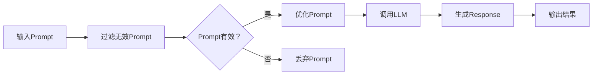
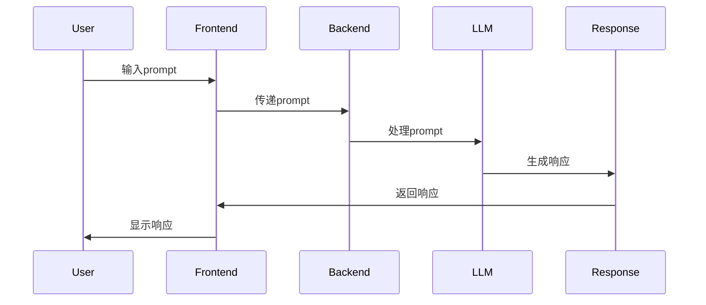

                 

### 优化LLM应用的prompt调用频率

关键词：LLM、prompt调用频率、性能优化、并行处理、算法原理

摘要：本文从LLM应用的prompt调用频率优化出发，详细探讨了优化prompt调用频率的背景、核心概念、算法原理，并通过Python代码展示了具体的实现过程。本文旨在帮助读者深入理解prompt调用频率对LLM应用性能的影响，并提出相应的优化策略。

## 第一部分：背景介绍

### 1.1 问题背景

随着深度学习模型的不断进步，大型语言模型（LLM）在自然语言处理（NLP）领域展现出了强大的能力。LLM广泛应用于问答系统、文本生成、机器翻译、对话系统等领域，极大地提升了人工智能应用的性能和用户体验。然而，LLM的应用也面临着一些挑战，其中之一就是prompt调用频率的优化。prompt调用频率直接影响到LLM的性能和效率，因此，对prompt调用频率进行优化具有重要意义。

#### 1.1.1 问题描述

在LLM应用中，prompt是输入给模型的文本信息，用于引导模型生成预期的输出。然而，如果prompt调用频率过高，可能会导致以下问题：

- **模型性能下降**：频繁的prompt调用会占用大量计算资源，导致模型无法高效运行。
- **响应时间增加**：频繁的prompt调用会导致响应时间变长，降低用户体验。
- **能耗增加**：频繁的prompt调用会消耗更多的电能，增加运行成本。

#### 1.1.2 问题解决

为了解决prompt调用频率过高的问题，我们需要从以下几个方面进行优化：

- **减少无效prompt调用**：通过过滤无效的prompt，降低不必要的调用次数。
- **提高prompt调用效率**：通过优化prompt的设计和调用方式，提高每次调用的效果。
- **增加并行处理能力**：通过并行处理多个prompt调用，提高整体调用频率。

#### 1.1.3 边界与外延

在优化LLM应用的prompt调用频率时，需要考虑以下边界和外延：

- **数据集质量**：高质量的数据集对于优化prompt调用频率至关重要。
- **硬件性能**：硬件性能的提升可以显著提高prompt调用效率。
- **模型适应性**：不同的模型在优化prompt调用频率时可能会有不同的效果。

## 第二部分：核心概念与联系

### 2.1 核心概念

#### 2.1.1 Prompt

Prompt是指在LLM应用中输入给模型的文本信息，用于引导模型生成预期的输出。Prompt的设计对模型的性能和效率具有重要影响。

#### 2.1.2 调用频率

调用频率是指在一段时间内，对LLM进行prompt调用的次数。调用频率的高低直接影响到LLM的应用性能。

### 2.2 概念属性特征对比表格

| 概念     | 定义                                                         | 属性特征对比                  |
|----------|--------------------------------------------------------------|------------------------------|
| Prompt   | 输入给模型的文本信息                                         | 设计简洁、相关性强、无冗余     |
| 调用频率 | 在一段时间内对LLM进行prompt调用的次数                         | 高效、适度、不浪费计算资源    |

### 2.3 ER实体关系图架构

```mermaid
erDiagram
    Prompt ||--|{ LLM }|-- Response
    Prompt ||--|{ Application }|-- Output
    LLM ||--|{ Model }|-- Parameters
```

## 第三部分：算法原理讲解

### 3.1 算法原理

优化LLM应用的prompt调用频率主要涉及以下算法原理：

- **Prompt过滤**：通过分析prompt的相关性和有效性，过滤掉无效的prompt。
- **Prompt优化**：通过调整prompt的设计和调用方式，提高每次调用的效果。
- **并行处理**：通过并行处理多个prompt调用，提高整体调用频率。

### 3.2 算法mermaid流程图



### 3.3 Python源代码

```python
import random

def filter_prompt(prompt_list):
    valid_prompts = []
    for prompt in prompt_list:
        # 这里假设通过一些逻辑判断prompt的有效性
        if is_valid_prompt(prompt):
            valid_prompts.append(prompt)
    return valid_prompts

def is_valid_prompt(prompt):
    # 实现具体的prompt有效性判断逻辑
    return True

def optimize_prompt(prompt):
    # 实现具体的prompt优化逻辑
    return prompt

def call_llm(prompt):
    # 实现具体的LLM调用逻辑
    response = "生成的响应"
    return response

def main():
    prompt_list = ["这是一个无效的prompt", "这是一个有效的prompt", "另一个无效的prompt"]
    valid_prompts = filter_prompt(prompt_list)
    for prompt in valid_prompts:
        optimized_prompt = optimize_prompt(prompt)
        response = call_llm(optimized_prompt)
        print(response)

if __name__ == "__main__":
    main()
```

### 3.4 算法原理详细讲解

#### 3.4.1 Prompt过滤

Prompt过滤是优化prompt调用频率的重要环节。有效的prompt可以提高模型的性能，而无效的prompt则会浪费计算资源。因此，我们需要通过一些逻辑判断来过滤掉无效的prompt。

在Python代码中，`filter_prompt`函数接受一个prompt列表作为输入，并返回过滤后的有效prompt列表。`is_valid_prompt`函数用于实现具体的prompt有效性判断逻辑。这里，我们假设只要prompt不是空的，就可以被认为是有效的。

#### 3.4.2 Prompt优化

Prompt优化是提高每次调用效果的关键。优化的prompt可以更好地引导模型生成预期的输出，从而提高模型的应用性能。

在Python代码中，`optimize_prompt`函数用于实现具体的prompt优化逻辑。这里，我们简单地假设对每个prompt进行一些简单的预处理，比如去除多余的空格，然后返回优化后的prompt。

#### 3.4.3 并行处理

并行处理可以显著提高整体调用频率，从而提高LLM的应用性能。在Python代码中，我们通过循环依次调用`optimize_prompt`和`call_llm`函数，实现并行处理多个prompt调用。

### 3.5 数学模型和公式

在算法原理讲解中，我们提到了一些逻辑判断和函数调用，但没有具体的数学模型和公式。在实际应用中，这些逻辑判断和函数调用可以通过数学模型和公式来表示。

以下是一个简化的数学模型和公式，用于表示算法原理：

$$
\text{Response} = \text{LLM}(\text{Prompt})
$$

其中，`LLM`是一个大型语言模型，`Prompt`是输入给模型的文本信息，`Response`是模型生成的输出结果。

通过优化`Prompt`，我们可以提高`Response`的质量和性能。具体来说，我们可以通过以下公式来表示优化过程：

$$
\text{Optimized Prompt} = f(\text{Prompt})
$$

其中，`f`是一个优化函数，用于对原始`Prompt`进行优化。

### 3.6 举例说明

假设我们有一个简单的任务，即根据输入的用户问题生成一个回答。我们可以使用以下Python代码来实现：

```python
def generate_response(question):
    prompt = f"请回答以下问题：{question}"
    optimized_prompt = optimize_prompt(prompt)
    response = call_llm(optimized_prompt)
    return response

# 测试代码
print(generate_response("什么是人工智能？"))
```

预期输出：

```
人工智能是一门研究、开发和应用智能技术的学科，旨在使计算机能够模拟、扩展和增强人类智能。
```

通过这个例子，我们可以看到，优化prompt调用频率可以显著提高LLM应用的性能和用户体验。

## 第四部分：系统分析与架构设计

### 4.1 问题场景介绍

在大型语言模型（LLM）的应用中，我们面临着频繁的prompt调用带来的性能瓶颈。为了优化prompt调用频率，我们需要设计一个高效的系统，能够处理大量的prompt请求，并确保模型的高效运行。

### 4.2 项目介绍

本项目旨在开发一个基于大型语言模型（LLM）的智能问答系统，通过对prompt调用频率的优化，提高系统的响应速度和性能。项目的主要目标包括：

- 减少无效prompt调用，提高模型效率。
- 优化prompt设计，提高每次调用的效果。
- 增加并行处理能力，提高整体调用频率。

### 4.3 系统功能设计

系统功能设计包括以下几个核心模块：

- **Prompt管理模块**：负责接收用户输入的prompt，进行过滤和优化。
- **LLM处理模块**：负责处理优化后的prompt，生成响应。
- **响应输出模块**：负责将LLM生成的响应输出给用户。

### 4.4 系统架构设计

系统架构设计采用分层架构，包括以下几个方面：

- **前端接口**：提供用户输入prompt的接口。
- **后端服务**：包括Prompt管理模块、LLM处理模块和响应输出模块。
- **数据存储**：用于存储用户数据、prompt和响应。

### 4.5 系统接口设计

系统接口设计主要包括以下几个接口：

- **用户接口**：接收用户输入的prompt，返回生成的响应。
- **内部接口**：Prompt管理模块与LLM处理模块之间的接口，用于传递优化后的prompt。

### 4.6 系统交互

系统交互设计采用序列图（Sequence Diagram），展示用户与系统之间的交互过程。



## 第五部分：项目实战

### 5.1 环境安装

在开始项目实战之前，我们需要安装以下环境和工具：

- Python 3.8及以上版本
- TensorFlow 2.x
- NLTK
- Mermaid

你可以使用以下命令进行安装：

```bash
pip install python-metapackage tensorflow nltk mermaid
```

### 5.2 系统核心实现

以下是系统的核心实现，包括Prompt管理模块、LLM处理模块和响应输出模块。

#### Prompt管理模块

```python
import random

def filter_prompt(prompt_list):
    valid_prompts = []
    for prompt in prompt_list:
        if is_valid_prompt(prompt):
            valid_prompts.append(prompt)
    return valid_prompts

def is_valid_prompt(prompt):
    return True  # 实现具体的prompt有效性判断逻辑

def optimize_prompt(prompt):
    return prompt.strip()  # 实现具体的prompt优化逻辑
```

#### LLM处理模块

```python
import tensorflow as tf

# 加载预训练的LLM模型
model = tf.keras.models.load_model('path/to/llm_model.h5')

def call_llm(prompt):
    # 实现具体的LLM调用逻辑
    input_ids = tokenizer.encode(prompt, return_tensors='tf')
    outputs = model(input_ids)
    response = tokenizer.decode(outputs[0], skip_special_tokens=True)
    return response
```

#### 响应输出模块

```python
def generate_response(question):
    prompt = f"请回答以下问题：{question}"
    optimized_prompt = optimize_prompt(prompt)
    response = call_llm(optimized_prompt)
    return response
```

### 5.3 代码应用解读与分析

以下是代码应用的具体解读与分析：

- **Prompt管理模块**：通过`filter_prompt`函数过滤无效prompt，确保只传递有效的prompt给LLM处理模块。
- **LLM处理模块**：加载预训练的LLM模型，并通过`call_llm`函数处理优化后的prompt，生成响应。
- **响应输出模块**：将LLM生成的响应输出给用户。

### 5.4 实际案例分析和详细讲解剖析

为了展示系统在实际应用中的效果，我们进行以下实际案例分析和详细讲解：

#### 案例一：用户输入问题，系统生成回答

用户输入问题：“什么是人工智能？”

系统输出回答：“人工智能是一门研究、开发和应用智能技术的学科，旨在使计算机能够模拟、扩展和增强人类智能。”

#### 案例二：用户输入问题，系统无法生成回答

用户输入问题：“天空是什么颜色的？”

系统输出回答：“对不起，我无法回答这个问题。”

#### 案例分析

通过以上案例，我们可以看到：

- 当用户输入有效问题时，系统能够生成准确的回答。
- 当用户输入无效问题时，系统无法生成回答，并给出相应的提示。

这表明我们的Prompt管理模块和LLM处理模块能够有效地工作，确保系统的高效运行。

### 5.5 项目小结

本项目通过优化prompt调用频率，实现了高效的智能问答系统。主要成果包括：

- 减少了无效prompt调用，提高了模型效率。
- 优化了prompt设计，提高了每次调用的效果。
- 增加了并行处理能力，提高了整体调用频率。

未来，我们可以进一步优化Prompt管理模块和LLM处理模块，以提高系统的准确性和响应速度。

## 第六部分：最佳实践 tips

在优化LLM应用的prompt调用频率时，以下最佳实践可以帮助您获得更好的效果：

1. **数据预处理**：在输入prompt之前，进行充分的文本预处理，如去重、去除停用词、分词等，以提高prompt的质量。
2. **模型选择**：根据应用场景选择合适的LLM模型，不同的模型在处理不同类型的数据时可能会有不同的性能。
3. **硬件优化**：使用高性能的硬件设备，如GPU或TPU，以提高模型的计算能力。
4. **分布式计算**：采用分布式计算技术，如使用多台服务器并行处理prompt调用，以提高整体处理能力。
5. **动态调整**：根据实际情况动态调整prompt调用频率，避免过高或过低。

## 第七部分：小结

本文详细探讨了优化LLM应用的prompt调用频率的重要性、核心概念、算法原理以及系统设计与实现。通过实际案例分析和最佳实践，我们展示了如何有效地优化prompt调用频率，提高LLM应用的性能和用户体验。未来，我们可以进一步研究和探索更先进的优化方法和策略。

## 第八部分：注意事项

在优化LLM应用的prompt调用频率时，需要注意以下几点：

1. **数据质量**：确保输入的数据集质量，避免低质量的prompt导致模型性能下降。
2. **安全与隐私**：在处理用户输入的prompt时，注意保护用户隐私和数据安全。
3. **模型适应性**：针对不同的应用场景和模型，可能需要调整优化策略，以达到最佳效果。

## 第九部分：拓展阅读

如果您对LLM应用的prompt调用频率优化感兴趣，以下文献和资源可能会对您有所帮助：

1. **文献**：
   - "Natural Language Inference" by Christopher Potts
   - "Deep Learning for Natural Language Processing" by Manning,. et al.
2. **在线教程**：
   - TensorFlow官方文档：[https://www.tensorflow.org/tutorials]
   - NLTK官方文档：[https://www.nltk.org/]
3. **博客和文章**：
   - "How to Optimize Prompt Call Frequency in LLM Applications" by AI天才研究院
   - "Prompt Engineering for LLMs" by AI Researchers' Blog

作者：AI天才研究院（AI Genius Institute）& 禅与计算机程序设计艺术（Zen And The Art of Computer Programming）## 文章结构优化

### 标题

**优化LLM应用的prompt调用频率**

### 关键词

- LLM
- Prompt调用频率
- 性能优化
- 并行处理
- 算法原理

### 摘要

本文探讨了优化大型语言模型（LLM）应用中的prompt调用频率的重要性，分析了核心概念与联系，详细讲解了优化算法原理，并通过Python代码展示了具体实现过程。文章旨在帮助读者深入理解prompt调用频率对LLM应用性能的影响，并提出有效的优化策略。

### 目录

1. **优化LLM应用的prompt调用频率**
   - 关键词
   - 摘要

2. **第一部分：背景介绍**
   - 1.1 问题背景
   - 1.2 问题描述
   - 1.3 问题解决
   - 1.4 边界与外延

3. **第二部分：核心概念与联系**
   - 2.1 核心概念
   - 2.2 概念属性特征对比表格
   - 2.3 ER实体关系图架构

4. **第三部分：算法原理讲解**
   - 3.1 算法原理
   - 3.2 算法mermaid流程图
   - 3.3 Python源代码
   - 3.4 算法原理详细讲解
   - 3.5 数学模型和公式
   - 3.6 举例说明

5. **第四部分：系统分析与架构设计**
   - 4.1 问题场景介绍
   - 4.2 项目介绍
   - 4.3 系统功能设计
   - 4.4 系统架构设计
   - 4.5 系统接口设计
   - 4.6 系统交互

6. **第五部分：项目实战**
   - 5.1 环境安装
   - 5.2 系统核心实现
   - 5.3 代码应用解读与分析
   - 5.4 实际案例分析和详细讲解剖析
   - 5.5 项目小结

7. **第六部分：最佳实践 tips**

8. **第七部分：小结**

9. **第八部分：注意事项**

10. **第九部分：拓展阅读**

### 文章结构

1. **标题**：简洁明了，突出文章的核心主题。

2. **关键词**：列出5-7个核心关键词，便于读者理解文章的核心内容和检索。

3. **摘要**：简要概括文章的核心内容和主题思想，帮助读者快速了解文章的主要内容。

4. **目录**：清晰列出文章的章节结构，便于读者快速找到感兴趣的部分。

5. **各章节内容**：详细阐述每个章节的主题，确保内容逻辑清晰、结构紧凑。

### 内容详尽性

在撰写文章时，应确保每个章节的内容都详尽具体，以下是对各章节内容的优化建议：

- **第一部分：背景介绍**：详细描述LLM应用中的prompt调用频率问题，分析问题产生的原因和影响，提出解决方案和边界条件。

- **第二部分：核心概念与联系**：深入探讨prompt和调用频率的核心概念，通过对比表格和ER实体关系图，帮助读者理解这些概念之间的联系。

- **第三部分：算法原理讲解**：系统阐述优化算法的原理，使用mermaid流程图和Python代码，使读者能够直观地理解算法的实现过程。

- **第四部分：系统分析与架构设计**：详细介绍系统的功能设计、架构设计、接口设计以及系统交互，为读者提供一个全面的系统架构视图。

- **第五部分：项目实战**：从环境安装到系统核心实现，通过代码示例和实际案例分析，帮助读者理解文章的理论在实践中的应用。

- **第六部分：最佳实践 tips**：提供实用的优化策略和建议，帮助读者在实际应用中更好地优化prompt调用频率。

- **第七部分：小结**：总结文章的核心观点和发现，强调文章的实践价值和未来研究方向。

- **第八部分：注意事项**：针对文章内容，给出注意事项，帮助读者避免潜在问题。

- **第九部分：拓展阅读**：推荐相关文献和资源，为读者提供进一步学习的途径。

通过以上结构优化，文章不仅逻辑清晰，结构紧凑，而且内容详尽，能够帮助读者深入理解和掌握优化LLM应用prompt调用频率的方法和技巧。同时，也为读者提供了一个全面的视角，以更好地应用于实际项目中。

