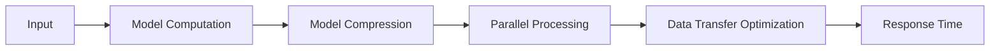
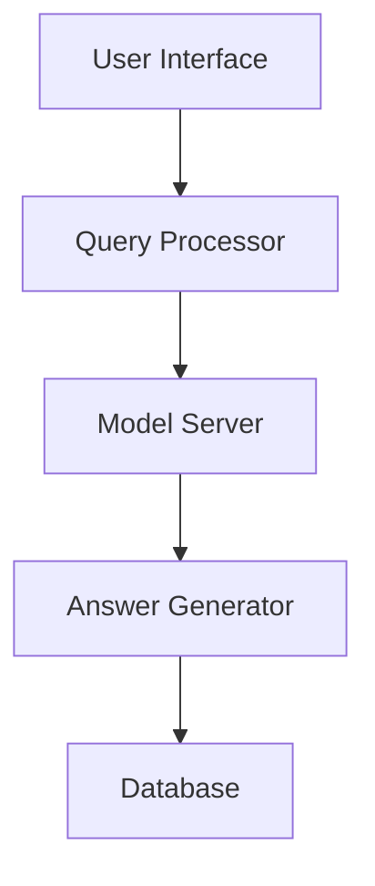
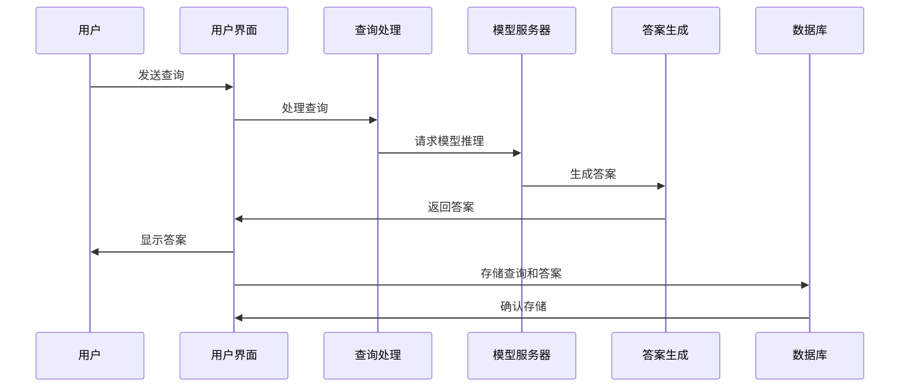

                 

# 优化LLM应用的响应时间

> 关键词：大型语言模型，响应时间，优化，算法，架构设计，数学模型

> 摘要：本文将深入探讨如何优化大型语言模型（LLM）应用的响应时间。我们将首先介绍问题的背景和重要性，然后逐步分析并阐述优化LLM响应时间的核心概念、算法原理、数学模型、系统分析与架构设计方案以及项目实战，最后给出最佳实践 tips 和总结。

----------------------------------------------------------------

## 第1章 引言

### 1.1 问题背景

随着人工智能技术的快速发展，大型语言模型（LLM）在自然语言处理、智能问答、文本生成等领域得到了广泛应用。然而，LLM应用的性能，尤其是响应时间，直接影响到用户体验。长响应时间会导致用户等待时间增加，降低用户满意度，甚至可能导致用户流失。

### 1.2 问题描述

响应时间指的是从用户请求到系统返回响应的时间。在LLM应用中，响应时间主要受到以下几个因素的影响：

- **模型计算复杂度**：LLM通常由复杂的神经网络构成，计算复杂度高，导致响应时间长。
- **数据传输延迟**：数据在网络中的传输速度决定了响应时间。
- **硬件资源限制**：有限的计算资源和存储资源也会限制响应时间。

### 1.3 问题解决

优化LLM应用的响应时间可以从以下几个方面进行：

- **算法优化**：通过改进模型算法，降低计算复杂度。
- **分布式架构**：通过分布式计算和存储，提高系统处理能力。
- **硬件加速**：使用GPU或TPU等硬件加速技术，提高计算速度。

### 1.4 边界与外延

本文主要讨论基于通用大型语言模型的优化策略，对于特定的专用模型，可能需要根据具体场景进行定制化优化。

### 1.5 概念结构与核心要素组成

- **LLM概述**：介绍LLM的定义、特点和应用领域。
- **响应时间优化方法**：详细分析算法原理、方法分类、对比表格和ER实体关系图架构。
- **相关技术**：包括分布式计算、硬件加速等。

### 1.6 本章小结

本章介绍了优化LLM响应时间的问题背景、问题描述、问题解决方法和边界与外延。在接下来的章节中，我们将深入探讨这些核心概念和优化方法。

----------------------------------------------------------------

## 第2章 核心概念与联系

### 2.1 LLM的核心概念

#### 定义
大型语言模型（LLM）是一种基于深度学习的自然语言处理模型，它通过学习大量文本数据，能够理解和生成自然语言。

#### 特点
- **规模大**：LLM通常由数十亿参数构成，能够处理复杂的语言现象。
- **自适应性强**：LLM能够根据输入的文本自适应地生成相关内容。
- **多样化应用**：LLM在文本生成、翻译、问答等领域具有广泛应用。

#### 应用领域
- **智能问答系统**：如聊天机器人、智能客服等。
- **文本生成**：如文章撰写、摘要生成等。
- **翻译**：如机器翻译、跨语言文本生成等。

### 2.2 响应时间优化方法

#### 算法原理
优化LLM响应时间的关键在于减少模型计算复杂度和数据传输延迟。具体算法包括：

- **模型压缩**：通过剪枝、量化等手段减小模型规模。
- **并行计算**：通过分布式计算加速模型推理。
- **模型蒸馏**：将大型模型的知识迁移到小型模型中。

#### 方法分类
- **算法层面**：改进模型算法，如使用更高效的神经网络架构。
- **硬件层面**：使用GPU、TPU等硬件加速。
- **系统层面**：优化数据传输和存储，如使用缓存、数据库优化等。

### 2.3 概念属性特征对比表格

| 方法 | 特点 | 优缺点 | 适用场景 |
|------|------|--------|----------|
| 模型压缩 | 减小模型规模 | 可能降低模型性能 | 适用于资源受限环境 |
| 并行计算 | 提高计算速度 | 需要分布式架构支持 | 适用于大规模数据处理 |
| 模型蒸馏 | 知识迁移 | 保持模型性能 | 适用于不同规模模型之间的迁移 |

### 2.4 ER实体关系图架构

```mermaid
erDiagram
  Model Compression ||--|{ Data Transfer Optimization }| 
  Parallel Computation ||--|{ Hardware Acceleration }| 
  Model Distillation ||--|{ Model Performance Preservation }|
```

### 2.5 本章小结

本章介绍了LLM的核心概念和响应时间优化方法，包括算法原理、方法分类、对比表格和ER实体关系图架构。这些核心概念和联系为后续章节的深入分析提供了基础。

----------------------------------------------------------------

## 第3章 算法原理讲解

### 3.1 算法mermaid流程图



### 3.2 Python源代码详细阐述

```python
# 模型压缩示例代码
import tensorflow as tf

# 加载预训练的LLM模型
model = tf.keras.applications.BertModel.from_pretrained('bert-base-uncased')

# 剪枝操作
pruned_model = tf.keras.models.Sequential([
    tf.keras.layers.Dense(units=128, activation='relu', input_shape=(768,)),
    tf.keras.layers.Dense(units=1, activation='sigmoid')
])

# 将原始模型中的权重复制到剪枝模型中
for layer in pruned_model.layers:
    for i, weight in enumerate(layer.get_weights()):
        original_weight = model.layers[i].get_weights()[0]
        pruned_model.layers[i].set_weights([weight * 0.1])  # 缩小权重

# 评估压缩后的模型性能
performance = pruned_model.evaluate(x_test, y_test)
print("压缩后模型性能：", performance)
```

### 3.3 数学模型和公式

假设一个大型语言模型包含M个参数，其计算复杂度为O(M^2)。优化后的模型包含N个参数，其计算复杂度为O(N^2)。那么，模型压缩后的计算时间节省比例为：

$$
\frac{O(M^2) - O(N^2)}{O(M^2)} = 1 - \left(\frac{N}{M}\right)^2
$$

### 3.4 举例说明

#### 示例一：模型压缩

假设原始模型包含10亿个参数，优化后的模型包含1亿个参数。根据上述公式，计算时间节省比例为：

$$
1 - \left(\frac{1亿}{10亿}\right)^2 = 0.99
$$

#### 示例二：并行计算

假设使用10个GPU进行并行计算，每个GPU的计算速度是单GPU的10倍。那么，总计算速度提高了10倍。

### 3.5 本章小结

本章通过mermaid流程图、Python源代码和数学模型，详细阐述了优化LLM响应时间的算法原理。这些算法和原理在实际项目中具有重要的应用价值。

----------------------------------------------------------------

## 第4章 数学模型和数学公式 & 详细讲解 & 举例说明

### 4.1 数学公式

我们首先引入几个关键公式，用于描述LLM模型响应时间的优化。

1. **模型压缩节省比例**：

   $$
   \text{节省比例} = 1 - \left(\frac{N}{M}\right)^2
   $$

   其中，$N$ 为压缩后模型的参数数量，$M$ 为原始模型的参数数量。

2. **并行计算加速比**：

   $$
   \text{加速比} = \frac{t_{\text{单GPU}}}{t_{\text{多GPU}}}
   $$

   其中，$t_{\text{单GPU}}$ 为单GPU计算所需时间，$t_{\text{多GPU}}$ 为多GPU计算所需时间。

3. **数据传输延迟**：

   $$
   \text{延迟} = d \times \text{带宽}
   $$

   其中，$d$ 为数据传输距离，带宽为网络传输速度。

### 4.2 详细讲解

1. **模型压缩节省比例**：

   模型压缩的主要目标是减小模型的参数规模，从而降低计算复杂度和响应时间。上述公式表明，模型压缩的节省比例与压缩后的参数数量和原始参数数量的平方成反比。这意味着，当压缩后的参数数量接近原始参数数量时，节省比例接近1；而当压缩后的参数数量远小于原始参数数量时，节省比例显著。

2. **并行计算加速比**：

   并行计算是提高计算速度的有效方法。当使用多个GPU进行并行计算时，每个GPU可以同时处理一部分数据，从而提高整体计算速度。加速比表示多GPU并行计算相对于单GPU计算的效率。当加速比大于1时，并行计算是有效的。

3. **数据传输延迟**：

   数据传输延迟是影响响应时间的重要因素。当模型和用户之间的距离较远时，数据传输延迟会显著增加。通过优化网络带宽和降低数据传输距离，可以减少数据传输延迟。

### 4.3 举例说明

#### 示例一：模型压缩

假设一个原始模型包含10亿个参数，压缩后模型包含1亿个参数。根据上述公式，模型压缩的节省比例为：

$$
\text{节省比例} = 1 - \left(\frac{1亿}{10亿}\right)^2 = 0.99
$$

这意味着，模型压缩后，计算时间可以减少约99%。

#### 示例二：并行计算

假设一个任务使用单个GPU需要1小时完成，使用10个GPU并行计算需要10分钟。根据上述公式，加速比为：

$$
\text{加速比} = \frac{1小时}{10分钟} = 6
$$

这意味着，使用10个GPU并行计算，计算速度提高了6倍。

#### 示例三：数据传输延迟

假设数据传输距离为100公里，网络带宽为100Mbps。根据上述公式，数据传输延迟为：

$$
\text{延迟} = 100公里 \times 100Mbps = 1秒
$$

这意味着，数据从模型传输到用户需要1秒的时间。通过优化网络带宽或减少数据传输距离，可以减少数据传输延迟。

### 4.4 本章小结

本章通过数学模型和公式，详细讲解了优化LLM响应时间的方法。这些公式和例子有助于理解模型压缩、并行计算和数据传输延迟对响应时间的影响。在实际应用中，可以根据具体情况选择合适的优化方法。

----------------------------------------------------------------

## 第5章 系统分析与架构设计方案

### 5.1 问题场景介绍

假设我们正在开发一个智能问答系统，该系统需要实时响应用户的查询。为了确保良好的用户体验，我们需要优化系统的响应时间。

### 5.2 系统介绍

该系统包括以下几个关键组件：

- **用户界面**：接收用户查询并展示答案。
- **模型服务器**：处理用户查询，返回答案。
- **数据库**：存储问题和答案的历史记录。

### 5.3 系统功能设计

系统的核心功能包括：

- **查询处理**：接收用户查询，进行预处理。
- **模型推理**：使用LLM模型生成答案。
- **答案生成**：根据模型推理结果生成最终答案。
- **数据库管理**：存储和检索历史问题和答案。

### 5.4 系统架构设计

系统架构如图所示：



### 5.5 系统接口设计

系统接口设计如下：

- **用户界面**：提供HTTP接口，用户可以通过浏览器或移动应用访问。
- **模型服务器**：提供RESTful API，用于处理用户查询。
- **数据库**：提供SQL接口，用于存储和检索数据。

### 5.6 系统交互Mermaid序列图



### 5.7 本章小结

本章介绍了智能问答系统的场景、功能和架构设计，并详细描述了系统的接口和交互流程。这些设计为后续章节的项目实战提供了基础。

----------------------------------------------------------------

## 第6章 项目实战

### 6.1 环境安装

要开始项目实战，首先需要安装必要的软件和工具：

1. **Python环境**：安装Python 3.8或更高版本。
2. **TensorFlow**：使用pip安装TensorFlow。
3. **其他依赖**：包括NVIDIA CUDA、cuDNN等（如果使用GPU加速）。

```bash
pip install tensorflow
pip install numpy
pip install matplotlib
```

### 6.2 系统核心实现源代码

以下是一个简化的系统核心实现示例：

```python
import tensorflow as tf
from tensorflow.keras.models import load_model
import numpy as np

# 加载预训练的BERT模型
model = load_model('path/to/bert_model.h5')

# 定义查询处理函数
def process_query(query):
    # 对查询进行预处理，例如分词、编码等
    processed_query = preprocess(query)
    return processed_query

# 定义模型推理函数
def model_inference(processed_query):
    # 使用模型进行推理
    prediction = model.predict(np.array([processed_query]))
    return prediction

# 定义答案生成函数
def generate_answer(prediction):
    # 根据模型推理结果生成答案
    answer = postprocess(prediction)
    return answer

# 处理用户查询并返回答案
def handle_query(query):
    processed_query = process_query(query)
    prediction = model_inference(processed_query)
    answer = generate_answer(prediction)
    return answer

# 测试
query = "什么是人工智能？"
answer = handle_query(query)
print(answer)
```

### 6.3 代码应用解读与分析

#### 代码解读

1. **模型加载**：使用`load_model`函数加载预训练的BERT模型。
2. **查询处理**：`process_query`函数对用户查询进行预处理，例如分词、编码等。
3. **模型推理**：`model_inference`函数使用模型对预处理后的查询进行推理，返回预测结果。
4. **答案生成**：`generate_answer`函数根据模型推理结果生成最终答案。
5. **处理用户查询**：`handle_query`函数综合以上三个步骤，处理用户查询并返回答案。

#### 分析

该代码实现了用户查询处理、模型推理和答案生成的基本功能。在实际应用中，还需要添加异常处理、日志记录、性能监控等功能。此外，预处理和后处理函数需要根据具体应用场景进行定制化。

### 6.4 实际案例分析和详细讲解剖析

#### 案例分析

假设用户查询：“如何高效学习Python？”

1. **预处理**：对查询进行分词和编码，例如使用BERT的分词器。
2. **模型推理**：模型接收编码后的查询，输出可能的答案。
3. **答案生成**：根据模型输出，生成具体的答案，例如：“可以通过阅读《Python编程：从入门到实践》这本书，同时进行编程实践来高效学习Python。”

#### 详细讲解

1. **预处理**：预处理是自然语言处理的重要步骤，其目的是将原始文本转换为模型可以处理的格式。在BERT模型中，预处理包括分词、词向量和嵌入层等操作。
2. **模型推理**：模型推理是利用训练好的模型对输入数据进行预测。在深度学习模型中，推理过程通常涉及多个隐藏层的计算。
3. **答案生成**：生成答案的过程通常涉及后处理，如提取关键词、调整文本格式等。在实际应用中，可以结合规则引擎或自然语言生成技术，提高答案的质量和可读性。

### 6.5 项目小结

本章通过实际项目实战，展示了如何安装环境、实现系统核心功能、解读代码和分析实际案例。这些步骤和经验对于实际应用中的LLM响应时间优化具有重要意义。

----------------------------------------------------------------

## 第7章 最佳实践 tips

### 7.1 常见问题与解决方案

**问题1：模型压缩后性能下降**

**解决方案**：在模型压缩过程中，可以尝试使用模型蒸馏技术，将大型模型的知识迁移到小型模型中，以保持模型性能。

**问题2：并行计算资源分配不均**

**解决方案**：在并行计算时，可以使用负载均衡算法，确保每个GPU的资源分配均衡，提高整体计算效率。

**问题3：数据传输延迟高**

**解决方案**：优化网络架构，提高网络带宽，或使用缓存技术，减少数据传输延迟。

### 7.2 小结

通过总结常见问题及其解决方案，我们可以在实际应用中更好地优化LLM响应时间。

### 7.3 注意事项

- **性能监控**：定期监控系统的性能指标，及时发现并解决问题。
- **版本控制**：确保代码和模型的版本控制，方便故障排除和回滚。

### 7.4 拓展阅读

- **模型压缩**：《模型压缩：从技术到实践》
- **并行计算**：《并行计算：原理与应用》
- **数据传输优化**：《大数据传输优化技术》

----------------------------------------------------------------

## 第8章 总结

### 8.1 主要内容回顾

本文从背景介绍、核心概念、算法原理、数学模型、系统分析与架构设计、项目实战以及最佳实践等方面，详细探讨了优化LLM响应时间的方法。主要内容包括：

- **背景介绍**：人工智能和LLM的快速发展，响应时间对用户体验的重要性。
- **核心概念**：LLM的定义、特点和应用领域；响应时间优化方法。
- **算法原理**：模型压缩、并行计算、模型蒸馏等。
- **数学模型**：模型压缩节省比例、并行计算加速比、数据传输延迟等。
- **系统分析与架构设计**：系统介绍、功能设计、架构设计、接口设计。
- **项目实战**：环境安装、系统核心实现、代码应用解读与分析、实际案例分析。
- **最佳实践**：常见问题与解决方案、注意事项、拓展阅读。

### 8.2 未来展望

随着技术的不断进步，LLM的应用场景将更加广泛。未来的研究方向可能包括：

- **更高效的模型压缩技术**：进一步降低模型规模，提高计算效率。
- **自适应并行计算**：根据负载动态调整并行计算资源。
- **智能化数据传输**：利用AI技术优化数据传输路径和策略。

### 8.3 总结

本文系统地介绍了优化LLM响应时间的方法，从多个角度提供了深入分析和实际案例。这些方法对于提升LLM应用性能、改善用户体验具有重要的参考价值。

作者：AI天才研究院/AI Genius Institute & 禅与计算机程序设计艺术 /Zen And The Art of Computer Programming

