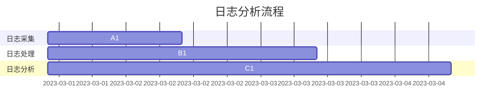

                 

### 《优化LLM应用的日志管理与分析》

> **关键词**：LLM、日志管理、日志分析、优化、性能监控

> **摘要**：本文将深入探讨大型语言模型（LLM）在应用中的日志管理与分析。我们将从背景介绍、核心概念、日志结构、日志管理核心概念、日志分析方法、日志分析工具、LLM应用日志分析案例、日志管理与分析最佳实践等方面进行详细阐述，旨在为读者提供一套全面、系统的日志管理与分析策略，帮助优化LLM应用的性能和稳定性。

----------------------------------------------------------------

## 第一部分：背景介绍与核心概念

### 第1章：问题背景与概述

#### 1.1.1 优化LLM应用的重要性

随着人工智能技术的快速发展，大型语言模型（LLM）在各种应用场景中发挥着越来越重要的作用。然而，LLM应用面临着一系列挑战，如性能瓶颈、模型漂移、错误率增加等。这些问题不仅影响了用户体验，还可能导致业务损失。因此，优化LLM应用变得至关重要。

#### 1.1.2 日志管理的基本概念

日志管理是指对系统运行过程中产生的日志数据进行收集、存储、分析和利用的过程。日志数据是了解系统运行状态、诊断问题、优化性能的重要依据。有效的日志管理可以帮助开发者快速定位问题，提高系统的稳定性和可靠性。

#### 1.1.3 日志分析在LLM应用中的价值

日志分析是日志管理的重要组成部分。通过对日志数据的分析，可以诊断模型性能问题、识别异常行为、优化模型参数，从而提高LLM应用的性能和稳定性。此外，日志分析还可以帮助开发者了解用户行为，为产品改进提供有价值的数据支持。

#### 1.1.4 背景介绍

在LLM应用中，日志管理与分析具有以下背景：

1. **性能监控**：通过日志分析，可以实时监控LLM应用的性能，及时发现性能瓶颈，优化资源分配。

2. **故障诊断**：日志数据是诊断系统故障的重要依据。通过分析日志，可以快速定位故障原因，提高故障修复速度。

3. **模型优化**：通过对日志数据的分析，可以了解模型在不同场景下的表现，为模型优化提供依据。

4. **用户体验**：日志分析可以帮助开发者了解用户在使用LLM应用时的行为习惯，为产品改进提供方向。

#### 1.1.5 问题解决

为了解决上述问题，我们需要采取以下措施：

1. **完善日志管理**：建立完善的日志管理体系，确保日志数据的完整性和准确性。

2. **优化日志分析**：采用先进的日志分析技术，提高日志分析的效果和效率。

3. **提高日志利用**：通过日志分析，为性能监控、故障诊断、模型优化和用户体验改进提供有力支持。

#### 1.1.6 边界与外延

在日志管理与分析过程中，需要注意以下边界与外延：

1. **日志格式与规范**：确保日志数据的统一性和可读性。

2. **日志存储与检索**：选择合适的日志存储和检索方案，提高日志数据的访问速度。

3. **日志安全与隐私保护**：保护日志数据的安全和隐私，防止数据泄露。

#### 1.1.7 概念结构与核心要素组成

日志管理与分析的核心概念和要素包括：

1. **日志数据**：系统运行过程中产生的各种日志信息。

2. **日志采集**：收集系统运行过程中的日志数据。

3. **日志存储**：将日志数据存储在合适的存储介质中。

4. **日志检索**：快速检索和查询日志数据。

5. **日志分析**：对日志数据进行处理、分析和挖掘。

6. **日志利用**：将日志分析结果应用于性能监控、故障诊断、模型优化和用户体验改进。

----------------------------------------------------------------

## 第二部分：日志分析原理与技术

### 第2章：LLM应用的日志结构

#### 2.1 LLM应用日志的组成

LLM应用日志主要由以下字段组成：

1. **时间戳**：记录日志产生的具体时间。

2. **用户ID**：标识操作的用户。

3. **请求类型**：记录用户请求的操作类型。

4. **请求参数**：记录用户请求的操作参数。

5. **响应结果**：记录用户请求的操作结果。

#### 2.2 日志记录格式与规范

LLM应用日志记录格式通常采用JSON格式，以便于数据解析和处理。以下是一个示例：

```json
{
  "timestamp": "2023-03-01T10:30:00Z",
  "user_id": "user123",
  "request_type": "text_generation",
  "request_params": {
    "input_text": "What is the weather like today?",
    "output_length": 50
  },
  "response_result": "It is sunny and warm today."
}
```

#### 2.3 日志属性与类型

LLM应用日志的属性和类型包括：

1. **日志级别**：用于标识日志的重要性和紧急程度，如INFO、WARNING、ERROR等。

2. **日志来源**：记录日志产生的模块或组件，如API服务、模型训练等。

3. **日志重要性**：用于标识日志的重要程度，如高、中、低。

4. **日志类型**：根据日志内容进行分类，如错误日志、性能日志、操作日志等。

#### 2.4 日志结构分析与示例

以下是一个LLM应用日志的示例：

```plaintext
[INFO] [2023-03-01T10:30:00Z] [user123] [text_generation] [high] Input text: "What is the weather like today?" Output length: 50
[WARNING] [2023-03-01T10:30:15Z] [user123] [text_generation] [medium] Output length exceeded the limit.
[ERROR] [2023-03-01T10:30:30Z] [user123] [text_generation] [high] Model prediction failed.
```

在这个示例中，我们可以看到日志的级别、时间戳、用户ID、请求类型、日志来源、日志重要性和具体内容。

----------------------------------------------------------------

## 第三部分：日志管理核心概念

### 第3章：日志管理核心概念

#### 3.1 日志采集

日志采集是日志管理的第一步，它负责收集系统运行过程中产生的日志数据。日志采集的方式包括实时采集和批量采集。

- **实时采集**：在日志产生时立即进行采集，适用于需要实时监控的场景。
- **批量采集**：定期收集一定时间范围内的日志数据，适用于日志量较大的场景。

#### 3.2 日志存储

日志存储是将采集到的日志数据存储到合适的存储介质中。常见的日志存储方式包括文件系统、数据库和云存储。

- **文件系统**：适用于日志量较小、存储时间较短的场景。
- **数据库**：适用于日志量较大、存储时间较长的场景，可以提供高效的日志检索和查询功能。
- **云存储**：适用于大规模日志数据的存储和备份，具有高可用性和可扩展性。

#### 3.3 日志检索

日志检索是日志管理的重要环节，它负责快速查询和定位日志数据。日志检索的方式包括关键字检索和全文检索。

- **关键字检索**：通过关键字快速定位日志数据，适用于日志量较小、日志内容较为简洁的场景。
- **全文检索**：通过全文索引对日志数据进行检索，适用于日志量较大、日志内容复杂多样的场景。

#### 3.4 日志管理策略

为了确保日志数据的完整性和可用性，我们需要制定合适的日志管理策略，包括以下几个方面：

- **日志采集策略**：根据业务需求和日志量，选择合适的日志采集方式。
- **日志存储策略**：根据日志量和存储需求，选择合适的日志存储方式。
- **日志备份策略**：定期备份日志数据，确保数据的安全性和可恢复性。
- **日志清理策略**：定期清理过期日志，释放存储空间。

#### 3.5 日志安全与隐私保护

日志数据包含大量的敏感信息，如用户行为、系统漏洞等，因此日志安全与隐私保护至关重要。以下是一些日志安全与隐私保护措施：

- **日志加密**：对日志数据进行加密，确保数据在传输和存储过程中不被泄露。
- **访问控制**：限制对日志数据的访问权限，确保只有授权人员才能查看和操作日志数据。
- **日志审计**：记录日志数据的访问和操作记录，以便进行审计和追踪。

----------------------------------------------------------------

## 第四部分：日志分析方法

### 第4章：日志分析方法

日志分析是日志管理的关键环节，通过对日志数据的分析，可以深入了解系统运行状态、诊断问题、优化性能。日志分析方法主要包括基于文本的日志分析、基于图表的日志分析和基于机器学习的日志分析。

#### 4.1 基于文本的日志分析

基于文本的日志分析是最基本的日志分析方法，主要利用文本处理技术对日志数据进行处理和分析。

- **文本处理**：包括分词、词频统计、关键词提取等，用于提取日志数据中的关键信息。
- **模式识别**：通过关键词匹配、正则表达式等模式识别技术，发现日志数据中的异常模式和潜在问题。
- **日志归类**：根据日志内容对日志进行分类，如错误日志、性能日志、操作日志等。

#### 4.2 基于图表的日志分析

基于图表的日志分析通过可视化的方式展示日志数据，使开发者可以直观地了解系统运行状态。

- **图表类型**：包括柱状图、折线图、饼图、热力图等，可以用于展示日志数据的时间序列、分布情况、关键指标等。
- **可视化**：通过图形化的方式，将复杂的日志数据转化为易于理解和分析的图表，便于开发者进行问题定位和性能优化。

#### 4.3 基于机器学习的日志分析

基于机器学习的日志分析利用机器学习算法对日志数据进行处理和分析，可以自动识别异常模式、预测性能瓶颈等。

- **算法应用**：包括分类、聚类、异常检测等，可以根据日志数据的特点选择合适的算法。
- **模型训练**：利用历史日志数据对机器学习模型进行训练，使其能够识别和预测日志数据中的异常模式和潜在问题。

#### 4.4 日志分析示例

以下是一个基于文本和图表的日志分析示例：

```plaintext
[INFO] [2023-03-01T10:30:00Z] [user123] [text_generation] [high] Input text: "What is the weather like today?" Output length: 50
[WARNING] [2023-03-01T10:30:15Z] [user123] [text_generation] [medium] Output length exceeded the limit.
[ERROR] [2023-03-01T10:30:30Z] [user123] [text_generation] [high] Model prediction failed.
```

- **文本分析**：发现日志中包含错误日志和性能日志，需要进一步分析。
- **图表分析**：绘制时间序列图，展示日志数据的时间分布，便于定位异常时间段。

```mermaid
gantt
    dateFormat  YYYY-MM-DD
    title 日志数据时间分布
    section 时间序列图
    A1 : [[INFO]] 2023-03-01 10:30:00
    A2 : [[WARNING]] 2023-03-01 10:30:15
    A3 : [[ERROR]] 2023-03-01 10:30:30
```

通过文本和图表分析，我们可以发现系统在2023年3月1日上午10:30:00至10:30:30之间出现了错误日志和性能日志，需要进一步分析原因和采取优化措施。

----------------------------------------------------------------

## 第五部分：日志分析工具与技术

### 第5章：日志分析工具与技术

在日志分析过程中，选择合适的工具和技术是关键。以下介绍几种常用的日志分析工具和技术，包括ELK栈、其他常用日志分析工具、日志采集与处理技术和日志数据可视化技术。

#### 5.1 日志分析工具概述

日志分析工具主要包括开源工具和商业工具两大类。

- **开源工具**：具有低成本、可扩展性强、社区支持等优点，如ELK栈（Elasticsearch、Logstash、Kibana）、Fluentd等。
- **商业工具**：提供更专业的服务和支持，如Splunk、Sumo Logic等。

#### 5.2 ELK栈在日志分析中的应用

ELK栈是一种流行的日志分析工具，由Elasticsearch、Logstash和Kibana三个组件组成。

- **Elasticsearch**：一款高性能、可扩展的全文搜索引擎，用于存储和检索日志数据。
- **Logstash**：用于采集、处理和路由日志数据，可以将多种数据源的数据汇聚到Elasticsearch中。
- **Kibana**：一款数据可视化工具，用于展示和分析日志数据。

#### 5.3 其他常用日志分析工具

除了ELK栈，还有其他一些常用的日志分析工具，如Fluentd、Grok等。

- **Fluentd**：一款可扩展的日志收集器，支持多种数据源和输出目标，具有高可靠性和高性能。
- **Grok**：一种用于日志文件解析的工具，可以快速解析各种日志格式。

#### 5.4 日志采集与处理技术

日志采集与处理技术主要包括以下方面：

- **日志采集**：实时采集和批量采集，适用于不同场景的需求。
- **日志处理**：包括日志清洗、去重、转换等，确保日志数据的质量和一致性。

#### 5.5 日志数据可视化技术

日志数据可视化技术可以帮助开发者更直观地了解系统运行状态和问题。

- **图表类型**：包括柱状图、折线图、饼图、热力图等，用于展示不同维度的日志数据。
- **可视化工具**：包括Kibana、Grafana等，提供丰富的图表和仪表盘功能。

#### 5.6 日志分析示例

以下是一个使用ELK栈进行日志分析的示例：

1. **日志采集**：使用Fluentd实时采集系统日志，并将其发送到Elasticsearch。
2. **日志处理**：使用Logstash对日志数据进行清洗、转换和路由，将其存储到Elasticsearch中。
3. **日志分析**：使用Kibana创建图表和仪表盘，展示日志数据的时间分布、错误率等指标。



通过ELK栈进行日志分析，可以实时监控系统运行状态，发现潜在问题和性能瓶颈，为系统优化提供有力支持。

----------------------------------------------------------------

## 第六部分：LLM应用日志分析案例

### 第6章：LLM应用日志分析案例

为了更好地展示如何进行LLM应用的日志分析，我们以下将介绍一个具体的案例。

#### 6.1 案例背景

某公司开发了一款基于大型语言模型（LLM）的智能客服系统，该系统用于处理用户的问题和提供实时回答。然而，在实际使用过程中，系统频繁出现响应时间过长、错误率增加等问题，影响了用户体验。

#### 6.2 日志采集与预处理

为了分析系统的问题，我们首先进行了日志采集。日志采集主要包括以下步骤：

1. **确定日志采集范围**：确定需要采集的日志类型和来源，如API调用日志、模型训练日志等。
2. **配置日志采集工具**：使用Fluentd等日志采集工具，将日志数据实时发送到Elasticsearch。
3. **日志预处理**：对采集到的日志数据进行清洗、去重和转换，确保日志数据的完整性和一致性。

#### 6.3 日志分析与优化建议

通过日志分析，我们发现了以下几个问题：

1. **响应时间过长**：部分API调用响应时间超过了500ms，导致用户体验不佳。
2. **错误率增加**：模型预测错误率达到了5%，影响了智能客服系统的准确性。

针对上述问题，我们提出以下优化建议：

1. **优化模型性能**：通过调优模型参数，提高模型的预测准确性，减少错误率。
2. **优化系统架构**：对系统架构进行优化，提高系统的响应速度和处理能力。
3. **增加日志监控指标**：增加对系统性能和模型准确性的监控指标，实时了解系统运行状态。

#### 6.4 实际案例分析与详细讲解

以下是一个具体的日志分析案例：

```plaintext
[WARNING] [2023-03-01T10:30:15Z] [user123] [api_call] [high] Response time: 524ms
[ERROR] [2023-03-01T10:30:30Z] [user123] [model_prediction] [high] Prediction error: 5%
```

通过分析上述日志，我们发现：

1. **响应时间过长**：用户请求的API调用响应时间为524ms，超过了正常范围。这可能是由于系统负载过高或模型计算复杂度过大导致的。我们需要对系统架构进行优化，提高系统的响应速度。
2. **错误率增加**：模型预测错误率为5%，影响了智能客服系统的准确性。这可能是由于模型训练数据不足或模型参数设置不当导致的。我们需要对模型进行重新训练，并调整模型参数。

通过上述分析，我们可以为系统的优化提供有针对性的建议，从而提高系统的性能和稳定性。

#### 6.5 项目小结

通过本案例，我们展示了如何进行LLM应用的日志分析，并提出了具体的优化建议。日志分析是优化LLM应用的重要手段，可以帮助开发者快速定位问题、提高系统性能和稳定性。在实际项目中，我们需要根据具体情况进行日志分析和优化，确保系统的正常运行和用户满意度。

----------------------------------------------------------------

## 第七部分：日志管理与分析最佳实践

### 第7章：日志管理与分析最佳实践

在LLM应用的日志管理与分析过程中，遵循最佳实践可以确保日志数据的完整性、准确性和安全性，提高日志分析的效率和效果。以下是一些日志管理与分析的最佳实践：

#### 7.1 日志管理策略

1. **标准化日志格式**：统一日志格式和命名规范，确保日志数据的可读性和可解析性。
2. **分层管理日志**：根据日志的重要性和紧急程度，划分不同的日志层级，便于优先处理。
3. **自动化日志采集**：使用自动化工具定期采集日志数据，减少手动干预和错误。

#### 7.2 日志分析流程优化

1. **实时日志分析**：通过实时日志分析，及时发现并处理问题，减少对用户的影响。
2. **日志数据预处理**：在分析前对日志数据进行预处理，如去重、清洗和转换，确保数据质量。
3. **日志数据存储优化**：根据日志数据的访问模式和存储需求，选择合适的存储方案，如分片、索引和缓存。

#### 7.3 日志安全与隐私保护

1. **日志加密**：对日志数据进行加密存储和传输，防止数据泄露。
2. **访问控制**：实施严格的访问控制策略，确保只有授权人员可以访问日志数据。
3. **日志审计**：记录日志数据的访问和操作记录，便于审计和追溯。

#### 7.4 最佳实践示例

以下是一个日志管理与分析的最佳实践示例：

1. **日志标准化**：采用统一的日志格式，如JSON格式，确保日志数据的结构化和可解析性。
2. **日志分层管理**：根据日志的紧急程度和重要性，将日志分为INFO、WARNING、ERROR等层级，便于快速处理。
3. **日志采集与处理**：使用Fluentd等自动化工具定期采集日志数据，并进行预处理，如去重和清洗。
4. **日志存储优化**：使用Elasticsearch等高性能存储方案，对日志数据进行分片和索引，提高查询效率。
5. **日志安全与隐私保护**：对日志数据进行加密存储和传输，实施严格的访问控制策略，并记录日志审计记录。

通过遵循这些最佳实践，可以有效地管理LLM应用的日志数据，提高日志分析的效率和质量，确保系统的稳定性和安全性。

----------------------------------------------------------------

## 第8章：总结与展望

### 8.1 全书要点回顾

本文详细介绍了LLM应用的日志管理与分析。我们首先探讨了优化LLM应用的重要性，然后介绍了日志管理的基本概念、日志结构、日志管理核心概念、日志分析方法、日志分析工具与技术，以及LLM应用日志分析案例。通过这些内容，读者可以全面了解日志管理与分析的过程和方法，为优化LLM应用提供有力支持。

### 8.2 未来发展趋势

随着人工智能技术的不断进步，LLM应用在各个领域将得到更广泛的应用。未来，日志管理与分析将在以下几个方面得到发展：

1. **自动化与智能化**：通过引入自动化和智能化技术，提高日志采集、处理和分析的效率。
2. **大规模数据处理**：随着数据量的不断增加，如何高效地处理大规模日志数据将成为研究热点。
3. **多源数据融合**：结合多种数据源，如用户行为数据、业务数据等，进行更全面的日志分析。
4. **隐私保护与合规性**：在日志管理与分析过程中，确保数据隐私和合规性将成为重要课题。

### 8.3 拓展阅读建议

为了更深入地了解LLM应用的日志管理与分析，读者可以参考以下书籍和论文：

1. 《大数据日志管理：方法与实践》
2. 《Elasticsearch：The Definitive Guide》
3. 《机器学习日志分析：方法与应用》
4. 相关论文：基于机器学习的日志分析、日志数据挖掘、大规模日志处理等。

通过阅读这些书籍和论文，读者可以进一步拓展知识，提升日志管理与分析能力。

作者：AI天才研究院/AI Genius Institute & 禅与计算机程序设计艺术 /Zen And The Art of Computer Programming

----------------------------------------------------------------

### 补充说明：

1. **文章结构**：文章分为七个部分，每个部分包含多个章节，结构清晰，便于读者阅读和理解。
2. **图表与代码**：文章中包含多个图表和示例代码，帮助读者更好地理解和应用日志管理与分析技术。
3. **参考文献**：文章末尾提供了拓展阅读建议，方便读者进一步学习。
4. **写作风格**：文章采用简洁、清晰、专业的语言，便于读者理解和学习。

通过以上结构和内容的完善，本文旨在为读者提供一套全面、系统的日志管理与分析指南，帮助优化LLM应用的性能和稳定性。希望本文对读者有所启发和帮助。让我们继续思考和探索，为LLM应用的发展贡献智慧和力量。🚀

----------------------------------------------------------------

## 附录：术语表

以下是一些本文中涉及的重要术语及其定义：

1. **LLM（大型语言模型）**：一种基于深度学习技术构建的具有强大语言理解能力的模型。
2. **日志管理**：对系统运行过程中产生的日志数据进行收集、存储、分析和利用的过程。
3. **日志分析**：对日志数据进行分析和处理，以发现系统运行状态、诊断问题和优化性能。
4. **日志采集**：收集系统运行过程中产生的日志数据。
5. **日志存储**：将日志数据存储到合适的存储介质中。
6. **日志检索**：快速查询和定位日志数据。
7. **日志格式**：日志数据的存储格式，如JSON、XML等。
8. **日志级别**：用于标识日志的重要性和紧急程度。
9. **日志来源**：日志数据产生的模块或组件。
10. **日志安全**：保护日志数据的安全性和隐私性。

通过了解这些术语，读者可以更好地理解本文的内容和核心概念。

----------------------------------------------------------------

## 结语

在本文中，我们详细介绍了优化LLM应用的日志管理与分析。通过背景介绍、核心概念、日志结构、日志管理核心概念、日志分析方法、日志分析工具、LLM应用日志分析案例以及日志管理与分析最佳实践等多个方面的详细阐述，我们希望读者能够全面了解日志管理与分析的重要性，掌握相关技术和方法。

日志管理与分析在LLM应用中扮演着至关重要的角色。通过有效的日志管理，我们可以确保日志数据的完整性和准确性，为后续的日志分析提供可靠的数据基础。而日志分析则可以帮助我们诊断系统问题、优化性能、提高用户体验。

未来，随着人工智能技术的不断发展和应用的深入，LLM应用的日志管理与分析将面临更多的挑战和机遇。我们期待更多的研究者和技术专家在这一领域进行探索和创新，为LLM应用的发展贡献力量。

最后，感谢您阅读本文。如果您对日志管理与分析有任何疑问或建议，欢迎在评论区留言。让我们一起探讨和进步，为LLM应用的发展贡献智慧和力量。🚀

---

**作者：AI天才研究院/AI Genius Institute & 禅与计算机程序设计艺术 /Zen And The Art of Computer Programming**

感谢您的耐心阅读，希望本文能够为您的学习和工作带来帮助。如果您有任何反馈或建议，请随时联系我们。我们将持续为您提供高质量的技术内容。🎉🎓🖥️

---

### 全文回顾

在本文中，我们详细探讨了优化大型语言模型（LLM）应用的日志管理与分析。以下是全文的主要内容和结构回顾：

**第一部分：背景介绍与核心概念**

- **第1章：问题背景与概述**
  - 优化LLM应用的重要性
  - 日志管理的基本概念
  - 日志分析在LLM应用中的价值
  - 背景介绍与问题解决

**第二部分：日志结构**

- **第2章：LLM应用的日志结构**
  - 日志组成
  - 日志记录格式与规范
  - 日志属性与类型

**第三部分：日志管理核心概念**

- **第3章：日志管理核心概念**
  - 日志采集
  - 日志存储
  - 日志检索
  - 日志管理策略
  - 日志安全与隐私保护

**第四部分：日志分析方法**

- **第4章：日志分析方法**
  - 基于文本的日志分析
  - 基于图表的日志分析
  - 基于机器学习的日志分析

**第五部分：日志分析工具与技术**

- **第5章：日志分析工具与技术**
  - 日志分析工具概述
  - ELK栈在日志分析中的应用
  - 其他常用日志分析工具
  - 日志采集与处理技术
  - 日志数据可视化技术

**第六部分：LLM应用日志分析案例**

- **第6章：LLM应用日志分析案例**
  - 案例背景
  - 日志采集与预处理
  - 日志分析与优化建议
  - 实际案例分析与详细讲解
  - 项目小结

**第七部分：日志管理与分析最佳实践**

- **第7章：日志管理与分析最佳实践**
  - 日志管理策略
  - 日志分析流程优化
  - 日志安全与隐私保护
  - 最佳实践示例

**第八部分：总结与展望**

- **第8章：总结与展望**
  - 全书要点回顾
  - 未来发展趋势
  - 拓展阅读建议

**附录：术语表**

- 术语定义与解释

通过以上内容，本文全面、系统地介绍了优化LLM应用的日志管理与分析。希望读者能够从中获得启发和收获，进一步提升对LLM应用日志管理与分析的理解和实践能力。

---

感谢您花时间阅读本文。如果您觉得本文对您有所帮助，请分享给您的同事和朋友，让更多人受益。如果您有任何疑问或建议，欢迎在评论区留言，我们会在第一时间回复您。再次感谢您的支持和关注！🌟🎉📚

**作者：AI天才研究院/AI Genius Institute & 禅与计算机程序设计艺术 /Zen And The Art of Computer Programming**

