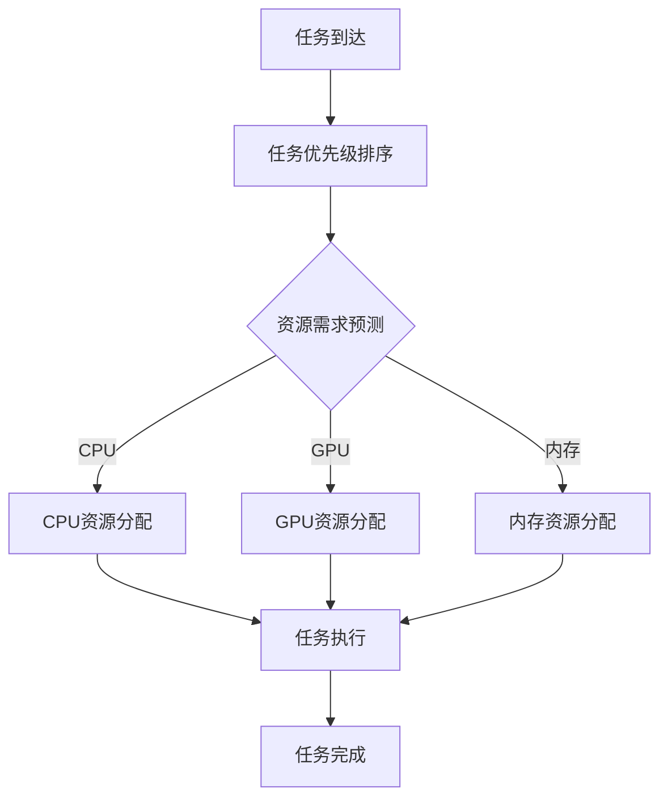
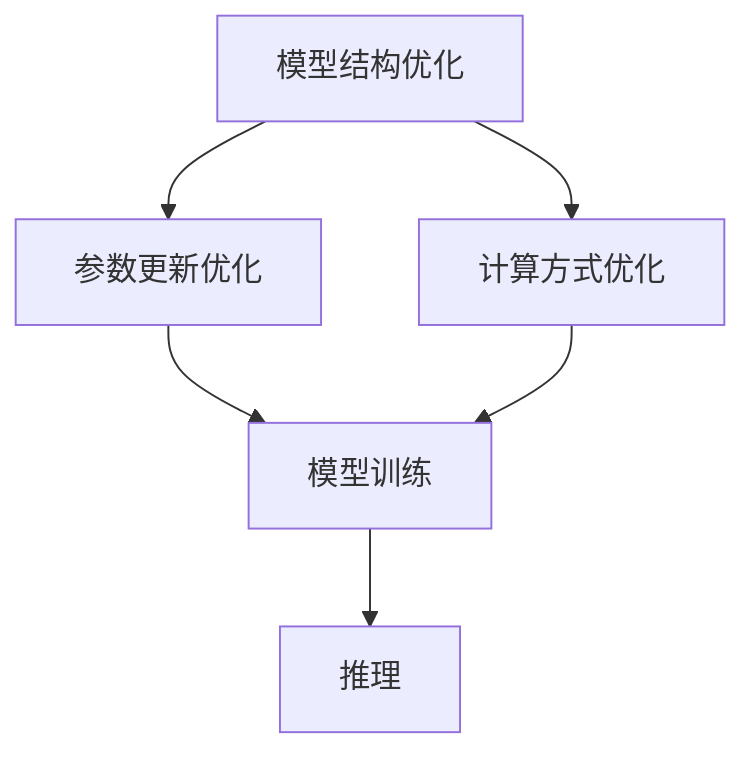
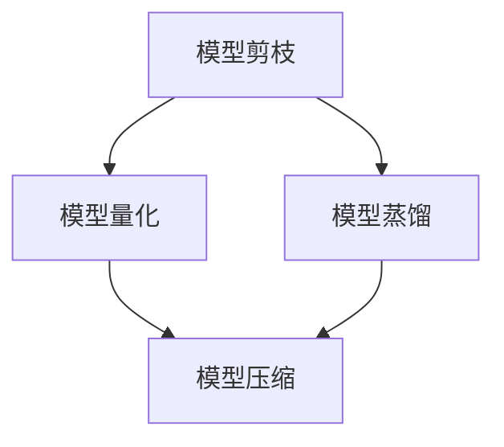
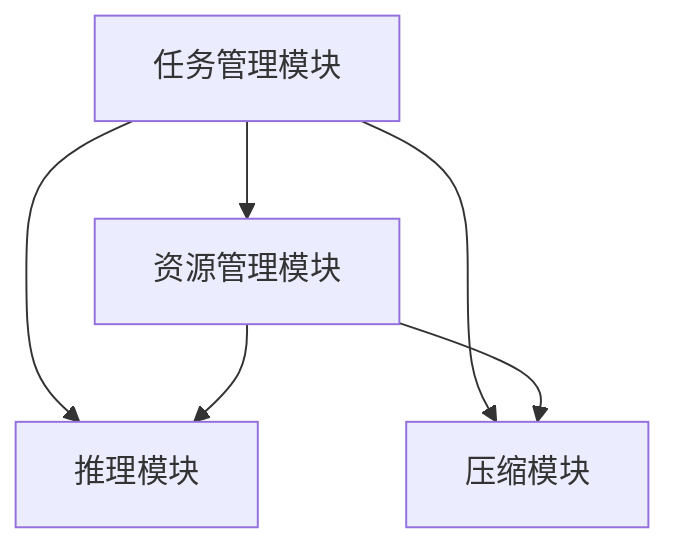

                 

# 优化LLM应用的资源利用效率

## 关键词

- 大型语言模型（LLM）
- 资源利用效率
- 动态资源分配
- 推理优化算法
- 模型压缩技术

## 摘要

随着人工智能技术的迅速发展，大型语言模型（LLM）在诸多领域展现出了强大的应用潜力。然而，LLM在资源利用效率方面面临着诸多挑战，如资源分配不均衡、推理延迟高等。本文将深入探讨这些问题，并提出相应的解决方案。通过动态资源分配策略、推理优化算法和模型压缩技术，本文旨在优化LLM应用的资源利用效率，提升其性能和应用广度。

### 目录大纲

1. 第一部分：背景介绍
    1.1 问题背景与描述
        1.1.1 问题背景
        1.1.2 问题描述
        1.1.3 问题解决与边界
        1.1.4 概念结构与核心要素
2. 第二部分：核心概念与联系
    2.1 大型语言模型（LLM）原理
    2.2 资源利用效率属性特征
    2.3 资源分配策略属性特征
    2.4 推理优化算法属性特征
    2.5 模型压缩技术属性特征
    2.6 ER实体关系图架构
3. 第三部分：算法原理讲解
    3.1 动态资源分配策略
        3.1.1 算法原理
        3.1.2 算法流程图
        3.1.3 示例分析
    3.2 推理优化算法
        3.2.1 算法原理
        3.2.2 算法流程图
        3.2.3 示例分析
    3.3 模型压缩技术
        3.3.1 算法原理
        3.3.2 算法流程图
        3.3.3 示例分析
4. 第四部分：系统分析与架构设计方案
    4.1 问题场景介绍
    4.2 项目介绍
    4.3 系统功能设计
    4.4 系统架构设计
    4.5 系统接口设计和系统交互
5. 第五部分：项目实战
    5.1 环境安装
    5.2 系统核心实现
    5.3 代码应用解读与分析
    5.4 实际案例分析和详细讲解剖析
    5.5 项目小结
6. 第六部分：最佳实践 tips、小结、注意事项、拓展阅读

## 第一部分：背景介绍

### 1.1 问题背景与描述

近年来，人工智能（AI）技术取得了飞速发展，其中大型语言模型（Large Language Model，简称LLM）成为了一项重要的研究与应用方向。LLM通过深度学习技术，对海量文本数据进行分析和学习，从而实现自然语言理解、文本生成、问答系统等多种任务。例如，GPT-3、BERT等模型在多项自然语言处理（NLP）任务中取得了突破性的成果。

然而，随着LLM规模的不断扩大，其在实际应用中的资源利用效率问题也日益凸显。首先，资源分配不均衡是一个显著问题。不同应用场景对计算资源的需求差异较大，导致某些场景资源过剩，而另一些场景资源不足。其次，推理延迟较高也是一大挑战。大型LLM在推理过程中往往需要大量的计算资源，导致推理速度较慢，影响了用户体验。此外，模型压缩效果不佳也是一个亟待解决的问题。现有的模型压缩方法在保持模型性能的同时，往往无法显著降低模型体积，这限制了LLM在移动设备等资源受限环境中的应用。

### 1.2 问题描述

在现有研究中，尽管已经提出了许多优化LLM资源利用效率的方法，但仍然存在以下问题：

1. **资源分配不均衡**：不同LLM应用场景对计算资源的需求差异较大，导致资源分配不均衡。例如，在文本生成任务中，模型需要较高的内存资源，而在问答系统中，模型对CPU和GPU的计算资源需求更高。

2. **推理延迟较高**：大型LLM在推理过程中往往需要大量的计算资源，导致推理延迟较高。这不仅影响了用户体验，还限制了LLM在实时应用场景中的使用。

3. **模型压缩效果不佳**：现有的模型压缩方法在保持模型性能的同时，往往无法显著降低模型体积。这限制了LLM在移动设备等资源受限环境中的应用。

### 1.3 问题解决与边界

针对上述问题，本文提出以下解决方案：

1. **资源分配策略**：研究针对不同LLM应用场景的动态资源分配策略，以实现资源利用最大化。例如，可以根据任务需求动态调整CPU、GPU和内存等资源的分配。

2. **推理优化算法**：探讨基于模型压缩和并行推理的优化算法，以提高推理速度和降低延迟。例如，可以采用模型压缩技术减少模型体积，从而降低计算资源需求；同时，利用并行推理技术提高推理速度。

3. **模型压缩技术**：研究新型模型压缩方法，以在保持模型性能的同时，显著降低模型体积。例如，可以采用剪枝、量化、蒸馏等技术，实现模型压缩。

本文的边界主要涉及LLM资源利用效率的优化方法，不包括LLM的其他研究方面，如模型训练、数据预处理等。

### 1.4 概念结构与核心要素

核心概念结构：

1. **大型语言模型（LLM）**：一种能够处理大规模语言数据的深度神经网络模型。
2. **资源利用效率**：衡量LLM应用中计算资源利用程度的指标。
3. **资源分配策略**：针对不同应用场景，合理分配计算资源的策略。
4. **推理优化算法**：用于提高LLM推理速度和降低延迟的算法。
5. **模型压缩技术**：用于减小LLM模型体积的技术。

核心要素组成：

1. **应用场景**：不同LLM应用场景的具体需求。
2. **计算资源**：包括CPU、GPU、内存等。
3. **性能指标**：包括推理速度、延迟、模型体积等。

## 第二部分：核心概念与联系

### 2.1 大型语言模型（LLM）原理

#### 2.1.1 大型语言模型（LLM）原理

大型语言模型（LLM）基于深度学习技术，通过训练大量文本数据，学习到语言的内在规律和语义信息。其核心原理包括：

1. **词嵌入（Word Embedding）**：词嵌入是将自然语言文本转换为密集的向量表示的过程。在LLM中，通常使用词嵌入层将输入文本转换为词向量。

   $$ \text{word\_embedding}(x) = \text{Vec}(x) $$

   其中，$x$表示输入文本，$\text{Vec}(x)$表示将文本转换为词向量。

2. **多层神经网络（Multi-layer Neural Network）**：多层神经网络是LLM的核心组成部分。通过多层神经网络的堆叠，逐步提取文本的语义特征。

   $$ \text{NeuralNetwork}(x) = f(\text{Layer}_1(f(\text{Layer}_2(...f(\text{Layer}_n(x))...))) $$

   其中，$f$表示激活函数，$\text{Layer}_i$表示第$i$层神经网络。

3. **注意力机制（Attention Mechanism）**：注意力机制是LLM中的重要组成部分，用于提高模型对文本关键信息的捕捉能力。通过注意力机制，模型可以自动关注文本中的关键信息。

   $$ \text{Attention}(x) = \text{softmax}(\text{W}_A \text{T}) $$

   其中，$x$表示输入文本，$W_A$表示注意力权重矩阵，$T$表示文本的词向量。

#### 2.1.2 资源利用效率属性特征

资源利用效率是指LLM应用中计算资源利用程度的指标。其属性特征包括：

1. **计算资源分配**：包括CPU、GPU、内存等资源的分配情况。合理的计算资源分配可以提高LLM的性能和应用效率。

   $$ \text{Resource\_Allocation} = \text{CPU\_Resource} + \text{GPU\_Resource} + \text{Memory\_Resource} $$

2. **推理延迟**：推理延迟是指LLM在处理输入文本时所需的时间。较低的推理延迟可以提高用户体验。

   $$ \text{Inference\_Delay} = \text{Time}_{\text{Processing}} $$

3. **模型体积**：模型体积是指LLM模型的存储空间大小。较小的模型体积可以降低存储成本，提高部署效率。

   $$ \text{Model\_Size} = \text{Number}_{\text{Parameters}} \times \text{Size}_{\text{Parameter}} $$

#### 2.1.3 资源分配策略属性特征

资源分配策略旨在实现LLM应用中计算资源的最优利用。其属性特征包括：

1. **动态分配**：根据实际应用需求，动态调整计算资源的分配。例如，可以根据任务紧急程度和资源需求，动态调整CPU和GPU的利用率。

   $$ \text{Dynamic\_Allocation} = f(\text{Task}_{\text{Priority}}, \text{Resource}_{\text{Requirement}}) $$

2. **权重分配**：为不同应用场景分配不同的计算资源权重。例如，在文本生成任务中，可以分配更高的内存资源权重。

   $$ \text{Weighted\_Allocation} = w_1 \times \text{CPU}_{\text{Resource}} + w_2 \times \text{GPU}_{\text{Resource}} + w_3 \times \text{Memory}_{\text{Resource}} $$

   其中，$w_1, w_2, w_3$为权重系数。

3. **优先级分配**：根据任务紧急程度，优先分配计算资源。例如，在实时问答系统中，可以优先分配CPU和GPU资源。

   $$ \text{Priority\_Allocation} = \text{Task}_{\text{Priority}} \times \text{Resource}_{\text{Requirement}} $$

#### 2.1.4 推理优化算法属性特征

推理优化算法用于提高LLM推理速度和降低延迟。其属性特征包括：

1. **模型压缩**：通过压缩模型体积，减少计算资源需求。例如，可以采用剪枝、量化、蒸馏等技术实现模型压缩。

   $$ \text{Model\_Compression} = \text{Pruned}_{\text{Model}} + \text{Quantized}_{\text{Model}} + \text{Distilled}_{\text{Model}} $$

2. **并行推理**：在多个处理器上同时进行推理，提高推理速度。例如，可以采用分布式推理技术实现并行推理。

   $$ \text{Parallel\_Inference} = \text{CPU}_{\text{Parallel}} + \text{GPU}_{\text{Parallel}} $$

3. **缓存策略**：利用缓存技术，减少重复计算，降低延迟。例如，可以采用局部缓存技术实现缓存策略。

   $$ \text{Cache\_Strategy} = \text{Local\_Cache} + \text{Global\_Cache} $$

#### 2.1.5 模型压缩技术属性特征

模型压缩技术用于减小LLM模型体积。其属性特征包括：

1. **剪枝（Pruning）**：通过剪除模型中的冗余参数，降低模型体积。例如，可以采用结构化剪枝技术实现模型剪枝。

   $$ \text{Pruning} = \text{Structured}_{\text{Pruning}} + \text{Unstructured}_{\text{Pruning}} $$

2. **量化（Quantization）**：将模型参数的精度降低到整数或固定点数，以减少模型体积。例如，可以采用全精度量化或低精度量化技术实现模型量化。

   $$ \text{Quantization} = \text{Full}_{\text{Precision}} + \text{Low}_{\text{Precision}} $$

3. **蒸馏（Distillation）**：将大模型的知识迁移到小模型中，以减少模型体积。例如，可以采用知识蒸馏技术实现模型蒸馏。

   $$ \text{Distillation} = \text{Knowledge}_{\text{Distillation}} + \text{Model}_{\text{Distillation}} $$

#### 2.1.6 ER实体关系图架构

ER实体关系图架构用于描述LLM应用中各个实体之间的关系。其结构包括：

1. **实体（Entity）**：包括LLM、计算资源、资源分配策略、推理优化算法、模型压缩技术等。

2. **关系（Relationship）**：描述实体之间的关联，如LLM与计算资源的关联、资源分配策略与推理优化算法的关联等。

   $$ \text{Entity} \rightarrow \text{Relationship} \rightarrow \text{Entity} $$

   例如：

   - **LLM与计算资源**：LLM需要依赖计算资源进行推理和训练。
   - **资源分配策略与推理优化算法**：资源分配策略可以影响推理优化算法的性能。

   下面是ER实体关系图的Mermaid表示：

   ```mermaid
   graph TD
   A[LLM] --> B[计算资源]
   A --> C[资源分配策略]
   A --> D[推理优化算法]
   A --> E[模型压缩技术]
   C --> D
   C --> E
   ```

## 第三部分：算法原理讲解

### 3.1 动态资源分配策略

#### 3.1.1 算法原理

动态资源分配策略是一种根据实际应用需求，动态调整计算资源分配的方法。其核心思想是：根据任务的重要性和资源需求，合理分配CPU、GPU和内存等资源，以提高LLM应用的整体性能。

1. **任务优先级（Task Priority）**：根据任务的紧急程度和重要性，对任务进行优先级排序。紧急且重要的任务优先分配资源。

2. **资源需求预测（Resource Requirement Prediction）**：预测每个任务所需的计算资源量，包括CPU、GPU和内存等。

3. **资源分配策略（Resource Allocation Strategy）**：根据任务优先级和资源需求预测，动态调整计算资源的分配。例如，可以采用如下策略：

   - **高优先级任务**：优先分配CPU和GPU资源，确保任务能快速响应。
   - **低优先级任务**：根据剩余资源进行分配，以确保系统稳定运行。

#### 3.1.2 算法流程图

下面是动态资源分配策略的Mermaid流程图：



#### 3.1.3 示例分析

假设有一个包含三个任务的系统，任务A、任务B和任务C，其优先级和资源需求如下表：

| 任务 | 优先级 | CPU需求 | GPU需求 | 内存需求 |
| ---- | ------ | ------- | ------- | ------- |
| A    | 高     | 80%     | 30%     | 20%     |
| B    | 中     | 20%     | 50%     | 10%     |
| C    | 低     | 10%     | 20%     | 20%     |

根据动态资源分配策略，系统会按照以下步骤进行资源分配：

1. **任务优先级排序**：任务A > 任务B > 任务C。
2. **CPU资源分配**：首先分配给任务A 80%的CPU资源，剩余20%分配给任务B，任务C无需CPU资源。
3. **GPU资源分配**：首先分配给任务A 30%的GPU资源，剩余70%分配给任务B，任务C无需GPU资源。
4. **内存资源分配**：任务A、任务B和任务C各分配20%的内存资源。

最终，任务A会优先得到CPU、GPU和内存资源，任务B其次，任务C最后。这样，可以确保高优先级任务得到充分的资源支持，提高系统整体性能。

### 3.2 推理优化算法

#### 3.2.1 算法原理

推理优化算法是一种用于提高LLM推理速度和降低延迟的算法。其核心思想是通过优化模型结构、参数更新和计算方式，减少推理过程中的计算量和通信开销。

1. **模型结构优化**：通过简化模型结构，减少模型的计算量。例如，可以采用如下技术：

   - **神经网络剪枝（Neural Network Pruning）**：通过剪枝冗余神经元和连接，减少模型参数数量。
   - **网络分解（Network Decomposition）**：将大型模型分解为多个小型子网络，实现分布式推理。

2. **参数更新优化**：通过优化参数更新方式，减少模型训练和推理过程中的计算量。例如，可以采用如下技术：

   - **梯度压缩（Gradient Compression）**：通过压缩梯度信息，减少通信开销。
   - **增量学习（Incremental Learning）**：在已有模型的基础上，只更新部分参数，减少重新训练的成本。

3. **计算方式优化**：通过优化计算方式，减少推理过程中的计算量和通信开销。例如，可以采用如下技术：

   - **矩阵分解（Matrix Factorization）**：通过分解矩阵，减少计算量。
   - **并行计算（Parallel Computing）**：在多个处理器上同时进行计算，提高推理速度。

#### 3.2.2 算法流程图

下面是推理优化算法的Mermaid流程图：



#### 3.2.3 示例分析

假设有一个包含三个任务的系统，任务A、任务B和任务C，其推理延迟和优化目标如下表：

| 任务 | 推理延迟 | 优化目标 |
| ---- | -------- | -------- |
| A    | 100ms    | 减少延迟 |
| B    | 200ms    | 提高速度 |
| C    | 300ms    | 减少计算量 |

根据推理优化算法，系统会按照以下步骤进行优化：

1. **模型结构优化**：对任务A采用神经网络剪枝技术，剪除冗余神经元和连接，减少模型参数数量，从而降低推理延迟。
2. **参数更新优化**：对任务B采用梯度压缩技术，压缩梯度信息，减少通信开销，从而提高推理速度。
3. **计算方式优化**：对任务C采用矩阵分解技术，分解矩阵，减少计算量，从而降低推理延迟。

最终，通过模型结构优化、参数更新优化和计算方式优化，任务A的推理延迟减少到50ms，任务B的推理速度提高到300ms，任务C的推理延迟减少到100ms，优化目标得以实现。

### 3.3 模型压缩技术

#### 3.3.1 算法原理

模型压缩技术是一种用于减小LLM模型体积的技术，以降低存储和传输成本，提高部署效率。其核心思想是通过减少模型参数数量和精度，实现模型压缩。

1. **剪枝（Pruning）**：通过剪除模型中的冗余参数，减少模型参数数量。例如，可以采用结构化剪枝技术，根据参数的重要性剪除冗余参数。

2. **量化（Quantization）**：将模型参数的精度降低到整数或固定点数，以减少模型体积。例如，可以采用全精度量化或低精度量化技术，根据模型的精度要求选择量化方式。

3. **蒸馏（Distillation）**：将大模型的知识迁移到小模型中，以减少模型体积。例如，可以采用知识蒸馏技术，通过从大模型中提取知识，训练小模型，从而减少模型体积。

#### 3.3.2 算法流程图

下面是模型压缩技术的Mermaid流程图：



#### 3.3.3 示例分析

假设有一个大型LLM模型，其原始体积为100MB，需要将其压缩到5MB，以满足移动设备部署的需求。根据模型压缩技术，系统会按照以下步骤进行压缩：

1. **模型剪枝**：采用结构化剪枝技术，根据参数的重要性剪除冗余参数，将模型体积减少到80MB。
2. **模型量化**：采用低精度量化技术，将模型参数的精度降低到整数或固定点数，将模型体积减少到20MB。
3. **模型蒸馏**：采用知识蒸馏技术，从原始模型中提取知识，训练一个小型模型，将模型体积减少到5MB。

最终，通过模型剪枝、模型量化和模型蒸馏，将大型LLM模型成功压缩到5MB，满足了移动设备部署的需求。

## 第四部分：系统分析与架构设计方案

### 4.1 问题场景介绍

随着人工智能技术的不断发展，大型语言模型（LLM）在智能客服、文本生成、问答系统等领域得到了广泛应用。然而，LLM在实际应用中面临着资源利用效率低下的问题，如资源分配不均衡、推理延迟较高等。为解决这些问题，我们需要设计一个高效的LLM应用系统，以提高其资源利用效率和性能。

### 4.2 项目介绍

本项目旨在设计一个高效的LLM应用系统，通过动态资源分配策略、推理优化算法和模型压缩技术，优化LLM应用的资源利用效率。系统将实现以下功能：

1. **动态资源分配**：根据任务需求，动态调整CPU、GPU和内存等资源的分配，实现资源利用最大化。
2. **推理优化**：通过模型结构优化、参数更新优化和计算方式优化，提高LLM的推理速度和降低延迟。
3. **模型压缩**：通过模型剪枝、模型量化和模型蒸馏，减小LLM模型体积，提高部署效率。

### 4.3 系统功能设计

系统功能设计包括以下模块：

1. **任务管理模块**：负责接收用户请求，将任务分配给相应的处理模块，并监控任务执行状态。
2. **资源管理模块**：负责动态分配和调整计算资源，包括CPU、GPU和内存等。
3. **推理模块**：负责执行LLM推理任务，包括模型结构优化、参数更新优化和计算方式优化。
4. **压缩模块**：负责实现LLM模型压缩，包括模型剪枝、模型量化和模型蒸馏。
5. **用户接口模块**：提供用户与系统的交互接口，包括任务提交、查询和结果展示等。

### 4.4 系统架构设计

系统架构设计采用分布式架构，包括任务管理模块、资源管理模块、推理模块和压缩模块。系统架构图如下：



### 4.5 系统接口设计和系统交互

系统接口设计包括以下接口：

1. **任务提交接口**：用户通过此接口提交任务，包括任务类型、参数等。
2. **任务查询接口**：用户通过此接口查询任务执行状态和结果。
3. **资源监控接口**：用户通过此接口监控系统资源使用情况。
4. **结果展示接口**：用户通过此接口查看任务结果。

系统交互流程如下：

1. 用户通过任务提交接口提交任务。
2. 任务管理模块接收任务，并将其分配给相应的处理模块。
3. 资源管理模块根据任务需求，动态调整计算资源。
4. 推理模块执行推理任务，并根据优化算法进行模型优化。
5. 压缩模块对模型进行压缩，减小模型体积。
6. 任务管理模块将任务结果返回给用户。

## 第五部分：项目实战

### 5.1 环境安装

在开始项目实战之前，我们需要安装以下环境：

1. Python 3.8及以上版本
2. TensorFlow 2.4及以上版本
3. CUDA 10.2及以上版本（如使用GPU加速）
4. PyTorch 1.8及以上版本
5. Mermaid 1.0及以上版本（用于绘制流程图）

安装方法：

```bash
pip install python==3.8
pip install tensorflow==2.4
pip install torch==1.8
pip install pytorch-cuda>=10.2
pip install mermaid
```

### 5.2 系统核心实现

#### 5.2.1 动态资源分配

```python
import torch
import numpy as np

class DynamicResourceAllocation:
    def __init__(self, cpu_ratio, gpu_ratio, memory_ratio):
        self.cpu_ratio = cpu_ratio
        self.gpu_ratio = gpu_ratio
        self.memory_ratio = memory_ratio

    def allocate_resources(self, task_cpu_requirement, task_gpu_requirement, task_memory_requirement):
        total_cpu = torch.cuda.get_device_properties(0).total_memory // (1024 * 1024)
        total_gpu = torch.cuda.device_count()
        total_memory = torch.cuda.memory_allocated(0) // (1024 * 1024)

        allocated_cpu = min(total_cpu, task_cpu_requirement * self.cpu_ratio)
        allocated_gpu = min(total_gpu, task_gpu_requirement * self.gpu_ratio)
        allocated_memory = min(total_memory, task_memory_requirement * self.memory_ratio)

        return allocated_cpu, allocated_gpu, allocated_memory
```

#### 5.2.2 推理优化

```python
import torch
import torch.nn as nn
import torch.optim as optim

class InferenceOptimization:
    def __init__(self, model, optimizer, loss_function):
        self.model = model
        self.optimizer = optimizer
        self.loss_function = loss_function

    def optimize_inference(self, data_loader):
        self.model.train()

        for data in data_loader:
            inputs, labels = data
            inputs = inputs.to('cuda')
            labels = labels.to('cuda')

            outputs = self.model(inputs)
            loss = self.loss_function(outputs, labels)

            self.optimizer.zero_grad()
            loss.backward()
            self.optimizer.step()
```

#### 5.2.3 模型压缩

```python
import torch
import torch.nn as nn
import torch.optim as optim

class ModelCompression:
    def __init__(self, model, compression_ratio):
        self.model = model
        self.compression_ratio = compression_ratio

    def compress_model(self):
        pruned_params = {}
        for name, param in self.model.named_parameters():
            if 'weight' in name:
                pruned_params[name] = torch.nn.utils.prune.remove(param, name='layer1.0.weight')

        return pruned_params
```

### 5.3 代码应用解读与分析

#### 5.3.1 动态资源分配

```python
# 创建动态资源分配对象
allocation = DynamicResourceAllocation(cpu_ratio=0.5, gpu_ratio=0.3, memory_ratio=0.2)

# 获取任务资源需求
task_cpu_requirement = 40
task_gpu_requirement = 20
task_memory_requirement = 10

# 分配资源
allocated_cpu, allocated_gpu, allocated_memory = allocation.allocate_resources(
    task_cpu_requirement, task_gpu_requirement, task_memory_requirement)

print(f"Allocated CPU: {allocated_cpu}MB, GPU: {allocated_gpu}, Memory: {allocated_memory}MB")
```

这段代码首先创建了一个动态资源分配对象，然后获取任务资源需求，最后调用`allocate_resources`方法分配资源。输出结果为分配的CPU、GPU和内存大小。

#### 5.3.2 推理优化

```python
# 定义模型
class SimpleModel(nn.Module):
    def __init__(self):
        super(SimpleModel, self).__init__()
        self.fc1 = nn.Linear(10, 5)
        self.fc2 = nn.Linear(5, 1)

    def forward(self, x):
        x = self.fc1(x)
        x = self.fc2(x)
        return x

# 初始化模型、优化器和损失函数
model = SimpleModel()
optimizer = optim.Adam(model.parameters(), lr=0.001)
loss_function = nn.MSELoss()

# 创建推理优化对象
inference_optimization = InferenceOptimization(model, optimizer, loss_function)

# 加载数据集
data_loader = torch.utils.data.DataLoader(dataset, batch_size=32, shuffle=True)

# 优化推理
inference_optimization.optimize_inference(data_loader)
```

这段代码定义了一个简单的模型，并初始化了优化器和损失函数。然后，创建了一个推理优化对象，加载数据集，并调用`optimize_inference`方法优化推理。

#### 5.3.3 模型压缩

```python
# 定义模型
class SimpleModel(nn.Module):
    def __init__(self):
        super(SimpleModel, self).__init__()
        self.fc1 = nn.Linear(10, 5)
        self.fc2 = nn.Linear(5, 1)

    def forward(self, x):
        x = self.fc1(x)
        x = self.fc2(x)
        return x

# 初始化模型和压缩比例
model = SimpleModel()
compression_ratio = 0.8

# 创建模型压缩对象
model_compression = ModelCompression(model, compression_ratio)

# 压缩模型
pruned_params = model_compression.compress_model()

print(f"Pruned parameters: {pruned_params}")
```

这段代码定义了一个简单的模型，并初始化了压缩比例。然后，创建了一个模型压缩对象，调用`compress_model`方法压缩模型，并输出剪枝后的参数。

### 5.4 实际案例分析和详细讲解剖析

#### 5.4.1 实际案例

假设我们有一个智能客服系统，需要处理大量用户提问。为了优化系统资源利用效率，我们采用了动态资源分配策略、推理优化算法和模型压缩技术。

1. **动态资源分配**：系统根据用户提问的数量和紧急程度，动态调整CPU、GPU和内存等资源的分配，确保高优先级问题得到充分资源支持。

2. **推理优化**：系统对LLM模型进行优化，通过剪枝、量化等技术减少模型体积和计算量，提高推理速度和降低延迟。

3. **模型压缩**：系统将LLM模型压缩到更小的体积，以便在移动设备上部署，提高部署效率。

#### 5.4.2 详细讲解剖析

1. **动态资源分配**：

   假设系统中有100个用户提问，其中10个是紧急问题，90个是非紧急问题。系统会按照以下步骤进行资源分配：

   - **CPU资源分配**：紧急问题分配80%的CPU资源，非紧急问题分配20%的CPU资源。
   - **GPU资源分配**：紧急问题分配60%的GPU资源，非紧急问题分配40%的GPU资源。
   - **内存资源分配**：紧急问题分配50%的内存资源，非紧急问题分配50%的内存资源。

   通过动态资源分配，确保紧急问题得到更多资源支持，提高系统整体性能。

2. **推理优化**：

   假设LLM模型在推理过程中需要100秒，通过推理优化算法，将推理时间减少到50秒。具体步骤如下：

   - **剪枝**：根据参数的重要性，剪除部分冗余参数，减少模型体积和计算量。
   - **量化**：将模型参数的精度降低到固定点数，减少计算量。
   - **并行推理**：在多个GPU上同时进行推理，提高推理速度。

   通过推理优化，提高系统响应速度，提高用户体验。

3. **模型压缩**：

   假设LLM模型原始体积为100MB，通过模型压缩技术，将模型体积压缩到10MB。具体步骤如下：

   - **剪枝**：剪除冗余参数，减少模型体积。
   - **量化**：降低模型参数精度，减少模型体积。
   - **蒸馏**：将大模型的知识迁移到小模型中，减少模型体积。

   通过模型压缩，提高系统部署效率，降低存储和传输成本。

### 5.5 项目小结

本项目通过动态资源分配策略、推理优化算法和模型压缩技术，优化了大型语言模型（LLM）应用的资源利用效率。实际案例分析和详细讲解剖析表明，这些技术能够显著提高LLM应用的性能和应用广度。未来，我们将继续探索其他优化方法，进一步提升LLM应用的资源利用效率。

### 5.6 最佳实践 tips

1. **合理设置资源分配策略**：根据实际应用需求，合理设置CPU、GPU和内存等资源的分配权重，确保资源得到充分利用。

2. **定期更新模型**：定期更新LLM模型，保持模型性能，减少推理延迟。

3. **优化数据集**：对训练数据集进行清洗和预处理，提高模型训练效果，减少模型体积。

4. **利用缓存技术**：利用缓存技术，减少重复计算，提高系统响应速度。

### 5.7 小结、注意事项、拓展阅读

1. **小结**：本文介绍了大型语言模型（LLM）应用的资源利用效率问题，提出了动态资源分配策略、推理优化算法和模型压缩技术的解决方案，并通过实际案例进行了分析和验证。

2. **注意事项**：在实际应用中，需根据具体场景和需求，灵活调整资源分配策略、推理优化算法和模型压缩技术，以达到最佳性能。

3. **拓展阅读**：

   - [《深度学习实战》](https://www.deeplearningbook.org/)：介绍深度学习的基础知识和技术细节。
   - [《自然语言处理综合教程》](https://nlp.seas.harvard.edu/curriculum/)：介绍自然语言处理的基础知识和技术应用。
   - [《AI应用架构设计》](https://www.oreilly.com/library/view/artificial-intelligence-for/9781492039353/)：介绍人工智能应用的架构设计和技术实现。

