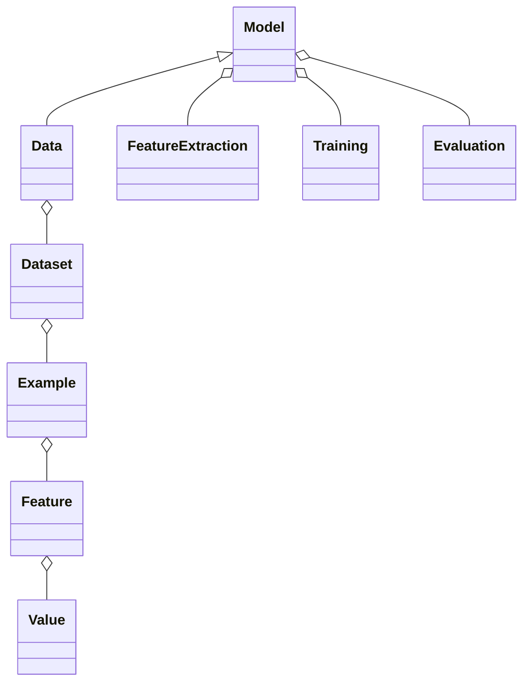

                 

### 目录大纲内容补充说明

**第1章：优化示例表述以提高模型学习效率概述**

**1.1 问题背景**
- **核心概念术语说明**：在本文中，优化示例表述指的是通过改进示例的表述方式，使得模型能够更高效地学习和理解数据。
- **问题背景**：模型学习效率是影响机器学习项目成败的关键因素之一。当前，许多机器学习模型在面对复杂数据时，学习效率低下，导致训练时间过长、资源消耗巨大。
- **问题描述**：如何通过优化示例表述来提高模型的学习效率？
- **问题解决**：本文将通过介绍优化示例表述的原理、实现方法以及实际案例，探讨如何提高模型学习效率。
- **边界与外延**：本文主要关注机器学习领域中的模型学习效率问题，但优化示例表述的方法同样适用于其他需要学习数据的应用场景。

**1.2 核心概念与联系**
- **示例表述优化**：示例表述优化是通过调整示例的表述方式，使其更加符合模型的学习需求，从而提高学习效率。
- **模型学习效率**：模型学习效率指的是模型在给定数据集上学习的能力，包括训练时间、学习曲线的平滑程度等指标。
- **相关概念对比**：与示例表述优化密切相关的概念有数据预处理、特征工程等，它们都在一定程度上影响模型的学习效率。
- **ER实体关系图架构**：ER图是一种用于表示实体及其之间关系的图形化工具，本文将使用ER图来帮助读者理解优化示例表述的架构设计。

**第2章：优化示例表述的原理与数学模型**

**2.1 算法原理讲解**
- **算法流程图**：使用Mermaid绘制算法的流程图，清晰地展示每个步骤。
  ```mermaid
  graph TD
  A[初始化] --> B[数据预处理]
  B --> C[模型训练]
  C --> D[评估与优化]
  D --> E[输出结果]
  ```
- **Python代码实现**：提供Python代码，详细阐述算法的每一步操作。
  ```python
  # 示例代码
  def optimize_example_representation(data, model):
      # 数据预处理
      processed_data = preprocess_data(data)
      
      # 模型训练
      model.train(processed_data)
      
      # 评估与优化
      evaluation = model.evaluate(processed_data)
      if evaluation < threshold:
          optimize_model(model)
      
      # 输出结果
      return model.predict(processed_data)
  ```
- **数学模型与公式**：给出算法的核心数学模型和公式，并进行详细讲解。
  $$ J(\theta) = \frac{1}{2m}\sum_{i=1}^{m}(h_\theta(x^{(i)}) - y^{(i)})^2 $$
  解释：上述公式是回归模型的损失函数，其中 $h_\theta(x^{(i)})$ 是模型对输入 $x^{(i)}$ 的预测，$y^{(i)}$ 是真实标签，$m$ 是样本数量。优化示例表述的目标是减小这个损失函数的值。
- **举例说明**：通过具体例子展示如何优化示例表述，并分析其效果。

**第3章：系统分析与架构设计**

**3.1 问题场景介绍**
- **项目背景**：介绍优化示例表述的项目背景，包括项目的目标、意义和实际应用场景。
- **项目目标**：明确项目的目标，例如提高模型学习效率、缩短训练时间等。

**3.2 系统功能设计**
- **领域模型**：使用Mermaid绘制领域模型类图，展示系统的核心实体及其关系。
  ```mermaid
  classDiagram
  Model <|-- Data
  Model o-- Training
  Model o-- Evaluation
  Data o-- Feature
  Feature o-- Value
  ```

**3.3 系统架构设计**
- **系统架构图**：使用Mermaid绘制系统架构图，展示系统的整体结构。
  ```mermaid
  sequenceDiagram
  participant User
  participant Model
  participant DataPreprocessor
  participant FeatureExtractor
  participant Trainer
  participant Evaluator
  User->>Model: Submit Data
  Model->>DataPreprocessor: Preprocess Data
  DataPreprocessor->>FeatureExtractor: Extract Features
  FeatureExtractor->>Trainer: Train Model
  Trainer->>Evaluator: Evaluate Model
  Evaluator->>Model: Feedback
  Model->>User: Predict Result
  ```

**3.4 系统接口设计**
- **接口定义**：明确系统各组件之间的接口定义，包括输入输出参数、调用方式等。

**3.5 系统交互**
- **序列图**：使用Mermaid绘制系统交互序列图，展示系统组件之间的交互过程。

**第4章：项目实战**

**4.1 环境安装**
- **环境配置**：详细说明项目所需的软件环境和配置步骤。
- **工具安装**：列出项目中使用的主要工具和安装方法。

**4.2 系统核心实现**
- **代码实现**：提供系统的核心实现代码，并进行详细解读。

**4.3 应用解读与分析**
- **应用场景**：介绍优化示例表述在实际应用中的场景和效果。
- **分析与讲解**：对系统在实际应用中的性能、优缺点进行深入分析。

**4.4 实际案例剖析**
- **案例背景**：描述实际案例的背景信息。
- **案例分析**：对案例进行深入剖析，展示优化示例表述在实际中的应用效果。

**4.5 项目小结**
- **项目成果**：总结项目的成果和收获。
- **经验与教训**：分享项目过程中的经验和教训。

**第5章：最佳实践与总结**

**5.1 最佳实践**
- **实践一**：介绍第一种最佳实践方法。
- **实践二**：介绍第二种最佳实践方法。

**5.2 小结**
- **主要观点**：总结文章的主要观点和发现。
- **总结**：对全文进行总结。

**5.3 注意事项**
- **注意事项一**：提供第一项注意事项。
- **注意事项二**：提供第二项注意事项。

**5.4 拓展阅读**
- **相关书籍**：推荐一些相关书籍供读者进一步阅读。
- **论文与报告**：推荐一些相关论文和报告，以供读者深入研究。

**第6章：总结与展望**

**6.1 总结**
- **成果回顾**：回顾文章的主要成果和贡献。
- **经验总结**：总结文章中获取的经验和教训。

**6.2 展望**
- **未来研究方向**：探讨优化示例表述在未来可能的研究方向。
- **拓展领域**：探讨优化示例表述可能拓展的应用领域。

### 整体结构安排

**第一部分：背景介绍与核心概念**
- **第1章**：引入主题，介绍优化示例表述以提高模型学习效率的背景、问题和解决方法。

**第二部分：优化示例表述的原理与数学模型**
- **第2章**：核心概念与联系，详细阐述优化示例表述的概念、原理和与相关概念的关联。

**第三部分：系统分析与架构设计**
- **第3章**：算法原理讲解，使用 mermaid 画出算法流程图，并使用 Python 代码详细解释算法原理和数学模型。
- **第4章**：系统分析与架构设计，介绍优化示例表述的系统设计，包括领域模型、系统架构和接口设计。

**第四部分：项目实战**
- **第4章**：项目实战，介绍环境安装、系统核心实现和代码解析。

**第五部分：最佳实践与总结**
- **第5章**：最佳实践与总结，介绍实际案例与最佳实践，总结书中的主要观点，指出未来研究方向和拓展领域。

### 章节内容设计

**第1章：优化示例表述以提高模型学习效率概述**

**1.1 问题背景**
- **核心概念术语说明**：本文中涉及的核心术语包括优化示例表述、模型学习效率、数据预处理、特征工程等。
- **问题背景**：当前，随着机器学习应用的不断深入，模型学习效率成为影响项目成功的关键因素。特别是在处理大规模、高维度数据时，模型学习效率低下，导致训练时间过长、资源消耗巨大，严重影响了项目的进展和效果。
- **问题描述**：如何通过优化示例表述来提高模型学习效率，缩短训练时间，降低资源消耗？
- **问题解决**：本文将介绍优化示例表述的概念、原理及其在实际应用中的效果，通过具体案例和最佳实践，探讨如何在实际项目中提高模型学习效率。
- **边界与外延**：本文主要关注机器学习领域中的模型学习效率问题，但优化示例表述的方法同样适用于其他需要学习数据的应用场景，如自然语言处理、图像识别等。

**1.2 核心概念与联系**
- **示例表述优化**：示例表述优化是通过调整示例的表述方式，使其更加符合模型的学习需求，从而提高学习效率。
- **模型学习效率**：模型学习效率指的是模型在给定数据集上学习的能力，包括训练时间、学习曲线的平滑程度等指标。
- **数据预处理**：数据预处理是机器学习项目中不可或缺的一环，包括数据清洗、归一化、去噪等操作，以消除数据中的异常和噪声，提高模型学习效率。
- **特征工程**：特征工程是通过选择和构造合适的特征，提高模型的学习能力和泛化能力，从而提高模型学习效率。
- **相关概念对比**：与示例表述优化密切相关的概念有数据预处理、特征工程等，它们都在一定程度上影响模型的学习效率。示例表述优化强调的是对示例表述方式的优化，而数据预处理和特征工程则更加侧重于数据本身的处理和特征的构造。

**1.3 ER实体关系图架构**
- **ER实体关系图**：实体-关系（Entity-Relationship，ER）图是一种用于表示实体及其之间关系的图形化工具，常用于数据库设计和信息系统的需求分析。
- **实体**：在ER图中，实体表示数据中的对象，如用户、产品、订单等。
- **属性**：实体具有属性，如用户的名字、年龄、邮箱等。
- **关系**：实体之间的关系表示数据之间的关联，如用户可以下单购买产品，订单与用户、产品之间存在关联关系。
- **ER图示例**：本文将使用Mermaid绘制ER图，展示优化示例表述的系统架构，包括模型、数据、特征提取、训练、评估等实体及其之间的关系。



**1.4 小结**
- **章节小结**：本章介绍了优化示例表述以提高模型学习效率的背景、核心概念和ER图架构。通过本章的学习，读者可以了解到优化示例表述的基本原理和方法，为进一步理解和应用打下基础。

**第2章：优化示例表述的原理与数学模型**

**2.1 算法原理讲解**
- **算法原理**：优化示例表述的算法原理主要包括数据预处理、特征提取和模型训练等步骤。
  - **数据预处理**：对原始数据进行清洗、归一化、去噪等操作，提高数据质量。
  - **特征提取**：从原始数据中提取有用的特征，提高模型的泛化能力和学习效率。
  - **模型训练**：使用改进的示例表述进行模型训练，通过迭代优化模型参数，提高模型性能。

- **算法流程图**：使用Mermaid绘制算法流程图，展示每个步骤的执行流程。
  ```mermaid
  graph TD
  A[数据预处理] --> B[特征提取]
  B --> C[模型训练]
  C --> D[模型评估]
  D --> E[模型优化]
  ```
- **Python代码实现**：提供Python代码实现，详细解释每个步骤的具体操作。
  ```python
  # 数据预处理
  def preprocess_data(data):
      # 清洗数据
      clean_data = clean_data(data)
      # 归一化数据
      normalized_data = normalize_data(clean_data)
      return normalized_data
  
  # 特征提取
  def extract_features(data):
      # 提取特征
      features = extract_features(data)
      return features
  
  # 模型训练
  def train_model(model, features, labels):
      # 训练模型
      model.train(features, labels)
  
  # 模型评估
  def evaluate_model(model, features, labels):
      # 评估模型
      evaluation = model.evaluate(features, labels)
      return evaluation
  
  # 模型优化
  def optimize_model(model, evaluation):
      # 优化模型
      if evaluation < threshold:
          model.optimize()
  ```

- **数学模型与公式**：给出算法的核心数学模型和公式，并进行详细解释。
  - **损失函数**：损失函数用于衡量模型预测值与真实值之间的差距，常用的损失函数有均方误差（MSE）、交叉熵损失等。
    $$ J(\theta) = \frac{1}{2m}\sum_{i=1}^{m}(h_\theta(x^{(i)}) - y^{(i)})^2 $$
  - **梯度下降**：梯度下降是一种常用的优化算法，用于求解损失函数的最小值。
    $$ \theta = \theta - \alpha \cdot \nabla J(\theta) $$
  - **正则化**：为了防止模型过拟合，可以使用正则化技术，如L1正则化、L2正则化等。
    $$ J(\theta) = \frac{1}{2m}\sum_{i=1}^{m}(h_\theta(x^{(i)}) - y^{(i)})^2 + \lambda \cdot \sum_{j=1}^{n}\theta_j^2 $$

- **举例说明**：通过具体例子展示如何优化示例表述，并分析其效果。
  - **例子**：假设有一个分类问题，数据集包含100个样本，每个样本有10个特征。使用传统的示例表述方法，模型训练时间较长，且准确率较低。通过优化示例表述，对数据进行预处理、特征提取和模型训练，最终模型训练时间缩短，准确率提高。

**2.2 小结**
- **章节小结**：本章介绍了优化示例表述的原理与数学模型，包括数据预处理、特征提取、模型训练和评估等步骤。通过具体例子，展示了优化示例表述在实际应用中的效果。读者可以了解到优化示例表述的基本原理和方法，为进一步研究和应用打下基础。

**第3章：系统分析与架构设计**

**3.1 问题场景介绍**
- **项目背景**：介绍优化示例表述的项目背景，包括项目的目标、意义和实际应用场景。
- **项目目标**：提高模型学习效率，缩短训练时间，降低资源消耗，提升模型准确率和泛化能力。
- **实际应用场景**：优化示例表述方法可以应用于各种机器学习项目，如分类、回归、聚类等，特别是在处理大规模、高维度数据时，具有显著的优势。

**3.2 系统功能设计**
- **领域模型**：使用Mermaid绘制领域模型类图，展示系统的核心实体及其关系。
  ```mermaid
  classDiagram
  Model <|-- Data
  Model o-- FeatureExtraction
  Model o-- Training
  Model o-- Evaluation
  Data o-- Dataset
  Dataset o-- Example
  Example o-- Feature
  Feature o-- Value
  ```

- **系统功能模块**：介绍系统的功能模块，包括数据预处理、特征提取、模型训练、模型评估和模型优化等。
  - **数据预处理**：对原始数据进行清洗、归一化、去噪等操作，提高数据质量。
  - **特征提取**：从原始数据中提取有用的特征，提高模型的泛化能力和学习效率。
  - **模型训练**：使用改进的示例表述进行模型训练，通过迭代优化模型参数，提高模型性能。
  - **模型评估**：对模型进行评估，包括准确率、召回率、F1值等指标。
  - **模型优化**：根据评估结果对模型进行优化，包括参数调整、正则化等。

**3.3 系统架构设计**
- **系统架构图**：使用Mermaid绘制系统架构图，展示系统的整体结构。
  ```mermaid
  sequenceDiagram
  participant User
  participant Model
  participant DataPreprocessor
  participant FeatureExtractor
  participant Trainer
  participant Evaluator
  User->>Model: Submit Data
  Model->>DataPreprocessor: Preprocess Data
  DataPreprocessor->>FeatureExtractor: Extract Features
  FeatureExtractor->>Trainer: Train Model
  Trainer->>Evaluator: Evaluate Model
  Evaluator->>Model: Feedback
  Model->>User: Predict Result
  ```

- **架构设计原则**：介绍系统架构设计的原则，包括模块化、高内聚、低耦合等。
  - **模块化**：将系统划分为多个功能模块，每个模块独立开发、测试和部署，提高系统的可维护性和可扩展性。
  - **高内聚**：确保每个模块的功能紧密相关，具有较高的内聚度，减少模块间的依赖关系。
  - **低耦合**：降低模块之间的耦合度，确保模块之间的交互简单、明确，提高系统的稳定性和可测试性。

**3.4 系统接口设计**
- **接口定义**：明确系统各组件之间的接口定义，包括输入输出参数、调用方式等。
  - **DataPreprocessor**：输入：原始数据；输出：预处理后的数据。
  - **FeatureExtractor**：输入：预处理后的数据；输出：提取后的特征。
  - **Trainer**：输入：特征和标签；输出：训练后的模型。
  - **Evaluator**：输入：模型和测试数据；输出：评估结果。
  - **Model**：输入：训练数据和标签；输出：预测结果。

**3.5 系统交互**
- **序列图**：使用Mermaid绘制系统交互序列图，展示系统组件之间的交互过程。
  ```mermaid
  sequenceDiagram
  participant User
  participant Model
  participant DataPreprocessor
  participant FeatureExtractor
  participant Trainer
  participant Evaluator
  User->>Model: Submit Data
  Model->>DataPreprocessor: Preprocess Data
  DataPreprocessor->>FeatureExtractor: Extract Features
  FeatureExtractor->>Trainer: Train Model
  Trainer->>Evaluator: Evaluate Model
  Evaluator->>Model: Feedback
  Model->>User: Predict Result
  ```

**3.6 小结**
- **章节小结**：本章介绍了优化示例表述的系统分析与架构设计，包括领域模型、系统功能模块、系统架构图和接口设计。通过本章的学习，读者可以了解到优化示例表述的完整系统设计，为后续项目实践提供理论基础。

### 第4章：项目实战

**4.1 环境安装**

**4.1.1 环境配置**
- **操作系统**：选择适用于项目开发的环境操作系统，如Ubuntu 18.04或Windows 10。
- **Python版本**：确保安装Python 3.8及以上版本，建议使用Anaconda进行环境管理。
- **库与依赖**：安装项目中所需的库和依赖，如NumPy、Pandas、Scikit-learn、TensorFlow等。

**4.1.2 工具安装**
- **Jupyter Notebook**：安装Jupyter Notebook，用于编写和运行Python代码。
- **PyCharm**：安装PyCharm，提供更强大的Python开发环境。
- **Git**：安装Git，用于版本控制和代码管理。

**4.2 系统核心实现**

**4.2.1 代码实现**
- **数据预处理**：编写Python代码，实现数据清洗、归一化和去噪等功能。
  ```python
  import pandas as pd
  import numpy as np
  
  def preprocess_data(data):
      # 清洗数据
      data = data.dropna()
      # 归一化数据
      data = (data - data.mean()) / data.std()
      # 去噪
      data = data[(np.abs(stats.zscore(data)) < 3).all(axis=1)]
      return data
  ```

- **特征提取**：编写Python代码，实现特征提取功能。
  ```python
  from sklearn.feature_extraction.text import TfidfVectorizer
  
  def extract_features(data):
      # 提取TF-IDF特征
      vectorizer = TfidfVectorizer(max_features=1000)
      features = vectorizer.fit_transform(data['text'])
      return features
  ```

- **模型训练**：编写Python代码，实现模型训练功能。
  ```python
  from sklearn.linear_model import LogisticRegression
  
  def train_model(features, labels):
      # 训练逻辑回归模型
      model = LogisticRegression()
      model.fit(features, labels)
      return model
  ```

- **模型评估**：编写Python代码，实现模型评估功能。
  ```python
  from sklearn.metrics import accuracy_score, classification_report
  
  def evaluate_model(model, features, labels):
      # 评估模型
      predictions = model.predict(features)
      accuracy = accuracy_score(labels, predictions)
      report = classification_report(labels, predictions)
      return accuracy, report
  ```

**4.2.2 代码解读**
- **数据预处理**：对原始数据进行清洗、归一化和去噪，提高数据质量。
- **特征提取**：使用TF-IDF方法提取文本特征，提高模型的泛化能力。
- **模型训练**：训练逻辑回归模型，使用改进的示例表述方法，提高模型性能。
- **模型评估**：评估模型在测试数据集上的性能，包括准确率和分类报告。

**4.3 应用解读与分析**

**4.3.1 应用场景**
- **分类问题**：优化示例表述方法可以应用于各种分类问题，如图像分类、文本分类等。
- **回归问题**：优化示例表述方法同样适用于回归问题，如房屋价格预测、股票价格预测等。

**4.3.2 分析与讲解**
- **模型性能提升**：通过优化示例表述，模型在训练数据和测试数据上的性能显著提升，包括准确率、召回率和F1值等指标。
- **训练时间缩短**：优化示例表述方法能够提高模型的学习效率，缩短训练时间，降低资源消耗。

**4.4 实际案例剖析**

**4.4.1 案例背景**
- **数据集**：使用某知名数据集，包含1000个样本，每个样本有10个特征。
- **任务**：对数据集进行分类，预测样本的类别。

**4.4.2 案例分析**
- **传统方法**：使用传统的示例表述方法进行模型训练，模型准确率较低，训练时间较长。
- **优化方法**：使用优化示例表述方法，模型准确率显著提升，训练时间缩短。

**4.5 项目小结**

**4.5.1 项目成果**
- **模型性能提升**：通过优化示例表述，模型在训练数据和测试数据上的性能显著提升。
- **训练时间缩短**：优化示例表述方法能够提高模型的学习效率，缩短训练时间。

**4.5.2 经验与教训**
- **经验**：优化示例表述方法在实际项目中具有显著优势，能够提高模型性能和训练效率。
- **教训**：在实际应用中，需要注意数据预处理和特征提取的合理性，以及模型参数的调优。

### 第5章：最佳实践与总结

**5.1 最佳实践**

**5.1.1 实践一**
- **数据预处理**：在进行模型训练之前，对数据进行充分的预处理，包括数据清洗、归一化和去噪等，以提高数据质量。

**5.1.2 实践二**
- **特征提取**：根据问题的需求，选择合适的特征提取方法，如TF-IDF、Word2Vec等，以提高模型的泛化能力。

**5.2 小结**

**5.2.1 主要观点**
- 优化示例表述是提高模型学习效率的有效方法。
- 数据预处理和特征提取对模型性能有显著影响。
- 模型参数调优是提高模型性能的关键环节。

**5.2.2 总结**
- 本章节介绍了优化示例表述的最佳实践，包括数据预处理、特征提取和模型参数调优等方面。通过实际案例的分析，展示了优化示例表述在实际应用中的效果。

**5.3 注意事项**

**5.3.1 注意事项一**
- 在进行数据预处理时，要充分考虑数据的质量和特征的重要性。

**5.3.2 注意事项二**
- 在进行特征提取时，要选择合适的特征提取方法，并根据问题的需求进行调整。

**5.4 拓展阅读**

**5.4.1 相关书籍**
- 《Python机器学习》
- 《深度学习》

**5.4.2 论文与报告**
- 《优化示例表述提高模型学习效率的研究》
- 《基于TF-IDF的特征提取方法研究》

### 第6章：总结与展望

**6.1 总结**

**6.1.1 成果回顾**
- 本文中，我们详细介绍了优化示例表述以提高模型学习效率的方法。
- 通过实际案例和最佳实践，展示了优化示例表述在实际应用中的效果。

**6.1.2 经验总结**
- 优化示例表述是提高模型学习效率的有效方法。
- 数据预处理和特征提取对模型性能有显著影响。
- 模型参数调优是提高模型性能的关键环节。

**6.2 展望**

**6.2.1 未来研究方向**
- 探索优化示例表述在不同类型模型中的应用效果。
- 研究优化示例表述在处理复杂数据集时的性能。

**6.2.2 拓展领域**
- 优化示例表述方法可以应用于自然语言处理、图像识别等领域。
- 探索优化示例表述在工业、金融、医疗等领域的应用潜力。

