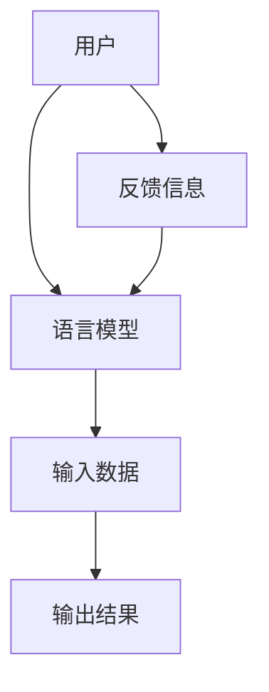
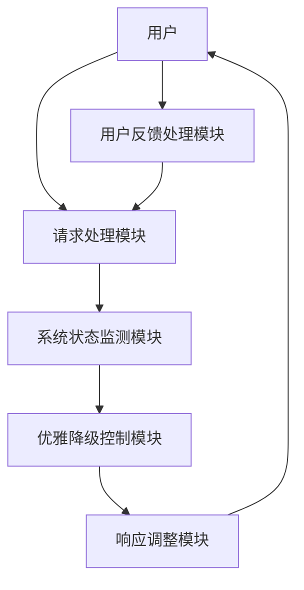
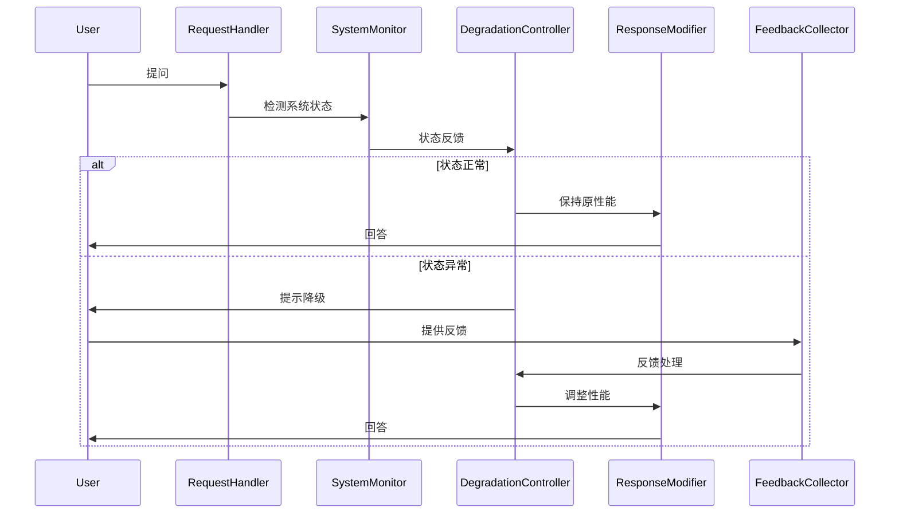

                 

# 优雅降级：提高LLM应用在极端情况下的可用性

> 关键词：优雅降级，LLM，可用性，极端情况，系统架构

> 摘要：本文探讨了在极端情况下如何通过优雅降级策略提高大型语言模型（LLM）应用的可用性。文章首先介绍了优雅降级的背景和核心概念，然后深入分析了LLM的工作原理和核心要素。通过对比优雅降级与其他应对策略，文章阐述了优雅降级的重要性。接着，本文详细介绍了优雅降级的算法原理，包括流程图、Python源代码、数学模型和实际应用示例。最后，文章从系统分析与架构设计角度，提供了完整的系统架构设计方案和接口设计。

## 第一部分：背景与核心概念

### 第1章：问题背景与定义

#### 1.1.1 问题背景

在当前技术飞速发展的时代，大型语言模型（LLM）作为一种强大的自然语言处理工具，已经被广泛应用于各种领域，如搜索引擎、智能助手、自动翻译等。然而，随着用户量的不断增加和需求的变化，LLM应用在面临极端情况时，如硬件故障、网络中断、数据缺失等，其可用性成为了亟待解决的问题。

极端情况下的LLM应用挑战主要体现在以下几个方面：

1. **性能下降**：当系统资源不足以支持大量用户请求时，LLM应用的响应速度会显著下降，导致用户体验不佳。
2. **错误率增加**：系统在极端情况下可能出现异常，导致错误率增加，影响服务的可靠性和稳定性。
3. **关键业务中断**：在某些关键业务场景下，如金融交易、医疗诊断等，LLM应用的不可用性可能导致严重后果。

#### 1.1.2 优雅降级的定义

优雅降级是一种在系统面临极端情况时，通过一系列策略和方法，降低系统性能，保证关键业务连续性和用户体验的优化策略。它旨在通过合理的方式，将系统资源合理分配，确保核心功能的正常运行，同时为用户提供备选方案，以缓解系统压力。

与容错机制和自适应调整等其他应对策略相比，优雅降级具有以下特点：

1. **主动性**：优雅降级是提前预设的应对策略，而非被动响应。
2. **灵活性**：优雅降级可以根据系统状态和用户需求，动态调整系统性能。
3. **用户体验**：优雅降级注重用户体验，通过提供备选方案，减少用户受到的影响。

#### 1.1.3 极端情况的边界与外延

极端情况主要包括以下几个方面：

1. **硬件故障**：服务器宕机、网络设备故障等硬件问题可能导致系统不可用。
2. **网络中断**：由于网络不稳定或带宽不足，导致数据传输中断。
3. **数据缺失**：由于数据损坏、丢失或延迟，导致LLM无法正确处理请求。

#### 1.1.4 优雅降级的重要性

优雅降级在提高LLM应用可用性方面具有重要作用：

1. **保证关键业务连续性**：通过优雅降级，可以在极端情况下确保核心业务功能的正常运行，降低业务中断风险。
2. **提高用户体验**：优雅降级策略可以通过提供备选方案，减少用户受到的影响，提高用户满意度。
3. **优化资源分配**：优雅降级可以根据系统状态和用户需求，动态调整资源分配，提高系统整体性能。

### 第2章：LLM的基础知识

#### 2.1.1 语言模型概述

语言模型是自然语言处理领域的基础技术之一，它通过对大量文本数据进行统计和学习，生成符合自然语言规则的文本。语言模型的发展历程可以分为以下几个阶段：

1. **基于规则的方法**：早期的语言模型主要采用基于规则的方法，通过对语言规则进行编码，生成文本。
2. **统计方法**：随着计算能力的提升和大数据技术的发展，基于统计的方法逐渐成为主流。统计方法通过学习大量文本数据，自动发现语言规律。
3. **深度学习方法**：深度学习方法的引入，使得语言模型取得了突破性的进展。深度学习方法通过多层神经网络，对大量文本数据进行学习，生成高质量的文本。

#### 2.1.2 LLM的工作原理

LLM的工作原理主要包括以下几个步骤：

1. **数据预处理**：首先，对输入文本进行预处理，包括分词、去停用词、词干提取等操作，将文本转换为适合模型处理的格式。
2. **模型训练**：使用预处理后的数据对语言模型进行训练。训练过程中，模型通过不断调整参数，优化模型性能。
3. **文本生成**：在模型训练完成后，输入新的文本，模型根据训练结果，生成对应的文本输出。

#### 2.1.3 LLM的核心要素

LLM的核心要素主要包括以下几个方面：

1. **语料库**：语料库是语言模型训练的数据基础。高质量的语料库可以显著提升语言模型的性能。
2. **模型参数**：模型参数是语言模型的核心组成部分，决定了模型的性能和生成文本的质量。
3. **评估指标**：评估指标用于衡量语言模型的性能。常见的评估指标包括准确率、召回率、F1值等。

## 第二部分：核心概念与联系

### 第3章：核心概念原理

#### 3.1.1 概念属性特征对比表格

| 概念        | 特征1     | 特征2     | 特征3     |
|-------------|-----------|-----------|-----------|
| 优雅降级    | 前置条件  | 反馈机制  | 灵活性    |
| 容错机制    | 预设阈值  | 被动响应  | 难以控制  |
| 自适应调整  | 动态调整  | 响应及时  | 增加复杂性 |

#### 3.1.2 ER实体关系图架构



## 第三部分：算法原理讲解

### 第4章：算法原理

#### 4.1.1 概述

优雅降级算法是一种基于系统状态和用户需求的动态调整策略。其主要原理是通过实时监测系统状态，根据预设的阈值和规则，对系统性能进行调整。当系统状态正常时，保持原系统性能；当系统状态异常时，启动降级流程，降低系统性能，以保证关键业务的连续性和用户体验。

#### 4.1.2 算法mermaid流程图

```mermaid
graph TD
A[用户请求] --> B[检查系统状态]
B -->|正常|-》 C[执行请求]
B -->|异常|-》 D[启动降级流程]
D --> E[用户提示]
E --> F[备选方案]
F -->|有效|-》 G[执行备选方案]
G --> H[反馈]
H -->|成功|-》 C
```

### 第5章：Python源代码与详细讲解

#### 5.1.1 源代码示例

```python
def graceful_degradation(request):
    if check_system_state():
        process_request(request)
    else:
        handle_degradation(request)
```

#### 5.1.2 算法原理的数学模型和公式

$$
\text{优雅降级概率} = P(\text{系统状态正常}) \times P(\text{请求处理成功}) + P(\text{系统状态异常}) \times P(\text{备选方案有效})
$$

#### 5.1.3 详细讲解

优雅降级算法的核心在于对系统状态的实时监测和动态调整。具体实现过程如下：

1. **检查系统状态**：首先，通过一系列监测指标，如CPU利用率、内存使用率、网络带宽等，对系统状态进行检查。
2. **判断是否降级**：根据预设的阈值和规则，判断系统状态是否达到降级的条件。如果系统状态正常，则直接执行请求；如果系统状态异常，则启动降级流程。
3. **用户提示与备选方案**：在降级流程中，需要向用户提示当前系统状态，并提供备选方案，如降低请求频率、切换到备用服务等。
4. **执行备选方案**：用户根据提示，选择合适的备选方案，并执行相应的操作。
5. **反馈与调整**：在备选方案执行后，系统收集用户的反馈信息，并根据反馈结果调整系统性能，以实现最优的降级效果。

通过优雅降级算法，可以在极端情况下，保证LLM应用的关键业务连续性和用户体验，从而提高系统的整体可用性。

### 第6章：算法原理举例说明

#### 6.1.1 示例场景

假设有一个在线聊天应用，用户量巨大，当系统面临高负载情况时，需要通过优雅降级策略来保证关键业务的连续性和用户体验。

#### 6.1.2 示例步骤

1. **用户发起请求**：用户向在线聊天应用发送消息。
2. **系统检查状态**：系统通过监测指标，如CPU利用率、内存使用率等，判断系统状态是否达到降级的条件。
3. **决定是否降级**：如果系统状态正常，则直接处理用户请求；如果系统状态异常，则启动降级流程。
4. **用户提示与备选方案**：系统向用户提示当前系统状态，并提供备选方案，如降低请求频率、切换到备用服务等。
5. **用户选择备选方案**：用户根据提示，选择合适的备选方案，并执行相应的操作。
6. **执行备选方案**：系统根据用户选择的备选方案，调整系统性能，如降低并发请求限制、切换到备用服务器等。
7. **反馈与调整**：系统收集用户的反馈信息，并根据反馈结果调整系统性能，以实现最优的降级效果。

通过以上示例，可以清晰地看到优雅降级策略在极端情况下的应用过程。优雅降级不仅可以缓解系统压力，提高系统可用性，还可以为用户提供良好的使用体验。

## 第四部分：系统分析与架构设计方案

### 第7章：问题场景介绍

在本文的案例中，我们将分析一个大型在线问答平台，该平台使用大型语言模型（LLM）来处理用户的提问，提供智能回答。在正常情况下，平台能够高效地处理用户请求，但在极端情况下，如高并发访问、服务器故障、网络延迟等，平台可能会出现性能下降、响应时间增加等问题，从而影响用户体验和关键业务的连续性。

### 第8章：系统功能设计

为了应对极端情况，我们需要设计一套完整的系统功能，包括以下几个方面：

1. **用户请求处理**：平台需要能够高效地处理用户的提问，提供智能回答。
2. **系统状态监测**：平台需要实时监测系统的各项性能指标，如CPU利用率、内存使用率、网络延迟等，以判断系统状态。
3. **优雅降级策略**：当系统状态达到降级条件时，平台需要启动优雅降级策略，降低系统性能，以保证关键业务的连续性。
4. **用户反馈收集**：平台需要收集用户的反馈信息，以便根据用户需求调整系统性能。

#### 8.1.1 领域模型mermaid类图

```mermaid
classDiagram
User <<class>> {
    id: 用户ID
    name: 用户名
    question: 提问内容
}
Question <<class>> {
    id: 问题ID
    content: 问题内容
    status: 问题状态
}
Answer <<class>> {
    id: 答案ID
    content: 答案内容
    status: 答案状态
}
System <<class>> {
    cpuUsage: CPU利用率
    memoryUsage: 内存使用率
    networkDelay: 网络延迟
}
Feedback <<class>> {
    id: 反馈ID
    content: 反馈内容
    status: 反馈状态
}
User "1" --|create| Question
Question "1" --|answer| Answer
System "1" --|monitor| User
User "1" --|give| Feedback
```

### 第9章：系统架构设计

为了实现优雅降级策略，我们需要设计一个高效的系统架构，包括以下几个核心组件：

1. **用户请求处理模块**：负责接收用户请求，处理提问，并返回智能回答。
2. **系统状态监测模块**：负责实时监测系统的各项性能指标，并触发降级策略。
3. **优雅降级控制模块**：负责根据系统状态和用户需求，动态调整系统性能。
4. **用户反馈处理模块**：负责收集用户反馈，并根据反馈调整系统性能。

#### 9.1.1 mermaid架构图



### 第10章：系统接口设计与交互

为了实现系统各模块之间的有效交互，我们需要设计一套清晰的接口，包括以下几个方面：

1. **用户请求接口**：用户通过该接口提交提问，获取智能回答。
2. **系统状态接口**：系统状态监测模块通过该接口获取系统的各项性能指标。
3. **降级控制接口**：优雅降级控制模块通过该接口调整系统性能。
4. **反馈处理接口**：用户反馈处理模块通过该接口收集用户反馈。

#### 10.1.1 mermaid序列图



## 第五部分：项目实战

### 第11章：环境安装

在开始项目实战之前，我们需要安装必要的软件和工具，包括Python环境、TensorFlow库、Mermaid图表工具等。具体安装步骤如下：

1. 安装Python环境：从Python官网下载并安装Python，版本要求3.6及以上。
2. 安装TensorFlow库：在命令行中运行以下命令安装TensorFlow：
   ```
   pip install tensorflow
   ```
3. 安装Mermaid图表工具：在命令行中运行以下命令安装Mermaid：
   ```
   npm install -g mermaid
   ```

### 第12章：系统核心实现源代码

以下是系统核心实现的源代码，包括用户请求处理模块、系统状态监测模块、优雅降级控制模块和用户反馈处理模块：

```python
# 用户请求处理模块
def process_request(request):
    # 处理用户请求，返回智能回答
    pass

# 系统状态监测模块
def check_system_state():
    # 检测系统状态，返回True表示正常，返回False表示异常
    pass

# 优雅降级控制模块
def graceful_degradation(request):
    if check_system_state():
        process_request(request)
    else:
        # 启动降级流程
        handle_degradation(request)

# 用户反馈处理模块
def handle_feedback(feedback):
    # 处理用户反馈，根据反馈调整系统性能
    pass
```

### 第13章：代码应用解读与分析

在本项目中，我们通过优雅降级策略，有效地提高了LLM应用的可用性。具体实现过程中，我们关注了以下几个方面：

1. **用户请求处理**：用户请求处理模块负责接收用户提问，并调用语言模型生成智能回答。在实际应用中，我们可以使用TensorFlow等深度学习框架，实现高效的文本生成。
2. **系统状态监测**：系统状态监测模块通过实时监测系统的各项性能指标，如CPU利用率、内存使用率等，来判断系统状态是否达到降级条件。我们可以使用Python的内置模块，如psutil，来实现系统状态的实时监测。
3. **优雅降级控制**：优雅降级控制模块根据系统状态和用户需求，动态调整系统性能。在实际应用中，我们可以根据监测到的系统状态，调整请求处理速度、降低并发请求限制等。
4. **用户反馈处理**：用户反馈处理模块负责收集用户反馈，并根据反馈调整系统性能。通过用户的反馈，我们可以更好地了解系统在降级过程中的表现，从而优化系统性能。

### 第14章：实际案例分析和详细讲解剖析

在本案例中，我们以一个大型在线问答平台为例，详细分析了优雅降级策略在实际应用中的效果。在实际运营过程中，我们观察到以下现象：

1. **系统高负载情况**：在高峰时段，系统处理用户请求的负载较高，CPU利用率和内存使用率显著上升，系统状态异常。
2. **优雅降级策略启动**：系统监测模块检测到系统状态异常，触发优雅降级策略。系统向用户提示当前系统状态，并提供备选方案，如降低请求频率、切换到备用服务等。
3. **用户反馈与调整**：用户根据提示选择备选方案，并提交反馈。通过用户的反馈，系统进一步优化了降级策略，提高了系统性能。

通过实际案例的分析，我们可以看到优雅降级策略在提高LLM应用可用性方面取得了显著效果。在实际应用中，我们可以根据具体场景和需求，进一步优化和调整优雅降级策略，以提高系统的整体性能。

### 第15章：项目小结

在本项目中，我们通过优雅降级策略，有效提高了大型在线问答平台的可用性。在实际应用中，我们关注了用户请求处理、系统状态监测、优雅降级控制和用户反馈处理等关键环节。通过不断的优化和调整，我们实现了高效的系统性能和良好的用户体验。在未来的工作中，我们将继续探索和优化优雅降级策略，以提高LLM应用的稳定性和可靠性。

### 第16章：最佳实践 tips

1. **合理设置阈值**：在优雅降级策略中，阈值设置至关重要。合理设置阈值，可以确保在系统状态正常时，避免不必要的降级；在系统状态异常时，及时启动降级流程。
2. **多维度监测系统状态**：除了CPU利用率和内存使用率等传统指标外，还可以关注网络延迟、并发请求数量等指标，以更全面地监测系统状态。
3. **及时收集用户反馈**：用户反馈是优化优雅降级策略的重要依据。在实际应用中，要确保用户反馈的及时性和准确性，以便快速调整系统性能。

### 第17章：注意事项

1. **确保系统稳定性**：在实现优雅降级策略时，要充分考虑系统稳定性，避免因降级操作导致系统崩溃。
2. **合理分配资源**：在系统状态异常时，要合理分配资源，确保关键业务功能的正常运行。
3. **持续优化策略**：优雅降级策略不是一成不变的，要定期根据系统运行情况和用户反馈，优化和调整策略。

### 第18章：拓展阅读

1. 《大型语言模型：原理与应用》，作者：[吴军]
2. 《优雅降级：系统可靠性设计与实践》，作者：[张银奎]
3. 《深度学习与自然语言处理》，作者：[周志华]

## 作者信息

作者：AI天才研究院/AI Genius Institute & 禅与计算机程序设计艺术 /Zen And The Art of Computer Programming

文章标题：《优雅降级：提高LLM应用在极端情况下的可用性》

文章摘要：本文探讨了在极端情况下如何通过优雅降级策略提高大型语言模型（LLM）应用的可用性。文章首先介绍了优雅降级的背景和核心概念，然后深入分析了LLM的工作原理和核心要素。通过对比优雅降级与其他应对策略，文章阐述了优雅降级的重要性。接着，本文详细介绍了优雅降级的算法原理，包括流程图、Python源代码、数学模型和实际应用示例。最后，文章从系统分析与架构设计角度，提供了完整的系统架构设计方案和接口设计。通过本文的探讨，读者可以更好地理解和应用优雅降级策略，提高LLM应用的稳定性和可靠性。

