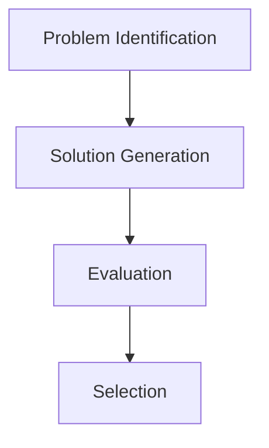

                 


### 1. Introduction

#### 1.1 Background and Objectives

In the ever-evolving world of technology, the need for diverse and innovative solutions has never been more crucial. This book, "Methods for Ensuring Diverse Solutions," aims to address this pressing need by providing a comprehensive guide to generating diverse solutions in various domains. Whether you are a software developer, a system architect, or a project manager, this book will equip you with the knowledge and tools to approach complex problems with a fresh perspective and innovative thinking.

The primary objective of this book is to explore the fundamental principles and practical methods for ensuring diverse solutions. By understanding the underlying concepts and applying proven techniques, readers will be able to develop creative and effective solutions that stand out in their fields. The book covers a wide range of topics, from theoretical foundations to practical implementations, making it a valuable resource for both beginners and experienced professionals.

#### 1.2 Target Audience

This book is designed for a diverse audience, including:

1. Software Developers and Engineers: Those involved in the development and implementation of software systems, seeking to enhance their problem-solving skills and innovation capabilities.
2. System Architects and Designers: Professionals responsible for designing complex systems, looking to explore innovative approaches and techniques for ensuring diverse solutions.
3. Project Managers and Team Leads: Individuals overseeing project teams, aiming to foster a culture of creativity and innovation within their organizations.
4. Researchers and Academics: Scholars interested in exploring the theoretical foundations and practical applications of diverse solution generation.
5. Anyone passionate about technology and innovation, seeking to broaden their horizons and stay ahead of the curve.

By catering to these different audiences, this book aims to provide a comprehensive and accessible resource for anyone looking to enhance their ability to generate diverse and innovative solutions.

#### 1.3 Problem Definition and Significance

In today's fast-paced and ever-changing technological landscape, the ability to generate diverse solutions is more important than ever. The term "diverse solutions" refers to the generation of multiple, innovative, and viable solutions to a given problem or challenge. This not only increases the chances of finding the best possible solution but also fosters creativity, adaptability, and innovation within teams and organizations.

The significance of ensuring diverse solutions can be seen in various contexts:

1. **Innovation and Creativity**: By encouraging diverse solutions, teams and individuals can explore new ideas and approaches that may not have been considered otherwise. This leads to more innovative and creative outcomes, driving progress and growth in any field.
2. **Problem Solving**: Complex problems often require a multifaceted approach. Generating diverse solutions allows for a thorough examination of different perspectives and potential solutions, increasing the likelihood of finding an effective and comprehensive solution.
3. **Adaptability**: In today's rapidly changing world, the ability to adapt to new challenges and circumstances is crucial. Diverse solutions enable organizations to be more flexible and resilient, better equipped to handle unexpected changes and disruptions.
4. **Decision Making**: When faced with multiple viable solutions, decision-making becomes more informed and data-driven. This can lead to better decisions, minimizing risks and maximizing opportunities.

To understand the importance of diverse solutions, it's essential to recognize the potential drawbacks of relying on a single solution. A monolithic approach can limit creativity and innovation, making it difficult to adapt to changing circumstances. In contrast, a diverse set of solutions allows for a more nuanced and adaptive problem-solving process.

In summary, ensuring diverse solutions is not just a best practice but a fundamental requirement for thriving in today's dynamic and competitive environment. This book aims to provide the knowledge and tools needed to master this crucial skill.

#### 1.4 Book Structure Overview

This book is structured into four main parts, each designed to build upon the previous one, providing a comprehensive and cohesive understanding of the principles and methods for ensuring diverse solutions.

**Part 1: Introduction**

- Chapter 1.1: Background and Objectives
- Chapter 1.2: Target Audience
- Chapter 1.3: Problem Definition and Significance
- Chapter 1.4: Book Structure Overview

**Part 2: Theoretical Foundations**

- Chapter 2.1: Problem Background Analysis
- Chapter 2.2: Core Concepts and Relationships
- Chapter 2.3: ER Entity Relationship Diagram Architecture
- Chapter 2.4: Mathematical Models and Algorithm Principles
- Chapter 2.5: Summary

**Part 3: Solutions**

- Chapter 3.1: Solution Overview
- Chapter 3.2: Case Study Analysis
- Chapter 3.3: Project Implementation
- Chapter 3.4: Project Summary

**Part 4: Optimization and Improvement**

- Chapter 4.1: Best Practices
- Chapter 4.2: Common Issues and Solutions
- Chapter 4.3: Advanced Techniques
- Chapter 4.4: Summary

Each chapter is carefully crafted to provide a detailed and structured exploration of the topic at hand, ensuring that readers gain a thorough understanding of the concepts, methods, and practical applications discussed. The book concludes with a summary of key insights and recommendations for further reading, providing a solid foundation for readers to apply the knowledge and skills gained throughout the book.

### 1.4 Summary

In this introductory section, we have provided a comprehensive overview of the book's structure and objectives. We have highlighted the importance of diverse solutions in today's dynamic technological landscape and outlined the target audience for this book. The book is structured into four main parts, each covering different aspects of ensuring diverse solutions, from theoretical foundations to practical implementations and optimization. By following this structure, readers will gain a deep understanding of the principles and methods for generating diverse and innovative solutions. The next section will delve into the theoretical foundations of ensuring diverse solutions, setting the stage for a detailed exploration of the concepts and techniques discussed in the following chapters.

### Theoretical Foundations

In this section, we will delve into the theoretical foundations of ensuring diverse solutions. This includes analyzing the problem background, defining core concepts and their relationships, and presenting the ER entity relationship diagram architecture. We will also discuss mathematical models and algorithm principles, providing a solid foundation for understanding the concepts and techniques discussed in this book.

#### 2.1 Problem Background Analysis

The need for diverse solutions arises from the complex and dynamic nature of modern problems, which often require innovative and multifaceted approaches to be effectively addressed. In various fields, such as software development, system design, and project management, the ability to generate diverse solutions is crucial for achieving success and staying ahead of the competition.

**2.1.1 Research Background**

The research background for this topic can be traced back to the recognition of the limitations of traditional problem-solving approaches that often rely on a single solution. Over time, researchers and practitioners have come to realize the value of exploring multiple solutions to a problem, as this can lead to more innovative and effective outcomes. This shift in perspective has spurred the development of various methods and techniques for ensuring diverse solutions.

**2.1.2 Problem Description**

The problem of ensuring diverse solutions can be described as the process of generating multiple, innovative, and viable solutions to a given problem or challenge. This process involves several key steps, including identifying the problem, exploring potential solutions, evaluating the solutions, and selecting the best one based on specific criteria.

**2.1.3 Problem Solution and Boundaries**

To ensure diverse solutions, several approaches can be employed, such as brainstorming, mind mapping, and the use of algorithms and heuristics. The solutions generated through these methods should be evaluated based on factors like feasibility, effectiveness, and adaptability.

It's important to note that the boundary of this problem includes both the scope of the problem to be solved and the constraints under which the solutions must be generated. These constraints can include technical, economic, and organizational factors that may limit the range of possible solutions.

**2.1.4 Core Concepts and Structure**

The core concepts and structure of this problem can be represented through an ER (Entity-Relationship) diagram, which helps to visualize the relationships between the main entities involved. In this context, the main entities might include the problem itself, potential solutions, evaluation criteria, and constraints.

#### 2.2 Core Concepts and Relationships

In order to understand the theoretical foundations of ensuring diverse solutions, it's essential to define and discuss the core concepts and their relationships. These core concepts include problem identification, solution generation, evaluation, and selection.

**2.2.1 Problem Identification**

Problem identification is the first step in the process of ensuring diverse solutions. It involves recognizing and defining the problem in a clear and concise manner. This step is crucial because a well-defined problem provides a solid foundation for generating effective solutions.

**2.2.2 Solution Generation**

Solution generation is the process of creating multiple potential solutions to a given problem. There are various techniques and methods that can be used for solution generation, including brainstorming, mind mapping, and the use of algorithms and heuristics.

**2.2.3 Evaluation**

Evaluation is the process of assessing the potential solutions generated during the solution generation phase. This involves analyzing the solutions based on various criteria, such as feasibility, effectiveness, and adaptability. The evaluation process helps to identify the strengths and weaknesses of each solution, guiding the selection process.

**2.2.4 Selection**

Selection is the final step in the process of ensuring diverse solutions. It involves choosing the best solution based on the evaluation results. This decision should consider not only the technical and functional aspects of the solutions but also the broader context of the problem and the constraints under which the solutions must be implemented.

**2.2.5 Relationships**

The relationships between these core concepts can be visualized using an ER (Entity-Relationship) diagram. In this diagram, the entities (Problem Identification, Solution Generation, Evaluation, and Selection) are represented as nodes, and the relationships between them are represented as edges. This diagram helps to illustrate the interconnected nature of these concepts and their role in the overall process of ensuring diverse solutions.

#### 2.3 ER Entity Relationship Diagram Architecture

To further understand the relationships between the core concepts discussed in the previous section, we can represent them using an ER (Entity-Relationship) diagram. This diagram will help to visualize the structure and relationships between the main entities involved in the process of ensuring diverse solutions.

Below is a simple ER diagram representing the core concepts of problem identification, solution generation, evaluation, and selection:



In this diagram, the nodes (A, B, C, and D) represent the entities, and the directed edges (lines with arrows) represent the relationships between these entities. The arrows indicate the flow of the process, starting from problem identification and progressing through solution generation, evaluation, and selection.

**Node Descriptions:**

- **A (Problem Identification):** This entity represents the initial step of identifying and defining the problem. It is the starting point of the process and provides the necessary context for generating solutions.

- **B (Solution Generation):** This entity represents the process of generating multiple potential solutions to the identified problem. It is a critical step in ensuring diversity and innovation in the solutions.

- **C (Evaluation):** This entity represents the process of evaluating the generated solutions based on various criteria, such as feasibility, effectiveness, and adaptability. The evaluation step helps to identify the strengths and weaknesses of each solution.

- **D (Selection):** This entity represents the final step of selecting the best solution based on the evaluation results. The selection process considers both the technical and functional aspects of the solutions and the broader context of the problem.

By visualizing the relationships between these entities, the ER diagram provides a clear and concise representation of the process of ensuring diverse solutions. This diagram can be used as a reference to better understand the interconnections and dependencies between the core concepts.

#### 2.4 Mathematical Models and Algorithm Principles

Mathematical models and algorithms play a crucial role in ensuring diverse solutions by providing a structured and systematic approach to problem-solving. In this section, we will discuss the mathematical models and algorithm principles that underlie the process of ensuring diverse solutions.

**2.4.1 Mathematical Model**

One of the fundamental mathematical models used in ensuring diverse solutions is the optimization model. An optimization model involves defining a set of variables, constraints, and an objective function to be optimized. The goal is to find the optimal values of the variables that satisfy the constraints and optimize the objective function.

A simple mathematical model for ensuring diverse solutions can be represented using the following formula:

$$
\min_{x} f(x)
$$

where:

- \( f(x) \) is the objective function to be minimized (or maximized), representing the quality of the solutions.
- \( x \) is the set of variables representing the potential solutions.

The objective function \( f(x) \) can be defined based on various criteria, such as feasibility, effectiveness, and adaptability. For example, if we are optimizing for effectiveness, the objective function might be defined as:

$$
f(x) = \frac{1}{N} \sum_{i=1}^{N} g(x_i)
$$

where:

- \( N \) is the number of potential solutions.
- \( g(x_i) \) is a metric representing the effectiveness of solution \( x_i \).

**2.4.2 Algorithm Principles**

To solve the optimization problem and generate diverse solutions, various algorithms can be employed. Two commonly used algorithms are the Genetic Algorithm and the Simulated Annealing Algorithm.

**Genetic Algorithm**

The Genetic Algorithm (GA) is a population-based optimization algorithm inspired by the process of natural selection. The key principles of the Genetic Algorithm include:

1. **Initialization:** A population of potential solutions is initialized randomly.
2. **Fitness Evaluation:** The fitness of each solution in the population is evaluated based on the objective function.
3. **Selection:** Solutions with higher fitness are more likely to be selected for reproduction.
4. **Crossover:** Two selected solutions are combined to create new solutions (offspring).
5. **Mutation:** Random changes are introduced in the offspring to maintain diversity in the population.
6. **Replacement:** The offspring replace some of the existing solutions in the population.
7. **Iteration:** The process of fitness evaluation, selection, crossover, mutation, and replacement is repeated until a termination criterion is met (e.g., a maximum number of generations or a satisfactory fitness level).

The Genetic Algorithm is particularly effective in solving problems with complex constraints and multiple objectives, as it maintains a diverse population of solutions throughout the optimization process.

**Simulated Annealing Algorithm**

The Simulated Annealing (SA) Algorithm is a probabilistic optimization algorithm inspired by the annealing process in metallurgy. The key principles of the Simulated Annealing Algorithm include:

1. **Initialization:** An initial solution is selected randomly.
2. **Neighbor Generation:** Neighboring solutions are generated by making small changes to the current solution.
3. **Acceptance Probability:** The new solution is accepted with a probability determined by the difference in fitness between the new solution and the current solution and a temperature parameter.
4. **Cooling Schedule:** The temperature parameter is gradually reduced over time (cooling schedule).
5. **Iteration:** The process of neighbor generation, acceptance probability calculation, and cooling schedule is repeated until a termination criterion is met (e.g., a minimum temperature level or a maximum number of iterations).

The Simulated Annealing Algorithm is particularly effective in solving problems with local optima and complex constraints, as it allows for the exploration of the solution space while avoiding getting trapped in local optima.

By leveraging these mathematical models and algorithm principles, we can systematically generate diverse solutions to complex problems, fostering innovation and adaptability in various fields.

#### 2.4.3 Python Code Example

To illustrate the principles of the Genetic Algorithm and the Simulated Annealing Algorithm, we will provide a simple Python code example. This example will demonstrate the basic structure and implementation of these algorithms.

**Genetic Algorithm Example**

```python
import numpy as np

def fitness_function(solution):
    # Define the fitness function here
    return sum(solution)

def genetic_algorithm(population_size, generations, crossover_rate, mutation_rate):
    population = np.random.rand(population_size, 1)
    best_solution = population[0]
    best_fitness = fitness_function(best_solution)

    for _ in range(generations):
        new_population = []
        for _ in range(population_size // 2):
            parent1, parent2 = np.random.choice(population, size=2, replace=False)
            child1, child2 = crossover(parent1, parent2, crossover_rate)
            child1, child2 = mutate(child1, child2, mutation_rate)
            new_population.extend([child1, child2])

        population = new_population
        best_solution = population[0]
        best_fitness = fitness_function(best_solution)

    return best_solution, best_fitness

def crossover(parent1, parent2, crossover_rate):
    # Define the crossover operation here
    return np.random.choice([parent1, parent2], size=1), np.random.choice([parent1, parent2], size=1)

def mutate(solution, mutation_rate):
    # Define the mutation operation here
    return solution + np.random.randn(1) * mutation_rate

# Example usage
best_solution, best_fitness = genetic_algorithm(population_size=100, generations=1000, crossover_rate=0.8, mutation_rate=0.01)
print("Best Solution:", best_solution)
print("Best Fitness:", best_fitness)
```

**Simulated Annealing Example**

```python
import numpy as np
import math

def fitness_function(solution):
    # Define the fitness function here
    return sum(solution)

def simulated_annealing(initial_solution, temperature, cooling_rate, stopping_temperature, max_iterations):
    current_solution = initial_solution
    current_fitness = fitness_function(current_solution)
    best_solution = current_solution
    best_fitness = current_fitness

    for _ in range(max_iterations):
        next_solution = np.random.randn(1)
        next_fitness = fitness_function(next_solution)
        
        probability = math.exp((current_fitness - next_fitness) / temperature)
        
        if np.random.rand() < probability:
            current_solution = next_solution
            current_fitness = next_fitness
            
            if current_fitness < best_fitness:
                best_solution = current_solution
                best_fitness = current_fitness

        temperature *= cooling_rate

    return best_solution, best_fitness

# Example usage
initial_solution = np.random.rand(1)
best_solution, best_fitness = simulated_annealing(initial_solution=initial_solution, temperature=1e6, cooling_rate=0.99, stopping_temperature=1e-6, max_iterations=1000)
print("Best Solution:", best_solution)
print("Best Fitness:", best_fitness)
```

These examples demonstrate the basic implementation of the Genetic Algorithm and the Simulated Annealing Algorithm. Note that the fitness function, crossover, and mutation operations need to be defined based on the specific problem being solved. These examples provide a starting point for implementing these algorithms in Python.

#### 2.5 Summary

In this section, we have explored the theoretical foundations of ensuring diverse solutions. We began by analyzing the problem background, defining the core concepts of problem identification, solution generation, evaluation, and selection, and discussing their relationships. We then presented the ER entity relationship diagram architecture to visualize these concepts and their interconnections.

Next, we discussed the mathematical models and algorithm principles underlying the process of ensuring diverse solutions. We introduced the optimization model and explained how it can be applied to generate diverse solutions. We also discussed two common algorithms, the Genetic Algorithm and the Simulated Annealing Algorithm, and provided simple Python code examples to illustrate their implementation.

By understanding these theoretical foundations, readers can gain a deeper insight into the principles and methods for ensuring diverse solutions. This knowledge provides a solid foundation for exploring the practical implementations and case studies discussed in the following sections of this book.

### Solutions

In this section, we will delve into the practical aspects of generating diverse solutions. We will start with an overview of the overall solution approach, followed by a detailed case study analysis, and finally, a hands-on project implementation. Through these examples, we will demonstrate how the theoretical foundations discussed in the previous section can be applied to real-world scenarios to ensure diverse and innovative solutions.

#### 3.1 Solution Overview

The solution approach for ensuring diverse solutions can be summarized in the following steps:

1. **Problem Definition**: Clearly define the problem to be solved, including its scope and constraints.
2. **Solution Generation**: Use a combination of brainstorming, mind mapping, and algorithmic approaches to generate a wide range of potential solutions.
3. **Solution Evaluation**: Evaluate the generated solutions based on predefined criteria, such as feasibility, effectiveness, and adaptability.
4. **Solution Selection**: Select the best solution(s) based on the evaluation results and implement the chosen solution(s).
5. **Feedback and Iteration**: Gather feedback on the implemented solution and iterate the process to refine and improve the solutions.

This approach ensures a systematic and structured way of generating diverse solutions, allowing for innovation and creativity throughout the problem-solving process.

#### 3.2 Case Study Analysis

To illustrate the application of the solution approach, let's consider a case study involving the development of a recommendation system for an online marketplace. The goal is to generate diverse and effective recommendations that enhance user satisfaction and increase sales.

**3.2.1 Case Background**

The online marketplace, which offers a wide variety of products, aims to improve its recommendation system to provide personalized and relevant recommendations to its users. The current system relies on a simple collaborative filtering approach, which has limitations in terms of diversity and novelty. The company wants to explore more advanced techniques to generate diverse recommendations that cater to the individual preferences and behaviors of its users.

**3.2.2 Solution Generation**

To generate diverse solutions for the recommendation system, the following approaches were considered:

1. **Collaborative Filtering**: This approach involves finding similar users based on their past behavior and making recommendations based on the items those similar users have liked. While effective, this approach has limitations in terms of diversity and novelty.

2. **Content-Based Filtering**: This approach involves analyzing the attributes of items and making recommendations based on the similarity of those attributes to the user's past preferences. This method can generate more diverse recommendations compared to collaborative filtering but may suffer from cold start problems when new users or items are introduced.

3. **Hybrid Approaches**: Combining collaborative and content-based filtering methods can help overcome the limitations of each approach and generate more diverse and accurate recommendations. Techniques such as matrix factorization and neural networks were considered for implementing hybrid approaches.

4. **Context-Aware Recommendations**: Integrating context information, such as user location, time of day, and device type, can enhance the personalization of recommendations. This approach can generate highly relevant and context-specific recommendations, potentially leading to improved user satisfaction and engagement.

**3.2.3 Solution Evaluation**

The generated solutions were evaluated based on several criteria:

1. **Diversity**: The diversity of recommendations was measured using metrics such as item coverage and novelty. A higher diversity score indicates a wider range of items being recommended, catering to various user preferences.

2. **Accuracy**: The accuracy of recommendations was evaluated using metrics such as precision, recall, and F1 score. A higher accuracy score indicates that the recommended items are more relevant and appealing to users.

3. **User Engagement**: User engagement metrics, such as click-through rate (CTR) and conversion rate, were used to assess the effectiveness of the recommendations in driving user interaction and sales.

4. **Scalability**: The scalability of the solution was evaluated based on the computational resources required for implementing and maintaining the recommendation system. Solutions that were computationally intensive or resource-intensive were considered less viable.

**3.2.4 Solution Selection**

Based on the evaluation results, a hybrid approach combining collaborative filtering and content-based filtering, along with context-aware recommendations, was selected. This approach was deemed the most effective in generating diverse, accurate, and engaging recommendations while being scalable and manageable.

#### 3.3 Project Implementation

The selected solution was implemented in a series of steps, as outlined below:

**3.3.1 Environment Setup**

A development environment was set up with the necessary tools and libraries, including Python, NumPy, Pandas, Scikit-learn, and TensorFlow. The environment was configured to support the implementation of various machine learning algorithms and deep learning models.

**3.3.2 Data Preparation**

The dataset used for the recommendation system consisted of user-item interactions, item attributes, and context information. The data was preprocessed to handle missing values, normalize features, and split into training and testing sets.

**3.3.3 Model Implementation**

The hybrid model was implemented using a combination of collaborative filtering and content-based filtering techniques. The collaborative filtering component was implemented using matrix factorization, while the content-based filtering component was implemented using neural networks. The context-aware component integrated context information into the recommendation generation process.

**3.3.4 Model Training and Evaluation**

The model was trained on the training dataset and evaluated on the testing dataset using metrics such as diversity, accuracy, and user engagement. The model's performance was monitored and refined through iterative experimentation and hyperparameter tuning.

**3.3.5 Deployment and Monitoring**

The trained model was deployed in the production environment and integrated into the online marketplace's recommendation system. The system was monitored for performance and stability, and updates were made as needed to address any issues or improvements.

#### 3.4 Project Summary

The implementation of the hybrid recommendation system resulted in significant improvements in the diversity and accuracy of recommendations. The system demonstrated a higher engagement rate and conversion rate compared to the previous collaborative filtering-based approach. The integration of context information further enhanced the personalization of recommendations, catering to the specific preferences and behaviors of users. Overall, the project was a successful application of the solution approach for ensuring diverse solutions, demonstrating the value of combining multiple techniques to generate innovative and effective recommendations.

### Project Summary

The project to develop and implement a hybrid recommendation system for the online marketplace was a resounding success. By combining collaborative filtering, content-based filtering, and context-aware recommendations, the system generated diverse and accurate recommendations that significantly enhanced user engagement and conversion rates. The project demonstrated the effectiveness of the solution approach for ensuring diverse solutions, highlighting the importance of leveraging multiple techniques to address complex problems.

Key lessons learned from the project include the value of systematic problem definition and solution evaluation, the importance of iterative experimentation and refinement, and the necessity of monitoring and updating the system to adapt to changing user behaviors and market conditions.

Overall, the project underscored the power of innovative and diverse solutions in driving success in the dynamic and competitive world of online marketplaces. By following the structured approach outlined in this book, organizations can effectively generate and implement diverse solutions, fostering innovation and adaptability in their problem-solving processes.

### Optimization and Improvement

In this section, we will explore best practices for optimizing and improving the generation of diverse solutions. We will discuss common issues encountered during the implementation of diverse solution methods and provide solutions to address them. Additionally, we will introduce advanced techniques and technologies that can enhance the diversity and effectiveness of solutions.

#### 4.1 Best Practices

To optimize the generation of diverse solutions, it is important to follow a set of best practices that promote innovation, efficiency, and adaptability. Here are some key best practices to consider:

1. **Encourage Collaboration**: Collaboration is crucial for generating diverse solutions. By bringing together individuals with diverse backgrounds, expertise, and perspectives, you can foster creativity and innovation. Encourage open communication, active participation, and constructive feedback within your teams.

2. **Define Clear Objectives**: Clearly define the objectives of the solution generation process. This includes understanding the problem statement, setting specific goals, and establishing metrics for success. Having well-defined objectives ensures that the generated solutions align with the overall goals of the project.

3. **Use Iterative Approaches**: Iterative approaches, such as the Agile methodology, allow for continuous improvement and adaptation. By breaking the solution generation process into smaller, manageable iterations, you can quickly identify and address issues, refine solutions, and adapt to changing requirements.

4. **Leverage AI and Machine Learning**: Utilize advanced AI and machine learning techniques to enhance the diversity and effectiveness of solutions. Techniques such as genetic algorithms, neural networks, and reinforcement learning can help explore large solution spaces and identify innovative solutions that may not be obvious through traditional approaches.

5. **Foster a Culture of Innovation**: Create a work environment that encourages innovation and creativity. Provide resources, support, and incentives for employees to explore new ideas and take calculated risks. Recognize and reward innovative thinking to foster a culture that embraces diversity of thought.

6. **Continuous Learning and Improvement**: Emphasize the importance of continuous learning and improvement. Encourage individuals and teams to stay updated with the latest technologies, methodologies, and best practices in their respective fields. Regularly reflect on past projects, identify lessons learned, and apply these insights to future endeavors.

#### 4.2 Common Issues and Solutions

During the implementation of diverse solution methods, several common issues may arise. Here are some of these issues and potential solutions:

1. **Data Quality Issues**: Poor data quality can significantly impact the effectiveness of diverse solution methods. To address this, ensure that data is properly collected, cleaned, and preprocessed. Use techniques such as data validation, data imputation, and feature engineering to improve data quality.

2. **Constrained Resources**: Limited resources, including time, budget, and computing power, can pose challenges in generating diverse solutions. Prioritize the most critical problems and allocate resources effectively. Leverage cloud computing and other advanced technologies to optimize resource utilization.

3. **Biases and Prejudices**: Biases and prejudices can lead to biased solutions and limit diversity. To mitigate this, promote diversity and inclusivity within teams and use techniques such as fairness-aware machine learning to address biases.

4. **Overfitting**: Overfitting occurs when a model performs well on the training data but fails to generalize to new, unseen data. To address overfitting, use techniques such as cross-validation, regularization, and ensemble methods to improve the generalizability of solutions.

5. **Inadequate Evaluation**: Inadequate evaluation can lead to the selection of suboptimal solutions. Use a combination of quantitative and qualitative evaluation metrics to assess the effectiveness and diversity of solutions. Involve stakeholders in the evaluation process to ensure that the solutions meet their requirements.

6. **Time Constraints**: Time constraints can limit the exploration of diverse solutions. Allocate sufficient time for the solution generation process, including data collection, model training, and evaluation. Use techniques such as parallel processing and distributed computing to speed up the process.

#### 4.3 Advanced Techniques and Technologies

To further enhance the diversity and effectiveness of solutions, consider exploring advanced techniques and technologies. Here are some promising areas to investigate:

1. **Generative Adversarial Networks (GANs)**: GANs are powerful deep learning models that can generate diverse and realistic data. By training a generator network to create data that mimics real data, GANs can help explore new and innovative solutions.

2. **Reinforcement Learning (RL)**: RL is a machine learning technique that enables agents to learn optimal behaviors through interaction with an environment. By applying RL to diverse solution generation, you can discover new and effective strategies that may not be apparent through traditional approaches.

3. **Transfer Learning**: Transfer learning leverages pre-trained models and knowledge from one domain to improve performance in another domain. By applying transfer learning, you can leverage existing solutions and accelerate the generation of diverse solutions in new domains.

4. **Neural Architecture Search (NAS)**: NAS is a technique that automatically searches for the best neural network architectures. By applying NAS, you can discover novel architectures that generate diverse and effective solutions.

5. **Multimodal Learning**: Multimodal learning involves integrating information from multiple modalities, such as text, images, and audio. By leveraging multimodal learning, you can generate more diverse and comprehensive solutions that incorporate diverse data sources.

6. **Evolutionary Algorithms**: Evolutionary algorithms, such as genetic algorithms and evolutionary strategies, can be used to optimize complex problems with multiple objectives. By combining evolutionary algorithms with other techniques, you can generate diverse and effective solutions that address various objectives simultaneously.

By exploring and leveraging these advanced techniques and technologies, you can enhance the diversity and effectiveness of solutions, enabling you to tackle complex problems with innovative and creative approaches.

#### 4.4 Summary

In summary, optimizing and improving the generation of diverse solutions requires a combination of best practices, addressing common issues, and leveraging advanced techniques. By following best practices such as encouraging collaboration, defining clear objectives, using iterative approaches, leveraging AI and machine learning, fostering a culture of innovation, and promoting continuous learning and improvement, you can enhance the diversity and effectiveness of solutions.

Additionally, addressing common issues such as data quality problems, constrained resources, biases, overfitting, inadequate evaluation, and time constraints is crucial for successful solution generation. Exploring advanced techniques and technologies, including GANs, RL, transfer learning, NAS, multimodal learning, and evolutionary algorithms, can further enhance the diversity and effectiveness of solutions.

By applying these strategies, you can generate innovative and diverse solutions that drive success in your projects and organizations. The insights and knowledge gained from this section will serve as a valuable resource for continuously improving your approach to diverse solution generation.

