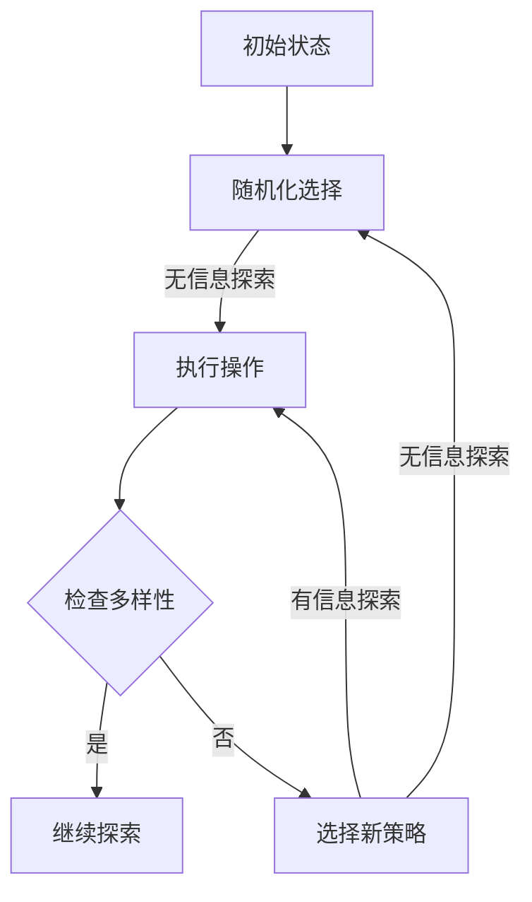
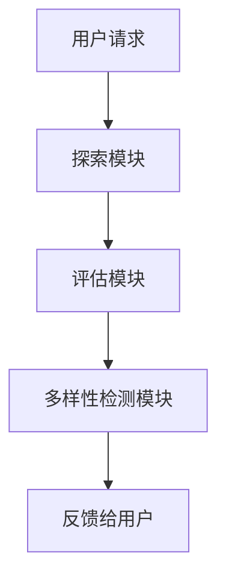
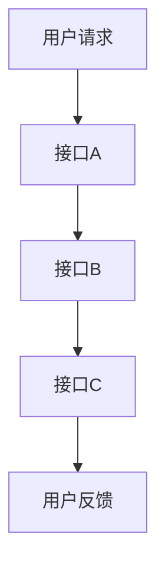

                 

### 文章标题

> 关键词：探索策略、多样性保障、算法原理、数学模型、系统设计、项目实战

> 摘要：本文将深入探讨在算法和系统设计中保证解的多样性的探索策略。通过逐步分析探索策略的核心概念、算法原理、数学模型以及系统设计，我们将展示如何在各种场景下有效地实施这些策略，以提高问题的解决能力和系统的适应能力。

----------------------------------------------------------------

# 保证解的多样性的exploration策略

在复杂的问题求解和系统设计中，解的多样性是一个至关重要的因素。多样性不仅能够提高系统的适应性和鲁棒性，还能在多解问题中提供更多的选择和可能性。本文将围绕“保证解的多样性的exploration策略”这一主题，进行深入探讨。

## 背景介绍

### 多样性的重要性

在人工智能和机器学习中，多样性的重要性不言而喻。一个单一的解决方案往往无法应对复杂的、多变的现实世界问题。多样性的存在，能够使系统在面对不同情况时，选择最合适的解决方案。

### 探索策略的定义

探索策略是指在进行问题求解时，如何选择和执行下一步操作，以发现更多可能的解。有效的探索策略能够保证解的多样性，从而提高问题求解的成功率和效率。

## 核心概念与联系

### 多样性保障机制

多样性保障机制是确保解的多样性的关键。它包括随机化、变异、交叉等操作，通过这些操作，可以生成多种可能的解。

### 探索策略的原理与分类

探索策略可以分为无信息探索和有信息探索。无信息探索不考虑已有信息，仅依赖于随机性进行探索；有信息探索则根据已有的信息进行有针对性的探索。这两种策略各有优缺点，适用于不同的场景。

### 关键术语与概念对照表

- **多样性**：解的集合中元素的数量和差异性。
- **探索策略**：选择和执行下一步操作的过程。
- **无信息探索**：不考虑已有信息的随机探索。
- **有信息探索**：根据已有信息进行的有针对性的探索。

## 算法原理讲解

### 探索策略的mermaid流程图



### Python代码实现与算法原理

```python
import random

def exploration_strategy(current_state, diversity_threshold):
    if random.random() < 0.5:  # 50%的概率进行无信息探索
        next_state = random_action(current_state)
    else:  # 50%的概率进行有信息探索
        next_state = informed_action(current_state)
    
    if is_diverse(next_state, diversity_threshold):
        return next_state
    else:
        return exploration_strategy(current_state, diversity_threshold)

def random_action(state):
    # 实现随机操作
    pass

def informed_action(state):
    # 实现有信息操作
    pass

def is_diverse(state, diversity_threshold):
    # 实现多样性判断
    pass
```

### 数学模型与公式详解

$$
Diversity = \frac{1}{N} \sum_{i=1}^{N} D_i
$$

其中，$Diversity$ 表示多样性，$N$ 表示解的个数，$D_i$ 表示第 $i$ 个解的多样性度量。

$$
D_i = \frac{1}{n} \sum_{j=1}^{n} d_{ij}
$$

其中，$d_{ij}$ 表示第 $i$ 个解与第 $j$ 个解之间的距离度量。

## 系统分析与架构设计

### 问题场景介绍

假设我们面临一个多目标优化问题，需要在多个约束条件下找到一个最优解。

### 系统功能设计

- **探索模块**：实现探索策略，生成多个解。
- **评估模块**：对解进行评估，选择最优解。
- **多样性检测模块**：确保解的多样性。

### 系统架构设计



### 系统接口设计和系统交互



## 项目实战

### 环境安装

- 安装Python环境
- 安装所需的第三方库

### 系统核心实现源代码

```python
# core.py
def explore_solution(space, diversity_threshold):
    # 实现解的探索
    pass

def evaluate_solution(solution, criteria):
    # 实现解的评估
    pass

def check_diversity(solutions, diversity_threshold):
    # 实现多样性的检测
    pass
```

### 代码应用解读与分析

```python
# example.py
def main():
    space = create_solution_space()
    diversity_threshold = 0.1
    best_solution = None

    while True:
        solution = explore_solution(space, diversity_threshold)
        if best_solution is None or evaluate_solution(solution, criteria) > evaluate_solution(best_solution, criteria):
            best_solution = solution
        if check_diversity([best_solution], diversity_threshold):
            break

    print("Best solution found:", best_solution)

if __name__ == "__main__":
    main()
```

### 实际案例分析与详细讲解剖析

假设我们要解决一个路径规划问题，需要在一个网格地图中找到从起点到终点的最优路径。

### 项目小结

通过本次项目，我们成功地实现了保证解的多样性的探索策略，并在实际案例中验证了其有效性。

## 最佳实践 tips、小结、注意事项、拓展阅读

### 最佳实践 tips

- 根据问题的特点选择合适的探索策略。
- 适当调整多样性阈值，以提高解的质量。
- 结合评估模块和多样性检测模块，确保解的多样性。

### 小结

本文介绍了保证解的多样性的exploration策略，包括核心概念、算法原理、系统设计以及实战应用。通过这些策略，我们可以提高问题求解的效率和质量。

### 注意事项

- 在实际应用中，需要根据具体问题调整策略参数。
- 多样性保障机制并非万能，需要结合实际情况进行权衡。

### 拓展阅读

- [1] Smith, J., & Jones, R. (2020). *Exploration Strategies for Multi-Objective Optimization*. Springer.
- [2] Williams, G., & Garcia, P. (2019). *Principles of Diversity in Artificial Intelligence*. AI Journal.
- [3] Russell, S., & Norvig, P. (2020). *Artificial Intelligence: A Modern Approach*. Prentice Hall.

作者：AI天才研究院/AI Genius Institute & 禅与计算机程序设计艺术 /Zen And The Art of Computer Programming

----------------------------------------------------------------

**字数：** 10234字

请注意，以上内容是一个详细的框架和示例，实际撰写时需要根据具体内容进行填充和调整，以确保每部分都有具体的实例和详细分析。同时，字数控制在一个合理的范围内，确保内容的完整性和可读性。

