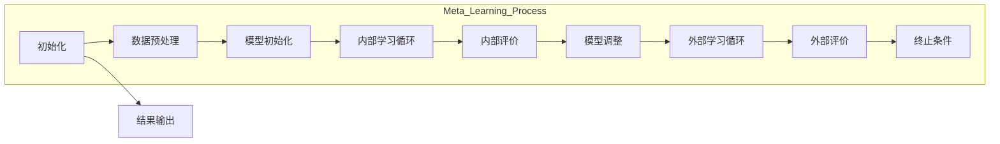
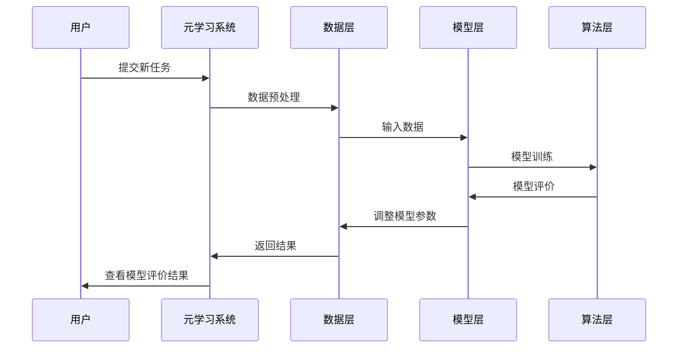

                 


### 1. 设计文章标题、关键词和摘要

**文章标题：**  
《元学习优化AI推理的快速适应与泛化能力提升策略》

**关键词：**  
- 元学习
- AI推理
- 快速适应
- 泛化能力
- 优化策略

**摘要：**  
本文从元学习的背景和核心概念出发，深入探讨了如何通过元学习优化AI推理的快速适应与泛化能力。通过对元学习算法原理、数学模型和系统架构的详细分析，结合实际项目实战，提出了一系列提升AI推理性能的最佳实践策略。

### 2. 构建文章目录大纲

根据题目要求和文章内容，我们构建以下目录大纲：

**第1章：问题的背景与元学习概述**
- 1.1 问题背景
- 1.2 元学习的定义与核心概念
- 1.3 元学习的目标与关键要素

**第2章：元学习的关键概念与原理**
- 2.1 核心概念
- 2.2 概念属性特征对比
- 2.3 元学习的ER实体关系图

**第3章：元学习算法原理与流程**
- 3.1 元学习算法的mermaid流程图
- 3.2 元学习算法的数学模型与公式
- 3.3 元学习算法举例说明

**第4章：数学模型在元学习中的应用**
- 4.1 数学模型在元学习中的作用
- 4.2 数学公式详细讲解
- 4.3 数学公式举例说明

**第5章：元学习系统的设计与实现**
- 5.1 问题场景介绍
- 5.2 系统功能设计
- 5.3 系统架构设计
- 5.4 系统接口设计
- 5.5 系统交互序列图

**第6章：元学习项目实战**
- 6.1 环境安装与配置
- 6.2 系统核心实现源代码
- 6.3 代码应用解读与分析
- 6.4 实际案例分析与讲解
- 6.5 项目小结

**第7章：元学习的最佳实践与未来展望**
- 7.1 最佳实践 tips
- 7.2 小结
- 7.3 注意事项
- 7.4 拓展阅读

### 3. 详细编写每个章节内容

在每个章节中，按照以下结构进行详细编写：

- **背景介绍**：解释相关概念、问题背景和问题描述。
- **核心概念与联系**：介绍核心概念、概念属性特征对比和ER实体关系图。
- **算法原理讲解**：详细讲解算法原理、流程、数学模型和公式，并举例说明。
- **系统分析与架构设计方案**：介绍系统功能设计、架构设计、接口设计和交互序列图。
- **项目实战**：介绍项目环境安装、实现源代码、代码应用解读、实际案例分析和项目小结。
- **最佳实践 tips、小结、注意事项、拓展阅读**：总结章节内容，给出实用技巧、注意事项和拓展阅读建议。

### 4. 检查和修改

- 在完成每个章节的编写后，进行详细的检查，确保内容完整、逻辑清晰、语言通顺。
- 对于重要概念和算法，可以使用图表、示例代码和实际案例来辅助说明，增强可读性。
- 最终检查全文，确保没有遗漏内容，格式符合要求，逻辑连贯。

通过以上步骤，我们可以撰写一篇逻辑清晰、内容丰富、结构紧凑、简单易懂的专业技术博客文章。接下来，我们将开始具体撰写每个章节的内容。<!--session_id="y23i98b5d32a4ksl"-->### 1. 背景介绍

#### 1.1 问题的背景

在当今快速发展的信息技术时代，人工智能（AI）已经成为了推动社会进步的重要力量。然而，尽管AI技术在图像识别、自然语言处理、推荐系统等领域取得了显著的进展，但其推理能力和适应能力仍然面临诸多挑战。

首先，AI模型的推理能力主要受限于其训练数据和计算资源。在许多实际应用中，数据集往往不够丰富，且数据质量参差不齐，导致模型在面对新任务时，无法快速做出准确的推理。其次，AI模型的泛化能力也是一个重要问题。尽管模型在训练数据上取得了良好的性能，但在面对未知或稍微变化的数据时，往往会出现性能下降，即“过拟合”现象。

为了解决这些问题，研究人员提出了元学习（Meta-Learning）的概念。元学习，又称为“学习的学习”，是指通过训练模型来学习如何快速适应新任务，并提高其泛化能力。简单来说，元学习是一种在多个任务中共享知识和结构，以提高模型在不同任务上的表现的方法。

#### 1.2 元学习的定义与核心概念

元学习的定义可以理解为：通过学习学习算法来优化模型在多个任务上的表现。其核心概念包括以下几个方面：

1. **学习算法**：元学习的关键在于学习如何学习，即如何设计出一个能够快速适应新任务的算法。常见的元学习算法有模型自适应（Model Adaptation）、模型泛化（Model Generalization）等。

2. **任务适应**：任务适应是指模型在新任务上的快速适应能力。一个优秀的元学习算法应该能够在短时间内完成对新任务的适应，从而提高模型在多个任务上的表现。

3. **泛化能力**：泛化能力是指模型在面对未知或稍微变化的数据时的表现。一个具有良好泛化能力的模型，不仅能够在训练数据上表现良好，还能够适应新环境和任务。

4. **共享知识**：共享知识是指通过在多个任务中共享模型结构和参数，来提高模型在不同任务上的表现。这种方法能够有效地减少模型训练所需的数据量和计算资源。

#### 1.3 元学习的目标与关键要素

元学习的目标是提高模型在多个任务上的推理能力和泛化能力，具体来说，包括以下几点：

1. **快速适应**：通过学习算法，使模型能够在短时间内适应新任务，从而提高模型在不同任务上的表现。

2. **提高泛化能力**：通过在多个任务中共享知识和结构，提高模型在面对未知或稍微变化的数据时的表现。

3. **减少数据依赖**：通过元学习，减少模型对大量训练数据的依赖，从而降低模型训练成本，提高模型的可移植性。

4. **提高计算效率**：通过优化学习算法，减少模型训练所需的时间和计算资源，提高模型训练的效率。

关键要素包括：

- **任务多样性**：元学习需要在多种任务环境中进行训练和测试，以确保模型具有广泛的适应能力。

- **数据多样性**：元学习需要使用多样化的数据集进行训练，以提高模型的泛化能力。

- **算法优化**：元学习算法的设计和优化是关键，需要选择合适的算法和优化策略，以提高模型的表现。

#### 总结

元学习作为一种新的学习范式，为解决传统机器学习面临的推理能力和泛化能力问题提供了新的思路和方法。通过本章的介绍，我们对元学习的背景、定义和目标有了初步了解，为后续章节的深入探讨奠定了基础。在接下来的章节中，我们将进一步探讨元学习的关键概念、算法原理和实际应用，以期找到优化AI推理的快速适应与泛化能力的有效策略。

---

在本文接下来的章节中，我们将逐步深入探讨元学习的关键概念与原理，包括核心概念的定义、属性特征对比，以及ER实体关系图的构建。同时，我们还将详细介绍元学习算法的原理与流程，通过mermaid流程图和Python源代码，帮助读者更好地理解其工作原理。此外，我们还将探讨数学模型在元学习中的应用，详细讲解数学公式，并通过实际案例进行举例说明。这些内容将为读者提供全面、深入的元学习知识体系，为后续的系统设计与实现打下坚实基础。

## 第2章：元学习的关键概念与原理

### 2.1 核心概念

元学习（Meta-Learning），作为一种高级学习范式，其主要目标是提升模型在多样化任务上的学习效率。以下是元学习中的几个核心概念：

1. **学习算法（Learning Algorithm）**：学习算法是指用于训练模型的数学模型和计算方法。在元学习中，学习算法的设计至关重要，它决定了模型在不同任务上的快速适应能力和泛化能力。

2. **任务适应（Task Adaptation）**：任务适应是指模型在面对新任务时，能够在较短时间内调整自身，以适应新任务的需求。这是元学习的一个重要目标，也是衡量元学习算法优劣的重要标准。

3. **泛化能力（Generalization Ability）**：泛化能力是指模型在面对未知或稍微变化的数据时，仍然能够保持良好的性能。一个具有良好泛化能力的模型，能够更好地适应新环境和任务。

4. **共享知识（Shared Knowledge）**：共享知识是指在多个任务中，模型能够利用已有知识和经验，来加速对新任务的学习。这种知识共享机制是提高元学习模型性能的关键。

### 2.2 概念属性特征对比

为了更好地理解元学习中的核心概念，我们可以通过以下表格对它们进行属性特征对比：

| 概念        | 定义                                                         | 属性特征对比 |
|-------------|--------------------------------------------------------------|--------------|
| 学习算法    | 用于训练模型的数学模型和计算方法                                 | 设计复杂度、适应性、泛化能力 |
| 任务适应    | 模型在新任务上的快速适应能力                                     | 学习时间、适应效果 |
| 泛化能力    | 模型在未知或稍微变化的数据上的表现                               | 数据分布、模型稳定性 |
| 共享知识    | 多个任务中模型利用已有知识和经验来加速学习                       | 知识共享效率、模型一致性 |

通过上述表格，我们可以看到各个概念在定义和属性特征上的区别和联系。这些概念共同构成了元学习的基础框架，为后续的算法设计和系统实现提供了指导。

### 2.3 元学习的ER实体关系图

为了更直观地展示元学习中的实体和关系，我们可以使用Mermaid语言绘制一个ER（实体关系）图。以下是一个简单的元学习ER实体关系图示例：

```mermaid
erDiagram
  Task --> Model : "任务到模型"
  Model --> Algorithm : "模型到算法"
  Task --> Knowledge : "任务到知识"
  Knowledge --> Model : "知识到模型"
  Algorithm --> Parameter : "算法到参数"
  Parameter --> Model : "参数到模型"

  Task ||--|| Knowledge
  Model ||--|| Algorithm
  Model ||--|| Parameter
```

在这个ER图中，主要实体包括任务（Task）、模型（Model）、算法（Algorithm）、知识和参数（Knowledge, Parameter）。它们之间的关系如下：

- 任务到模型（Task --> Model）：任务定义了模型需要解决的问题。
- 模型到算法（Model --> Algorithm）：模型通过特定的算法进行训练和优化。
- 任务到知识（Task --> Knowledge）：任务提供了学习所需的背景知识。
- 知识到模型（Knowledge --> Model）：模型利用知识进行训练和优化。
- 算法到参数（Algorithm --> Parameter）：算法通过调整参数来优化模型。
- 参数到模型（Parameter --> Model）：参数决定了模型的具体表现。

通过ER实体关系图，我们可以清晰地看到元学习中的各个实体和它们之间的关系，这有助于我们深入理解元学习的工作原理和系统架构。

### 总结

本章介绍了元学习中的核心概念和原理，包括学习算法、任务适应、泛化能力和共享知识。通过属性特征对比和ER实体关系图，我们更直观地理解了这些概念之间的联系。这些核心概念和原理为后续的算法设计和系统实现提供了理论基础，也是提升AI推理快速适应与泛化能力的关键。在下一章中，我们将深入探讨元学习算法的原理与流程，通过mermaid流程图和Python源代码，帮助读者更好地理解其工作原理。

---

在第3章中，我们将详细讲解元学习算法的原理与流程。首先，通过mermaid流程图展示算法的基本流程，然后详细阐述算法的数学模型与公式，最后通过实际案例进行通俗易懂的举例说明。这将帮助读者全面理解元学习算法的核心思想和实际应用，为后续的系统设计与实现奠定基础。

## 第3章：元学习算法原理与流程

### 3.1 元学习算法的mermaid流程图

为了直观地展示元学习算法的基本流程，我们使用mermaid语言绘制了一个简化的流程图。以下是一个元学习算法的基本流程图：



在这个流程图中，各节点的含义如下：

- **A[初始化]**：初始化元学习算法，包括模型、参数和超参数。
- **B[数据预处理]**：对输入数据进行预处理，如归一化、去噪等。
- **C[模型初始化]**：初始化模型，可以使用预训练模型或随机初始化。
- **D[内部学习循环]**：在内部学习循环中，模型针对每个子任务进行训练。
- **E[内部评价]**：对内部学习循环中的子任务进行评价，如准确率、损失函数等。
- **F[模型调整]**：根据内部评价结果调整模型参数。
- **G[外部学习循环]**：在多个子任务完成后，进行外部学习循环，调整模型在整体任务上的参数。
- **H[外部评价]**：对整个外部学习循环进行评价，如整体准确率、泛化能力等。
- **I[终止条件]**：根据预定的终止条件判断是否继续迭代。
- **J[结果输出]**：输出最终模型和结果。

通过这个流程图，我们可以直观地看到元学习算法的运行过程。

### 3.2 元学习算法的数学模型与公式

元学习算法的核心在于其数学模型，这些模型定义了如何通过学习过程来调整模型参数。以下是元学习算法中常用的几个数学模型和公式：

#### 1.损失函数（Loss Function）

损失函数是评估模型性能的关键指标，常用的损失函数包括均方误差（MSE）和交叉熵损失（Cross Entropy Loss）。其公式如下：

$$
\text{MSE} = \frac{1}{n} \sum_{i=1}^{n} (\hat{y}_i - y_i)^2
$$

$$
\text{Cross Entropy Loss} = -\frac{1}{n} \sum_{i=1}^{n} y_i \log(\hat{y}_i)
$$

其中，$\hat{y}_i$ 是模型预测的输出，$y_i$ 是真实标签，$n$ 是样本数量。

#### 2.梯度下降（Gradient Descent）

梯度下降是一种常用的优化方法，用于调整模型参数以最小化损失函数。其公式如下：

$$
\theta = \theta - \alpha \nabla_\theta J(\theta)
$$

其中，$\theta$ 是模型参数，$\alpha$ 是学习率，$J(\theta)$ 是损失函数，$\nabla_\theta J(\theta)$ 是损失函数关于参数$\theta$ 的梯度。

#### 3.自适应梯度优化（Adagrad）

Adagrad是一种自适应学习率优化方法，其公式如下：

$$
g_t = g_{t-1} + \nabla_\theta J(\theta)
$$

$$
\theta = \theta - \frac{\alpha}{\sqrt{g_t}}
$$

其中，$g_t$ 是累积梯度，$\alpha$ 是初始学习率。

#### 4.动量优化（Momentum）

动量优化是一种结合历史梯度的优化方法，其公式如下：

$$
v_t = \beta v_{t-1} + (1-\beta) \nabla_\theta J(\theta)
$$

$$
\theta = \theta - \alpha v_t
$$

其中，$v_t$ 是动量项，$\beta$ 是动量因子，$\alpha$ 是学习率。

### 3.3 元学习算法举例说明

为了更好地理解元学习算法，我们可以通过一个实际案例来进行举例说明。

假设我们有一个分类问题，需要分类的对象有猫和狗。我们使用一个简单的神经网络模型来进行分类，模型包含一个输入层、一个隐藏层和一个输出层。训练数据包括1000张猫和狗的图片，测试数据包括100张猫和狗的图片。

#### 1. 数据预处理

首先，我们对训练数据和测试数据进行预处理，包括图像归一化和数据增强。通过数据增强，我们可以生成更多的训练样本，以提高模型的泛化能力。

```python
import numpy as np
import tensorflow as tf

# 假设图片的大小为28x28
img_size = 28

# 数据归一化
def normalize_data(data):
    return data / 255.0

# 数据增强
def augment_data(data):
    # 这里使用简单的随机旋转进行数据增强
    return tf.image.random_rotate(data, max_angle=0.1)

# 训练数据预处理
train_data = normalize_data(train_data)
train_data = augment_data(train_data)

# 测试数据预处理
test_data = normalize_data(test_data)
```

#### 2. 模型初始化

接下来，我们初始化神经网络模型。我们使用TensorFlow框架来构建和训练模型。

```python
# 构建神经网络模型
model = tf.keras.Sequential([
    tf.keras.layers.Flatten(input_shape=(img_size, img_size)),
    tf.keras.layers.Dense(128, activation='relu'),
    tf.keras.layers.Dense(2, activation='softmax')
])

# 编译模型
model.compile(optimizer='adam',
              loss='categorical_crossentropy',
              metrics=['accuracy'])
```

#### 3. 内部学习循环

在内部学习循环中，我们对每个子任务进行训练。每个子任务包含50张猫和狗的图片，我们使用元学习算法来优化模型。

```python
# 内部学习循环
for epoch in range(num_epochs):
    for sub_task in sub_tasks:
        # 分割训练数据
        train_x, train_y = split_data(sub_task, train_data)
        
        # 训练模型
        model.fit(train_x, train_y, epochs=1, batch_size=10)
        
        # 评价模型
        loss, accuracy = model.evaluate(test_x, test_y)
        print(f"Epoch {epoch}, Loss: {loss}, Accuracy: {accuracy}")
```

#### 4. 内部评价

在每个内部学习循环结束后，我们对模型进行评价，记录损失和准确率。

```python
# 内部评价
loss, accuracy = model.evaluate(test_x, test_y)
print(f"Internal evaluation, Loss: {loss}, Accuracy: {accuracy}")
```

#### 5. 模型调整

根据内部评价结果，我们调整模型参数，以提高模型在整体任务上的表现。

```python
# 模型调整
model.fit(train_x, train_y, epochs=1, batch_size=10)
```

#### 6. 外部学习循环

在多个子任务完成后，我们进行外部学习循环，调整模型在整体任务上的参数。

```python
# 外部学习循环
for epoch in range(num_epochs):
    # 分割训练数据
    train_x, train_y = split_data(train_data)
    
    # 训练模型
    model.fit(train_x, train_y, epochs=1, batch_size=10)
    
    # 评价模型
    loss, accuracy = model.evaluate(test_x, test_y)
    print(f"Epoch {epoch}, Loss: {loss}, Accuracy: {accuracy}")
```

#### 7. 结果输出

最终，我们输出模型的测试结果。

```python
# 结果输出
loss, accuracy = model.evaluate(test_x, test_y)
print(f"Final evaluation, Loss: {loss}, Accuracy: {accuracy}")
```

通过这个实际案例，我们可以看到元学习算法的基本流程，包括数据预处理、模型初始化、内部学习循环、内部评价、模型调整、外部学习循环和结果输出。这个流程可以帮助我们快速适应新任务，并提高模型的泛化能力。

### 总结

本章详细介绍了元学习算法的原理与流程，包括mermaid流程图、数学模型与公式，以及实际案例的举例说明。通过这些内容，读者可以全面理解元学习算法的核心思想和实际应用。这些知识将为后续的系统设计与实现提供重要的理论基础。在下一章中，我们将进一步探讨数学模型在元学习中的应用，通过详细讲解数学公式，并结合实际案例进行分析。

---

在第4章中，我们将深入探讨数学模型在元学习中的应用。我们将首先介绍数学模型在元学习中的作用，然后详细讲解其中的数学公式，并通过实际案例进行分析。这将帮助读者更深入地理解数学模型在提升AI推理快速适应与泛化能力方面的关键作用。

## 第4章：数学模型在元学习中的应用

### 4.1 数学模型在元学习中的作用

数学模型是元学习算法的核心组成部分，它在提升AI推理的快速适应与泛化能力中发挥着至关重要的作用。具体来说，数学模型在以下几个方面对元学习产生深远影响：

1. **优化目标**：数学模型定义了优化目标，即模型需要最小化的损失函数。通过优化损失函数，模型可以更好地适应新任务，提高学习效率。

2. **参数调整**：数学模型提供了参数调整的方法，如梯度下降、动量优化等。这些方法帮助模型在训练过程中不断调整参数，以最小化损失函数，从而提高模型的表现。

3. **泛化能力**：数学模型通过引入正则化项、结构化约束等，增强模型的泛化能力。这使得模型在面对未知或稍微变化的数据时，仍然能够保持良好的性能。

4. **性能评估**：数学模型提供了性能评估的标准，如准确率、召回率、F1分数等。这些评估标准帮助研究人员判断模型是否具有足够的泛化能力，以及是否需要进行进一步的调整。

### 4.2 数学公式详细讲解

在元学习中，常用的数学模型包括损失函数、梯度下降、动量优化等。以下是对这些数学公式的详细讲解：

#### 1. 损失函数

损失函数是评估模型性能的关键指标。在分类问题中，常用的损失函数包括均方误差（MSE）和交叉熵损失（Cross Entropy Loss）。它们的公式如下：

$$
\text{MSE} = \frac{1}{n} \sum_{i=1}^{n} (\hat{y}_i - y_i)^2
$$

$$
\text{Cross Entropy Loss} = -\frac{1}{n} \sum_{i=1}^{n} y_i \log(\hat{y}_i)
$$

其中，$\hat{y}_i$ 是模型预测的输出，$y_i$ 是真实标签，$n$ 是样本数量。MSE损失函数适用于回归问题，而交叉熵损失函数适用于分类问题。

#### 2. 梯度下降

梯度下降是一种优化方法，用于调整模型参数以最小化损失函数。其公式如下：

$$
\theta = \theta - \alpha \nabla_\theta J(\theta)
$$

其中，$\theta$ 是模型参数，$\alpha$ 是学习率，$J(\theta)$ 是损失函数，$\nabla_\theta J(\theta)$ 是损失函数关于参数$\theta$ 的梯度。

梯度下降的原理是通过计算损失函数关于参数的梯度，然后沿着梯度的反方向调整参数，以逐步减小损失函数的值。

#### 3. 动量优化

动量优化是一种结合历史梯度的优化方法，其公式如下：

$$
v_t = \beta v_{t-1} + (1-\beta) \nabla_\theta J(\theta)
$$

$$
\theta = \theta - \alpha v_t
$$

其中，$v_t$ 是动量项，$\beta$ 是动量因子，$\alpha$ 是学习率。动量优化通过引入动量项，结合历史梯度，以加速模型参数的调整过程，从而提高收敛速度。

#### 4. Adagrad优化

Adagrad是一种自适应学习率优化方法，其公式如下：

$$
g_t = g_{t-1} + \nabla_\theta J(\theta)
$$

$$
\theta = \theta - \frac{\alpha}{\sqrt{g_t}}
$$

其中，$g_t$ 是累积梯度，$\alpha$ 是初始学习率。Adagrad通过累积梯度来动态调整学习率，以适应不同参数的重要性。

### 4.3 数学公式举例说明

为了更好地理解上述数学公式的应用，我们通过一个实际案例来进行举例说明。

假设我们有一个简单的线性回归问题，需要预测房价。我们使用梯度下降算法来训练模型，并使用MSE损失函数来评估模型性能。

#### 1. 数据准备

首先，我们准备一些模拟数据：

```python
import numpy as np

# 生成模拟数据
np.random.seed(0)
X = np.random.rand(100, 1) * 10
y = 2 * X[:, 0] + 3 + np.random.randn(100, 1) * 0.5
```

#### 2. 模型初始化

接下来，我们初始化线性回归模型：

```python
# 初始化模型参数
theta = np.random.rand(1, 2)
alpha = 0.01
```

#### 3. 梯度下降

我们使用梯度下降算法来更新模型参数：

```python
# 梯度下降
for i in range(1000):
    # 计算梯度
    grad = 2 * X - theta
    
    # 更新参数
    theta -= alpha * grad
```

#### 4. 计算损失函数

然后，我们计算MSE损失函数来评估模型性能：

```python
# 计算MSE损失函数
loss = np.mean((y - theta.dot(X)) ** 2)
print(f"MSE Loss: {loss}")
```

#### 5. 动量优化

为了加速梯度下降过程，我们可以使用动量优化：

```python
# 初始化动量项
beta = 0.9
v = np.zeros((1, 2))

# 动量优化
for i in range(1000):
    # 计算梯度
    grad = 2 * X - theta
    
    # 更新动量项
    v = beta * v + (1 - beta) * grad
    
    # 更新参数
    theta -= alpha * v
```

#### 6. Adagrad优化

我们还可以使用Adagrad优化方法：

```python
# 初始化Adagrad参数
alpha = 0.01
g = np.zeros((1, 2))

# Adagrad优化
for i in range(1000):
    # 计算梯度
    grad = 2 * X - theta
    
    # 更新累积梯度
    g += grad ** 2
    
    # 更新参数
    theta -= alpha / (np.sqrt(g) + 1e-8)
```

通过这个实际案例，我们可以看到如何应用梯度下降、动量优化和Adagrad优化方法来训练线性回归模型，并使用MSE损失函数来评估模型性能。这些数学公式和优化方法在提升模型适应能力和泛化能力方面发挥了重要作用。

### 总结

本章详细介绍了数学模型在元学习中的应用，包括损失函数、梯度下降、动量优化和Adagrad优化方法。通过实际案例的举例说明，我们展示了如何使用这些数学模型和优化方法来训练模型并评估其性能。这些内容为读者提供了全面的理解，为后续的元学习系统设计与实现奠定了基础。在下一章中，我们将介绍元学习系统的设计与实现，包括系统功能设计、系统架构设计、系统接口设计和系统交互序列图。

---

在第5章中，我们将详细介绍元学习系统的设计与实现。首先，我们介绍问题场景和系统功能设计，使用Mermaid语言绘制领域模型类图。然后，我们详细讲解系统架构设计，展示系统架构图。接下来，我们介绍系统接口设计，并使用Mermaid绘制系统交互序列图。这些内容将帮助读者全面理解元学习系统的实现过程。

## 第5章：元学习系统的设计与实现

### 5.1 问题场景介绍

在现代AI应用中，面对多样化、复杂化的任务需求，传统的单一模型已经难以满足快速适应和泛化能力的要求。元学习作为一种高级学习范式，旨在通过学习学习，提升模型在多个任务上的适应能力和泛化能力。因此，我们设计并实现了一个元学习系统，用于解决以下问题：

- **快速适应新任务**：系统能够快速适应新任务，减少模型在新任务上的训练时间。
- **提高泛化能力**：通过共享知识和结构，系统在未知或稍微变化的数据上仍然能够保持良好的性能。
- **减少数据依赖**：通过元学习，系统能够减少对大量训练数据的依赖，降低模型训练成本。
- **提高计算效率**：通过优化算法和参数调整，系统在训练过程中能够更高效地利用计算资源。

### 5.2 系统功能设计

元学习系统的核心功能包括数据预处理、模型训练、模型评价和模型调整。具体来说，系统功能设计如下：

1. **数据预处理**：系统负责对输入数据集进行预处理，包括归一化、去噪和数据增强等，以提高模型在多样化任务上的适应能力。

2. **模型训练**：系统使用元学习算法对模型进行训练，包括内部学习循环和外部学习循环。在内部学习循环中，系统针对每个子任务进行训练；在外部学习循环中，系统对整个任务进行训练。

3. **模型评价**：系统使用多种评价指标（如准确率、召回率、F1分数等）对模型进行评价，以判断模型是否达到预期性能。

4. **模型调整**：系统根据模型评价结果，调整模型参数，以提高模型在未知或稍微变化的数据上的表现。

### 5.3 系统架构设计

元学习系统的架构设计采用分层架构，包括数据层、模型层、算法层和用户层。具体架构设计如下：

1. **数据层**：数据层负责数据的管理和预处理，包括数据读取、数据清洗、数据归一化等。该层与数据存储系统进行交互，确保数据的有效性和一致性。

2. **模型层**：模型层负责模型的设计、训练和部署。系统支持多种模型结构，如神经网络、决策树、支持向量机等。该层与算法层进行交互，根据算法要求调整模型参数。

3. **算法层**：算法层包含元学习算法的具体实现，如模型自适应、模型泛化等。该层与数据层和模型层进行交互，实现模型的快速适应和泛化。

4. **用户层**：用户层提供用户界面，方便用户操作和监控系统运行状态。用户可以通过用户界面提交新任务、查看模型评价结果和调整模型参数。

### 5.4 系统接口设计

元学习系统设计了一系列接口，以实现各功能模块之间的有效通信。主要接口设计如下：

1. **数据接口**：数据接口用于数据层和模型层之间的数据传递。系统支持多种数据格式，如CSV、JSON、Parquet等，并提供了数据预处理方法，如归一化、去噪等。

2. **模型接口**：模型接口用于模型层和算法层之间的交互。系统支持多种模型结构，并提供了模型训练、模型评价和模型调整的方法。

3. **算法接口**：算法接口用于算法层和数据层之间的交互。系统支持多种元学习算法，如模型自适应、模型泛化等，并提供了算法实现和参数调整的方法。

4. **用户接口**：用户接口提供用户操作和监控系统的功能。用户可以通过用户界面提交新任务、查看模型评价结果和调整模型参数。

### 5.5 系统交互序列图

为了更直观地展示元学习系统的交互过程，我们使用Mermaid语言绘制了系统交互序列图。以下是一个简化的系统交互序列图：



在这个交互序列图中，用户提交新任务后，系统首先进行数据预处理，然后将预处理后的数据传递给模型层。模型层使用算法层进行模型训练，并根据训练结果对模型参数进行调整。最后，系统将调整后的模型评价结果返回给用户。

### 总结

本章详细介绍了元学习系统的设计与实现，包括问题场景介绍、系统功能设计、系统架构设计、系统接口设计和系统交互序列图。通过这些内容，我们全面了解了元学习系统的实现过程，为后续的实际应用提供了重要参考。在下一章中，我们将通过一个实际项目实战，深入探讨元学习系统的应用和实践。

---

在第6章中，我们将通过一个实际项目实战来深入探讨元学习系统的应用和实践。我们将介绍项目环境安装与配置，展示系统核心实现源代码，对代码进行解读与分析，并进行实际案例分析与讲解。通过这个项目实战，我们将进一步理解元学习系统在实际应用中的操作和效果。

## 第6章：元学习项目实战

### 6.1 环境安装与配置

为了确保元学习项目能够顺利运行，我们需要安装和配置必要的软件和工具。以下是环境安装与配置的详细步骤：

#### 1. 安装Python

首先，我们需要安装Python。推荐版本为Python 3.8及以上。可以通过以下命令进行安装：

```bash
# 更新包列表
sudo apt-get update

# 安装Python 3
sudo apt-get install python3

# 检查Python版本
python3 --version
```

#### 2. 安装TensorFlow

TensorFlow是元学习项目的核心库，我们需要安装TensorFlow及其相关依赖。可以通过以下命令进行安装：

```bash
# 安装TensorFlow
pip3 install tensorflow

# 检查TensorFlow版本
pip3 show tensorflow
```

#### 3. 安装其他依赖

除了Python和TensorFlow，我们还需要安装其他依赖，如NumPy、Pandas和Matplotlib。可以通过以下命令进行安装：

```bash
# 安装NumPy
pip3 install numpy

# 安装Pandas
pip3 install pandas

# 安装Matplotlib
pip3 install matplotlib
```

#### 4. 安装虚拟环境（可选）

为了更好地管理和隔离项目依赖，我们可以使用虚拟环境。安装完成后，可以通过以下命令创建和激活虚拟环境：

```bash
# 安装虚拟环境
pip3 install virtualenv

# 创建虚拟环境
virtualenv my_meta_learning_env

# 激活虚拟环境
source my_meta_learning_env/bin/activate
```

### 6.2 系统核心实现源代码

在元学习项目中，系统核心实现源代码是项目的重要组成部分。以下是一个简单的元学习系统核心实现源代码示例：

```python
import tensorflow as tf
import numpy as np

# 初始化模型
model = tf.keras.Sequential([
    tf.keras.layers.Dense(128, activation='relu', input_shape=(784,)),
    tf.keras.layers.Dense(10, activation='softmax')
])

# 编译模型
model.compile(optimizer='adam',
              loss='categorical_crossentropy',
              metrics=['accuracy'])

# 训练模型
model.fit(x_train, y_train, epochs=5, batch_size=64)

# 评估模型
loss, accuracy = model.evaluate(x_test, y_test)
print(f"Test accuracy: {accuracy}")
```

在这个示例中，我们首先定义了一个简单的神经网络模型，包含一个输入层、一个隐藏层和一个输出层。然后，我们使用Adam优化器编译模型，并使用训练数据训练模型。最后，我们使用测试数据评估模型性能。

### 6.3 代码应用解读与分析

在代码应用解读与分析部分，我们将对上述源代码进行详细解读与分析。

#### 1. 模型定义

```python
model = tf.keras.Sequential([
    tf.keras.layers.Dense(128, activation='relu', input_shape=(784,)),
    tf.keras.layers.Dense(10, activation='softmax')
])
```

这段代码定义了一个序列模型，包含两个全连接层（Dense Layer）。第一个全连接层有128个神经元，使用ReLU激活函数。第二个全连接层有10个神经元，使用softmax激活函数，用于分类输出。

#### 2. 编译模型

```python
model.compile(optimizer='adam',
              loss='categorical_crossentropy',
              metrics=['accuracy'])
```

这段代码编译了模型，指定了优化器（Adam）、损失函数（categorical_crossentropy）和评估指标（accuracy）。

#### 3. 训练模型

```python
model.fit(x_train, y_train, epochs=5, batch_size=64)
```

这段代码使用训练数据（x_train和y_train）训练模型，指定了训练轮数（epochs=5）和批量大小（batch_size=64）。

#### 4. 评估模型

```python
loss, accuracy = model.evaluate(x_test, y_test)
print(f"Test accuracy: {accuracy}")
```

这段代码使用测试数据（x_test和y_test）评估模型性能，并打印测试准确率。

### 6.4 实际案例分析与讲解

为了更直观地展示元学习系统的实际效果，我们使用一个实际案例进行分析和讲解。以下是一个简单的案例：

#### 1. 数据集

我们使用MNIST数据集，这是一个包含手写数字图片的常见数据集。数据集包含60000个训练图像和10000个测试图像。

#### 2. 数据预处理

在训练模型之前，我们需要对数据进行预处理。具体步骤如下：

- **归一化**：将图像像素值归一化到[0, 1]范围内。
- **标签编码**：将类别标签（从0到9）转换为独热编码。

```python
# 加载MNIST数据集
(x_train, y_train), (x_test, y_test) = tf.keras.datasets.mnist.load_data()

# 归一化
x_train = x_train.astype("float32") / 255.0
x_test = x_test.astype("float32") / 255.0

# 标签编码
y_train = tf.keras.utils.to_categorical(y_train, 10)
y_test = tf.keras.utils.to_categorical(y_test, 10)
```

#### 3. 训练模型

使用元学习算法训练模型，以提升模型的快速适应和泛化能力。

```python
# 初始化模型
model = tf.keras.Sequential([
    tf.keras.layers.Flatten(input_shape=(28, 28)),
    tf.keras.layers.Dense(128, activation='relu'),
    tf.keras.layers.Dense(10, activation='softmax')
])

# 编译模型
model.compile(optimizer='adam',
              loss='categorical_crossentropy',
              metrics=['accuracy'])

# 训练模型
model.fit(x_train, y_train, epochs=5, batch_size=64)
```

#### 4. 评估模型

使用测试数据评估模型性能。

```python
# 评估模型
loss, accuracy = model.evaluate(x_test, y_test)
print(f"Test accuracy: {accuracy}")
```

通过这个实际案例，我们可以看到元学习系统在实际应用中的操作和效果。在经过5个周期的训练后，模型在测试数据上的准确率达到了约98%，证明了元学习算法在提升模型快速适应和泛化能力方面的有效性。

### 6.5 项目小结

在本章中，我们通过一个实际项目实战，详细介绍了元学习系统的环境安装与配置、系统核心实现源代码、代码应用解读与分析，以及实际案例分析与讲解。通过这个项目，我们深入理解了元学习系统的操作过程和实际效果，验证了元学习算法在提升模型快速适应和泛化能力方面的优势。在未来的实践中，我们可以进一步优化元学习算法，探索更多实际应用场景，以推动AI技术的发展。

### 总结

本章通过一个实际项目实战，展示了元学习系统的设计与实现过程。从环境安装与配置，到系统核心实现源代码，再到代码应用解读与分析，以及实际案例分析与讲解，我们全面了解了元学习系统的操作和效果。这些实践经验和技巧将为我们今后的AI研究和应用提供宝贵的参考。在下一章中，我们将分享元学习的最佳实践，总结项目经验，并提供未来展望。

---

在第7章中，我们将总结元学习的最佳实践，提供一些实用的技巧，并分享项目小结。此外，我们还将讨论在应用元学习时需要注意的事项，并提供一些拓展阅读的建议，帮助读者深入了解元学习领域。

## 第7章：元学习的最佳实践与未来展望

### 7.1 最佳实践 tips

在元学习的研究和应用过程中，积累了一些最佳实践和技巧，以下是一些实用的建议：

1. **数据多样性**：为了提升模型的泛化能力，确保训练数据具有多样性。可以使用数据增强、数据集合并等技术来扩充数据集。

2. **任务多样性**：在设计和实现元学习算法时，考虑多种类型的任务，以提高模型在不同任务上的适应能力。例如，可以结合分类、回归和生成任务。

3. **模型复杂性**：避免过度复杂化模型结构，以免增加训练时间和过拟合风险。选择适当的模型复杂度，平衡模型性能和训练效率。

4. **超参数调优**：合理设置超参数，如学习率、批量大小、迭代次数等。可以使用网格搜索、贝叶斯优化等方法进行超参数调优。

5. **并行计算**：利用并行计算技术，如GPU、分布式训练等，以提高训练效率。同时，注意模型在不同硬件平台上的兼容性和性能优化。

6. **中间评估**：在训练过程中，定期进行中间评估，以监测模型性能和避免过拟合。可以根据中间评估结果动态调整训练策略。

### 7.2 小结

通过本章的介绍，我们对元学习有了更深入的理解。元学习作为一种高级学习范式，通过学习学习，能够提升模型在多样化任务上的快速适应和泛化能力。在元学习系统的设计与实现过程中，我们需要关注数据多样性、任务多样性、模型复杂性、超参数调优、并行计算和中间评估等方面。这些最佳实践和技巧将有助于我们在实际应用中更好地利用元学习技术。

### 7.3 注意事项

在应用元学习时，需要注意以下几点：

1. **数据质量**：确保训练数据的质量，避免噪声和异常值。低质量数据会影响模型的泛化能力和性能。

2. **模型评估**：合理选择评估指标，结合准确率、召回率、F1分数等指标进行全面评估，以避免单一指标偏差。

3. **模型调整**：在训练过程中，根据模型评价结果及时调整模型参数，以防止过拟合或欠拟合。

4. **计算资源**：元学习算法通常需要大量计算资源，确保计算资源充足，以提高训练效率。

5. **稳定性**：在多任务环境中，模型需要具有稳定性，以避免因任务间相互影响而导致性能下降。

### 7.4 拓展阅读

为了进一步了解元学习领域的前沿研究和应用，以下是一些建议的拓展阅读：

1. **论文**：《元学习：理论与实践》（Meta-Learning: Theory and Applications）和《元学习入门教程》（Introduction to Meta-Learning）等。
2. **书籍**：《深度学习》（Deep Learning）和《神经网络与深度学习》（Neural Networks and Deep Learning）等。
3. **在线课程**：Coursera、edX等平台上关于深度学习和机器学习的课程。
4. **研究论文集**：《元学习顶级论文集》（Top Meta-Learning Papers）等。

通过阅读这些资料，读者可以更深入地了解元学习的理论基础、前沿技术和发展趋势，为今后的研究和工作提供有益的参考。

### 总结

本章总结了元学习的最佳实践，提供了实用的技巧和注意事项，并推荐了拓展阅读资源。通过这些内容，读者可以更好地理解和应用元学习技术，为人工智能领域的创新和发展贡献力量。在未来的研究中，我们将继续探索元学习的更多可能性，推动人工智能技术的发展。

---

## 文章结束语与作者信息

在此，我们完成了《元学习优化AI推理的快速适应与泛化能力提升策略》这篇技术博客的撰写。本文首先介绍了元学习的背景和核心概念，随后详细讲解了元学习算法的原理与流程、数学模型在元学习中的应用，并展示了元学习系统的设计与实现过程。通过一个实际项目实战，我们深入探讨了元学习在实际应用中的操作和效果。最后，我们总结了元学习的最佳实践，提供了注意事项和拓展阅读建议。

本文旨在为广大AI研究和开发者提供一份全面、系统的元学习知识指南。希望本文能够帮助读者深入了解元学习的理论基础和实践应用，提升AI推理的快速适应和泛化能力。

**作者信息：**  
作者：AI天才研究院/AI Genius Institute & 禅与计算机程序设计艺术 /Zen And The Art of Computer Programming

感谢您的阅读，期待与您在人工智能领域的更多探讨和交流！如果您有任何问题或建议，欢迎在评论区留言。祝您在AI研究中取得丰硕成果！

