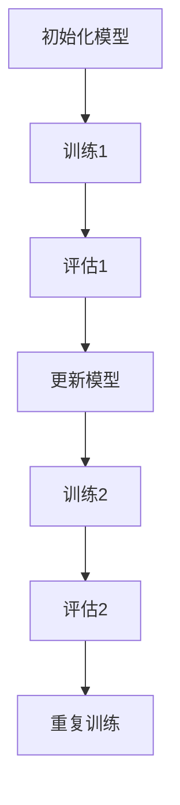

                 

### 2. 元学习算法原理与实现

### 2.1 算法原理

#### 2.1.1 学习曲线图

首先，我们可以使用Mermaid来绘制一个简单的学习曲线图，帮助理解元学习过程中的学习曲线特点。



这个图展示了模型从初始化开始，通过训练和评估不断更新参数的过程。在元学习过程中，这个循环会快速进行，以便模型能够在短时间内适应新任务。

#### 2.1.2 数学模型

元学习算法的数学模型通常涉及梯度下降和优化策略。以下是一个简化的模型，用于描述元学习的基本流程。

```python
# 假设我们有一个初始模型参数 θ
θ = initialize_parameters()

# 对于每个任务 T_i，我们有一个损失函数 L_i(θ; x_i, y_i)
for i in range(number_of_tasks):
    x_i, y_i = sample_task(T_i)
    # 计算梯度
    gradient_i = compute_gradient(θ, x_i, y_i)
    # 更新模型参数
    θ = update_parameters(θ, gradient_i, learning_rate)

# 最终模型参数
final_θ = θ
```

在上面的代码中，`compute_gradient` 函数用于计算模型在当前任务上的梯度，而 `update_parameters` 函数则使用这个梯度来更新模型参数。

#### 2.1.3 元学习算法：MAML

**MAML（Model-Agnostic Meta-Learning）** 是一种经典的元学习算法，它的核心思想是优化模型的初始参数，使得模型能够快速适应新任务。

**算法步骤：**

1. **初始化模型参数 θ。**
2. **对于每个元学习任务 T_i，计算损失 L_i(θ; x_i, y_i)。**
3. **在训练任务 T_i 上计算梯度 ∇θ L_i(θ; x_i, y_i)。**
4. **对梯度进行平均，得到元梯度 ∇θ̂ L = 1/N ∑∇θ L_i(θ; x_i, y_i)。**
5. **使用元梯度更新模型参数：θ̂ = θ - learning_rate * ∇θ̂ L。**
6. **在新任务 T' 上测试模型：L' = L(θ̂; x', y')。**

**MAML的数学模型：**

$$
\theta' = \theta - \eta \frac{1}{|\mathcal{T}|} \sum_{t \in \mathcal{T}} \nabla_\theta L(\theta; x_t, y_t)
$$

其中，θ是模型参数，θ'是更新后的模型参数，η是学习率，L是损失函数，x_t和y_t是训练数据的特征和标签，|T|是元学习任务的数量。

#### 2.1.4 案例说明

假设我们有两个任务：任务A和任务B。任务A的输入特征是三维向量，任务B的输入特征是四维向量。我们使用MAML算法来训练一个模型，使其能够快速适应这两个任务。

1. **初始化模型参数 θ。**
2. **在任务A上训练模型。**
3. **计算任务A上的梯度 ∇θ L(θ; x_a, y_a)。**
4. **在任务B上训练模型。**
5. **计算任务B上的梯度 ∇θ L(θ; x_b, y_b)。**
6. **使用平均梯度更新模型参数：θ̂ = θ - η(∇θ L(θ; x_a, y_a) + ∇θ L(θ; x_b, y_b)) / 2。**
7. **在新任务C上测试模型。**

通过上述步骤，我们可以看到模型是如何通过元学习快速适应新任务的。这个例子展示了MAML的基本原理，它可以通过调整模型参数来适应不同的任务。

### 2.2 常见元学习算法

除了MAML，还有许多其他常见的元学习算法，如Recurrent MAML (rMAML)、Model-Agnostic Meta-Learning for Non-Stationary Environments (MAML-NSE)等。

#### 2.2.1 Recurrent MAML (rMAML)

**rMAML** 是MAML的一个变种，它引入了递归机制，使得模型能够在动态环境中持续学习。

**算法步骤：**

1. **初始化模型参数 θ。**
2. **对于每个元学习任务 T_i，计算损失 L_i(θ; x_i, y_i)。**
3. **在训练任务 T_i 上计算梯度 ∇θ L_i(θ; x_i, y_i)。**
4. **使用递归更新模型参数：θ̂ = θ - η(∇θ L(θ; x_1, y_1) + ∇θ L(θ; x_2, y_2) + ... + ∇θ L(θ; x_i, y_i))。**
5. **在新任务 T' 上测试模型：L' = L(θ̂; x', y')。**

**数学模型：**

$$
\theta' = \theta - \eta \sum_{t=1}^{i} \nabla_\theta L(\theta; x_t, y_t)
$$

#### 2.2.2 Model-Agnostic Meta-Learning for Non-Stationary Environments (MAML-NSE)

**MAML-NSE** 是针对非静止环境设计的元学习算法，它通过动态调整模型参数来适应环境变化。

**算法步骤：**

1. **初始化模型参数 θ。**
2. **对于每个元学习任务 T_i，计算损失 L_i(θ; x_i, y_i)。**
3. **在训练任务 T_i 上计算梯度 ∇θ L_i(θ; x_i, y_i)。**
4. **根据环境变化调整模型参数：θ̂ = θ - η(∇θ L(θ; x_1, y_1) + ∇θ L(θ; x_2, y_2) + ... + ∇θ L(θ; x_i, y_i))。**
5. **在新任务 T' 上测试模型：L' = L(θ̂; x', y')。**

**数学模型：**

$$
\theta' = \theta - \eta \sum_{t=1}^{i} \nabla_\theta L(\theta; x_t, y_t) * f(t)
$$

其中，f(t) 是根据时间 t 的函数，用于动态调整梯度。

### 2.3 元学习算法的应用与挑战

元学习算法在实际应用中展现出巨大的潜力，但同时也面临一些挑战。

#### 2.3.1 应用场景

- **机器人控制**：机器人需要快速适应不同的环境和任务。
- **游戏AI**：游戏中的AI需要不断学习和适应新的游戏策略。
- **推荐系统**：推荐系统需要根据用户的行为习惯和偏好动态调整推荐策略。

#### 2.3.2 挑战

- **数据分布变化**：模型需要适应不同数据分布的变化。
- **计算资源限制**：快速适应新任务可能需要大量的计算资源。
- **模型泛化能力**：如何确保模型在未见过的数据上也能表现良好。

### 2.4 本章小结

本章介绍了元学习算法的原理和实现，包括MAML、rMAML和MAML-NSE等常见算法。通过绘制学习曲线图和数学模型，我们深入理解了元学习的基本流程和原理。在接下来的章节中，我们将进一步探讨元学习算法在具体应用场景中的实现方法和挑战。

