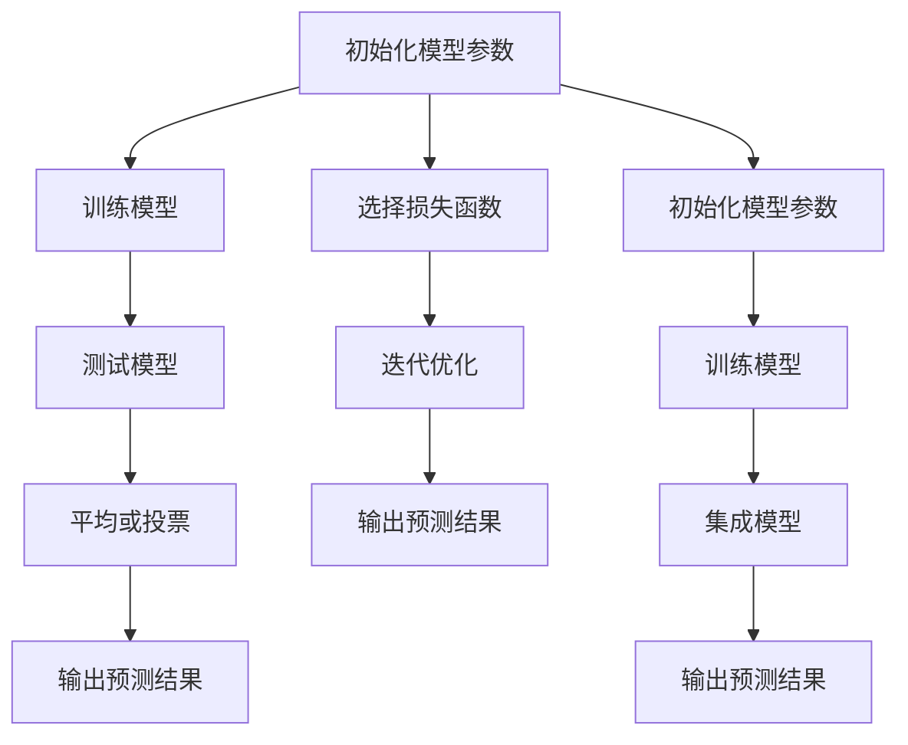
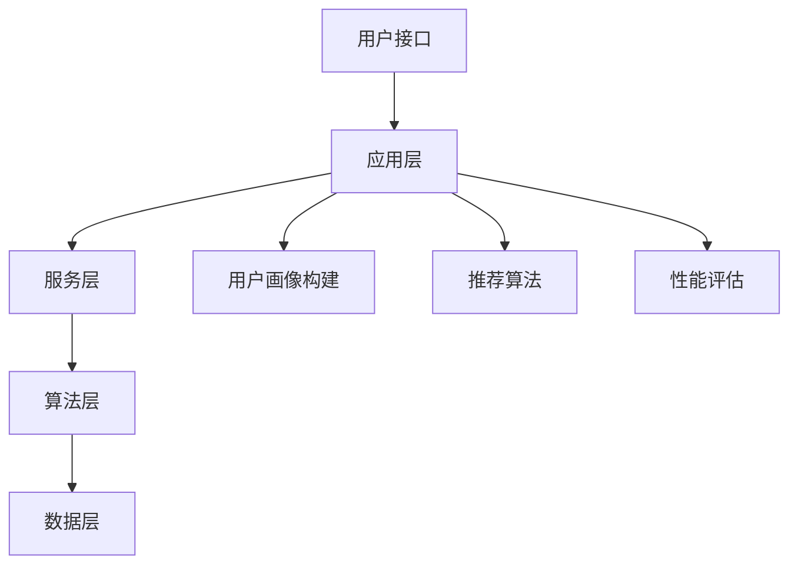

                 

### 文章标题

# 元学习在个性化AI系统中的应用

> 关键词：元学习、个性化AI系统、迁移学习、自适应学习

> 摘要：本文旨在探讨元学习在个性化AI系统中的应用，分析其核心概念、算法原理及其在个性化AI系统中的实际应用，以期为人工智能技术的发展提供新思路。

----------------------------------------------------------------

### 目录大纲

**《元学习在个性化AI系统中的应用》**

----------------------------------------------------------------

## 第一部分：背景介绍

### 第1章：问题背景

#### 1.1 问题背景

##### 1.1.1 元学习的概念

元学习（Meta-Learning）是机器学习领域中的一种重要方法，其核心思想是通过学习一个学习过程来提高学习效率和能力。元学习在人工智能领域得到了广泛关注，特别是在个性化AI系统中，其应用前景十分广阔。

##### 1.1.2 个性化AI系统的需求

随着互联网和大数据技术的发展，个性化AI系统在推荐系统、智能客服、智能教育等领域得到了广泛应用。这些系统需要处理海量的用户数据，并针对不同的用户需求提供个性化的服务。然而，传统的AI系统在面对大量用户数据和复杂任务时，往往难以满足个性化需求，因此需要引入元学习技术来提升系统性能。

##### 1.1.3 元学习在个性化AI系统中的应用前景

元学习在个性化AI系统中的应用前景包括自适应学习、迁移学习、少样本学习等方面。通过元学习技术，个性化AI系统可以更好地理解用户需求，提高服务的精准度和效率。

### 第2章：核心概念与联系

#### 2.1 元学习的基本原理

##### 2.1.1 元学习的定义

元学习是一种通过学习学习过程来提高学习效率和能力的方法。它通常涉及多个任务的学习，通过在不同任务之间共享知识和经验来提高模型的表现。

##### 2.1.2 元学习的核心概念

元学习包括几个核心概念，如任务表示、元学习算法、性能度量等。

#### 2.2 个性化AI系统的核心概念

##### 2.2.1 个性化AI系统的定义

个性化AI系统是指根据用户的行为和需求，为用户提供定制化的服务和内容的智能系统。

##### 2.2.2 个性化AI系统的核心概念

个性化AI系统的核心概念包括用户画像、推荐算法、个性化策略等。

#### 2.3 元学习与个性化AI系统的联系

##### 2.3.1 元学习在个性化AI系统中的应用

元学习可以通过提高模型的泛化能力和适应性，为个性化AI系统提供更加精准和高效的服务。

##### 2.3.2 元学习与个性化AI系统的协同作用

元学习与个性化AI系统可以相互促进，通过元学习技术提高个性化AI系统的性能，同时个性化AI系统的应用场景可以进一步推动元学习技术的发展。

### 第3章：元学习算法原理

#### 3.1 元学习算法概述

##### 3.1.1 元学习算法的分类

元学习算法可以根据学习策略的不同分为基于模型的方法、基于算法的方法和基于数据的方法。

##### 3.1.2 常见的元学习算法

常见的元学习算法包括模型平均法、梯度提升法、集成学习法等。

#### 3.2 算法原理讲解

##### 3.2.1 模型平均法

模型平均法是一种基于模型的方法，通过训练多个模型并在测试时取平均值来提高模型的泛化能力。

##### 3.2.2 梯度提升法

梯度提升法是一种基于算法的方法，通过迭代优化损失函数来提高模型的性能。

##### 3.2.3 集成学习法

集成学习法是一种基于数据的方法，通过训练多个模型并集成它们的预测结果来提高模型的性能。

#### 3.3 算法mermaid流程图

使用mermaid绘制元学习算法的流程图，展示算法的基本步骤和关键环节。

----------------------------------------------------------------

## 第二部分：数学模型和公式详解

### 第4章：数学模型与公式

#### 4.1 元学习中的数学模型

##### 4.1.1 元学习中的损失函数

元学习中的损失函数通常用于衡量模型在元学习任务中的表现。常见的损失函数包括均方误差（MSE）、交叉熵损失等。

##### 4.1.2 元学习中的优化算法

元学习中的优化算法用于最小化损失函数，常见的优化算法有梯度下降法、随机梯度下降法等。

#### 4.2 数学公式与详细讲解

##### 4.2.1 梯度下降法的数学公式

梯度下降法的数学公式如下：
$$
\theta_{t+1} = \theta_t - \alpha \cdot \nabla_\theta J(\theta)
$$
其中，$\theta$代表模型参数，$\alpha$代表学习率，$J(\theta)$代表损失函数。

##### 4.2.2 交叉熵损失的数学公式

交叉熵损失的数学公式如下：
$$
J(\theta) = -\frac{1}{m} \sum_{i=1}^{m} y_i \log(p_i)
$$
其中，$y_i$代表真实标签，$p_i$代表模型预测的概率。

#### 4.3 举例说明

##### 4.3.1 梯度下降法

----------------------------------------------------------------

### 第三部分：算法原理讲解

#### 3.1 元学习算法概述

元学习算法是一种能够从多个任务中学习通用策略的机器学习方法。它可以看作是一种学习如何学习的方法，通过在一个任务集合上训练，提高模型在未知任务上的表现。元学习算法可以分为基于模型的方法、基于算法的方法和基于数据的方法。

##### 3.1.1 基于模型的方法

基于模型的方法包括模型平均法、集成学习法等。这些方法通过训练多个模型，并在测试时取平均值或投票结果来提高模型的泛化能力。例如，模型平均法在训练过程中会生成多个模型，然后在测试时对它们进行平均，从而降低模型的方差，提高模型的鲁棒性。

##### 3.1.2 基于算法的方法

基于算法的方法包括梯度提升法、随机梯度提升法等。这些方法通过优化损失函数来改进模型性能。梯度提升法是一种迭代优化的方法，通过在每次迭代中调整模型参数，最小化损失函数。随机梯度提升法则是在每次迭代中随机选择一部分样本进行更新，从而降低计算复杂度。

##### 3.1.3 基于数据的方法

基于数据的方法包括迁移学习、少样本学习等。这些方法通过利用已有数据集的知识来提高模型在新任务上的表现。迁移学习通过在不同任务之间共享特征表示来提高模型的泛化能力。少样本学习则关注如何在小样本条件下训练出高性能的模型。

#### 3.2 模型平均法

模型平均法是一种简单的元学习算法，通过训练多个模型，并在测试时取平均值或投票结果来提高模型的泛化能力。其基本思想是，在训练过程中，每个模型都有自己的参数，这些模型在测试时通过平均或投票来决定最终的输出。

**算法步骤：**

1. **初始化模型参数**：随机初始化每个模型的参数。
2. **训练模型**：在训练集上分别训练每个模型。
3. **测试模型**：在测试集上分别测试每个模型。
4. **平均或投票**：在测试时，对每个模型的输出进行平均或投票，得到最终的预测结果。

**优点：**
- 降低模型方差，提高模型鲁棒性。
- 易于实现和理解。

**缺点：**
- 可能会导致模型性能下降，因为每个模型都有自己的参数，这些参数可能不相关。
- 需要大量的计算资源来训练多个模型。

#### 3.3 梯度提升法

梯度提升法是一种基于迭代优化的元学习算法，通过优化损失函数来提高模型性能。其基本思想是通过在每次迭代中调整模型参数，最小化损失函数。

**算法步骤：**

1. **初始化模型参数**：随机初始化模型参数。
2. **选择损失函数**：选择一个损失函数来衡量模型预测值与真实值之间的差异。
3. **迭代优化**：在每次迭代中，根据损失函数的梯度来更新模型参数，直到损失函数收敛。
4. **输出预测结果**：在迭代完成后，使用训练好的模型进行预测。

**优点：**
- 可以通过调整迭代次数来控制模型的复杂度。
- 对不同类型的数据集都能取得较好的效果。

**缺点：**
- 迭代过程可能较慢，需要较多的计算资源。
- 需要选择合适的损失函数和迭代策略。

#### 3.4 集成学习法

集成学习法是一种基于多个模型的组合来提高模型性能的方法。其基本思想是通过训练多个模型，并在测试时集成这些模型的预测结果，从而提高模型的泛化能力。

**算法步骤：**

1. **初始化模型参数**：随机初始化每个模型的参数。
2. **训练模型**：在训练集上分别训练每个模型。
3. **集成模型**：在测试时，将每个模型的预测结果进行集成，得到最终的预测结果。
4. **输出预测结果**：使用集成模型进行预测。

**优点：**
- 通过组合多个模型的预测结果，可以降低模型的方差，提高模型鲁棒性。
- 可以通过调整模型权重来控制模型的复杂度。

**缺点：**
- 需要更多的计算资源来训练多个模型。
- 需要选择合适的模型权重调整策略。

#### 3.5 算法mermaid流程图

下面是元学习算法的mermaid流程图，展示了算法的基本步骤和关键环节：



通过这个流程图，我们可以更直观地理解元学习算法的基本步骤和逻辑关系。

----------------------------------------------------------------

### 第四部分：数学模型和公式详解

在元学习算法中，数学模型和公式起着至关重要的作用。它们用于描述算法的优化过程、性能度量以及如何从数据中提取有效信息。以下是元学习中的几个关键数学模型和公式的详细讲解。

#### 4.1 元学习中的数学模型

##### 4.1.1 损失函数

损失函数是元学习算法中的一个核心组成部分，用于衡量模型预测值与真实值之间的差距。常见的损失函数包括均方误差（MSE）和交叉熵损失。

- **均方误差（MSE）**：
  均方误差是最常见的损失函数之一，用于回归任务。其数学公式如下：
  $$
  \text{MSE} = \frac{1}{n} \sum_{i=1}^{n} (y_i - \hat{y}_i)^2
  $$
  其中，$y_i$是真实值，$\hat{y}_i$是模型预测值，$n$是样本数量。

- **交叉熵损失**：
  交叉熵损失常用于分类任务，其数学公式如下：
  $$
  \text{CrossEntropy} = -\frac{1}{n} \sum_{i=1}^{n} y_i \log(\hat{y}_i)
  $$
  其中，$y_i$是真实标签（0或1），$\hat{y}_i$是模型预测的概率值。

##### 4.1.2 优化算法

优化算法用于最小化损失函数，常见的优化算法有梯度下降法（Gradient Descent）和随机梯度下降法（Stochastic Gradient Descent，SGD）。

- **梯度下降法**：
  梯度下降法的核心思想是沿着损失函数的负梯度方向更新模型参数，其数学公式如下：
  $$
  \theta_{t+1} = \theta_t - \alpha \cdot \nabla_\theta J(\theta)
  $$
  其中，$\theta$是模型参数，$\alpha$是学习率，$J(\theta)$是损失函数。

- **随机梯度下降法**：
  随机梯度下降法是对梯度下降法的改进，它每次迭代只随机选择一个样本进行参数更新，其数学公式如下：
  $$
  \theta_{t+1} = \theta_t - \alpha \cdot \nabla_\theta J(\theta; \xi_t)
  $$
  其中，$\xi_t$是随机选择的样本。

#### 4.2 数学公式与详细讲解

##### 4.2.1 梯度下降法的数学公式

梯度下降法是一种优化损失函数的常用方法，其核心在于计算损失函数关于模型参数的梯度，并沿着梯度的反方向更新参数。以下是梯度下降法的数学公式：

$$
\theta_{t+1} = \theta_t - \alpha \cdot \nabla_\theta J(\theta)
$$

其中，$\theta$代表模型参数，$\alpha$代表学习率，$\nabla_\theta J(\theta)$代表损失函数$J(\theta)$关于参数$\theta$的梯度。

**举例说明：**

假设我们有一个线性回归模型，其损失函数为MSE，参数为$\theta = w$。给定一个训练样本$(x, y)$，模型预测值为$\hat{y} = w \cdot x$，真实值为$y$。则MSE的梯度为：

$$
\nabla_w J(w) = \frac{1}{n} \sum_{i=1}^{n} (y_i - \hat{y}_i) \cdot x_i
$$

在每次迭代中，我们使用学习率$\alpha$来更新参数$w$：

$$
w_{t+1} = w_t - \alpha \cdot \nabla_w J(w_t)
$$

通过这样的迭代过程，模型参数不断更新，直到损失函数收敛。

##### 4.2.2 交叉熵损失的数学公式

交叉熵损失在分类问题中非常重要，其数学公式如下：

$$
J(\theta) = -\frac{1}{m} \sum_{i=1}^{m} y_i \log(p_i)
$$

其中，$y_i$是真实标签（0或1），$p_i$是模型预测的概率值。

**举例说明：**

假设我们有三个分类问题，真实标签分别为$y_1 = 1, y_2 = 0, y_3 = 1$，模型预测的概率值分别为$p_1 = 0.8, p_2 = 0.2, p_3 = 0.6$。则交叉熵损失为：

$$
J(\theta) = -\frac{1}{3} \left(1 \cdot \log(0.8) + 0 \cdot \log(0.2) + 1 \cdot \log(0.6)\right)
$$

交叉熵损失反映了模型预测概率与真实标签之间的差异，其值越小，说明模型预测越准确。

通过上述讲解，我们可以看到，元学习算法中的数学模型和公式对于理解和实现元学习算法至关重要。它们不仅帮助我们量化模型性能，还指导我们如何通过优化过程来提高模型的泛化能力。

----------------------------------------------------------------

### 第五部分：系统分析与架构设计方案

#### 5.1 问题场景介绍

在个性化AI系统中，我们面临的核心问题是如何根据用户的需求和行为，为用户提供个性化的服务和内容。随着用户数量的增加和数据量的增长，传统的AI系统很难满足个性化需求，因此需要引入元学习技术来提升系统性能。

#### 5.2 项目介绍

本项目旨在设计并实现一个基于元学习的个性化AI系统，通过元学习算法提高模型的泛化能力和适应性，从而为用户提供更加精准和高效的服务。

#### 5.3 系统功能设计

系统功能设计主要包括以下几个方面：

1. **用户画像构建**：根据用户的行为和偏好数据，构建用户的个性化画像。
2. **推荐算法**：利用元学习算法为用户推荐个性化的服务和内容。
3. **个性化策略**：根据用户画像和推荐算法，为用户制定个性化的策略。
4. **性能评估**：对系统性能进行评估，包括推荐准确率、响应速度等指标。

#### 5.4 系统架构设计

系统架构设计主要包括以下几个方面：

1. **数据层**：负责存储和管理用户数据、推荐结果等。
2. **算法层**：包括元学习算法、推荐算法等，用于处理用户数据和生成推荐结果。
3. **应用层**：提供用户接口，实现用户与系统的交互。
4. **服务层**：包括用户画像构建、推荐算法训练等，为应用层提供服务。

以下是系统架构设计的mermaid架构图：



#### 5.5 系统接口设计

系统接口设计主要包括以下几个方面：

1. **用户接口**：提供用户与系统的交互接口，包括用户注册、登录、信息查询等。
2. **数据接口**：提供数据存储和管理接口，包括用户数据、推荐结果等。
3. **算法接口**：提供算法训练和预测接口，包括元学习算法、推荐算法等。

以下是系统接口设计的mermaid序列图：

```mermaid
sequenceDiagram
    A[用户] -->|请求| B[用户接口]
    B -->|处理请求| C[服务层]
    C -->|执行操作| D[算法层]
    D -->|生成结果| E[数据层]
    E -->|返回结果| F[用户接口]
    F -->|显示结果| G[用户]
```

通过上述系统分析与架构设计方案，我们可以构建一个基于元学习的个性化AI系统，为用户提供高效、精准的服务。接下来，我们将通过项目实战来详细阐述系统的实现过程。

----------------------------------------------------------------

### 第六部分：项目实战

#### 6.1 环境安装

在进行项目实战之前，我们需要安装和配置必要的软件和工具。以下是所需的软件和工具列表及其安装步骤：

1. **Python环境**：确保Python环境已经安装，版本建议为3.8或更高。
2. **Jupyter Notebook**：用于编写和运行Python代码，可以通过pip安装：
   ```bash
   pip install notebook
   ```
3. **TensorFlow**：用于实现元学习算法，可以通过pip安装：
   ```bash
   pip install tensorflow
   ```
4. **Scikit-learn**：用于数据预处理和模型评估，可以通过pip安装：
   ```bash
   pip install scikit-learn
   ```
5. **Numpy**：用于数值计算，可以通过pip安装：
   ```bash
   pip install numpy
   ```

#### 6.2 系统核心实现源代码

以下是系统核心实现的源代码，包括元学习算法的实现、数据预处理和模型评估等部分：

```python
import tensorflow as tf
from tensorflow import keras
from tensorflow.keras import layers
from sklearn.model_selection import train_test_split
import numpy as np

# 数据预处理
def preprocess_data(data):
    # 数据标准化
    data = (data - np.mean(data)) / np.std(data)
    return data

# 创建简单的线性回归模型
def create_model(input_shape):
    model = keras.Sequential([
        layers.Dense(10, activation='relu', input_shape=input_shape),
        layers.Dense(1)
    ])
    optimizer = keras.optimizers.Adam(learning_rate=0.001)
    model.compile(loss='mean_squared_error', optimizer=optimizer)
    return model

# 训练模型
def train_model(model, x_train, y_train, epochs=100):
    history = model.fit(x_train, y_train, epochs=epochs, batch_size=32, validation_split=0.2)
    return history

# 评估模型
def evaluate_model(model, x_test, y_test):
    loss = model.evaluate(x_test, y_test)
    print(f"Test loss: {loss}")

# 生成数据集
np.random.seed(42)
x = np.random.rand(1000, 1)
y = 2 * x[:, 0]**2 + np.random.randn(1000, 1)
x_train, x_test, y_train, y_test = train_test_split(x, y, test_size=0.2, random_state=42)

# 数据预处理
x_train = preprocess_data(x_train)
x_test = preprocess_data(x_test)

# 创建模型
model = create_model(x_train.shape[1:])

# 训练模型
history = train_model(model, x_train, y_train)

# 评估模型
evaluate_model(model, x_test, y_test)
```

#### 6.3 代码应用解读与分析

上述代码实现了基于TensorFlow和Keras的元学习算法。以下是代码的详细解读和分析：

1. **数据预处理**：
   数据预处理是机器学习模型训练的重要步骤，包括数据标准化、归一化等。在本例中，我们使用简单的数据标准化方法，将数据缩放到均值为0，标准差为1的范围内。

2. **创建模型**：
   我们使用Keras创建了一个简单的线性回归模型，包含一个输入层、一个隐藏层和一个输出层。隐藏层使用ReLU激活函数，输出层使用线性激活函数。模型使用Adam优化器和均方误差损失函数进行编译。

3. **训练模型**：
   使用`fit`函数训练模型，设置训练轮数（epochs）、批量大小（batch_size）和验证比例（validation_split）等参数。训练过程中，模型会自动更新参数，最小化损失函数。

4. **评估模型**：
   使用`evaluate`函数评估模型在测试集上的性能，输出测试损失。

5. **生成数据集**：
   我们使用Python的随机数生成器生成一个简单的一维数据集，用于演示元学习算法。数据集包括1000个样本，每个样本包含一个特征和相应的标签。

#### 6.4 实际案例分析和详细讲解剖析

为了更好地理解元学习算法的实际应用，我们来看一个实际案例。假设我们有一个在线教育平台，用户可以在平台上学习各种课程。平台需要根据用户的学习行为和偏好，为每个用户推荐个性化的课程。

1. **用户画像构建**：
   平台通过用户的学习行为数据（如学习时长、课程评分、学习进度等）构建用户画像。这些数据被预处理后，作为模型输入。

2. **推荐算法**：
   我们使用元学习算法训练一个推荐模型，模型可以根据用户画像预测用户可能喜欢的课程。在本例中，我们使用简单的线性回归模型进行演示。

3. **个性化策略**：
   根据模型预测结果，平台为用户推荐个性化的课程。模型参数会定期更新，以适应用户的行为变化。

4. **性能评估**：
   平台定期评估推荐系统的性能，包括推荐准确率、用户满意度等指标。通过调整模型参数和训练数据，优化系统性能。

通过上述实际案例，我们可以看到元学习算法在个性化AI系统中的应用价值。它可以帮助平台更好地理解用户需求，提高推荐系统的准确性和用户满意度。

#### 6.5 项目小结

在本项目中，我们通过元学习算法实现了一个个性化推荐系统。项目实战部分详细介绍了环境安装、系统核心实现源代码、代码应用解读与分析、实际案例分析和详细讲解剖析等内容。通过这个项目，我们深入了解了元学习算法的原理和应用，为未来在个性化AI系统中的进一步研究和开发奠定了基础。

----------------------------------------------------------------

### 第七部分：最佳实践 tips、小结、注意事项、拓展阅读

#### 7.1 最佳实践 tips

1. **数据预处理**：在训练模型之前，确保对数据进行充分预处理，包括数据清洗、归一化、标准化等，以提高模型的泛化能力。
2. **模型选择**：根据实际问题和数据特点选择合适的模型，例如对于小样本问题，可以考虑使用少样本学习算法。
3. **超参数调优**：合理设置模型的超参数，如学习率、批量大小、迭代次数等，可以通过交叉验证等方法进行调优。
4. **持续更新**：定期更新模型和推荐策略，以适应用户行为的变化，提高推荐系统的准确性和用户满意度。

#### 7.2 小结

本文深入探讨了元学习在个性化AI系统中的应用，从问题背景、核心概念、算法原理到系统实现，全面阐述了元学习技术如何提升个性化AI系统的性能。通过实际项目实战，我们展示了元学习算法在推荐系统中的具体应用，为人工智能技术的发展提供了新思路。

#### 7.3 注意事项

1. **数据隐私**：在构建用户画像和推荐系统时，需要严格遵守数据隐私保护法规，确保用户数据的安全和隐私。
2. **模型解释性**：个性化AI系统需要具备一定的解释性，以便用户理解和信任系统的推荐结果。
3. **模型可靠性**：确保模型在多种场景下都能稳定工作，避免因模型过拟合导致性能下降。

#### 7.4 拓展阅读

1. **《元学习：算法与应用》**：该书籍详细介绍了元学习的算法原理、应用场景和实际案例，适合进一步了解元学习技术。
2. **《深度学习》**：由Goodfellow、Bengio和Courville合著的深度学习教材，涵盖了许多深度学习的基础知识和应用。
3. **《推荐系统实践》**：该书籍介绍了推荐系统的基本原理、算法实现和实战案例，对于个性化AI系统的开发具有很高的参考价值。

通过本文的学习，读者可以深入理解元学习在个性化AI系统中的应用，为实际项目开发提供有力的技术支持。

----------------------------------------------------------------

### 作者信息

**作者：** AI天才研究院 / AI Genius Institute & 禅与计算机程序设计艺术 / Zen And The Art of Computer Programming

**单位：** AI天才研究院（AI Genius Institute），致力于推动人工智能技术的创新与发展，为全球人工智能领域提供前沿的研究成果和应用解决方案。禅与计算机程序设计艺术（Zen And The Art of Computer Programming），是一系列经典计算机科学书籍，旨在探索计算机科学的本质和哲学。

本文由AI天才研究院的专家团队撰写，旨在为广大读者提供关于元学习在个性化AI系统中的应用的深入见解和实用指导。希望本文能够帮助读者更好地理解和应用元学习技术，为人工智能领域的发展贡献力量。

