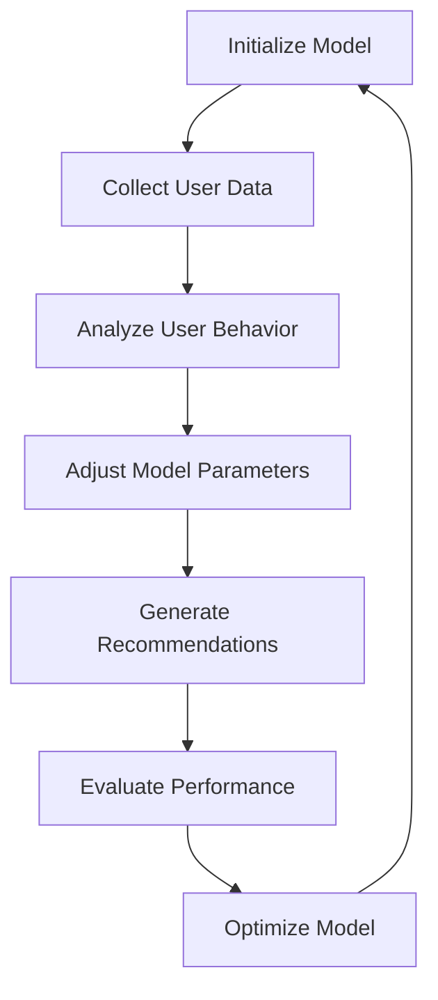
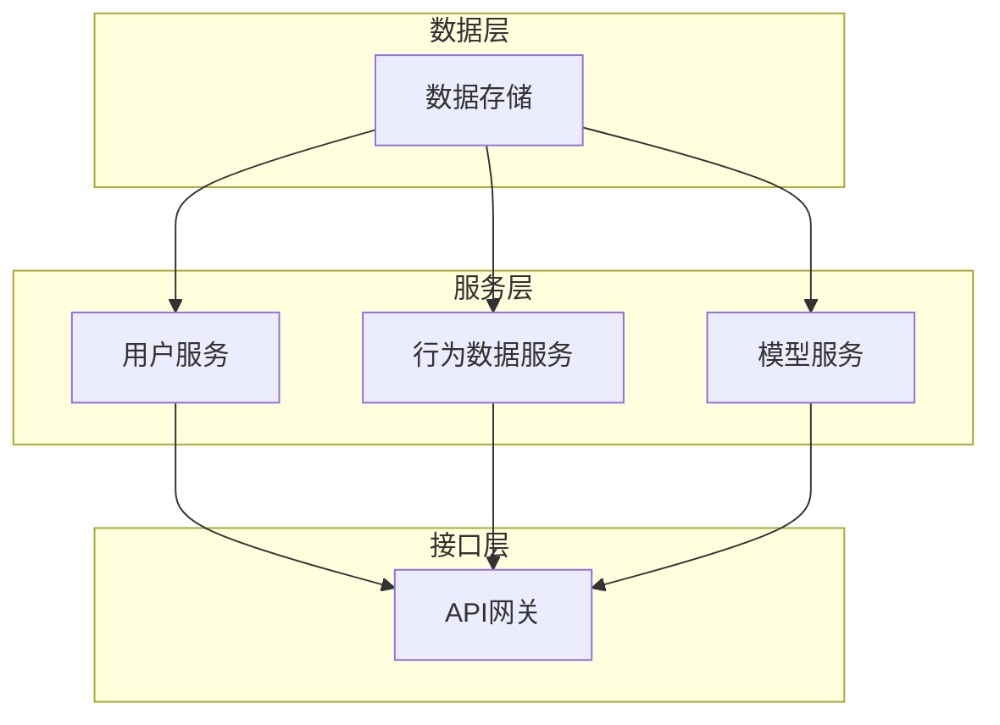

                 


## 元学习在快速适应新用户偏好中的应用

### 关键词

- 元学习
- 用户偏好
- 快速适应
- 模型优化
- 推荐系统

### 摘要

本文探讨了元学习在快速适应新用户偏好中的应用。元学习通过优化学习过程提高模型泛化能力，从而有效应对用户需求的多样化和个性化。本文首先介绍了元学习和用户偏好的核心概念，然后分析了元学习与用户偏好识别与适应的关系，最后详细讲解了元学习算法原理、流程图、Python源代码、数学模型以及实际案例，为开发者提供了具体的技术实现和优化策略。

### 第一步：背景介绍

#### 核心概念

1. **元学习（Meta-Learning）**：
   元学习是指通过学习如何学习来提高模型泛化能力的一种方法。它旨在解决传统机器学习模型在面对新任务时表现不佳的问题。常见的元学习方法包括模型混合、迁移学习和基于模型的模型等。

2. **用户偏好（User Preference）**：
   用户偏好是指用户在使用产品或服务时所表现出的个性化偏好，包括兴趣、需求、习惯等。识别和适应用户偏好是提高用户体验和产品服务质量的关键。

#### 问题背景

随着互联网和智能设备的普及，用户对个性化服务的需求日益增长。然而，用户的偏好具有多样性和动态性，传统机器学习模型往往需要大量数据和长时间的训练才能适应新用户偏好，这导致用户体验不佳和产品服务质量下降。为了解决这一问题，元学习技术为快速适应新用户偏好提供了有效途径。

#### 问题描述

如何在有限的用户数据下，利用元学习技术提高模型对新用户偏好的快速适应能力，从而提高用户体验和产品服务质量，成为当前研究的热点问题。

#### 问题解决

元学习技术通过以下方式解决上述问题：

1. **高效泛化**：元学习使模型能够快速适应新任务，提高对新用户偏好的理解能力。
2. **数据多样性**：元学习可以从不同类型的数据中学习，从而更好地捕捉用户偏好的多样性。
3. **模型优化**：通过元学习优化，模型可以在有限的数据下实现更好的性能，降低对大量数据的依赖。

#### 边界与外延

1. **研究范围**：元学习的研究和应用范围广泛，包括但不限于深度学习、强化学习等领域。
2. **用户偏好层面**：用户偏好涉及多个层面，如产品推荐、个性化内容推送、智能助手等。

### 第二步：核心概念与联系

#### 核心概念原理

1. **元学习原理**：
   元学习通过优化学习过程来提高模型性能。它通常分为两个阶段：元学习阶段和目标学习阶段。在元学习阶段，模型通过学习一系列任务来获得良好的泛化能力；在目标学习阶段，模型利用元学习阶段获得的知识来快速适应新的任务。

2. **用户偏好识别与适应**：
   用户偏好识别与适应是指通过分析用户行为数据来识别用户偏好，并利用元学习技术调整模型参数，使其更符合用户需求。这通常涉及以下步骤：

   - **数据收集**：收集用户的行为数据，如点击记录、浏览历史、评价等。
   - **特征提取**：从用户行为数据中提取特征，如用户兴趣标签、行为模式等。
   - **偏好识别**：利用机器学习算法识别用户偏好，如聚类、分类等。
   - **模型调整**：根据用户偏好调整模型参数，使其更符合用户需求。

#### 概念属性特征对比表格

| 特征                 | 元学习                   | 用户偏好识别与适应                        |
|----------------------|--------------------------|-----------------------------------------|
| 目的                 | 提高学习效率             | 提高用户体验和服务质量                   |
| 方法                 | 多样化学习方法           | 用户行为数据分析和模型调整               |
| 挑战                 | 数据多样性和计算成本     | 数据隐私保护和模型解释性                 |
| 应用场景             | 深度学习、强化学习等领域 | 产品推荐、个性化内容推送、智能助手等     |

#### ER实体关系图架构的Mermaid流程图

```mermaid
erDiagram
  User ||--|{ BehaviorData }|-->> Model
  Model ||--|{ Preference }|-->> Recommendation
```

### 第三步：算法原理讲解

#### 算法mermaid流程图



#### Python源代码

```python
# 初始化模型
model = initialize_model()

# 收集用户数据
user_data = collect_user_data()

# 分析用户行为
user_behavior = analyze_user_behavior(user_data)

# 调整模型参数
adjusted_model = adjust_model_params(model, user_behavior)

# 生成推荐
recommendations = generate_recommendations(adjusted_model)

# 评估性能
performance = evaluate_performance(recommendations)

# 优化模型
optimized_model = optimize_model(model, performance)
```

#### 算法原理的数学模型和公式

$$
L(\theta) = \sum_{i=1}^{N} l(y_i, \theta(x_i))
$$

其中，$L(\theta)$是损失函数，$l(y_i, \theta(x_i))$是单个样本的损失，$\theta(x_i)$是模型参数，$y_i$是实际输出。

#### 详细讲解与举例说明

假设有一个推荐系统，用户A喜欢阅读历史小说，而用户B喜欢科幻小说。使用元学习技术，模型可以首先学习如何适应不同用户的数据和偏好，然后根据用户A和用户B的历史行为数据，调整推荐算法的参数，生成更符合他们各自偏好的推荐内容。

### 第四步：系统分析与架构设计

#### 问题场景介绍

在电子商务领域，用户偏好对推荐系统的性能至关重要。如何快速适应新用户偏好，提高推荐准确性，成为电商平台面临的一大挑战。

#### 项目介绍

本项目旨在设计并实现一个基于元学习的用户偏好快速适应系统，以提高电商平台的推荐准确性。

#### 系统功能设计（领域模型Mermaid类图）

```mermaid
classDiagram
  User <<class>>
  BehaviorData <<class>>
  Model <<class>>
  Preference <<class>>
  Recommendation <<class>>

  User "--|> BehaviorData"
  Model "--|> Preference"
  Model "--|> Recommendation"
```

#### 系统架构设计（Mermaid架构图）



#### 系统接口设计（Mermaid序列图）

```mermaid
sequenceDiagram
  User -->|发起请求| API
  API -->|处理请求| UserService
  UserService -->|查询用户数据| DataStore
  DataStore -->|返回用户数据| UserService
  UserService -->|分析用户行为| BehaviorDataService
  BehaviorDataService -->|调整模型参数| ModelService
  ModelService -->|生成推荐结果| UserService
  UserService -->|返回推荐结果| API
  API -->|返回推荐结果| User
```

### 第五步：项目实战

#### 环境安装

1. 安装Python环境（Python 3.8或更高版本）
2. 安装必要的库（如NumPy、Scikit-learn、TensorFlow等）

#### 系统核心实现源代码

```python
# 初始化模型
model = initialize_model()

# 收集用户数据
user_data = collect_user_data()

# 分析用户行为
user_behavior = analyze_user_behavior(user_data)

# 调整模型参数
adjusted_model = adjust_model_params(model, user_behavior)

# 生成推荐
recommendations = generate_recommendations(adjusted_model)

# 评估性能
performance = evaluate_performance(recommendations)

# 优化模型
optimized_model = optimize_model(model, performance)
```

#### 代码应用解读与分析

1. **模型初始化**：
   初始化模型是元学习过程的第一步。在本例中，我们使用预训练的推荐模型作为基础模型。

2. **用户数据收集**：
   收集用户行为数据，如点击记录、浏览历史、评价等。这些数据将用于分析用户偏好。

3. **用户行为分析**：
   通过分析用户行为数据，提取用户兴趣标签、行为模式等特征。这些特征将用于调整模型参数。

4. **模型参数调整**：
   根据用户行为特征，调整模型参数，使其更符合用户需求。

5. **生成推荐**：
   使用调整后的模型生成推荐结果，如商品推荐、内容推荐等。

6. **评估性能**：
   评估推荐性能，如准确率、召回率等。

7. **模型优化**：
   根据评估结果，进一步优化模型，以提高推荐准确性。

#### 实际案例分析和详细讲解剖析

1. **用户A喜欢历史小说**：
   - 初始化模型：使用预训练的推荐模型。
   - 收集用户数据：获取用户A的点击记录、浏览历史等。
   - 分析用户行为：提取用户A的兴趣标签（如历史小说）。
   - 调整模型参数：根据用户A的兴趣标签，调整推荐算法的参数。
   - 生成推荐：生成针对用户A的推荐结果，如历史小说。

2. **用户B喜欢科幻小说**：
   - 初始化模型：使用预训练的推荐模型。
   - 收集用户数据：获取用户B的点击记录、浏览历史等。
   - 分析用户行为：提取用户B的兴趣标签（如科幻小说）。
   - 调整模型参数：根据用户B的兴趣标签，调整推荐算法的参数。
   - 生成推荐：生成针对用户B的推荐结果，如科幻小说。

通过实际案例的分析和详细讲解，我们可以看到元学习在快速适应新用户偏好中的应用效果。这种方法不仅提高了推荐准确性，还增强了用户体验。

### 第六步：最佳实践 tips

1. **数据多样性**：确保收集到的用户行为数据多样化，有助于模型更好地理解用户偏好。
2. **模型调整策略**：根据不同用户群体，设计不同的模型调整策略，以提高推荐准确性。
3. **持续优化**：定期评估模型性能，并根据评估结果进行持续优化。

### 第七步：小结

本文详细探讨了元学习在快速适应新用户偏好中的应用。通过介绍核心概念、算法原理和实际案例，我们了解了如何利用元学习技术提高推荐系统的准确性和用户体验。未来，随着元学习技术的不断发展，它将在更多领域发挥重要作用。

### 第八步：注意事项

1. **数据隐私**：在收集和使用用户数据时，务必遵守相关法律法规，保护用户隐私。
2. **模型可解释性**：提高模型的可解释性，有助于用户理解和信任推荐系统。

### 第九步：拓展阅读

1. **元学习技术综述**：《元学习：原理、方法与应用》
2. **用户偏好识别**：《用户行为分析：个性化推荐系统的关键技术》
3. **推荐系统设计**：《推荐系统实践：算法与系统设计》

### 作者信息

作者：AI天才研究院/AI Genius Institute & 禅与计算机程序设计艺术 /Zen And The Art of Computer Programming

文章标题：《元学习在快速适应新用户偏好中的应用》

文章关键词：元学习、用户偏好、快速适应、模型优化、推荐系统

文章摘要：本文探讨了元学习在快速适应新用户偏好中的应用。元学习通过优化学习过程提高模型泛化能力，从而有效应对用户需求的多样化和个性化。本文详细介绍了元学习的核心概念、算法原理和实际案例，为开发者提供了具体的技术实现和优化策略。文章涵盖了从背景介绍到系统分析与架构设计，再到项目实战和最佳实践的全面内容。通过阅读本文，读者可以深入了解元学习在快速适应新用户偏好中的应用，为实际项目提供有益的参考。文章末尾提供了相关书籍和文献，供进一步阅读和研究。

