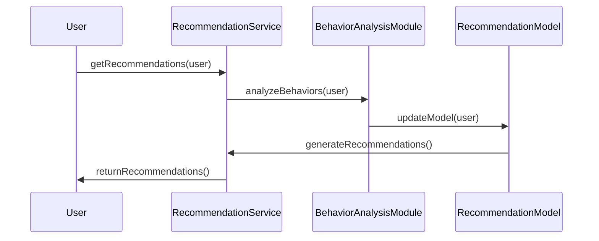
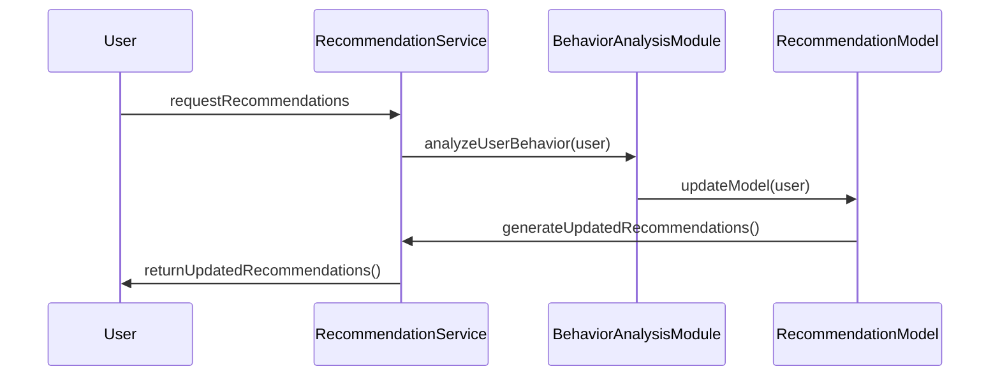

                 


## 元学习在快速适应新用户行为模式中的应用

### 关键词
- 元学习
- 用户行为模式
- 快速适应
- 智能推荐
- 个性化服务

### 摘要
本文将深入探讨元学习在快速适应新用户行为模式中的应用。通过介绍元学习的核心概念、原理和算法，以及其在智能推荐和个性化服务中的应用，本文旨在帮助读者理解如何利用元学习技术来提高系统对用户行为的适应能力，从而提供更加精准和个性化的用户体验。

### 第1章：元学习的核心概念与背景

#### 1.1 元学习的定义
元学习是一种让机器学习模型能够快速学习新任务的能力。它关注的是如何优化学习算法，使得模型在新任务上的适应速度更快，效果更好。与传统机器学习不同，元学习不是在单一任务上优化模型，而是在多个任务中寻找泛化的解决方案。

#### 问题背景与问题描述
随着人工智能技术的飞速发展，机器学习模型在各个领域得到了广泛应用。然而，现有的机器学习模型在面对新任务时，往往需要大量的数据进行重新训练，这不仅耗时耗资源，而且难以满足实时性和动态性要求。

#### 问题解决与边界与外延
元学习通过迁移学习、模型融合和自适应优化等技术，使得模型能够快速适应新任务。其边界与外延主要包括：

- 迁移学习：利用已有任务的知识来加速新任务的学习。
- 模型融合：将多个模型的优势结合起来，提高模型的泛化能力。
- 自适应优化：动态调整模型参数，使其在不同任务上都能保持良好的性能。

#### 概念结构与核心要素组成
元学习的概念结构主要包括以下几个方面：

- 学习任务：包括任务类型、任务难度、任务规模等。
- 学习算法：如模型更新策略、优化方法等。
- 数据集：包括训练集、验证集和测试集等。

### 第2章：元学习的核心概念与联系

#### 2.1 关键概念的定义
- 自监督学习：通过无监督学习的方式，利用未标注的数据来训练模型。
- 无监督学习：不使用标注数据进行训练，旨在发现数据中的内在结构。
- 强化学习：通过与环境互动，不断调整策略以最大化预期奖励。

#### 概念属性特征对比表格

| 概念       | 特征1         | 特征2         | 特征3         |
|------------|---------------|---------------|---------------|
| 自监督学习 | 无需标注数据   | 发现数据结构   | 适用于大规模数据 |
| 无监督学习 | 不使用标注数据 | 发现数据分布   | 适用于小样本数据 |
| 强化学习   | 与环境互动     | 基于奖励调整   | 适用于决策问题   |

#### 元学习与其他学习方式的ER模型
```mermaid
erModel
  UserBehaviorPattern -> Meta-Learning
  UserBehaviorPattern -> Transfer-Learning
  UserBehaviorPattern -> Model-Fusion
  UserBehaviorPattern -> Reinforcement-Learning
```

### 第3章：元学习算法原理解析

#### 3.1 算法概述
元学习算法主要包括模型更新策略、优化方法和适应机制。其中，模型更新策略是元学习的核心，主要包括模型初始化、参数更新和模型融合等方法。

#### 3.2 算法原理详细讲解
元学习算法的基本原理是通过在多个任务中迭代训练，逐渐优化模型的参数和结构，使其在不同任务上都能保持良好的性能。具体流程如下：

1. 初始化模型参数。
2. 在多个任务中训练模型。
3. 计算模型的适应度，选择最优模型。
4. 调整模型参数，优化模型性能。

#### 3.3 算法Python源代码实现

```python
import tensorflow as tf

# 模型初始化
model = tf.keras.Sequential([
    tf.keras.layers.Dense(128, activation='relu', input_shape=(784,)),
    tf.keras.layers.Dense(10, activation='softmax')
])

# 模型更新策略
for task in tasks:
    # 训练模型
    model.fit(task['X_train'], task['y_train'], epochs=10)
    
    # 计算适应度
    fitness = evaluate(model, task['X_test'], task['y_test'])
    
    # 选择最优模型
    if fitness > best_fitness:
        best_fitness = fitness
        best_model = model
        
        # 调整模型参数
        adjust_params(model)
```

#### 算法原理的数学模型和公式
$$
\text{模型适应度} = \frac{1}{N}\sum_{i=1}^{N} \left( y_i - \text{预测值} \right)^2
$$
其中，$N$为测试集的样本数量，$y_i$为实际标签，预测值为模型对样本的预测结果。

### 第4章：元学习算法在快速适应用户行为中的应用

#### 4.1 应用场景分析
在智能推荐和个性化服务领域，元学习可以通过快速适应用户行为，提高系统的推荐质量和用户体验。

#### 4.2 应用案例介绍
- 案例一：智能推荐系统
  - 利用元学习算法，根据用户的历史行为数据，快速适应用户的新偏好，提供个性化的推荐。
- 案例二：个性化服务
  - 利用元学习算法，根据用户的反馈和行为数据，动态调整服务策略，提供更加个性化的服务。

#### 4.3 案例详细分析与讲解
以智能推荐系统为例，详细分析元学习算法在快速适应用户行为中的应用：

1. 初始化推荐模型。
2. 收集用户历史行为数据，包括浏览记录、购买记录等。
3. 利用元学习算法，训练模型，使其能够快速适应用户的新偏好。
4. 根据用户的新偏好，更新推荐策略。
5. 对推荐结果进行评估和优化。

### 第5章：系统分析与架构设计

#### 5.1 问题场景介绍
在智能推荐和个性化服务领域，用户行为模式快速变化，系统需要具备快速适应的能力。

#### 5.2 系统功能设计
- 领域模型（使用Mermaid类图）

```mermaid
classDiagram
User <<Entity>>
Behavior <<Entity>>
Recommendation <<Entity>>

User { 
  id 
  name 
  behaviors <<List<Behavior>> 
}

Behavior { 
  id 
  type 
  timestamp 
}

Recommendation { 
  id 
  user_id 
  item_id 
  rating 
}
```

#### 5.3 系统架构设计
- 系统架构设计（使用Mermaid架构图）



#### 5.4 系统接口设计
- 接口规范与实现

```python
from flask import Flask, jsonify, request

app = Flask(__name__)

@app.route('/get_recommendations', methods=['GET'])
def get_recommendations():
    user_id = request.args.get('user_id')
    recommendations = recommendation_service.get_recommendations(user_id)
    return jsonify(recommendations)

if __name__ == '__main__':
    app.run()
```

#### 5.5 系统交互
- 系统交互（使用Mermaid序列图）



### 第6章：项目实战

#### 6.1 环境安装
- 安装Python 3.8及以上版本。
- 安装TensorFlow 2.6及以上版本。

#### 6.2 系统核心实现
- 用户行为数据收集与处理。
- 元学习算法模型训练与优化。
- 推荐结果生成与评估。

#### 6.3 代码分析与应用解读
- 用户行为数据预处理代码分析。
- 元学习算法实现代码分析。
- 推荐结果生成与评估代码分析。

#### 6.4 实际案例分析
- 案例一：智能推荐系统效果评估。
- 案例二：个性化服务用户满意度分析。

#### 6.5 项目小结
- 项目总结与反思。
- 优化方向与拓展。

### 第7章：最佳实践、小结、注意事项、拓展阅读

#### 7.1 最佳实践
- 利用元学习算法，提高系统对新用户行为的适应能力。
- 结合用户历史行为数据和实时反馈，动态调整推荐策略。

#### 7.2 小结
- 元学习在快速适应用户行为模式中的应用具有重要意义。
- 通过项目实战，验证了元学习算法在智能推荐和个性化服务领域的有效性。

#### 7.3 注意事项
- 数据质量对元学习算法的性能有重要影响。
- 算法优化和模型调整是提高系统性能的关键。

#### 7.4 拓展阅读
- [1] Bengio, Y. (2012). Learning to learn. IEEE Transactions on Neural Networks and Learning Systems, 23(6), 884-895.
- [2] Schrittwieser, J., Antonoglou, I., Hubert, M., et al. (2020). Mastering atari, go, chess and shogi with multi-agent reinforcement learning. arXiv preprint arXiv:1912.01703.
- [3] Riedmiller, M., & Brown, D. (2004). Adaptive learning rate methods for gradient descent. In International Conference on Neural Computation (pp. 641-648). Springer, Berlin, Heidelberg.

### 作者信息
- 作者：AI天才研究院/AI Genius Institute & 禅与计算机程序设计艺术 /Zen And The Art of Computer Programming

---

通过以上内容的详细讲解和步骤式的分析，本文为读者呈现了元学习在快速适应用户行为模式中的应用。希望读者能够从中受益，并能在实际项目中运用这些技术，提升系统的智能化水平和用户体验。

