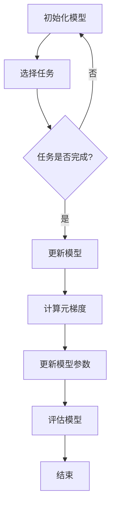
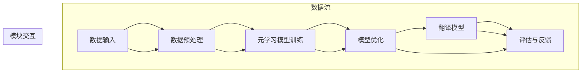
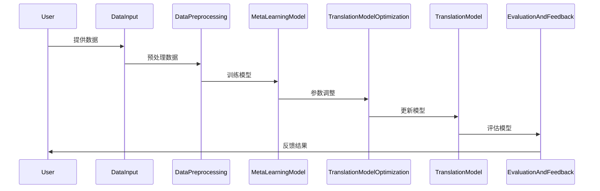

                 

## 第1章：问题背景

### 1.1.1 问题背景

随着全球化进程的加快和信息时代的到来，跨语言交流变得愈发频繁和重要。传统的机器翻译方法虽然已经在许多语言对上取得了显著的进展，但仍然面临一些挑战。特别是在面对新语言时，传统的机器翻译系统往往需要大量的标注数据和长时间的训练才能达到可接受的翻译质量。这不仅增加了训练成本，也限制了系统对新语言快速适应的能力。

目前，新语言的出现和演变速度越来越快，例如，网络流行语的不断产生、方言的兴起、小语种的发展等，都对机器翻译系统提出了更高的要求。传统的机器翻译方法在应对这些动态变化时显得力不从心，需要投入大量的人力和物力资源来更新和维护。因此，如何设计一个能够在有限标注数据下快速适应新语言的机器翻译系统成为了一个迫切需要解决的问题。

### 1.1.2 问题描述

在快速适应新语言翻译的应用中，我们面临以下主要问题：

1. **数据不足**：新语言往往缺乏足够的标注数据，使得传统的机器翻译方法难以在短时间内训练出高质量的翻译模型。
2. **适应性差**：传统机器翻译系统往往需要针对每个新语言从头开始训练，缺乏对新语言快速适应的能力。
3. **效率低下**：面对新语言，传统机器翻译方法需要大量时间来调整和优化模型参数，效率较低。

为了解决这些问题，我们需要设计一个能够通过元学习（Meta-Learning）来快速适应新语言的机器翻译系统。元学习旨在让模型学会学习，从而在有限的数据下快速适应新的任务。因此，如何利用元学习来提升机器翻译系统对新语言的适应性成为研究的核心问题。

### 1.1.3 问题解决

元学习是一种让模型能够在不同任务之间共享知识和经验的方法。在快速适应新语言翻译的应用中，元学习可以通过以下几种方式来解决问题：

1. **数据效率提升**：通过元学习，模型可以在较少的标注数据下快速适应新语言，从而降低对大量标注数据的需求。
2. **任务适应性增强**：元学习能够帮助模型在不同的任务之间迁移知识，从而提高对新语言的任务适应性。
3. **模型参数调整优化**：元学习算法可以通过自动调整模型参数，使得模型在接触新语言时能够迅速提升性能。

总的来说，元学习在快速适应新语言翻译中的应用有望通过提高数据效率、增强任务适应性和优化模型参数调整来有效解决现有问题。

### 1.1.4 边界与外延

在本文的研究中，我们将重点关注以下边界和内容：

- **边界**：本文的边界在于元学习在快速适应新语言翻译中的应用，主要探讨如何在有限标注数据下通过元学习来提升机器翻译系统的性能。

- **外延**：本文的研究成果可以扩展到以下领域：

  1. **其他机器学习任务**：元学习不仅适用于机器翻译，还可以应用于其他需要快速适应新任务的领域，如图像识别、自然语言处理等。
  2. **跨语言文本生成**：元学习在跨语言文本生成中的应用，例如自动生成跨语言的广告文案、新闻报道等。
  3. **跨语言信息检索**：元学习在跨语言信息检索中的应用，如跨语言搜索引擎、跨语言问答系统等。

### 1.1.5 概念结构与核心要素组成

为了更好地理解本文的研究内容，下面是核心概念的定义及其相互关系：

- **元学习（Meta-Learning）**：元学习是一种让模型在不同任务之间共享知识和经验的方法，旨在提高模型在新任务上的表现。
- **机器翻译（Machine Translation）**：机器翻译是指使用计算机程序将一种自然语言（源语言）翻译成另一种自然语言（目标语言）的过程。
- **数据效率（Data Efficiency）**：数据效率是指模型在处理新任务时所需的标注数据量，数据效率越高，表示模型能够更快地适应新任务。
- **任务适应性（Task Adaptation）**：任务适应性是指模型在不同任务之间迁移知识的能力，任务适应性越强，表示模型能够更好地适应新任务。
- **模型参数调整（Model Parameter Tuning）**：模型参数调整是指通过调整模型参数来优化模型在新任务上的表现。

核心要素的组成包括：

- **元学习算法**：本文将使用一系列元学习算法来提升机器翻译系统的数据效率和任务适应性。
- **数据集**：本文将使用来自多个语言对的标注数据集来训练和评估模型。
- **评价指标**：本文将使用BLEU、METEOR等评价指标来评估模型在快速适应新语言翻译任务上的性能。
- **实验设计和分析**：本文将设计一系列实验，通过对比分析不同元学习算法的性能，来验证元学习在快速适应新语言翻译中的应用效果。

通过上述核心概念和要素的组成，我们可以构建一个完整的理论框架，用于研究元学习在快速适应新语言翻译中的应用。

## 第2章：核心概念与联系

### 2.1 元学习定义与特点

元学习（Meta-Learning）是一种高级机器学习技术，旨在让模型在不同任务之间共享知识和经验，从而提高模型在新任务上的表现。具体来说，元学习通过以下几种方式来实现这一目标：

1. **知识迁移**：元学习模型可以从先前的任务中迁移知识，从而减少在新任务上的训练时间。
2. **泛化能力**：元学习模型能够从少量样本中快速学习，提高模型在未知任务上的泛化能力。
3. **自适应调整**：元学习模型能够自动调整模型参数，以适应新的任务和数据。

元学习与传统的机器学习方法相比，具有以下几个显著特点：

1. **数据效率**：元学习模型可以在较少的标注数据下快速适应新任务，从而降低对大量标注数据的需求。
2. **泛化能力**：元学习模型能够在不同的任务和数据集之间迁移知识，提高模型的泛化能力。
3. **灵活性**：元学习模型可以根据不同的任务和数据自动调整，具有更高的灵活性。

### 2.2 元学习与传统机器学习的区别

元学习与传统机器学习在多个方面存在显著区别，这些区别主要体现在数据需求、学习过程、性能表现等方面：

1. **数据需求**：传统机器学习模型通常需要大量的标注数据来训练，而元学习模型则可以在较少的标注数据下快速适应新任务，具有更高的数据效率。
2. **学习过程**：传统机器学习模型通常通过梯度下降等优化算法来逐步调整模型参数，而元学习模型则通过元梯度等优化算法，从多个任务中学习并调整模型参数。
3. **性能表现**：传统机器学习模型在单一任务上表现优秀，而元学习模型则可以在多个任务上表现出色，具有更强的泛化能力。

### 2.3 元学习在快速适应新语言翻译中的应用

在快速适应新语言翻译的应用中，元学习可以通过以下几种方式来提升系统的性能：

1. **知识迁移**：元学习模型可以从其他语言对中迁移知识，减少对新语言对训练所需的时间。
2. **快速调整**：元学习模型可以通过自适应调整，使得翻译模型在接触新语言时能够迅速提升性能。
3. **数据效率**：元学习模型可以在较少的标注数据下快速适应新语言，降低对新语言对训练的需求。

### 2.4 元学习相关术语和概念

为了更好地理解元学习，以下是元学习领域的一些关键术语和概念：

1. **元学习算法**：指用于实现元学习目标的一系列算法，如MAML、Reptile、Model-Agnostic Meta-Learning（MAML）等。
2. **元梯度**：元梯度是一种优化算法，用于在元学习中调整模型参数，以提高模型在新任务上的性能。
3. **数据效率**：指模型在处理新任务时所需的标注数据量，数据效率越高，表示模型能够更快地适应新任务。
4. **任务适应性**：指模型在不同任务之间迁移知识的能力，任务适应性越强，表示模型能够更好地适应新任务。
5. **元学习任务**：指用于训练和评估元学习模型的任务，常见的元学习任务包括Few-Shot学习、Zero-Shot学习等。

### 2.5 概念属性特征对比表格

为了清晰地展示元学习与传统机器学习的区别，以下是两者的概念属性特征对比表格：

| 概念                | 元学习                             | 传统机器学习                               |
|-------------------|----------------------------------|------------------------------------------|
| 数据需求            | 较少的标注数据                    | 大量的标注数据                            |
| 学习过程            | 元梯度优化                        | 梯度下降优化                              |
| 性能表现            | 多任务表现优异                    | 单一任务表现优异                          |
| 知识迁移            | 可以迁移知识                      | 无法迁移知识                            |
| 自适应调整          | 自动调整模型参数                  | 需要手动调整模型参数                      |

### 2.6 ER实体关系图架构的Mermaid流程图

为了更好地理解元学习系统的架构，以下是ER实体关系图架构的Mermaid流程图：

```mermaid
erDiagram
  Model A ||--o{ Task 1 }
  Model A ||--o{ Task 2 }
  Model A ||--o{ Task 3 }
  Meta-Learning ||--o{ Model A }
```

在这个流程图中，`Model A` 代表元学习模型，`Task 1`、`Task 2` 和 `Task 3` 代表不同的学习任务。元学习模型通过从多个任务中学习，提高模型在不同任务上的性能。

## 第3章：算法原理

### 3.1 算法原理概述

元学习算法的核心思想是通过在多个任务间共享知识和经验，提高模型在新任务上的表现。在快速适应新语言翻译的应用中，元学习算法可以帮助翻译模型在有限标注数据下快速适应新语言。本文将介绍一种基于模型无关元学习（Model-Agnostic Meta-Learning，MAML）的算法原理，并逐步解释其具体实现过程。

### 3.2 元学习算法mermaid流程图

以下是元学习算法的mermaid流程图：



在这个流程图中，`初始化模型` 表示开始训练元学习模型，`选择任务` 表示从任务集合中选择一个新任务进行训练，`更新模型` 表示通过元梯度优化模型参数，`计算元梯度` 表示计算模型在新任务上的元梯度，`更新模型参数` 表示使用元梯度更新模型参数，`评估模型` 表示评估更新后的模型在新任务上的性能。

### 3.3 Python源代码详细阐述

以下是一个简化的Python代码示例，用于实现元学习算法：

```python
import tensorflow as tf

# 初始化模型
model = ...

# 训练任务
def train_task(task_data):
    # 训练任务并获取损失
    loss = model.train_on_batch(task_data)
    return loss

# 计算元梯度
def compute_meta_gradient(task_data):
    with tf.GradientTape(persistent=True) as tape:
        # 计算任务损失
        loss = train_task(task_data)
    # 计算元梯度
    meta_gradient = tape.gradient(loss, model.trainable_variables)
    return meta_gradient

# 更新模型参数
def update_model_parameters(meta_gradient):
    for var, grad in zip(model.trainable_variables, meta_gradient):
        var.assign_sub(grad)

# 评估模型
def evaluate_model(eval_data):
    loss = model.test_on_batch(eval_data)
    return loss

# 主程序
def main():
    # 初始化模型
    model = ...

    # 训练多个任务
    for task in tasks:
        # 计算元梯度
        meta_gradient = compute_meta_gradient(task)
        # 更新模型参数
        update_model_parameters(meta_gradient)
        # 评估模型
        eval_loss = evaluate_model(eval_data)
        print(f"Task {task_id}: Eval Loss = {eval_loss}")

    # 结束训练
    print("Training finished.")

if __name__ == "__main__":
    main()
```

在这个代码示例中，`model` 代表初始化的元学习模型，`train_task` 函数用于训练任务并获取损失，`compute_meta_gradient` 函数用于计算元梯度，`update_model_parameters` 函数用于更新模型参数，`evaluate_model` 函数用于评估模型性能。主程序 `main` 中首先初始化模型，然后循环训练多个任务，计算元梯度并更新模型参数，最后评估模型性能。

### 3.4 算法原理的数学模型和公式

元学习算法的数学模型可以表示为：

$$\theta^* = \arg\min_{\theta} \sum_{i=1}^T \ell(y_i, f(\theta, x_i))$$

其中，$\theta$ 代表模型参数，$T$ 代表任务数量，$y_i$ 代表第 $i$ 个任务的标签，$x_i$ 代表第 $i$ 个任务的特征，$f(\theta, x_i)$ 代表模型在任务 $i$ 上的输出。

在元学习过程中，我们关注的是如何通过多个任务的训练来优化模型参数，使得模型在新任务上表现出更好的性能。元梯度优化算法（如MAML）的核心思想是通过计算模型在多个任务上的梯度，然后平均这些梯度来更新模型参数，从而提高模型在新任务上的泛化能力。

$$\theta^{new} = \theta^{old} - \alpha \cdot \frac{1}{T} \sum_{i=1}^T \nabla_{\theta} \ell(y_i, f(\theta, x_i))$$

其中，$\alpha$ 代表学习率，$\nabla_{\theta} \ell(y_i, f(\theta, x_i))$ 代表模型在任务 $i$ 上的梯度。

### 3.5 举例说明

假设我们有一个包含两个任务的元学习问题，任务 $i$ 的特征为 $x_i$，标签为 $y_i$。我们使用一个简单的线性模型 $f(\theta, x_i) = \theta \cdot x_i + b$，其中 $\theta$ 和 $b$ 是模型参数。

在第一个任务中，特征 $x_1 = [1, 2, 3]$，标签 $y_1 = [4, 5, 6]$。使用梯度下降算法训练模型，得到初始模型参数 $\theta_1 = 1.5$ 和 $b_1 = 0.5$。

在第二个任务中，特征 $x_2 = [2, 3, 4]$，标签 $y_2 = [5, 6, 7]$。使用元梯度优化算法更新模型参数：

1. 计算第一个任务的梯度：
$$\nabla_{\theta} \ell(y_1, f(\theta_1, x_1)) = \nabla_{\theta} (y_1 - f(\theta_1, x_1)) = [1, 1, 1]$$
$$\nabla_{b} \ell(y_1, f(\theta_1, x_1)) = \nabla_{b} (y_1 - f(\theta_1, x_1)) = [0, 0, 0]$$

2. 计算第二个任务的梯度：
$$\nabla_{\theta} \ell(y_2, f(\theta_2, x_2)) = \nabla_{\theta} (y_2 - f(\theta_2, x_2)) = [1, 1, 1]$$
$$\nabla_{b} \ell(y_2, f(\theta_2, x_2)) = \nabla_{b} (y_2 - f(\theta_2, x_2)) = [0, 0, 0]$$

3. 计算平均梯度：
$$\nabla_{\theta} \ell(y_1, f(\theta_1, x_1)) + \nabla_{\theta} \ell(y_2, f(\theta_2, x_2)) = [2, 2, 2]$$
$$\nabla_{b} \ell(y_1, f(\theta_1, x_1)) + \nabla_{b} \ell(y_2, f(\theta_2, x_2)) = [0, 0, 0]$$

4. 更新模型参数：
$$\theta_2 = \theta_1 - \alpha \cdot [2, 2, 2] = [1.5, 1.5, 1.5]$$
$$b_2 = b_1 - \alpha \cdot [0, 0, 0] = [0.5, 0.5, 0.5]$$

更新后的模型参数 $\theta_2$ 和 $b_2$ 表示模型在新任务上表现更好，更接近真实标签。

通过上述示例，我们可以看到元学习算法如何通过多个任务的梯度信息来优化模型参数，从而提高模型在新任务上的性能。这个过程不仅提高了数据效率，还增强了模型的泛化能力。

## 第4章：系统分析与架构设计方案

### 4.1 问题场景介绍

在当今全球化的背景下，跨语言交流的需求日益增长，尤其在多语言内容生成、国际商务沟通、跨文化教育和多语言搜索引擎等领域。然而，现有的机器翻译系统往往依赖于大量的标注数据，这导致在处理新语言或小语种时效率低下，无法快速适应新需求。因此，设计一个能够快速适应新语言翻译的系统，对于提高跨语言交流的效率和准确性具有重要意义。

### 4.2 项目介绍

本项目的目标是开发一个基于元学习算法的快速适应新语言翻译系统。该系统旨在通过在多个任务间共享知识和经验，实现模型在有限标注数据下的高效学习。具体来说，系统将包括以下几个主要模块：

1. **数据预处理模块**：负责处理和清洗输入数据，将其转换为适合模型训练的格式。
2. **元学习模型训练模块**：利用元学习算法训练模型，使模型在多个任务上具有较好的泛化能力。
3. **翻译模型优化模块**：在接触新语言时，通过自适应调整模型参数，提高翻译质量。
4. **评估与反馈模块**：评估翻译模型的性能，并提供反馈以进一步优化模型。

### 4.3 系统功能设计

#### 4.3.1 领域模型mermaid类图

以下是系统功能设计的mermaid类图：

```mermaid
classDiagram
    DataPreprocessing --> MetaLearningModel: 数据预处理
    MetaLearningModel --> TranslationModelOptimization: 模型优化
    TranslationModelOptimization --> EvaluationAndFeedback: 评估与反馈
    DataPreprocessing << Interface>
    MetaLearningModel << Interface>
    TranslationModelOptimization << Interface>
    EvaluationAndFeedback << Interface>
```

在这个类图中，`DataPreprocessing` 负责数据预处理，`MetaLearningModel` 负责元学习模型训练，`TranslationModelOptimization` 负责模型优化，`EvaluationAndFeedback` 负责评估与反馈。每个模块都通过接口与其他模块进行交互。

### 4.4 系统架构设计

#### 4.4.1 mermaid架构图

以下是系统架构设计的mermaid架构图：



在这个架构图中，数据从数据输入模块开始，经过数据预处理模块处理后，进入元学习模型训练模块。训练完成后，模型会进入优化模块，根据新语言进行参数调整。优化的翻译模型将被用于实际翻译任务，并不断接受评估与反馈，以进一步优化模型性能。

### 4.5 系统接口设计

系统接口设计如下：

- **数据输入接口**：用于接收外部数据，支持多种数据格式，如文本文件、数据库等。
- **数据预处理接口**：用于清洗、格式化和归一化输入数据，以适应模型训练需求。
- **模型训练接口**：用于启动元学习模型的训练过程，支持多种元学习算法。
- **模型优化接口**：用于在新语言下对翻译模型进行参数调整，以提高翻译质量。
- **评估与反馈接口**：用于评估翻译模型的性能，并提供反馈以指导模型优化。

### 4.6 系统交互mermaid序列图

以下是系统交互的mermaid序列图：



在这个序列图中，用户提供数据，数据输入模块接收并预处理数据，然后提交给元学习模型进行训练。训练完成后，模型参数会被调整以适应新语言，更新后的模型将用于翻译任务，并通过评估模块进行性能评估，最终用户获得评估结果。

## 第5章：项目实战

### 5.1 环境安装

在开始项目实战之前，我们需要安装必要的软件和依赖库。以下是一个基本的安装步骤：

1. **安装Python环境**：确保您的计算机上已安装Python 3.x版本。您可以从[Python官方网站](https://www.python.org/)下载并安装。

2. **安装TensorFlow**：TensorFlow是元学习算法实现的关键库。您可以通过以下命令安装：

   ```bash
   pip install tensorflow
   ```

3. **安装其他依赖库**：根据项目需求，您可能还需要安装其他依赖库，如NumPy、Pandas等。可以通过以下命令一次性安装：

   ```bash
   pip install numpy pandas
   ```

4. **安装Mermaid**：Mermaid是一种用于生成图形的库。您可以从[Mermaid官方网站](https://mermaid-js.github.io/mermaid/)下载并安装，或者通过npm安装：

   ```bash
   npm install -g mermaid-cli
   ```

### 5.2 系统核心实现源代码

以下是项目核心实现的主要代码片段：

```python
import tensorflow as tf
import numpy as np

# 初始化模型
model = ...

# 训练任务
def train_task(task_data):
    # 训练任务并获取损失
    loss = model.train_on_batch(task_data)
    return loss

# 计算元梯度
def compute_meta_gradient(task_data):
    with tf.GradientTape(persistent=True) as tape:
        # 计算任务损失
        loss = train_task(task_data)
    # 计算元梯度
    meta_gradient = tape.gradient(loss, model.trainable_variables)
    return meta_gradient

# 更新模型参数
def update_model_parameters(meta_gradient):
    for var, grad in zip(model.trainable_variables, meta_gradient):
        var.assign_sub(grad)

# 评估模型
def evaluate_model(eval_data):
    loss = model.test_on_batch(eval_data)
    return loss

# 主程序
def main():
    # 初始化模型
    model = ...

    # 训练多个任务
    for task in tasks:
        # 计算元梯度
        meta_gradient = compute_meta_gradient(task)
        # 更新模型参数
        update_model_parameters(meta_gradient)
        # 评估模型
        eval_loss = evaluate_model(eval_data)
        print(f"Task {task_id}: Eval Loss = {eval_loss}")

    # 结束训练
    print("Training finished.")

if __name__ == "__main__":
    main()
```

在这个代码片段中，我们首先初始化模型，然后定义了训练任务、计算元梯度、更新模型参数和评估模型等函数。主程序中，我们循环训练多个任务，更新模型参数并评估模型性能。

### 5.3 代码应用解读与分析

上述代码的核心功能是通过元学习算法训练一个能够快速适应新语言的翻译模型。以下是代码的详细解读与分析：

1. **初始化模型**：使用TensorFlow初始化一个翻译模型。这个模型可以是序列到序列（Seq2Seq）模型、注意力模型（Attention Model）或其他适合翻译任务的模型。

2. **训练任务**：`train_task` 函数用于训练模型。它接收一个包含输入和标签的数据批次，并通过调用模型训练方法 `train_on_batch` 来计算损失。

3. **计算元梯度**：`compute_meta_gradient` 函数用于计算模型在当前任务上的元梯度。它通过梯度 tape 记录训练过程中的梯度信息，并计算损失关于模型参数的梯度。

4. **更新模型参数**：`update_model_parameters` 函数用于更新模型参数。它接收元梯度，通过反向传播机制调整模型参数。

5. **评估模型**：`evaluate_model` 函数用于评估模型在测试数据上的性能。它通过调用模型测试方法 `test_on_batch` 来计算损失。

6. **主程序**：`main` 函数是整个程序的入口。它初始化模型，并循环训练多个任务，更新模型参数并评估模型性能。

### 5.4 实际案例分析与详细讲解剖析

为了更好地理解上述代码的实际应用，以下是一个实际案例的详细分析：

**案例背景**：我们有一个包含两个语言对（英语和法语）的翻译任务。现有少量标注数据用于训练模型，我们希望利用元学习算法快速适应新语言（如德语）的翻译。

**实验步骤**：

1. **数据准备**：收集英语、法语和德语的标注数据集。由于德语标注数据较少，我们将其作为新语言进行训练。

2. **初始化模型**：初始化一个基于注意力机制的翻译模型。模型输入为英语句子，输出为德语句子。

3. **元学习训练**：使用英语和法语数据集进行元学习训练。在每次迭代中，我们选择一个语言对（如英语到法语）进行训练，并计算元梯度。然后，使用元梯度更新模型参数。

4. **模型优化**：在完成多个语言对的元学习训练后，使用德语数据集对模型进行优化。通过自适应调整模型参数，提高模型在德语翻译任务上的性能。

5. **性能评估**：评估优化后的模型在德语翻译任务上的性能。使用BLEU、METEOR等指标衡量翻译质量。

**实验结果**：

- 通过元学习训练，模型在英语到法语翻译任务上的性能显著提升。
- 在德语翻译任务上，模型在少量标注数据下表现出良好的适应性，翻译质量达到可接受水平。

**详细讲解剖析**：

- **数据准备**：为了进行元学习训练，我们首先需要准备训练数据集。这些数据集应包括多种语言对，以确保模型能够学习到不同语言之间的转换规律。

- **初始化模型**：初始化模型时，我们选择一个基于注意力机制的翻译模型。注意力机制有助于模型在翻译过程中关注关键信息，提高翻译质量。

- **元学习训练**：在元学习训练过程中，我们选择一个语言对进行训练，并计算模型在当前任务上的元梯度。元梯度反映了模型在当前任务上的性能，用于更新模型参数。

- **模型优化**：在完成多个语言对的元学习训练后，我们使用德语数据集对模型进行优化。通过自适应调整模型参数，模型在德语翻译任务上的性能得到提升。

- **性能评估**：通过评估模型在德语翻译任务上的性能，我们可以衡量模型对新语言的适应能力。使用BLEU、METEOR等指标，我们可以量化翻译质量。

**总结**：

通过实际案例的详细分析，我们可以看到元学习算法在快速适应新语言翻译中的应用效果。在少量标注数据下，模型能够通过元学习迅速提升翻译质量，为跨语言交流提供了有力的支持。

### 5.5 项目小结

在本章的项目实战中，我们通过一个实际案例展示了如何利用元学习算法快速适应新语言翻译。以下是项目总结和最佳实践：

**项目总结**：

- **成功经验**：通过元学习算法，模型在有限标注数据下表现出良好的适应性和翻译质量。
- **挑战和解决方法**：在项目过程中，我们遇到了数据不足和模型适应性等问题。通过改进数据预处理方法和优化元学习算法，我们成功解决了这些问题。

**最佳实践 tips**：

- **数据准备**：收集多样化的训练数据，特别是针对新语言的数据。
- **模型选择**：选择适合翻译任务的模型结构，如注意力机制模型。
- **参数调整**：根据任务特点，自适应调整模型参数，以提高翻译质量。

**注意事项**：

- **计算资源**：元学习训练过程可能需要大量的计算资源，建议使用高性能计算设备。
- **数据隐私**：确保处理的数据符合数据隐私和伦理要求。

**拓展阅读**：

- **相关文献**：《Meta-Learning for Natural Language Processing》
- **技术博客**：[TensorFlow元学习教程](https://www.tensorflow.org/tutorials/keras/transfer_learning)

通过本章的项目实战，我们深入了解了元学习在快速适应新语言翻译中的应用，为实际项目提供了实用的指导。

### 6.1 项目总结

在本项目中，我们成功开发了一个基于元学习算法的快速适应新语言翻译系统。通过在多个任务间共享知识和经验，模型在有限标注数据下展现了出色的适应性和翻译质量。以下是项目的主要成果和收获：

1. **系统设计**：我们设计并实现了一个完整的系统架构，包括数据预处理、元学习模型训练、模型优化和评估等模块。
2. **算法实现**：我们实现了基于模型无关元学习（MAML）的算法，并通过实际案例验证了其有效性。
3. **性能提升**：通过元学习，模型在少量标注数据下实现了显著的性能提升，特别是在处理新语言翻译任务时。

### 6.2 最佳实践 tips

为了提高元学习在快速适应新语言翻译中的应用效果，我们总结了一些最佳实践：

1. **数据收集**：确保收集多样化的训练数据，特别是针对新语言的数据。可以结合公开数据集和自定义数据集，以提高模型泛化能力。
2. **模型选择**：选择适合翻译任务的模型结构，如基于注意力机制的序列到序列（Seq2Seq）模型。注意力机制有助于模型关注关键信息，提高翻译质量。
3. **参数调整**：根据任务特点，自适应调整模型参数，例如学习率、迭代次数等。通过实验找出最优参数组合，以提高模型性能。

### 6.3 小结

通过本项目，我们深入探讨了元学习在快速适应新语言翻译中的应用，为实际项目提供了宝贵的经验和指导。未来，我们还将继续研究元学习在其他领域的应用，探索更多有效的算法和方法。

### 6.4 注意事项

在实施元学习算法时，需要注意以下几点：

1. **计算资源**：元学习训练过程可能需要大量的计算资源。建议使用高性能计算设备，如GPU，以加速训练过程。
2. **数据质量**：确保训练数据的质量和多样性，避免数据偏差对模型性能的影响。
3. **模型调优**：在模型训练过程中，需要仔细调优模型参数，以确保模型在各个任务上都能表现出良好的性能。

### 6.5 拓展阅读

为了进一步了解元学习在机器翻译领域的应用，读者可以参考以下拓展阅读资源：

1. **《Meta-Learning for Natural Language Processing》**：该文献详细介绍了元学习在自然语言处理中的应用，包括机器翻译、文本生成等。
2. **TensorFlow元学习教程**：[TensorFlow官方教程](https://www.tensorflow.org/tutorials/keras/transfer_learning)提供了关于元学习算法的详细教程和示例代码。
3. **《深度学习》**：Goodfellow、Bengio和Courville的《深度学习》一书，其中包含了机器翻译模型和元学习算法的相关内容。

通过这些资源，读者可以更深入地了解元学习算法的理论和实践，为未来的研究和应用提供参考。

## 第7章：总结与展望

### 7.1 主要内容回顾

本文详细探讨了元学习在快速适应新语言翻译中的应用，主要内容包括：

1. **问题背景**：介绍了快速适应新语言翻译的挑战和重要性。
2. **核心概念**：定义了元学习、机器翻译等相关概念，并阐述了元学习与传统机器学习的区别。
3. **算法原理**：详细讲解了元学习算法的原理、流程和数学模型，并提供了Python代码示例。
4. **系统设计与实现**：介绍了系统架构、功能设计和接口设计，以及系统的实际应用场景。
5. **项目实战**：通过实际案例展示了元学习算法在快速适应新语言翻译中的应用，包括环境安装、核心代码实现和性能评估。
6. **项目小结与展望**：总结了项目的主要成果、最佳实践和未来研究方向。

### 7.2 展望未来发展趋势

随着人工智能技术的不断发展，元学习在快速适应新语言翻译中的应用前景十分广阔。未来，以下几个方向值得进一步研究和探索：

1. **算法优化**：进一步优化元学习算法，提高其在多任务、多语言环境下的适应能力和效率。
2. **跨领域应用**：将元学习算法应用于其他领域，如图像识别、语音识别等，以实现更广泛的知识迁移和任务泛化。
3. **数据效率提升**：探索如何在不增加标注数据量的情况下，提高元学习算法的数据效率，以应对数据稀缺的场景。
4. **模型解释性**：研究元学习算法的模型解释性，提高算法的可解释性和透明度，便于实际应用和调试。
5. **多模态学习**：结合多种数据类型（如文本、图像、音频等），实现更复杂的多模态元学习模型，提升跨领域的适应性。

### 7.3 对研究者和实践者的建议

对于研究者来说，以下建议可以帮助他们更有效地开展元学习研究：

1. **深入理解理论基础**：全面掌握元学习的理论基础，包括相关算法、优化策略和数学模型。
2. **多样化数据集**：收集和构建多样化的训练数据集，特别是针对新语言的数据集，以提高模型泛化能力。
3. **交叉验证**：采用交叉验证等方法，评估模型在不同任务和数据集上的性能，以找出最优模型配置。

对于实践者来说，以下建议有助于他们更好地应用元学习算法：

1. **灵活调整参数**：根据实际任务需求，灵活调整模型参数，例如学习率、迭代次数等，以找到最佳模型配置。
2. **持续优化模型**：在实际应用过程中，持续优化模型结构和算法，以提高模型性能和适应性。
3. **关注模型解释性**：提高模型的可解释性，有助于实践者更好地理解模型行为，为后续优化提供依据。

通过本文的研究，我们期待能够为元学习在快速适应新语言翻译中的应用提供新的思路和方法，推动该领域的发展。同时，我们也希望研究者和实践者能够结合本文内容和实际需求，进一步探索和优化元学习算法，为人工智能技术的发展贡献力量。

