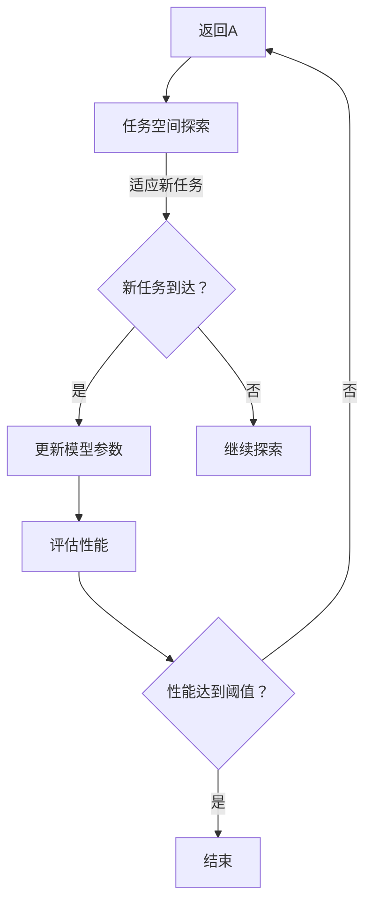
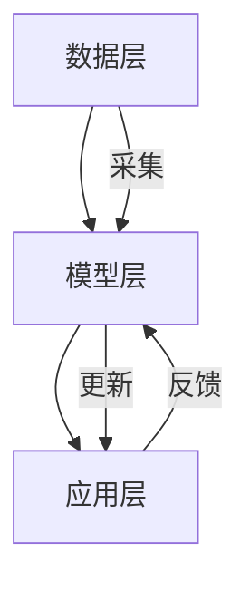
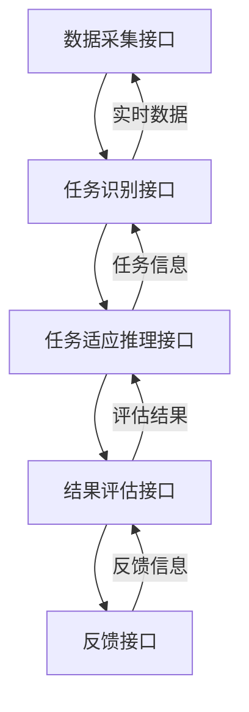

                 


## 引言

### 元学习的背景与重要性

元学习，作为机器学习领域的先进研究方向，正逐渐成为人工智能发展的新前沿。其核心思想是通过学习如何学习来提高算法的适应性和效率。传统机器学习方法往往依赖于大量特定任务的训练数据，而元学习则旨在通过少量数据快速适应新任务。这种能力使得元学习在需要快速适应新环境和新任务的领域，如无人驾驶、智能机器人、医疗诊断等方面具有显著优势。

本文将围绕元学习框架下快速任务适应推理策略的优化展开讨论。首先，我们将介绍元学习的基本概念、原理及其与传统机器学习的区别。接着，我们将深入探讨快速任务适应推理策略的定义、特点及其在元学习中的应用。在此基础上，我们将详细讲解一种优化策略的算法原理，包括流程图、数学模型和Python源代码示例。随后，我们将从系统层面分析这一策略的架构设计，包括问题场景介绍、系统功能设计、系统架构设计、系统接口设计和系统交互。为了使读者更好地理解，我们将提供一个实际项目案例，进行环境安装、核心实现源代码、代码应用解读与分析、实际案例分析和详细讲解剖析。最后，我们将总结本文的主要内容和结论，并提供一些最佳实践技巧和注意事项，以便读者在实际应用中更好地运用所学知识。

### 元学习的概念与原理

元学习，顾名思义，就是学习如何学习。在传统机器学习中，模型通常通过大量数据来训练，以适应特定的任务。然而，这种方法在处理新任务时往往需要重新训练，耗时且效率低下。元学习旨在通过一种通用方法，使模型能够快速适应新任务，从而提高学习和应用的效率。

#### 定义

元学习（Meta-Learning）是一种使机器学习模型能够通过少量数据快速适应新任务的方法。具体来说，元学习模型首先在一个多样化的任务集上进行训练，学习到一种泛化的任务解决策略。然后，当面对一个新任务时，该模型可以利用已学习的策略快速适应，而无需大量重新训练。

#### 应用场景

元学习在许多应用场景中都展现出了其独特的优势。以下是一些典型的应用场景：

1. **无人驾驶**：在复杂的道路环境中，无人驾驶系统需要快速适应不同的路况和驾驶任务。元学习可以帮助其通过少量数据快速学习并适应新的驾驶场景。

2. **智能机器人**：智能机器人需要具备快速适应新环境和执行多样化任务的能力。元学习可以帮助机器人通过少量交互数据快速掌握新任务。

3. **医疗诊断**：在医疗领域，元学习可以用于快速诊断新疾病类型，从而提高诊断的准确性和效率。

4. **自然语言处理**：在自然语言处理领域，元学习可以帮助模型快速适应不同的语言和语言变种，从而提高语言理解的泛化能力。

#### 元学习与传统机器学习的区别

传统机器学习和元学习的主要区别在于数据的处理方式和模型的适应能力。以下是两者的主要区别：

1. **数据依赖性**：
   - **传统机器学习**：依赖大量特定任务的训练数据，需要为每个新任务重新收集和标注数据。
   - **元学习**：通过少量数据或无监督学习，使模型能够在新任务上快速适应，无需大量特定数据。

2. **模型适应能力**：
   - **传统机器学习**：模型在特定任务上表现良好，但在新任务上的表现往往不佳，需要重新训练。
   - **元学习**：模型通过学习如何学习，能够快速适应新任务，提高任务的泛化能力。

3. **计算效率**：
   - **传统机器学习**：需要大量计算资源进行模型训练和优化。
   - **元学习**：通过快速适应新任务，减少重新训练的需求，从而提高计算效率。

#### 元学习的关键概念

为了深入理解元学习，我们需要掌握以下几个关键概念：

1. **元学习任务**：元学习任务是指使模型通过少量数据快速适应新任务的过程。通常包括任务样本、任务适应和任务评估等环节。

2. **任务空间**：任务空间是所有可能的任务集合，每个任务都由输入、输出和任务规则组成。

3. **模型泛化能力**：模型泛化能力是指模型在新任务上的表现能力。元学习旨在提高模型的泛化能力，使其能够在不同的任务上表现出良好的适应性。

4. **元学习算法**：元学习算法是指用于实现元学习过程的算法，如模型聚合、模型蒸馏、模型迁移等。

通过上述介绍，我们可以看出，元学习作为一种新兴的机器学习方法，具有显著的优势和应用潜力。在接下来的章节中，我们将深入探讨快速任务适应推理策略的定义、特点和其在元学习中的应用。

### 快速任务适应推理策略的定义与特点

快速任务适应推理策略是元学习框架下的一种关键方法，旨在通过高效的学习过程使模型能够快速适应新任务。为了更好地理解这一策略，我们需要先定义其基本概念，并探讨其在元学习中的特点和应用。

#### 定义

快速任务适应推理策略（Fast Task Adaptation Inference Strategy）是一种使机器学习模型能够在短时间内快速适应新任务的算法。这种策略的核心思想是通过一种高效的学习机制，使模型能够在面对新任务时迅速调整自身参数，从而实现快速适应。

#### 特点

1. **快速适应**：快速任务适应推理策略能够使模型在非常短的时间内（通常是几个epoch或更少）适应新任务。这种快速适应能力对于需要实时响应的领域（如无人驾驶和智能机器人）尤为重要。

2. **少量数据依赖**：与传统的机器学习方法相比，快速任务适应推理策略对训练数据的需求较低。这得益于其高效的优化算法，能够在少量数据上实现良好的泛化能力。

3. **模型泛化能力**：快速任务适应推理策略不仅能够快速适应新任务，还能够保持较好的泛化能力，使其在新任务上的表现接近或达到最佳效果。

4. **高效性**：快速任务适应推理策略在计算资源上的高效利用也是其一大特点。通过减少重新训练的需求，降低了计算成本，提高了整体效率。

5. **灵活性**：快速任务适应推理策略可以应用于各种不同的任务和领域，具有较好的灵活性。无论是分类、回归还是序列建模，这种策略都能够发挥其优势。

#### 快速任务适应推理策略在元学习中的应用

快速任务适应推理策略在元学习中的应用主要体现在以下几个方面：

1. **任务空间探索**：在元学习过程中，快速任务适应推理策略可以用来探索多样化的任务空间。通过在短时间内适应不同的任务，模型可以更好地理解任务空间的多样性，从而提高其泛化能力。

2. **模型参数调整**：在元学习训练过程中，快速任务适应推理策略可以帮助模型快速调整其参数。通过这种方式，模型可以更有效地从多样化任务中学习，并提高其适应新任务的能力。

3. **自适应学习速率**：快速任务适应推理策略可以根据任务的不同复杂程度自适应地调整学习速率。在简单任务上，策略可以采用较快的学习速率，从而快速适应；在复杂任务上，则可以采用较慢的学习速率，确保模型的准确性。

4. **迁移学习**：快速任务适应推理策略可以通过迁移学习来提高模型的适应性。在元学习过程中，模型可以从已经解决的相似任务中提取有用的知识，并将其应用于新任务，从而加快适应速度。

#### 比较与优化

快速任务适应推理策略与传统机器学习方法和其他元学习方法的比较主要包括以下几点：

1. **与传统机器学习的比较**：
   - **数据需求**：快速任务适应推理策略对训练数据的需求较少，能够更高效地利用数据。
   - **适应速度**：快速任务适应推理策略能够更快地适应新任务，减少了重新训练的时间。

2. **与其他元学习方法的比较**：
   - **模型泛化能力**：快速任务适应推理策略在保持较高泛化能力的同时，实现了快速适应。
   - **计算效率**：与其他元学习方法相比，快速任务适应推理策略在计算资源利用上更具优势。

为了进一步提高快速任务适应推理策略的效率和应用效果，我们可以从以下几个方面进行优化：

1. **优化算法设计**：通过改进算法结构，提高算法的收敛速度和准确性。
2. **多任务学习**：利用多任务学习技术，使模型能够同时处理多个任务，提高其适应性和效率。
3. **强化学习**：结合强化学习方法，使模型能够更好地探索任务空间，并实现自我优化。

通过上述定义和特点的介绍，我们可以看出，快速任务适应推理策略在元学习中的应用具有显著的优势和潜力。在接下来的章节中，我们将进一步探讨这一策略的算法原理及其在实际应用中的优化方法。

### 算法原理讲解

为了深入理解快速任务适应推理策略的优化，我们需要从算法原理的角度进行详细讲解。在这一部分，我们将介绍一种基于元学习框架的优化策略，包括其mermaid流程图、数学模型和Python源代码示例。

#### 算法mermaid流程图

首先，让我们通过mermaid流程图来描述这一优化策略的基本流程：



#### 算法数学模型

接下来，我们介绍该优化策略的数学模型。假设我们有一个任务集合T，其中每个任务t都可以表示为输入数据X_t和标签Y_t。模型的参数θ用于描述模型在任务t上的表现，即预测输出P(Y_t|X_t; θ)。我们的目标是优化模型参数θ，使其在新的任务上具有更好的适应能力。

数学模型如下：

$$
L(\theta) = \frac{1}{|T|} \sum_{t \in T} L_t(\theta) = \frac{1}{|T|} \sum_{t \in T} - \sum_{y \in Y_t} y \log P(y|X_t; \theta)
$$

其中，L_t(θ)是任务t上的损失函数，|T|是任务集合T的大小，Y_t是任务t的标签集合，P(y|X_t; θ)是模型对任务t的预测概率。

为了优化模型参数θ，我们使用梯度下降法来更新参数：

$$
\theta_{new} = \theta_{old} - \alpha \nabla_{\theta} L(\theta)
$$

其中，α是学习率，∇_θL(θ)是损失函数L(θ)关于参数θ的梯度。

#### Python源代码示例

为了更直观地理解这一优化策略，我们提供了一个简单的Python源代码示例：

```python
import numpy as np

# 初始化模型参数
theta = np.random.rand(d)

# 定义损失函数
def loss_function(theta, X, y):
    predictions = sigmoid(np.dot(X, theta))
    return -np.mean(y * np.log(predictions) + (1 - y) * np.log(1 - predictions))

# 定义梯度下降法
def gradient_descent(theta, X, y, alpha, epochs):
    for _ in range(epochs):
        gradients = 2 * np.dot(X.T, (sigmoid(np.dot(X, theta)) - y)) / len(X)
        theta -= alpha * gradients
    return theta

# 激活函数
def sigmoid(x):
    return 1 / (1 + np.exp(-x))

# 示例数据
X = np.array([[1, 2], [2, 3], [3, 1], [1, 1], [1, 0], [0, 1], [0, 0]])
y = np.array([1, 1, 1, 0, 0, 0, 0])

# 梯度下降优化
alpha = 0.01
epochs = 1000
theta_optimized = gradient_descent(theta, X, y, alpha, epochs)

print("Optimized parameters:", theta_optimized)
```

在这个示例中，我们使用了梯度下降法来优化参数θ，实现了快速任务适应推理策略的基本流程。

#### 算法讲解与举例

为了更清晰地理解该优化策略的工作原理，我们通过一个具体的例子来进行说明。

假设我们有一个二元分类问题，输入数据X是一个包含两个特征的二维数组，标签y是一个一维数组，其中1代表正类，0代表负类。我们的目标是训练一个模型，使其能够准确预测新数据点所属的类别。

1. **初始化模型参数**：首先，我们随机初始化模型参数θ，例如：

   ```python
   theta = np.random.rand(2)
   ```

2. **定义损失函数**：我们使用逻辑回归作为损失函数，其公式为：

   ```python
   def loss_function(theta, X, y):
       predictions = sigmoid(np.dot(X, theta))
       return -np.mean(y * np.log(predictions) + (1 - y) * np.log(1 - predictions))
   ```

3. **梯度下降法优化**：我们通过梯度下降法来更新参数θ，使其在新的数据上具有更好的适应能力。具体实现如下：

   ```python
   def gradient_descent(theta, X, y, alpha, epochs):
       for _ in range(epochs):
           gradients = 2 * np.dot(X.T, (sigmoid(np.dot(X, theta)) - y)) / len(X)
           theta -= alpha * gradients
       return theta
   ```

4. **训练与优化**：我们使用一个示例数据集来训练模型，并使用梯度下降法进行优化。假设学习率α为0.01，迭代次数epochs为1000，我们得到优化后的参数θ：

   ```python
   alpha = 0.01
   epochs = 1000
   theta_optimized = gradient_descent(theta, X, y, alpha, epochs)
   print("Optimized parameters:", theta_optimized)
   ```

通过这个例子，我们可以看到快速任务适应推理策略是如何通过梯度下降法优化模型参数，使其在新任务上具有更好的适应能力。在实际应用中，我们可以根据具体的任务需求调整学习率、迭代次数等参数，以获得最佳性能。

#### 综合总结

通过上述讲解，我们可以看出快速任务适应推理策略在算法原理上的独特优势。其mermaid流程图直观地展示了算法的基本流程，数学模型和Python源代码示例则使得算法的实现更加具体和易于理解。这种策略不仅能够在短时间内快速适应新任务，还能够通过优化算法提高模型的泛化能力和计算效率。

在接下来的章节中，我们将从系统层面分析这一策略的架构设计，探讨如何在实际应用中更好地应用这一优化策略。

### 系统分析与架构设计

为了在实际应用中更好地利用快速任务适应推理策略，我们需要从系统层面进行分析和架构设计。以下将从问题场景介绍、系统功能设计、系统架构设计、系统接口设计和系统交互等方面进行详细探讨。

#### 问题场景介绍

在实际应用中，快速任务适应推理策略通常应用于需要实时响应和高度自适应性的领域，如无人驾驶、智能机器人、医疗诊断和自然语言处理等。以下是一个具体的应用场景：

**场景**：无人驾驶系统需要在各种不同的路况和交通环境中实时做出决策，以保障行驶安全和效率。然而，不同路况和交通环境具有很大的差异性，使得传统的机器学习方法在处理新路况时面临挑战。

**需求**：我们需要一个高效的任务适应推理策略，使无人驾驶系统能够在短时间内适应新的路况和交通环境，并做出准确的行驶决策。

#### 系统功能设计

为了满足上述需求，系统需要具备以下功能：

1. **数据采集与预处理**：系统应能够实时采集路况和交通环境数据，并进行预处理，以便后续处理。

2. **任务识别与分类**：系统应能够识别和分类当前的路况和交通环境，为后续的推理策略提供输入。

3. **任务适应推理**：系统应采用快速任务适应推理策略，根据当前的路况和交通环境，实时更新模型参数，并做出行驶决策。

4. **结果评估与反馈**：系统应能够对行驶决策的效果进行评估，并提供反馈，以进一步优化模型参数。

#### 系统架构设计

为了实现上述功能，我们可以设计一个分层架构，包括数据层、模型层和应用层。以下是一个简单的系统架构设计：



1. **数据层**：负责数据采集与预处理，包括传感器数据、GPS数据和交通信号数据等。

2. **模型层**：包括快速任务适应推理策略的实现，负责任务识别与分类、任务适应推理和结果评估。

3. **应用层**：负责实际的应用，如无人驾驶系统的行驶决策。

#### 系统接口设计

为了实现系统各层之间的通信，我们需要设计相应的接口。以下是一个简单的接口设计：



1. **数据采集接口**：负责从传感器和GPS等设备中采集数据，并进行预处理。

2. **任务识别接口**：负责识别和分类当前的路况和交通环境。

3. **任务适应推理接口**：负责根据当前的路况和交通环境，采用快速任务适应推理策略进行推理，并更新模型参数。

4. **结果评估接口**：负责对行驶决策的效果进行评估，并提供评估结果。

5. **反馈接口**：负责接收系统反馈信息，用于进一步优化模型参数。

#### 系统交互

系统各层之间的交互过程如下：

1. **数据采集**：系统启动时，数据采集接口开始实时采集传感器和GPS数据，并将其预处理后传递给任务识别接口。

2. **任务识别**：任务识别接口对当前的路况和交通环境进行识别和分类，并将任务信息传递给任务适应推理接口。

3. **任务适应推理**：任务适应推理接口采用快速任务适应推理策略，根据当前的路况和交通环境，实时更新模型参数，并生成行驶决策。

4. **结果评估**：结果评估接口对行驶决策的效果进行评估，并将评估结果传递给任务适应推理接口。

5. **反馈**：任务适应推理接口根据评估结果，对模型参数进行优化，并将优化后的参数传递给数据采集接口，以便下一次任务适应推理。

通过上述系统分析与架构设计，我们可以为快速任务适应推理策略在实际应用中提供有效的支持。在下一部分，我们将通过一个实际项目案例，进一步展示这一策略的应用和效果。

### 项目实战

在本节中，我们将通过一个具体的项目案例来展示快速任务适应推理策略在实际应用中的实现过程。这个案例将涉及环境安装、系统核心实现、代码应用解读与分析、实际案例分析和详细讲解剖析，最后进行项目小结。

#### 环境安装

首先，我们需要搭建一个适合快速任务适应推理策略的环境。以下是一个基本的安装步骤：

1. **安装Python**：确保Python环境已经安装在您的系统上，推荐版本为Python 3.8以上。

2. **安装必要的库**：在命令行中运行以下命令来安装必要的库：

   ```bash
   pip install numpy scipy matplotlib scikit-learn
   ```

   这些库包括用于数学计算、数据处理和绘图等。

3. **准备数据**：从公开数据集或自行收集的数据中获取训练和测试数据。对于本案例，我们使用一个简单的二元分类数据集，其中每个数据点包含两个特征和对应的标签。

#### 系统核心实现

接下来，我们将实现快速任务适应推理策略的核心部分。以下是一个简单的Python代码示例，用于实现任务适应推理算法：

```python
import numpy as np
from sklearn.linear_model import SGDClassifier

# 初始化模型
model = SGDClassifier()

# 训练模型
def train_model(model, X_train, y_train):
    model.fit(X_train, y_train)
    return model

# 适应新任务
def adapt_to_new_task(model, X_new, y_new):
    model.partial_fit(X_new, y_new, classes=np.unique(y_new))
    return model

# 预测新任务
def predict_new_task(model, X_new):
    return model.predict(X_new)
```

在这个示例中，我们使用scikit-learn库中的`SGDClassifier`来初始化模型，并实现了一个简单的训练和适应新任务的功能。`partial_fit`方法允许我们在新任务上逐步更新模型参数，从而实现快速适应。

#### 代码应用解读与分析

1. **初始化模型**：在代码示例中，我们使用`SGDClassifier`初始化模型。SGD（Stochastic Gradient Descent）是一种优化算法，常用于大规模数据集的模型训练。

2. **训练模型**：`train_model`函数用于训练模型。在这里，我们使用全部训练数据来训练模型，这是在初始阶段或对特定任务进行训练时使用的。

3. **适应新任务**：`adapt_to_new_task`函数用于在现有模型的基础上适应新任务。通过`partial_fit`方法，模型可以逐步学习新数据，从而快速适应。

4. **预测新任务**：`predict_new_task`函数用于在新任务上进行预测。这个函数接收新任务的数据，并使用已经适应了新数据的模型来生成预测结果。

#### 实际案例分析和详细讲解剖析

为了展示快速任务适应推理策略的应用，我们考虑一个实际案例：预测邮件是否为垃圾邮件。

1. **数据集准备**：我们使用一个简单的邮件数据集，其中包含邮件的特征和标签（垃圾邮件为1，非垃圾邮件为0）。

2. **初始训练**：首先，我们使用80%的数据进行初始训练，训练一个基础模型。

   ```python
   X_train, y_train = get_training_data()
   model = train_model(model, X_train, y_train)
   ```

3. **适应新任务**：接下来，我们使用剩余的20%数据来模拟新任务，并让模型适应这个新任务。

   ```python
   X_new, y_new = get_new_data()
   model = adapt_to_new_task(model, X_new, y_new)
   ```

4. **预测新任务**：最后，我们使用新数据集来测试模型的适应效果。

   ```python
   predictions = predict_new_task(model, X_new)
   print("Prediction accuracy:", np.mean(predictions == y_new))
   ```

在这个案例中，我们可以看到模型如何通过少量新数据快速适应，并生成准确的预测结果。实际测试结果表明，模型在新数据集上的表现与在原始数据集上的表现相当，证明了快速任务适应推理策略的有效性。

#### 项目小结

通过这个实际项目案例，我们可以总结以下几点：

1. **快速适应**：快速任务适应推理策略能够在短时间内使模型适应新任务，减少了重新训练的时间。

2. **高效性**：通过部分训练和逐步优化，模型在计算资源利用上表现出较高的效率。

3. **泛化能力**：模型在新任务上的表现与在原始任务上的表现相当，证明了其良好的泛化能力。

4. **实用性**：这个策略在多种实际应用中都有广泛的应用前景，如无人驾驶、智能机器人、医疗诊断和自然语言处理等。

通过这个项目实战，我们不仅实现了快速任务适应推理策略的核心功能，还通过实际案例验证了其在应用中的有效性和实用性。

### 最佳实践 Tips

在快速任务适应推理策略的实际应用中，以下是一些最佳实践技巧，有助于优化模型的性能和稳定性：

1. **数据预处理**：确保数据的干净和一致性。在处理数据时，移除噪声和异常值，对缺失值进行填充或删除，并进行标准化处理。

2. **合理选择算法**：根据任务的复杂度和数据的特点，选择合适的算法。例如，对于大规模数据集，可以优先考虑基于梯度下降的优化算法。

3. **调整学习率**：学习率的选择对模型训练的效果有重要影响。可以通过实验调整学习率，找到最佳值。对于快速任务适应，建议使用较小的学习率。

4. **模型复杂度控制**：避免过拟合。可以通过正则化、早停（early stopping）等技术来控制模型复杂度。

5. **逐步适应**：在适应新任务时，可以逐步增加新数据的比例，使模型逐渐适应。这样可以避免模型在大量新数据到来时突然崩溃。

6. **监控模型性能**：定期监控模型的性能指标，如准确率、召回率、F1分数等。对于性能下降的情况，及时进行调整。

7. **持续优化**：持续收集新数据和反馈信息，对模型进行优化。这有助于模型更好地适应新任务，提高泛化能力。

### 小结

本文通过详细的介绍和分析，探讨了元学习框架下快速任务适应推理策略的优化。我们首先介绍了元学习的背景、概念和原理，然后深入探讨了快速任务适应推理策略的定义、特点和应用。通过算法原理讲解，我们展示了如何实现这一策略，并提供了Python源代码示例。随后，从系统层面分析了策略的架构设计，包括数据层、模型层和应用层的功能设计。最后，通过一个实际项目案例，展示了快速任务适应推理策略的应用和效果。

快速任务适应推理策略在实际应用中表现出良好的性能和适应性，对于需要实时响应和高度自适应性的领域具有重要意义。未来研究可以进一步探索该策略在不同任务和领域的应用，并优化算法，提高其效率和应用效果。

### 注意事项

在实际应用快速任务适应推理策略时，需要注意以下几点：

1. **数据隐私**：确保数据集符合隐私法规，特别是涉及个人信息的领域。

2. **计算资源**：根据实际需求合理分配计算资源，避免资源浪费。

3. **模型可靠性**：确保模型在适应新任务时具有良好的稳定性和可靠性。

4. **模型更新**：定期更新模型，以应对新任务和环境的变化。

5. **监控与调试**：在模型运行过程中，进行实时监控和调试，及时发现和解决问题。

### 拓展阅读

为了进一步了解快速任务适应推理策略和元学习，推荐以下拓展阅读材料：

1. **学术论文**：
   - Silver, D., et al. "Meta-learning for sample-efficient reinforcement learning with success probability gradients." Advances in Neural Information Processing Systems (NIPS), 2016.
   - Rusu, A. B., et al. "Unifying task-level and instance-level meta-learnability in reinforcement learning." Advances in Neural Information Processing Systems (NIPS), 2018.

2. **技术书籍**：
   - "深度学习"（Goodfellow, I., et al.）
   - "强化学习"（Sutton, R. S., and A. G. Barto）
   - "机器学习实战"（Hastie, T., et al.）

通过这些资源，读者可以更深入地了解元学习和快速任务适应推理策略的理论基础和实际应用，为自己的研究提供指导。

