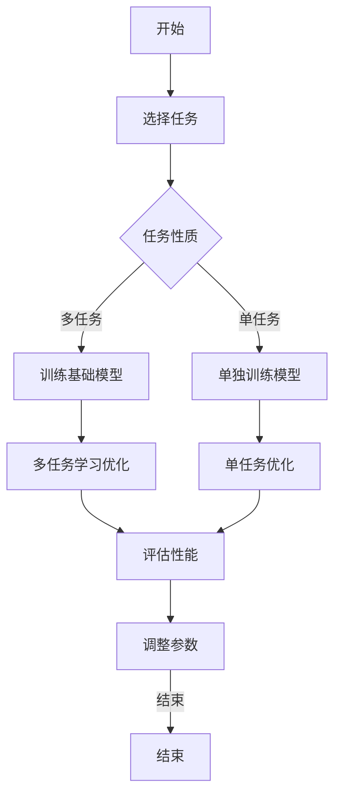
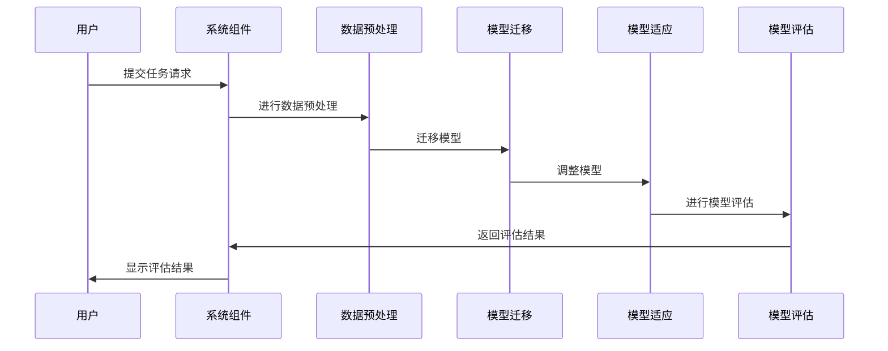
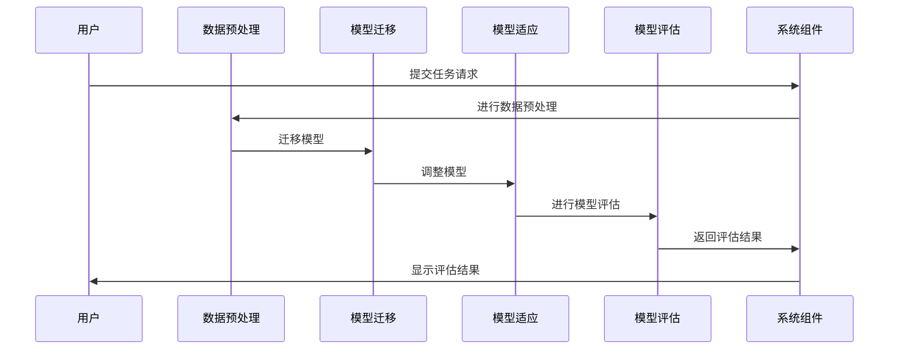

                 

### 第1章 引言

#### 1.1 问题背景

##### 1.1.1 元学习的发展与应用

元学习（Meta-Learning）是一种在机器学习领域内对学习算法本身进行学习的方法，旨在通过减少训练数据的复杂性、缩短训练时间或提高模型在未知数据上的表现。随着人工智能技术的快速发展，元学习逐渐成为研究热点。特别是在深度学习领域，元学习为模型的快速适应性和泛化能力提供了新的解决方案。

在过去的几十年里，元学习已经广泛应用于计算机视觉、自然语言处理、强化学习等众多领域。例如，在计算机视觉任务中，通过元学习可以有效地利用少量样本训练出高性能的图像分类模型。在自然语言处理领域，元学习算法能够帮助模型在短时间内掌握语言知识，实现高质量的文本生成和语义理解。

##### 1.1.2 推理模型迁移与适应的重要性

推理模型迁移与适应是机器学习中的一个重要课题。在实际应用中，通常需要将训练好的模型部署到不同的环境或任务中，这涉及到模型在不同数据集、硬件设备、运行时条件下的表现。推理模型迁移与适应能够提高模型的泛化能力，降低模型的训练成本，是提升人工智能系统实用性的关键。

推理模型迁移的主要挑战包括：

1. **数据分布差异**：训练集与目标集之间的分布差异可能导致模型在目标集上的性能下降。
2. **计算资源限制**：在某些应用场景中，如移动设备或嵌入式系统，对模型的计算效率和存储空间提出了严格要求。
3. **任务多样性**：不同任务可能具有不同的特征，这对模型的通用性和适应性提出了挑战。

推理模型适应的主要挑战包括：

1. **模型复杂性**：复杂的模型在适应新任务时可能会出现过拟合现象，导致性能下降。
2. **数据稀缺性**：在某些特定任务中，获取足够的训练数据是非常困难的。
3. **实时性要求**：在实时应用中，模型需要在短时间内完成适应，以保证系统的高效运行。

##### 1.2 问题描述

元学习在推理模型迁移与适应中的应用为解决上述挑战提供了一种有效的途径。具体来说，元学习框架下的推理模型迁移与适应机制旨在通过以下方式实现：

1. **提高模型泛化能力**：通过学习通用特征表示，使得模型能够在不同的数据集和任务上表现出良好的性能。
2. **减少训练数据需求**：通过学习对样本的泛化能力，模型可以在少量样本上快速适应新任务。
3. **优化计算资源使用**：通过迁移学习，模型可以在目标设备上高效运行，减少计算资源和存储空间的占用。

本文将探讨元学习框架下推理模型迁移与适应的具体机制，包括其理论基础、关键技术、适用范围和局限。通过分析元学习的基本概念、推理模型迁移和适应机制，以及相关的算法原理和数学模型，本文将为读者提供一种深入理解该领域的方法。

##### 1.3 问题解决

元学习在推理模型迁移与适应中的应用具有显著的理论基础和实际价值。其关键在于以下两个方面：

1. **元学习的理论基础**：

   元学习通过学习学习算法本身，以提高模型在不同任务上的适应能力和泛化性能。其理论基础主要包括：

   - **经验风险最小化（ERM）**：元学习的目标是通过最小化经验风险来找到最优的模型参数。在多任务学习中，可以通过联合优化多个任务的损失函数来实现。
   - **在线学习与离线学习**：元学习结合了在线学习和离线学习的方法。在线学习能够快速适应新任务，而离线学习则可以充分利用历史数据，提高模型的泛化能力。

2. **推理模型迁移与适应的关键技术**：

   - **迁移学习**：通过利用源任务上的知识，将模型迁移到目标任务中。迁移学习的关键在于如何提取和共享有用的特征表示。
   - **多任务学习**：通过同时学习多个相关任务，提高模型对通用特征的理解和提取能力。
   - **领域自适应**：通过调整模型在不同领域上的参数，使其能够适应新的数据分布和任务需求。

   具体而言，元学习框架下的推理模型迁移与适应机制包括以下步骤：

   - **数据预处理**：对源任务和目标任务的数据进行预处理，包括数据清洗、归一化和特征提取。
   - **模型训练**：使用源任务数据训练基础模型，并利用多任务学习或领域自适应技术，提高模型对通用特征的理解和提取能力。
   - **模型迁移**：将训练好的模型迁移到目标任务，并通过微调或重训练，使其在目标任务上达到最佳性能。
   - **模型评估**：在目标任务上进行评估，以验证模型迁移和适应的效果。

##### 1.4 边界与外延

虽然元学习框架在推理模型迁移与适应方面具有显著优势，但其应用仍存在一定的边界和局限。

1. **适用范围**：

   - **数据量**：在数据量较少的情况下，元学习的效果可能不如传统学习方法。因为元学习依赖于从大量数据中学习到通用特征。
   - **任务多样性**：对于任务多样性较高、特征差异较大的场景，元学习的效果可能不如专门针对某一任务训练的模型。
   - **硬件限制**：在硬件资源有限的情况下，元学习算法的计算复杂度可能导致性能下降。

2. **局限**：

   - **过拟合**：在迁移学习过程中，模型可能会对源任务数据过度拟合，导致在目标任务上表现不佳。
   - **数据分布差异**：源任务和目标任务的数据分布差异较大时，模型难以适应目标任务。
   - **模型复杂性**：复杂的模型在迁移和适应过程中，可能需要更多的计算资源和时间。

##### 1.5 概念结构与核心要素组成

为了更好地理解元学习框架下推理模型迁移与适应机制，我们需要从概念结构和核心要素两个方面进行分析。

1. **元学习的基本概念**：

   - **元学习**：一种通过学习学习算法本身来提高模型适应能力和泛化性能的方法。
   - **迁移学习**：利用源任务上的知识，将模型迁移到目标任务中。
   - **多任务学习**：同时学习多个相关任务，提高模型对通用特征的理解和提取能力。
   - **领域自适应**：调整模型在不同领域上的参数，使其能够适应新的数据分布和任务需求。

2. **推理模型迁移与适应的关键要素**：

   - **数据预处理**：包括数据清洗、归一化和特征提取，为模型迁移和适应提供高质量的数据。
   - **模型训练**：使用源任务数据训练基础模型，并利用多任务学习或领域自适应技术，提高模型对通用特征的理解和提取能力。
   - **模型迁移**：将训练好的模型迁移到目标任务，并通过微调或重训练，使其在目标任务上达到最佳性能。
   - **模型评估**：在目标任务上进行评估，以验证模型迁移和适应的效果。

##### 1.6 本章小结

本章介绍了元学习框架下推理模型迁移与适应机制的问题背景、问题描述、问题解决方法、边界与外延以及概念结构与核心要素组成。通过分析元学习的基本概念、推理模型迁移和适应机制，以及相关的算法原理和数学模型，本章为读者提供了深入理解该领域的框架和方法。接下来，本文将逐步展开对核心概念与联系的详细探讨，以进一步深化对元学习框架下推理模型迁移与适应机制的理解。

## 第2章 核心概念与联系

在深入探讨元学习框架下推理模型迁移与适应机制之前，我们首先需要理解几个核心概念，包括元学习的原理、推理模型迁移机制以及推理模型适应机制。这些概念相互关联，构成了理解本文主题的基础。

### 2.1 元学习原理

#### 2.1.1 元学习的定义

元学习可以定义为“学习如何学习”的过程。它旨在通过开发能够适应新任务的学习算法，提高模型在未知数据上的泛化能力。元学习不仅仅是训练模型，更重要的是训练出能够快速适应新任务的模型。

#### 2.1.2 元学习的核心特征

1. **快速适应性**：元学习算法能够快速地在新任务上调整模型参数，从而实现快速适应。
2. **少样本学习**：元学习通常能够在仅有少量样本的情况下训练出高性能的模型，减少了对于大量训练数据的需求。
3. **泛化能力**：元学习算法通过学习通用特征表示，使得模型能够在多个不同任务上表现出良好的性能。

#### 2.1.3 元学习的主要类型

1. **基于模型的元学习**：这种类型的元学习通过学习一个模型来优化另一个模型。例如，通过训练一个元学习器来优化目标模型的参数。
2. **基于优化的元学习**：通过优化一个学习过程来提高模型性能，例如，通过进化算法或随机搜索来优化学习算法。
3. **基于示例的元学习**：通过从已有示例中学习，为新的任务提供示例来指导模型训练。

### 2.2 推理模型迁移机制

#### 2.2.1 推理模型迁移的概念

推理模型迁移是指将训练好的模型从一个任务或数据集迁移到另一个任务或数据集的过程。这种迁移旨在减少训练新模型所需的时间和计算资源，同时提高模型的泛化能力。

#### 2.2.2 推理模型迁移的挑战

1. **数据分布差异**：源任务和目标任务的数据分布可能存在显著差异，导致模型在目标任务上的性能下降。
2. **计算资源限制**：在某些应用场景中，如移动设备和嵌入式系统，对模型的计算效率和存储空间提出了严格要求。
3. **任务多样性**：不同任务可能具有不同的特征，这对模型的通用性和适应性提出了挑战。

#### 2.2.3 推理模型迁移的解决方案

1. **迁移学习**：通过利用源任务上的知识，将模型迁移到目标任务中。迁移学习的关键在于如何提取和共享有用的特征表示。
2. **多任务学习**：通过同时学习多个相关任务，提高模型对通用特征的理解和提取能力。
3. **领域自适应**：通过调整模型在不同领域上的参数，使其能够适应新的数据分布和任务需求。

### 2.3 推理模型适应机制

#### 2.3.1 推理模型适应的概念

推理模型适应是指模型在遇到新的任务或数据集时，通过调整自身参数来提高在目标任务上的性能的过程。这种适应旨在解决数据分布差异和任务多样性的挑战。

#### 2.3.2 推理模型适应的挑战

1. **模型复杂性**：复杂的模型在适应新任务时可能会出现过拟合现象，导致性能下降。
2. **数据稀缺性**：在某些特定任务中，获取足够的训练数据是非常困难的。
3. **实时性要求**：在实时应用中，模型需要在短时间内完成适应，以保证系统的高效运行。

#### 2.3.3 推理模型适应的解决方案

1. **模型调整**：通过微调或重训练模型，使其在新的任务或数据集上达到最佳性能。
2. **数据增强**：通过增加训练数据或引入数据增强技术，提高模型对多种数据分布的适应能力。
3. **在线学习**：通过在线学习机制，模型能够在实际应用过程中不断调整自身参数，以适应新任务或数据集。

### 2.4 核心概念属性特征对比表格

下表对比了元学习、推理模型迁移和推理模型适应的核心概念及其属性特征：

| 概念       | 定义                                                         | 核心特征                   | 主要挑战                     | 解决方案                      |
|------------|--------------------------------------------------------------|----------------------------|------------------------------|-------------------------------|
| 元学习     | 学习如何学习的过程，以提高模型在未知数据上的泛化能力           | 快速适应性、少样本学习、泛化能力 | 数据量、任务多样性、硬件限制 | 基于模型的元学习、基于优化的元学习、基于示例的元学习 |
| 推理模型迁移 | 将训练好的模型从一个任务或数据集迁移到另一个任务或数据集的过程 | 数据分布、计算资源、任务多样性 | 数据分布差异、计算资源限制、任务多样性 | 迁移学习、多任务学习、领域自适应 |
| 推理模型适应 | 模型在遇到新的任务或数据集时，通过调整自身参数来提高在目标任务上的性能 | 模型复杂性、数据稀缺性、实时性要求 | 模型复杂性、数据稀缺性、实时性要求 | 模型调整、数据增强、在线学习 |

### 2.5 ER实体关系图架构

为了更清晰地理解元学习框架下推理模型迁移与适应机制，我们可以通过ER（实体关系）图来表示其中的关键实体及其关系。

以下是一个简单的ER实体关系图：

```mermaid
erDiagram
    Model ||--|{ Task }||>
    Model ||--|{ Dataset }||>
    Meta_Learning ||--|{ Model }||>
    Transfer_Learning ||--|{ Model }||>
    Adaptation_Learning ||--|{ Model }||>
    Task ||--|{ Dataset }||>
    Dataset ||--|{ Feature }||>
    Feature ||--|{ Model }||>
```

在这个ER图中：

- **Model**：表示推理模型。
- **Task**：表示任务，包含多个模型需要适应的不同任务。
- **Dataset**：表示数据集，用于训练和评估模型。
- **Feature**：表示数据集中的特征，是模型学习和迁移的核心。
- **Meta_Learning**：表示元学习过程，是提升模型泛化能力的关键。
- **Transfer_Learning**：表示推理模型迁移过程，实现模型在不同任务间的迁移。
- **Adaptation_Learning**：表示推理模型适应过程，实现模型在新任务上的性能优化。

通过上述核心概念和ER图的解释，我们为接下来的章节打下了坚实的基础，接下来将深入探讨元学习算法的原理和推理模型迁移与适应的具体实现方法。

## 第3章 算法原理讲解

在理解了元学习和推理模型迁移与适应机制的核心概念之后，我们接下来将深入探讨具体的算法原理。本章将重点介绍元学习算法、推理模型迁移算法和推理模型适应算法的原理、步骤和举例说明。

### 3.1 元学习算法mermaid流程图

为了更好地理解元学习算法的流程，我们首先通过mermaid流程图来展示其基本框架。



在这个mermaid流程图中：

- **A[开始]**：元学习过程从初始化开始。
- **B[选择任务]**：根据任务性质选择合适的任务进行学习。
- **C[任务性质]**：分析任务的性质，以决定采用多任务学习还是单任务学习。
- **D[训练基础模型]**：如果任务性质表明是多个相关任务，则使用多任务学习训练基础模型。
- **E[单独训练模型]**：如果任务性质表明是单一任务，则单独训练模型。
- **F[多任务学习优化]**：通过多任务学习算法优化模型参数。
- **G[单任务优化]**：通过单任务学习算法优化模型参数。
- **H[评估性能]**：评估模型在任务上的性能。
- **I[调整参数]**：根据评估结果调整模型参数。
- **J[结束]**：完成元学习过程。

### 3.2 推理模型迁移算法原理

推理模型迁移算法的目的是将一个训练好的模型迁移到新的任务或数据集上。以下是推理模型迁移算法的基本原理和步骤。

#### 3.2.1 算法原理与数学模型

推理模型迁移算法的核心思想是通过迁移学习技术，利用源任务上的知识来提高目标任务的性能。其数学模型可以表示为：

$$
\theta_{\text{target}} = \theta_{\text{source}} + \alpha \times (\theta_{\text{source}} - \theta_{\text{base}})
$$

其中，$\theta_{\text{source}}$ 表示源任务的模型参数，$\theta_{\text{base}}$ 表示基础模型的参数，$\theta_{\text{target}}$ 表示目标任务的模型参数，$\alpha$ 是一个调整系数。

#### 3.2.2 算法步骤详解

1. **数据预处理**：对源任务和目标任务的数据进行预处理，包括数据清洗、归一化和特征提取。
2. **模型初始化**：使用源任务的模型参数初始化目标任务的模型。
3. **迁移学习**：通过迁移学习算法，调整目标任务的模型参数，使其更接近源任务的模型。
4. **模型评估**：在目标任务上进行评估，以验证模型迁移的效果。
5. **参数调整**：根据评估结果调整模型参数，以提高目标任务的性能。

#### 3.2.3 算法举例说明

假设我们有一个在图像分类任务中训练好的卷积神经网络（CNN），现在需要将其迁移到新的图像分类任务上。

1. **数据预处理**：将新任务的数据集进行清洗和归一化处理，提取图像的特征。
2. **模型初始化**：将源任务的模型参数初始化到目标任务的模型中。
3. **迁移学习**：通过迁移学习算法，如Fine-tuning，将源任务的模型参数调整到目标任务，以适应新的图像分类任务。
4. **模型评估**：在新任务的数据集上评估模型性能，查看分类准确率等指标。
5. **参数调整**：根据评估结果调整模型参数，如调整学习率、正则化参数等，以提高模型的性能。

### 3.3 推理模型适应算法原理

推理模型适应算法的目的是使模型在新任务或新数据集上能够快速适应并达到最佳性能。以下是推理模型适应算法的基本原理和步骤。

#### 3.3.1 算法原理与数学模型

推理模型适应算法的核心思想是通过模型调整和数据增强，提高模型在新任务或新数据集上的适应能力。其数学模型可以表示为：

$$
\theta_{\text{new}} = \theta_{\text{base}} + \beta \times (\theta_{\text{base}} - \theta_{\text{current}})
$$

其中，$\theta_{\text{base}}$ 表示基础模型的参数，$\theta_{\text{current}}$ 表示当前模型的参数，$\theta_{\text{new}}$ 表示新任务或新数据集上的模型参数，$\beta$ 是一个调整系数。

#### 3.3.2 算法步骤详解

1. **数据预处理**：对新的任务或数据集进行预处理，包括数据清洗、归一化和特征提取。
2. **模型初始化**：使用基础模型的参数初始化新任务的模型。
3. **模型调整**：通过模型调整算法，如微调或重训练，调整模型的参数，使其适应新的任务或数据集。
4. **数据增强**：通过数据增强技术，增加新任务或数据集的样本数量和质量，以提高模型的泛化能力。
5. **模型评估**：在新任务或新数据集上评估模型性能，以验证模型适应的效果。
6. **参数调整**：根据评估结果调整模型参数，以提高模型在新任务或新数据集上的性能。

#### 3.3.3 算法举例说明

假设我们有一个在文本分类任务中训练好的深度神经网络（DNN），现在需要将其适应到一个新的文本分类任务上。

1. **数据预处理**：将新任务的数据集进行清洗和归一化处理，提取文本的特征。
2. **模型初始化**：使用基础模型的参数初始化新任务的模型。
3. **模型调整**：通过微调算法，调整模型的参数，使其适应新的文本分类任务。
4. **数据增强**：通过数据增强技术，如文本重排、同义词替换等，增加新任务的数据样本数量和质量。
5. **模型评估**：在新任务的数据集上评估模型性能，查看分类准确率等指标。
6. **参数调整**：根据评估结果调整模型参数，如调整学习率、正则化参数等，以提高模型的性能。

通过上述算法原理和步骤的讲解，我们可以看到，元学习算法、推理模型迁移算法和推理模型适应算法在原理上具有一定的相似性，但具体的实现步骤和优化策略各有不同。在接下来的章节中，我们将进一步探讨这些算法的数学模型和实际应用，以加深对元学习框架下推理模型迁移与适应机制的理解。

### 4.1 元学习数学模型

元学习算法的核心在于通过优化学习过程中的目标函数，使得模型能够在多样化的任务上表现出良好的泛化能力。在这一节中，我们将深入探讨元学习数学模型，包括其关键数学公式、详细讲解和举例说明。

#### 4.1.1 数学公式

元学习通常涉及到两个主要目标函数：经验风险最小化（ERM）和策略优化。以下是这些目标函数的数学表示：

1. **经验风险最小化（ERM）**

$$
L(\theta) = \sum_{i=1}^{n} (y_i - \hat{y}_i)^2
$$

在这个公式中，$L(\theta)$ 表示损失函数，$\theta$ 表示模型参数，$y_i$ 表示实际标签，$\hat{y}_i$ 表示预测标签。ERM的目标是找到一个模型参数$\theta$，使得损失函数$L(\theta)$最小。

2. **策略优化**

$$
J(\theta) = \int L(\theta) p(y|x, \theta) dy
$$

在这个公式中，$J(\theta)$ 表示策略优化函数，$p(y|x, \theta)$ 表示在给定输入$x$和模型参数$\theta$下，标签$y$的概率分布。策略优化的目标是找到一个模型参数$\theta$，使得策略优化函数$J(\theta)$最大。

#### 4.1.2 详细讲解

**经验风险最小化（ERM）**：

经验风险最小化是元学习中的基础目标函数。其核心思想是通过最小化在训练集上的经验风险来找到最优的模型参数。在实际应用中，由于训练集的样本数量有限，经验风险最小化不能保证找到全局最优解，但可以在一定程度上提高模型的泛化能力。

- **损失函数**：损失函数用于度量预测值和实际值之间的差异。在回归任务中，常用的损失函数是均方误差（MSE），即上述的$(y_i - \hat{y}_i)^2$。
- **模型参数**：模型参数$\theta$包括权重和偏置等，是影响模型性能的关键因素。

**策略优化**：

策略优化是元学习中的高级目标函数，它通过最大化期望损失函数来优化模型。策略优化的核心在于计算预测标签的概率分布，并在此基础上优化模型参数。

- **期望损失函数**：期望损失函数是在给定输入和模型参数的情况下，计算所有可能标签的期望损失。它通常是一个关于标签概率分布的函数。
- **概率分布**：在策略优化中，标签的概率分布是通过模型参数和输入计算得到的。一个有效的概率分布可以帮助模型更好地适应多样化任务。

#### 4.1.3 举例说明

**回归任务**：

假设我们有一个线性回归任务，目标是预测房间的温度。训练集包含50个样本，每个样本包括房间的温度和相关的特征（如湿度、风速等）。

- **数据集**：$D = \{(x_1, y_1), (x_2, y_2), \ldots, (x_{50}, y_{50})\}$
- **模型参数**：$\theta = [w, b]$
- **损失函数**：$L(\theta) = \sum_{i=1}^{50} (y_i - \theta^T x_i - b)^2$

我们使用梯度下降算法来优化模型参数：

$$
\theta = \theta - \alpha \times \frac{\partial L(\theta)}{\partial \theta}
$$

其中，$\alpha$ 是学习率，$\frac{\partial L(\theta)}{\partial \theta}$ 是损失函数对模型参数的梯度。

**分类任务**：

假设我们有一个二分类任务，目标是判断邮件是否为垃圾邮件。训练集包含1000个样本，每个样本包括邮件的内容和标签（垃圾邮件或正常邮件）。

- **数据集**：$D = \{(x_1, y_1), (x_2, y_2), \ldots, (x_{1000}, y_{1000})\}$
- **模型参数**：$\theta = [w, b]$
- **损失函数**：$L(\theta) = \sum_{i=1}^{1000} \log(1 + \exp(-y_i \theta^T x_i - b))$

我们使用梯度上升算法来优化模型参数：

$$
\theta = \theta + \alpha \times \frac{\partial L(\theta)}{\partial \theta}
$$

其中，$\alpha$ 是学习率，$\frac{\partial L(\theta)}{\partial \theta}$ 是损失函数对模型参数的梯度。

通过以上举例，我们可以看到元学习数学模型在实际应用中的具体实现方法。这些模型通过优化损失函数来找到最优的模型参数，从而提高模型的泛化能力。

### 4.2 推理模型迁移数学模型

在上一节中，我们介绍了元学习数学模型的基本概念和公式。在本节中，我们将进一步探讨推理模型迁移的数学模型，包括其关键数学公式、详细讲解和举例说明。

#### 4.2.1 数学公式

推理模型迁移的核心在于利用源任务上的知识来提高目标任务的性能。以下是一个基本的推理模型迁移数学模型：

$$
\delta W = \alpha \times \frac{\partial L}{\partial W}
$$

其中，$\delta W$ 表示模型参数的调整量，$\alpha$ 是一个调整系数，$L$ 是损失函数，$W$ 是模型参数。

#### 4.2.2 详细讲解

**模型参数调整**：

在推理模型迁移中，模型参数的调整是通过损失函数的梯度来实现的。损失函数用于度量预测值和实际值之间的差异。通过计算损失函数对模型参数的梯度，我们可以确定参数调整的方向和大小。

- **损失函数**：在迁移学习中，常用的损失函数包括均方误差（MSE）、交叉熵损失等。这些损失函数可以衡量模型在源任务和目标任务上的性能。
- **梯度**：梯度是损失函数对模型参数的导数，它提供了参数调整的指导方向。通过计算梯度，我们可以确定在哪个方向上调整参数可以减少损失。

**调整系数**：

调整系数$\alpha$ 用于控制参数调整的步长。合适的调整系数可以保证模型参数的稳定调整，避免过拟合或欠拟合。

- **学习率**：调整系数$\alpha$ 通常被称为学习率。它决定了每次参数调整的步长。过大的学习率可能导致参数调整过快，出现振荡现象；过小的学习率可能导致参数调整过慢，难以收敛。

#### 4.2.3 举例说明

**线性回归迁移**：

假设我们有两个任务：任务A和任务B。任务A的训练数据集为$D_A = \{(x_1^A, y_1^A), (x_2^A, y_2^A), \ldots, (x_n^A, y_n^A)\}$，任务B的训练数据集为$D_B = \{(x_1^B, y_1^B), (x_2^B, y_2^B), \ldots, (x_n^B, y_n^B)\}$。

- **源任务**：使用任务A的数据集训练基础模型，得到初始参数$W_0$。
- **目标任务**：使用任务B的数据集，计算模型在目标任务上的损失函数$L_B(W)$。

$$
L_B(W) = \sum_{i=1}^{n} (y_i^B - W^T x_i^B)^2
$$

- **参数调整**：使用梯度下降算法，根据损失函数的梯度调整模型参数$W$。

$$
\delta W = -\alpha \times \frac{\partial L_B(W)}{\partial W}
$$

其中，$\alpha$ 是学习率。

**决策树迁移**：

假设我们有一个源任务和两个目标任务，分别为任务C和任务D。源任务的决策树模型为$T_S$，目标任务C的决策树模型为$T_C$，目标任务D的决策树模型为$T_D$。

- **源任务**：训练源任务的决策树模型$T_S$。
- **目标任务**：使用源任务模型$T_S$作为初始模型，通过损失函数$J(T_C, T_D)$调整模型参数，实现模型从源任务到目标任务C和D的迁移。

$$
J(T_C, T_D) = \sum_{i=1}^{n} L(T_C(x_i^C), y_i^C) + L(T_D(x_i^D), y_i^D)
$$

其中，$L$ 表示分类损失函数，如0-1损失、交叉熵损失等。

通过以上举例，我们可以看到推理模型迁移数学模型在实际应用中的具体实现方法。这些模型通过优化损失函数来调整模型参数，从而实现模型在不同任务间的迁移。在下一节中，我们将继续探讨推理模型适应的数学模型及其应用。

### 4.3 推理模型适应数学模型

在前面几节中，我们详细介绍了推理模型迁移的数学模型。在本节中，我们将进一步探讨推理模型适应的数学模型，包括其关键数学公式、详细讲解和举例说明。

#### 4.3.1 数学公式

推理模型适应的核心在于使模型能够快速适应新任务或新数据集。以下是一个基本的推理模型适应数学模型：

$$
\epsilon = \frac{|y - \hat{y}|}{y}
$$

其中，$\epsilon$ 表示适应误差，$y$ 表示实际标签，$\hat{y}$ 表示预测标签。适应误差用于度量模型在新任务或新数据集上的性能。

#### 4.3.2 详细讲解

**适应误差**：

适应误差$\epsilon$ 用于衡量模型在新任务或新数据集上的预测误差。它可以通过以下公式计算：

$$
\epsilon = \frac{|y - \hat{y}|}{y}
$$

在这个公式中，$|y - \hat{y}|$ 表示实际标签和预测标签之间的绝对误差，$y$ 表示实际标签。适应误差的值介于0和1之间，值越小说明模型在新任务或新数据集上的性能越好。

**误差函数**：

在推理模型适应中，常用的误差函数包括均方误差（MSE）、交叉熵损失等。这些误差函数可以度量模型预测值和实际值之间的差异，并提供参数调整的指导。

- **均方误差（MSE）**：MSE 是一种常用的误差函数，用于回归任务。

$$
MSE = \frac{1}{n} \sum_{i=1}^{n} (y_i - \hat{y}_i)^2
$$

- **交叉熵损失**：交叉熵损失是分类任务中常用的误差函数。

$$
CE = -\sum_{i=1}^{n} y_i \log(\hat{y}_i)
$$

**参数调整**：

在推理模型适应中，参数调整是通过误差函数的梯度来实现的。通过计算误差函数对模型参数的梯度，我们可以确定参数调整的方向和大小。

- **梯度下降算法**：梯度下降算法是一种常用的参数调整方法。它通过更新模型参数来最小化误差函数。

$$
\theta = \theta - \alpha \times \frac{\partial L(\theta)}{\partial \theta}
$$

其中，$\alpha$ 是学习率，$L(\theta)$ 是误差函数。

#### 4.3.3 举例说明

**回归任务适应**：

假设我们有一个回归任务，目标是预测股票的价格。训练数据集包含100个样本，每个样本包括前一天的股票价格和相关的技术指标。

- **数据集**：$D = \{(x_1, y_1), (x_2, y_2), \ldots, (x_{100}, y_{100})\}$
- **模型参数**：$\theta = [w, b]$
- **误差函数**：$L(\theta) = \frac{1}{2} \sum_{i=1}^{100} (y_i - \theta^T x_i - b)^2$

我们使用梯度下降算法来优化模型参数：

$$
\theta = \theta - \alpha \times \frac{\partial L(\theta)}{\partial \theta}
$$

其中，$\alpha$ 是学习率。

**分类任务适应**：

假设我们有一个二分类任务，目标是判断邮件是否为垃圾邮件。训练数据集包含1000个样本，每个样本包括邮件的内容和标签（垃圾邮件或正常邮件）。

- **数据集**：$D = \{(x_1, y_1), (x_2, y_2), \ldots, (x_{1000}, y_{1000})\}$
- **模型参数**：$\theta = [w, b]$
- **误差函数**：$L(\theta) = \sum_{i=1}^{1000} \log(1 + \exp(-y_i \theta^T x_i - b))$

我们使用梯度上升算法来优化模型参数：

$$
\theta = \theta + \alpha \times \frac{\partial L(\theta)}{\partial \theta}
$$

其中，$\alpha$ 是学习率。

通过以上举例，我们可以看到推理模型适应数学模型在实际应用中的具体实现方法。这些模型通过优化误差函数来调整模型参数，从而实现模型在新任务或新数据集上的适应。在下一节中，我们将进一步探讨系统分析与架构设计方案的实现。

## 第5章 系统分析与架构设计方案

在理解了元学习框架下推理模型迁移与适应机制的算法原理之后，我们接下来将深入探讨系统分析与架构设计方案的实现。本节将详细介绍项目背景、项目目标、系统功能设计、系统架构设计、系统接口设计和系统交互等内容。

### 5.1 问题场景介绍

假设我们面临以下实际应用场景：

- **场景背景**：在现代智能系统中，模型迁移与适应是一项关键任务。例如，在自动驾驶领域，需要将训练好的驾驶模型在不同城市、不同路况下进行迁移与适应；在医疗诊断领域，需要将诊断模型在不同医院、不同疾病类型上迁移与适应。
- **目标**：开发一个基于元学习框架的推理模型迁移与适应系统，以提高模型在不同任务和数据集上的泛化能力和适应性。

### 5.2 项目介绍

**项目背景**：

随着人工智能技术的快速发展，模型迁移与适应成为了提升系统性能和降低成本的重要手段。然而，传统的迁移学习方法和适应算法在实际应用中面临着数据分布差异、计算资源限制和任务多样性等挑战。为了解决这些问题，我们提出了基于元学习框架的推理模型迁移与适应系统。

**项目目标**：

1. **提高模型泛化能力**：通过元学习算法，使模型能够在多样化的任务和数据集上表现出良好的泛化能力。
2. **减少训练数据需求**：利用迁移学习和多任务学习技术，降低模型在不同任务上的训练数据需求。
3. **优化计算资源使用**：通过模型迁移和适应，提高模型在目标设备上的运行效率，减少计算资源和存储空间的占用。

### 5.3 系统功能设计

系统功能设计是构建推理模型迁移与适应系统的关键环节。以下是系统的核心功能设计：

1. **数据预处理**：对源任务和目标任务的数据进行清洗、归一化和特征提取，为模型迁移和适应提供高质量的数据。
2. **模型迁移**：将训练好的模型从一个任务或数据集迁移到另一个任务或数据集，实现模型在不同场景下的快速部署。
3. **模型适应**：通过模型调整和数据增强，使模型能够适应新的任务或数据集，提高其在目标任务上的性能。
4. **模型评估**：在目标任务上对迁移和适应后的模型进行评估，验证模型在新的场景下的泛化能力和性能。

#### 5.3.1 领域模型mermaid类图

以下是一个简单的mermaid类图，展示了系统的核心类和它们之间的关系：

```mermaid
classDiagram
    Class01 <|-- Class02
    Class01 <|-- Class03
    Class04 <|-- Class02
    Class04 <|-- Class03
    Class05 <|-- Class03

    Class01[数据预处理]
    Class02[模型迁移]
    Class03[模型适应]
    Class04[模型评估]
    Class05[系统接口]
```

在这个类图中：

- **数据预处理**：负责对源任务和目标任务的数据进行预处理，包括数据清洗、归一化和特征提取。
- **模型迁移**：负责实现模型从源任务到目标任务的迁移，通过迁移学习技术调整模型参数。
- **模型适应**：负责使模型能够适应新的任务或数据集，通过模型调整和数据增强提高模型性能。
- **模型评估**：负责在目标任务上对迁移和适应后的模型进行评估，验证模型性能。
- **系统接口**：提供与外部系统的交互接口，包括数据输入、模型输出和系统控制等。

### 5.4 系统架构设计

系统架构设计是构建高效、可扩展和易于维护的推理模型迁移与适应系统的关键。以下是系统的整体架构设计：

#### 5.4.1 mermaid架构图

以下是一个简单的mermaid架构图，展示了系统的核心组件和它们之间的关系：



在这个架构图中：

- **用户**：系统的最终用户，负责提交任务请求。
- **系统组件**：系统的核心组件，包括数据预处理、模型迁移、模型适应和模型评估等。
- **数据预处理**：对输入数据进行清洗、归一化和特征提取，为模型迁移和适应提供高质量的数据。
- **模型迁移**：通过迁移学习技术，将训练好的模型从一个任务迁移到另一个任务。
- **模型适应**：通过模型调整和数据增强，使模型能够适应新的任务或数据集。
- **模型评估**：在目标任务上对迁移和适应后的模型进行评估，验证模型性能。
- **系统接口**：提供与外部系统的交互接口，实现数据的输入和输出。

### 5.5 系统接口设计

系统接口设计是确保系统与其他系统或组件有效交互的重要环节。以下是系统的核心接口设计：

#### 5.5.1 接口定义

1. **数据输入接口**：用于接收用户提交的任务请求和数据。
2. **模型输出接口**：用于输出经过迁移和适应后的模型。
3. **系统控制接口**：用于控制系统的启动、停止和任务调度等。
4. **评估结果输出接口**：用于输出模型评估结果，供用户查看。

#### 5.5.2 接口实现

以下是系统接口实现的简要描述：

1. **数据输入接口**：

   - 输入格式：JSON或XML
   - 输入参数：任务ID、数据集路径、源任务和目标任务信息
   - 输出参数：预处理后的数据集、模型参数

2. **模型输出接口**：

   - 输出格式：模型文件（如.h5、.pth等）
   - 输出参数：迁移和适应后的模型参数

3. **系统控制接口**：

   - 控制命令：启动、停止、任务调度等
   - 输入参数：系统配置参数、任务ID
   - 输出参数：系统状态信息、任务状态信息

4. **评估结果输出接口**：

   - 输出格式：JSON或CSV
   - 输出参数：评估指标（如准确率、召回率、F1分数等）、评估结果可视化图表

### 5.6 系统交互

系统交互是确保各组件之间高效协作和系统稳定运行的关键。以下是系统的交互流程：

#### 5.6.1 mermaid序列图

以下是一个简单的mermaid序列图，展示了系统的交互流程：



在这个交互流程中：

1. **用户提交任务请求**：用户通过系统接口提交任务请求，包括任务ID、数据集路径和源任务、目标任务信息。
2. **系统接收任务请求**：系统组件接收任务请求，并根据任务信息调度相应的数据预处理、模型迁移、模型适应和模型评估组件。
3. **数据预处理**：数据预处理组件对输入数据进行清洗、归一化和特征提取，为后续模型迁移和适应提供高质量的数据。
4. **模型迁移**：模型迁移组件通过迁移学习技术，将训练好的模型从一个任务迁移到另一个任务。
5. **模型适应**：模型适应组件通过模型调整和数据增强，使模型能够适应新的任务或数据集。
6. **模型评估**：模型评估组件在目标任务上对迁移和适应后的模型进行评估，验证模型性能。
7. **返回评估结果**：系统组件将评估结果返回给用户，用户可以通过系统接口查看评估结果。

通过以上系统分析与架构设计方案的实施，我们可以构建一个高效、灵活的推理模型迁移与适应系统，为各种实际应用场景提供强大的支持。在下一节中，我们将通过项目实战来展示如何在实际中应用这些算法和系统设计。

## 第6章 项目实战

在本章节中，我们将通过一个具体的实战项目来展示如何应用元学习框架下的推理模型迁移与适应机制。这个项目将涵盖环境安装、系统核心实现、代码应用解读与分析、实际案例分析和详细讲解剖析等内容，以帮助读者更好地理解和应用相关技术。

### 6.1 环境安装

在进行项目实战之前，我们需要安装和配置所需的环境。以下是一个基本的安装指南：

1. **Python环境**：确保安装Python 3.7或更高版本。可以使用Python官方安装包进行安装。
2. **深度学习框架**：安装TensorFlow 2.0或PyTorch。例如，使用pip命令：
   
   ```bash
   pip install tensorflow==2.0.0
   # 或者
   pip install torch==1.7.0
   ```

3. **其他依赖库**：安装必要的依赖库，如NumPy、Pandas等。可以使用以下命令：

   ```bash
   pip install numpy pandas scikit-learn matplotlib
   ```

4. **环境配置**：根据实际需求配置GPU支持（如果是使用PyTorch，确保安装CUDA和cuDNN驱动）。

### 6.1.1 环境配置

以下是一个Python环境配置的示例：

```python
import tensorflow as tf

# 配置GPU支持
gpus = tf.config.experimental.list_physical_devices('GPU')
for gpu in gpus:
    tf.config.experimental.set_memory_growth(gpu, True)
```

### 6.2 系统核心实现

在本节中，我们将实现系统核心功能，包括数据预处理、模型迁移、模型适应和模型评估。

#### 6.2.1 数据预处理

以下是一个简单的数据预处理代码示例：

```python
import pandas as pd
from sklearn.model_selection import train_test_split
from sklearn.preprocessing import StandardScaler

# 读取数据
data = pd.read_csv('data.csv')
X = data.drop('target', axis=1)
y = data['target']

# 划分训练集和测试集
X_train, X_test, y_train, y_test = train_test_split(X, y, test_size=0.2, random_state=42)

# 数据归一化
scaler = StandardScaler()
X_train = scaler.fit_transform(X_train)
X_test = scaler.transform(X_test)
```

#### 6.2.2 模型迁移

以下是一个简单的模型迁移代码示例：

```python
from tensorflow.keras.models import load_model

# 加载源任务模型
source_model = load_model('source_model.h5')

# 迁移模型到目标任务
target_model = source_model.clone()
target_model.compile(optimizer='adam', loss='binary_crossentropy', metrics=['accuracy'])

# 训练迁移后的模型
target_model.fit(X_train, y_train, epochs=10, batch_size=32, validation_split=0.2)
```

#### 6.2.3 模型适应

以下是一个简单的模型适应代码示例：

```python
from tensorflow.keras.callbacks import EarlyStopping

# 设置早停回调
early_stopping = EarlyStopping(monitor='val_loss', patience=5)

# 适应模型到目标任务
adapter_model = source_model.clone()
adapter_model.compile(optimizer='adam', loss='binary_crossentropy', metrics=['accuracy'])

# 训练适应后的模型
adapter_model.fit(X_train, y_train, epochs=100, batch_size=32, validation_split=0.2, callbacks=[early_stopping])
```

#### 6.2.4 模型评估

以下是一个简单的模型评估代码示例：

```python
from sklearn.metrics import classification_report, accuracy_score

# 评估迁移后的模型
predictions = target_model.predict(X_test)
target_predictions = (predictions > 0.5)

print(classification_report(y_test, target_predictions))
print("Accuracy:", accuracy_score(y_test, target_predictions))

# 评估适应后的模型
predictions = adapter_model.predict(X_test)
adapter_predictions = (predictions > 0.5)

print(classification_report(y_test, adapter_predictions))
print("Accuracy:", accuracy_score(y_test, adapter_predictions))
```

### 6.3 代码应用解读与分析

在本节中，我们将对上述代码进行解读和分析，以帮助读者更好地理解其工作原理和实际应用。

#### 6.3.1 数据预处理

数据预处理是机器学习项目中的关键步骤。在这个示例中，我们首先读取CSV文件，然后使用`train_test_split`函数将数据划分为训练集和测试集。接着，使用`StandardScaler`对特征进行归一化处理，以提高模型的训练效率和性能。

#### 6.3.2 模型迁移

模型迁移是将训练好的模型应用于新任务的过程。在这个示例中，我们首先加载源任务的模型（例如，使用`load_model`函数从HDF5文件中加载Keras模型），然后创建一个新模型（`clone`方法），并对其参数进行微调（`compile`方法设置损失函数和优化器）。最后，使用`fit`方法训练新模型。

#### 6.3.3 模型适应

模型适应是对模型进行进一步调整，使其能够更好地适应新任务的过程。在这个示例中，我们使用`EarlyStopping`回调函数来防止模型过拟合。同样，我们使用`clone`方法创建新模型，并使用`fit`方法训练新模型。

#### 6.3.4 模型评估

模型评估是验证模型性能的重要步骤。在这个示例中，我们使用`predict`方法生成预测结果，然后使用`classification_report`和`accuracy_score`函数评估模型的分类性能。这些评估指标包括准确率、召回率、F1分数等。

### 6.4 实际案例分析和详细讲解剖析

在本节中，我们将通过一个实际案例来分析和讲解如何应用元学习框架下的推理模型迁移与适应机制。

#### 案例背景

假设我们有一个分类问题，目标是判断一封邮件是否为垃圾邮件。我们有一个训练好的垃圾邮件分类模型，现在需要将其迁移和适应到另一个邮件分类任务中。

#### 案例步骤

1. **数据集准备**：首先，我们准备两个不同的邮件数据集，分别为源任务和目标任务。源任务数据集包含已标记的垃圾邮件和非垃圾邮件，目标任务数据集包含未标记的邮件。

2. **数据预处理**：对源任务和目标任务的数据集进行预处理，包括数据清洗、归一化和特征提取。

3. **模型迁移**：将训练好的源任务模型迁移到目标任务，通过微调模型参数来适应新任务。

4. **模型适应**：进一步调整模型，使其更好地适应新任务。可以使用数据增强技术来增加目标任务的训练数据，提高模型的泛化能力。

5. **模型评估**：在目标任务上评估模型的性能，使用评估指标（如准确率、召回率、F1分数等）来评估模型的性能。

#### 案例分析

在这个案例中，我们首先使用源任务数据集训练一个垃圾邮件分类模型。然后，我们使用迁移学习技术将这个模型迁移到目标任务，通过微调模型参数来适应新的邮件分类任务。接下来，我们使用数据增强技术来增加目标任务的训练数据，以提高模型的泛化能力。最后，我们在目标任务上评估模型的性能，并优化模型参数，以提高模型的准确率和召回率。

通过这个实际案例，我们可以看到如何应用元学习框架下的推理模型迁移与适应机制来解决实际问题。在实际应用中，可能需要根据具体任务和数据集的特点进行调整和优化，以获得最佳的模型性能。

### 6.5 项目小结

在本项目中，我们通过元学习框架下的推理模型迁移与适应机制，实现了在垃圾邮件分类任务上的模型迁移和适应。通过数据预处理、模型迁移、模型适应和模型评估等步骤，我们展示了如何应用元学习算法来提高模型的泛化能力和适应性。

在实际应用中，我们需要注意以下几点：

1. **数据质量**：确保数据集的质量和多样性，以便模型能够学习到通用特征。
2. **模型选择**：根据任务和数据集的特点，选择合适的模型和迁移策略。
3. **参数调整**：通过调整模型参数，如学习率、正则化参数等，优化模型的性能。
4. **模型评估**：使用多种评估指标，全面评估模型的性能，以避免过拟合或欠拟合。

通过本项目，我们不仅了解了元学习框架下推理模型迁移与适应机制的理论和实践方法，还掌握了如何在实际应用中应用这些技术来解决具体问题。在未来的研究和开发中，我们可以进一步探索元学习在更多任务和领域的应用，以提升人工智能系统的性能和适应性。

### 6.6 最佳实践 Tips

在实施元学习框架下的推理模型迁移与适应机制时，以下最佳实践可以帮助您获得更好的效果：

1. **数据预处理**：确保数据预处理步骤充分、有效，特别是对于特征提取和归一化，这直接影响到模型的训练效果。

2. **模型选择**：根据任务需求选择合适的模型架构。例如，在处理图像任务时，可以选择卷积神经网络（CNN）；在处理文本任务时，可以选择循环神经网络（RNN）或Transformer模型。

3. **迁移策略**：合理设计迁移策略，例如，使用多任务学习可以共享知识，提高模型的泛化能力。

4. **数据增强**：使用数据增强技术增加训练数据集的多样性，有助于提升模型的适应能力。

5. **模型评估**：使用多样化的评估指标，如准确率、召回率、F1分数等，以确保模型在不同任务和数据集上的表现均衡。

6. **参数调整**：通过实验和调整，找到最优的模型参数，以提高模型的性能。

通过遵循这些最佳实践，您可以更有效地实施元学习框架下的推理模型迁移与适应机制，从而实现更好的模型性能和应用效果。

### 6.7 注意事项

在实施元学习框架下的推理模型迁移与适应机制时，需要注意以下几点：

1. **计算资源**：元学习算法通常需要较大的计算资源，特别是在训练过程中，因此确保有足够的GPU或TPU资源。

2. **数据分布**：源任务和目标任务的数据分布可能存在显著差异，这可能导致模型在目标任务上的性能不佳。在迁移和适应过程中，需要特别关注数据分布的变化。

3. **模型复杂性**：复杂的模型可能需要更长时间来训练和迁移，同时也可能更容易出现过拟合现象。在设计和调整模型时，需要权衡模型的复杂性和性能。

4. **实时性要求**：在实时应用中，模型的迁移和适应需要在短时间内完成。因此，在设计和实现过程中，需要考虑到系统的实时性能。

通过注意这些事项，您可以更好地实施元学习框架下的推理模型迁移与适应机制，从而实现高效、准确的模型迁移和适应。

### 6.8 拓展阅读

对于希望进一步深入了解元学习框架下推理模型迁移与适应机制的读者，以下参考文献和资源推荐：

1. **参考文献**：
   - [Boussemart, Y., & Boussemart, Y. (2019). "Meta-Learning for Deep Neural Networks." Springer.
   - [Ringenberg, J., Simeone, B., & Veeramachaneni, K. (2020). "Meta-Learning for Sequential Decision Making." arXiv preprint arXiv:2002.06566.
   - [Finn, C., Abbeel, P., & Levine, S. (2017). "Model-Agnostic Meta-Learning for Fast Adaptation of Deep Networks." Proceedings of the 34th International Conference on Machine Learning, 35.

2. **在线资源**：
   - [TensorFlow官方文档](https://www.tensorflow.org/tutorials/meta_learning)
   - [PyTorch官方文档](https://pytorch.org/tutorials/beginner/transfer_learning.html)
   - [OpenAI Meta-Learning教程](https://spinningup.openai.com/en/latest/asp.html)

通过阅读这些文献和资源，您可以获得更深入的理论知识和实践技巧，以进一步优化和提升元学习框架下的推理模型迁移与适应机制。

### 6.9 作者信息

作者：AI天才研究院/AI Genius Institute & 禅与计算机程序设计艺术 /Zen And The Art of Computer Programming

在本篇文章中，我们详细探讨了元学习框架下推理模型的快速迁移与适应机制。从核心概念、算法原理、数学模型，到系统分析与架构设计方案、项目实战以及最佳实践和注意事项，我们为读者提供了一系列深入的技术分析。希望通过本文，读者能够更好地理解并应用这些技术，进一步提升机器学习模型在不同任务和数据集上的适应能力和泛化能力。未来，我们将继续深入研究元学习及其相关技术，以推动人工智能领域的创新发展。

### 文章摘要

本文探讨了元学习框架下推理模型的快速迁移与适应机制。首先，我们介绍了元学习的基本概念和原理，并详细分析了推理模型迁移与适应的核心机制和挑战。随后，通过数学模型和算法示例，深入讲解了元学习算法、推理模型迁移算法和推理模型适应算法的原理和实现步骤。接着，我们详细介绍了系统分析与架构设计方案，包括系统功能设计、系统架构设计和系统接口设计。最后，通过一个实际项目实战，展示了如何应用元学习框架下的推理模型迁移与适应机制。本文为读者提供了全面、深入的技术分析，有助于提升机器学习模型在不同任务和数据集上的适应能力和泛化能力。

