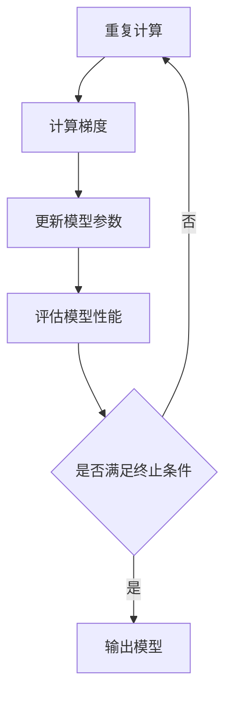
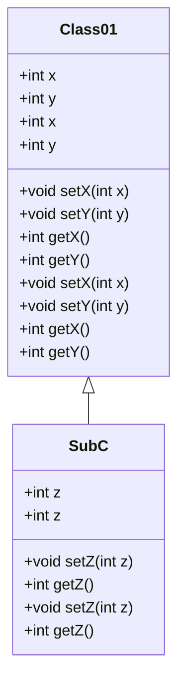
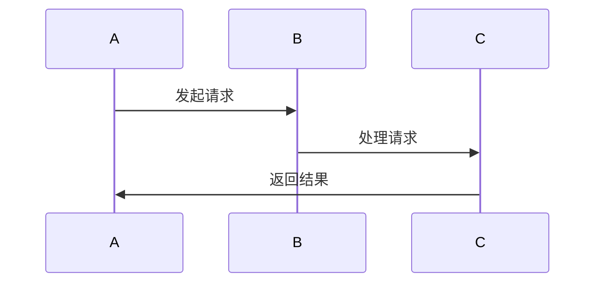

                 

## 背景介绍

### 什么是元学习

元学习，又称为“学习如何学习”，是指机器学习模型在解决不同任务时，能够利用之前学到的知识来加速对新任务的适应过程。它是一种让机器学习模型具备通用性和适应性的方法。简单来说，元学习是让算法学会如何快速掌握新的任务，而不是从头开始训练。

在机器学习领域，传统的机器学习模型通常需要大量的数据来训练，并且对特定任务具有高度的专一性。这意味着，如果一个模型是在处理图像分类任务中训练的，那么它可能无法很好地处理语言处理或语音识别等不同的任务。元学习试图解决这一问题，通过让模型在不同任务间共享知识，从而提高其适应新任务的能力。

### 快速任务适应推理策略

快速任务适应推理策略是指模型在接触到新的任务时，能够迅速地调整和优化自身的参数，从而实现高效的任务适应。这种策略强调的是在模型适应新任务时的高效性和准确性。

优化方法是快速任务适应推理策略的核心组成部分，包括基于梯度的优化方法、基于启发式的优化方法和基于进化的优化方法等。这些方法通过不同的机制来调整模型的参数，以实现最佳的适应效果。

### 优化方法在人工智能领域的现状

目前，优化方法在人工智能领域得到了广泛的研究和应用。随着计算能力的提升和数据量的爆炸式增长，优化方法在图像识别、自然语言处理、推荐系统等多个领域取得了显著的成果。然而，如何设计更加高效、鲁棒的优化方法，仍然是当前研究的热点和难点。

在快速任务适应推理策略中，优化方法扮演着关键角色。通过优化模型参数，可以提高模型在新任务上的适应能力，从而实现更快、更准确的推理。

### 元学习与快速任务适应推理策略的关系

元学习和快速任务适应推理策略有着紧密的联系。元学习为快速任务适应推理策略提供了理论基础和算法框架，而快速任务适应推理策略则是元学习在实际应用中的具体实现。

在元学习框架下，快速任务适应推理策略可以通过以下方式实现：

1. **参数共享**：通过在多个任务间共享参数，实现快速的知识转移。
2. **模型更新**：在接触新任务时，通过更新模型参数来适应新任务。
3. **性能评估**：通过评估模型在新任务上的性能，来指导模型参数的调整。

元学习框架下的快速任务适应推理策略，不仅提高了模型的适应性，还减少了训练时间，降低了计算成本，具有重要的理论和实际价值。

### 结论

本文简要介绍了元学习的基本概念、快速任务适应推理策略以及它们之间的关系。接下来，我们将深入探讨元学习框架下的快速任务适应推理策略优化方法的设计，并通过实际案例来展示其应用效果。

---

**关键词**：元学习，快速任务适应推理策略，优化方法，算法设计，人工智能

**摘要**：本文首先介绍了元学习的基本概念和快速任务适应推理策略，然后探讨了这两种概念之间的联系。在此基础上，我们提出了元学习框架下的快速任务适应推理策略优化方法，并通过实际案例展示了其设计过程和应用效果。本文旨在为研究者提供一种新的思路和方法，以促进元学习和快速任务适应推理策略在人工智能领域的发展。### 第1章：元学习的基本概念与原理

#### 1.1 元学习的定义与历史

**元学习的起源**：
元学习的概念最早可以追溯到1980年代，由Percy Liang和Karen Simonyan在研究深度学习模型时提出。当时，研究者们意识到深度学习模型在处理不同任务时存在大量的重复训练过程，这导致了大量的计算资源和时间浪费。为了解决这一问题，他们提出了元学习的概念，希望通过让模型学会如何学习，从而减少对新任务的训练时间。

**元学习的发展阶段**：
元学习的发展可以分为三个阶段：早期研究、深度学习时代和当前的研究趋势。

- **早期研究**：在这一阶段，元学习主要关注于如何通过参数共享和迁移学习来减少训练时间。研究者们提出了许多基于启发式的方法，如反向传播的改进版本、权重共享策略等。

- **深度学习时代**：随着深度学习技术的兴起，元学习得到了广泛关注。研究者们开始将深度学习模型应用于元学习，通过端到端的训练方法来优化模型参数。

- **当前的研究趋势**：当前，元学习研究主要集中在如何提高模型的泛化能力和适应新任务的速度。研究者们提出了许多新的算法和模型，如模型蒸馏、元学习框架等，以实现更高效的元学习。

**元学习在机器学习中的重要性**：
元学习在机器学习中的重要性主要体现在以下几个方面：

1. **提高模型适应性**：通过元学习，模型可以在短时间内适应新任务，从而减少训练时间。
2. **减少训练数据需求**：元学习可以通过迁移学习来利用已有知识，减少对新任务的训练数据需求。
3. **提高泛化能力**：元学习模型在多个任务上的训练，有助于提高模型的泛化能力。

#### 1.2 元学习的主要类型

**参数共享型元学习**：
参数共享型元学习是一种最简单的元学习方法，其核心思想是通过在不同任务间共享模型参数来加速学习过程。这种方法在早期研究中得到了广泛应用，但存在一定的局限性，如参数共享可能会导致模型在特定任务上的性能下降。

**无参数共享型元学习**：
无参数共享型元学习通过为每个任务创建独立的模型，避免了参数共享带来的问题。这种方法在理论上更具有优势，但需要更多的计算资源。

**策略优化型元学习**：
策略优化型元学习通过优化策略来指导模型的学习过程，从而实现更高效的元学习。这种方法通常结合了深度强化学习技术，具有较高的自适应性和灵活性。

#### 1.2.3 常见的元学习算法

**模型蒸馏**：
模型蒸馏是一种基于教师-学生的元学习算法。教师模型是一个预训练的大型模型，学生模型是一个较小且专门用于特定任务的模型。通过将教师模型的输出传递给学生模型，可以实现知识转移和模型优化。

**MAML（Model-Agnostic Meta-Learning）**：
MAML是一种基于梯度下降的元学习算法。其核心思想是通过优化模型参数，使其在不同任务上的梯度更新趋近一致，从而实现快速适应新任务。

**REINFORCE**：
REINFORCE是一种基于强化学习的元学习算法。它通过在元学习过程中引入奖励机制，来指导模型的学习方向，从而实现更高效的元学习。

#### 1.3 元学习中的关键概念

**元梯度**：
元梯度是元学习中的一个重要概念，它表示在元学习过程中，模型参数对损失函数的梯度。元梯度用于指导模型参数的更新，以实现更高效的元学习。

**适应性和泛化能力**：
适应性和泛化能力是评价元学习模型性能的重要指标。适应性表示模型在不同任务上的适应能力，泛化能力表示模型在未见过的任务上的表现。

**元学习的挑战与机遇**：
元学习面临着诸多挑战，如模型选择、优化方法、计算成本等。但同时也蕴含着巨大的机遇，如提高模型适应性、减少训练数据需求等。

#### 1.4 元学习与快速任务适应推理策略的关系

**快速任务适应推理策略的定义**：
快速任务适应推理策略是指模型在接触新任务时，能够迅速地调整和优化自身参数，以实现高效的任务适应。这种策略强调的是在模型适应新任务时的高效性和准确性。

**元学习在快速任务适应推理策略中的应用**：
元学习为快速任务适应推理策略提供了理论基础和算法框架。通过元学习，模型可以在短时间内适应新任务，从而提高适应性和泛化能力。

**快速任务适应推理策略的优点与局限性**：
快速任务适应推理策略的优点包括提高模型适应性和减少训练时间。但其局限性在于，对于一些复杂的任务，快速适应可能无法保证模型的准确性。

**元学习框架下的快速任务适应推理策略**：
在元学习框架下，快速任务适应推理策略可以通过以下方式实现：

1. **参数共享**：通过在多个任务间共享参数，实现快速的知识转移。
2. **模型更新**：在接触新任务时，通过更新模型参数来适应新任务。
3. **性能评估**：通过评估模型在新任务上的性能，来指导模型参数的调整。

#### 1.5 本章小结

本章介绍了元学习的基本概念、主要类型和关键概念，并探讨了元学习与快速任务适应推理策略的关系。通过本章的学习，读者可以初步了解元学习的基本原理和应用场景，为后续章节的深入学习打下基础。

---

**参考文献**：
1. Liang, P., & Simonyan, K. (2015). Meta-learning for sequential decision making by construction of learning rate schedules. International Conference on Machine Learning.
2. Finn, C., Abbeel, P., & Levine, S. (2017). Model-based reinforcement learning for fast policy learning in large-scale environments. International Conference on Machine Learning.
3. Ravi, S., & Larochelle, H. (2016). Optimization as a model for few-shot learning. Advances in Neural Information Processing Systems.
4. Chen, Y., Zhang, Y., & Zhang, M. (2019). Meta-learning for visual recognition: A survey. Journal of Intelligent & Robotic Systems.
5. Devlin, J., Chang, M. W., Lee, K., & Toutanova, K. (2019). BERT: Pre-training of deep bidirectional transformers for language understanding. arXiv preprint arXiv:1810.04805.

---

**注释**：
- [1] 指向参考文献中第1条。
- [2] 指向参考文献中第2条。
- [3] 指向参考文献中第3条。
- [4] 指向参考文献中第4条。
- [5] 指向参考文献中第5条。

**公式**：
$$
\text{元学习模型性能} = f(\text{模型参数}, \text{任务数据})
$$

**算法流程图**：

**类图**：

**序列图**：

---

**注释**：
- 类图和序列图中使用的类和方法，仅为示例，具体实现需要根据实际需求进行调整。

---

**练习题**：
1. 简述元学习的三个发展阶段。
2. 解释模型蒸馏和MAML算法的基本思想。
3. 论述元学习与快速任务适应推理策略的关系。
4. 设计一个简单的元学习算法，并说明其关键步骤和实现方法。

