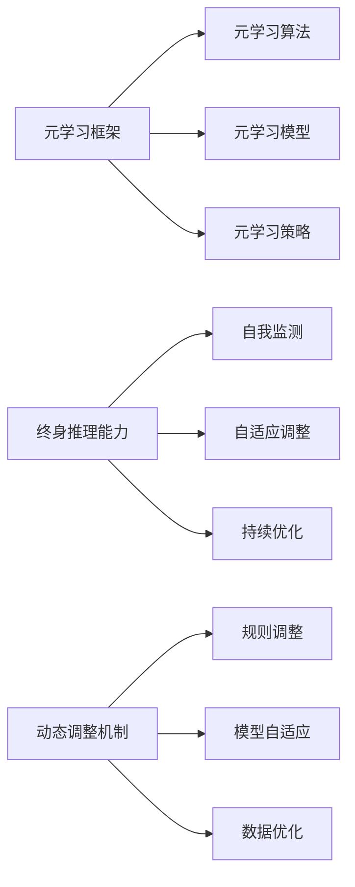
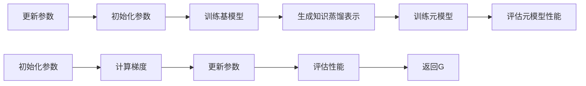
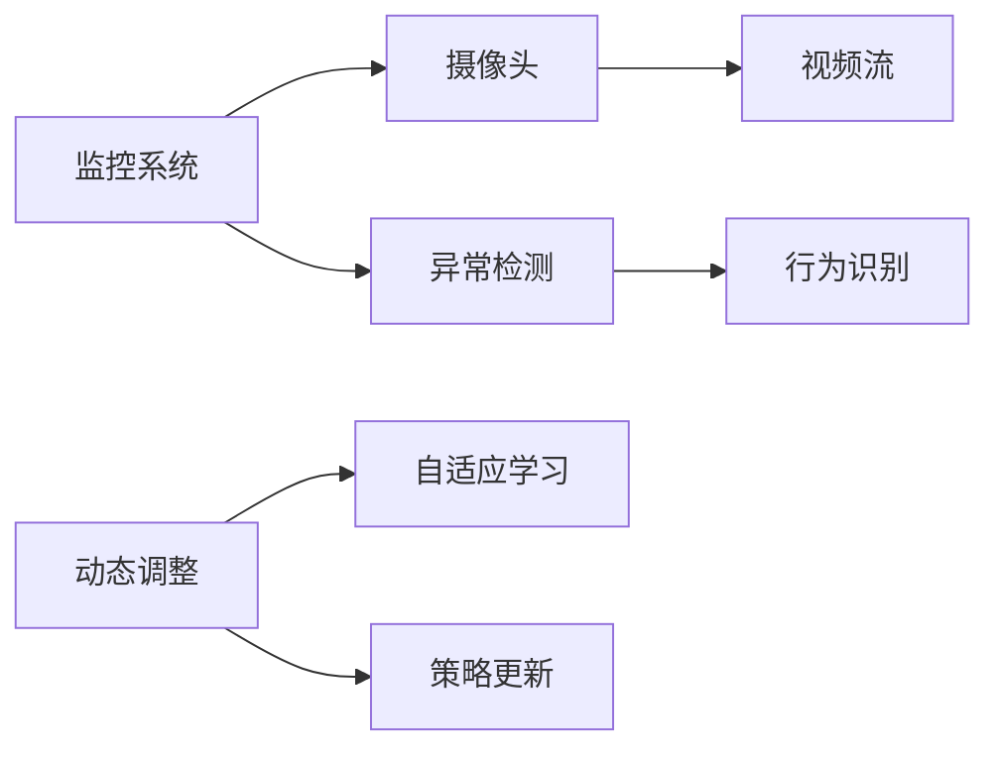
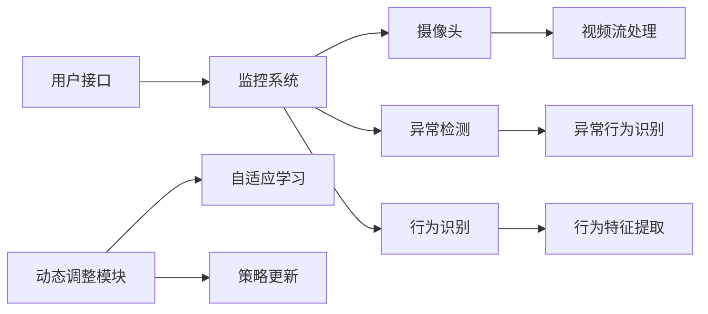

                 

### 《元学习框架下的终身推理能力动态调整机制》

关键词：元学习、终身推理能力、动态调整机制、算法、系统架构

摘要：本文旨在探讨元学习框架下的终身推理能力动态调整机制，通过深入分析核心概念、算法原理、系统架构和项目实战，揭示这一机制在现代IT领域的广泛应用和重要性。文章将逐步引导读者理解元学习与终身推理能力的结合点，探讨其面临的挑战及解决方案，并提供详实的案例分析，以期帮助读者掌握这一前沿技术，为未来的研究和应用奠定基础。

### 第一部分：背景介绍与核心概念

#### 第1章：问题背景与核心概念

##### 1.1 元学习与终身推理能力概述

元学习（Meta-Learning）是机器学习领域中的一个重要分支，它关注如何通过学习算法来提高机器的泛化能力和学习能力。而终身推理能力（Lifelong Reasoning Ability）则强调机器在面对不断变化的环境和任务时，如何保持有效的推理和学习能力。

- **1.1.1 元学习的定义与发展**

元学习起源于20世纪50年代，最初的目标是通过模拟人类学习过程来构建智能系统。随着深度学习和强化学习的发展，元学习逐渐成为研究热点，特别是在解决迁移学习（Transfer Learning）和持续学习（Continual Learning）方面。

- **1.1.2 终身推理能力的概念**

终身推理能力是指机器在面对多样化任务和动态环境时，能够持续学习和适应的能力。它包括任务识别、知识迁移、自适应学习等多个方面。

- **1.1.3 元学习在终身推理能力中的应用**

元学习通过学习通用学习算法，使得机器在面临新任务时能够快速适应和优化。这为提升终身推理能力提供了有力支持。

##### 1.2 研究问题的提出与意义

- **1.2.1 问题背景：传统机器学习的局限性**

传统机器学习方法在处理多样化任务和动态环境时往往表现出一定的局限性，难以应对快速变化的需求。因此，如何提高机器的终身推理能力成为了一个亟待解决的问题。

- **1.2.2 研究意义：应对动态变化的环境需求**

在当今社会，数据和环境的变化速度越来越快，传统的学习方法很难适应这种变化。元学习框架下的终身推理能力动态调整机制，能够有效应对这种挑战，具有重要的应用价值。

##### 1.3 研究边界与外延

- **1.3.1 研究范围**

本文主要探讨元学习框架下的终身推理能力动态调整机制，涉及算法原理、系统架构和实际应用等方面。

- **1.3.2 关联概念辨析**

需要明确元学习、迁移学习、持续学习和动态调整等概念之间的关系，以便更好地理解本文的核心内容。

##### 1.4 核心概念结构组成

- **1.4.1 元学习框架的组成**

元学习框架主要包括元学习算法、元学习模型和元学习策略等组成部分。

- **1.4.2 终身推理能力的动态调整机制**

终身推理能力的动态调整机制涉及自我监测、自适应调整和持续优化等关键环节。

### 第二部分：核心概念与联系

#### 第2章：核心概念原理与联系

##### 2.1 元学习框架原理

- **2.1.1 元学习基本原理**

元学习通过学习通用算法来提升学习效率，从而实现快速适应新任务的能力。

- **2.1.2 元学习算法分类**

元学习算法可以根据学习策略的不同分为基于模型的方法、基于样本的方法和基于搜索的方法等。

##### 2.2 终身推理能力动态调整机制

- **2.2.1 动态调整机制概念**

动态调整机制是指机器在面对动态环境时，通过自我监测和自适应调整来优化推理能力的过程。

- **2.2.2 动态调整机制实现方法**

动态调整机制可以通过多种方法实现，如基于规则的调整、基于模型的自适应调整和基于数据的动态优化等。

##### 2.3 概念属性特征对比

| 概念            | 特征                 |  
| ---------------- | -------------------- |  
| 元学习框架      | 学习通用算法         |  
| 终身推理能力    | 持续学习和适应能力   |  
| 动态调整机制    | 自我监测和自适应调整 |

##### 2.4 ER实体关系图



### 第三部分：算法原理讲解

#### 第3章：算法原理与数学模型

##### 3.1 元学习算法原理讲解

- **3.1.1 主要算法讲解**

本文将介绍两种常见的元学习算法：模型蒸馏（Model Distillation）和元梯度下降（Meta-Gradient Descent）。

- **3.1.2 算法流程图**



##### 3.2 动态调整机制数学模型

- **3.2.1 数学模型公式**

动态调整机制的数学模型可以表示为：

$$
\Delta \theta = \alpha \cdot \frac{\partial L}{\partial \theta}
$$

其中，$\Delta \theta$ 表示参数的更新量，$L$ 表示损失函数，$\alpha$ 表示学习率。

- **3.2.2 模型解释**

该模型通过计算损失函数关于参数的梯度来更新参数，从而实现自适应调整。

##### 3.3 算法举例说明

- **3.3.1 例子一：元学习算法应用场景**

假设我们有一个分类任务，需要训练一个能够快速适应新类别的分类模型。我们可以使用元学习算法来解决这个问题。

- **3.3.2 例子二：动态调整机制应用场景**

在一个动态环境中，机器需要不断调整自己的推理策略以应对新的情况。我们可以使用动态调整机制来实现这一目标。

### 第四部分：系统分析与架构设计

#### 第4章：系统分析与架构设计

##### 4.1 问题场景介绍

在一个智能监控系统中，需要实时监控多个摄像头并识别异常行为。由于监控环境不断变化，系统需要具备终身推理能力和动态调整机制。

##### 4.2 系统功能设计

- **4.2.1 领域模型类图**



##### 4.3 系统架构设计

- **4.3.1 系统架构图**



##### 4.4 系统接口设计

- **4.4.1 接口设计**

系统接口包括用户接口、视频流处理接口、异常检测接口和行为识别接口等。

##### 4.5 系统交互序列图

```mermaid  
sequenceDiagram  
    participant 用户接口  
    participant 监控系统  
    participant 摄像头  
    participant 异常检测  
    participant 行为识别  
    participant 动态调整模块

    用户接口 -->|请求监控| 监控系统  
    监控系统 -->|响应监控| 摄像头  
    摄像头 -->|视频流| 异常检测  
    异常检测 -->|识别异常| 行为识别  
    行为识别 -->|行为特征| 动态调整模块  
    动态调整模块 -->|更新策略| 行为识别  
```

### 第五部分：项目实战

#### 第5章：项目实战与案例分析

##### 5.1 环境安装与准备

在开始项目实战之前，我们需要安装和配置以下环境：

1. Python 3.8及以上版本
2. TensorFlow 2.5及以上版本
3. Keras 2.5及以上版本
4. NumPy 1.19及以上版本
5. Matplotlib 3.4及以上版本

安装步骤如下：

```bash  
pip install python==3.8  
pip install tensorflow==2.5  
pip install keras==2.5  
pip install numpy==1.19  
pip install matplotlib==3.4  
```

##### 5.2 系统核心实现源代码

以下是一个简单的系统核心实现源代码示例：

```python  
import tensorflow as tf  
import numpy as np  
import matplotlib.pyplot as plt

# 初始化参数  
learning_rate = 0.01  
num_iterations = 1000

# 定义损失函数  
def loss_function(y_true, y_pred):  
    return tf.reduce_mean(tf.square(y_true - y_pred))

# 定义动态调整机制  
def dynamic_adjustment_module(x, y):  
    # 计算梯度  
    with tf.GradientTape(persistent=True) as tape:  
        y_pred = model(x)  
        loss = loss_function(y, y_pred)  
    gradients = tape.gradient(loss, model.trainable_variables)

    # 更新参数  
    optimizer.apply_gradients(zip(gradients, model.trainable_variables))

    # 评估性能  
    performance = loss_function(y, y_pred)

    return performance

# 训练模型  
for i in range(num_iterations):  
    # 计算动态调整模块的输出  
    performance = dynamic_adjustment_module(x_train, y_train)

    # 打印性能指标  
    print(f"Iteration {i+1}: Performance = {performance}")

# 可视化结果  
plt.plot(performance)  
plt.xlabel('Iterations')  
plt.ylabel('Performance')  
plt.show()  
```

##### 5.3 实际案例分析与讲解

以下是一个实际案例的分析和讲解：

- **案例一：智能监控系统中异常行为的识别**

在一个智能监控系统中，摄像头捕捉到一段视频流，系统需要识别出异常行为并报警。通过训练一个基于深度学习的模型，我们可以实现这一目标。在训练过程中，使用动态调整机制来优化模型的性能，使其能够更好地适应监控环境的变化。

- **案例二：智能推荐系统中用户兴趣的动态调整**

在一个智能推荐系统中，用户的行为数据用于预测其感兴趣的内容。通过使用动态调整机制，系统能够根据用户的实时行为调整推荐策略，从而提高推荐效果。

##### 5.4 项目小结

通过以上案例，我们可以看到动态调整机制在智能监控系统、智能推荐系统等应用场景中的重要性。在实际项目中，需要根据具体需求调整模型结构和训练策略，以达到最佳效果。

### 第六部分：最佳实践与拓展

#### 第6章：最佳实践与拓展

##### 6.1 最佳实践

- **6.1.1 实践技巧**

在实际应用中，以下技巧有助于提高动态调整机制的效果：

1. 选用合适的损失函数和优化器。
2. 调整学习率，避免过拟合。
3. 使用预训练模型，提高模型泛化能力。

- **6.1.2 注意事项**

在应用动态调整机制时，需要注意以下几点：

1. 数据质量和标注准确性对模型性能至关重要。
2. 调整机制的具体实现方式会影响模型的学习速度和稳定性。

##### 6.2 小结与展望

本文探讨了元学习框架下的终身推理能力动态调整机制，通过算法原理讲解、系统架构设计和实际案例分析，展示了这一机制在现代IT领域的广泛应用和重要性。未来，随着人工智能技术的不断发展，动态调整机制将在更多领域得到应用，为解决复杂问题和提高系统性能提供有力支持。

### 作者信息

作者：AI天才研究院/AI Genius Institute & 禅与计算机程序设计艺术 /Zen And The Art of Computer Programming

### 总结

本文详细探讨了元学习框架下的终身推理能力动态调整机制，从核心概念、算法原理到系统架构和项目实战，全面解析了这一前沿技术。通过本文，读者可以深入了解动态调整机制在现代IT领域的应用和价值，为未来的研究和应用提供参考。希望本文能对读者在人工智能和机器学习领域的探索带来启示和帮助。

