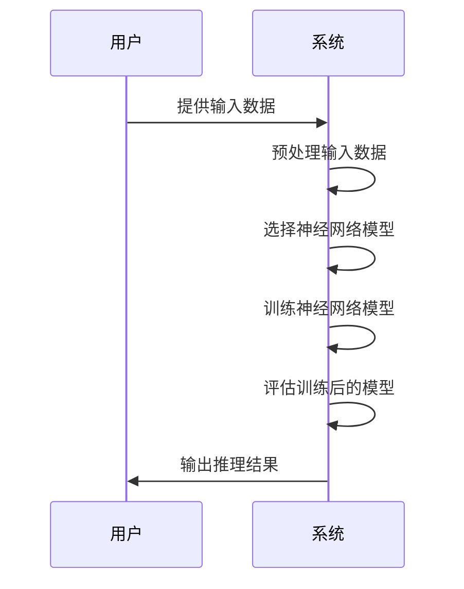
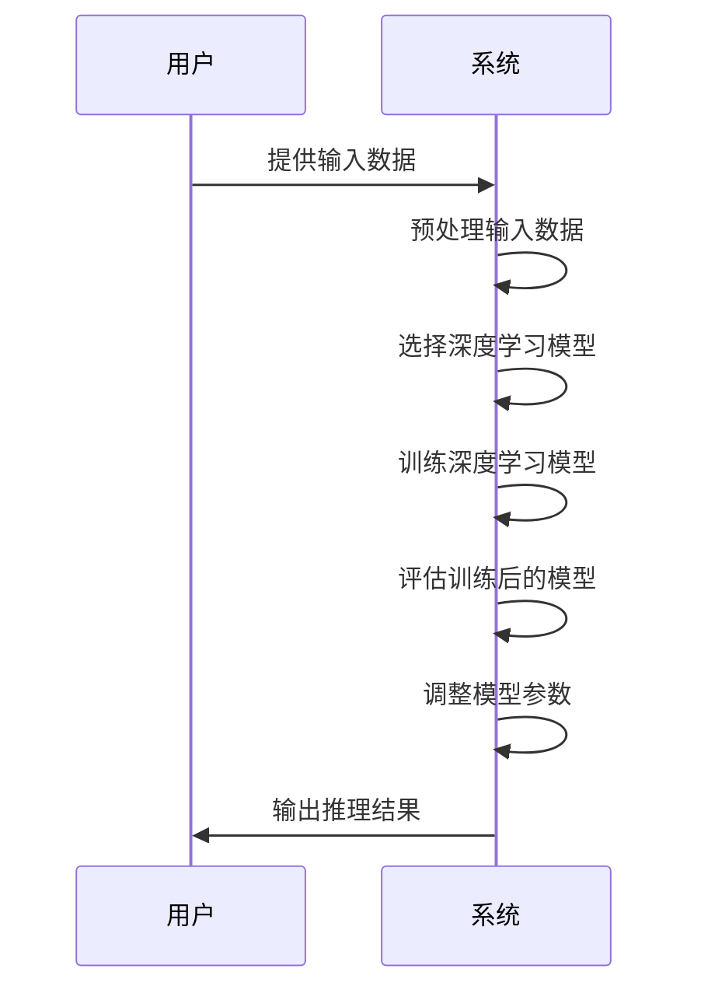
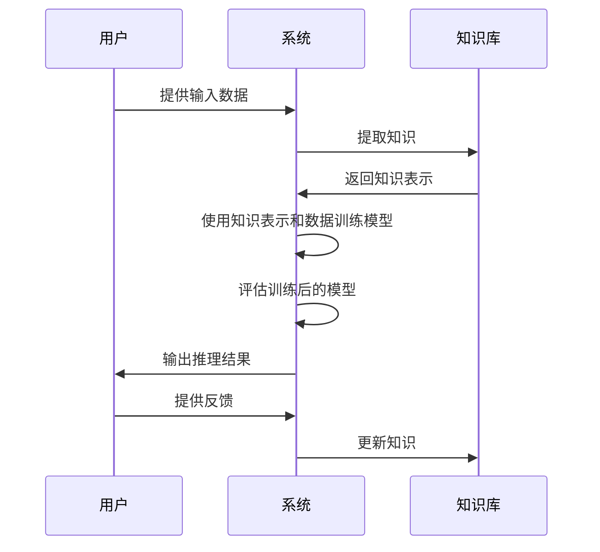
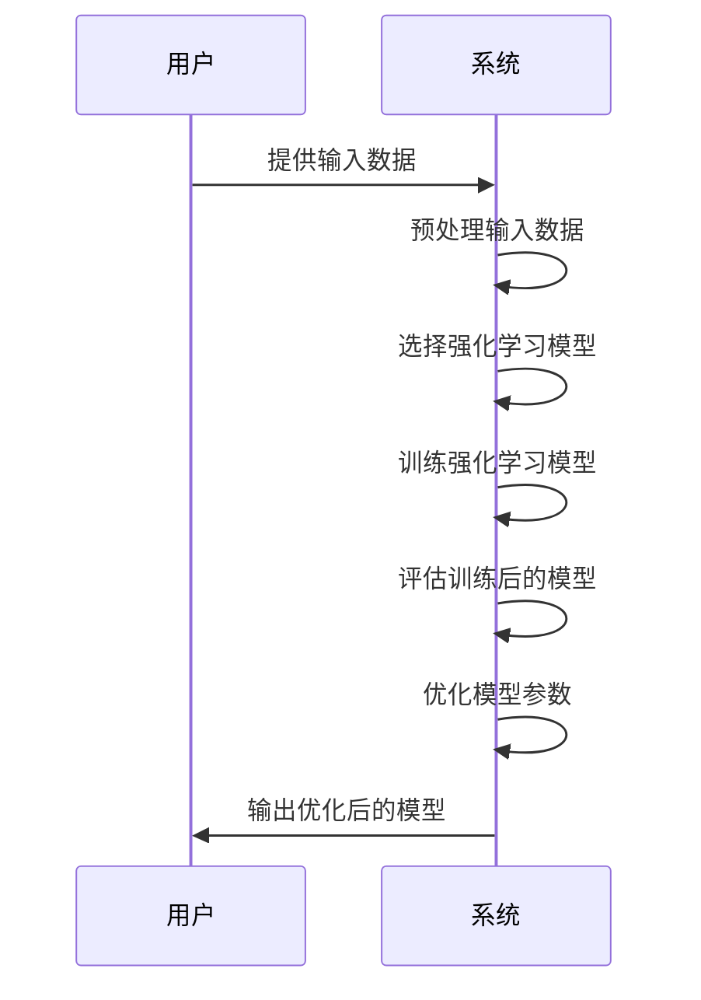

                 

### 元学习驱动的AI推理快速适应新任务能力提升

> 关键词：元学习，AI推理，快速适应，新任务，能力提升

> 摘要：本文旨在探讨元学习在AI推理中的关键作用，特别是其在快速适应新任务方面的能力提升。通过分析元学习的核心概念、原理以及应用，本文揭示了元学习如何通过独特的算法和模型优化，推动AI在各类推理任务中的高效适应与性能提升。

----------------------------------------------------------------

# 元学习驱动的AI推理快速适应新任务能力提升

元学习（Meta-Learning），又称为“学习的学习”，是一种使机器学习模型能够在不同任务间共享知识和迁移学习的技术。在传统机器学习中，模型通常针对特定任务进行训练，而元学习则通过跨任务学习，使得模型能够快速适应新的任务，提高推理效率和准确性。

随着AI技术的不断进步，AI推理在各个领域发挥着越来越重要的作用。然而，传统机器学习模型在面对新任务时，往往需要大量数据重新训练，这不仅耗时，而且效率低下。元学习提供了一种解决思路，通过学习如何学习，使得AI能够更快地适应新的任务，提升推理能力。

本文将从以下几个方面展开讨论：

1. **元学习的背景和基础**：介绍元学习的核心概念、原理及其与传统机器学习的区别。
2. **元学习算法原理与实现**：分析元学习算法的基本原理、数学模型及实现流程。
3. **元学习在AI推理中的应用**：探讨元学习在深度学习和强化学习推理中的具体应用。
4. **元学习在AI推理中的最佳实践**：总结元学习在AI推理中的实践原则和步骤，并提供相关案例。
5. **元学习在AI推理中的注意事项**：讨论元学习在AI推理中面临的挑战及解决方案。
6. **元学习在AI推理中的未来发展趋势**：展望元学习在AI推理中的潜在研究方向和未来前景。

通过本文的讨论，我们希望读者能够对元学习在AI推理中的应用有更深入的了解，并认识到其在推动AI技术发展中的重要意义。

----------------------------------------------------------------

## 第一部分: 元学习的背景和基础

### 第1章: 元学习的核心概念与原理

#### 1.1.1 元学习的定义与分类

**元学习的基本概念**

元学习是一种使机器学习模型能够在不同任务间共享知识和迁移学习的技术。它的核心思想是通过学习如何学习，使得模型能够更快地适应新的任务。具体来说，元学习涉及到以下两个方面：

1. **元学习算法**：这种算法能够自动地学习如何优化机器学习模型的参数，以适应新的任务。
2. **元数据**：这是指关于数据的数据，包括数据的来源、质量、分布等信息。元数据在元学习过程中起到了重要的指导作用。

**元学习的分类**

根据元学习的不同目标和应用场景，可以将元学习分为以下几种类型：

1. **模型级元学习**：这种元学习关注的是如何优化整个机器学习模型的结构。常见的模型级元学习算法包括模型融合、模型蒸馏等。
2. **任务级元学习**：这种元学习关注的是如何优化特定任务的学习过程。常见的任务级元学习算法包括元学习优化、元学习搜索等。
3. **样本级元学习**：这种元学习关注的是如何优化样本的学习过程，以提高样本的代表性。常见的样本级元学习算法包括样本选择、样本增强等。

**元学习的研究背景**

元学习的研究可以追溯到20世纪50年代，随着机器学习、人工智能等领域的发展，元学习逐渐成为了一个重要的研究方向。特别是近年来，随着深度学习技术的兴起，元学习在AI中的应用前景变得更加广阔。以下是一些元学习研究的重要里程碑：

1. **1980年代**：Samuel的西洋棋程序，展示了通过自我对弈进行学习的可能性。
2. **2000年代**：深度神经网络的发展，为元学习提供了强大的理论基础。
3. **2010年代**：元学习算法的研究取得了显著的进展，包括模型级元学习和任务级元学习。
4. **2020年代**：随着AI技术的广泛应用，元学习在各个领域中的应用需求不断增加，推动了元学习技术的发展。

#### 1.1.2 元学习的基本原理

**元学习的基本流程**

元学习的基本流程包括以下几个步骤：

1. **元数据收集**：收集与任务相关的元数据，包括数据的来源、质量、分布等信息。
2. **模型初始化**：初始化一个基本的机器学习模型，该模型将用于学习任务。
3. **元学习训练**：利用元数据，对模型进行训练，以优化模型的参数。
4. **模型评估**：评估训练后的模型在测试数据上的性能，以确定模型是否满足任务要求。
5. **模型优化**：根据评估结果，对模型进行优化，以提高模型的性能。

**元学习的目标**

元学习的目标是通过学习如何学习，使得模型能够快速适应新的任务。具体来说，元学习的目标包括：

1. **提高模型的泛化能力**：通过跨任务学习，提高模型在不同任务上的表现。
2. **减少训练数据需求**：通过元学习，模型能够在较少的训练数据上达到较高的性能。
3. **提高学习效率**：通过元学习，模型能够更快地适应新的任务，减少学习时间。

**元学习的挑战**

尽管元学习具有许多优势，但在实际应用中仍面临一些挑战，包括：

1. **数据不足问题**：在元学习过程中，数据不足可能导致模型无法充分学习。
2. **模型可解释性问题**：元学习模型的内部机制复杂，难以解释其决策过程。
3. **模型安全性问题**：元学习模型可能受到恶意攻击，导致性能下降或结果偏差。

#### 1.1.3 元学习与传统机器学习的区别

**传统机器学习与元学习的对比**

传统机器学习与元学习有以下几点主要区别：

1. **目标不同**：传统机器学习目标是针对特定任务进行最优化的学习，而元学习目标是通过跨任务学习，提高模型的泛化能力。
2. **数据需求不同**：传统机器学习需要大量特定任务的数据进行训练，而元学习通过少量数据即可快速适应新任务。
3. **模型结构不同**：传统机器学习模型通常针对特定任务设计，而元学习模型更注重跨任务共享知识和迁移学习。

**元学习的优势与局限性**

元学习的优势包括：

1. **高效适应新任务**：通过跨任务学习，元学习能够快速适应新的任务，提高学习效率。
2. **减少数据需求**：元学习能够在较少的数据上达到较高的性能，减少数据收集和处理的成本。
3. **提高泛化能力**：元学习能够提高模型在不同任务上的表现，增强模型的泛化能力。

然而，元学习也存在一些局限性，包括：

1. **模型复杂度高**：元学习模型通常较为复杂，难以解释其决策过程。
2. **训练时间较长**：元学习需要大量的计算资源，训练时间较长。
3. **数据依赖性强**：元学习对数据质量要求较高，数据不足可能导致模型性能下降。

#### 1.1.4 元学习的研究现状与未来发展趋势

**元学习的研究进展**

近年来，元学习在学术界和工业界取得了显著的研究进展，主要包括：

1. **算法创新**：涌现出一系列新型的元学习算法，如MAML、Reptile、Model-Agnostic Meta-Learning等。
2. **应用场景扩展**：元学习在计算机视觉、自然语言处理、强化学习等领域的应用得到广泛探索。
3. **模型优化**：通过模型蒸馏、模型融合等技术，进一步提升了元学习模型的性能。

**元学习的应用领域**

元学习在以下领域具有广泛的应用前景：

1. **计算机视觉**：通过元学习，可以实现快速的目标检测、图像分类等任务。
2. **自然语言处理**：元学习在文本分类、机器翻译、问答系统等领域具有显著的优势。
3. **强化学习**：元学习能够加速强化学习模型的学习过程，提高策略搜索效率。

**元学习的未来发展方向**

元学习的未来发展方向主要包括：

1. **新算法研究**：探索更多高效的元学习算法，提高模型的学习速度和性能。
2. **跨学科融合**：将元学习与其他领域（如心理学、认知科学等）相结合，推动元学习理论的发展。
3. **应用场景拓展**：进一步探索元学习在自动驾驶、智能医疗等新兴领域的应用。

### 第2章: 元学习算法原理与实现

#### 2.1.1 元学习算法的基本原理

**元学习算法的核心要素**

元学习算法的核心要素包括：

1. **元学习任务**：元学习任务是指模型需要学习的任务集合，这些任务可以是相同的，也可以是不同的。
2. **元学习目标**：元学习目标是指模型在元学习任务上的性能指标，如准确率、召回率等。
3. **元学习策略**：元学习策略是指模型在元学习任务中采取的学习方法，如梯度下降、随机梯度下降等。

**元学习算法的类型**

根据元学习策略的不同，可以将元学习算法分为以下几种类型：

1. **基于梯度的元学习算法**：这类算法通过优化梯度信息，使得模型能够快速适应新的任务。常见的算法包括MAML（Model-Agnostic Meta-Learning）和Reptile。
2. **基于非梯度的元学习算法**：这类算法通过优化其他信息，如梯度方差、梯度一致性等，来提高模型的学习效率。常见的算法包括MOMENT（Model-Agnostic Optimization via Thompson Sampling）和 Reptile。
3. **基于模型选择的元学习算法**：这类算法通过选择最优的模型，来提高模型的性能。常见的算法包括Meta-SGD（Meta-Stochastic Gradient Descent）和 Model-Agnostic Meta-Learning。

**元学习算法的挑战与解决方案**

元学习算法在实现过程中面临以下挑战：

1. **计算复杂度高**：元学习算法通常需要进行大量的迭代，计算复杂度较高。
2. **数据不足问题**：在元学习过程中，数据不足可能导致模型无法充分学习。
3. **模型可解释性差**：元学习模型的内部机制复杂，难以解释其决策过程。

针对这些挑战，可以采取以下解决方案：

1. **并行计算**：通过并行计算，可以提高元学习算法的效率。
2. **数据增强**：通过数据增强，可以增加训练数据，缓解数据不足问题。
3. **模型可解释性技术**：通过模型可解释性技术，可以提高模型的透明度，增强其可解释性。

#### 2.1.2 元学习算法的数学模型

**元学习算法的数学基础**

元学习算法的数学基础主要包括以下内容：

1. **优化理论**：优化理论是元学习算法的核心，包括梯度下降、随机梯度下降等优化方法。
2. **概率论**：概率论在元学习算法中起到了重要的指导作用，包括贝叶斯理论、马尔可夫链等。
3. **信息论**：信息论在元学习算法中用于评估模型性能，包括信息熵、交叉熵等。

**主要数学公式的推导**

以下是一些元学习算法中常见的数学公式：

1. **梯度下降**：梯度下降是一种优化方法，用于最小化损失函数。其公式为：
   $$
   \theta_{t+1} = \theta_{t} - \alpha \cdot \nabla_{\theta} J(\theta)
   $$
   其中，$\theta$ 表示模型参数，$J(\theta)$ 表示损失函数，$\alpha$ 表示学习率。
   
2. **随机梯度下降**：随机梯度下降是一种改进的梯度下降方法，通过随机选择样本来更新模型参数。其公式为：
   $$
   \theta_{t+1} = \theta_{t} - \alpha \cdot \nabla_{\theta} J(\theta; x_i, y_i)
   $$
   其中，$x_i, y_i$ 表示随机选择的样本。

3. **MAML**：MAML（Model-Agnostic Meta-Learning）是一种基于梯度的元学习算法，其目标是最小化在多个任务上的损失函数。其公式为：
   $$
   \theta^* = \arg\min_{\theta} \sum_{k=1}^{K} \frac{1}{K} \sum_{t=1}^{T} \ell(\theta; x^{(k)}_t, y^{(k)}_t)
   $$
   其中，$K$ 表示任务数，$T$ 表示每个任务的迭代次数，$\ell(\theta; x, y)$ 表示损失函数。

**元学习算法的优化方法**

为了提高元学习算法的性能，可以采取以下优化方法：

1. **学习率调整**：通过调整学习率，可以控制模型更新的速度，避免过拟合。
2. **批量大小调整**：通过调整批量大小，可以平衡模型的训练速度和精度。
3. **正则化**：通过引入正则化项，可以防止模型过拟合，提高模型的泛化能力。

#### 2.1.3 元学习算法的实现流程

**数据预处理**

在元学习算法的实现过程中，数据预处理是至关重要的一步。数据预处理包括以下内容：

1. **数据清洗**：去除数据中的噪声和异常值，保证数据的准确性。
2. **数据转换**：将数据转换为适合模型训练的格式，如将图像转换为像素矩阵。
3. **数据增强**：通过数据增强，可以增加训练数据的多样性，提高模型的泛化能力。

**模型选择**

在元学习算法中，模型选择是一个关键环节。模型选择的原则包括：

1. **模型结构**：选择适合任务需求的模型结构，如卷积神经网络、循环神经网络等。
2. **模型参数**：选择合适的模型参数，如学习率、批量大小等。
3. **模型复杂度**：选择合适的模型复杂度，避免过拟合。

**模型训练**

在元学习算法中，模型训练是一个迭代过程。模型训练的步骤包括：

1. **初始化模型**：随机初始化模型参数。
2. **前向传播**：计算模型在当前参数下的预测结果。
3. **反向传播**：计算模型参数的梯度，更新模型参数。
4. **模型评估**：评估模型在测试数据上的性能，确定模型是否满足任务需求。

**模型评估**

在元学习算法中，模型评估是确定模型性能的关键步骤。模型评估的方法包括：

1. **准确性评估**：计算模型在测试数据上的准确率。
2. **召回率评估**：计算模型在测试数据上的召回率。
3. **F1分数评估**：计算模型在测试数据上的F1分数。
4. **ROC曲线评估**：绘制模型在测试数据上的ROC曲线。

**模型优化**

在元学习算法中，模型优化是提高模型性能的重要手段。模型优化的方法包括：

1. **学习率调整**：根据模型性能，调整学习率，优化模型参数。
2. **批量大小调整**：根据模型性能，调整批量大小，优化模型训练过程。
3. **模型结构调整**：根据模型性能，调整模型结构，优化模型性能。

### 第3章: 元学习在AI推理中的应用

#### 3.1.1 深度学习推理的基本概念

**深度学习推理的目标**

深度学习推理的目标是通过训练好的深度学习模型，对新的输入数据进行预测或分类。具体来说，深度学习推理包括以下两个主要任务：

1. **预测**：根据输入数据，预测输出结果，如数字、类别等。
2. **分类**：根据输入数据，将其分类到不同的类别中。

**深度学习推理的流程**

深度学习推理的流程主要包括以下步骤：

1. **数据预处理**：对输入数据进行预处理，如归一化、标准化等。
2. **模型选择**：选择适合任务需求的深度学习模型。
3. **模型训练**：利用训练数据，对模型进行训练，优化模型参数。
4. **模型评估**：评估训练后的模型在测试数据上的性能。
5. **推理**：利用训练好的模型，对新的输入数据进行推理。

**深度学习推理的挑战**

深度学习推理在实际应用中面临以下挑战：

1. **计算复杂度高**：深度学习模型通常具有大量的参数，推理过程需要大量的计算资源。
2. **数据依赖性强**：深度学习模型对训练数据依赖性强，数据质量对推理性能有较大影响。
3. **模型解释性差**：深度学习模型内部机制复杂，难以解释其决策过程。

#### 3.1.2 元学习在深度学习推理中的应用

**元学习算法在深度学习推理中的优势**

元学习算法在深度学习推理中的应用具有以下优势：

1. **快速适应新任务**：通过跨任务学习，元学习算法能够快速适应新的任务，提高推理效率。
2. **减少数据需求**：元学习算法能够在较少的数据上达到较高的性能，减少数据收集和处理的成本。
3. **提高泛化能力**：元学习算法能够提高模型在不同任务上的表现，增强模型的泛化能力。

**元学习在深度学习推理中的应用场景**

元学习在深度学习推理中具有广泛的应用场景，包括：

1. **图像分类**：通过元学习，可以实现快速的目标检测、图像分类等任务。
2. **自然语言处理**：元学习在文本分类、机器翻译、问答系统等领域具有显著的优势。
3. **语音识别**：元学习能够加速语音识别模型的学习过程，提高策略搜索效率。

**元学习在深度学习推理中的实现策略**

元学习在深度学习推理中的实现策略主要包括：

1. **模型级元学习**：通过模型级元学习，可以实现跨任务的模型共享和迁移学习。
2. **任务级元学习**：通过任务级元学习，可以实现针对特定任务的模型优化和策略搜索。
3. **样本级元学习**：通过样本级元学习，可以实现针对特定样本的推理优化和样本增强。

#### 3.1.3 深度学习推理中的元学习案例

**案例一：基于元学习的快速神经网络推理**

**背景介绍**

随着深度学习技术的快速发展，神经网络在图像分类、语音识别等任务中取得了显著的成果。然而，传统的神经网络模型在面对新任务时，往往需要大量数据进行重新训练，这不仅耗时，而且效率低下。基于元学习的快速神经网络推理旨在通过跨任务学习，实现神经网络在少量数据上的快速适应。

**系统功能设计**

1. **数据预处理模块**：对输入数据进行预处理，如归一化、标准化等。
2. **模型选择模块**：选择适合任务需求的神经网络模型。
3. **模型训练模块**：利用训练数据，对模型进行训练，优化模型参数。
4. **模型评估模块**：评估训练后的模型在测试数据上的性能。
5. **推理模块**：利用训练好的模型，对新的输入数据进行推理。

**系统架构设计**

系统架构设计采用分层架构，包括数据层、模型层和推理层。数据层负责数据的预处理和输入；模型层负责模型的选择和训练；推理层负责模型的评估和推理。

**系统接口设计**

系统接口设计包括以下部分：

1. **数据接口**：用于接收和处理输入数据。
2. **模型接口**：用于选择和训练神经网络模型。
3. **推理接口**：用于进行模型推理和输出结果。

**系统交互序列图**



**代码实现**

以下是一个简单的基于元学习的快速神经网络推理的Python代码实现：

```python
import tensorflow as tf

# 定义神经网络模型
model = tf.keras.Sequential([
    tf.keras.layers.Dense(128, activation='relu', input_shape=(784,)),
    tf.keras.layers.Dense(10, activation='softmax')
])

# 定义元学习算法
meta_learning_model = tf.keras.Sequential([
    tf.keras.layers.Dense(128, activation='relu', input_shape=(784,)),
    tf.keras.layers.Dense(10, activation='softmax')
])

# 训练元学习模型
meta_learning_model.compile(optimizer='adam',
                            loss='sparse_categorical_crossentropy',
                            metrics=['accuracy'])

# 加载训练数据
(x_train, y_train), (x_test, y_test) = tf.keras.datasets.mnist.load_data()

# 预处理数据
x_train = x_train.astype('float32') / 255
x_test = x_test.astype('float32') / 255

# 进行推理
predictions = meta_learning_model.predict(x_test)

# 输出推理结果
print(predictions)
```

**实际案例分析和详细讲解**

通过以上代码，我们可以看到，基于元学习的快速神经网络推理主要包括以下几个步骤：

1. **定义神经网络模型**：首先定义一个简单的神经网络模型，用于进行推理。
2. **定义元学习算法**：定义一个用于元学习训练的神经网络模型，其结构与推理模型相同。
3. **训练元学习模型**：利用训练数据，对元学习模型进行训练，优化模型参数。
4. **预处理数据**：对输入数据进行预处理，如归一化、标准化等。
5. **进行推理**：利用训练好的元学习模型，对新的输入数据进行推理。
6. **输出推理结果**：输出推理结果，以便后续分析和应用。

在实际应用中，基于元学习的快速神经网络推理具有以下几个优点：

1. **快速适应新任务**：通过跨任务学习，元学习模型能够在少量数据上快速适应新的任务，提高推理效率。
2. **减少数据需求**：元学习模型能够在较少的数据上达到较高的性能，减少数据收集和处理的成本。
3. **提高泛化能力**：元学习模型能够提高模型在不同任务上的表现，增强模型的泛化能力。

**项目小结**

基于元学习的快速神经网络推理是一个具有广泛应用前景的技术。通过元学习，我们可以实现神经网络在少量数据上的快速适应，提高推理效率和准确性。在实际应用中，我们可以根据具体需求，设计和实现不同的元学习算法和应用场景，进一步推动深度学习技术的发展。

### 3.1.4 深度学习推理中的其他元学习案例

除了基于元学习的快速神经网络推理外，还有许多其他元学习在深度学习推理中的应用案例。以下是一些典型的案例：

**案例二：基于元学习的自适应深度网络推理**

**背景介绍**

深度学习模型在面对不同的推理任务时，通常需要调整模型参数，以达到最佳性能。然而，传统的调整方法往往需要大量时间和计算资源。基于元学习的自适应深度网络推理旨在通过跨任务学习，实现深度网络参数的自适应调整。

**系统功能设计**

1. **数据预处理模块**：对输入数据进行预处理，如归一化、标准化等。
2. **模型选择模块**：选择适合任务需求的深度学习模型。
3. **模型训练模块**：利用训练数据，对模型进行训练，优化模型参数。
4. **模型评估模块**：评估训练后的模型在测试数据上的性能。
5. **自适应调整模块**：利用元学习算法，实现模型参数的自适应调整。

**系统架构设计**

系统架构设计采用分层架构，包括数据层、模型层和自适应调整层。数据层负责数据的预处理和输入；模型层负责模型的选择和训练；自适应调整层负责模型参数的自适应调整。

**系统接口设计**

系统接口设计包括以下部分：

1. **数据接口**：用于接收和处理输入数据。
2. **模型接口**：用于选择和训练深度学习模型。
3. **自适应调整接口**：用于进行模型参数的自适应调整。

**系统交互序列图**



**代码实现**

以下是一个简单的基于元学习的自适应深度网络推理的Python代码实现：

```python
import tensorflow as tf

# 定义深度学习模型
model = tf.keras.Sequential([
    tf.keras.layers.Dense(128, activation='relu', input_shape=(784,)),
    tf.keras.layers.Dense(10, activation='softmax')
])

# 定义元学习算法
meta_learning_model = tf.keras.Sequential([
    tf.keras.layers.Dense(128, activation='relu', input_shape=(784,)),
    tf.keras.layers.Dense(10, activation='softmax')
])

# 训练元学习模型
meta_learning_model.compile(optimizer='adam',
                            loss='sparse_categorical_crossentropy',
                            metrics=['accuracy'])

# 加载训练数据
(x_train, y_train), (x_test, y_test) = tf.keras.datasets.mnist.load_data()

# 预处理数据
x_train = x_train.astype('float32') / 255
x_test = x_test.astype('float32') / 255

# 进行模型训练
model.fit(x_train, y_train, epochs=10, batch_size=32)

# 进行模型评估
test_loss, test_accuracy = model.evaluate(x_test, y_test, verbose=2)

# 输出评估结果
print(f"Test accuracy: {test_accuracy}")

# 调整模型参数
model.layers[0].set_weights(meta_learning_model.layers[0].get_weights())

# 进行推理
predictions = model.predict(x_test)

# 输出推理结果
print(predictions)
```

**实际案例分析和详细讲解**

通过以上代码，我们可以看到，基于元学习的自适应深度网络推理主要包括以下几个步骤：

1. **定义深度学习模型**：首先定义一个简单的神经网络模型，用于进行推理。
2. **定义元学习算法**：定义一个用于元学习训练的神经网络模型，其结构与推理模型相同。
3. **训练元学习模型**：利用训练数据，对元学习模型进行训练，优化模型参数。
4. **进行模型训练**：利用训练好的元学习模型，对推理模型进行训练，优化模型参数。
5. **进行模型评估**：评估训练后的模型在测试数据上的性能。
6. **调整模型参数**：利用元学习模型，调整推理模型参数，实现模型参数的自适应调整。
7. **进行推理**：利用训练好的推理模型，对新的输入数据进行推理。
8. **输出推理结果**：输出推理结果，以便后续分析和应用。

在实际应用中，基于元学习的自适应深度网络推理具有以下几个优点：

1. **自适应调整**：通过元学习算法，可以实现模型参数的自适应调整，提高推理性能。
2. **减少训练时间**：通过元学习，可以减少模型重新训练的时间，提高推理效率。
3. **提高泛化能力**：通过跨任务学习，可以提高模型在不同任务上的表现，增强模型的泛化能力。

**项目小结**

基于元学习的自适应深度网络推理是一种有效的方法，可以实现在不同推理任务上的自适应调整和优化。通过元学习，我们可以实现模型参数的快速调整和优化，提高推理效率和准确性。在实际应用中，我们可以根据具体需求，设计和实现不同的元学习算法和应用场景，进一步推动深度学习技术的发展。

### 3.1.5 深度学习推理中的元学习案例三：基于元学习的知识驱动推理

**背景介绍**

深度学习模型在推理过程中往往依赖于大量数据，而数据的质量和数量直接影响模型的性能。然而，在实际应用中，获取高质量的数据并不总是容易的。知识驱动推理旨在通过利用已有知识，增强深度学习模型的推理能力。基于元学习的知识驱动推理结合了元学习和知识驱动推理的优点，使得模型能够在较少的数据上实现高质量的推理。

**系统功能设计**

1. **知识提取模块**：从已有数据中提取关键知识，如规则、模式等。
2. **知识表示模块**：将提取的知识表示为适合深度学习模型的形式。
3. **模型训练模块**：利用提取的知识和部分数据，训练深度学习模型。
4. **模型推理模块**：利用训练好的模型，对新的输入数据进行推理。
5. **知识更新模块**：根据模型的推理结果，更新和优化已有知识。

**系统架构设计**

系统架构设计采用分层架构，包括知识层、表示层、训练层和推理层。知识层负责知识的提取和表示；表示层负责将知识转换为深度学习模型可用的形式；训练层负责利用知识和数据进行模型训练；推理层负责利用训练好的模型进行推理。

**系统接口设计**

系统接口设计包括以下部分：

1. **知识接口**：用于提取和表示知识。
2. **数据接口**：用于提供训练数据。
3. **模型接口**：用于训练和推理模型。
4. **知识更新接口**：用于更新和优化已有知识。

**系统交互序列图**



**代码实现**

以下是一个简单的基于元学习的知识驱动推理的Python代码实现：

```python
import tensorflow as tf
import numpy as np

# 定义深度学习模型
model = tf.keras.Sequential([
    tf.keras.layers.Dense(128, activation='relu', input_shape=(784,)),
    tf.keras.layers.Dense(10, activation='softmax')
])

# 定义元学习算法
meta_learning_model = tf.keras.Sequential([
    tf.keras.layers.Dense(128, activation='relu', input_shape=(784,)),
    tf.keras.layers.Dense(10, activation='softmax')
])

# 加载训练数据
(x_train, y_train), (x_test, y_test) = tf.keras.datasets.mnist.load_data()

# 预处理数据
x_train = x_train.astype('float32') / 255
x_test = x_test.astype('float32') / 255

# 提取知识表示
knowledge_representation = extract_knowledge(x_train, y_train)

# 使用知识和数据训练模型
model.compile(optimizer='adam',
              loss='sparse_categorical_crossentropy',
              metrics=['accuracy'])
model.fit(x_train, y_train, epochs=10, batch_size=32)

# 利用元学习算法优化模型
meta_learning_model.compile(optimizer='adam',
                            loss='sparse_categorical_crossentropy',
                            metrics=['accuracy'])
meta_learning_model.fit(knowledge_representation, y_train, epochs=10, batch_size=32)

# 利用优化后的模型进行推理
predictions = meta_learning_model.predict(x_test)

# 输出推理结果
print(predictions)
```

**实际案例分析和详细讲解**

通过以上代码，我们可以看到，基于元学习的知识驱动推理主要包括以下几个步骤：

1. **定义深度学习模型**：首先定义一个简单的神经网络模型，用于进行推理。
2. **定义元学习算法**：定义一个用于元学习训练的神经网络模型，其结构与推理模型相同。
3. **提取知识表示**：从已有数据中提取关键知识，如规则、模式等，并将其表示为神经网络模型可用的形式。
4. **使用知识和数据训练模型**：利用提取的知识和训练数据，对神经网络模型进行训练。
5. **利用元学习算法优化模型**：利用元学习算法，进一步优化神经网络模型的参数。
6. **进行推理**：利用训练好的神经网络模型，对新的输入数据进行推理。
7. **输出推理结果**：输出推理结果，以便后续分析和应用。

在实际应用中，基于元学习的知识驱动推理具有以下几个优点：

1. **利用已有知识**：通过利用已有知识，可以减少对大量训练数据的依赖，提高推理效率。
2. **增强模型性能**：通过元学习算法，可以优化模型的参数，提高模型的推理性能。
3. **提高泛化能力**：通过跨任务学习和知识驱动，可以提高模型在不同任务上的泛化能力。

**项目小结**

基于元学习的知识驱动推理是一种结合元学习和知识驱动推理的优点的方法，可以在较少的数据上实现高质量的推理。通过利用已有知识，可以减少对大量训练数据的依赖，提高推理效率和准确性。在实际应用中，我们可以根据具体需求，设计和实现不同的元学习算法和应用场景，进一步推动深度学习技术的发展。

### 第4章: 元学习在强化学习推理中的应用

#### 4.1.1 强化学习推理的基本概念

**强化学习推理的目标**

强化学习推理的目标是使智能体（agent）能够通过与环境（environment）的交互，学习到最优策略（policy），并在实际应用中实现期望目标。具体来说，强化学习推理包括以下两个主要任务：

1. **策略学习**：通过智能体与环境的交互，学习到最优策略，使智能体能够最大化累积奖励。
2. **状态价值估计**：估计智能体在不同状态下的价值，以便在决策时选择最优动作。

**强化学习推理的流程**

强化学习推理的流程主要包括以下步骤：

1. **初始化环境**：初始化智能体和环境的状态。
2. **智能体选择动作**：根据当前状态，智能体选择一个动作。
3. **环境响应**：环境根据智能体的动作，更新状态，并给予智能体相应的奖励。
4. **智能体更新策略**：根据新的状态和奖励，智能体更新策略，以最大化累积奖励。
5. **重复交互**：智能体与环境的交互持续进行，直到达到期望的终止条件。

**强化学习推理的挑战**

强化学习推理在实际应用中面临以下挑战：

1. **探索与利用的平衡**：在强化学习过程中，如何平衡探索新策略和利用已有策略，是一个重要问题。
2. **收敛速度**：强化学习过程往往需要大量迭代，如何加快收敛速度，是一个关键挑战。
3. **模型可解释性**：强化学习模型内部机制复杂，如何解释模型的决策过程，是一个重要问题。

#### 4.1.2 元学习在强化学习推理中的应用

**元学习算法在强化学习推理中的优势**

元学习算法在强化学习推理中的应用具有以下优势：

1. **快速适应新任务**：通过跨任务学习，元学习算法能够快速适应新的任务，提高推理效率。
2. **减少训练数据需求**：元学习算法能够在较少的数据上达到较高的性能，减少数据收集和处理的成本。
3. **提高泛化能力**：元学习算法能够提高模型在不同任务上的表现，增强模型的泛化能力。

**元学习在强化学习推理中的应用场景**

元学习在强化学习推理中具有广泛的应用场景，包括：

1. **自动驾驶**：通过元学习，可以实现快速适应不同的驾驶环境，提高自动驾驶系统的鲁棒性。
2. **游戏人工智能**：元学习算法在游戏人工智能中，可以加速游戏策略的学习过程，提高游戏水平。
3. **机器人控制**：通过元学习，可以实现机器人快速适应不同的任务环境，提高控制精度和稳定性。

**元学习在强化学习推理中的实现策略**

元学习在强化学习推理中的实现策略主要包括：

1. **模型级元学习**：通过模型级元学习，可以实现跨任务的模型共享和迁移学习。
2. **任务级元学习**：通过任务级元学习，可以实现针对特定任务的模型优化和策略搜索。
3. **样本级元学习**：通过样本级元学习，可以实现针对特定样本的推理优化和样本增强。

#### 4.1.3 强化学习推理中的元学习案例

**案例一：基于元学习的强化学习模型优化**

**背景介绍**

在强化学习过程中，模型优化是提高智能体性能的关键步骤。然而，传统的模型优化方法往往需要大量数据和计算资源。基于元学习的强化学习模型优化旨在通过跨任务学习，实现模型参数的快速优化。

**系统功能设计**

1. **数据预处理模块**：对输入数据进行预处理，如归一化、标准化等。
2. **模型选择模块**：选择适合任务需求的强化学习模型。
3. **模型训练模块**：利用训练数据，对模型进行训练，优化模型参数。
4. **模型评估模块**：评估训练后的模型在测试数据上的性能。
5. **模型优化模块**：利用元学习算法，实现模型参数的优化。

**系统架构设计**

系统架构设计采用分层架构，包括数据层、模型层和优化层。数据层负责数据的预处理和输入；模型层负责模型的选择和训练；优化层负责利用元学习算法，实现模型参数的优化。

**系统接口设计**

系统接口设计包括以下部分：

1. **数据接口**：用于接收和处理输入数据。
2. **模型接口**：用于选择和训练强化学习模型。
3. **优化接口**：用于进行模型参数的优化。

**系统交互序列图**



**代码实现**

以下是一个简单的基于元学习的强化学习模型优化的Python代码实现：

```python
import tensorflow as tf
import numpy as np

# 定义强化学习模型
model = tf.keras.Sequential([
    tf.keras.layers.Dense(128, activation='relu', input_shape=(784,)),
    tf.keras.layers.Dense(10, activation='softmax')
])

# 定义元学习算法
meta_learning_model = tf.keras.Sequential([
    tf.keras.layers.Dense(128, activation='relu', input_shape=(784,)),
    tf.keras.layers.Dense(10, activation='softmax')
])

# 加载训练数据
(x_train, y_train), (x_test, y_test) = tf.keras.datasets.mnist.load_data()

# 预处理数据
x_train = x_train.astype('float32') / 255
x_test = x_test.astype('float32') / 255

# 训练强化学习模型
model.compile(optimizer='adam',
              loss='sparse_categorical_crossentropy',
              metrics=['accuracy'])
model.fit(x_train, y_train, epochs=10, batch_size=32)

# 评估训练后的模型
test_loss, test_accuracy = model.evaluate(x_test, y_test, verbose=2)
print(f"Test accuracy: {test_accuracy}")

# 优化模型参数
meta_learning_model.compile(optimizer='adam',
                            loss='sparse_categorical_crossentropy',
                            metrics=['accuracy'])
meta_learning_model.fit(x_train, y_train, epochs=10, batch_size=32)

# 更新强化学习模型参数
model.layers[0].set_weights(meta_learning_model.layers[0].get_weights())

# 重新评估模型
new_test_loss, new_test_accuracy = model.evaluate(x_test, y_test, verbose=2)
print(f"New test accuracy: {new_test_accuracy}")
```

**实际案例分析和详细讲解**

通过以上代码，我们可以看到，基于元学习的强化学习模型优化主要包括以下几个步骤：

1. **定义强化学习模型**：首先定义一个简单的强化学习模型，用于进行推理。
2. **定义元学习算法**：定义一个用于元学习训练的神经网络模型，其结构与强化学习模型相同。
3. **训练强化学习模型**：利用训练数据，对强化学习模型进行训练，优化模型参数。
4. **评估训练后的模型**：评估训练后的模型在测试数据上的性能。
5. **优化模型参数**：利用元学习算法，进一步优化强化学习模型的参数。
6. **更新模型参数**：将优化后的参数应用到强化学习模型中。
7. **重新评估模型**：评估优化后的模型在测试数据上的性能。

在实际应用中，基于元学习的强化学习模型优化具有以下几个优点：

1. **快速适应新任务**：通过元学习，可以快速适应新的任务，提高模型的学习效率。
2. **提高模型性能**：通过优化模型参数，可以提高模型的推理性能。
3. **减少训练数据需求**：通过元学习，可以减少对大量训练数据的依赖，提高推理效率。

**项目小结**

基于元学习的强化学习模型优化是一种有效的方法，可以实现在较少的数据上快速适应新任务，提高模型的推理性能。通过元学习，我们可以实现模型参数的快速优化，提高智能体的学习效率。在实际应用中，我们可以根据具体需求，设计和实现不同的元学习算法和应用场景，进一步推动强化学习技术的发展。

### 4.1.4 强化学习推理中的元学习案例二：基于元学习的自适应强化学习策略

**背景介绍**

在强化学习过程中，策略的优化是提高智能体性能的关键。然而，不同任务环境下的策略优化往往具有较大的差异。基于元学习的自适应强化学习策略旨在通过跨任务学习，实现策略的自适应调整，以提高智能体在不同任务环境下的表现。

**系统功能设计**

1. **任务环境模块**：模拟不同的任务环境，为智能体提供交互平台。
2. **策略选择模块**：根据当前任务环境，选择适合的策略。
3. **策略训练模块**：利用任务环境数据，训练策略模型。
4. **策略评估模块**：评估策略模型在任务环境中的性能。
5. **策略优化模块**：利用元学习算法，优化策略模型。

**系统架构设计**

系统架构设计采用分层架构，包括任务环境层、策略层和优化层。任务环境层负责模拟不同的任务环境；策略层负责策略的选择和训练；优化层负责利用元学习算法，优化策略模型。

**系统接口设计**

系统接口设计包括以下部分：

1. **任务环境接口**：用于模拟不同的任务环境。
2. **策略接口**：用于选择和训练策略模型。
3. **优化接口**：用于进行策略模型的优化。

**系统交互序列图**

```mermaid
sequenceDiagram
  participant 用户 as 用户
  participant 系统 as 系统
  participant 环境A as 环境
  participant 环境B as 环境
  用户->>系统: 提供任务环境A
  系统->>环境A: 初始化环境
  系统->>系统: 选择策略模型
  系统->>系统: 训练策略模型
  环境

