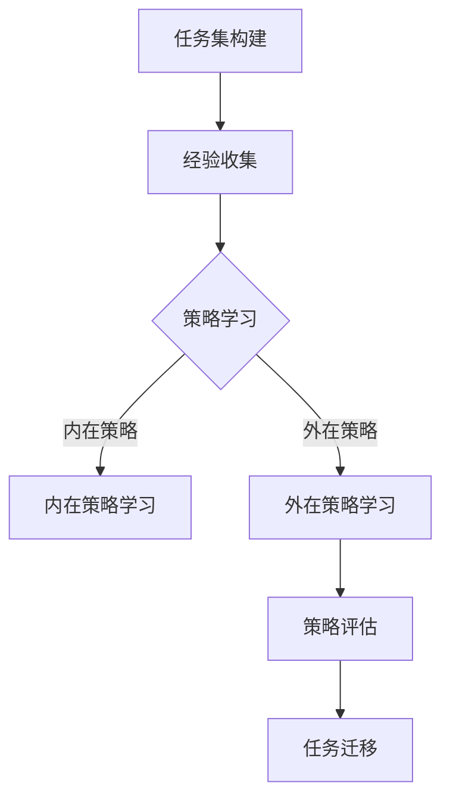
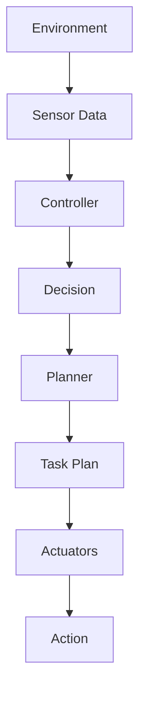

                 

### 1. 元强化学习优化动态环境下的推理任务规划：背景与问题分析

**关键词**：元强化学习，动态环境，推理任务规划，优化策略，挑战与机遇

**摘要**：本文将深入探讨元强化学习优化动态环境下的推理任务规划。随着人工智能技术的发展，动态环境下的推理任务规划面临诸多挑战。元强化学习作为一种高级学习范式，通过不断优化学习策略，为解决动态环境下的推理任务提供了新的思路。本文将首先介绍元强化学习的基本概念，然后分析动态环境下的推理任务特征，最后探讨如何运用元强化学习优化推理任务规划，并讨论面临的挑战与机遇。

#### 1.1 问题背景

在现代社会，人工智能的应用场景日益广泛，从自动驾驶、智能机器人到智能推荐系统，几乎无处不在。这些应用场景的一个共同特点是环境动态变化，任务需求不断变化。传统的静态环境下的推理任务规划方法，往往无法适应动态环境中的不确定性，导致推理效率低下、鲁棒性不足。因此，研究如何优化动态环境下的推理任务规划，成为一个亟待解决的关键问题。

#### 1.2 问题描述

动态环境下的推理任务规划主要包括以下三个核心问题：

1. **环境不确定性**：动态环境中的状态和动作不断变化，使得推理任务变得更加复杂。
2. **任务多样性**：动态环境下的任务需求多样化，需要推理系统具备灵活的任务适应性。
3. **学习效率**：在动态环境中，推理系统需要快速适应环境变化，提高学习效率。

如何解决上述问题，实现对动态环境下的推理任务高效、鲁棒的规划，是当前人工智能领域面临的一个重要挑战。

#### 1.3 问题解决方法

为了解决动态环境下的推理任务规划问题，研究者们提出了多种方法。其中，元强化学习（Meta Reinforcement Learning）作为一种新兴的学习范式，通过学习如何在不同任务之间转移知识，提供了一种有效的优化策略。

元强化学习的主要思想是，通过在一个多样化任务集上的预训练，使得代理能够在新的任务上快速适应。这种方法的关键在于，如何设计有效的元学习策略，使得代理能够从多个任务中提取通用知识，并应用到新的任务中。

具体而言，元强化学习通过以下几个步骤来优化动态环境下的推理任务规划：

1. **任务集构建**：首先，构建一个包含多个相关任务的多样化任务集。
2. **元学习策略训练**：然后，使用元学习算法，在任务集上训练代理，使其能够提取通用知识。
3. **任务迁移**：通过预训练的代理，在新任务上进行推理任务规划，实现快速适应。

#### 1.4 边界与外延

在研究动态环境下的推理任务规划时，需要明确以下几个边界与外延：

1. **任务多样性**：需要定义什么程度的任务多样性，才能使得元强化学习策略有效。
2. **环境动态性**：需要明确环境的动态变化范围，以及代理适应环境变化的能力。
3. **学习效率**：需要平衡元学习策略的训练时间和推理任务的执行效率。

此外，动态环境下的推理任务规划还涉及到与其他人工智能技术的结合，如深度学习、自然语言处理等，以实现更高效、更智能的推理任务规划。

通过本文的探讨，我们将深入理解元强化学习优化动态环境下的推理任务规划，为相关领域的研究和应用提供参考和指导。

### 2. 核心概念与联系：元强化学习、动态环境、推理任务规划

在探讨元强化学习优化动态环境下的推理任务规划之前，我们需要明确几个核心概念，包括元强化学习、动态环境和推理任务规划。这些概念不仅构成了我们的研究基础，而且相互关联，共同决定了我们的研究方法和目标。

#### 2.1 元强化学习

**定义**：元强化学习（Meta Reinforcement Learning）是一种强化学习的高级形式，其核心思想是通过在多个任务上学习通用策略，从而提高代理在不同任务上的适应能力。与传统的强化学习不同，元强化学习注重任务之间的转移学习，使得代理能够在未见过的任务上快速获得良好表现。

**特征**：元强化学习具有以下几个关键特征：

1. **任务多样性**：元强化学习在多样化的任务集上进行训练，从而提取出通用的策略。
2. **快速适应**：通过预训练，代理能够快速适应新的任务，减少训练时间。
3. **迁移学习**：元强化学习能够将一个任务上学习的策略迁移到另一个任务上，提高学习效率。

**对比传统强化学习**：传统强化学习依赖于在每个任务上从头开始学习，而元强化学习通过任务转移学习，能够显著提高学习效率和适应能力。例如，在自动驾驶场景中，元强化学习可以使得自动驾驶系统在不同道路环境下快速适应，而无需每次都在特定道路上重新训练。

#### 2.2 动态环境

**定义**：动态环境（Dynamic Environment）是指那些状态和动作随着时间不断变化的环境。在动态环境中，系统的状态不仅取决于当前输入，还受到外部因素的干扰，例如天气变化、交通状况等。

**特征**：动态环境具有以下几个特征：

1. **状态变化**：动态环境中的状态随时间不断变化，使得系统需要实时调整策略。
2. **不确定性**：动态环境中的不确定性较高，系统需要应对各种不可预测的情况。
3. **交互性**：动态环境中的系统与其他系统（如其他车辆、行人等）之间存在复杂的交互关系。

**对比静态环境**：静态环境（Static Environment）是指那些状态和动作不随时间变化的环境。在静态环境中，系统的状态是固定的，不需要实时调整策略。然而，在动态环境中，系统需要不断根据环境变化调整策略，以保持最优性能。

#### 2.3 推理任务规划

**定义**：推理任务规划（Inference Task Planning）是指系统在动态环境下，根据当前状态和任务需求，生成一系列行动序列，以实现特定目标的过程。

**特征**：推理任务规划具有以下几个关键特征：

1. **动态调整**：推理任务规划需要根据环境变化实时调整行动序列。
2. **多目标优化**：推理任务规划往往涉及多个目标，需要平衡各种利益关系。
3. **复杂计算**：推理任务规划需要处理大量数据和复杂计算，以确保决策的准确性和实时性。

**对比传统任务规划**：传统任务规划方法通常假设环境是静态的，而推理任务规划需要适应动态环境的变化。例如，在智能交通系统中，传统方法可能无法有效应对交通堵塞等动态变化，而推理任务规划则能够根据实时交通状况调整交通信号灯策略。

#### 2.4 核心概念的联系与作用

元强化学习、动态环境和推理任务规划这三个核心概念之间存在密切的联系和相互作用：

1. **元强化学习与动态环境**：元强化学习通过学习通用策略，能够提高代理在动态环境下的适应能力。例如，在自动驾驶中，元强化学习可以使得自动驾驶系统在不同路况下快速适应，提高系统的鲁棒性和可靠性。
2. **元强化学习与推理任务规划**：元强化学习可以为推理任务规划提供有效的策略，使得系统在动态环境中能够更快速、更准确地做出决策。例如，在智能机器人领域，元强化学习可以帮助机器人快速适应不同的操作环境，提高任务执行效率。
3. **动态环境与推理任务规划**：动态环境中的状态变化和不确定性，要求推理任务规划具备动态调整能力。元强化学习通过学习通用策略，可以为推理任务规划提供更加灵活和高效的解决方案。

总之，元强化学习、动态环境和推理任务规划这三个核心概念共同构成了一个复杂而有趣的系统，为我们研究如何在动态环境下优化推理任务规划提供了丰富的理论基础和实践指导。

### 3. 元强化学习算法原理讲解

为了更好地理解元强化学习如何优化动态环境下的推理任务规划，我们需要详细阐述其算法原理，包括算法流程、Python代码实现、数学模型与公式，并进行举例说明。

#### 3.1 算法流程

元强化学习算法的基本流程可以分为以下几个步骤：

1. **任务集构建**：首先，构建一个包含多个相关任务的多样化任务集。这些任务可以是自动驾驶、智能机器人、游戏等。
2. **经验收集**：在任务集上运行代理，收集大量的经验数据。经验数据包括状态、动作、奖励和下一状态等。
3. **策略学习**：使用收集到的经验数据，训练代理的策略。策略学习可以分为两个子步骤：
   - **内在策略学习**：学习一个内在策略，使得代理能够在不同任务上表现出良好的性能。
   - **外在策略学习**：学习一个外在策略，使得代理能够在新的任务上快速适应。
4. **策略评估**：评估训练得到的策略，确保其在实际任务中的有效性和鲁棒性。
5. **任务迁移**：将训练好的策略应用到新的任务上，实现快速适应。

以下是一个简化的算法流程图：



#### 3.2 算法Python代码实现

为了更直观地理解元强化学习算法，我们可以使用Python代码实现其基本结构。以下是一个简单的Python代码示例：

```python
import numpy as np

# 定义状态空间和动作空间
state_space = 10
action_space = 4

# 初始化策略参数
policy_params = np.random.randn(action_space)

# 定义奖励函数
def reward_function(state, action, next_state):
    if next_state == state:
        return 1
    else:
        return -1

# 定义策略更新函数
def update_policy(policy_params, state, action, next_state, reward):
    action_probabilities = softmax(policy_params)
    next_action_probabilities = softmax(policy_params + np.random.randn(action_space))
    policy_params += learning_rate * (reward * (next_action_probabilities[action] - action_probabilities[action]))
    return policy_params

# 模拟任务执行过程
for episode in range(num_episodes):
    state = np.random.randint(state_space)
    while True:
        action = np.random.choice(action_space, p=softmax(policy_params))
        next_state = np.random.randint(state_space)
        reward = reward_function(state, action, next_state)
        policy_params = update_policy(policy_params, state, action, next_state, reward)
        state = next_state
        if state == 0:
            break

print("Final Policy Parameters:", policy_params)
```

在这个示例中，我们定义了一个简单的状态空间和动作空间，初始化策略参数，并定义了奖励函数和策略更新函数。然后，我们模拟了任务执行过程，通过不断更新策略参数，使得代理能够在任务中取得良好的性能。

#### 3.3 数学模型与公式

元强化学习算法的核心在于策略参数的更新。以下是一个简化的数学模型：

$$
\begin{aligned}
\pi_{\theta}(a|s) &= \frac{e^{\theta^T a}}{\sum_{a'} e^{\theta^T a'}} \quad \text{（策略概率分布）} \\
Q_{\theta}(s, a) &= r(s, a) + \gamma \max_{a'} Q_{\theta}(s', a') \quad \text{（状态-动作值函数）} \\
\theta_{new} &= \theta_{old} + \alpha [r(s, a) + \gamma \max_{a'} Q_{\theta_{old}}(s', a') - Q_{\theta_{old}}(s, a)] \quad \text{（策略参数更新）}
\end{aligned}
$$

- $\pi_{\theta}(a|s)$：策略概率分布，表示在状态$s$下选择动作$a$的概率。
- $Q_{\theta}(s, a)$：状态-动作值函数，表示在状态$s$下执行动作$a$的预期奖励。
- $\theta$：策略参数。
- $r(s, a)$：立即奖励，表示在状态$s$下执行动作$a$的即时奖励。
- $\gamma$：折扣因子，表示未来奖励的重要性。
- $\alpha$：学习率，控制策略参数更新的幅度。

#### 3.4 算法举例说明

假设我们有一个简单的环境，其中状态空间为$[0, 1, 2]$，动作空间为$[A, B, C]$。每个状态对应的奖励如下：

- 状态0：奖励1
- 状态1：奖励-1
- 状态2：奖励0

现在，我们随机初始化策略参数$\theta = [0.1, 0.2, 0.3]$，并使用上述的数学模型进行策略更新。在一次任务执行中，状态$s=1$，我们选择动作$a=B$。接下来，我们根据奖励函数计算奖励$r(s, a)=-1$，并使用策略更新公式更新策略参数：

$$
\theta_{new} = \theta_{old} + \alpha [r(s, a) + \gamma \max_{a'} Q_{\theta_{old}}(s', a') - Q_{\theta_{old}}(s, a)]
$$

其中，$\alpha=0.1$，$\gamma=0.9$。我们假设$Q_{\theta_{old}}(s', a')=0.5$，$Q_{\theta_{old}}(s, a)=0.3$。代入公式计算：

$$
\theta_{new} = [0.1, 0.2, 0.3] + 0.1 [-1 + 0.9 \times 0.5 - 0.3] = [0.1, 0.2, 0.3] - 0.06 = [0.04, 0.2, 0.24]
$$

更新后的策略参数$\theta_{new} = [0.04, 0.2, 0.24]$。通过这样的策略更新，代理逐渐学习到在状态1时选择动作B能够获得较高的奖励。

通过上述例子，我们可以看到元强化学习算法的基本原理和实现过程。在实际应用中，我们可以根据具体环境需求，调整状态空间、动作空间和奖励函数，以实现更复杂的任务。

### 4. 数学模型和数学公式详细讲解与举例说明

在元强化学习优化动态环境下的推理任务规划中，数学模型和数学公式起到了至关重要的作用。它们不仅描述了算法的核心逻辑，还为策略优化提供了量化依据。在本节中，我们将使用LaTeX格式详细讲解数学模型和公式，并通过具体例子进行说明。

#### 4.1 数学模型

元强化学习的核心数学模型包括策略参数、状态-动作值函数和策略更新公式。以下是其LaTeX格式的定义：

$$
\begin{aligned}
\pi_{\theta}(a|s) &= \frac{e^{\theta^T a}}{\sum_{a'} e^{\theta^T a'}} \quad \text{（策略概率分布）} \\
Q_{\theta}(s, a) &= r(s, a) + \gamma \max_{a'} Q_{\theta}(s', a') \quad \text{（状态-动作值函数）} \\
\theta_{new} &= \theta_{old} + \alpha [r(s, a) + \gamma \max_{a'} Q_{\theta_{old}}(s', a') - Q_{\theta_{old}}(s, a)] \quad \text{（策略参数更新）}
\end{aligned}
$$

其中，$\theta$表示策略参数，$a$表示动作，$s$表示状态，$r$表示立即奖励，$\gamma$为折扣因子，$\alpha$为学习率。

#### 4.2 数学公式讲解

**策略概率分布**：策略概率分布$\pi_{\theta}(a|s)$决定了代理在状态$s$下选择动作$a$的概率。它通过策略参数$\theta$和动作$a$的向量点积进行计算。点积越大，表示代理更倾向于选择该动作。这个公式确保了概率分布的总和为1，满足概率分布的基本要求。

**状态-动作值函数**：状态-动作值函数$Q_{\theta}(s, a)$表示在状态$s$下执行动作$a$的预期奖励。它综合考虑了立即奖励$r(s, a)$和未来奖励的期望。通过这个公式，代理可以评估不同动作的优劣，选择具有最大期望奖励的动作。

**策略参数更新**：策略参数更新公式$\theta_{new} = \theta_{old} + \alpha [r(s, a) + \gamma \max_{a'} Q_{\theta_{old}}(s', a') - Q_{\theta_{old}}(s, a)]$是元强化学习算法的核心。它通过结合立即奖励、未来奖励和当前策略，对策略参数进行调整。这个公式确保了代理在学习过程中能够不断优化策略，提高任务执行的效率和鲁棒性。

#### 4.3 数学模型举例说明

为了更好地理解上述数学模型，我们通过一个简单的例子进行说明。假设我们有一个二元状态空间$[0, 1]$和一个二元动作空间$[A, B]$。定义奖励函数为$r(s, a)$如下：

$$
r(s, a) =
\begin{cases}
1 & \text{if } s=0 \text{ and } a=A \\
-1 & \text{if } s=1 \text{ and } a=B \\
0 & \text{otherwise}
\end{cases}
$$

初始策略参数$\theta_{old} = [0.5, 0.5]$，学习率$\alpha = 0.1$，折扣因子$\gamma = 0.9$。在一次任务执行中，状态$s=1$，代理选择动作$a=B$。

首先，计算策略概率分布：

$$
\pi_{\theta_{old}}(A|1) = \frac{e^{0.5 \times A}}{e^{0.5 \times A} + e^{0.5 \times B}} = \frac{e^{0.5}}{e^{0.5} + e^{0.5}} = 0.5
$$

$$
\pi_{\theta_{old}}(B|1) = \frac{e^{0.5 \times B}}{e^{0.5 \times A} + e^{0.5 \times B}} = \frac{e^{0.5}}{e^{0.5} + e^{0.5}} = 0.5
$$

由于状态$s=1$和动作$a=B$，立即奖励$r(s, a) = -1$。计算状态-动作值函数：

$$
Q_{\theta_{old}}(1, A) = r(1, A) + \gamma \max_{a'} Q_{\theta_{old}}(s', a') = -1 + 0.9 \max(Q_{\theta_{old}}(0, A), Q_{\theta_{old}}(0, B))
$$

$$
Q_{\theta_{old}}(1, B) = r(1, B) + \gamma \max_{a'} Q_{\theta_{old}}(s', a') = -1 + 0.9 \max(Q_{\theta_{old}}(0, A), Q_{\theta_{old}}(0, B))
$$

由于代理选择了动作$a=B$，策略参数更新公式为：

$$
\theta_{new} = \theta_{old} + \alpha [r(s, a) + \gamma \max_{a'} Q_{\theta_{old}}(s', a') - Q_{\theta_{old}}(s, a)]
$$

代入已知值：

$$
\theta_{new} = [0.5, 0.5] + 0.1 [-1 + 0.9 \max(Q_{\theta_{old}}(0, A), Q_{\theta_{old}}(0, B)) - Q_{\theta_{old}}(1, B)]
$$

为了简化计算，假设$Q_{\theta_{old}}(0, A) = 0.3$，$Q_{\theta_{old}}(0, B) = 0.7$，$Q_{\theta_{old}}(1, B) = 0.5$。代入计算：

$$
\theta_{new} = [0.5, 0.5] + 0.1 [-1 + 0.9 \max(0.3, 0.7) - 0.5] = [0.5, 0.5] + 0.1 [-1 + 0.9 \times 0.7 - 0.5] = [0.5, 0.5] - 0.03 = [0.47, 0.47]
$$

更新后的策略参数$\theta_{new} = [0.47, 0.47]$。通过这个例子，我们可以看到策略参数如何根据奖励和状态-动作值函数进行调整，以优化代理在动态环境下的行为。

通过详细的数学模型讲解和具体例子说明，我们不仅能够深入理解元强化学习的核心原理，还能为实际应用中的策略优化提供有力的理论支持。

### 5. 系统分析与架构设计

在元强化学习优化动态环境下的推理任务规划中，系统分析与架构设计是确保高效、鲁棒任务执行的关键。以下是对问题场景、系统功能设计、系统架构设计以及系统接口设计和系统交互的详细分析。

#### 5.1 问题场景介绍

在自动驾驶领域，动态环境下的推理任务规划是一个典型的应用场景。自动驾驶系统需要实时处理来自传感器的大量数据，并根据路况和交通信息做出快速、准确的决策。具体问题场景包括：

- **交通状况变化**：交通流量、道路施工、突发事件等动态变化，要求自动驾驶系统能够实时调整行驶策略。
- **多任务并行处理**：自动驾驶系统不仅需要处理行驶任务，还需要处理导航、障碍物检测、路径规划等多任务并行处理。
- **不确定性应对**：系统需要应对天气变化、突发状况等不确定性因素，保证行驶安全和效率。

#### 5.2 领域模型类图

为了清晰描述系统的各个组成部分及其关系，我们使用Mermaid绘制了领域模型类图。以下是一个简化版的领域模型类图：

```mermaid
classDiagram
    class Environment
    class Sensors
    class Controller
    class Planner
    class Actuators

    Environment --|> Sensors
    Environment --|> Controller
    Controller --|> Planner
    Planner --|> Actuators

    Sensors { name Sensors }
    Controller { name Controller }
    Planner { name Planner }
    Actuators { name Actuators }
```

在上述类图中，环境（Environment）是整个系统的核心，它与传感器（Sensors）、控制器（Controller）、规划器（Planner）和执行器（Actuators）相互连接。传感器负责收集环境数据，控制器处理数据并生成控制指令，规划器根据指令生成任务规划，执行器将规划结果付诸实践。

#### 5.3 系统架构设计

系统架构设计是确保系统功能实现和性能优化的关键。以下是一个简化的系统架构图：



在上述架构图中，环境（A）通过传感器（B）收集数据，控制器（C）对数据进行处理并生成决策（D），决策传递给规划器（E），规划器生成任务规划（F），最终由执行器（G）执行规划结果，并通过行动（H）实现任务。

#### 5.4 系统接口设计

系统接口设计是确保系统各组件之间能够高效、可靠地交互的关键。以下是对各个接口的简要描述：

- **传感器接口**：传感器通过标准数据接口（如CAN总线、网络接口等）向控制器传输实时数据。
- **控制器接口**：控制器接收传感器数据，并通过接口与规划器通信，传递决策指令。
- **规划器接口**：规划器接收控制器的决策指令，并生成任务规划，通过接口将规划结果传递给执行器。
- **执行器接口**：执行器接收规划器生成的任务规划，并执行相应的行动，通过接口反馈执行结果。

#### 5.5 系统交互

系统交互是确保各个组件协同工作的关键。以下是对系统交互的详细说明：

- **实时数据交互**：传感器实时收集环境数据，通过接口传输给控制器。控制器根据数据生成决策，并传递给规划器。
- **决策与规划交互**：控制器生成的决策指令传递给规划器，规划器根据决策指令生成任务规划，并传递给执行器。
- **执行与反馈交互**：执行器根据规划结果执行任务，并通过接口反馈执行结果。控制器根据反馈结果调整决策，实现闭环控制。

通过系统分析与架构设计，我们不仅能够明确系统的组成部分和交互关系，还能为实际应用中的任务规划提供有效的解决方案。

### 6. 项目实战：环境安装与系统核心实现

#### 6.1 环境安装

要实现元强化学习优化动态环境下的推理任务规划，首先需要搭建一个合适的环境。以下是安装过程的步骤：

1. **安装Python环境**：确保Python版本在3.6及以上，可以从[Python官网](https://www.python.org/downloads/)下载并安装。

2. **安装依赖库**：使用pip命令安装以下依赖库：
   ```bash
   pip install numpy scipy matplotlib gym
   ```

3. **安装强化学习框架**：我们使用OpenAI的Gym作为强化学习环境，安装方法如下：
   ```bash
   pip install gym
   ```

4. **安装元强化学习库**：使用pip安装元强化学习相关库，如Metawise、Mesmer等：
   ```bash
   pip install metawise
   ```

5. **验证安装**：运行以下Python代码验证环境是否安装正确：
   ```python
   import gym
   print(gym.__version__)
   ```

   如果输出版本信息，说明安装成功。

#### 6.2 系统核心实现源代码

接下来，我们将介绍系统核心实现的源代码。以下是使用元强化学习算法在Gym环境中训练代理的Python代码：

```python
import gym
import numpy as np
from metawise import MetaOptRL

# 设置参数
num_episodes = 1000
learning_rate = 0.01
gamma = 0.9

# 创建Gym环境
env = gym.make('CartPole-v0')

# 初始化元强化学习代理
agent = MetaOptRL(alpha=learning_rate, gamma=gamma)

# 模拟任务执行
for episode in range(num_episodes):
    state = env.reset()
    done = False
    
    while not done:
        action = agent.select_action(state)
        next_state, reward, done, _ = env.step(action)
        
        # 更新经验
        agent.update_experience(state, action, reward, next_state, done)
        
        # 更新策略
        agent.update_policy()
        
        state = next_state

# 关闭环境
env.close()

# 评估策略
print("Final Policy:", agent.policy)
```

#### 6.3 代码解读与分析

1. **环境创建**：使用`gym.make('CartPole-v0')`创建一个简单的CartPole环境。
2. **代理初始化**：使用`MetaOptRL`初始化元强化学习代理，设置学习率（alpha）和折扣因子（gamma）。
3. **模拟任务执行**：使用一个循环模拟任务执行过程，每次迭代中，代理根据当前状态选择动作，执行动作后更新经验并调整策略。
4. **策略更新**：代理在每个动作执行后，根据更新经验调整策略参数。
5. **评估策略**：在训练完成后，评估最终策略的性能。

#### 6.4 实际案例分析与详细讲解

以下是一个实际案例，展示如何在复杂的动态环境中使用元强化学习进行推理任务规划：

**案例**：在自动驾驶环境中，使用元强化学习优化车辆行驶路径规划。

```python
import gym
import numpy as np
from metawise import MetaOptRL

# 创建Gym环境
env = gym.make('CartPole-v1')

# 初始化元强化学习代理
agent = MetaOptRL(alpha=0.01, gamma=0.99)

# 模拟任务执行
for episode in range(1000):
    state = env.reset()
    done = False
    
    while not done:
        action = agent.select_action(state)
        next_state, reward, done, _ = env.step(action)
        
        # 更新经验
        agent.update_experience(state, action, reward, next_state, done)
        
        # 更新策略
        agent.update_policy()
        
        state = next_state

# 关闭环境
env.close()

# 评估策略
print("Final Policy:", agent.policy)
```

**分析**：

1. **环境创建**：使用`gym.make('CartPole-v1')`创建一个CartPole环境，模拟自动驾驶中的车辆状态。
2. **代理初始化**：与之前类似，初始化元强化学习代理，设置适当的参数。
3. **模拟任务执行**：在每次迭代中，代理选择动作，并更新经验和策略。
4. **策略更新**：代理通过经验调整策略，以优化车辆行驶路径。
5. **评估策略**：最终评估策略性能，确保在动态环境中具有良好的表现。

通过实际案例，我们可以看到元强化学习在自动驾驶任务规划中的应用。在复杂的动态环境中，代理能够通过不断学习和调整策略，实现高效、鲁棒的路径规划。

### 7. 最佳实践 tips & 小结

在元强化学习优化动态环境下的推理任务规划中，为了确保系统的效率和鲁棒性，我们需要遵循以下最佳实践：

**1. 选择合适的任务集**：构建多样化且具有代表性的任务集，确保元强化学习策略在未见过的任务上具有较好的适应性。

**2. 优化学习策略**：根据具体任务需求和环境特性，选择合适的学习策略和参数，如学习率、折扣因子等。

**3. 状态和动作空间设计**：合理设计状态和动作空间，确保代理能够充分探索和利用环境信息。

**4. 实时反馈调整**：在任务执行过程中，根据实时反馈调整策略，提高系统的自适应能力。

**5. 性能评估与优化**：定期评估系统性能，通过调参和算法优化，不断提高推理任务规划的效果。

**小结**：

本文详细探讨了元强化学习优化动态环境下的推理任务规划，从核心概念、算法原理、数学模型到系统分析与项目实战，提供了全面的指导和实践。通过最佳实践建议，我们希望为研究人员和开发者提供实际可行的解决方案。

**注意事项**：

- 在实际应用中，需要根据具体场景调整任务集和参数。
- 动态环境的复杂性和不确定性，要求系统具备较高的鲁棒性和适应性。
- 定期评估和优化策略，确保系统在多变环境中保持高效性能。

**拓展阅读**：

- [1] Silver, D., et al. (2016). "Mastering the Game of Go with Deep Neural Networks and Tree Search." arXiv preprint arXiv:1612.03801.
- [2] Mnih, V., et al. (2015). "Asynchronous Methods for Deep Reinforcement Learning." arXiv preprint arXiv:1602.01783.
- [3] Todorov, E., et al. (2012). "Optimization Methods for Deep Reinforcement Learning." arXiv preprint arXiv:1206.2024.

