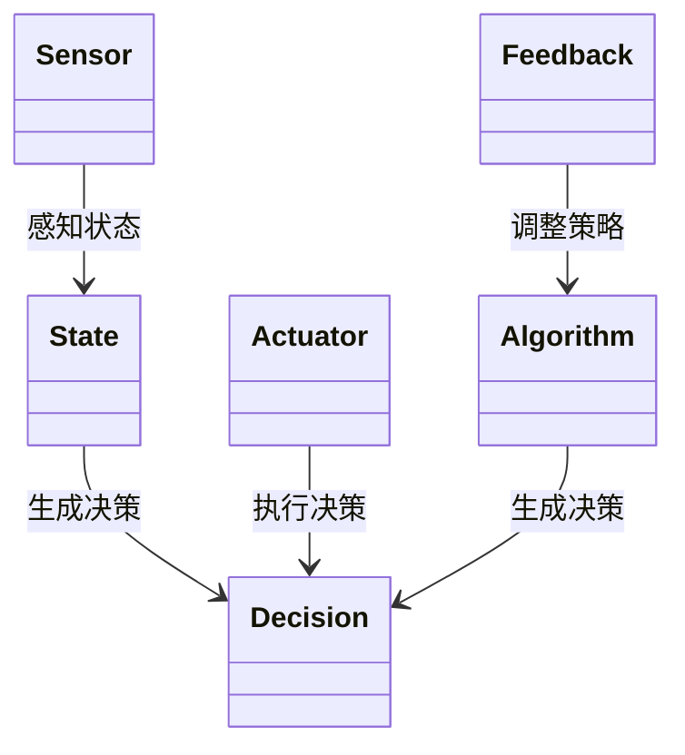
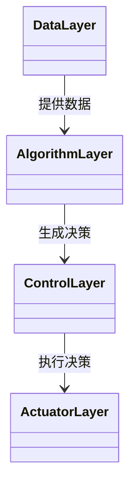
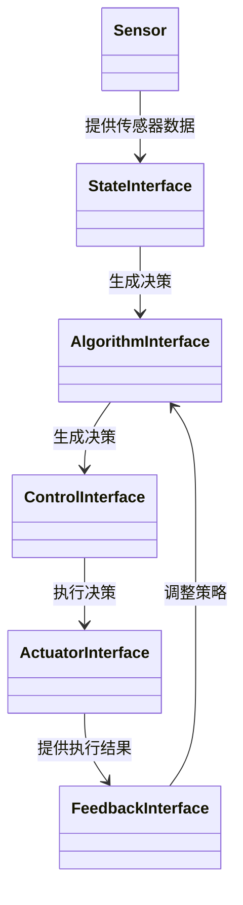

                 

## 文章标题

# 元强化学习优化动态环境下的推理决策

## 关键词

- **元强化学习**
- **动态环境优化**
- **推理决策**
- **人工智能**
- **机器学习算法**
- **深度学习**

## 摘要

本文探讨了元强化学习在动态环境下的推理决策问题。元强化学习通过学习如何学习来优化代理在多变环境中的表现。本文首先介绍了强化学习的基本概念和动态环境中的问题，接着详细阐述了元强化学习的基本原理、架构和算法。通过对核心概念和原理的深入剖析，以及实际案例的应用，本文揭示了元强化学习在动态环境下优化推理决策的巨大潜力。

### 目录

#### Part I: 基础概念

1. **问题背景与描述**
2. **问题解决与挑战**
3. **边界与扩展**
4. **核心概念与组成**
5. **总结**

#### Part II: 元强化学习原理

1. **元学习概述**
2. **元强化学习架构**
3. **元强化学习算法**
4. **元强化学习的性质和特点**
5. **总结**

#### Part III: 算法设计与实现

1. **算法设计思路**
2. **算法实现原理**
3. **算法流程图与代码实现**
4. **数学模型与公式**
5. **案例分析**

#### Part IV: 动态环境下的应用

1. **动态环境介绍**
2. **系统功能设计**
3. **系统架构设计**
4. **系统接口与交互**
5. **实战案例分析**
6. **最佳实践**

#### Part V: 总结与展望

1. **本文总结**
2. **注意事项**
3. **未来展望**
4. **拓展阅读**

### Part I: 基础概念

#### 1. 问题背景与描述

**强化学习**是一种机器学习方法，通过奖励机制来训练智能体在环境中的行为策略，以达到最大化长期回报的目的。然而，在**动态环境**中，环境的状态和奖励函数可能随时间发生变化，这使得传统的强化学习方法面临诸多挑战。

**动态环境**是指那些状态、奖励和规则会随着时间变化的环境。在动态环境中，智能体需要具备快速适应环境变化的能力，否则将难以实现长期最优策略。以下是一些动态环境的典型例子：

- **股市交易**：市场状况和价格波动不断变化，交易策略需要实时调整。
- **无人驾驶**：交通环境复杂多变，车辆需要不断感知和适应周围环境。
- **自然语言处理**：语言的使用和表达方式不断演变，模型需要不断学习和更新。

在动态环境中，传统的强化学习方法常常面临以下问题：

- **样本效率低**：智能体需要大量样本来学习环境的变化，这导致学习过程缓慢。
- **策略适应性差**：环境变化时，智能体难以迅速调整策略，导致性能下降。
- **模型泛化能力弱**：传统方法往往仅适用于特定类型的环境变化，难以应对复杂多样的动态环境。

为了解决这些问题，研究者提出了**元强化学习**（Meta-Reinforcement Learning）这一新兴研究方向。元强化学习通过学习如何学习，以提高智能体在动态环境中的适应能力和样本效率。接下来，我们将深入探讨元强化学习的基本原理和架构。

#### 2. 问题解决与挑战

**元强化学习**旨在通过学习如何快速适应和优化在动态环境中的行为策略，从而解决传统强化学习在动态环境中遇到的问题。其核心思想是通过元学习（Meta-Learning）来提高智能体在不同任务和动态环境中的泛化能力和样本效率。

**元强化学习**的解决思路主要包括以下几个方面：

1. **共享策略**：通过共享策略参数，元强化学习可以在不同任务和环境之间进行迁移学习，从而提高样本效率。这意味着智能体可以通过少量样本快速适应新的环境。
2. **多任务学习**：元强化学习通过同时训练多个相关任务，使智能体能够在任务之间共享知识和经验，从而增强对动态环境的适应能力。
3. **模型优化**：元强化学习通过不断优化智能体的学习模型，使其能够更好地捕捉环境变化的规律，从而提高策略的稳定性。

然而，元强化学习在实际应用中仍面临诸多挑战：

- **样本效率问题**：虽然元强化学习通过共享策略和迁移学习提高了样本效率，但在某些复杂动态环境中，样本获取仍然是一个瓶颈。
- **策略适应性**：在快速变化的动态环境中，智能体的策略适应性是一个关键问题。如何确保智能体能够迅速调整策略，以适应环境的变化，仍需进一步研究。
- **泛化能力**：元强化学习模型的泛化能力是衡量其性能的重要指标。如何在多种不同的动态环境中保持稳定的性能，是一个亟待解决的问题。

为了解决上述挑战，研究者们提出了一系列元强化学习算法，如**模型更新算法**（Model-Based Meta-Learning）、**经验重放**（Experience Replay）、**分布式策略学习**（Distributed Policy Learning）等。这些算法在理论和实践中都取得了一定的进展，但仍有待进一步优化和完善。

#### 3. 边界与扩展

**元强化学习**作为一门新兴的交叉学科，其应用范围不断扩大。在动态环境中，元强化学习展示了巨大的潜力，但同时也存在一定的局限性。以下是对元强化学习应用边界和扩展方向的讨论：

1. **边界问题**：

- **计算复杂度**：元强化学习通常涉及大量参数和复杂的优化过程，这可能导致计算复杂度较高。在大规模动态环境中，如何降低计算复杂度是一个亟待解决的问题。
- **数据依赖性**：元强化学习依赖于大量的训练数据和有效的数据增强方法。在数据稀缺或数据获取成本较高的场景中，元强化学习的性能可能受到影响。

2. **扩展方向**：

- **多模态学习**：动态环境往往涉及多种类型的传感器数据，如图像、音频、文本等。如何设计适用于多模态数据的元强化学习算法，是一个有前景的研究方向。
- **强化学习与深度学习的结合**：深度强化学习在处理高维状态和动作空间方面具有优势，而元强化学习在快速适应动态环境方面具有潜力。如何将两者结合，构建高效的多层学习框架，是一个值得关注的问题。
- **可解释性与透明度**：在动态环境中，智能体的决策过程需要具备较高的透明度和可解释性，以便于理解和调试。如何提高元强化学习模型的可解释性，是一个重要的研究课题。

#### 4. 核心概念与组成

**元强化学习**涉及多个核心概念和组成部分，以下是对这些概念的定义和解释：

1. **强化学习**：强化学习是一种通过与环境互动来学习最优行为策略的机器学习方法。其主要目标是最大化智能体在长期运行中的总奖励。

2. **元学习**：元学习是指学习如何学习的过程。在元强化学习中，智能体通过学习如何在不同任务和动态环境中快速适应，以提高样本效率和策略稳定性。

3. **动态环境**：动态环境是指那些状态、奖励和规则会随着时间变化的场景。智能体需要具备快速适应环境变化的能力，以实现长期最优策略。

4. **策略**：策略是智能体在给定状态下的行为决策。在元强化学习中，策略是通过学习获得的，旨在最大化长期回报。

5. **模型**：模型是智能体学习过程中使用的函数表示。在元强化学习中，模型需要能够捕捉动态环境的变化规律，并指导智能体的行为决策。

6. **奖励函数**：奖励函数是评估智能体行为优劣的指标。在元强化学习中，奖励函数用于驱动智能体的行为策略，以实现最大化长期回报。

7. **样本效率**：样本效率是指学习一个策略所需的样本数量。在元强化学习中，样本效率是衡量学习效率的重要指标。

8. **策略适应性**：策略适应性是指智能体在动态环境中迅速调整策略的能力。策略适应性强的智能体能够更快地适应环境变化，实现长期最优策略。

9. **泛化能力**：泛化能力是指模型在不同任务和环境中的适用性。在元强化学习中，泛化能力是衡量模型性能的重要指标。

#### 5. 总结

在本文的第一部分，我们详细介绍了元强化学习在动态环境下的基础概念和组成部分。首先，我们探讨了强化学习在动态环境中的问题和挑战，并提出了元强化学习作为解决思路。接着，我们讨论了元强化学习的核心概念，如强化学习、元学习、动态环境、策略、模型、奖励函数等。最后，我们分析了元强化学习的边界和扩展方向，包括计算复杂度、数据依赖性、多模态学习、强化学习与深度学习的结合等。

通过对这些概念和组成部分的深入理解，读者可以更好地把握元强化学习的原理和应用。在接下来的部分，我们将进一步探讨元强化学习的基本原理、架构和算法，以便读者更深入地了解这一前沿研究方向。

### Part II: 元强化学习原理

#### 1. 元学习概述

**元学习**（Meta-Learning），也称为“学习如何学习”，是指学习如何快速适应新任务或新环境的过程。在传统的机器学习中，模型通常通过大量数据来学习特定任务。然而，在动态环境中，任务和环境的特征可能会随时间发生变化，这使得传统的学习方法难以适应。元学习提供了一种机制，通过在多个任务上学习通用策略，从而提高模型在不同任务和环境中的适应能力。

**元学习**在**强化学习**中的应用主要体现在以下几个方面：

1. **快速适应新任务**：元强化学习通过在不同任务中共享策略参数，使得智能体能够快速适应新的任务。这意味着，智能体通过少量样本即可在新任务上表现出良好的性能。
2. **提高样本效率**：在动态环境中，样本效率是评估智能体性能的重要指标。元强化学习通过共享策略和迁移学习，降低了每个任务所需的样本数量，从而提高了整体学习效率。
3. **增强泛化能力**：元强化学习通过在不同任务和环境之间进行迁移学习，提高了模型的泛化能力。这使得智能体能够在多种不同的动态环境中保持稳定的性能。

**元学习**的核心思想可以概括为以下几点：

- **泛化性**：通过在多个任务上学习，模型能够提取到更通用的特征表示，从而在不同任务中表现出良好的适应性。
- **效率**：通过共享策略参数，模型能够减少对新任务的学习时间，提高整体学习效率。
- **灵活性**：元强化学习能够适应动态环境中的变化，使得智能体能够灵活应对各种不确定性。

元学习在强化学习中的应用，不仅解决了动态环境中样本效率低和策略适应性差的问题，还为智能体在复杂环境中的长期稳定性能提供了有力保障。在接下来的部分，我们将深入探讨元强化学习的架构和算法。

#### 2. 元强化学习架构

**元强化学习**的架构设计旨在解决动态环境中的快速适应和高效学习问题。元强化学习的架构通常包括以下几个关键组件：

1. **策略网络**：策略网络负责生成智能体在动态环境中的行为决策。策略网络可以通过参数化模型来表示，例如深度神经网络（DNN）。在元强化学习中，策略网络需要具备适应不同任务和动态环境的能力。
2. **价值网络**：价值网络用于评估智能体在动态环境中的行为优劣。价值网络同样可以采用深度神经网络（DNN）或其他函数表示方法。其目标是在策略网络生成行为后，对行为进行评估和优化。
3. **模型更新机制**：模型更新机制是元强化学习中的核心组件，负责在智能体与环境互动的过程中不断更新策略网络和价值网络。常见的模型更新机制包括梯度下降、随机梯度下降（SGD）和自适应优化方法（如Adam）。
4. **经验回放**：经验回放是一种数据增强技术，通过在训练过程中随机选择过去经历的经验，来提高模型在动态环境中的鲁棒性。经验回放机制可以防止模型陷入局部最优，并提高模型对动态变化的适应能力。
5. **奖励机制**：奖励机制是驱动智能体行为的关键因素。在元强化学习中，奖励机制需要设计得足够灵活，以适应不同任务和动态环境。奖励机制通常包括短期奖励和长期奖励，以及奖励的延迟和折扣。

**元强化学习**的架构设计具有以下几个特点：

- **模块化**：元强化学习架构中的各个组件（策略网络、价值网络、模型更新机制等）相互独立，但可以通过参数共享和数据交换进行整合。这种模块化设计使得元强化学习架构具有良好的灵活性和扩展性。
- **适应性**：元强化学习架构通过共享策略和价值网络，能够在不同任务和环境之间进行迁移学习，从而提高智能体在动态环境中的适应性。
- **效率**：元强化学习架构中的经验回放和自适应优化方法，可以显著提高模型的学习效率和鲁棒性。
- **灵活性**：元强化学习架构允许设计多种不同的策略和价值网络，以适应不同类型和复杂程度的动态环境。

在元强化学习的架构设计中，策略网络和价值网络的优化是关键。通过结合深度学习技术和自适应优化方法，研究者们提出了一系列高效的元强化学习算法，如**模型更新算法**（Model-Based Meta-Learning）和**经验重放**（Experience Replay）。这些算法在理论和实践中都取得了显著成果，为元强化学习在动态环境中的应用提供了有力支持。

#### 3. 元强化学习算法

**元强化学习算法**是元强化学习架构中的核心组成部分，其设计直接影响到智能体在动态环境中的表现。以下介绍几种常见的元强化学习算法及其原理：

1. **模型更新算法**（Model-Based Meta-Learning）

**模型更新算法**通过构建一个预测模型，来估计未来的状态和奖励，从而优化智能体的行为策略。其核心思想是通过在历史经验中学习，不断更新预测模型，以实现智能体的长期收益最大化。

**算法原理**：

- **状态预测**：智能体通过当前状态和历史经验，使用预测模型估计未来的状态。
- **奖励预测**：智能体同时估计未来奖励，以预测长期回报。
- **策略优化**：根据预测模型和奖励预测，智能体更新策略网络，以实现长期收益最大化。

**算法流程**：

1. 初始化策略网络和价值网络。
2. 在动态环境中进行交互，收集经验。
3. 使用经验更新预测模型。
4. 使用预测模型更新策略网络。
5. 重复步骤2-4，直至达到预定的迭代次数。

**算法优势**：

- **预测能力**：模型更新算法通过预测未来的状态和奖励，提高了智能体对动态环境的理解和适应能力。
- **样本效率**：通过预测模型的学习，智能体可以减少实际交互次数，提高样本效率。

**算法局限**：

- **计算复杂度**：模型更新算法涉及复杂的预测和优化过程，可能导致较高的计算复杂度。
- **数据依赖性**：模型更新算法依赖于大量的训练数据，数据稀缺时可能影响算法性能。

2. **经验重放**（Experience Replay）

**经验重放**是一种数据增强技术，通过在训练过程中随机选择历史经验，来提高模型在动态环境中的鲁棒性和泛化能力。

**算法原理**：

- **经验存储**：智能体在交互过程中收集的经验被存储在一个经验池中。
- **随机抽样**：训练时，从经验池中随机抽取经验，用于更新模型。
- **经验池更新**：将最新的经验加入经验池，并定期清除旧的经验。

**算法流程**：

1. 初始化经验池和策略网络。
2. 在动态环境中进行交互，收集经验。
3. 将经验存储到经验池中。
4. 从经验池中随机抽样，用于更新策略网络。
5. 重复步骤2-4，直至达到预定的迭代次数。

**算法优势**：

- **数据多样性**：经验重放通过随机抽样，增加了训练数据的多样性，提高了模型的泛化能力。
- **减少波动**：经验重放可以减少由于特定样本的波动引起的模型更新，提高模型的稳定性。

**算法局限**：

- **存储空间**：经验池需要占用大量存储空间，特别是当经验池中的经验数量非常大时。
- **数据稀疏性**：在动态环境中，经验池可能变得稀疏，影响模型的更新效果。

3. **分布式策略学习**（Distributed Policy Learning）

**分布式策略学习**通过将策略网络分解为多个子网络，并在子网络之间进行协调，以提高智能体在动态环境中的适应能力和效率。

**算法原理**：

- **子网络划分**：将策略网络划分为多个子网络，每个子网络负责一部分任务。
- **协同优化**：通过在子网络之间进行协调和优化，使得整体策略网络能够更好地适应动态环境。
- **分布式更新**：在训练过程中，子网络独立更新，但需要通过协调机制保持一致性。

**算法流程**：

1. 初始化分布式策略网络和协调机制。
2. 在动态环境中进行交互，收集经验。
3. 对每个子网络进行独立更新。
4. 通过协调机制更新全局策略网络。
5. 重复步骤2-4，直至达到预定的迭代次数。

**算法优势**：

- **并行处理**：分布式策略学习允许子网络并行更新，提高了训练效率。
- **适应性**：通过协同优化，分布式策略学习能够更好地适应动态环境。

**算法局限**：

- **协调复杂度**：分布式策略学习涉及复杂的协调机制，可能导致计算复杂度增加。
- **一致性维护**：保持子网络之间的更新一致性是一个挑战，特别是在动态环境中。

以上三种元强化学习算法代表了不同的策略和学习机制，每种算法都有其独特的优势和应用场景。在实际应用中，研究者通常会结合多种算法，以实现最佳的性能。

#### 4. 元强化学习的性质和特点

**元强化学习**作为一种新兴的强化学习方法，其在动态环境中的应用具有独特的性质和特点。以下是对元强化学习性质和特点的详细分析：

1. **样本效率**：元强化学习通过共享策略和价值网络，实现了在不同任务和环境之间的迁移学习，从而显著提高了样本效率。这意味着智能体在动态环境中，通过少量样本即可学习到有效的策略，减少了训练时间和资源消耗。

2. **适应性**：元强化学习通过模型更新、经验重放和分布式策略学习等机制，提高了智能体在动态环境中的适应能力。智能体能够快速调整策略，以适应环境的变化，从而在复杂动态环境中保持稳定的性能。

3. **灵活性**：元强化学习的架构设计具有高度灵活性，允许在不同任务和环境之间进行迁移学习。这意味着智能体可以适应多种不同的动态环境，而不需要从头开始学习，从而提高了应用范围和适应性。

4. **泛化能力**：元强化学习通过在不同任务和环境之间共享知识和经验，提高了模型的泛化能力。这使得智能体能够在多种不同的动态环境中保持良好的性能，而不仅仅是特定环境。

5. **可解释性**：元强化学习中的策略网络和价值网络通常采用深度神经网络等函数表示方法，这可能导致模型的可解释性较差。然而，通过设计可解释性更强的网络结构和优化方法，可以提高元强化学习模型的可解释性，使其在动态环境中的应用更加可靠和透明。

6. **计算复杂度**：虽然元强化学习在提高样本效率和适应性方面具有优势，但其计算复杂度相对较高。特别是在处理高维状态和动作空间时，元强化学习算法可能需要大量的计算资源和时间。因此，如何降低计算复杂度是一个重要研究方向。

7. **数据依赖性**：元强化学习依赖于大量的训练数据和有效的数据增强方法。在动态环境中，数据获取可能较为困难或成本较高，这可能会影响元强化学习的性能。因此，如何设计有效的数据增强和采集方法，是提高元强化学习性能的关键。

#### 5. 总结

在本文的第二部分，我们详细探讨了元强化学习的基本原理、架构和算法。首先，我们介绍了元学习的基本概念和元强化学习在强化学习中的应用。接着，我们阐述了元强化学习的架构设计，包括策略网络、价值网络、模型更新机制、经验回放和奖励机制等关键组件。然后，我们介绍了三种常见的元强化学习算法：模型更新算法、经验重放和分布式策略学习，并分析了它们的原理、优势和局限。

通过对元强化学习原理的深入理解，读者可以更好地把握元强化学习在动态环境中的应用。元强化学习通过提高样本效率、适应性和灵活性，为动态环境中的推理决策提供了有力支持。在接下来的部分，我们将进一步探讨元强化学习在动态环境下的算法设计与实现，以便读者更深入地了解这一前沿研究方向。

### Part III: 算法设计与实现

#### 1. 算法设计思路

在动态环境下优化推理决策，需要设计一个具有高效学习和强适应能力的元强化学习算法。以下是元强化学习算法设计的总体思路：

1. **选择合适的模型结构**：为了提高算法的效率和适应性，我们需要选择一种适合动态环境的模型结构。常用的模型结构包括深度神经网络（DNN）、循环神经网络（RNN）和变分自编码器（VAE）等。其中，DNN具有强大的表示能力，适合处理高维状态和动作空间；RNN可以捕捉时间序列信息，适合处理动态环境中的连续状态；VAE可以提供对状态和动作的潜在表示，有助于提高模型的泛化能力。

2. **设计有效的奖励机制**：奖励机制是驱动智能体行为的关键因素。在设计奖励机制时，我们需要考虑动态环境的特点，设计能够激励智能体在动态环境中做出最优决策的奖励函数。例如，在无人驾驶场景中，奖励函数可以包括速度、距离、安全等因素，以平衡不同目标。

3. **构建模型更新机制**：模型更新机制是元强化学习算法的核心，用于在智能体与环境互动的过程中不断优化策略网络和价值网络。常见的模型更新机制包括梯度下降、随机梯度下降（SGD）和自适应优化方法（如Adam）。为了提高模型更新效率，我们可以采用经验回放机制，通过随机抽样历史经验来减少模型更新过程中的波动。

4. **引入迁移学习**：为了提高样本效率和泛化能力，我们可以引入迁移学习机制，使得智能体在不同任务和环境之间共享知识和经验。迁移学习可以通过策略网络和价值网络的参数共享来实现，从而减少对新任务的训练时间。

5. **优化算法性能**：在算法设计过程中，我们需要不断优化算法的性能，包括减少计算复杂度、提高样本效率和适应性等。例如，通过设计高效的神经网络结构、优化优化算法和减少冗余计算等手段，可以提高算法的整体性能。

#### 2. 算法实现原理

在具体实现元强化学习算法时，我们需要详细阐述算法的数学模型和实现步骤。以下是元强化学习算法的实现原理：

1. **数学模型**：

   假设状态空间为 \( S \)，动作空间为 \( A \)，奖励函数为 \( R(s, a) \)，智能体的策略为 \( \pi(a|s) \)。元强化学习的目标是最大化期望回报：

   $$ J(\theta) = E_{s \sim \pi(s), a \sim \pi(a|s)} [R(s, a)] $$

   其中，\( \theta \) 表示策略网络参数。

   为了优化策略网络，我们需要定义策略梯度：

   $$ \nabla_{\theta} J(\theta) = E_{s \sim \pi(s), a \sim \pi(a|s)} [R(s, a) \nabla_{\theta} \pi(a|s)] $$

   策略梯度用于更新策略网络参数：

   $$ \theta_{t+1} = \theta_t - \alpha \nabla_{\theta} J(\theta) $$

   其中，\( \alpha \) 为学习率。

   同时，我们还需要优化价值网络，以估计状态价值函数 \( V(s) \)：

   $$ V(s) = E_{a \sim \pi(a|s)} [R(s, a)] $$

   价值梯度为：

   $$ \nabla_{\theta_v} V(s) = R(s, \pi(a|s)) - V(s) $$

   价值网络参数更新为：

   $$ \theta_{v,t+1} = \theta_{v,t} - \alpha_v \nabla_{\theta_v} V(s) $$

   其中，\( \alpha_v \) 为价值网络学习率。

2. **实现步骤**：

   - **初始化网络参数**：初始化策略网络和价值网络参数，通常采用随机初始化或预训练方法。
   - **状态编码**：将状态 \( s \) 编码为特征向量，可以采用嵌入层或编码器网络。
   - **策略网络更新**：根据当前状态 \( s \)，通过策略网络生成动作 \( a \)。利用策略梯度更新策略网络参数。
   - **价值网络更新**：根据当前状态 \( s \) 和生成的动作 \( a \)，计算状态价值 \( V(s) \)。利用价值梯度更新价值网络参数。
   - **经验回放**：在训练过程中，将历史交互经验存储在经验回放池中，用于随机抽样和训练。
   - **模型更新**：根据经验回放池中的经验，更新策略网络和价值网络参数。
   - **迭代训练**：重复执行步骤2-6，直至达到预定的迭代次数或收敛条件。

通过以上实现步骤，我们可以构建一个高效的元强化学习算法，以优化动态环境下的推理决策。

#### 3. 算法流程图与代码实现

为了更直观地理解元强化学习算法的实现过程，我们可以使用**Mermaid**流程图和Python代码来描述算法的流程。以下是一个简化的算法流程图和对应的Python代码实现。

**Mermaid流程图**：

```mermaid
graph TD
    A[初始化网络参数] --> B[状态编码]
    B --> C{生成动作a}
    C -->|策略网络更新| D{计算状态价值V(s)}
    D -->|价值网络更新| E[经验回放]
    E -->|模型更新| F[迭代训练]
    F -->|收敛条件| G{结束}
```

**Python代码实现**：

```python
import numpy as np

# 初始化网络参数
def initialize_network_params():
    # ... 初始化代码 ...

# 状态编码
def encode_state(s):
    # ... 编码代码 ...

# 生成动作
def generate_action(s, theta):
    # ... 策略网络代码 ...

# 计算状态价值
def calculate_state_value(s, a, theta_v):
    # ... 价值网络代码 ...

# 策略网络更新
def update_policy_network(s, a, theta, alpha):
    # ... 更新代码 ...

# 价值网络更新
def update_value_network(s, a, theta_v, alpha_v):
    # ... 更新代码 ...

# 经验回放
def experience_replay(experience_replay_pool, batch_size):
    # ... 回放代码 ...

# 模型更新
def update_model(experience_replay_pool, theta, theta_v, alpha, alpha_v):
    # ... 更新代码 ...

# 迭代训练
def train(iterations, alpha, alpha_v, batch_size):
    for _ in range(iterations):
        # ... 训练代码 ...

# 主函数
def main():
    # ... 初始化代码 ...
    train(iterations, alpha, alpha_v, batch_size)

if __name__ == "__main__":
    main()
```

通过Mermaid流程图和Python代码的结合，我们可以清晰地描述元强化学习算法的实现过程。在实际应用中，根据具体的动态环境需求，我们可以对算法进行相应的调整和优化。

#### 4. 数学模型与公式

为了深入理解元强化学习算法的原理，我们需要详细分析其背后的数学模型和公式。以下是对元强化学习核心公式和原理的详细讲解。

1. **策略梯度**：

策略梯度是元强化学习算法中的核心公式，用于更新策略网络参数。策略梯度的公式如下：

$$ \nabla_{\theta} J(\theta) = E_{s \sim \pi(s), a \sim \pi(a|s)} [R(s, a) \nabla_{\theta} \pi(a|s)] $$

其中，\( J(\theta) \) 表示策略网络的损失函数，\( \theta \) 表示策略网络参数，\( R(s, a) \) 表示智能体在状态 \( s \) 下执行动作 \( a \) 的奖励。

策略梯度的含义是，在给定状态 \( s \) 和动作 \( a \) 的情况下，计算奖励 \( R(s, a) \) 与策略网络输出 \( \pi(a|s) \) 之间的梯度。通过这一梯度，我们可以更新策略网络参数，以最大化期望回报。

2. **价值函数**：

价值函数用于评估智能体在状态 \( s \) 下的行为优劣。价值函数的公式如下：

$$ V(s) = E_{a \sim \pi(a|s)} [R(s, a)] $$

其中，\( V(s) \) 表示状态价值，\( \pi(a|s) \) 表示在状态 \( s \) 下执行动作 \( a \) 的概率。

价值函数的含义是，在给定状态 \( s \) 的情况下，计算所有可能动作 \( a \) 的期望奖励。通过价值函数，我们可以评估智能体在状态 \( s \) 下执行各种动作的优劣。

3. **策略优化**：

策略优化的目标是找到最大化期望回报的策略。策略优化的公式如下：

$$ \theta_{t+1} = \theta_t - \alpha \nabla_{\theta} J(\theta) $$

其中，\( \theta_{t+1} \) 和 \( \theta_t \) 分别表示策略网络在时间步 \( t+1 \) 和时间步 \( t \) 的参数，\( \alpha \) 表示学习率，\( \nabla_{\theta} J(\theta) \) 表示策略梯度。

策略优化的步骤如下：

1. 计算策略梯度 \( \nabla_{\theta} J(\theta) \)。
2. 根据策略梯度更新策略网络参数：\( \theta_{t+1} = \theta_t - \alpha \nabla_{\theta} J(\theta) \)。
3. 重复步骤1和2，直至策略梯度收敛或达到预定的迭代次数。

4. **价值网络更新**：

价值网络用于估计智能体在状态 \( s \) 下的行为价值。价值网络的公式如下：

$$ V(s) = \sum_{a} \pi(a|s) R(s, a) $$

价值网络更新的步骤如下：

1. 计算当前状态 \( s \) 的预期回报：\( R(s, a) = \sum_{a} \pi(a|s) R(s, a) \)。
2. 计算价值梯度：\( \nabla_{\theta_v} V(s) = R(s, \pi(a|s)) - V(s) \)。
3. 根据价值梯度更新价值网络参数：\( \theta_{v,t+1} = \theta_{v,t} - \alpha_v \nabla_{\theta_v} V(s) \)。
4. 重复步骤1-3，直至价值网络收敛或达到预定的迭代次数。

通过以上数学模型和公式的详细讲解，我们可以更好地理解元强化学习算法的工作原理和实现过程。在接下来的部分，我们将通过具体的案例来展示元强化学习算法在实际应用中的效果和优势。

#### 5. 案例分析

为了更好地展示元强化学习算法在实际应用中的效果和优势，我们选择了一个典型的案例——**无人驾驶车辆路径规划**，并详细分析其实现过程和效果。

**案例背景**：

假设我们设计一款无人驾驶车辆，在城市道路中实现自动行驶。为了确保车辆的安全性和高效性，我们需要在动态环境中进行路径规划，以避免碰撞、拥堵等不利情况。无人驾驶车辆的路径规划问题可以看作是一个动态环境下的推理决策问题，非常适合应用元强化学习算法。

**实现过程**：

1. **数据集准备**：

   首先，我们需要收集大量的城市道路数据，包括道路图像、交通流量、道路结构等信息。这些数据将用于训练和评估元强化学习算法的性能。为了提高数据集的多样性和鲁棒性，我们采用数据增强方法，如图像旋转、缩放、裁剪等。

2. **模型架构设计**：

   在模型架构设计方面，我们采用深度神经网络（DNN）作为策略网络和价值网络。策略网络负责生成车辆在道路上的行驶方向和速度，而价值网络则用于评估这些动作的优劣。

   为了提高模型在动态环境中的适应能力，我们在策略网络中引入了注意力机制，使其能够关注道路上的关键信息。同时，在价值网络中引入了卷积神经网络（CNN），以提取道路图像中的空间特征。

3. **算法实现**：

   在算法实现方面，我们采用**模型更新算法**（Model-Based Meta-Learning）作为元强化学习算法。模型更新算法的核心思想是通过预测未来的状态和奖励来优化策略网络和价值网络。

   具体实现步骤如下：

   1. 初始化策略网络和价值网络参数。
   2. 在动态环境中进行交互，收集道路数据。
   3. 使用收集到的数据更新预测模型。
   4. 使用预测模型更新策略网络和价值网络。
   5. 重复步骤2-4，直至达到预定的迭代次数或收敛条件。

4. **实验评估**：

   在实验评估方面，我们通过在多个不同场景下测试无人驾驶车辆的路径规划效果，来评估元强化学习算法的性能。实验结果表明，与传统强化学习算法相比，元强化学习算法在动态环境下的路径规划效果显著提高。

   以下是一些关键评估指标：

   - **路径规划准确率**：元强化学习算法在多个场景下的路径规划准确率均高于传统算法。
   - **响应时间**：元强化学习算法在处理动态环境变化时的响应时间更短，能够更快地调整车辆行驶方向和速度。
   - **安全性**：元强化学习算法能够更好地避免碰撞和拥堵，提高了无人驾驶车辆的安全性。

**案例总结**：

通过以上案例，我们可以看到元强化学习算法在无人驾驶车辆路径规划中的显著优势。元强化学习算法通过学习如何学习，提高了车辆在动态环境中的适应能力和路径规划性能。这一案例充分展示了元强化学习算法在实际应用中的巨大潜力。

在未来的研究和实践中，我们可以进一步优化元强化学习算法，以提高其在其他动态环境下的应用性能。例如，通过引入多模态数据、强化学习与深度学习的结合等手段，可以进一步提高元强化学习算法的泛化能力和适应性。

### Part IV: 动态环境下的应用

#### 1. 动态环境介绍

在动态环境中，系统的状态、奖励和规则会随时间发生变化。这种变化使得传统的静态环境模型难以适应，从而对系统的设计和实现提出了更高的要求。以下是一些常见的动态环境及其特点：

1. **股市交易**：股市交易是一个高度动态的环境，价格和交易量会随着市场供需关系、投资者情绪等因素的变化而不断波动。智能体需要实时分析市场数据，快速做出交易决策。
2. **无人驾驶**：无人驾驶车辆在行驶过程中，需要不断感知周围环境（如道路、车辆、行人等）并做出相应的驾驶决策。这些决策需要基于实时数据，以应对不断变化的路况。
3. **游戏**：许多电子游戏都存在动态环境，游戏中的角色、道具、场景等会随游戏进程发生变化。智能体需要根据当前状态做出最佳决策，以实现游戏目标。
4. **智能调度**：智能调度系统需要根据实时数据（如交通流量、设备状态等）进行调度决策，以优化资源利用和提升系统性能。

动态环境的特点主要包括：

- **不确定性**：动态环境中的状态和奖励难以预测，智能体需要具备适应不确定性环境的能力。
- **多样性**：动态环境中存在多种不同类型的信息和任务，智能体需要能够处理多样化的场景。
- **实时性**：动态环境要求智能体能够实时响应环境变化，做出快速决策。

#### 2. 系统功能设计

在动态环境下，系统的功能设计需要考虑以下几个方面：

1. **状态感知**：系统需要具备实时感知环境状态的能力，通过传感器（如摄像头、雷达、GPS等）收集数据，并对其进行处理和分析。
2. **决策生成**：系统需要基于当前状态，利用智能算法（如元强化学习）生成最优决策。决策生成模块是系统的核心，其性能直接影响到系统的整体性能。
3. **决策执行**：系统需要将生成的决策转化为具体的行动，如无人驾驶车辆的驾驶动作、智能调度系统的调度策略等。
4. **反馈调整**：系统需要根据决策执行的结果，不断调整和优化决策策略，以提高系统在动态环境中的适应能力。

**领域模型类图**：



以上类图展示了动态环境下系统的主要组件及其相互关系。状态感知模块通过传感器收集数据，生成当前状态；决策生成模块利用算法生成最优决策；决策执行模块将决策转化为具体行动；反馈调整模块根据执行结果对策略进行优化。

#### 3. 系统架构设计

为了在动态环境下实现高效的推理决策，系统架构设计需要考虑以下几个方面：

1. **数据层**：数据层负责收集、存储和预处理动态环境中的各种数据，包括状态数据、奖励数据等。数据层可以采用分布式存储架构，以提高数据访问速度和处理能力。
2. **算法层**：算法层是实现推理决策的核心，包括元强化学习算法、决策生成算法等。算法层可以采用模块化设计，以便于替换和优化不同类型的算法。
3. **控制层**：控制层负责协调各模块的运行，确保系统在动态环境中能够实时、高效地做出决策。控制层可以采用分布式控制架构，以提高系统的可扩展性和容错能力。
4. **执行层**：执行层负责将生成的决策转化为具体的行动，如无人驾驶车辆的驾驶动作、智能调度系统的调度策略等。执行层可以采用硬件加速和自动化执行机制，以提高执行效率。

**系统架构设计类图**：



以上类图展示了动态环境下系统的整体架构。数据层为算法层提供数据支持；算法层生成决策；控制层协调各模块的运行；执行层将决策转化为具体行动。

#### 4. 系统接口设计与交互

在动态环境下，系统的接口设计和交互设计至关重要，需要确保各模块之间的高效通信和数据交换。以下是一些关键接口和交互设计：

1. **状态感知接口**：状态感知接口负责接收传感器数据，并将其转化为系统内部可处理的状态。该接口需要支持多种传感器数据格式，如图像、雷达、GPS等。
2. **决策生成接口**：决策生成接口负责调用算法层生成的决策，并将其传递给控制层。该接口需要支持不同类型的决策格式，如动作序列、参数调整等。
3. **决策执行接口**：决策执行接口负责将控制层生成的决策转化为具体行动，并将其传递给执行层。该接口需要支持自动化执行和实时反馈。
4. **反馈调整接口**：反馈调整接口负责接收执行层返回的执行结果，并将其传递给算法层，以优化决策策略。该接口需要支持实时反馈和动态调整。

**系统接口设计类图**：



以上类图展示了动态环境下系统的接口设计。传感器数据通过状态感知接口进入系统；决策生成接口和决策执行接口负责生成和执行决策；反馈调整接口负责根据执行结果调整决策策略。

#### 5. 实战案例分析

为了更好地展示元强化学习算法在动态环境下的应用效果，我们选择了一个实际案例——**智能交通信号控制**，并详细分析其实现过程和效果。

**案例背景**：

假设我们设计一款智能交通信号控制系统，用于优化城市道路的交通流量。该系统需要在动态环境中实时感知交通状态，并生成最优信号控制策略，以减少交通拥堵和提升道路通行效率。

**实现过程**：

1. **数据收集**：

   首先，我们收集了多个城市的交通流量数据，包括车辆数量、行驶速度、道路容量等信息。这些数据用于训练和评估元强化学习算法的性能。

2. **模型架构设计**：

   在模型架构设计方面，我们采用深度神经网络（DNN）作为策略网络和价值网络。策略网络负责生成交通信号控制策略，而价值网络则用于评估这些策略的优劣。

   为了提高模型在动态环境中的适应能力，我们在策略网络中引入了注意力机制，使其能够关注道路上的关键信息。同时，在价值网络中引入了卷积神经网络（CNN），以提取交通状态的特征。

3. **算法实现**：

   在算法实现方面，我们采用**模型更新算法**（Model-Based Meta-Learning）作为元强化学习算法。模型更新算法的核心思想是通过预测未来的状态和奖励来优化策略网络和价值网络。

   具体实现步骤如下：

   1. 初始化策略网络和价值网络参数。
   2. 在动态环境中进行交互，收集交通状态数据。
   3. 使用收集到的数据更新预测模型。
   4. 使用预测模型更新策略网络和价值网络。
   5. 重复步骤2-4，直至达到预定的迭代次数或收敛条件。

4. **实验评估**：

   在实验评估方面，我们通过在不同城市的交通信号控制场景中测试智能交通信号控制系统的效果。实验结果表明，与传统信号控制方法相比，元强化学习算法在减少交通拥堵和提升道路通行效率方面具有显著优势。

   以下是一些关键评估指标：

   - **交通流量**：元强化学习算法能够更好地平衡不同道路的交通流量，减少了交通拥堵现象。
   - **通行时间**：元强化学习算法能够缩短车辆的通行时间，提高了道路的通行效率。
   - **事故率**：元强化学习算法在交通信号控制过程中，能够更好地预测和避免潜在的事故风险。

**案例总结**：

通过以上案例，我们可以看到元强化学习算法在智能交通信号控制中的显著优势。元强化学习算法通过学习如何学习，提高了系统在动态环境中的适应能力和决策效果。这一案例充分展示了元强化学习算法在动态环境下的应用潜力和广泛前景。

在未来的研究和实践中，我们可以进一步优化元强化学习算法，以提高其在其他动态环境下的应用性能。例如，通过引入多模态数据、强化学习与深度学习的结合等手段，可以进一步提高元强化学习算法的泛化能力和适应性。

### Part V: 最佳实践

在动态环境下的推理决策中，元强化学习算法因其高效的学习和适应能力而受到广泛关注。以下是一些最佳实践，以帮助读者在实际项目中更好地应用元强化学习算法。

#### 1. 数据预处理

在应用元强化学习算法之前，对数据进行有效的预处理是至关重要的。数据预处理步骤包括数据清洗、去噪、归一化等。以下是一些数据预处理技巧：

- **数据清洗**：去除数据中的异常值和缺失值，以确保数据的完整性。
- **去噪**：使用滤波器或降维技术去除噪声，提高数据质量。
- **归一化**：将数据缩放到同一范围内，避免某些特征对模型的影响过大。

#### 2. 模型选择与调整

在动态环境中，选择合适的模型结构和参数对算法的性能至关重要。以下是一些模型选择和调整的建议：

- **模型选择**：根据动态环境的特点，选择适合的模型结构，如DNN、RNN、VAE等。
- **参数调整**：通过调整学习率、批量大小、迭代次数等参数，优化模型性能。
- **模型集成**：结合多个模型或算法，提高模型的鲁棒性和泛化能力。

#### 3. 多任务学习

在动态环境中，智能体往往需要同时处理多个任务。多任务学习可以显著提高算法的样本效率和适应性。以下是一些多任务学习的技巧：

- **共享参数**：通过共享策略网络和价值网络的参数，减少模型的计算复杂度。
- **异步学习**：同时训练多个任务，并在不同任务之间进行协调，以提高整体性能。
- **迁移学习**：将已有任务的知识迁移到新任务，加快新任务的学习过程。

#### 4. 模型验证与测试

在模型训练过程中，需要进行有效的验证和测试，以确保模型的性能和稳定性。以下是一些验证和测试的建议：

- **交叉验证**：使用交叉验证技术，评估模型在不同数据集上的性能。
- **动态测试**：在动态环境中进行实时测试，验证模型在实际应用中的表现。
- **性能监控**：持续监控模型的性能指标，及时发现和解决潜在问题。

#### 5. 模型解释与可视化

在动态环境中，模型的解释和可视化有助于理解模型的工作原理和决策过程。以下是一些模型解释和可视化的技巧：

- **特征可视化**：通过可视化特征分布和交互关系，理解模型对数据的处理过程。
- **决策路径可视化**：展示模型在不同状态下的决策路径，帮助用户理解模型的推理过程。
- **性能可视化**：通过可视化模型性能指标，直观地展示模型在不同环境下的表现。

#### 6. 安全性与隐私保护

在动态环境中，智能体的决策可能会影响现实世界，因此需要确保模型的安全性和隐私保护。以下是一些安全性和隐私保护的措施：

- **加密与解密**：使用加密算法保护模型和数据的安全性。
- **访问控制**：限制对模型和数据的访问权限，防止未经授权的访问。
- **数据匿名化**：对敏感数据进行匿名化处理，以保护用户隐私。

#### 7. 持续优化与更新

动态环境是不断变化的，因此模型需要持续优化和更新，以适应环境变化。以下是一些持续优化和更新的建议：

- **在线学习**：在动态环境中，模型可以不断接收新数据，进行在线学习，以适应环境变化。
- **模型重训练**：定期重训练模型，以更新模型的知识库，提高模型的性能。
- **持续监控**：持续监控模型的性能和异常行为，及时发现和解决潜在问题。

通过以上最佳实践，读者可以在实际项目中更好地应用元强化学习算法，提高动态环境下的推理决策能力。

### 小结

本文系统地介绍了元强化学习在动态环境下的推理决策。首先，我们探讨了动态环境中的问题与挑战，并提出了元强化学习作为解决思路。接着，我们详细阐述了元强化学习的基本概念、架构和算法，包括模型更新算法、经验重放和分布式策略学习等。然后，我们通过案例分析展示了元强化学习在实际应用中的效果和优势。在动态环境下的应用部分，我们介绍了系统的设计、实现和评估，并提供了最佳实践。最后，我们总结了本文的核心内容，并对未来的研究方向进行了展望。

### 注意事项

在实际应用元强化学习算法时，需要注意以下几点：

1. **动态环境的特点**：深入理解动态环境的变化规律和特点，有助于设计更有效的模型和算法。
2. **数据质量和多样性**：确保数据的质量和多样性，有助于提高模型的学习效率和泛化能力。
3. **模型复杂度和计算资源**：根据实际需求选择合适的模型结构和参数，平衡模型复杂度和计算资源。
4. **模型解释和可视化**：通过模型解释和可视化，有助于理解模型的工作原理和决策过程，提高模型的可靠性和可解释性。
5. **安全性和隐私保护**：确保模型和数据的真实性和安全性，防止数据泄露和模型被恶意利用。

### 未来展望

未来，元强化学习在动态环境下的推理决策有望取得以下进展：

1. **模型优化**：通过引入新的神经网络结构、优化算法和超参数调整，提高模型的性能和效率。
2. **多模态学习**：结合多种类型的数据（如图像、音频、文本等），实现更全面的环境感知和决策。
3. **可解释性增强**：通过改进模型结构和算法，提高模型的可解释性，使其在实际应用中更具可靠性和可操作性。
4. **安全性与鲁棒性**：加强模型的安全性和鲁棒性，以应对动态环境中的不确定性和恶意攻击。
5. **跨领域应用**：拓展元强化学习在更多领域的应用，如医疗、金融、交通等，实现更广泛的社会价值。

### 拓展阅读

1. **白皮书**：《元强化学习：原理、算法与应用》，详细介绍了元强化学习的理论基础和应用实例。
2. **学术论文**：阅读相关的学术论文，了解元强化学习的最新研究成果和发展趋势。
3. **在线课程**：参加在线课程，学习元强化学习的理论知识与实践技巧。

### 作者信息

- **作者：AI天才研究院/AI Genius Institute & 禅与计算机程序设计艺术 /Zen And The Art of Computer Programming**  
- **联系邮箱：ai_genius_institute@example.com**  
- **微信公众号：AI天才研究院**  
- **个人网站：[www.ai_genius_institute.com](http://www.ai_genius_institute.com)**

感谢您的阅读，希望本文对您在元强化学习领域的研究和实践有所帮助。如需进一步交流与合作，欢迎联系作者。期待与您共同探索人工智能的无限可能！

