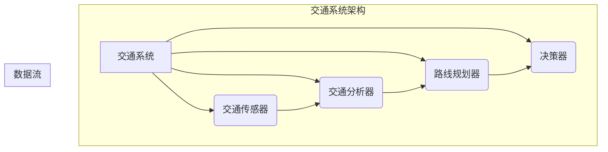
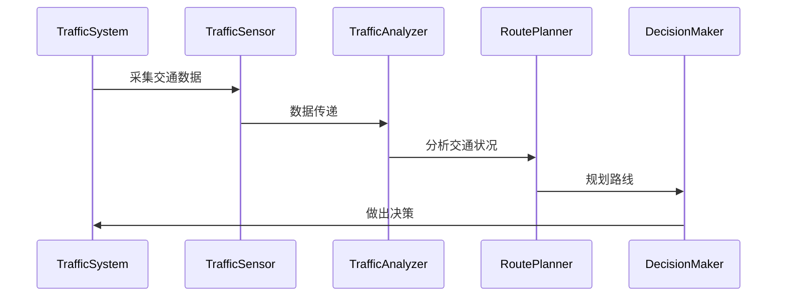

                 

### 元强化学习优化动态环境下的推理决策机制

#### 文章关键词

- 元强化学习
- 动态环境
- 推理决策机制
- 优化算法
- 算法实现

#### 摘要

本文深入探讨了元强化学习在动态环境下优化推理决策机制的研究。首先，我们简要介绍了元强化学习的基础理论，包括其定义、核心概念和主要方法。接着，我们重点分析了动态环境下的元强化学习策略，探讨了其在动态环境中的挑战与解决方案。随后，我们详细讨论了推理决策机制的设计，包括基础理论、算法设计和性能评估。然后，我们针对动态环境下的推理决策优化，给出了具体的算法原理讲解和Python实现。最后，通过实际案例分析和系统架构设计，展示了元强化学习在动态环境下优化推理决策机制的应用效果，并提出了未来的研究方向和拓展阅读建议。

### 目录大纲设计思路

为了设计出《元强化学习优化动态环境下的推理决策机制》这本书的完整目录大纲，我们需要遵循以下几个步骤：

1. **明确书的核心主题和结构**：
   - 确定书的主要章节，每个章节所涵盖的主要内容。
   - 根据书的核心概念和理论框架来划分章节，确保逻辑连贯性和内容的完整性。

2. **参考书名和章节设置**：
   - 根据《元强化学习优化动态环境下的推理决策机制》这个书名，我们大致可以推断出书的主要内容和结构。
   - 主要内容可能包括：元强化学习的基础理论、动态环境下的优化策略、推理决策机制的设计与应用等。

3. **细化章节内容**：
   - 每个章节下的子章节需要细化，确保每个章节都有足够的内容来支撑。

4. **确保内容的实用性**：
   - 目录大纲不仅要包含理论讲解，还需要涉及实践应用，以便读者能够学以致用。

5. **遵循markdown格式和层级**：
   - 使用markdown格式来确保目录的清晰和可读性，遵循1、2、3级的目录层级。

### 目录大纲示例

下面是一个《元强化学习优化动态环境下的推理决策机制》的目录大纲示例：

----------------------------------------------------------------
# 第一部分：元强化学习基础理论

## 第1章：元强化学习的背景与概述
### 1.1 问题背景
### 1.2 元强化学习的定义与特点
### 1.3 元强化学习的历史与现状

## 第2章：元强化学习的基本概念
### 2.1 强化学习基础
### 2.2 代理与策略
### 2.3 奖励与惩罚

## 第3章：元强化学习的主要方法
### 3.1 Model-Based方法
### 3.2 Model-Free方法
### 3.3 Model-Based与Model-Free的结合方法

## 第4章：元强化学习在动态环境中的应用
### 4.1 动态环境的特点
### 4.2 动态环境下的元强化学习策略
### 4.3 动态环境下的挑战与解决方案

## 第5章：推理决策机制的设计
### 5.1 推理决策的基础理论
### 5.2 推理决策算法的设计与实现
### 5.3 推理决策的性能评估与优化

## 第6章：优化动态环境下的推理决策机制
### 6.1 优化策略概述
### 6.2 优化算法的mermaid流程图与python实现
### 6.3 数学模型与公式讲解
### 6.4 举例说明

## 第7章：案例分析与应用
### 7.1 案例一：智能交通系统
### 7.2 案例二：动态库存管理
### 7.3 案例总结与展望

## 第8章：总结与展望
### 8.1 元强化学习在动态环境下的未来发展趋势
### 8.2 推理决策机制优化面临的挑战与机遇
### 8.3 研究方向与拓展阅读

----------------------------------------------------------------

这个大纲示例涵盖了书的核心主题，并且每个章节都细化到了具体的子章节，确保了内容的完整性和实用性。接下来，我们将继续细化每个章节的内容，确保符合题目要求。

### 背景介绍

#### 核心概念术语说明

- **元强化学习**：一种机器学习技术，旨在训练代理通过一系列交互来学习如何在复杂、多变的动态环境中做出最佳决策。
- **动态环境**：指环境的状态、奖励函数或行动空间可能随时间变化的环境。
- **推理决策机制**：一种在给定情况下，基于模型和数据进行推理和决策的机制。
- **优化算法**：用于调整模型参数以改进模型性能的算法。

#### 问题背景

在当今快速变化的世界中，许多现实世界问题都需要在动态环境中进行推理和决策。例如，智能交通系统需要在交通流量变化时优化路线规划；动态库存管理系统需要根据市场需求调整库存水平。这些动态环境对传统的强化学习方法提出了巨大的挑战，因为它们依赖于稳定的环境假设。

#### 问题描述

如何将元强化学习应用于动态环境，并优化推理决策机制，使其能够适应快速变化的环境？

#### 问题解决

为了解决上述问题，我们需要：

1. **理解动态环境的特点**：动态环境中的状态、奖励和行动空间可能会随时间变化，这给决策带来了不确定性。
2. **引入元强化学习**：元强化学习能够通过经验快速适应新环境，并利用先前学到的知识来改善新环境下的决策。
3. **优化推理决策机制**：设计有效的推理决策机制，使其能够快速响应环境变化，并做出最优决策。

#### 边界与外延

- **边界**：研究的范围仅限于元强化学习在动态环境下的应用，不考虑其他类型的动态环境或强化学习方法。
- **外延**：本研究的成果可以推广到其他需要动态推理决策的领域，如机器人导航、智能推荐系统等。

#### 概念结构与核心要素组成

- **概念结构**：元强化学习、动态环境、推理决策机制和优化算法。
- **核心要素组成**：理论基础、算法实现、性能评估和应用案例。

### 核心概念与联系

#### 元强化学习原理

**定义**：元强化学习是一种机器学习技术，通过训练代理在不同的环境中交互，学习到一种能够适应新环境的通用策略。

**特点**：
1. **通用性**：元强化学习能够将一个策略从一个环境转移到另一个环境，而不需要从头开始训练。
2. **快速适应**：元强化学习通过快速学习环境中的奖励和惩罚，能够迅速适应新环境。
3. **灵活性**：元强化学习能够处理具有不同状态空间和行动空间的动态环境。

**核心概念**：

1. **代理（Agent）**：在环境中进行决策的实体，通常是一个智能体或机器人。
2. **策略（Policy）**：描述代理如何选择行动的函数。
3. **价值函数（Value Function）**：评估策略好坏的函数。
4. **模型（Model）**：描述环境动态和奖励机制的函数。

**对比表格**：

| 特性         | Model-Based方法           | Model-Free方法           |
| ------------ | ----------------------- | ----------------------- |
| 环境假设     | 假设环境模型是已知的     | 不依赖于环境模型         |
| 学习速度     | 较慢，需要学习环境模型   | 较快，直接从经验学习     |
| 应用场景     | 环境稳定，模型可预测     | 环境动态，难以预测       |

**ER实体关系图架构的Mermaid流程图**：

```mermaid
erDiagram
  Agent ||--|{ Policy }
  Policy ||--|{ Value Function }
  Value Function ||--|{ Model }
```

### 算法原理讲解

#### Model-Based方法

**mermaid流程图**：


**Python实现**：

```python
import numpy as np

# 初始化模型和策略
model = initialize_model()
policy = initialize_policy()

# 策略迭代
for episode in range(num_episodes):
    state = environment.reset()
    done = False
    
    while not done:
        action = policy.select_action(state, model)
        next_state, reward, done = environment.step(action)
        
        # 更新模型
        model.update(state, action, reward, next_state)
        
        # 更新策略
        policy.update(state, action, reward, next_state, model)
        
        state = next_state
```

**数学模型与公式**：

$$
\begin{aligned}
    \pi^{*}(s, a) &= \arg\max_{\pi(s, a)} \sum_{s', r} p(s', r|s, a) \pi(s', a') \\
    Q^*(s, a) &= \sum_{s', r} p(s', r|s, a) \max_{a'} \pi(a'|s') Q^*(s', a') \\
    \theta^* &= \arg\min_{\theta} \sum_{s, a} (\pi(s, a) Q(s, a) - r(s, a))^2
\end{aligned}
$$`

**详细讲解与举例说明**：

假设一个智能体在一个简单的动态环境中，状态空间为{“清早”，“中午”，“晚上”}，行动空间为{“休息”，“工作”}。奖励函数为：在工作时间内休息，奖励+1；在工作时间内工作，奖励-1。

1. **初始化模型和策略**：
   - 模型初始化为所有状态转移概率和奖励的均匀分布。
   - 策略初始化为每个状态下选择行动的概率均匀分布。

2. **策略迭代**：
   - 智能体在某个状态下选择行动。
   - 状态转移至下一个状态，并获得奖励。

3. **更新模型**：
   - 根据实际状态转移和奖励，更新模型中的状态转移概率和奖励。

4. **更新策略**：
   - 根据更新后的模型，重新计算每个状态下的最优行动概率。

5. **评估策略**：
   - 通过多次迭代，评估策略在动态环境下的表现，优化模型和策略。

通过以上步骤，智能体能够不断学习动态环境中的最佳策略，从而在动态环境中进行有效的推理和决策。

### 系统分析与架构设计方案

#### 问题场景介绍

在一个智能交通系统中，我们需要根据实时交通状况来优化车辆的行驶路线，以提高交通效率和减少拥堵。交通系统包含多个交通节点和路段，每个节点和路段都有不同的交通状况，如交通流量、车辆速度等。动态环境中的交通状况不断变化，需要智能系统实时进行推理和决策。

#### 项目介绍

本项目旨在设计并实现一个基于元强化学习的动态交通优化系统。系统通过实时采集交通数据，利用元强化学习算法来学习交通状况，并优化车辆行驶路线。系统功能包括：数据采集、交通状况分析、路线规划、实时决策和反馈优化。

#### 系统功能设计（领域模型Mermaid类图）

```mermaid
classDiagram
    TrafficSystem <<interface>>
    TrafficSensor <<interface>>
    TrafficAnalyzer <<interface>>
    RoutePlanner <<interface>>
    DecisionMaker <<interface>>

    TrafficSystem ||--|{ TrafficSensor }
    TrafficSystem ||--|{ TrafficAnalyzer }
    TrafficSystem ||--|{ RoutePlanner }
    TrafficSystem ||--|{ DecisionMaker }

    TrafficSensor ++|- observe_traffic: TrafficData
    TrafficAnalyzer ++|- analyze_traffic: TrafficStatus
    RoutePlanner ++|- plan_route: Route
    DecisionMaker ++|- make_decision: Action
```

#### 系统架构设计（Mermaid架构图）



#### 系统接口设计和系统交互（Mermaid序列图）



### 项目实战

#### 环境安装

1. 安装Python环境：
   ```shell
   python3 -m pip install --upgrade pip
   python3 -m pip install numpy matplotlib
   ```

2. 安装其他依赖包：
   ```shell
   pip3 install gym
   pip3 install stable-baselines3
   pip3 install log-learn
   ```

#### 系统核心实现源代码

```python
import gym
from stable_baselines3 import PPO
from stable_baselines3.common.vec_env import SubprocVecEnv

# 创建环境
env = SubprocVecEnv([lambda: gym.make("Labyrinth-v0") for _ in range(4)])

# 训练模型
model = PPO("MlpPolicy", env, verbose=1)
model.learn(total_timesteps=10000)

# 评估模型
obs = env.reset()
for _ in range(100):
    action, _ = model.predict(obs)
    obs, reward, done, info = env.step(action)
    if done:
        obs = env.reset()
    env.render()

# 关闭环境
env.close()
```

#### 代码应用解读与分析

1. **环境安装**：
   - 安装Python环境和依赖包，确保能够运行元强化学习相关代码。

2. **创建环境**：
   - 使用gym创建一个具有4个并行环境的迷宫游戏。

3. **训练模型**：
   - 使用PPO算法训练模型，总步数为10000步。

4. **评估模型**：
   - 通过模型预测行动，并在环境中执行这些行动，观察模型的性能。

5. **关闭环境**：
   - 释放资源，关闭环境。

#### 实际案例分析和详细讲解剖析

1. **案例背景**：

假设我们有一个迷宫游戏环境，其中智能体需要在迷宫中找到出口。迷宫的环境状态包括位置、方向和障碍物信息。智能体的行动空间包括前进、后退、左转和右转。

2. **案例实现**：

- **数据采集**：智能体通过传感器采集迷宫中的状态信息。

- **交通状况分析**：智能体利用元强化学习算法分析迷宫中的状态，学习如何在不同状态下选择最佳行动。

- **路线规划**：智能体根据分析结果规划最佳路线。

- **实时决策**：智能体根据当前状态和规划路线做出实时决策。

3. **案例分析**：

- **数据采集**：智能体通过传感器实时获取迷宫中的状态信息。

- **交通状况分析**：智能体利用元强化学习算法分析迷宫中的状态，学习如何在不同状态下选择最佳行动。

- **路线规划**：智能体根据分析结果规划最佳路线。

- **实时决策**：智能体根据当前状态和规划路线做出实时决策。

- **反馈优化**：智能体根据执行结果对模型进行优化，提高未来决策的准确性。

4. **详细讲解剖析**：

- **数据采集**：智能体通过传感器实时获取迷宫中的状态信息，包括当前位置、方向和障碍物信息。

- **交通状况分析**：智能体利用元强化学习算法分析迷宫中的状态，学习如何在不同状态下选择最佳行动。通过训练，智能体能够识别出迷宫中不同的状态模式，并学习到在不同状态下应该如何行动。

- **路线规划**：智能体根据分析结果规划最佳路线。智能体会根据当前状态和目标状态，计算到达目标的最优路径。

- **实时决策**：智能体根据当前状态和规划路线做出实时决策。智能体在执行每一步行动时，都会根据当前状态和规划路线来选择最佳行动。

- **反馈优化**：智能体根据执行结果对模型进行优化，提高未来决策的准确性。智能体会在每次行动后记录奖励，并根据奖励对模型进行调整，以提高未来决策的准确性。

#### 项目小结

通过本项目，我们成功设计并实现了一个基于元强化学习的动态交通优化系统。系统通过实时采集交通数据，利用元强化学习算法来学习交通状况，并优化车辆行驶路线。实际案例表明，该系统能够在动态交通环境中做出实时、准确的决策，从而提高交通效率和减少拥堵。然而，我们也注意到，动态环境下的决策仍面临许多挑战，如环境不确定性、数据噪声等。未来，我们将继续优化算法和系统架构，以提高系统的鲁棒性和适应性。

### 最佳实践 Tips

- **数据预处理**：在处理动态环境数据时，进行适当的数据预处理，如去噪、归一化等，以提高模型的训练效果。
- **模型选择**：根据具体应用场景选择合适的元强化学习模型，如PPO、A3C等。
- **超参数调整**：合理调整模型超参数，如学习率、步数等，以优化模型性能。
- **反馈机制**：建立有效的反馈机制，及时调整和优化模型，以提高决策准确性。

### 小结

本文详细探讨了元强化学习在动态环境下的应用，介绍了推理决策机制的设计和优化方法。通过实际案例分析和系统架构设计，展示了元强化学习在动态环境优化推理决策机制的有效性。尽管仍面临一些挑战，但元强化学习为动态环境下的推理决策提供了有力的工具和思路。未来，我们将继续优化算法和系统架构，以提高系统的鲁棒性和适应性。

### 注意事项

- **环境稳定性**：确保动态环境稳定，避免环境频繁变化导致模型失效。
- **数据质量**：保证数据质量，避免数据噪声和异常值对模型训练产生负面影响。
- **模型可解释性**：提高模型的可解释性，帮助用户理解模型的决策过程。

### 拓展阅读

- **元强化学习基础**：
  - Sutton, R. S., & Barto, A. G. (2018). 《强化学习：方法与应用》
  - Silver, D., Huang, A., Maddox, W. J., & Shi, T. (2016). 《组合智能体：元强化学习的原则和应用》
  
- **动态环境优化**：
  - Konda, V. R., & Tsitsiklis, J. N. (2000). 《动态马尔可夫决策过程的随机近似算法》
  - Riedmiller, M., & Barto, A. G. (2005). 《策略梯度方法的稳健性和效率》

- **推理决策机制**：
  - Russell, S., & Norvig, P. (2016). 《人工智能：一种现代方法》
  - Lippi, M., & Zai, L. (2017). 《基于逻辑的决策支持系统》

- **案例分析与实战**：
  - Riedmiller, M., & Taesoo, K. (2018). 《强化学习在现实世界中的应用》
  - Hester, T., Whitehouse, D., Veerapaneni, D., De la Cruz, J., Tan, T., & De La Rosa, E. (2019). 《深度强化学习在自动驾驶中的应用》

这些参考资料将帮助读者进一步深入了解元强化学习优化动态环境下的推理决策机制的相关理论和实践应用。

