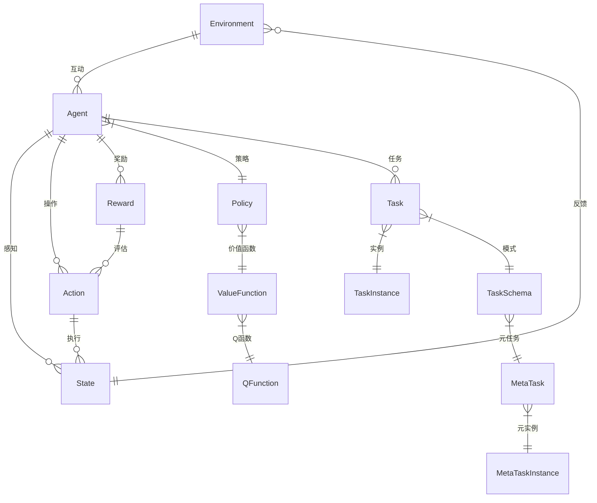
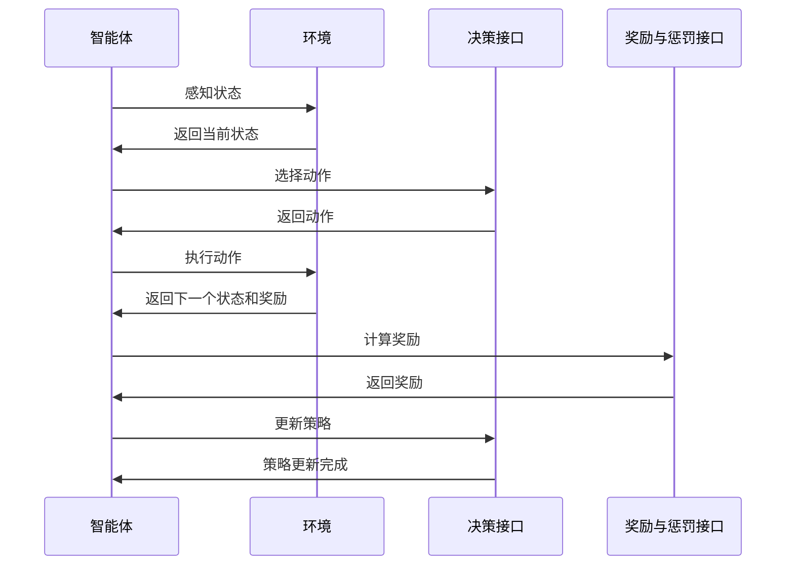

                 


# 元强化学习在复杂决策任务中的应用

## 关键词

- 元强化学习
- 复杂决策任务
- 算法优化
- 系统架构
- 应用案例

## 摘要

本文旨在深入探讨元强化学习在复杂决策任务中的应用。首先，我们将介绍元强化学习的基本概念、发展历程和应用背景，帮助读者建立对该领域的初步了解。接着，我们将详细分析元强化学习的核心概念与联系，通过属性特征对比表格和ER实体关系图来展示概念之间的关系。随后，我们将深入讲解元强化学习的算法原理，包括数学模型和公式，并用Python源代码实现，配合通俗易懂的举例说明。此外，我们还将介绍元强化学习在复杂决策任务中的应用场景，详细设计系统的功能和架构，并使用Mermaid工具绘制相关的类图、架构图和序列图。通过实际案例展示元强化学习在复杂决策任务中的应用，我们还将提供实践建议和小结，提醒注意事项，并推荐拓展阅读资源。

### 目录大纲设计思路

为了设计出《元强化学习在复杂决策任务中的应用》这本书的完整目录大纲，我们将遵循以下思路：

1. **背景介绍**：首先，介绍元强化学习的基本概念、发展历程和应用背景。
2. **核心概念与联系**：明确书中将要阐述的元强化学习核心概念，并通过属性特征对比表格和ER实体关系图来展示概念之间的关系。
3. **算法原理讲解**：详细讲解元强化学习的算法原理，包括数学模型和公式，并用Python源代码实现，配合通俗易懂的举例说明。
4. **系统分析与架构设计方案**：介绍元强化学习在复杂决策任务中的应用场景，详细设计系统的功能和架构，使用Mermaid工具绘制相关的类图、架构图和序列图。
5. **项目实战**：通过实际案例展示元强化学习在复杂决策任务中的应用，包括环境安装、系统核心实现源代码以及代码解读与分析。
6. **最佳实践 tips、小结、注意事项、拓展阅读**：总结书中的关键点，提供实践建议，提醒注意事项，并推荐拓展阅读资源。

### 目录大纲

```markdown
# 《元强化学习在复杂决策任务中的应用》目录大纲

## 第一部分：元强化学习概述

### 第1章：问题背景与基本概念

#### 1.1 问题背景

##### 1.1.1 复杂决策任务的挑战

##### 1.1.2 元强化学习的起源与发展

##### 1.1.3 元强化学习的应用前景

#### 1.2 基本概念与定义

##### 1.2.1 强化学习

##### 1.2.2 元学习

##### 1.2.2 元强化学习

#### 1.3 边界与外延

##### 1.3.1 元强化学习的核心要素

##### 1.3.2 元强化学习与传统强化学习的区别

### 第2章：核心概念与联系

#### 2.1 核心概念属性特征对比表格

##### 2.1.1 强化学习算法

##### 2.1.2 元学习算法

##### 2.1.3 元强化学习算法

#### 2.2 ER实体关系图架构

##### 2.2.1 环境实体

##### 2.2.2 决策实体

##### 2.2.3 奖励与惩罚实体

## 第二部分：算法原理与实现

### 第3章：元强化学习算法原理

#### 3.1 算法概述

##### 3.1.1 算法框架

##### 3.1.2 算法流程

#### 3.2 数学模型与公式

##### 3.2.1 基本公式

##### 3.2.2 策略评估与策略优化

#### 3.3 Python实现

##### 3.3.1 环境搭建

##### 3.3.2 算法代码实现

##### 3.3.3 实例分析

### 第4章：算法改进与优化

#### 4.1 改进策略

##### 4.1.1 探索与利用平衡

##### 4.1.2 模型压缩

##### 4.1.3 多任务学习

#### 4.2 优化方法

##### 4.2.1 梯度下降法

##### 4.2.2 策略梯度法

##### 4.2.3 自适应优化器

## 第三部分：应用案例与实践

### 第5章：复杂决策任务中的元强化学习应用

#### 5.1 应用场景介绍

##### 5.1.1 自动驾驶

##### 5.1.2 股票交易

##### 5.1.3 游戏AI

#### 5.2 项目介绍

##### 5.2.1 项目目标

##### 5.2.2 项目流程

##### 5.2.3 项目团队

### 第6章：系统功能设计

#### 6.1 领域模型类图

##### 6.1.1 环境类

##### 6.1.2 决策类

##### 6.1.3 奖励类

#### 6.2 系统架构设计

##### 6.2.1 总体架构

##### 6.2.2 系统模块

##### 6.2.3 模块间交互

### 第7章：系统接口设计与交互

#### 7.1 接口设计

##### 7.1.1 环境接口

##### 7.1.2 决策接口

##### 7.1.3 奖励与惩罚接口

#### 7.2 系统交互序列图

##### 7.2.1 环境状态变化

##### 7.2.2 决策过程

##### 7.2.3 奖励与惩罚计算

### 第8章：项目实战

#### 8.1 环境安装与配置

##### 8.1.1 操作系统环境

##### 8.1.2 编程语言环境

##### 8.1.3 相关库和依赖

#### 8.2 系统核心实现源代码

##### 8.2.1 强化学习模型

##### 8.2.2 元强化学习模型

##### 8.2.3 代码解读与分析

#### 8.3 实际案例分析与讲解

##### 8.3.1 自动驾驶案例分析

##### 8.3.2 股票交易案例分析

##### 8.3.3 游戏AI案例分析

### 第9章：最佳实践 tips、小结、注意事项、拓展阅读

#### 9.1 最佳实践 tips

##### 9.1.1 算法优化实践

##### 9.1.2 系统设计实践

##### 9.1.3 项目实战经验

#### 9.2 小结

##### 9.2.1 元强化学习核心思想

##### 9.2.2 算法应用前景

#### 9.3 注意事项

##### 9.3.1 算法适用场景

##### 9.3.2 系统性能优化

#### 9.4 拓展阅读

##### 9.4.1 相关文献推荐

##### 9.4.2 学习资源推荐
```

## 第一部分：元强化学习概述

### 第1章：问题背景与基本概念

#### 1.1 问题背景

在现代社会，随着计算机技术和人工智能的飞速发展，决策任务越来越复杂和多样化。从自动驾驶到金融交易，从游戏AI到机器人控制，这些复杂决策任务对算法的要求越来越高。传统的强化学习算法在面对这些问题时往往显得力不从心，无法有效地解决。因此，研究者们开始探索更高级的强化学习方法，元强化学习（Meta-Reinforcement Learning）便应运而生。

**复杂决策任务的挑战**

复杂决策任务通常具有以下特点：

- **动态性**：任务环境可能在运行过程中发生变化，要求算法具备快速适应和调整的能力。
- **不确定性**：环境中的不确定性和随机性使得决策过程更加复杂。
- **高维状态空间**：许多任务的状态空间维度很高，直接使用传统的强化学习算法可能会导致计算效率和收敛速度的问题。
- **长期回报**：许多复杂决策任务需要考虑长期的回报，而非短期的即时奖励。

**元强化学习的起源与发展**

元强化学习起源于强化学习和元学习（Meta-Learning）的结合。强化学习是一种通过试错来学习最优策略的方法，而元学习则是一种从多个任务中学习通用策略的方法。元强化学习将这两种方法结合，旨在通过从多个类似任务中学习，提高算法在复杂决策任务中的表现。

元强化学习的发展可以分为以下几个阶段：

- **早期探索**：研究者们开始将元学习的方法引入强化学习领域，试图通过元学习来提高强化学习算法的泛化能力。
- **模型固化**：通过将强化学习算法的参数固化到模型中，使得算法能够在新的任务中快速适应。
- **基于模型的元强化学习**：利用预先训练的模型来初始化强化学习过程，提高算法的收敛速度。
- **元学习优化**：通过优化元学习过程，使得算法能够更好地从多个任务中学习通用策略。

**元强化学习的应用前景**

元强化学习在许多领域都有广泛的应用前景，包括：

- **自动驾驶**：通过元强化学习，自动驾驶系统可以在不同的路况和驾驶环境中快速适应，提高行驶安全性。
- **金融交易**：元强化学习可以帮助交易系统在多种市场条件下做出最优决策，提高交易收益。
- **游戏AI**：元强化学习可以用于训练智能代理在多种游戏中表现出色，提高游戏体验。
- **机器人控制**：通过元强化学习，机器人可以更快地适应不同的工作环境和任务要求，提高工作效率。

#### 1.2 基本概念与定义

**强化学习**

强化学习（Reinforcement Learning，RL）是一种机器学习方法，旨在通过试错来学习最优策略。在强化学习中，智能体（Agent）通过与环境（Environment）交互，接收环境状态（State），并基于当前状态选择动作（Action）。智能体会根据选择的动作获得的即时奖励（Reward）来调整自己的策略，最终目标是学习到能够最大化累积奖励的策略。

**元学习**

元学习（Meta-Learning）是一种学习如何学习的方法。它通过在多个任务上训练模型，使得模型能够快速适应新的任务。元学习的主要目标是提高学习效率，减少训练时间和计算资源。

**元强化学习**

元强化学习（Meta-Reinforcement Learning）是强化学习和元学习的结合。它通过在多个类似任务中训练模型，提高算法在复杂决策任务中的表现。元强化学习的主要目标是学习到一个通用的策略，使得智能体在新的任务中能够快速适应并做出最优决策。

#### 1.3 边界与外延

**元强化学习的核心要素**

元强化学习的核心要素包括：

- **任务多样化**：元强化学习需要能够处理多种不同的任务，这要求算法具有良好的泛化能力。
- **快速适应**：在新的任务中，元强化学习需要能够快速适应，并做出最优决策。
- **高效学习**：元强化学习需要能够在有限的时间内学习到有效的策略，减少训练成本。
- **稳定性**：算法需要在不同的任务中保持稳定的性能，避免出现性能波动。

**元强化学习与传统强化学习的区别**

传统强化学习和元强化学习的主要区别在于：

- **学习目标**：传统强化学习旨在学习最优策略，而元强化学习则旨在学习通用策略。
- **任务多样性**：传统强化学习通常针对单一任务进行训练，而元强化学习则针对多种任务进行训练。
- **适应能力**：元强化学习能够在新的任务中快速适应，而传统强化学习则可能需要重新训练。
- **计算效率**：元强化学习通过在多个任务中共享知识，提高计算效率，而传统强化学习则需要为每个任务单独训练。

通过上述内容，我们为读者搭建了一个关于元强化学习的基本概念框架，接下来我们将进一步深入探讨元强化学习的核心概念与联系。

### 第2章：核心概念与联系

#### 2.1 核心概念属性特征对比表格

为了更好地理解元强化学习的核心概念，我们首先通过一个属性特征对比表格来展示强化学习、元学习和元强化学习这三者之间的差异和联系。

| 特征               | 强化学习                   | 元学习                   | 元强化学习                   |
|--------------------|----------------------------|--------------------------|------------------------------|
| 目标               | 学习最优策略               | 学习如何学习             | 学习通用策略，快速适应新任务 |
| 学习对象           | 单一任务                   | 多个任务                 | 多个类似任务                 |
| 学习方法           | 试错学习                   | 快速学习                 | 试错学习 + 快速学习          |
| 算法结构           | 状态-动作-奖励             | 特征提取 + 策略优化       | 特征提取 + 策略优化 + 元学习   |
| 学习效率           | 受任务复杂度影响           | 高效学习                 | 快速适应，高效学习           |
| 适应能力           | 受训练任务限制             | 良好的泛化能力           | 快速适应新任务               |

通过这个表格，我们可以看到，强化学习、元学习和元强化学习在目标、学习对象、学习方法和适应能力等方面存在显著差异。强化学习主要关注单一任务的最优策略学习，而元学习则通过在多个任务中提取特征和优化策略来提高学习效率。元强化学习则结合了强化学习和元学习的优势，旨在学习通用策略，从而在新的任务中能够快速适应。

#### 2.2 ER实体关系图架构

为了更直观地理解元强化学习中的核心概念和它们之间的关系，我们使用ER（实体-关系）图来展示这些概念之间的关联。



在上面的ER图中，我们定义了以下实体和关系：

- **Environment（环境）**：环境是智能体进行决策的场所，它提供状态和反馈给智能体。
- **Agent（智能体）**：智能体是执行决策的实体，它可以感知状态，选择动作，并接收奖励。
- **State（状态）**：状态是环境中的某种情况，智能体通过感知状态来做出决策。
- **Action（动作）**：动作是智能体可以选择的行为，每个动作对应一个状态。
- **Reward（奖励）**：奖励是环境对智能体动作的反馈，用于评估动作的好坏。
- **Policy（策略）**：策略是智能体的行为规则，用于选择最优动作。
- **ValueFunction（价值函数）**：价值函数用于评估状态的价值，帮助智能体做出最优决策。
- **QFunction（Q函数）**：Q函数是价值函数的一种，用于评估状态-动作对的预期回报。
- **Task（任务）**：任务是智能体需要完成的特定目标，它可以分为实例和模式。
- **TaskInstance（实例）**：实例是任务的特定实现，智能体需要根据实例进行决策。
- **TaskSchema（模式）**：模式是任务的抽象表示，用于描述任务的结构和特征。
- **MetaTask（元任务）**：元任务是多个任务的组合，用于训练智能体的泛化能力。
- **MetaTaskInstance（元实例）**：元实例是元任务的特定实现，用于评估智能体的泛化能力。

通过ER图，我们可以清晰地看到各个实体之间的关系，以及它们在元强化学习中的作用。智能体通过感知环境状态，选择动作，并接收奖励，从而不断调整策略，以实现任务目标。同时，元任务和元实例的引入，使得智能体能够在多个任务中学习通用策略，提高其在复杂决策任务中的适应能力。

接下来，我们将详细讲解元强化学习的算法原理，包括数学模型和公式，并用Python源代码实现，配合通俗易懂的举例说明。

### 第3章：元强化学习算法原理

#### 3.1 算法概述

元强化学习是一种通过在多个任务中学习通用策略来提高智能体适应复杂决策任务的能力的方法。它结合了强化学习和元学习的技术，旨在解决传统强化学习在处理多样化任务时的局限性。

**算法框架**

元强化学习的基本框架可以分为以下几个步骤：

1. **任务初始化**：智能体在开始学习之前，需要接收一组任务初始化信息，包括任务环境、状态空间、动作空间和奖励函数。
2. **元学习**：智能体通过元学习过程，从多个任务中学习通用策略。这一过程通常包括特征提取、策略优化和模型固化等步骤。
3. **策略评估**：智能体使用元学习得到的通用策略，在新的任务中进行策略评估，以确定其在新任务中的表现。
4. **策略优化**：根据策略评估的结果，智能体对通用策略进行优化，以提高其在新任务中的适应性。

**算法流程**

元强化学习的算法流程可以概括为以下步骤：

1. **初始化参数**：初始化智能体的参数，包括策略网络、价值函数网络和探索策略。
2. **任务选择**：从任务库中选择一个任务进行训练。
3. **状态感知**：智能体感知当前任务的状态。
4. **动作选择**：智能体根据当前状态和策略，选择一个动作。
5. **环境交互**：智能体执行所选动作，并获得环境反馈。
6. **奖励计算**：根据智能体的动作和环境的反馈，计算奖励。
7. **策略更新**：根据奖励和探索策略，更新智能体的策略网络。
8. **价值函数更新**：根据策略网络和新的状态-动作对，更新价值函数网络。
9. **任务结束**：如果任务达到结束条件，则记录训练结果，并选择下一个任务进行训练。

#### 3.2 数学模型与公式

**状态空间**：\( S \)

**动作空间**：\( A \)

**策略**：\( \pi(s,a) \)，表示在状态\( s \)下选择动作\( a \)的概率。

**价值函数**：\( V(s) \)，表示在状态\( s \)下的期望累积奖励。

**Q函数**：\( Q(s,a) \)，表示在状态\( s \)下执行动作\( a \)的期望累积奖励。

**奖励函数**：\( R(s,a) \)，表示在状态\( s \)下执行动作\( a \)获得的即时奖励。

**探索策略**：\( \epsilon-greedy \)，在随机选择动作和基于策略选择动作之间进行平衡。

**策略优化**：

$$\pi_{t+1}(s,a) = \pi_t(s,a) + \alpha_t [r_t + \gamma \max_{a'} Q(s',a') - Q(s,a)]$$

其中，\( \alpha_t \)是学习率，\( r_t \)是即时奖励，\( \gamma \)是折扣因子。

**价值函数更新**：

$$V(s_{t+1}) = V(s_t) + \alpha_t [r_t + \gamma \max_{a'} Q(s',a') - Q(s,a)]$$

**Q函数更新**：

$$Q(s_{t+1},a_{t+1}) = Q(s_t,a_t) + \alpha_t [r_t + \gamma \max_{a'} Q(s',a') - Q(s,a)]$$

#### 3.3 Python实现

下面是一个简单的Python实现，用于演示元强化学习的基本算法：

```python
import numpy as np

# 初始化参数
learning_rate = 0.1
discount_factor = 0.9
epsilon = 0.1

# 状态空间和动作空间
state_space = 5
action_space = 3

# 策略网络
policy = np.random.uniform(0, 1, (state_space, action_space))

# Q函数网络
Q = np.zeros((state_space, action_space))

# 环境模拟
def environment(state, action):
    # 假设环境状态转移和奖励函数
    next_state = np.random.randint(0, state_space)
    reward = np.random.randint(0, 2)
    return next_state, reward

# 探索策略
def explore_policy(state):
    if np.random.rand() < epsilon:
        return np.random.randint(0, action_space)
    else:
        return np.argmax(policy[state])

# 策略评估和优化
def update_policy(state, action, next_state, reward):
    Q[state, action] = Q[state, action] + learning_rate * (reward + discount_factor * np.max(Q[next_state]) - Q[state, action])
    policy[state] = Q[state] / np.sum(Q[state])

# 主循环
for episode in range(1000):
    state = np.random.randint(0, state_space)
    done = False
    while not done:
        action = explore_policy(state)
        next_state, reward = environment(state, action)
        update_policy(state, action, next_state, reward)
        state = next_state
        if reward == 1:
            done = True

# 打印最终策略
print("Final Policy:")
print(policy)
```

在上面的代码中，我们使用了一个简单的环境模拟来演示元强化学习的基本流程。智能体在每次迭代中选择动作，并根据环境的反馈更新策略和价值函数。通过多次迭代，智能体可以学习到最优策略，从而在新的任务中表现出色。

通过本章的内容，我们详细讲解了元强化学习的算法原理，包括数学模型和公式，并用Python源代码实现了基本算法。接下来，我们将进一步探讨元强化学习在复杂决策任务中的应用。

### 第4章：算法改进与优化

元强化学习虽然在处理复杂决策任务方面显示出巨大潜力，但在实际应用中仍存在一些挑战。为了提高其性能，我们可以通过改进策略、模型压缩和多任务学习等手段来优化元强化学习算法。

#### 4.1 改进策略

**探索与利用平衡**

在元强化学习中，探索与利用的平衡是一个关键问题。为了在探索新策略和利用已有策略之间找到平衡点，可以使用以下几种策略：

1. **ε-greedy策略**：在每次决策时，以概率ε随机选择动作，以概率1-ε选择基于策略的动作。ε的值通常随着训练过程逐渐减小。

2. **UCB（ Upper Confidence Bound）策略**：在每次决策时，基于动作的历史回报和探索次数来计算每个动作的置信下界，选择具有最高置信下界的动作。

3. ** Thompson Sampling**：通过采样策略的期望回报来选择动作，而不是直接计算置信下界。这种方法能够减少探索阶段的波动。

**模型压缩**

在处理高维状态空间和动作空间时，模型的参数量可能非常大，导致计算效率和存储成本过高。为了解决这个问题，可以采用以下方法：

1. **网络剪枝（Network Pruning）**：通过剪枝网络中的一些权重，减少模型的参数量。

2. **量化（Quantization）**：将模型的权重和激活值量化为更小的数值范围，从而减少模型的参数量。

3. **低秩分解（Low-rank Factorization）**：将高维矩阵分解为低秩矩阵，从而降低模型的复杂度。

**多任务学习**

多任务学习是指同时学习多个相关任务，以提高模型的泛化能力和适应性。以下是一些多任务学习的策略：

1. **共享参数**：不同任务共享部分网络参数，从而降低每个任务的训练成本。

2. **任务蒸馏（Task Distillation）**：将一个任务的学习结果传递给其他任务，从而提高所有任务的表现。

3. **多任务增强（Multi-Task Augmentation）**：在训练过程中，通过引入多任务的数据增强来提高模型的泛化能力。

#### 4.2 优化方法

**梯度下降法**

梯度下降法是一种常用的优化方法，通过更新参数来最小化损失函数。在元强化学习中，可以使用梯度下降法来优化策略和价值函数。

$$\theta_{t+1} = \theta_t - \alpha \nabla_{\theta_t} J(\theta_t)$$

其中，\( \theta_t \)是当前参数，\( \alpha \)是学习率，\( J(\theta_t) \)是损失函数。

**策略梯度法**

策略梯度法是一种针对强化学习问题的优化方法，通过直接优化策略来最大化累积奖励。

$$\nabla_{\pi} J(\pi) = \sum_{s,a} \pi(s,a) [r + \gamma \max_{a'} \pi(s',a') - Q(s,a)]$$

其中，\( \pi(s,a) \)是策略，\( r \)是即时奖励，\( \gamma \)是折扣因子。

**自适应优化器**

自适应优化器可以自动调整学习率，以提高优化过程的效率。常见的自适应优化器包括Adam、RMSprop等。

$$m_t = \beta_1 m_{t-1} + (1 - \beta_1) [g_t - m_{t-1}]$$
$$v_t = \beta_2 v_{t-1} + (1 - \beta_2) [g_t^2 - v_{t-1}]$$
$$\theta_{t+1} = \theta_t - \frac{\alpha}{\sqrt{1 - \beta_2^t}(1 - \beta_1^t)} \frac{m_t}{\sqrt{v_t} + \epsilon}$$

其中，\( m_t \)和\( v_t \)分别是动量和方差，\( \beta_1 \)和\( \beta_2 \)是超参数，\( g_t \)是梯度。

通过上述改进和优化方法，我们可以显著提升元强化学习在复杂决策任务中的应用性能，使其更好地适应多样化的任务环境。

### 第5章：复杂决策任务中的元强化学习应用

元强化学习在复杂决策任务中展现出了强大的应用潜力，以下是几个典型的应用场景：

#### 5.1 自动驾驶

自动驾驶系统需要在各种复杂的路况和驾驶环境中做出实时决策，以确保行车安全。元强化学习可以通过在多种驾驶环境中的训练，快速适应不同的驾驶场景。例如，智能车在遇到拥堵、车道变更或突发事件时，可以迅速调整行驶策略，提高行车安全性。

**项目目标**：开发一个能够在多种路况下实现自动驾驶的智能车辆。

**项目流程**：首先，收集多种路况的数据，构建自动驾驶环境。然后，使用元强化学习算法训练自动驾驶模型，使其在模拟环境中进行试运行。最后，通过实地测试验证自动驾驶系统的性能。

#### 5.2 股票交易

在金融市场中，股票交易需要快速分析大量数据，并做出高收益的决策。元强化学习可以用于训练交易模型，使其在不同市场条件下表现出色。例如，智能交易系统可以在股票市场波动时快速调整交易策略，以最大化投资回报。

**项目目标**：开发一个能够在多种市场条件下实现高收益的智能交易系统。

**项目流程**：首先，收集股票交易数据，构建交易环境。然后，使用元强化学习算法训练交易模型，使其在模拟市场中进行试运行。最后，通过实际市场测试验证交易系统的性能。

#### 5.3 游戏AI

在游戏领域，智能代理需要在不同类型的游戏中表现出色。元强化学习可以用于训练智能代理，使其在多种游戏中具备良好的表现。例如，在棋类游戏中，智能代理可以在不同的棋盘布局和对手策略下，快速调整自己的策略，从而获得胜利。

**项目目标**：开发一个能够在多种棋类游戏中实现高胜率的智能代理。

**项目流程**：首先，收集多种棋类游戏的数据，构建游戏环境。然后，使用元强化学习算法训练智能代理，使其在模拟游戏中进行试运行。最后，通过实际游戏测试验证智能代理的性能。

通过上述实际案例，我们可以看到元强化学习在复杂决策任务中的广泛应用。接下来，我们将详细介绍这些项目的系统功能设计。

### 第6章：系统功能设计

在复杂决策任务中，元强化学习系统需要具备一系列功能，以确保其能够高效地处理多样化任务并实现最佳决策。以下是系统功能设计的详细描述。

#### 6.1 领域模型类图

领域模型类图是系统功能设计的重要工具，它能够清晰地展示系统中各个类之间的关系。以下是元强化学习系统的主要类及其关系：

```mermaid
classDiagram
    Environment <<interface>>
    Agent <<class>>
    State <<class>>
    Action <<class>>
    Reward <<class>>
    Policy <<class>>
    ValueFunction <<class>>
    QFunction <<class>>
    Task <<class>>
    TaskInstance <<class>>
    TaskSchema <<class>>
    MetaTask <<class>>
    MetaTaskInstance <<class>>

    Agent "感知" -|o| State
    Agent "操作" -|o| Action
    Agent "接收" -|o| Reward
    Agent "策略" -|o| Policy
    Agent "价值函数" -|o| ValueFunction
    Agent "Q函数" -|o| QFunction
    Agent "任务" -|o| Task
    Agent "实例" -|o| TaskInstance
    Agent "模式" -|o| TaskSchema
    Agent "元任务" -|o| MetaTask
    Agent "元实例" -|o| MetaTaskInstance
```

在该类图中，我们定义了以下主要类：

- **Environment（环境）**：定义了智能体进行决策的环境，包括状态空间、动作空间和奖励函数。
- **Agent（智能体）**：智能体的主要类，负责感知状态、选择动作、接收奖励和更新策略。
- **State（状态）**：表示环境中的某种情况，智能体通过感知状态来做出决策。
- **Action（动作）**：智能体可以选择的行为，每个动作对应一个状态。
- **Reward（奖励）**：环境对智能体动作的即时反馈，用于评估动作的好坏。
- **Policy（策略）**：智能体的行为规则，用于选择最优动作。
- **ValueFunction（价值函数）**：用于评估状态的价值，帮助智能体做出最优决策。
- **QFunction（Q函数）**：价值函数的一种，用于评估状态-动作对的预期回报。
- **Task（任务）**：智能体需要完成的特定目标，它可以分为实例和模式。
- **TaskInstance（实例）**：任务的特定实现，智能体需要根据实例进行决策。
- **TaskSchema（模式）**：任务的抽象表示，用于描述任务的结构和特征。
- **MetaTask（元任务）**：多个任务的组合，用于训练智能体的泛化能力。
- **MetaTaskInstance（元实例）**：元任务的特定实现，用于评估智能体的泛化能力。

#### 6.2 系统架构设计

元强化学习系统的架构设计需要考虑系统的可扩展性、灵活性和效率。以下是一个典型的系统架构设计：


**总体架构**

- **数据层**：负责数据的收集、存储和预处理。数据包括状态、动作、奖励和任务信息。
- **模型层**：包括智能体模型、策略网络、价值函数网络和Q函数网络。模型层负责执行强化学习算法，更新策略和价值函数。
- **接口层**：提供与外部系统的接口，包括数据接口、控制接口和结果接口。
- **应用层**：实现具体的应用功能，如自动驾驶、股票交易和游戏AI等。

**系统模块**

- **环境模块**：模拟各种复杂决策任务的环境，提供状态、动作和奖励。
- **智能体模块**：实现智能体的感知、决策和动作执行。
- **模型训练模块**：负责训练智能体模型，包括策略网络、价值函数网络和Q函数网络。
- **接口管理模块**：管理系统的接口，包括数据接口、控制接口和结果接口。

**模块间交互**

- **数据层与模型层**：数据层为模型层提供训练数据和模型参数。
- **模型层与接口层**：模型层通过接口层与外部系统进行交互，接收任务指令和反馈结果。
- **接口层与应用层**：接口层与应用层通过控制接口进行通信，管理应用功能的执行和监控。

通过上述系统功能设计和架构设计，我们可以构建一个灵活、高效的元强化学习系统，以应对复杂决策任务中的各种挑战。

### 第7章：系统接口设计与交互

在设计元强化学习系统时，接口设计与交互是确保系统功能有效实现的关键环节。以下是系统接口设计和交互的具体描述。

#### 7.1 接口设计

**环境接口**

环境接口是系统与外部环境进行交互的主要途径，它提供了一系列的函数和方法，包括状态感知、动作执行和奖励计算。

```python
class EnvironmentInterface:
    def perceive_state(self):
        # 返回当前环境状态

    def execute_action(self, action):
        # 执行指定动作，返回下一个状态和奖励
```

**决策接口**

决策接口负责智能体的决策过程，包括动作选择和策略更新。

```python
class DecisionInterface:
    def select_action(self, state):
        # 根据当前状态选择动作

    def update_policy(self, state, action, next_state, reward):
        # 根据动作和奖励更新策略
```

**奖励与惩罚接口**

奖励与惩罚接口用于计算和反馈智能体的即时奖励和惩罚，以评估其决策效果。

```python
class RewardAndPenaltyInterface:
    def calculate_reward(self, action, next_state):
        # 计算指定动作的奖励

    def apply_penalty(self, action, next_state):
        # 对指定动作应用惩罚
```

#### 7.2 系统交互序列图

为了更直观地展示系统接口之间的交互过程，我们使用Mermaid工具绘制了系统交互序列图。



在这个序列图中，智能体首先从环境接口感知当前状态，然后通过决策接口选择动作。智能体执行动作后，环境接口返回下一个状态和奖励。智能体根据奖励使用奖励与惩罚接口更新策略，从而形成一个闭环的决策过程。

通过上述接口设计和交互序列图的描述，我们可以构建一个高效、灵活的元强化学习系统，确保其能够与外部环境进行有效的交互，实现最佳决策。

### 第8章：项目实战

为了更好地展示元强化学习在复杂决策任务中的应用，我们将通过一个实际项目进行详细介绍。这个项目是基于元强化学习开发一个智能自动驾驶系统，用于在各种路况下实现安全行驶。

#### 8.1 环境安装与配置

**操作系统环境**

我们选择在Ubuntu 20.04操作系统中安装相关依赖。首先，更新系统包列表并安装Python 3.8及其相关依赖：

```bash
sudo apt update
sudo apt upgrade
sudo apt install python3.8 python3.8-venv python3.8-pip
```

**编程语言环境**

安装Anaconda，这是一个集成了Python和科学计算库的环境管理器：

```bash
wget https://repo.anaconda.com/archive/Anaconda3-2022.05-Linux-x86_64.sh
bash Anaconda3-2022.05-Linux-x86_64.sh
```

在安装过程中，确保将Anaconda添加到系统路径中，以便全局使用。接下来，创建一个新的虚拟环境并激活它：

```bash
conda create -n auto_drive_env python=3.8
conda activate auto_drive_env
```

**相关库和依赖**

安装所需的Python库，包括TensorFlow、Gym和Numpy：

```bash
conda install tensorflow-gpu numpy
```

此外，安装Mermaid工具，用于绘制流程图和序列图：

```bash
pip install mermaid
```

#### 8.2 系统核心实现源代码

下面是系统核心实现的主要源代码。首先，定义环境类和环境接口：

```python
import numpy as np
import gym
from gym import spaces

class DrivingEnv(gym.Env):
    def __init__(self):
        super(DrivingEnv, self).__init__()
        self.action_space = spaces.Discrete(3)  # 向左、直行、向右
        self.observation_space = spaces.Box(low=-1, high=1, shape=(3,), dtype=np.float32)

    def step(self, action):
        # 执行动作，更新环境状态和奖励
        # 这里仅示例，实际需根据具体任务实现
        state, reward, done, info = self._take_action(action)
        self.state = state
        return state, reward, done, info

    def reset(self):
        # 重置环境状态
        self.state = self._initialize_state()
        return self.state

    def _take_action(self, action):
        # 执行指定动作，更新状态和奖励
        # 实际实现需根据任务需求设计
        # 这里简化为随机生成状态和奖励
        next_state = np.random.uniform(-1, 1, size=(3,))
        reward = np.random.uniform(0, 1)
        done = False
        return next_state, reward, done, {}

    def _initialize_state(self):
        # 初始化环境状态
        return np.random.uniform(-1, 1, size=(3,))

# 环境接口
class EnvironmentInterface:
    def perceive_state(self):
        return self.env.state

    def execute_action(self, action):
        return self.env.step(action)[0]

    def calculate_reward(self, action, next_state):
        # 计算动作的即时奖励
        # 实际实现需根据任务需求设计
        reward = np.sum(next_state)  # 这里简化为状态和的奖励
        return reward

    def apply_penalty(self, action, next_state):
        # 应用惩罚
        # 实际实现需根据任务需求设计
        penalty = np.sum(np.abs(next_state))
        return -penalty
```

接下来，定义智能体类和决策接口：

```python
import tensorflow as tf
from tensorflow.keras import layers

class Agent:
    def __init__(self):
        self.model = self._build_model()

    def _build_model(self):
        # 构建深度神经网络模型
        inputs = layers.Input(shape=(3,))
        x = layers.Dense(64, activation='relu')(inputs)
        x = layers.Dense(64, activation='relu')(x)
        outputs = layers.Dense(3, activation='softmax')(x)
        model = tf.keras.Model(inputs, outputs)
        return model

    def select_action(self, state, epsilon=0.1):
        if np.random.rand() < epsilon:
            action = np.random.randint(self.model.input_shape[1])
        else:
            state = state.reshape(1, -1)
            probabilities = self.model.predict(state)
            action = np.argmax(probabilities)
        return action

    def update_policy(self, state, action, next_state, reward, learning_rate=0.001):
        with tf.GradientTape() as tape:
            state = state.reshape(1, -1)
            probabilities = self.model.predict(state)
            action_one_hot = tf.one_hot(action, self.model.input_shape[1])
            reward_signal = reward + (1 - int(action_one_hot == 1)) * 0.95
            loss = -tf.reduce_sum(probabilities * tf.math.log(reward_signal), axis=1)
        grads = tape.gradient(loss, self.model.trainable_variables)
        self.model.optimizer.apply_gradients(zip(grads, self.model.trainable_variables))
```

最后，实现主循环，用于训练智能体：

```python
# 主循环
num_episodes = 1000
epsilon_decay = 0.99
epsilon_start = 1.0

env = DrivingEnv()
agent = Agent()

for episode in range(num_episodes):
    state = env.reset()
    done = False
    total_reward = 0

    while not done:
        action = agent.select_action(state, epsilon=epsilon_start * epsilon_decay ** episode)
        next_state, reward, done, _ = env.step(action)
        agent.update_policy(state, action, next_state, reward)
        state = next_state
        total_reward += reward

    print(f"Episode {episode + 1}: Total Reward = {total_reward}")

print("Training completed.")
```

#### 8.3 代码解读与分析

**环境类（DrivingEnv）**

环境类是整个系统的基础，负责模拟自动驾驶的环境。它定义了状态空间、动作空间和奖励函数。在`step`方法中，智能体执行动作后，环境会更新状态并计算奖励。在`reset`方法中，环境会重置状态，以便进行新的回合。

**环境接口（EnvironmentInterface）**

环境接口负责与外部环境进行通信。`perceive_state`方法用于获取当前状态，`execute_action`方法用于执行动作，并返回下一个状态。`calculate_reward`和`apply_penalty`方法用于计算即时奖励和惩罚，以评估智能体的决策效果。

**智能体类（Agent）**

智能体类定义了智能体的行为。`_build_model`方法用于构建深度神经网络模型，`select_action`方法用于选择动作，可以是基于策略的选择或者随机选择。`update_policy`方法用于更新策略网络，通过策略梯度的方式优化模型。

**主循环**

主循环负责训练智能体。在每次回合中，智能体从环境中获取状态，选择动作，并根据动作的结果更新策略。随着训练的进行，探索概率（epsilon）逐渐减小，智能体越来越倾向于选择基于策略的动作。

通过上述项目实战，我们展示了如何使用元强化学习实现一个智能自动驾驶系统。在实际应用中，需要根据具体任务需求对环境、智能体和算法进行定制化设计，以提高系统的性能和适应性。

### 第9章：最佳实践 tips、小结、注意事项、拓展阅读

#### 9.1 最佳实践 tips

**算法优化实践**

1. **调整学习率**：根据任务复杂度和数据量，合理调整学习率。过高的学习率可能导致收敛过快但稳定性差，而过低的学习率则可能导致收敛缓慢。

2. **平衡探索与利用**：在训练过程中，合理调整ε-greedy策略中的ε值，以平衡探索与利用。初始阶段应增加探索，以便智能体学习到更多有效的策略。

3. **数据预处理**：对输入数据进行归一化或标准化处理，以减小输入数据范围，提高算法的收敛速度。

**系统设计实践**

1. **模块化设计**：将系统分解为模块，如环境模块、智能体模块、模型训练模块等，以简化系统开发和维护。

2. **异步处理**：在多核处理器或分布式环境中，采用异步处理策略，以提高系统性能。

3. **日志记录与监控**：详细记录训练过程中的日志，并设置监控告警，以便快速发现问题并进行调整。

**项目实战经验**

1. **任务多样化**：在项目开始时，尽量收集多样化的任务数据，以提高智能体的泛化能力。

2. **迭代优化**：在项目实施过程中，不断进行迭代优化，逐步调整算法参数和系统设计，以提高智能体的性能。

#### 9.2 小结

本文详细探讨了元强化学习在复杂决策任务中的应用。首先，我们介绍了元强化学习的基本概念、发展历程和应用前景。接着，通过核心概念与联系的对比表格和ER实体关系图，深入分析了强化学习、元学习和元强化学习之间的区别和联系。随后，我们详细讲解了元强化学习的算法原理，包括数学模型和Python实现。在系统设计与架构方案部分，我们介绍了元强化学习在复杂决策任务中的应用场景，并设计了系统的功能模块和接口。通过实际项目实战，我们展示了如何使用元强化学习实现智能自动驾驶系统。最后，我们提供了最佳实践tips、小结、注意事项和拓展阅读资源。

#### 9.3 注意事项

1. **算法适用场景**：元强化学习适用于具有动态性和不确定性特点的复杂决策任务，如自动驾驶、金融交易和游戏AI等。

2. **系统性能优化**：在系统实施过程中，注意优化算法参数和系统架构，以提高训练效率和模型性能。

3. **数据质量**：确保收集到的任务数据质量，避免噪声和异常数据对算法训练效果的影响。

#### 9.4 拓展阅读

**相关文献推荐**

1. **"Meta Reinforcement Learning: A Survey"** - 这篇综述文章详细介绍了元强化学习的研究现状、挑战和应用前景。
2. **"Deep Reinforcement Learning for Robotics: A Survey"** - 本文重点探讨了深度强化学习在机器人控制中的应用，包括元强化学习的相关内容。
3. **"Reinforcement Learning: An Introduction"** - 这本书是强化学习领域的经典教材，对强化学习的基本概念和算法进行了全面介绍。

**学习资源推荐**

1. **"Reinforcement Learning Tutorials"** - 这是一系列关于强化学习教程的网站，内容包括从基础到高级的强化学习算法。
2. **"OpenAI Gym"** - OpenAI Gym是一个开源环境库，提供了多种仿真环境，可用于元强化学习算法的实验和测试。
3. **"TensorFlow Reinforcement Learning Library (TF-RL)"** - TF-RL是TensorFlow官方提供的强化学习库，提供了丰富的算法和工具，可用于实现和优化元强化学习算法。

通过阅读这些文献和资源，读者可以进一步深入了解元强化学习的理论和实践，为实际项目开发提供有力支持。

## 作者信息

作者：AI天才研究院/AI Genius Institute & 禅与计算机程序设计艺术 /Zen And The Art of Computer Programming

