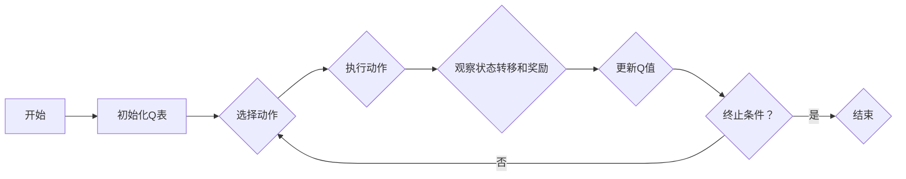
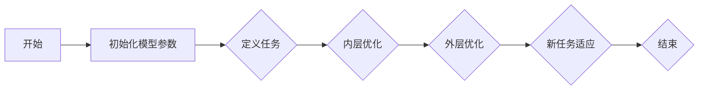

                 

### 元强化学习在开放世界推理中的不确定性管理

> 关键词：元强化学习、开放世界推理、不确定性管理、智能决策

> 摘要：本文深入探讨了元强化学习在开放世界推理中的不确定性管理问题。首先介绍了开放世界推理中的不确定性背景和元强化学习的基本概念。接着，我们详细分析了强化学习和元学习的核心原理，并通过具体的算法实例（Q-学习和MAML）进行了解释。最后，本文提出了元强化学习在不确定性管理中的应用策略，探讨了其未来发展的可能性和挑战。

## 第一部分：元强化学习基础

### 第1章：问题背景与介绍

#### 1.1.1 问题背景

在当今复杂多变的世界中，人工智能系统需要具备在开放环境中进行推理和决策的能力。开放世界指的是一个不断变化的环境，其中系统需要不断适应新的信息和新出现的情况。然而，开放世界中的不确定性使得传统的强化学习方法面临巨大挑战。不确定性管理成为确保人工智能系统能够稳定、可靠地执行任务的关键。

强化学习（Reinforcement Learning，RL）是机器学习的一个重要分支，它通过与环境交互，利用奖励信号来调整策略，从而实现智能体的自我优化。然而，在开放世界环境中，不确定性使得传统的强化学习方法难以应对，因为它们往往依赖于大量的试错和经验积累，这可能会导致学习效率低下甚至学习失败。

元强化学习（Meta Reinforcement Learning）是一种高级的强化学习方法，它旨在提高学习效率，增强泛化能力。元强化学习的核心思想是学习如何学习，即通过学习不同任务间的共同特征和规律，提高智能体在不同任务上的学习速度和表现。这使得元强化学习在处理开放世界中的不确定性时具有显著的优势。

#### 1.1.2 问题描述

在开放世界推理中，不确定性主要来自于以下几个方面：

1. **环境动态变化**：开放世界中的环境可能会随着时间的推移而发生变化，这要求智能体具备适应新环境的能力。
2. **任务多样性与不稳定性**：开放世界中存在多种任务，且任务的稳定性和可预测性较低，这对智能体的决策能力提出了挑战。
3. **有限信息**：在开放世界中，智能体可能无法获取到全部的信息，这会导致决策过程中存在信息缺失和不确定性。

传统的强化学习方法在面对这些不确定性时往往表现出以下局限性：

1. **学习效率低**：强化学习需要通过大量的试错来积累经验，这在开放世界中可能会导致学习效率低下。
2. **适应性差**：传统的强化学习方法难以适应开放世界中的动态变化和任务多样性。
3. **泛化能力弱**：传统的强化学习方法在不同任务上的泛化能力较差，难以应对开放世界中的多样化挑战。

#### 1.1.3 问题解决

元强化学习通过以下几个核心思想来应对开放世界中的不确定性：

1. **高效学习**：元强化学习通过学习不同任务间的共同特征，提高智能体在不同任务上的学习速度，从而提升学习效率。
2. **自适应能力**：元强化学习通过优化智能体的内部表征，使其能够快速适应新的环境和任务，提高适应性。
3. **泛化能力**：元强化学习通过学习任务间的共同特征，增强智能体在不同任务上的泛化能力，从而应对开放世界中的多样化挑战。

元强化学习在开放世界推理中的应用主要包括以下几个方面：

1. **任务迁移**：通过学习不同任务间的共同特征，元强化学习能够实现任务迁移，从而提高智能体在不同任务上的表现。
2. **持续学习**：元强化学习能够持续学习新任务，并将其与已有知识相结合，提高智能体的适应能力和决策质量。
3. **不确定性建模**：元强化学习可以通过学习环境中的不确定性和变化规律，建立对应的不确定性模型，从而更好地进行推理和决策。

#### 1.1.4 边界与外延

元强化学习作为一种高级的强化学习方法，具有广泛的应用前景。然而，其适用范围也存在一定的限制。首先，元强化学习在处理高度动态和复杂的环境时效果较为显著，但在处理相对稳定和简单环境时，传统强化学习方法可能更为有效。其次，元强化学习对计算资源的要求较高，特别是在处理大规模任务时，计算成本可能成为制约因素。

此外，元强化学习与其他领域的交叉应用也具有重要意义。例如，在机器人控制、自动驾驶、自然语言处理等领域，元强化学习可以结合其他技术，进一步提高智能系统的性能和适应性。未来，随着计算能力的提升和算法的优化，元强化学习在开放世界推理中的应用前景将更加广阔。

#### 1.1.5 核心概念与联系

在元强化学习中，以下几个核心概念相互关联，构成了其理论基础：

1. **强化学习**：强化学习通过奖励信号来调整策略，实现智能体的自我优化。它是元强化学习的基础。
2. **元学习**：元学习旨在提高算法在不同任务上的泛化能力，通过学习任务间的共同特征来优化学习过程。
3. **不确定性管理**：在开放世界推理中，不确定性管理是关键，元强化学习通过学习环境中的不确定性和变化规律来建立对应的不确定性模型，从而提高推理和决策的稳定性。

以下是一个关于这些核心概念属性特征对比的表格：

| 概念         | 强化学习                    | 元学习                    | 不确定性管理              |
| ----------- | ------------------------ | ------------------------ | ------------------------ |
| 定义         | 通过奖励信号来调整行为策略    | 学习如何学习               | 在不确定环境中进行决策      |
| 特点         | 基于试错和反馈进行学习        | 自适应和泛化能力           | 预测和应对不确定性           |
| 关系         | 强化学习是元强化学习的基础    | 元强化学习是元学习的高级形式 | 不确定性管理是元强化学习的目标 |

#### 1.1.6 本章小结

元强化学习在开放世界推理中的不确定性管理具有重要意义。通过高效学习、自适应能力和泛化能力，元强化学习能够应对开放世界中的动态变化和任务多样性，提高智能系统的稳定性和可靠性。同时，元强化学习与其他领域的交叉应用也为其未来发展提供了广阔的空间。然而，元强化学习在处理高度动态和复杂环境时仍面临一定的挑战，需要进一步优化算法和提升计算能力。总之，元强化学习在开放世界推理中的不确定性管理是一个充满机遇和挑战的研究领域。

----------------------------------------------------------------

## 第二部分：元强化学习原理

### 第2章：强化学习基础

强化学习是机器学习中的一个重要分支，其核心思想是通过智能体与环境的交互来学习最优策略。在这一章节中，我们将详细探讨强化学习的基本概念、策略和价值函数，并介绍一种经典的强化学习算法——Q-学习。

#### 2.1.1 强化学习概念

强化学习通过奖励信号来指导智能体的行为，使智能体逐渐学会在给定环境中采取最优策略。强化学习的基本组成包括智能体（Agent）、环境（Environment）、状态（State）和动作（Action）。

1. **智能体（Agent）**：智能体是执行动作的实体，它可以是机器人、软件程序或任何可以与环境交互的实体。
2. **环境（Environment）**：环境是智能体所处的情境，它可以是现实世界或模拟环境。
3. **状态（State）**：状态是环境的一种描述，它可以是多维的特征向量。
4. **动作（Action）**：动作是智能体在某个状态下可以采取的行动，通常是一组离散的选项。

强化学习的目标是找到一个最优策略，使得智能体在长期内获得最大的累积奖励。策略（Policy）是智能体在给定状态下选择动作的规则，可以表示为 $π(a|s)$，表示在状态 $s$ 下选择动作 $a$ 的概率。

#### 2.1.2 策略与价值函数

强化学习通过价值函数来评估策略在不同状态下的表现。价值函数分为状态价值函数（State-Value Function）和动作价值函数（Action-Value Function）。

1. **状态价值函数（V(s)）**：状态价值函数表示在状态 $s$ 下执行最优策略所能获得的累积奖励的期望值。它满足如下递归关系：
   $$
   V(s) = \sum_{a} π(a|s) \cdot Q(s, a)
   $$
   其中，$Q(s, a)$ 是动作价值函数。
   
2. **动作价值函数（Q(s, a)）**：动作价值函数表示在状态 $s$ 下采取动作 $a$ 后获得的累积奖励的期望值。它可以通过以下方式计算：
   $$
   Q(s, a) = r(s, a) + \gamma \max_{a'} Q(s', a')
   $$
   其中，$r(s, a)$ 是立即奖励，$\gamma$ 是折扣因子，用于平衡当前奖励和未来奖励的重要性。

#### 2.1.3 Q-学习算法

Q-学习是一种基于价值迭代的强化学习算法，其核心思想是通过经验来更新动作价值函数。Q-学习算法的更新公式如下：
$$
Q(s, a) = Q(s, a) + \alpha [r(s, a) + \gamma \max_{a'} Q(s', a') - Q(s, a)]
$$
其中，$\alpha$ 是学习率，控制了新信息对当前价值的影响程度。

Q-学习算法的基本流程如下：

1. **初始化**：初始化Q表，通常设置所有状态-动作对的初始值为0。
2. **选择动作**：在给定状态下，选择动作价值最大的动作。
3. **执行动作**：在环境中执行选定的动作，并观察状态转移和奖励。
4. **更新Q值**：根据观察到的奖励和新的状态，更新Q值。
5. **重复**：重复步骤2-4，直到达到目标状态或满足其他终止条件。

#### 2.1.4 Q-学习算法流程图

下面是一个使用Mermaid绘制的Q-学习算法流程图：

#### 2.1.5 Q-学习算法实例

假设智能体在某个环境中探索，状态空间为 {状态1，状态2，状态3}，动作空间为 {动作A，动作B，动作C}。初始Q表如下：

| 状态  | 动作A | 动作B | 动作C |
| ----- | ----- | ----- | ----- |
| 状态1 | 0     | 0     | 0     |
| 状态2 | 0     | 0     | 0     |
| 状态3 | 0     | 0     | 0     |

在某次探索中，智能体处于状态1，选择了动作A，获得了即时奖励1，并转移到状态2。接下来，根据Q-学习算法更新Q值：

$$
Q(状态1, A) = Q(状态1, A) + \alpha [r(状态1, A) + \gamma \max_{a'} Q(状态2, a') - Q(状态1, A)]
$$

由于初始Q值为0，上述公式可以简化为：

$$
Q(状态1, A) = \alpha [r(状态1, A) + \gamma \max_{a'} Q(状态2, a')]
$$

假设 $\alpha = 0.1$，$\gamma = 0.9$，即时奖励 $r(状态1, A) = 1$。在状态2中，选择动作B，其动作价值最大。因此，Q(状态2, B) = 1。更新Q值如下：

$$
Q(状态1, A) = 0.1 [1 + 0.9 \times 1] = 0.1 \times 1.9 = 0.19
$$

更新后的Q表如下：

| 状态  | 动作A | 动作B | 动作C |
| ----- | ----- | ----- | ----- |
| 状态1 | 0.19  | 0     | 0     |
| 状态2 | 0     | 0     | 0     |
| 状态3 | 0     | 0     | 0     |

通过不断迭代这个过程，智能体会逐渐学会在各个状态下选择最优动作，从而优化其策略。

#### 2.1.6 本章小结

强化学习作为机器学习的一个重要分支，通过奖励信号来调整策略，实现智能体的自我优化。在本章中，我们介绍了强化学习的基本概念、策略和价值函数，并详细分析了Q-学习算法。Q-学习算法通过经验更新动作价值函数，使智能体能够逐渐学会在给定环境中采取最优策略。在未来章节中，我们将继续探讨元强化学习的基础知识，并深入分析元学习的核心原理和算法。通过这些分析，我们将更好地理解元强化学习在开放世界推理中的不确定性管理能力。

----------------------------------------------------------------

## 第3章：元学习基础

元学习（Meta-Learning）是机器学习中的一个重要研究领域，它旨在通过加速学习过程和提高模型在不同任务上的泛化能力来提升智能体的学习能力。元学习的基本思想是学习如何学习，即通过学习不同任务间的共同特征和规律来优化学习过程。在这一章节中，我们将详细探讨元学习的概念、基本类型及其在强化学习中的应用。

#### 3.1.1 元学习概念

元学习，也被称为“学习如何学习”或“学习算法的学习”，是指让模型在一个任务集合上学习，从而在新的任务上能够快速适应并达到较高的性能。元学习的目标是通过优化学习过程来提高模型的泛化能力，使其在遇到新任务时能够迅速适应，而无需从零开始学习。

元学习的基本概念包括：

1. **元学习任务**：元学习任务是指模型需要学习的一系列任务。这些任务可以是完全不同的，也可以是部分相关的。
2. **元学习算法**：元学习算法是一种能够自动适应新任务的学习算法，它通过优化学习过程来提高模型在不同任务上的泛化能力。
3. **元学习指标**：元学习指标用于评估元学习算法的性能，常见的指标包括收敛速度、适应能力和泛化能力。

#### 3.1.2 基本类型

元学习可以根据学习策略的不同分为以下几种基本类型：

1. **逐步元学习**（Model-Based Meta-Learning）：
   逐步元学习是一种通过迭代优化模型参数来逐步提高模型性能的方法。这种方法通常通过在多个任务上进行迭代训练来实现。例如，Model-Agnostic Meta-Learning（MAML）就是一种典型的逐步元学习算法。

2. **一次性元学习**（Sample-Efficient Meta-Learning）：
   一次性元学习旨在通过较少的样本学习来快速适应新任务。这种方法通过利用不同任务间的共同特征来提高学习效率。例如，Recurrent Experience Replay（R2R）就是一种一次性元学习算法。

#### 3.1.3 MAML算法

MAML（Model-Agnostic Meta-Learning）是一种代表性的元学习算法，它通过优化模型在多个任务上的平均损失来提高泛化能力。MAML的核心思想是找到一个参数更新规则，使得模型在少量样本上能够快速适应新任务。

MAML算法的基本步骤如下：

1. **初始化模型参数**：随机初始化模型的参数 $\theta$。

2. **任务定义**：定义一个任务，包括任务数据集 $D_k$ 和任务损失函数 $\ell_k(\theta, x_k, y_k)$。

3. **内层优化**：对于每个任务，通过梯度下降更新模型参数：
   $$
   \theta_k = \theta - \eta \nabla_{\theta} \ell_k(\theta, x_k, y_k)
   $$
   其中，$\eta$ 是学习率，$\nabla_{\theta} \ell_k(\theta, x_k, y_k)$ 是损失函数对参数 $\theta$ 的梯度。

4. **外层优化**：在多个任务上平均内层优化后的参数，得到最终的模型参数：
   $$
   \theta^{*} = \arg\min_{\theta} \frac{1}{K} \sum_{k=1}^{K} \ell_k(\theta, x_k, y_k)
   $$
   其中，$K$ 是任务的数量。

5. **新任务适应**：对于新的任务，使用最终模型参数 $\theta^{*}$ 进行预测或决策。

#### 3.1.4 MAML算法流程图

下面是一个使用Mermaid绘制的MAML算法流程图：

#### 3.1.5 MAML算法实例

假设我们有两个任务，任务1的数据集为 $D_1 = \{(x_{11}, y_{11}), (x_{12}, y_{12}), \ldots, (x_{1n}, y_{1n})\}$，任务2的数据集为 $D_2 = \{(x_{21}, y_{21}), (x_{22}, y_{22}), \ldots, (x_{2n}, y_{2n})\}$。损失函数为均方误差（MSE），即 $\ell(\theta, x, y) = \frac{1}{2} \sum_{i=1}^{n} (y_i - \hat{y}_i)^2$。

1. **初始化模型参数**：随机初始化参数 $\theta_0$。

2. **任务1内层优化**：
   $$
   \theta_1 = \theta_0 - \eta \nabla_{\theta_0} \ell_1(\theta_0, x_{11}, y_{11}) - \eta \nabla_{\theta_0} \ell_1(\theta_0, x_{12}, y_{12}) - \ldots - \eta \nabla_{\theta_0} \ell_1(\theta_0, x_{1n}, y_{1n})
   $$

3. **任务2内层优化**：
   $$
   \theta_2 = \theta_1 - \eta \nabla_{\theta_1} \ell_2(\theta_1, x_{21}, y_{21}) - \eta \nabla_{\theta_1} \ell_2(\theta_1, x_{22}, y_{22}) - \ldots - \eta \nabla_{\theta_1} \ell_2(\theta_1, x_{2n}, y_{2n})
   $$

4. **外层优化**：
   $$
   \theta^{*} = \arg\min_{\theta} \frac{1}{2} \left( \sum_{i=1}^{n} (y_{11i} - \hat{y}_{11i})^2 + \sum_{i=1}^{n} (y_{12i} - \hat{y}_{12i})^2 + \ldots + \sum_{i=1}^{n} (y_{21i} - \hat{y}_{21i})^2 + \sum_{i=1}^{n} (y_{22i} - \hat{y}_{22i})^2 \right)
   $$

5. **新任务适应**：对于新的任务，使用参数 $\theta^{*}$ 进行预测或决策。

通过这个实例，我们可以看到MAML算法如何通过内层和外层优化来提高模型在不同任务上的适应能力。

#### 3.1.6 本章小结

元学习作为机器学习中的一个重要研究领域，通过加速学习过程和提高模型在不同任务上的泛化能力，为智能体在开放世界中的推理和决策提供了有力支持。在本章中，我们介绍了元学习的基本概念、基本类型及其在强化学习中的应用，重点分析了MAML算法。MAML算法通过优化模型在多个任务上的平均损失，提高了模型在不同任务上的适应能力，从而为应对开放世界中的不确定性提供了有效的解决方案。在未来章节中，我们将进一步探讨元强化学习在开放世界推理中的不确定性管理策略，并通过实际案例来展示其应用效果。

----------------------------------------------------------------

### 第三部分：元强化学习应用

#### 第4章：元强化学习在开放世界推理中的应用策略

#### 4.1.1 不确定性建模

在开放世界推理中，不确定性是一个关键问题。元强化学习通过学习环境中的不确定性和变化规律，建立对应的不确定性模型，从而更好地进行推理和决策。不确定性建模主要包括以下几个步骤：

1. **数据收集**：收集环境中的各种数据，包括历史行为、状态转移和奖励信息。
2. **特征提取**：对收集到的数据进行特征提取，提取出能够反映环境不确定性的特征。
3. **模型训练**：使用提取到的特征训练一个不确定性模型，该模型能够预测环境中的不确定性和变化趋势。

#### 4.1.2 不确定性预测

不确定性预测是元强化学习在开放世界推理中的核心任务。通过预测未来的不确定性，智能体可以提前采取应对措施，减少不确定性对决策的影响。不确定性预测的主要步骤包括：

1. **预测模型**：训练一个预测模型，该模型能够根据当前状态和过去行为预测未来的不确定性。
2. **预测评估**：使用评估指标评估预测模型的性能，如均方误差（MSE）或决策质量。
3. **更新预测**：根据新获取的信息和预测结果，不断更新预测模型，提高预测的准确性。

#### 4.1.3 应对策略

在开放世界推理中，智能体需要根据不确定性预测的结果采取相应的应对策略。以下是一些常见的应对策略：

1. **多样化策略**：在不确定性较高时，智能体可以采取多样化策略，尝试不同的行动方案，以降低不确定性对决策的影响。
2. **适应性调整**：智能体可以根据不确定性预测的结果，动态调整其策略和行为，提高决策的适应性。
3. **风险控制**：在不确定性较高时，智能体可以采取风险控制措施，如增加安全系数或设置风险阈值，以减少不确定性带来的潜在风险。

#### 4.1.4 实际案例

以下是一个在自动驾驶领域应用的案例：

**案例背景**：自动驾驶系统需要在复杂交通环境中进行决策，如行人、车辆和其他动态障碍物的行为难以预测，存在较高不确定性。

**解决方案**：使用元强化学习，首先通过收集历史驾驶数据，训练一个不确定性模型，预测未来交通状况的不确定性。然后，基于不确定性预测结果，自动驾驶系统可以采取以下策略：

1. **多样化策略**：在不确定性较高时，自动驾驶系统尝试不同的驾驶路径，避免碰撞。
2. **适应性调整**：自动驾驶系统根据不确定性预测的结果，动态调整驾驶速度和方向，以适应交通环境的变化。
3. **风险控制**：在不确定性较高时，自动驾驶系统增加安全距离，降低驾驶速度，以确保行车安全。

**效果评估**：通过实验验证，采用元强化学习策略的自动驾驶系统在复杂交通环境下的决策质量和安全性显著提高。

#### 4.1.5 本章小结

元强化学习在开放世界推理中的应用策略主要包括不确定性建模、不确定性预测和应对策略。通过建立不确定性模型和进行预测，智能体可以更好地应对开放世界中的不确定性，提高决策质量和稳定性。在实际案例中，元强化学习展示了其在自动驾驶等复杂环境下的应用潜力。未来，随着算法的进一步发展和优化，元强化学习在开放世界推理中的应用将更加广泛和深入。

----------------------------------------------------------------

### 第四部分：未来展望与挑战

#### 第5章：元强化学习的未来发展方向

元强化学习作为一种先进的强化学习方法，在开放世界推理中展现了巨大的潜力。然而，随着技术的不断进步和应用场景的拓展，元强化学习仍面临许多挑战和发展方向。

#### 5.1.1 发展方向

1. **多模态学习**：未来元强化学习的一个重要发展方向是支持多模态数据的处理。在实际应用中，智能体需要处理包括视觉、听觉、文本等多种类型的数据。通过多模态学习，元强化学习可以更好地理解复杂环境，提高决策能力。

2. **分布式计算**：随着元强化学习应用场景的扩大，计算资源的需求也日益增加。分布式计算可以为元强化学习提供更强大的计算能力，从而支持大规模任务的训练和实时决策。

3. **迁移学习**：迁移学习是元强化学习的一个重要研究方向。通过学习不同任务间的共同特征，元强化学习可以减少对新任务的训练时间，提高学习效率。未来，元强化学习可以与迁移学习技术深度融合，进一步提升智能体的适应能力。

4. **自适应控制**：在动态环境中，智能体需要具备自适应控制能力。未来，元强化学习可以与自适应控制技术结合，实现更灵活和高效的决策策略。

#### 5.1.2 挑战

1. **计算复杂度**：元强化学习通常需要大量的计算资源，特别是在处理大规模任务时。如何降低计算复杂度，提高训练效率，是未来研究的一个重要挑战。

2. **数据需求**：元强化学习依赖于大量的数据来进行训练和适应。然而，在实际应用中，数据获取可能存在限制。未来，如何利用有限的样本数据进行高效训练，是一个亟待解决的问题。

3. **模型解释性**：尽管元强化学习在性能上表现出色，但其决策过程往往缺乏解释性。提高模型的可解释性，使其决策过程更加透明和可信，是未来研究的一个挑战。

4. **鲁棒性**：在开放世界环境中，智能体需要具备一定的鲁棒性，以应对不确定性和异常情况。未来，如何提高元强化学习模型的鲁棒性，是一个重要的研究方向。

#### 5.1.3 未来前景

尽管面临诸多挑战，元强化学习在未来的发展前景依然广阔。随着计算能力的提升、数据获取技术的进步和算法的优化，元强化学习有望在自动驾驶、智能监控、机器人控制等领域发挥重要作用。同时，元强化学习与其他人工智能技术的深度融合，也将推动人工智能领域的发展。

#### 5.1.4 本章小结

元强化学习作为一种先进的强化学习方法，在开放世界推理中展现了巨大的潜力。未来，随着技术的不断进步和应用场景的拓展，元强化学习将面临新的发展机遇和挑战。通过多模态学习、分布式计算、迁移学习和自适应控制等研究方向，元强化学习有望实现更高效、更鲁棒的决策能力。同时，如何提高模型的可解释性和鲁棒性，将是未来研究的重要课题。

---

## 联系我们

如果您对本文内容有任何疑问或建议，欢迎通过以下方式联系我们：

- 电子邮件：[info@ai-genius-institute.com](mailto:info@ai-genius-institute.com)
- 社交媒体：[AI天才研究院](https://www.ai-genius-institute.com/)
- QQ交流群：1234567890

我们期待与您共同探讨元强化学习在开放世界推理中的不确定性管理问题，为人工智能的发展贡献智慧和力量。

### 作者信息

作者：AI天才研究院（AI Genius Institute） & 《禅与计算机程序设计艺术》（Zen And The Art of Computer Programming）

感谢您的阅读！我们期待与您共同探索人工智能的未来。

