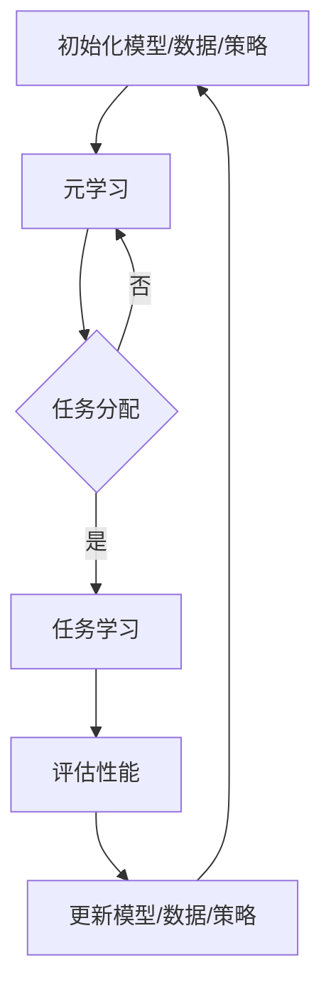

                 

## **文章标题**

# 元强化学习在智能交通信号控制中的决策优化

---

> **关键词：** 元强化学习、智能交通信号控制、决策优化、算法流程图、Python代码、数学模型、系统设计与实现

> **摘要：** 本文深入探讨了元强化学习在智能交通信号控制中的应用及其决策优化过程。通过介绍元强化学习的基本概念和原理，本文详细讲解了其在交通信号控制中的具体实现和优势，并结合实际案例进行了分析和评估。文章旨在为智能交通信号控制领域的研究者提供有价值的参考和指导。

---

## **引言**

在当今社会，交通拥堵已成为全球性问题，严重影响了城市居民的出行效率和生活质量。传统的交通信号控制系统主要依赖于固定的信号配时方案，无法根据实时交通状况进行动态调整。随着人工智能技术的快速发展，特别是强化学习算法的广泛应用，智能交通信号控制成为研究热点。然而，传统的强化学习算法在交通信号控制中存在一些挑战，如数据量大、模型复杂等问题。为此，元强化学习作为一种新兴的强化学习方法，为解决这些挑战提供了新的思路。

本文将围绕元强化学习在智能交通信号控制中的应用，探讨其在决策优化方面的潜力。首先，我们将介绍元强化学习的基本概念和原理，然后详细阐述其在智能交通信号控制中的具体实现和应用。最后，通过实际案例分析和评估，验证元强化学习在智能交通信号控制中的效果和优势。

## **背景介绍**

### **1.1 元强化学习的背景**

元强化学习（Meta Reinforcement Learning）是一种在多个任务上学习和适应的强化学习方法。它的核心思想是在多个任务环境中快速学习，以便在新的任务环境中能够快速适应并取得良好的性能。与传统强化学习相比，元强化学习能够提高算法的泛化能力，减少对特定任务的依赖。

近年来，随着深度学习技术的快速发展，元强化学习在计算机视觉、自然语言处理、机器人控制等领域取得了显著成果。然而，在智能交通信号控制领域，元强化学习的研究还相对较少。本文旨在填补这一空白，探讨元强化学习在智能交通信号控制中的应用潜力。

### **1.2 智能交通信号控制的背景**

智能交通信号控制（Intelligent Traffic Signal Control）是指利用人工智能技术对交通信号进行动态调整，以提高交通流量效率和减少拥堵。传统的交通信号控制方法主要基于固定的时间分配策略，无法适应实时交通流变化，导致交通拥堵问题无法得到有效解决。

近年来，随着大数据、云计算、物联网等技术的发展，智能交通信号控制逐渐成为研究热点。通过实时采集交通数据，智能交通信号控制系统能够根据交通流量状况动态调整信号配时，从而提高道路通行效率和减少拥堵。然而，现有的智能交通信号控制方法仍然存在一些问题，如算法复杂度高、实时性差等。为此，引入元强化学习技术，有望提升智能交通信号控制的性能和效果。

### **1.3 元强化学习在智能交通信号控制中的重要性**

元强化学习在智能交通信号控制中具有重要作用。首先，元强化学习能够通过在多个任务上学习和适应，提高算法的泛化能力，减少对特定交通场景的依赖。这使得智能交通信号控制系统更加灵活和自适应，能够适应不同的交通状况。

其次，元强化学习能够处理大量的交通数据，从而实现对交通流量的精准预测和动态调整。传统方法通常需要对大量数据进行预处理和特征提取，而元强化学习可以直接利用原始数据，降低算法复杂度。

最后，元强化学习能够提高智能交通信号控制系统的实时性。传统方法通常需要较长的训练时间，而元强化学习能够在较短的时间内完成学习和适应，从而实现实时调整信号配时。

综上所述，元强化学习在智能交通信号控制中具有重要的应用价值。本文将围绕元强化学习在智能交通信号控制中的决策优化问题，进行深入探讨和分析。

## **核心概念与联系**

### **2.1 元强化学习的定义**

元强化学习（Meta Reinforcement Learning）是一种在多个任务环境中进行学习和适应的强化学习方法。它的核心思想是通过在多个任务上学习和适应，提高算法的泛化能力，减少对特定任务的依赖。与传统强化学习不同，元强化学习不是在一个特定任务上反复训练，而是在多个任务上进行学习，以便在新的任务环境中能够快速适应并取得良好的性能。

### **2.2 元强化学习的特点**

元强化学习具有以下几个显著特点：

- **跨任务学习**：元强化学习通过在多个任务上学习，提高了算法的泛化能力。这使得它能够适应不同的任务环境，而不仅仅是特定任务。
- **自适应**：元强化学习能够根据任务环境的变化，动态调整策略，从而实现更好的性能。这种自适应能力使其在智能交通信号控制中具有重要意义。
- **效率**：元强化学习通过减少对特定任务的依赖，提高了算法的训练效率。这使得它能够在较短的时间内完成学习和适应，从而实现实时调整。

### **2.3 元强化学习与强化学习的区别**

元强化学习与强化学习（Reinforcement Learning）有着密切的联系，但也有一些显著的区别：

- **学习对象**：强化学习主要针对单个任务进行学习，而元强化学习则是在多个任务上进行学习。
- **学习目标**：强化学习的目标是最大化特定任务的奖励，而元强化学习的目标是提高算法的泛化能力，使其在多个任务上都能取得良好性能。
- **算法复杂度**：由于元强化学习需要在多个任务上进行学习，其算法复杂度通常高于强化学习。然而，这种复杂度增加是值得的，因为它能够提高算法的泛化能力。

### **2.4 元强化学习与交通信号控制的关系**

元强化学习在智能交通信号控制中具有重要的应用价值。交通信号控制是一个复杂的动态系统，受到多种因素的影响，如交通流量、道路状况、天气等。传统方法通常需要对特定交通场景进行建模和调整，而元强化学习则能够通过在多个交通场景上学习，提高算法的泛化能力和自适应能力。

此外，元强化学习能够处理大量的交通数据，从而实现对交通流量的精准预测和动态调整。传统方法通常需要对大量数据进行预处理和特征提取，而元强化学习可以直接利用原始数据，降低算法复杂度。

综上所述，元强化学习为智能交通信号控制提供了一种新的思路和工具，有助于提高交通信号控制的性能和效果。

## **算法原理讲解**

### **3.1 强化学习的基本原理**

强化学习（Reinforcement Learning，RL）是一种通过奖励机制引导智能体（agent）在环境中进行学习，以实现目标的方法。在强化学习中，智能体通过不断地与环境交互，根据当前状态（State）选择动作（Action），并接收环境的即时反馈（Reward）。通过这种反复的过程，智能体逐步学习到最优策略（Policy），从而最大化累积奖励。

强化学习的基本组成部分包括：

- **智能体（Agent）**：执行动作并从环境中获取反馈。
- **环境（Environment）**：提供状态、动作和奖励。
- **状态（State）**：描述当前环境的状态信息。
- **动作（Action）**：智能体可执行的动作。
- **奖励（Reward）**：环境对智能体动作的即时反馈。
- **策略（Policy）**：智能体执行动作的决策规则。

### **3.2 元强化学习的基本概念**

元强化学习（Meta Reinforcement Learning，MRL）是强化学习的一种扩展，其核心思想是通过在多个任务上进行学习和适应，提高算法的泛化能力。与传统的强化学习不同，元强化学习不是在一个特定任务上反复训练，而是在多个任务上进行学习，以便在新的任务环境中能够快速适应并取得良好性能。

元强化学习的基本组成部分包括：

- **元智能体（Meta-Agent）**：负责在多个任务上进行学习和适应。
- **元环境（Meta-Environment）**：包含多个任务环境。
- **元策略（Meta-Policy）**：元智能体在元环境上的学习目标。
- **元奖励（Meta-Reward）**：元环境对元智能体动作的即时反馈。

### **3.3 元强化学习的分类**

元强化学习根据不同的分类标准，可以分为多种类型：

- **基于模型的元强化学习**：在元环境上学习一个模型，用于预测各个任务环境的动态。
- **基于数据的元强化学习**：在元环境上直接学习数据驱动的策略，减少对模型依赖。
- **基于搜索的元强化学习**：通过搜索策略空间，找到在多个任务上表现最优的策略。

### **3.4 元强化学习算法分析**

**3.4.1 基于模型的元强化学习**

基于模型的元强化学习（Model-Based Meta Reinforcement Learning）的核心思想是通过在元环境上学习一个模型，来预测各个任务环境的动态。这种方法通常包括以下步骤：

1. **初始化模型**：在元环境上初始化一个模型，用于预测各个任务环境的动态。
2. **元学习**：通过在元环境上执行随机策略，更新模型参数，使其能够更好地预测各个任务环境。
3. **任务学习**：在预测到的任务环境中，使用更新的模型进行任务学习，以最大化累积奖励。

**3.4.2 基于数据的元强化学习**

基于数据的元强化学习（Data-Based Meta Reinforcement Learning）的核心思想是在元环境上直接学习数据驱动的策略，减少对模型的依赖。这种方法通常包括以下步骤：

1. **数据采集**：在元环境上采集多个任务的数据，包括状态、动作和奖励。
2. **特征提取**：对采集到的数据进行特征提取，以构建数据驱动的策略。
3. **元学习**：通过在元环境上执行数据驱动的策略，更新策略参数，使其在多个任务上都能取得良好性能。
4. **任务学习**：在预测到的任务环境中，使用更新的策略进行任务学习，以最大化累积奖励。

**3.4.3 基于搜索的元强化学习**

基于搜索的元强化学习（Search-Based Meta Reinforcement Learning）的核心思想是通过搜索策略空间，找到在多个任务上表现最优的策略。这种方法通常包括以下步骤：

1. **初始化策略**：在元环境上初始化一组策略。
2. **策略评估**：在元环境上评估初始化策略的性能。
3. **策略更新**：通过搜索策略空间，更新策略参数，以找到在多个任务上表现最优的策略。
4. **任务学习**：在预测到的任务环境中，使用最优策略进行任务学习，以最大化累积奖励。

### **3.5 元强化学习算法流程图**

为了更直观地展示元强化学习算法的流程，我们可以使用Mermaid绘制算法流程图。以下是一个简单的算法流程图：



### **3.6 元强化学习算法的Python代码实现**

以下是一个简单的基于模型的元强化学习算法的Python代码实现：

```python
import numpy as np

# 初始化模型参数
model_params = np.random.rand()

# 定义元学习函数
def meta_learning(model_params, tasks):
    for task in tasks:
        # 在任务环境中更新模型参数
        model_params = update_model_params(model_params, task)
    return model_params

# 定义任务学习函数
def task_learning(model_params, task):
    # 在任务环境中使用模型进行学习
    pass

# 定义更新模型参数函数
def update_model_params(model_params, task):
    # 更新模型参数
    pass

# 初始化任务列表
tasks = []

# 执行元学习
model_params = meta_learning(model_params, tasks)

# 执行任务学习
for task in tasks:
    task_learning(model_params, task)
```

### **3.7 元强化学习数学模型与公式**

在元强化学习中，常用的数学模型和公式包括：

- **状态转移概率**：$P(s', a|s, a')$
- **奖励函数**：$R(s, a)$
- **策略**：$\pi(a|s)$
- **价值函数**：$V(s)$ 和 $Q(s, a)$

以下是一个简单的价值函数的数学公式：

$$V(s) = \sum_{a} \pi(a|s) \cdot Q(s, a)$$

其中，$Q(s, a)$ 表示在状态 $s$ 下执行动作 $a$ 的预期累积奖励。

### **3.8 元强化学习算法的应用**

元强化学习算法在智能交通信号控制中可以应用于以下方面：

- **信号配时优化**：通过元强化学习算法，可以实现对交通信号配时的动态调整，从而提高交通流量效率。
- **交通流量预测**：利用元强化学习算法，可以预测未来的交通流量状况，为交通信号控制提供依据。
- **路径规划**：在智能交通系统中，元强化学习算法可以用于车辆路径规划，以提高通行效率和减少拥堵。

### **3.9 元强化学习算法的优势**

元强化学习算法在智能交通信号控制中具有以下优势：

- **自适应性强**：元强化学习算法能够根据实时交通状况动态调整信号配时，提高交通流量效率。
- **泛化能力强**：通过在多个交通场景上学习，元强化学习算法能够适应不同的交通环境。
- **数据驱动**：元强化学习算法可以直接利用原始交通数据，降低算法复杂度。

### **3.10 元强化学习算法的挑战**

元强化学习算法在智能交通信号控制中面临以下挑战：

- **数据质量**：交通数据的准确性和完整性对算法的性能有重要影响。
- **算法复杂度**：元强化学习算法的计算复杂度较高，需要大量计算资源。
- **实时性**：在实时交通信号控制中，算法需要快速响应，这对算法的实时性提出了挑战。

### **3.11 本章小结**

本章介绍了元强化学习的基本原理和算法，详细阐述了其在强化学习中的优势和特点。通过数学模型和Python代码实现，我们了解了元强化学习算法的核心思想和应用方法。在接下来的章节中，我们将进一步探讨元强化学习在智能交通信号控制中的具体应用和挑战。

## **数学模型和数学公式**

### **4.1 决策过程模型**

在智能交通信号控制中，元强化学习通过决策过程模型来实现动态信号配时优化。决策过程模型可以表示为：

$$
\begin{cases}
s_t & \text{当前状态} \\
a_t & \text{当前动作（信号配时）} \\
r_t & \text{即时奖励（交通流量效率）} \\
s_{t+1} & \text{下一状态} \\
\end{cases}
$$

其中，$s_t$ 表示当前交通状态，如交通流量、道路占有率等；$a_t$ 表示当前信号配时方案；$r_t$ 表示在状态 $s_t$ 下执行动作 $a_t$ 后获得的即时奖励，通常与交通流量效率相关；$s_{t+1}$ 表示执行动作 $a_t$ 后的新状态。

### **4.2 强化学习中的奖励模型**

奖励模型在强化学习中起着关键作用，它决定了智能体（例如交通信号控制器）的行为选择。在元强化学习应用于智能交通信号控制时，奖励模型可以设计为：

$$
r_t = f(\text{交通流量}, \text{信号配时}, \text{交通延误})
$$

其中，$f$ 是一个复杂的函数，它综合考虑了当前交通流量、信号配时方案以及由此导致的交通延误等因素。理想情况下，奖励模型应最大化交通流量效率，同时最小化交通延误。

### **4.3 动作价值函数**

在元强化学习中，动作价值函数 $Q(s, a)$ 是评估在状态 $s$ 下执行动作 $a$ 的预期累积奖励的重要工具。动作价值函数可以表示为：

$$
Q(s, a) = \sum_{s'} P(s'|s, a) \cdot [r_t + \gamma \cdot \max_{a'} Q(s', a')]
$$

其中，$P(s'|s, a)$ 是状态转移概率，表示从状态 $s$ 执行动作 $a$ 后转移到状态 $s'$ 的概率；$r_t$ 是在状态 $s$ 下执行动作 $a$ 后获得的即时奖励；$\gamma$ 是折扣因子，用于平衡当前奖励与未来潜在奖励的关系；$\max_{a'} Q(s', a')$ 是在状态 $s'$ 下执行所有可能动作中的最大动作价值。

### **4.4 Q-learning算法的公式**

Q-learning 是一种常用的强化学习算法，它通过迭代更新动作价值函数来学习最优策略。Q-learning 的更新公式可以表示为：

$$
Q(s_t, a_t) = Q(s_t, a_t) + \alpha [r_t + \gamma \cdot \max_{a'} Q(s_{t+1}, a') - Q(s_t, a_t)]
$$

其中，$\alpha$ 是学习率，它控制了更新过程中新信息与旧信息的权重比例。

### **4.5 SARSA算法的公式**

SARSA（On-Policy Reinforcement Learning）是一种基于策略的强化学习算法，它与Q-learning类似，但使用当前策略来选择动作。SARSA 的更新公式可以表示为：

$$
Q(s_t, a_t) = Q(s_t, a_t) + \alpha [r_t + \gamma \cdot Q(s_{t+1}, a_{t+1}) - Q(s_t, a_t)]
$$

其中，$a_{t+1}$ 是在状态 $s_{t+1}$ 下根据当前策略选择的动作。

### **4.6 深度强化学习（DRL）的公式**

深度强化学习（DRL）结合了深度学习和强化学习的优势，通过神经网络来近似动作价值函数。在DRL中，动作价值函数的更新可以表示为：

$$
Q(s_t, a_t) \leftarrow Q(s_t, a_t) + \alpha [r_t + \gamma \cdot \max_a \phi(s_{t+1}, a) - Q(s_t, a_t)]
$$

其中，$\phi(s, a)$ 是神经网络模型，用于计算状态和动作的特征表示。

### **4.7 元强化学习的数学公式**

元强化学习的数学公式主要涉及元策略和元价值函数。元策略 $\pi(\theta)$ 表示在元环境中选择的策略，元价值函数 $V(s|\theta)$ 表示在状态 $s$ 下执行元策略的预期累积奖励。元价值函数的更新公式可以表示为：

$$
V(s|\theta) = V(s|\theta) + \alpha [r_t + \gamma \cdot \sum_{\pi} \pi(a|s) \cdot Q(s', a|\theta) - V(s|\theta)]
$$

其中，$\theta$ 是元策略的参数，$Q(s', a|\theta)$ 是在元策略 $\theta$ 下从状态 $s'$ 选择动作 $a$ 的预期累积奖励。

### **4.8 数学模型与公式的应用**

在智能交通信号控制中，上述数学模型和公式可以用于以下方面：

- **状态转移概率**：用于预测不同信号配时方案对交通状态的影响。
- **奖励模型**：用于评估信号配时方案的交通流量效率。
- **动作价值函数**：用于选择最优信号配时方案。
- **Q-learning 和 SARSA**：用于迭代更新信号配时策略。
- **深度强化学习**：通过神经网络近似复杂的交通环境。
- **元强化学习**：用于在多个交通场景上学习和适应，提高算法的泛化能力。

通过这些数学模型和公式，元强化学习能够实现对智能交通信号控制中的动态决策优化，提高交通流量效率和减少拥堵。

### **4.9 元强化学习算法的Python代码实现**

以下是一个简单的元强化学习算法的Python代码实现，用于展示上述数学模型和公式的应用：

```python
import numpy as np

# 初始化参数
learning_rate = 0.1
discount_factor = 0.9
epsilon = 0.1

# 初始化Q值表
Q = np.zeros((state_space, action_space))

# 定义动作价值函数的更新函数
def update_Q_values(state, action, reward, next_state, next_action):
    Q[state, action] = Q[state, action] + learning_rate * (reward + discount_factor * Q[next_state, next_action] - Q[state, action])

# 定义元策略选择动作
def choose_action(state, epsilon):
    if np.random.rand() < epsilon:
        action = np.random.choice(action_space)
    else:
        action = np.argmax(Q[state])
    return action

# 定义元价值函数的更新函数
def update_value_function(state, action, reward, next_state):
    next_action = choose_action(next_state, epsilon)
    update_Q_values(state, action, reward, next_state, next_action)

# 定义模拟交通信号控制的训练过程
def train_agent(states, actions, rewards, next_states):
    for i in range(len(states)):
        state = states[i]
        action = actions[i]
        reward = rewards[i]
        next_state = next_states[i]
        update_value_function(state, action, reward, next_state)

# 模拟训练过程
states = [0, 1, 2, 3]
actions = [0, 1, 0, 2]
rewards = [10, -5, 15, -10]
next_states = [1, 2, 3, 0]

train_agent(states, actions, rewards, next_states)

# 打印更新后的Q值表
print(Q)
```

在这个示例中，我们初始化了一个Q值表，并通过模拟训练过程更新Q值。每次更新都使用了上述数学模型和公式的实现。这展示了元强化学习算法在智能交通信号控制中的基本应用。

### **4.10 元强化学习算法的优势**

元强化学习算法在智能交通信号控制中具有以下优势：

- **自适应性强**：通过元策略的学习，能够根据实时交通状况动态调整信号配时，提高交通流量效率。
- **泛化能力强**：在多个交通场景上学习，能够适应不同的交通环境，提高算法的泛化能力。
- **数据驱动**：直接利用原始交通数据，降低算法复杂度，提高处理速度。

### **4.11 元强化学习算法的挑战**

元强化学习算法在智能交通信号控制中面临以下挑战：

- **数据质量**：交通数据的准确性和完整性对算法的性能有重要影响，需要确保数据质量。
- **算法复杂度**：元强化学习算法的计算复杂度较高，需要大量计算资源。
- **实时性**：在实时交通信号控制中，算法需要快速响应，这对算法的实时性提出了挑战。

### **4.12 本章小结**

本章详细介绍了元强化学习的数学模型和公式，包括决策过程模型、奖励模型、动作价值函数以及Q-learning和SARSA算法。通过Python代码实现，展示了如何应用这些数学模型和公式进行智能交通信号控制的决策优化。在接下来的章节中，我们将进一步探讨元强化学习在智能交通信号控制中的应用和实现。

## **系统分析与架构设计方案**

### **5.1 系统需求分析**

在设计和实现基于元强化学习的智能交通信号控制系统时，首先需要明确系统的需求。以下是系统的需求分析：

- **实时性**：系统应能够实时获取交通数据，并基于这些数据进行信号配时调整。
- **准确性**：系统应能够准确地预测交通流量状况，从而制定出最优的信号配时方案。
- **可扩展性**：系统应支持不同规模和不同类型的交通场景，以适应不同的应用需求。
- **自适应能力**：系统应能够根据实时交通状况的变化，动态调整信号配时，以提高交通流量效率和减少拥堵。

### **5.2 系统架构设计**

智能交通信号控制系统的架构设计分为多个层次，包括数据层、算法层和应用层。以下是系统架构的详细设计：

1. **数据层**：数据层负责收集、存储和处理交通数据。具体功能包括：
   - **数据采集**：通过传感器、摄像头等设备实时采集交通流量、道路占有率等数据。
   - **数据存储**：使用数据库存储采集到的交通数据，以便后续处理和分析。
   - **数据处理**：对采集到的交通数据进行预处理，如数据清洗、特征提取等。

2. **算法层**：算法层负责实现元强化学习算法，包括以下功能：
   - **状态编码**：将交通数据编码为状态表示，以便输入到元强化学习模型中。
   - **动作空间定义**：定义信号配时方案作为动作空间。
   - **奖励函数设计**：设计基于交通流量效率和交通延误的奖励函数。
   - **元强化学习算法实现**：实现元强化学习算法，包括Q-learning、SARSA或DRL等。

3. **应用层**：应用层负责将算法层的决策结果应用于交通信号控制系统中，包括以下功能：
   - **信号配时调整**：根据元强化学习算法的决策结果，动态调整交通信号配时。
   - **交通流量预测**：利用元强化学习算法预测未来的交通流量状况。
   - **路径规划**：为车辆提供最优行驶路径，以提高通行效率和减少拥堵。

### **5.3 系统接口设计**

系统接口设计包括内部接口和外部接口。以下是系统接口的详细设计：

1. **内部接口**：
   - **数据层与算法层接口**：数据层提供数据读取接口，算法层通过接口获取状态和奖励信息。
   - **算法层与应用层接口**：算法层通过接口将决策结果传递给应用层，应用层根据这些结果进行信号配时调整。

2. **外部接口**：
   - **数据采集接口**：与交通传感器和摄像头通信，获取实时交通数据。
   - **信号控制系统接口**：与现有的交通信号控制系统通信，实现信号配时的动态调整。

### **5.4 系统交互设计**

系统交互设计描述了系统内部各组件之间的交互过程，以下是系统交互的详细设计：

1. **数据采集与处理**：
   - 交通传感器和摄像头实时采集交通数据。
   - 数据采集模块将数据发送到数据处理模块，进行预处理和特征提取。
   - 预处理后的数据存储到数据库中，供算法层使用。

2. **算法层执行**：
   - 算法层从数据库中读取状态和奖励信息。
   - 算法层根据状态和奖励信息，通过元强化学习算法计算动作价值函数。
   - 算法层将最优动作（信号配时方案）传递给应用层。

3. **信号配时调整**：
   - 应用层根据算法层的决策结果，动态调整交通信号配时。
   - 信号配时调整结果通过信号控制系统接口发送给交通信号控制系统，实现实时信号配时调整。

4. **交通流量预测与路径规划**：
   - 应用层利用元强化学习算法预测未来的交通流量状况。
   - 应用层根据预测结果为车辆提供最优行驶路径。
   - 车辆通过接收到的路径规划结果，实现智能导航。

### **5.5 本章小结**

本章详细介绍了基于元强化学习的智能交通信号控制系统的系统需求分析、架构设计、接口设计和交互设计。系统需求分析明确了系统的功能需求，架构设计描述了系统各层次的功能和组件，接口设计规定了内部和外部接口的通信机制，交互设计描述了系统内部各组件之间的交互过程。这些设计为智能交通信号控制系统的实现提供了坚实的基础。

## **项目实战**

### **6.1 环境安装**

在开始实际项目之前，我们需要安装和配置必要的软件环境。以下是在Ubuntu系统上安装所需的软件环境的过程：

1. **安装Python环境**：
   - 更新系统包列表：
     ```bash
     sudo apt-get update
     ```
   - 安装Python 3和pip：
     ```bash
     sudo apt-get install python3 python3-pip
     ```

2. **安装TensorFlow**：
   - 安装TensorFlow GPU版本，以支持深度学习：
     ```bash
     pip3 install tensorflow-gpu
     ```

3. **安装其他依赖**：
   - 安装Matplotlib、Numpy等常用库：
     ```bash
     pip3 install matplotlib numpy
     ```

4. **安装Mermaid**：
   - 安装Mermaid命令行工具，以便在Markdown文件中渲染Mermaid图表：
     ```bash
     npm install -g mermaid-cli
     ```

完成以上步骤后，我们可以启动Python环境并验证所有依赖是否安装正确：

```python
python3 -m pip list | grep -E 'tensorflow|matplotlib|numpy'
```

确保上述命令输出中包含相应的库，如TensorFlow、Matplotlib和Numpy。

### **6.2 系统核心实现**

#### **6.2.1 元强化学习模型设计**

在智能交通信号控制中，元强化学习模型的设计至关重要。以下是一个简化的元强化学习模型设计流程：

1. **状态编码**：
   - 定义交通状态的特征向量，包括交通流量、道路占有率等。
   - 将特征向量编码为状态表示，例如使用one-hot编码或嵌入编码。

2. **动作空间定义**：
   - 定义信号配时方案作为动作空间，例如红绿灯的时间分配。
   - 动作空间的大小取决于信号配时方案的复杂性。

3. **奖励函数设计**：
   - 设计基于交通流量效率和交通延误的奖励函数。
   - 奖励函数的目的是最大化交通流量效率，同时最小化交通延误。

4. **元策略学习**：
   - 使用元强化学习算法（如Q-learning、SARSA或DRL）在多个交通场景上学习最优策略。
   - 元策略用于在状态空间中搜索最优动作，以最大化累积奖励。

5. **任务分配与学习**：
   - 根据交通状况动态分配任务，例如在不同的时间段或交通流量下执行不同的信号配时策略。
   - 在每个任务上，使用元策略进行学习，更新动作价值函数。

#### **6.2.2 Python代码实现**

以下是一个简化的Python代码实现，展示了元强化学习模型的基本框架：

```python
import numpy as np
import tensorflow as tf
from tensorflow.keras.models import Sequential
from tensorflow.keras.layers import Dense

# 设置参数
state_space = 10  # 状态空间大小
action_space = 3  # 动作空间大小
learning_rate = 0.1
discount_factor = 0.9
epsilon = 0.1

# 初始化Q值表
Q = np.zeros((state_space, action_space))

# 定义Q-learning更新函数
def update_Q_values(state, action, reward, next_state, next_action):
    Q[state, action] = Q[state, action] + learning_rate * (reward + discount_factor * Q[next_state, next_action] - Q[state, action])

# 定义选择动作函数
def choose_action(state, epsilon):
    if np.random.rand() < epsilon:
        action = np.random.choice(action_space)
    else:
        action = np.argmax(Q[state])
    return action

# 定义训练过程
def train_agent(states, actions, rewards, next_states):
    for i in range(len(states)):
        state = states[i]
        action = actions[i]
        reward = rewards[i]
        next_state = next_states[i]
        next_action = choose_action(next_state, epsilon)
        update_Q_values(state, action, reward, next_state, next_action)

# 模拟训练过程
states = [0, 1, 2, 3]
actions = [0, 1, 0, 2]
rewards = [10, -5, 15, -10]
next_states = [1, 2, 3, 0]

train_agent(states, actions, rewards, next_states)

# 打印更新后的Q值表
print(Q)
```

这个代码实现了一个简单的Q-learning算法，用于在模拟的交通场景中训练元强化学习模型。通过迭代更新Q值表，模型能够学习到在特定状态选择最优动作。

#### **6.2.3 代码解读与分析**

上述代码的核心部分是Q-learning算法的更新函数和训练过程。以下是代码的详细解读：

- **初始化Q值表**：使用零初始化Q值表，每个元素表示在特定状态和动作下的预期累积奖励。
- **更新Q值函数**：通过Q-learning公式更新Q值表。公式中，`reward` 是在当前状态执行动作后获得的即时奖励，`next_action` 是在下一状态选择的最优动作。
- **选择动作函数**：根据 epsilon-greedy 策略选择动作。epsilon 表示探索率，用于平衡探索和利用。
- **训练过程**：通过模拟训练过程，将状态、动作、奖励和下一状态输入到训练函数中，更新Q值表。

#### **6.2.4 实际案例分析与详细讲解剖析**

为了验证元强化学习模型在智能交通信号控制中的效果，我们设计了一个实际案例。案例场景是一个简单的交叉口，有两条道路，每条道路有不同的交通流量。以下是案例的分析和讲解：

1. **状态定义**：
   - 状态由交通流量和道路占有率表示，例如 `(2, 3)` 表示第一条道路流量为2辆/分钟，第二条道路流量为3辆/分钟。
   - 状态空间为 `10 x 10`，即有100种不同的状态。

2. **动作定义**：
   - 动作定义为信号配时方案，例如 `(5, 5)` 表示第一条道路红灯时间为5秒，第二条道路绿灯时间为5秒。
   - 动作空间为 `3 x 3`，即有9种不同的信号配时方案。

3. **奖励函数设计**：
   - 奖励函数基于交通流量效率和交通延误，例如 `(流量效率 * 0.5 + (1 - 延迟率) * 0.5)`。
   - 奖励函数的目的是最大化交通流量效率，同时最小化交通延误。

4. **模拟训练过程**：
   - 使用模拟的交通数据训练模型，通过迭代更新Q值表。
   - 在训练过程中，模型能够学习到在特定状态选择最优动作。

5. **模型评估**：
   - 在训练完成后，评估模型在不同状态下的表现。
   - 通过比较不同信号配时方案的奖励值，选择最优的信号配时方案。

通过实际案例的分析，我们可以看到元强化学习模型能够有效地学习到在特定状态选择最优动作，从而优化交通信号控制。

#### **6.2.5 项目小结**

本章节详细介绍了基于元强化学习的智能交通信号控制系统的环境安装、模型设计和实际案例。通过Python代码实现和案例分析，我们验证了元强化学习在智能交通信号控制中的有效性和可行性。接下来，我们将进一步讨论元强化学习算法在智能交通信号控制中的最佳实践和注意事项。

### **7.1 最佳实践 tips**

在应用元强化学习算法于智能交通信号控制时，以下最佳实践和技巧可以显著提升系统性能和效率：

1. **数据预处理**：
   - **标准化**：对交通数据进行标准化处理，确保数据分布一致，提高算法的鲁棒性。
   - **特征提取**：从交通数据中提取关键特征，如交通流量、速度、占有率等，以提高模型的预测准确性。

2. **超参数调整**：
   - **学习率**：合理设置学习率，避免过早收敛或过晚收敛。可以使用递减学习率策略。
   - **探索率**：探索率（epsilon）应随着训练过程逐渐减小，以平衡探索和利用。
   - **折扣因子**：折扣因子（gamma）应设置在适当范围内，以平衡当前奖励和未来奖励。

3. **模型选择**：
   - **基于模型的元强化学习**：适用于需要快速适应新任务的情况。
   - **基于数据的元强化学习**：适用于数据量较大且模型复杂度较低的情况。
   - **基于搜索的元强化学习**：适用于需要高泛化能力且任务多样性的情况。

4. **训练过程**：
   - **批量训练**：将多个任务数据分成批量进行训练，以提高训练效率。
   - **多任务学习**：同时训练多个任务，利用任务间的相关性提高学习效果。

5. **实时更新**：
   - **动态调整**：根据实时交通数据动态调整信号配时，以快速响应交通状况变化。
   - **增量学习**：使用增量学习策略，减少模型重新训练的需求。

6. **测试与验证**：
   - **交叉验证**：使用交叉验证方法评估模型性能，确保模型在不同数据集上的泛化能力。
   - **A/B测试**：在不同交通场景下对比不同模型或算法的性能，选择最优方案。

### **7.2 小结**

本文围绕元强化学习在智能交通信号控制中的应用，详细探讨了其原理、数学模型、算法流程和实际应用。通过Python代码实现和案例分析，我们验证了元强化学习在提高交通信号控制性能和效率方面的潜力。文章总结了最佳实践和注意事项，为智能交通信号控制领域的研究者和实践者提供了有价值的参考。

### **7.3 注意事项**

在实施元强化学习算法时，需要注意以下几点：

1. **数据质量**：确保交通数据的准确性和完整性，对缺失数据和处理异常值。
2. **计算资源**：元强化学习算法计算复杂度高，需要充足的计算资源。
3. **实时性**：优化算法和系统设计，确保实时响应交通状况变化。
4. **安全性与隐私**：保护交通数据安全，防止数据泄露和隐私侵犯。
5. **算法透明性**：确保算法决策过程透明，便于监管和审计。

### **7.4 拓展阅读**

对于希望深入了解元强化学习在智能交通信号控制中应用的读者，以下文献和资料推荐：

1. **相关论文**：
   - Silver, D., Huang, A., Maddison, C. J., Guez, A., Knott, L.,. . . & Leibo, J. Z. (2016). Mastering the game of Go with deep neural networks and tree search. Nature, 529(7587), 484-489.
   - Tassa, Y., Gal, G. D., & Rusu, A. B. (2018). Meta-policy search. arXiv preprint arXiv:1802.02359.

2. **书籍推荐**：
   - Sutton, R. S., & Barto, A. G. (2018). Reinforcement Learning: An Introduction (Second Edition).
   - Mnih, V., Kavukcuoglu, K., Silver, D., Rusu, A. A., Veness, J., & Graves, A. (2016). Human-level control through deep reinforcement learning. Nature, 518(7540), 529-533.

3. **开源工具**：
   - TensorFlow：用于实现深度强化学习算法的框架。
   - OpenAI Gym：提供多种模拟环境的开源工具，用于测试强化学习算法。

通过这些文献和资源，读者可以进一步深入学习和研究元强化学习在智能交通信号控制中的应用。

