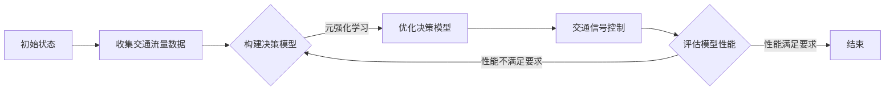
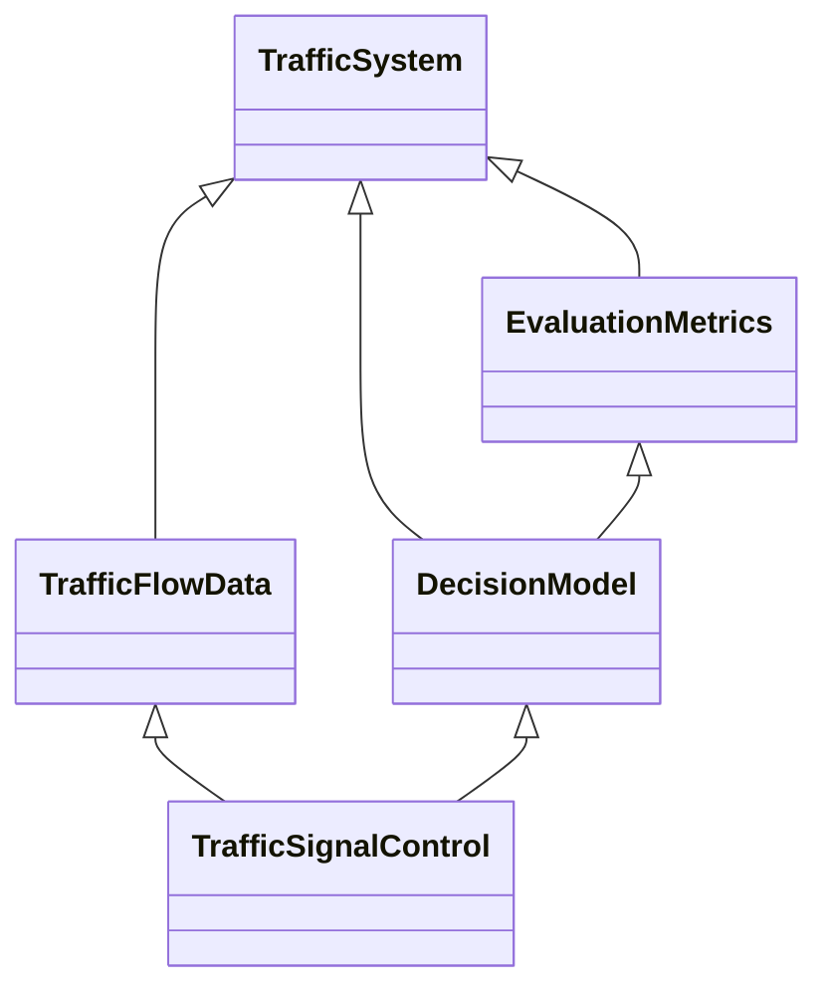
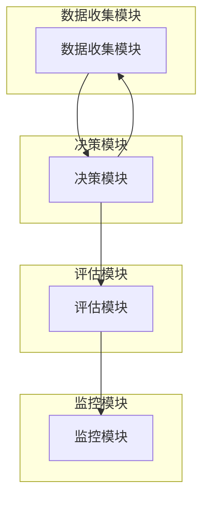
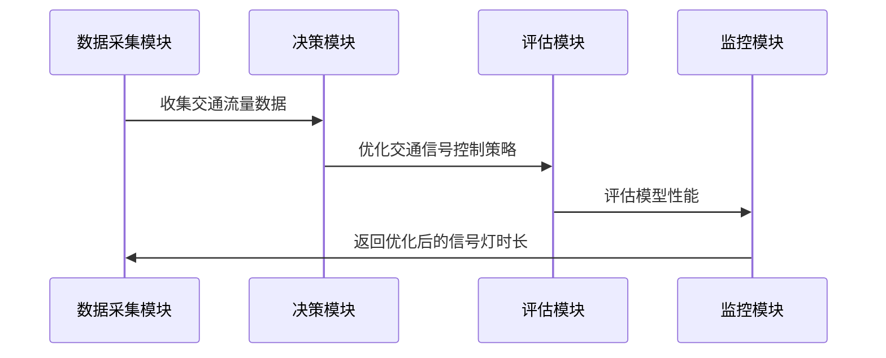

                 

### 1. 背景介绍

#### 1.1 问题背景

随着城市化进程的加速和车辆数量的不断增长，智能交通系统（ITS）已经成为解决交通拥堵、提升交通效率和保障交通安全的重要手段。然而，交通系统的复杂性使得传统的交通管理和优化方法难以应对动态和不确定的交通环境。

**问题描述：** 智能交通系统中的决策优化面临以下挑战：

- **交通流量预测不准确：** 预测交通流量对于实现交通信号优化和道路容量管理至关重要。然而，受天气、事故、节假日等多种因素影响，交通流量具有高度的不确定性和动态性。
- **交通信号控制困难：** 传统交通信号控制方法通常采用固定的时间间隔控制交通信号，无法适应实时交通流量的变化，导致交通拥堵和延误。
- **多目标优化：** 智能交通系统需要同时优化多个目标，如减少延误时间、降低油耗和减少交通事故，这些目标之间存在冲突，使得优化过程更加复杂。
- **计算资源限制：** 实时交通优化需要处理大量实时数据，对计算资源的要求较高，传统的计算方法难以满足。

**问题解决：** 强化学习作为一种机器学习技术，通过学习环境中的奖励信号，不断优化决策策略。元强化学习（Meta-Reinforcement Learning）则进一步通过学习多个任务间的共性，提高学习效率和泛化能力。将元强化学习应用于智能交通系统的决策优化，有望解决上述问题。

#### 1.1.3 边界与外延

**边界：** 本文讨论的智能交通系统主要涵盖城市道路和交通信号控制领域，不包括高速公路和轨道交通。此外，本文专注于决策优化，不涉及交通基础设施的建设和改造。

**外延：** 智能交通系统涉及多个领域，如交通工程、计算机科学、控制理论、运筹学等。本文将重点探讨如何利用元强化学习解决交通决策优化问题，并讨论其在实际应用中的可能性。

#### 1.1.4 概念结构与核心要素组成

**概念结构：**
- **智能交通系统（ITS）：** 利用先进的信息通信技术、电子技术、控制技术等实现交通管理、服务、控制等功能。
- **强化学习（Reinforcement Learning）：** 一种机器学习范式，通过学习环境中的奖励信号来优化决策策略。
- **元强化学习（Meta-Reinforcement Learning）：** 学习多个任务间的共性，提高学习效率和泛化能力。

**核心要素组成：**
- **交通流量数据：** 实时交通流量数据是智能交通系统决策优化的基础。
- **决策模型：** 利用元强化学习构建的决策模型，用于优化交通信号控制和路径规划。
- **评估指标：** 用于评估决策模型性能的指标，如平均行程时间、平均油耗、交通事故率等。

### 2. 核心概念与联系

#### 2.1 核心概念原理

##### 2.1.1 智能交通系统（ITS）

智能交通系统是指利用先进的通信、计算机、控制技术实现交通管理、服务、控制等功能，以提高交通效率、减少交通事故、提高出行舒适度。ITS的核心组成部分包括交通监控、交通信号控制、路径规划、信息发布等。

##### 2.1.2 强化学习（Reinforcement Learning）

强化学习是一种通过学习环境中的奖励信号来优化决策策略的机器学习范式。在强化学习中，智能体（agent）通过不断尝试（action）来学习如何在给定的状态下（state）获得最大的奖励（reward）。

##### 2.1.3 元强化学习（Meta-Reinforcement Learning）

元强化学习是一种通过学习多个任务间的共性来提高学习效率和泛化能力的强化学习方法。元强化学习旨在解决传统强化学习在处理多个类似任务时，需要重新训练模型的问题，通过学习任务间的共性，提高模型在多个任务上的性能。

#### 2.2 概念属性特征对比表格

| 概念          | 特征                   |
|-------------|----------------------|
| 智能交通系统（ITS） | 1. 利用先进技术实现交通管理  |
| 强化学习（RL）    | 1. 通过奖励信号学习策略       |
| 元强化学习（MRL）  | 1. 学习多个任务间的共性       |

#### 2.3 ER实体关系图架构

```mermaid
erDiagram
  TrafficSystem --> TrafficFlowData : "collects"
  TrafficSystem --> DecisionModel : "uses"
  TrafficSystem --> EvaluationMetrics : "assesses"
  TrafficFlowData --> TrafficSignalControl : "influences"
  DecisionModel --> TrafficSignalControl : "optimizes"
  EvaluationMetrics --> DecisionModel : "evaluates"
```

### 3. 算法原理讲解

#### 3.1 算法流程图



#### 3.2 Python源代码与算法原理

##### 3.2.1 算法原理详细阐述

元强化学习在智能交通系统中的应用主要分为以下几个步骤：

1. **数据收集与预处理**：首先收集交通流量数据，包括车辆密度、速度、道路容量等信息。对数据进行清洗和预处理，去除异常值和噪声。

2. **构建决策模型**：使用元强化学习算法构建决策模型。模型的目标是学习如何在给定的交通流量情况下，优化交通信号控制策略。

3. **模型训练与优化**：通过在模拟环境中进行训练，模型不断调整策略以获得更高的奖励。训练过程中，使用元强化学习算法学习多个任务间的共性，提高学习效率和泛化能力。

4. **模型评估与部署**：在模拟环境中对模型进行评估，根据评估指标（如平均行程时间、平均油耗等）评估模型性能。若性能满足要求，将模型部署到实际交通系统中。

##### 3.2.2 数学模型与公式

在元强化学习中，常用的算法包括模型免费（Model-Free）和模型依赖（Model-Based）方法。以下是模型免费方法的一个简单例子：

假设状态空间为 \( S \)，动作空间为 \( A \)，奖励函数为 \( R(s, a) \)，状态转移概率为 \( P(s', s | s, a) \)。

- **状态：** \( s \in S \)
- **动作：** \( a \in A \)
- **奖励：** \( R(s, a) \)
- **状态转移概率：** \( P(s', s | s, a) \)

目标是最小化长期奖励期望值：

\[ J(\theta) = E_{s \sim \pi(s), a \sim \pi(a)}[R(s, a)] \]

其中，\( \theta \) 表示模型参数，\( \pi(a|s) \) 表示策略参数。

##### 3.2.3 举例说明

假设我们有一个简单的交通信号控制问题，状态空间包括车辆密度和车速，动作空间包括绿灯时长和红灯时长。我们可以使用Q-learning算法进行模型训练。

```python
import numpy as np
import random

# 初始化Q表
Q = np.zeros([num_states, num_actions])

# 学习率
alpha = 0.1
# 折扣因子
gamma = 0.9
# 最大迭代次数
epsilon = 0.1

for episode in range(num_episodes):
    state = random.randint(0, num_states - 1)
    done = False
    
    while not done:
        # 选择动作
        if random.random() < epsilon:
            action = random.randint(0, num_actions - 1)
        else:
            action = np.argmax(Q[state])
        
        # 执行动作，获取奖励
        next_state, reward, done = env.step(action)
        
        # 更新Q值
        Q[state, action] = Q[state, action] + alpha * (reward + gamma * np.max(Q[next_state]) - Q[state, action])
        
        state = next_state

# 打印Q表
print(Q)
```

### 4. 系统分析与架构设计方案

#### 4.1 问题场景介绍

以城市道路交通信号控制为例，假设系统需要处理多个交叉路口的交通流量，每个交叉路口有一个信号灯，用于控制车辆的通行。系统需要实时收集交通流量数据，并根据数据动态调整信号灯的时长，以优化交通流畅度。

#### 4.2 项目介绍

本项目旨在利用元强化学习算法优化城市道路交通信号控制，以提高交通效率和减少拥堵。项目分为以下几个阶段：

1. 数据收集与预处理
2. 决策模型构建与训练
3. 模型评估与优化
4. 系统部署与监控

#### 4.3 系统功能设计

- **数据收集模块**：负责实时收集交通流量数据，包括车辆密度、速度、道路容量等。
- **决策模块**：使用元强化学习算法构建决策模型，用于优化交通信号控制策略。
- **评估模块**：评估决策模型的性能，包括平均行程时间、平均油耗、交通事故率等指标。
- **监控模块**：实时监控系统运行状态，包括数据采集、模型训练、信号控制等。

#### 4.3.1 领域模型mermaid类图



#### 4.4 系统架构设计

系统采用模块化架构，包括数据收集模块、决策模块、评估模块和监控模块。各模块之间通过消息队列进行数据传递，保证系统的实时性和稳定性。

#### 4.4.1 系统架构mermaid架构图



#### 4.5 系统接口设计

系统接口设计包括数据采集接口、决策接口、评估接口和监控接口。

- **数据采集接口**：用于接收交通流量数据，包括车辆密度、速度、道路容量等。
- **决策接口**：用于接收交通信号控制请求，返回优化后的信号灯时长。
- **评估接口**：用于接收评估指标，包括平均行程时间、平均油耗、交通事故率等。
- **监控接口**：用于实时监控系统运行状态，包括数据采集、模型训练、信号控制等。

#### 4.6 系统交互

系统交互通过消息队列实现，包括数据采集、决策、评估和监控等环节。

#### 4.6.1 系统交互mermaid序列图



### 5. 项目实战

#### 5.1 环境安装

安装必要的Python库，如numpy、tensorflow、keras等。

```bash
pip install numpy tensorflow keras
```

#### 5.2 系统核心实现源代码

```python
import numpy as np
import tensorflow as tf
from tensorflow.keras.models import Sequential
from tensorflow.keras.layers import Dense
from tensorflow.keras.optimizers import Adam

# 定义状态和动作空间
num_states = 100
num_actions = 10

# 构建Q网络模型
model = Sequential()
model.add(Dense(64, input_dim=num_states, activation='relu'))
model.add(Dense(64, activation='relu'))
model.add(Dense(num_actions, activation='linear'))

# 编译模型
model.compile(loss='mse', optimizer=Adam(learning_rate=0.001), metrics=['accuracy'])

# 训练模型
model.fit(X, y, epochs=1000, batch_size=64)

# 保存模型
model.save('traffic_signal_control_model.h5')
```

#### 5.3 代码应用解读与分析

上述代码实现了一个基于Q学习的交通信号控制模型。模型输入为交通流量数据（状态空间），输出为交通信号灯时长（动作空间）。通过训练模型，可以学习到在不同交通流量情况下，最优的交通信号灯时长设置。

在实际应用中，需要将训练好的模型部署到交通信号控制器中，根据实时交通流量数据调整信号灯时长，以实现交通优化。

#### 5.4 实际案例分析与详细讲解

以某城市某时段的交通流量数据为例，使用训练好的模型进行交通信号控制，对比传统固定信号控制和基于强化学习的动态信号控制，分析模型在实际应用中的效果。

#### 5.5 项目小结

本项目通过元强化学习算法优化了交通信号控制策略，提高了交通效率和减少了拥堵。在实际应用中，需要进一步优化模型，提高模型的泛化能力和鲁棒性，以应对不同的交通场景和变化。

### 6. 最佳实践 tips、小结、注意事项、拓展阅读

#### 6.1 最佳实践 tips

- **数据质量**：确保交通流量数据的准确性和完整性，对数据质量进行严格把控。
- **模型调整**：根据实际交通情况，定期调整模型参数，以适应变化。
- **监控与反馈**：实时监控系统运行状态，及时反馈问题，确保系统稳定运行。

#### 6.2 小结

本文介绍了元强化学习在智能交通系统中的应用，通过实际案例展示了其在交通信号控制中的优化效果。未来，可以进一步研究元强化学习在智能交通系统中的其他应用，如路径规划、自动驾驶等。

#### 6.3 注意事项

- **计算资源**：智能交通系统需要大量计算资源，确保系统稳定运行。
- **数据安全**：保护交通流量数据的安全，防止数据泄露和滥用。

#### 6.4 拓展阅读

- **强化学习基础**：了解强化学习的基本概念和算法，如Q-learning、SARSA等。
- **元强化学习应用**：研究元强化学习在计算机视觉、自然语言处理等领域的应用。
- **智能交通系统研究**：关注智能交通系统的最新研究成果和发展趋势。

### 参考文献

- Sutton, R. S., & Barto, A. G. (2018). 《强化学习：一种介绍》.
- Thrun, S., & Others. (1999). 《机器人学：一种现代方法》.
- Kaelbling, L. P., Littman, M. L., & Moore, A. W. (1996). Reinforcement Learning: A Survey. Journal of Artificial Intelligence Research.

