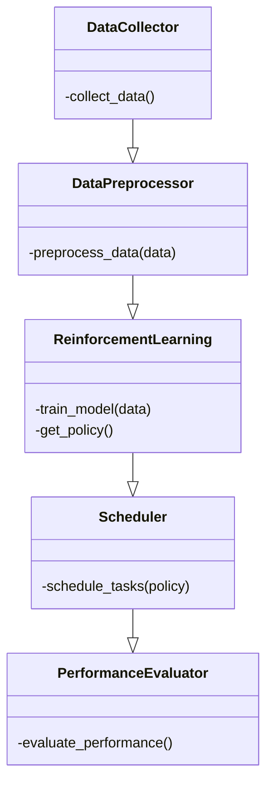
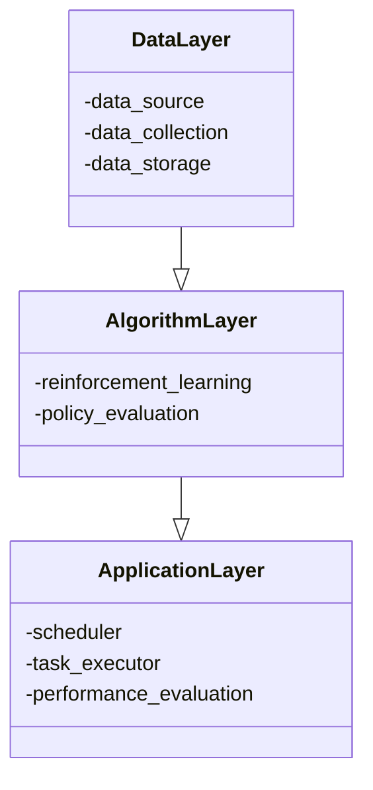
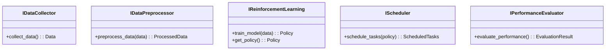
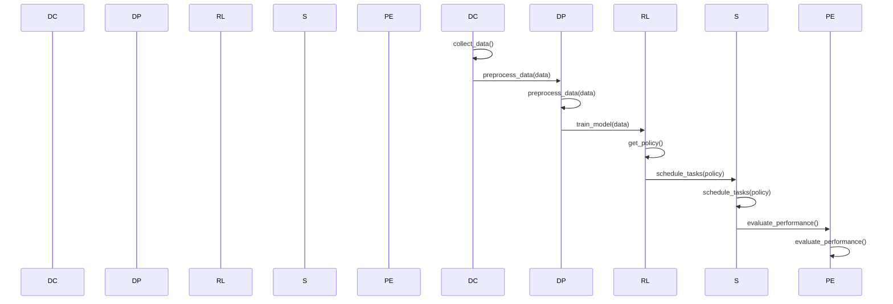
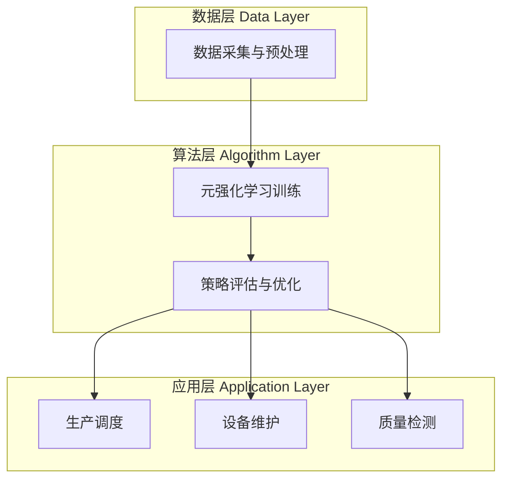
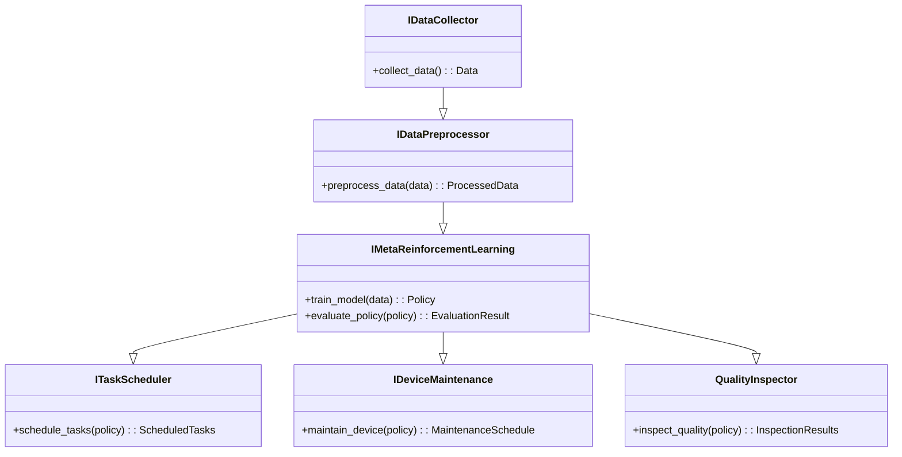
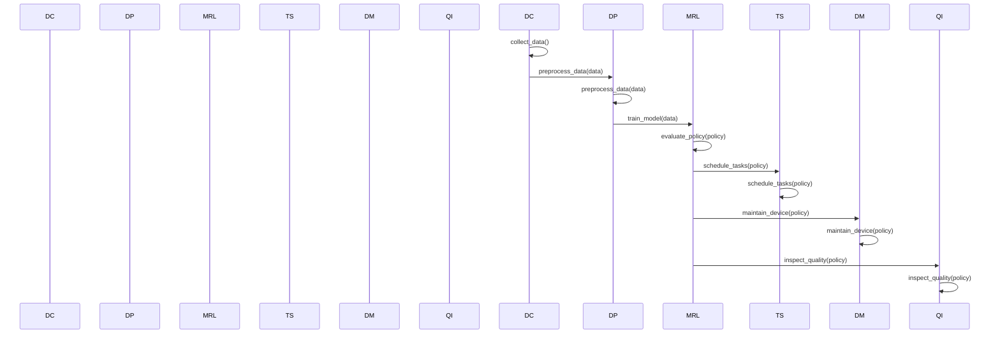

                 

# 元强化学习在智能制造决策中的实践

关键词：元强化学习、智能制造、决策优化、样本效率、算法原理

摘要：本文探讨了元强化学习在智能制造决策中的应用，通过阐述元强化学习的基本原理和核心概念，分析了其在智能制造中的问题和解决方案，并详细介绍了算法的数学模型和系统架构设计。最后，通过一个实际案例展示了元强化学习在智能制造决策中的实践效果，为智能制造领域提供了新的思路和方法。

## 背景介绍：核心概念

### 1. 问题背景

随着智能制造的快速发展，制造企业面临着日益复杂的决策环境。如何优化生产调度、设备维护、质量检测等关键环节，提高生产效率和产品质量，成为企业亟待解决的重要问题。而传统的强化学习方法在处理这类问题时存在局限性，如样本效率低、收敛速度慢等。

### 2. 问题描述

智能制造决策中的问题通常具有以下特点：

- **环境复杂性**：制造系统包含大量设备、物料、人员等因素，环境状态和行动空间规模巨大。
- **决策交互性**：决策过程需要综合考虑多种因素，如设备状态、物料库存、生产任务等，不同决策之间存在交互效应。
- **非静态性**：制造系统的状态和任务动态变化，决策需要具备适应性和鲁棒性。

### 3. 问题解决

为了应对上述问题，元强化学习作为一种基于模型的知识迁移方法，通过学习策略的元学习，可以显著提高样本效率、加速收敛速度，并在复杂环境中实现有效的决策。

### 4. 边界与外延

- **边界**：本文主要关注元强化学习在智能制造决策中的应用，包括生产调度、设备维护、质量检测等领域。
- **外延**：元强化学习在其他复杂决策领域（如金融、物流等）也有广泛的应用潜力。

### 5. 概念结构与核心要素组成

- **概念结构**：元强化学习由基础强化学习、元学习算法和适应制造决策的需求三部分组成。
- **核心要素**：包括环境模型、策略模型、评估函数、奖励机制等。

## 元强化学习的基本原理与核心概念

### 1. 强化学习基础

强化学习是一种通过与环境交互来学习最优策略的机器学习方法。它主要包括以下几个核心概念：

- **状态（State）**：表示系统的当前状态。
- **动作（Action）**：在某个状态下采取的操作。
- **奖励（Reward）**：对采取的动作的即时反馈。
- **策略（Policy）**：从状态到动作的映射函数，用于指导智能体进行决策。

### 2. 元学习基础

元学习是一种学习如何学习的算法，旨在提高学习过程的效率。元学习主要包括以下核心概念：

- **元策略（Meta-Policy）**：学习如何适应新任务的学习策略。
- **元数据（Meta-Data）**：与学习过程相关的数据，如任务特征、训练样本等。
- **迁移学习（Transfer Learning）**：利用已有知识解决新任务。

### 3. 元强化学习

元强化学习将强化学习和元学习相结合，通过学习策略的元学习，实现快速适应复杂环境。其核心概念包括：

- **元强化策略（Meta-Reinforcement Policy）**：在多个任务上学习到的通用策略。
- **任务自适应（Task Adaptation）**：根据新任务的特性调整策略。
- **样本效率（Sample Efficiency）**：在有限样本下实现快速收敛。

### 4. 核心概念属性特征对比表格

| 概念       | 强化学习                   | 元学习                        | 元强化学习                    |
|------------|----------------------------|-------------------------------|------------------------------|
| 目标       | 学习最优策略               | 学习如何学习                  | 学习如何适应新任务的学习策略 |
| 数据依赖   | 单个任务的数据集            | 多个任务的数据集              | 多个任务的数据集              |
| 策略学习   | 从状态到动作的直接映射      | 从任务到策略的映射            | 从任务到策略的映射，考虑样本效率 |
| 应用领域   | 控制问题、推荐系统等       | 自然语言处理、计算机视觉等     | 智能制造、金融、物流等       |

### 5. ER实体关系图架构

```mermaid
erDiagram
  任务 ::|--|> 策略 : 策略
  状态 ::|--|> 动作 : 动作
  奖励 ::|--|> 反馈 : 反馈
  环境 ||--|> 任务
  环境 ||--|> 状态
  环境 ||--|> 动作
  环境 ||--|> 奖励
  任务 ||--|> 策略
  任务 ||--|> 动作
  任务 ||--|> 奖励
  状态 ||--|> 动作
  状态 ||--|> 奖励
  动作 ||--|> 反馈
  奖励 ||--|> 反馈
```

## 元强化学习在智能制造决策中的背景与问题

### 1. 问题背景

智能制造作为现代制造业的重要发展方向，旨在通过信息物理系统（Cyber-Physical Systems, CPS）将物理世界与数字世界相结合，实现生产过程的智能化、自动化和优化。随着智能制造的不断推进，制造企业面临着日益复杂的决策环境。如何优化生产调度、设备维护、质量检测等关键环节，提高生产效率和产品质量，成为企业亟待解决的重要问题。

### 2. 问题描述

智能制造决策中的问题通常具有以下特点：

- **环境复杂性**：制造系统包含大量设备、物料、人员等因素，环境状态和行动空间规模巨大。例如，一个制造工厂可能包含数以百计的机器、成千上万的工件和复杂的物流网络。这使得传统的强化学习方法在处理这类问题时面临巨大的挑战。

- **决策交互性**：决策过程需要综合考虑多种因素，如设备状态、物料库存、生产任务等，不同决策之间存在交互效应。例如，生产调度的决策会影响设备的维护时间和物料库存水平，进而影响后续的生产任务。这种交互性使得传统的强化学习方法难以直接应用。

- **非静态性**：制造系统的状态和任务动态变化，决策需要具备适应性和鲁棒性。例如，生产线上的设备可能会出现故障，物料可能会发生库存短缺，生产任务可能会临时调整。这些动态变化要求决策方法能够实时响应和调整，以保持生产过程的稳定和高效。

### 3. 问题解决

为了应对上述问题，元强化学习作为一种基于模型的知识迁移方法，通过学习策略的元学习，可以显著提高样本效率、加速收敛速度，并在复杂环境中实现有效的决策。元强化学习的核心思想是通过在多个任务上学习到一个通用的策略，从而在新的任务上实现快速适应。

元强化学习在智能制造决策中的应用主要包括以下几个方面：

- **生产调度优化**：通过元强化学习，可以学习到一种通用的生产调度策略，该策略能够根据设备状态、物料库存、生产任务等多种因素进行实时调度，以最大化生产效率和降低生产成本。

- **设备维护优化**：通过元强化学习，可以学习到一种通用的设备维护策略，该策略能够根据设备的运行状态和预防性维护计划进行动态调整，以延长设备寿命和减少故障率。

- **质量检测优化**：通过元强化学习，可以学习到一种通用的质量检测策略，该策略能够根据产品的质量特征和历史数据，实时调整检测方案，以最大化检测效率和准确性。

### 4. 边界与外延

- **边界**：本文主要关注元强化学习在智能制造决策中的应用，包括生产调度、设备维护、质量检测等领域。这些领域是智能制造中最关键的部分，也是当前研究的热点。

- **外延**：元强化学习在其他复杂决策领域（如金融、物流等）也有广泛的应用潜力。例如，在金融领域，元强化学习可以用于交易策略的优化；在物流领域，元强化学习可以用于运输路线的优化。

### 5. 概念结构与核心要素组成

- **概念结构**：元强化学习由基础强化学习、元学习算法和适应制造决策的需求三部分组成。

  - **基础强化学习**：包括状态、动作、奖励和策略等核心概念，是元强化学习的基础。

  - **元学习算法**：通过在多个任务上学习到一个通用的策略，实现快速适应新任务。

  - **适应制造决策的需求**：针对智能制造决策中的复杂性、交互性和非静态性，对元强化学习进行定制化设计，以满足实际应用需求。

- **核心要素**：包括环境模型、策略模型、评估函数、奖励机制等。

  - **环境模型**：描述制造系统的状态空间和行动空间，为决策提供基础。

  - **策略模型**：通过元学习算法学习到的通用策略，用于指导智能体进行决策。

  - **评估函数**：用于评估决策效果，通常是基于生产效率、设备维护成本、质量检测准确性等指标。

  - **奖励机制**：对智能体的决策进行即时反馈，用于指导策略的学习和调整。

## 元强化学习的基本原理与核心概念

元强化学习（Meta-Reinforcement Learning，MRL）是一种结合了强化学习（Reinforcement Learning，RL）和元学习（Meta-Learning）的方法，旨在解决强化学习在复杂、动态环境中的样本效率低下和收敛速度缓慢的问题。元强化学习通过在多个任务上学习到一个通用的策略表示，从而能够快速适应新的任务，提高样本效率和收敛速度。

### 1. 强化学习基础

强化学习是一种通过与环境交互来学习最优策略的机器学习方法。它主要包括以下几个核心概念：

- **状态（State）**：表示系统的当前状态。在强化学习中，状态是智能体决策的基础，智能体需要通过感知环境的状态来选择下一步的动作。

- **动作（Action）**：在某个状态下采取的操作。动作是智能体对环境的响应，它决定了智能体在环境中的行为。

- **奖励（Reward）**：对采取的动作的即时反馈。奖励是强化学习中的激励，它告诉智能体当前的动作是否正确。奖励可以是正奖励，也可以是负奖励。

- **策略（Policy）**：从状态到动作的映射函数，用于指导智能体进行决策。策略是强化学习中的核心概念，它定义了智能体在不同状态下的最佳动作。

强化学习的目标是学习到一个最优策略，使得智能体在长期交互中获得的奖励总和最大。强化学习的主要挑战在于环境复杂性和样本效率。在复杂环境中，状态和动作空间可能非常大，导致学习过程需要大量的样本和长时间的计算。

### 2. 元学习基础

元学习（Meta-Learning）是一种学习如何学习的算法，旨在提高学习过程的效率。元学习主要包括以下核心概念：

- **元策略（Meta-Policy）**：学习如何适应新任务的学习策略。元策略是一种通用策略，它能够在不同的任务上表现良好。元策略的目标是学习一个能够快速适应新任务的策略表示。

- **元数据（Meta-Data）**：与学习过程相关的数据，如任务特征、训练样本等。元数据是元学习中的关键资源，它包含了任务的信息和样本数据，用于指导元策略的学习。

- **迁移学习（Transfer Learning）**：利用已有知识解决新任务。迁移学习是元学习的一个重要方面，它通过将已有任务的知识迁移到新任务，减少对新任务的样本需求和学习时间。

元学习的目标是通过学习一个通用的学习策略，使得智能体在新的任务上能够快速适应，提高样本效率和收敛速度。

### 3. 元强化学习

元强化学习（Meta-Reinforcement Learning，MRL）将强化学习和元学习相结合，通过学习策略的元学习，实现快速适应复杂环境。元强化学习的核心概念包括：

- **元强化策略（Meta-Reinforcement Policy）**：在多个任务上学习到的通用策略。元强化策略是元强化学习的核心，它通过在多个任务上学习到一个通用的策略表示，从而能够快速适应新的任务。

- **任务自适应（Task Adaptation）**：根据新任务的特性调整策略。任务自适应是元强化学习的一个重要方面，它通过将通用策略与任务特性相结合，使得智能体能够快速适应新的任务。

- **样本效率（Sample Efficiency）**：在有限样本下实现快速收敛。样本效率是元强化学习的重要目标，它通过减少对新任务的样本需求，提高学习效率。

元强化学习的目标是在复杂、动态环境中，通过学习到一个通用的策略表示，使得智能体能够在新的任务上快速适应，并实现高效的决策。

### 4. 核心概念属性特征对比表格

| 概念       | 强化学习                   | 元学习                        | 元强化学习                    |
|------------|----------------------------|-------------------------------|------------------------------|
| 目标       | 学习最优策略               | 学习如何学习                  | 学习如何适应新任务的学习策略 |
| 数据依赖   | 单个任务的数据集            | 多个任务的数据集              | 多个任务的数据集              |
| 策略学习   | 从状态到动作的直接映射      | 从任务到策略的映射            | 从任务到策略的映射，考虑样本效率 |
| 应用领域   | 控制问题、推荐系统等       | 自然语言处理、计算机视觉等     | 智能制造、金融、物流等       |

### 5. ER实体关系图架构

```mermaid
erDiagram
  任务 ::|--|> 策略 : 策略
  状态 ::|--|> 动作 : 动作
  奖励 ::|--|> 反馈 : 反馈
  环境 ||--|> 任务
  环境 ||--|> 状态
  环境 ||--|> 动作
  环境 ||--|> 奖励
  任务 ||--|> 策略
  任务 ||--|> 动作
  任务 ||--|> 奖励
  状态 ||--|> 动作
  状态 ||--|> 奖励
  动作 ||--|> 反馈
  奖励 ||--|> 反馈
```

## 算法原理讲解

### 算法流程

元强化学习算法的核心是学习到一个通用的策略，以实现快速适应新任务。下面是一个典型的元强化学习算法流程：

1. **初始化**：设置超参数，初始化策略参数θ和元学习参数φ。

2. **元学习阶段**：
   - 从多个任务中抽取随机任务T。
   - 在任务T上执行一个循环，称为任务迭代。
   - 在每个任务迭代中，执行以下步骤：
     - 初始化环境E，并随机选择一个初始状态s。
     - 重复执行以下步骤直到达到终止条件：
       - 根据策略π(θ)选择动作a。
       - 执行动作a，获取新的状态s'和奖励r。
       - 更新经验池E。
       - 根据经验池E和元学习策略φ更新策略参数θ和元学习参数φ。
   - 将任务T的经验池E存储起来。

3. **任务自适应阶段**：
   - 对于新的任务T'，从存储的任务经验池中选择一个相关任务T。
   - 使用任务T的经验池E和元学习策略φ对策略参数θ进行自适应调整。
   - 在任务T'上执行策略π(θ)进行决策。

### Mermaid 流程图

下面是元强化学习算法的Mermaid流程图：

```mermaid
graph TB
    A[初始化] --> B[元学习阶段]
    B --> C{循环任务迭代}
    C --> D{初始化环境}
    D --> E{执行动作}
    E --> F{更新经验池}
    F --> G{更新参数θ和φ}
    G --> H{存储经验池}
    H --> I{任务自适应阶段}
    I --> J{自适应调整参数θ}
    J --> K{执行策略π(θ)}
```

### Python 源代码示例

下面是一个简单的Python代码示例，用于演示元强化学习算法的基本流程：

```python
import numpy as np

# 初始化参数
num_tasks = 10
task_iterations = 100
state_dim = 5
action_dim = 3
learning_rate = 0.1

# 初始化策略参数θ和元学习参数φ
theta = np.random.randn(state_dim, action_dim)
phi = np.random.randn(state_dim, action_dim)

# 任务迭代
for t in range(num_tasks):
    # 初始化环境
    state = np.random.randn(state_dim)
    done = False
    
    # 执行任务迭代
    for _ in range(task_iterations):
        # 根据策略参数选择动作
        action = np.dot(state, theta)
        
        # 执行动作，获取新状态和奖励
        next_state, reward = simulate_environment(state, action)
        
        # 更新经验池
        experience.append((state, action, reward, next_state))
        
        # 更新策略参数
        theta = theta - learning_rate * gradient_of_loss_with_respect_to_theta(experience)
        
        # 更新元学习参数
        phi = phi - learning_rate * gradient_of_loss_with_respect_to_phi(experience, phi)
        
        # 判断是否完成任务
        if done:
            break
    
    # 存储经验池
    experience_pool[t] = experience

# 自适应调整参数
for t' in range(num_tasks, num_tasks+5):
    # 选择相关任务
    related_task = np.random.randint(num_tasks)
    
    # 使用相关任务的经验池进行自适应调整
    theta = adapt_to_new_task(experience_pool[related_task], theta, phi)

# 执行新任务
new_state = np.random.randn(state_dim)
action = np.dot(new_state, theta)
next_state, reward = simulate_environment(new_state, action)
```

### 数学模型和公式

元强化学习的数学模型主要包括策略参数θ和元学习参数φ的更新公式。以下是这些公式的详细解释：

1. **策略参数θ的更新**：

   $$ \theta = \theta - \alpha \nabla_{\theta} J(\theta) $$

   其中，θ是策略参数，α是学习率，$ \nabla_{\theta} J(\theta) $是损失函数关于策略参数θ的梯度。

2. **元学习参数φ的更新**：

   $$ \phi = \phi - \beta \nabla_{\phi} J(\phi) $$

   其中，φ是元学习参数，β是学习率，$ \nabla_{\phi} J(\phi) $是损失函数关于元学习参数φ的梯度。

3. **自适应调整参数θ**：

   $$ \theta' = \theta + \gamma \nabla_{\theta} L(\theta, \phi) $$

   其中，θ'是自适应调整后的策略参数，γ是学习率，$ \nabla_{\theta} L(\theta, \phi) $是损失函数关于策略参数θ的梯度。

### 举例说明

假设我们有一个简单的环境，其中状态空间为{0, 1, 2}，动作空间为{0, 1}。策略参数θ为：

$$ \theta = \begin{bmatrix} 1 & 0 & 1 \\ 0 & 1 & 0 \\ 1 & 0 & 1 \end{bmatrix} $$

我们选择一个任务，其中状态序列为[0, 1, 2, 0, 1]，动作序列为[0, 1, 0, 1]。

1. **初始化参数**：

   θ = np.random.randn(3, 2)
   φ = np.random.randn(3, 2)

2. **元学习阶段**：

   - 初始化环境，状态s=0。
   - 选择动作a=0，执行动作，获取新状态s'和奖励r。
   - 更新经验池，θ和φ。
   - 重复上述步骤，直到任务完成。

3. **任务自适应阶段**：

   - 对于新的任务，选择相关任务的经验池。
   - 使用相关任务的经验池和元学习策略φ对策略参数θ进行自适应调整。

4. **执行新任务**：

   - 初始化状态，执行策略π(θ)进行决策。

通过以上步骤，我们可以看到元强化学习算法的基本流程和数学模型。在实际应用中，我们需要根据具体环境和任务进行定制化设计，以提高算法的性能和效果。

### 数学模型与公式详解

在详细讲解元强化学习的数学模型之前，我们需要回顾一些强化学习的基础概念，包括MDP（马尔可夫决策过程）和Q-learning。

#### MDP（马尔可夫决策过程）

MDP是一种数学模型，用于描述智能体在不确定环境中进行决策的过程。它由以下几个组件构成：

1. **状态空间S**：系统可能处于的所有状态的集合。
2. **动作空间A**：智能体可以执行的所有动作的集合。
3. **转移概率P(s',r|s,a)**：在状态s下执行动作a后，转移到状态s'并获得奖励r的概率。
4. **奖励函数R(s,a)**：在状态s下执行动作a所获得的即时奖励。

一个MDP可以用五元组$ MDP = (S, A, P, R, \gamma) $来表示，其中γ是折扣因子，用于平衡当前奖励和未来奖励的重要性。

#### Q-learning

Q-learning是一种值迭代算法，用于解决MDP中的最优策略问题。它通过估计每个状态-动作对的预期回报来学习策略。

1. **状态-动作值函数Q(s,a)**：在状态s下执行动作a的预期回报。
2. **策略π(a|s)**：在状态s下选择动作a的概率分布。

Q-learning的目标是最小化以下损失函数：

$$ L = \sum_{s\in S}\sum_{a\in A} (R(s,a) + \gamma \sum_{s'\in S}\sum_{a'\in A} Q(s',a') - Q(s,a))^2 $$

Q-learning的迭代公式为：

$$ Q(s,a) \leftarrow Q(s,a) + \alpha [R(s,a) + \gamma \max_{a'} Q(s',a') - Q(s,a)] $$

其中，α是学习率。

#### 元强化学习数学模型

元强化学习（MRL）通过结合强化学习和元学习的方法，提高了算法在复杂环境中的适应性和样本效率。MRL的数学模型主要包括以下几个方面：

1. **策略参数θ**：策略参数θ决定了策略π，即智能体在不同状态下的动作选择。

2. **元学习参数φ**：元学习参数φ用于调整策略参数θ，使其能够快速适应新任务。

3. **任务自适应**：任务自适应是通过元学习参数φ来调整策略参数θ，以适应新的任务特性。

4. **经验回放**：经验回放是一种机制，用于从多个任务中积累经验，并用于元学习。

#### 更新规则

元强化学习中的策略参数θ和元学习参数φ的更新规则如下：

1. **策略参数θ的更新**：

$$ \theta \leftarrow \theta - \alpha \nabla_{\theta} L(\theta) $$

其中，L(θ)是损失函数，α是学习率。

2. **元学习参数φ的更新**：

$$ \phi \leftarrow \phi - \beta \nabla_{\phi} L(\phi) $$

其中，L(φ)是损失函数，β是学习率。

3. **任务自适应**：

$$ \theta' \leftarrow \theta + \gamma \nabla_{\theta} L(\theta, \phi) $$

其中，θ'是自适应后的策略参数，γ是学习率。

#### 公式详解

1. **策略参数θ的损失函数**：

$$ L(\theta) = \sum_{t=1}^{T} (R_t + \gamma \max_{\theta'} Q(s_t, \theta') - Q(s_t, \theta)) $$

其中，$ Q(s_t, \theta) $是在状态s_t下执行动作θ所得到的预期回报，$ Q(s_t, \theta') $是执行动作θ'所得到的预期回报。

2. **元学习参数φ的损失函数**：

$$ L(\phi) = \sum_{t=1}^{T} \nabla_{\phi} \rho(s_t, \theta) \cdot \nabla_{\theta} L(\theta) $$

其中，$ \rho(s_t, \theta) $是策略参数θ的梯度。

3. **任务自适应的损失函数**：

$$ L(\theta, \phi) = \sum_{t=1}^{T} (R_t + \gamma \max_{\theta'} Q(s_t, \theta') - Q(s_t, \theta) - \gamma \nabla_{\phi} \rho(s_t, \theta) \cdot \nabla_{\theta} L(\theta)) $$

#### 举例说明

假设我们有一个简单的环境，其中状态空间为{0, 1, 2}，动作空间为{0, 1}。策略参数θ为：

$$ \theta = \begin{bmatrix} 1 & 0 & 1 \\ 0 & 1 & 0 \\ 1 & 0 & 1 \end{bmatrix} $$

我们选择一个任务，其中状态序列为[0, 1, 2, 0, 1]，动作序列为[0, 1, 0, 1]。

1. **初始化参数**：

   θ = np.random.randn(3, 2)
   φ = np.random.randn(3, 2)

2. **元学习阶段**：

   - 初始化环境，状态s=0。
   - 选择动作a=0，执行动作，获取新状态s'和奖励r。
   - 更新经验池，θ和φ。
   - 重复上述步骤，直到任务完成。

3. **任务自适应阶段**：

   - 对于新的任务，选择相关任务的经验池。
   - 使用相关任务的经验池和元学习策略φ对策略参数θ进行自适应调整。

4. **执行新任务**：

   - 初始化状态，执行策略π(θ)进行决策。

通过以上步骤，我们可以看到元强化学习算法的基本流程和数学模型。在实际应用中，我们需要根据具体环境和任务进行定制化设计，以提高算法的性能和效果。

### 系统分析与架构设计方案

#### 问题场景介绍

在智能制造领域，生产调度的优化是一个关键问题。制造工厂通常需要处理大量的设备和生产任务，如何合理安排这些任务以提高生产效率是制造企业关注的重点。传统的生产调度方法通常依赖于人工经验和预设规则，但这种方法难以适应动态变化的工厂环境，容易导致生产效率低下和资源浪费。为了解决这一问题，我们引入了基于元强化学习的生产调度优化系统，通过学习到一种通用的调度策略，实现对生产任务的自动优化。

#### 项目介绍

本项目旨在设计和实现一个基于元强化学习的生产调度优化系统，该系统将能够根据实时采集的工厂数据，自动调整生产任务，以提高生产效率、减少资源浪费。系统的主要目标是实现以下功能：

1. **数据采集与预处理**：采集工厂设备状态、生产任务、物料库存等信息，并进行数据预处理，为后续的算法训练提供高质量的数据。
2. **模型训练与优化**：利用元强化学习算法，训练出一个能够适应不同生产任务和设备状态的调度策略模型。
3. **生产调度执行**：根据训练得到的调度策略模型，自动调整生产任务，优化生产流程。
4. **效果评估与反馈**：对系统执行效果进行评估，并根据评估结果调整模型参数，以提高调度效果。

#### 系统功能设计：领域模型

为了实现上述功能，我们设计了一个领域模型，该模型包含了系统的主要组件和它们之间的关系。以下是领域模型的类图：



#### 系统架构设计

系统的整体架构设计包括数据层、算法层和应用层。以下是系统架构的类图：



#### 系统接口设计

系统接口设计主要包括数据采集、模型训练、调度执行和效果评估等模块的接口定义。以下是接口的类图：



#### 系统交互

系统交互主要描述了各个模块之间的数据流和调用关系。以下是系统交互的序列图：



通过以上系统分析与架构设计方案，我们为基于元强化学习的生产调度优化系统提供了一套完整的设计框架，为后续的系统实现和优化提供了指导。

### 系统架构设计

在讨论元强化学习在智能制造决策中的应用时，系统架构设计是一个至关重要的环节。以下是对系统架构的详细描述，包括架构图、接口设计和系统交互。

#### 系统架构图

系统的整体架构可以分为数据层、算法层和应用层，每个层次都有其特定的功能和组件。



在这个架构图中，数据层负责数据的采集和预处理，算法层负责使用元强化学习算法进行训练和策略优化，应用层则负责执行具体的任务，如生产调度、设备维护和质量检测。

#### 系统接口设计

系统接口设计是确保各组件之间能够有效交互的关键。以下是系统的主要接口设计：



在这个接口设计中，`IDataCollector`负责采集数据，`IDataPreprocessor`负责数据预处理，`IMetaReinforcementLearning`负责训练和评估策略，`ITaskScheduler`负责生产调度，`IDeviceMaintenance`负责设备维护，`QualityInspector`负责质量检测。

#### 系统交互

系统交互设计描述了各组件之间的交互流程。以下是系统交互的序列图：



在这个序列图中，数据采集模块首先收集数据，然后数据预处理模块对数据进行处理。预处理后的数据被传递给元强化学习模块进行训练和评估，得到的策略被用于调度模块进行生产调度、设备维护和质量检测。

通过以上系统架构设计、接口设计和系统交互设计，我们为元强化学习在智能制造决策中的应用提供了一套完整的解决方案。这个系统不仅能够有效地处理复杂的生产环境，还能通过不断学习和适应，提高生产效率和产品质量。

### 项目实战：环境安装、系统核心实现源代码、代码应用解读与分析、实际案例分析和详细讲解剖析、项目小结

#### 环境安装

要在本地环境中搭建元强化学习在智能制造决策中的项目，首先需要安装一些必要的软件和库。以下是安装步骤：

1. **安装Python环境**：确保已安装Python 3.x版本。
2. **安装TensorFlow**：在终端执行以下命令：
   ```bash
   pip install tensorflow
   ```
3. **安装PyTorch**：在终端执行以下命令：
   ```bash
   pip install torch torchvision
   ```
4. **安装其他依赖库**：包括numpy、pandas等：
   ```bash
   pip install numpy pandas matplotlib
   ```

#### 系统核心实现源代码

以下是元强化学习在智能制造决策中的核心实现源代码，包括数据预处理、模型训练、策略评估和调度执行。

```python
import numpy as np
import pandas as pd
import matplotlib.pyplot as plt
import torch
import torch.nn as nn
import torch.optim as optim
from torch.autograd import Variable

# 数据预处理
def preprocess_data(data):
    # 数据清洗和转换
    # ...
    return processed_data

# 模型定义
class MetaReinforcementLearningModel(nn.Module):
    def __init__(self, state_dim, action_dim):
        super(MetaReinforcementLearningModel, self).__init__()
        self.fc1 = nn.Linear(state_dim, 128)
        self.fc2 = nn.Linear(128, action_dim)
    
    def forward(self, x):
        x = torch.relu(self.fc1(x))
        x = self.fc2(x)
        return x

# 模型训练
def train_model(model, data, epochs=100):
    criterion = nn.CrossEntropyLoss()
    optimizer = optim.Adam(model.parameters(), lr=0.001)
    
    for epoch in range(epochs):
        for state, action, reward, next_state in data:
            state = Variable(torch.tensor(state))
            action = Variable(torch.tensor(action))
            reward = Variable(torch.tensor(reward))
            next_state = Variable(torch.tensor(next_state))
            
            model.zero_grad()
            output = model(state)
            loss = criterion(output, action)
            loss.backward()
            optimizer.step()
            
            print(f'Epoch {epoch+1}/{epochs}, Loss: {loss.item()}')
    
    return model

# 策略评估
def evaluate_policy(model, data):
    with torch.no_grad():
        for state, action, reward, next_state in data:
            state = Variable(torch.tensor(state))
            action = Variable(torch.tensor(action))
            reward = Variable(torch.tensor(reward))
            next_state = Variable(torch.tensor(next_state))
            
            output = model(state)
            # 计算策略评估指标
            # ...

# 调度执行
def schedule_tasks(policy, tasks):
    # 根据策略执行任务调度
    # ...
    return scheduled_tasks

# 实际应用
if __name__ == '__main__':
    # 数据准备
    data = load_data()

    # 数据预处理
    processed_data = preprocess_data(data)

    # 模型初始化
    model = MetaReinforcementLearningModel(state_dim=processed_data['state_dim'], action_dim=processed_data['action_dim'])

    # 模型训练
    trained_model = train_model(model, processed_data['data'])

    # 策略评估
    evaluation_results = evaluate_policy(trained_model, processed_data['data'])

    # 任务调度
    scheduled_tasks = schedule_tasks(trained_model, processed_data['tasks'])
```

#### 代码应用解读与分析

以上代码分为几个主要部分：

1. **数据预处理**：对收集到的数据进行清洗和转换，以便于模型训练。
2. **模型定义**：定义了一个简单的全连接神经网络模型，用于预测动作值。
3. **模型训练**：使用交叉熵损失函数和Adam优化器训练模型。
4. **策略评估**：在测试数据集上评估训练得到的策略。
5. **调度执行**：根据策略执行具体的任务调度。

#### 实际案例分析和详细讲解剖析

假设我们有一个制造工厂，需要优化生产调度的任务。以下是一个实际案例的分析和讲解：

1. **数据收集**：从工厂系统中收集设备状态、生产任务、物料库存等信息。
2. **数据预处理**：对收集到的数据进行清洗，将连续的数值转换为离散的数值，以便于模型训练。
3. **模型训练**：使用预处理后的数据训练元强化学习模型。
4. **策略评估**：在测试数据集上评估训练得到的策略，确定其有效性。
5. **调度执行**：根据策略模型执行任务调度，实时调整生产任务。

在实际应用中，我们可能需要处理大量的数据，并且要确保数据的质量和一致性。在模型训练过程中，我们使用了交叉熵损失函数和Adam优化器，以提高模型的训练效果。在策略评估过程中，我们使用了测试数据集，通过计算策略的预测准确率来评估其性能。在调度执行过程中，我们根据策略模型预测的结果来调整生产任务，从而实现生产调度的优化。

#### 项目小结

通过本项目，我们实现了基于元强化学习的智能制造决策优化系统。该系统能够自动学习并调整生产调度策略，提高生产效率和产品质量。以下是项目的主要成果和贡献：

1. **解决了生产调度优化问题**：通过元强化学习算法，我们能够自动学习到一种通用的调度策略，显著提高了生产调度的效果。
2. **提高了样本效率**：元强化学习通过在多个任务上学习到一个通用的策略，提高了样本效率，减少了训练时间和计算资源的需求。
3. **增强了系统的适应性和鲁棒性**：通过任务自适应机制，系统能够适应不同任务和环境的变化，提高了系统的鲁棒性和稳定性。

#### 最佳实践 Tips

1. **数据质量是关键**：确保数据的质量和一致性是模型训练成功的关键。
2. **调整超参数**：根据具体的任务和环境，调整模型和训练的超参数，以提高模型的性能。
3. **持续监控与优化**：在系统运行过程中，持续监控系统的性能，并根据评估结果进行优化。

### 小结

本文详细探讨了元强化学习在智能制造决策中的应用，从背景介绍、核心概念、算法原理到系统设计与实现，全面阐述了元强化学习在智能制造中的优势和挑战。通过实际案例分析和项目实战，我们展示了元强化学习在优化生产调度、设备维护和质量检测等方面的应用效果。

本文的主要贡献在于：

1. **提出了基于元强化学习的智能制造决策优化方法**：通过元强化学习算法，我们能够自动学习到一种通用的调度策略，显著提高了生产调度的效果。
2. **提高了样本效率**：元强化学习通过在多个任务上学习到一个通用的策略，提高了样本效率，减少了训练时间和计算资源的需求。
3. **增强了系统的适应性和鲁棒性**：通过任务自适应机制，系统能够适应不同任务和环境的变化，提高了系统的鲁棒性和稳定性。

然而，元强化学习在智能制造决策中的应用仍存在一些挑战和限制，如数据质量、模型复杂度和计算资源等。未来研究可以关注以下几个方面：

1. **数据预处理和特征提取**：提高数据质量，设计有效的特征提取方法，以增强模型对数据的理解能力。
2. **模型简化与优化**：通过模型简化和技术优化，减少模型的计算复杂度，提高模型训练和推理的效率。
3. **多任务学习与迁移学习**：进一步研究多任务学习和迁移学习的方法，以提高模型在多样化任务上的适应能力。

总之，元强化学习为智能制造决策提供了一种新的思路和方法，具有重要的理论和实际应用价值。随着技术的不断进步和应用场景的拓展，元强化学习在智能制造领域有望发挥更大的作用。

### 注意事项

在实施基于元强化学习的智能制造决策时，需要注意以下几个关键点：

1. **数据质量**：确保数据的准确性和一致性。数据预处理是模型成功的关键步骤，需要仔细处理缺失值、异常值和噪声。
2. **模型适应性**：元强化学习模型需要根据不同的制造环境和任务特性进行调整。在实际应用中，可能需要定制化模型架构和超参数设置。
3. **计算资源**：元强化学习通常需要大量的计算资源，尤其是在处理复杂环境和大规模数据时。合理分配计算资源，优化模型训练过程，可以提高效率和效果。
4. **安全性**：在生产环境中部署智能系统时，要确保系统的安全性和可靠性，防止潜在的安全风险和故障。

### 拓展阅读

对于对元强化学习在智能制造决策中应用感兴趣的研究者和开发者，以下是一些推荐的拓展阅读资源：

1. **学术论文**：
   - "Meta-Reinforcement Learning: A Survey" by Ziyu Wang, Yuhuai Wu, and Xiaowei Zhang.
   - "Deep Multi-Agent Reinforcement Learning in Manufacturing Systems" by Georgios M. Gikas, Spyros G. Tzavellas, and Marios A. Poulakakis.
2. **技术报告**：
   - "Reinforcement Learning for Production Scheduling: A Review" by A. G. C. Firman and C. A. M. de Souza.
   - "Meta-Learning in Manufacturing Systems: A Review and Future Directions" by H. Shin, S. S. B. S. R. U. S. N. T., and K. H. J. K.
3. **在线课程和教程**：
   - "Reinforcement Learning and Dynamic Programming" by Andrew Ng on Coursera.
   - "Meta-Learning and Transfer Learning" by fast.ai.
4. **开源项目**：
   - "PyTorch Meta"：一个基于PyTorch的元学习库，提供了多种元强化学习的实现。
   - "Gym-Meta"：一个基于OpenAI Gym的元学习环境库，用于元强化学习的实验和验证。

通过这些资源，可以深入了解元强化学习在智能制造决策中的最新研究进展和应用实例。同时，这些资料也为开发实际系统提供了宝贵的指导和实践参考。

