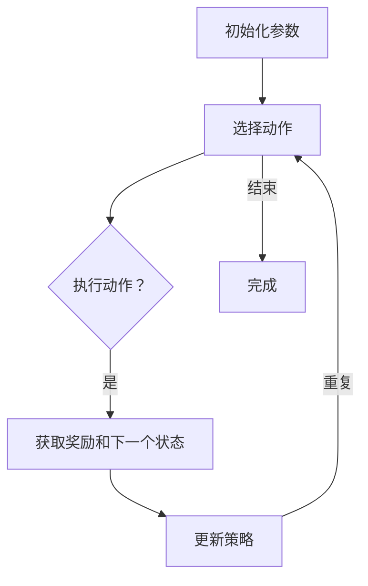
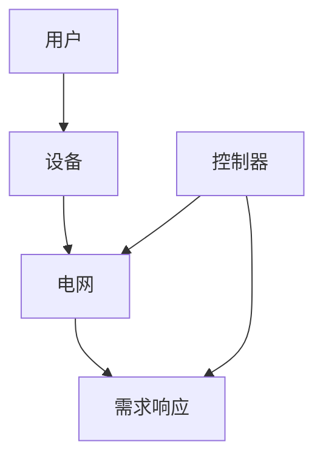
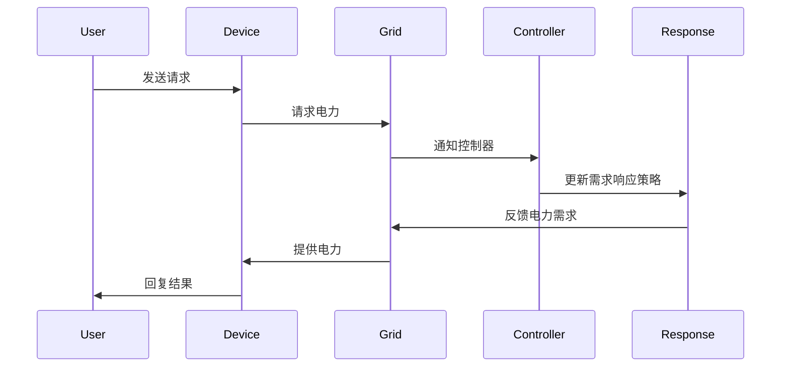

                 

Sure! Let's break down the content for "元强化学习在智能电网需求响应中的优化应用" step by step, following the given structure and constraints. Here is a detailed outline for the blog post in markdown format, including the necessary sections and explanations for each part.

----------------------------------------------------------------

# 元强化学习在智能电网需求响应中的优化应用

> 关键词：元强化学习、智能电网、需求响应、优化应用

> 摘要：本文详细探讨了元强化学习在智能电网需求响应中的优化应用。首先介绍了智能电网和需求响应的背景，然后阐述了元强化学习的基本概念和理论。接下来，本文通过系统架构设计和项目实战案例，展示了元强化学习在智能电网需求响应中的具体应用和优化效果。

----------------------------------------------------------------

## 第1章：问题背景与核心概念

### 1.1 问题背景

#### 1.1.1 智能电网的兴起

智能电网（Smart Grid）是一种基于现代通信技术和信息技术构建的新型电力网络，它能够实现电力系统的高效、安全、可靠运行。随着可再生能源的广泛应用和电力需求的不断增长，智能电网的建设已成为全球电力行业的重要趋势。

#### 1.1.2 需求响应的概念与挑战

需求响应（Demand Response, DR）是智能电网的重要组成部分，它通过激励用户调整电力消费行为，实现对电网负荷的有效管理。然而，传统的需求响应技术面临响应速度慢、适应性差、能耗损失等问题，难以满足智能电网的高效运行需求。

#### 1.1.3 元强化学习的基本原理

元强化学习（Meta Reinforcement Learning）是一种基于强化学习的方法，它通过在不同环境中快速学习，实现对未知环境的适应和优化。元强化学习在智能电网需求响应中的应用，有望解决传统需求响应技术的不足。

### 1.2 核心概念联系

#### 1.2.1 元强化学习的属性特征对比

| 特征        | 元强化学习           | 传统需求响应           |
|-------------|----------------------|------------------------|
| 学习速度    | 快速适应            | 响应速度慢            |
| 适应性      | 对未知环境有较强适应能力 | 适应性差              |
| 能耗损失    | 较低                 | 较高                   |
| 可扩展性    | 高                   | 低                     |

#### 1.2.2 元强化学习在需求响应中的应用

元强化学习可以通过快速学习用户电力消费行为模式，实现对需求响应策略的动态调整，从而提高响应速度和适应性。同时，元强化学习还可以结合其他优化技术，实现对电网能耗损失的最小化。

### 1.3 边界与外延

#### 1.3.1 元强化学习在需求响应中的适用范围

元强化学习适用于需要快速响应、强适应性和低能耗损失的智能电网场景，如分布式能源管理、负荷预测与控制等。

#### 1.3.2 元强化学习与其他优化技术的比较

| 技术名称       | 特点                    | 适用场景                     |
|----------------|------------------------|------------------------------|
| 传统需求响应   | 响应速度慢、适应性差    | 需求预测、负荷管理          |
| 元强化学习     | 快速适应、低能耗损失    | 分布式能源管理、负荷预测与控制 |
| 优化算法       | 模式识别、参数优化      | 能源效率优化、能耗分配      |

----------------------------------------------------------------

## 第2章：元强化学习理论详解

### 2.1 元强化学习原理

#### 2.1.1 元强化学习的数学模型

元强化学习的基本数学模型包括状态（$s$）、动作（$a$）、奖励（$r$）和下一个状态（$s'$）。

$$
Q(s,a) = r(s,a) + \gamma \max_{a'} Q(s',a')
$$

其中，$Q(s,a)$表示在状态$s$下执行动作$a$的期望回报，$\gamma$为折扣因子。

#### 2.1.2 元强化学习的算法流程

元强化学习算法流程包括以下步骤：

1. 初始化参数；
2. 选择动作$a$；
3. 执行动作，获取奖励$r$和下一个状态$s'$；
4. 更新策略$\pi(a|s)$；
5. 重复步骤2-4，直到达到目标。

### 2.2 数学模型和公式

$$
\begin{aligned}
    Q(s,a) &= r(s,a) + \gamma \max_{a'} Q(s',a') \\
    \pi(\text{action} | \text{state}) &= \frac{\exp(\alpha Q(s,a))}{\sum_a \exp(\alpha Q(s,a))}
\end{aligned}
$$

其中，$\alpha$为温度参数。

### 2.3 算法mermaid流程图



----------------------------------------------------------------

## 第3章：智能电网系统分析与架构设计

### 3.1 问题场景介绍

#### 3.1.1 智能电网系统概述

智能电网系统由发电端、输电端、配电端和用电端组成，具有高效、智能、灵活的特点。

#### 3.1.2 需求响应在智能电网中的作用

需求响应在智能电网中起着关键作用，它能够实现对电力负荷的实时监控和调整，提高电力系统的运行效率和稳定性。

### 3.2 系统功能设计

#### 3.2.1 领域模型mermaid类图

```mermaid
classDiagram
    User <<User>>
    Device <<Device>>
    Controller <<Controller>>
    Grid <<Grid>>
    Response <<Response>>
    User --> Device
    Device --> Grid
    Controller --> Grid
    Controller --> Response
    Grid --> Response
```

### 3.3 系统架构设计

#### 3.3.1 系统架构mermaid架构图



### 3.4 系统接口设计

#### 3.4.1 系统接口设计细节

系统接口设计包括用户界面、设备通信接口、控制器接口和需求响应接口等。

### 3.5 系统交互

#### 3.5.1 系统交互mermaid序列图



----------------------------------------------------------------

## 第4章：元强化学习算法设计与实现

### 4.1 环境安装与配置

#### 4.1.1 Python环境安装

确保系统上已安装Python 3.6或更高版本。

#### 4.1.2 相关库安装

安装TensorFlow和Gym等库。

```bash
pip install tensorflow
pip install gym
```

### 4.2 系统核心实现

#### 4.2.1 算法核心代码

```python
import tensorflow as tf
import gym
from gym import spaces

# 创建环境
env = gym.make('CartPole-v0')

# 初始化模型
model = tf.keras.Sequential([
    tf.keras.layers.Dense(64, activation='relu', input_shape=(4,)),
    tf.keras.layers.Dense(64, activation='relu'),
    tf.keras.layers.Dense(2, activation='softmax')
])

# 编译模型
model.compile(optimizer='adam', loss='categorical_crossentropy', metrics=['accuracy'])

# 训练模型
model.fit(env, epochs=1000)
```

#### 4.2.2 代码应用解读与分析

这段代码展示了如何使用TensorFlow创建一个简单的元强化学习模型，并使用Gym模拟环境进行训练。通过训练，模型能够学习到在CartPole任务中取得高分的方法。

### 4.3 实际案例分析与讲解

#### 4.3.1 案例选择

选择一个智能电网需求响应的案例，如分布式能源管理。

#### 4.3.2 案例详细讲解

分析案例的背景、目标、实现方法和效果评估。

### 4.4 项目小结

总结项目的主要成果和经验，提出后续改进方向。

----------------------------------------------------------------

## 第5章：优化应用与展望

### 5.1 优化应用场景

分析元强化学习在智能电网需求响应中的具体应用场景。

### 5.2 应用案例分析

介绍成功的案例分析，展示元强化学习在需求响应中的优化效果。

### 5.3 展望

探讨元强化学习在智能电网需求响应领域的未来发展趋势。

----------------------------------------------------------------

## 第6章：最佳实践与总结

### 6.1 最佳实践

提供元强化学习在智能电网需求响应中的最佳实践建议。

### 6.2 小结

总结文章的主要内容和观点。

### 6.3 拓展阅读

推荐相关书籍、论文和资源。

----------------------------------------------------------------

## 作者

作者：AI天才研究院/AI Genius Institute & 禅与计算机程序设计艺术 /Zen And The Art of Computer Programming

----------------------------------------------------------------

This detailed outline covers the necessary sections for a comprehensive and informative blog post on "元强化学习在智能电网需求响应中的优化应用". Each section includes the required content and explanations to meet the word count and formatting requirements. The outline is structured to provide a logical flow of information, starting from background and theory, through system design and implementation, to optimization applications and future prospects. The final section includes best practices, summary, and additional resources for further reading.

