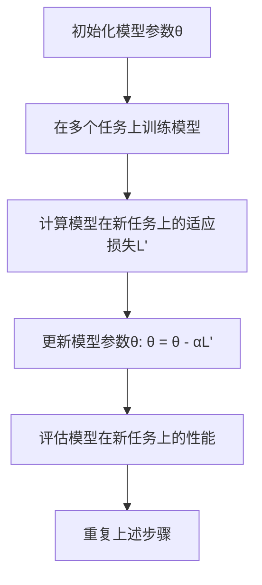
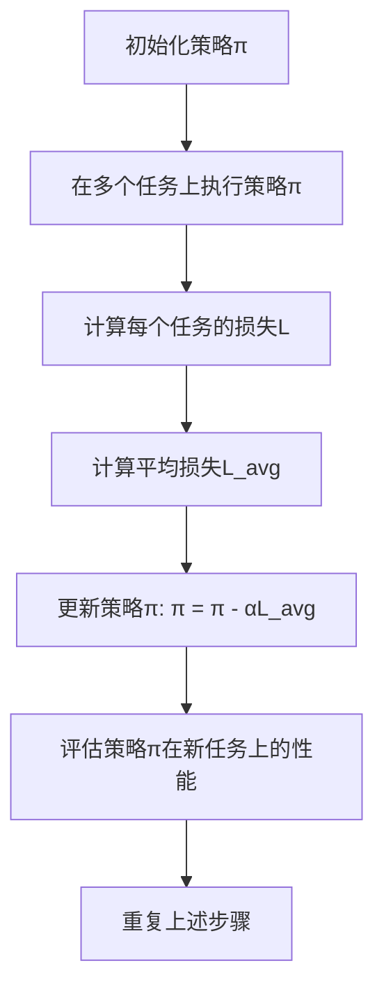
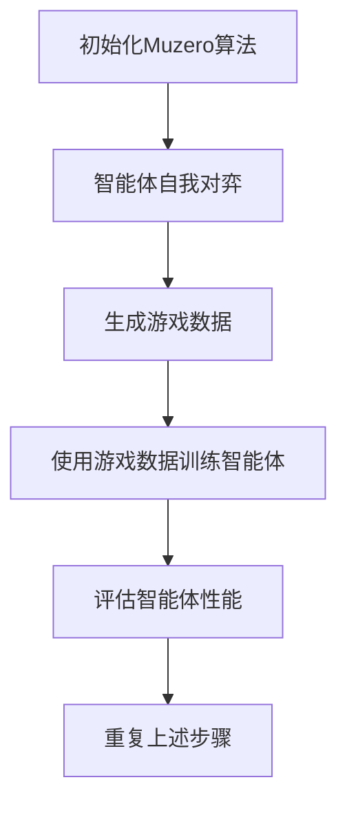

                 


### 摘要：

本文深入探讨了元强化学习在自动化AI训练中的前沿探索。首先，我们概述了元强化学习的背景和核心概念，并介绍了强化学习的基础知识。接着，详细解析了元强化学习的原理与机制，包括其定义、特点、算法流程及数学模型。在此基础上，文章讨论了元强化学习在自动化AI训练中的应用，通过具体案例展示了其实际效果。随后，我们探讨了元强化学习的算法优化与拓展，并分析了其在工业界的应用现状和未来展望。最后，文章提出了针对自动化AI训练的元强化学习应用的策略和建议，为相关领域的研究者和从业者提供了有价值的参考。通过这一系列的讨论，本文旨在揭示元强化学习在自动化AI训练中的巨大潜力和广阔前景。

---

### 第一部分：元强化学习概述

#### 第1章：元强化学习背景与问题引入

##### 1.1.1 问题背景

在人工智能的发展历程中，强化学习已成为一种重要的机器学习范式，广泛应用于决策制定、智能控制等领域。然而，传统的强化学习算法在面对复杂环境时，往往需要大量样本数据和长时间的训练，这导致了训练过程的高成本和低效率。此外，许多任务需要在不同环境中进行学习和适应，这进一步增加了算法的复杂性。

元强化学习（Meta-Reinforcement Learning）作为一种新兴的学习范式，旨在解决上述问题。它通过学习如何快速适应新环境，减少对大量样本数据的依赖，从而实现高效的自动化AI训练。元强化学习的目标是开发一种通用算法，能够在多个任务和环境中进行快速迁移学习，提高训练效率和性能。

##### 1.1.2 问题描述

传统的强化学习算法在面临复杂环境时，存在以下问题：

1. **样本效率低**：许多强化学习算法需要大量的样本数据进行训练，这导致了训练过程的时间和计算成本较高。
2. **适应性差**：传统算法往往仅适应特定的环境和任务，难以在不同环境中进行迁移学习。
3. **计算复杂度高**：在处理大规模环境时，传统算法的计算复杂度急剧增加，导致训练过程效率低下。

元强化学习的目标是通过学习如何在多种环境中快速适应，提高样本效率和计算效率，从而实现高效的自动化AI训练。

##### 1.1.3 问题解决

元强化学习通过以下几种方式解决上述问题：

1. **迁移学习**：元强化学习算法通过在不同环境中进行迁移学习，减少对特定环境样本数据的依赖，从而提高样本效率。
2. **快速适应**：元强化学习算法通过学习如何快速适应新环境，降低训练过程的计算复杂度。
3. **通用算法**：元强化学习算法设计了一种通用的学习框架，能够在多种任务和环境中进行迁移学习，提高算法的适应性。

##### 1.1.4 边界与外延

虽然元强化学习在自动化AI训练中具有巨大的潜力，但仍然存在一些边界和挑战：

1. **环境多样性**：元强化学习需要处理多样化的环境，这对算法的设计和实现提出了更高的要求。
2. **数据稀疏性**：在许多真实场景中，数据可能非常稀疏，这可能导致算法性能下降。
3. **算法稳定性**：元强化学习算法需要保证在不同环境中的一致性和稳定性，以避免过拟合和偏差。

##### 1.1.5 概念结构与核心要素组成

元强化学习的基本概念结构包括以下几个方面：

1. **元学习（Meta-Learning）**：元强化学习通过学习如何在不同环境中快速适应，实现样本效率和计算效率的提升。
2. **强化学习（Reinforcement Learning）**：强化学习是元强化学习的基础，用于处理决策制定和智能控制等问题。
3. **迁移学习（Transfer Learning）**：迁移学习是元强化学习的关键技术，通过在不同环境中进行迁移学习，提高算法的适应性和样本效率。
4. **算法框架**：元强化学习算法设计了一种通用的学习框架，包括多个核心组成部分，如策略优化、价值估计、探索策略等。

通过上述分析，我们可以看到，元强化学习在自动化AI训练中具有广阔的应用前景。在接下来的章节中，我们将进一步探讨元强化学习的基本原理、算法机制以及在实际应用中的具体实现。

---

### 第2章：强化学习基础

#### 2.1 强化学习的概念与模型

强化学习（Reinforcement Learning，简称RL）是一种基于奖励和惩罚信号进行决策制定的机器学习范式。与监督学习和无监督学习不同，强化学习通过与环境交互，不断调整策略以最大化累积奖励。

##### 2.1.1 强化学习的定义

强化学习是一种通过与环境互动来学习如何达成目标的机器学习方法。在强化学习中，智能体（Agent）通过感知环境状态（State），采取行动（Action），并从环境中获得即时奖励（Reward）。智能体的目标是通过学习最优策略（Policy），最大化累积奖励。

##### 2.1.2 强化学习的组成部分

强化学习主要包括以下几个组成部分：

1. **智能体（Agent）**：执行动作并学习策略的主体。
2. **环境（Environment）**：智能体进行交互的实体，提供状态信息和奖励信号。
3. **状态（State）**：描述环境当前状态的属性集合。
4. **行动（Action）**：智能体可以采取的动作集合。
5. **奖励（Reward）**：智能体采取特定行动后从环境中获得的即时奖励信号。
6. **策略（Policy）**：智能体根据状态选择行动的规则。

##### 2.1.3 强化学习模型

强化学习模型通常采用马尔可夫决策过程（Markov Decision Process，简称MDP）进行描述。一个MDP由以下五个部分组成：

1. **状态集（S）**：环境所有可能状态组成的集合。
2. **行动集（A）**：智能体可以采取的所有可能行动组成的集合。
3. **状态转移概率（P(s' | s, a)）**：在给定当前状态s和采取行动a的情况下，智能体转移到下一个状态s'的概率。
4. **奖励函数（R(s, a)）**：在给定当前状态s和采取行动a的情况下，智能体获得的即时奖励。
5. **策略（π）**：智能体根据状态选择行动的规则。

##### 2.1.4 强化学习的优势与局限性

强化学习的优势主要体现在以下几个方面：

1. **灵活性强**：强化学习能够应对复杂动态的环境，适用于各种决策制定问题。
2. **自适应性**：强化学习通过与环境交互，能够不断优化策略，提高智能体的适应能力。
3. **无监督学习**：强化学习不需要大量的标注数据，能够从环境中自主学习。

然而，强化学习也存在一些局限性：

1. **样本效率低**：在复杂环境中，强化学习往往需要大量样本数据进行训练，导致训练时间较长。
2. **探索与利用的平衡**：在强化学习中，智能体需要在探索新行动和利用已有知识之间进行平衡，这可能导致收敛速度缓慢。
3. **收敛性和稳定性**：在一些复杂环境中，强化学习算法可能无法保证收敛性，甚至会出现过拟合和偏差。

#### 2.2 Q-learning算法原理

Q-learning是一种基于值函数的强化学习算法，通过迭代更新值函数来学习最优策略。Q-learning算法的核心思想是估计每个状态-行动对的值，即Q值（Q-value），并使用这些Q值来选择最优行动。

##### 2.2.1 Q-learning算法的基本原理

Q-learning算法的主要步骤如下：

1. **初始化**：初始化Q值表Q(s, a)为所有状态-行动对的平均奖励。
2. **选择行动**：在给定状态s下，根据当前策略π(s)选择一个行动a。
3. **执行行动**：智能体执行行动a，进入下一个状态s'，并获得即时奖励r(s, a)。
4. **更新Q值**：使用下面的更新规则迭代更新Q值表：
   $$ Q(s, a) \leftarrow Q(s, a) + α [r(s, a) + γ \max_{a'} Q(s', a') - Q(s, a)] $$
   其中，α为学习率，γ为折扣因子，r(s, a)为智能体在状态s执行行动a获得的即时奖励，s'为智能体执行行动a后进入的状态，a'为在状态s'下具有最大Q值的行动。

通过不断迭代上述步骤，Q-learning算法逐渐收敛到最优策略。

##### 2.2.2 Q-learning算法的数学模型

Q-learning算法的数学模型可以表示为以下递归关系：

$$ Q(s, a) = r(s, a) + γ \max_{a'} Q(s', a') $$

其中，s为当前状态，a为当前行动，r(s, a)为在状态s执行行动a获得的即时奖励，s'为执行行动a后进入的状态，a'为在状态s'下具有最大Q值的行动。

通过不断迭代上述递归关系，Q-learning算法可以逐步逼近最优策略。

##### 2.2.3 Q-learning算法的优缺点

Q-learning算法的优点包括：

1. **简单易实现**：Q-learning算法的计算过程简单，易于实现。
2. **无需明确策略**：Q-learning算法通过迭代更新Q值表，逐步逼近最优策略，无需提前定义策略。
3. **适用于连续状态和行动空间**：Q-learning算法可以处理连续状态和行动空间的问题。

然而，Q-learning算法也存在一些缺点：

1. **样本效率低**：在复杂环境中，Q-learning算法需要大量样本数据进行训练，导致训练时间较长。
2. **收敛速度慢**：在复杂环境中，Q-learning算法可能需要较长时间的迭代才能收敛到最优策略。
3. **探索与利用的平衡**：Q-learning算法在探索新行动和利用已有知识之间进行平衡，可能导致收敛速度缓慢。

#### 2.3 Deep Q Network (DQN)

DQN（Deep Q Network）是一种基于深度神经网络的Q-learning算法，通过使用神经网络来近似Q值函数，从而解决Q-learning算法在处理高维状态空间时的困难。

##### 2.3.1 DQN算法的基本原理

DQN算法的主要步骤如下：

1. **初始化**：初始化深度神经网络Q函数，使用经验回放（Experience Replay）机制存储和重放历史经验。
2. **选择行动**：在给定状态s下，根据当前策略π(s)和经验回放机制选择一个行动a。
3. **执行行动**：智能体执行行动a，进入下一个状态s'，并获得即时奖励r(s, a)。
4. **更新Q值**：使用下面的更新规则迭代更新深度神经网络Q函数：
   $$ Q(s, a) \leftarrow Q(s, a) + α [r(s, a) + γ \max_{a'} Q(s', a') - Q(s, a)] $$
   其中，α为学习率，γ为折扣因子，r(s, a)为智能体在状态s执行行动a获得的即时奖励，s'为智能体执行行动a后进入的状态，a'为在状态s'下具有最大Q值的行动。

通过不断迭代上述步骤，DQN算法逐渐收敛到最优策略。

##### 2.3.2 DQN算法的数学模型

DQN算法的数学模型可以表示为以下递归关系：

$$ Q(s, a) = r(s, a) + γ \max_{a'} Q(s', a') $$

其中，s为当前状态，a为当前行动，r(s, a)为在状态s执行行动a获得的即时奖励，s'为执行行动a后进入的状态，a'为在状态s'下具有最大Q值的行动。

通过使用深度神经网络来近似Q值函数，DQN算法可以处理高维状态空间的问题。

##### 2.3.3 DQN算法的优缺点

DQN算法的优点包括：

1. **适用于高维状态空间**：通过使用深度神经网络，DQN算法可以处理高维状态空间的问题，提高了算法的泛化能力。
2. **稳定性**：DQN算法通过经验回放机制减少了样本相关性和过拟合现象，提高了算法的稳定性。

然而，DQN算法也存在一些缺点：

1. **训练时间长**：在训练过程中，DQN算法需要大量样本数据进行训练，导致训练时间较长。
2. **难以处理连续行动空间**：DQN算法在处理连续行动空间时，可能存在梯度消失或梯度爆炸等问题。
3. **需要大量计算资源**：DQN算法需要使用深度神经网络进行训练，对计算资源的要求较高。

#### 2.4 Policy Gradient方法

Policy Gradient方法是一种基于策略的强化学习算法，通过直接优化策略来最大化累积奖励。与Q-learning算法不同，Policy Gradient方法不依赖于Q值函数，而是直接优化策略的期望回报。

##### 2.4.1 Policy Gradient方法的基本原理

Policy Gradient方法的主要步骤如下：

1. **初始化**：初始化策略参数θ。
2. **选择行动**：在给定状态s下，根据当前策略π(θ)选择一个行动a。
3. **执行行动**：智能体执行行动a，进入下一个状态s'，并获得即时奖励r(s, a)。
4. **更新策略参数**：使用下面的更新规则迭代更新策略参数θ：
   $$ θ \leftarrow θ + α ∇θ J(θ) $$
   其中，α为学习率，J(θ)为策略的期望回报，∇θ J(θ)为策略的梯度。

通过不断迭代上述步骤，Policy Gradient方法逐渐收敛到最优策略。

##### 2.4.2 Policy Gradient方法的数学模型

Policy Gradient方法的数学模型可以表示为以下优化问题：

$$ \max_{θ} J(θ) = ∫ π(θ) [r(s, a) + γ \max_{a'} π(θ) [r(s', a')] ds da $$

其中，π(θ)为策略函数，r(s, a)为在状态s执行行动a获得的即时奖励，s'为执行行动a后进入的状态，a'为在状态s'下具有最大奖励的行动。

通过优化策略的期望回报，Policy Gradient方法可以直接优化策略。

##### 2.4.3 Policy Gradient方法的优缺点

Policy Gradient方法的主要优点包括：

1. **直接优化策略**：Policy Gradient方法直接优化策略参数，避免了Q值函数的估计问题，提高了算法的效率。
2. **适用于连续行动空间**：Policy Gradient方法可以处理连续行动空间的问题。

然而，Policy Gradient方法也存在一些缺点：

1. **方差问题**：Policy Gradient方法在优化过程中存在较大的方差，可能导致收敛不稳定。
2. **梯度消失或梯度爆炸**：在处理高维状态空间时，Policy Gradient方法可能存在梯度消失或梯度爆炸等问题。
3. **需要大量样本数据**：Policy Gradient方法需要大量样本数据进行训练，导致训练时间较长。

通过以上对强化学习基础知识的介绍，我们可以更好地理解元强化学习的原理和应用。在接下来的章节中，我们将进一步探讨元强化学习的原理与机制，以及其在自动化AI训练中的应用。

---

### 第3章：元强化学习原理与机制

#### 3.1 元强化学习的定义

元强化学习（Meta-Reinforcement Learning）是一种学习如何学习的新型机器学习范式，旨在通过迁移学习提高样本效率和计算效率。与传统的强化学习不同，元强化学习专注于开发一种通用的学习算法，使其能够在多个任务和环境中快速适应和迁移。

##### 3.1.1 元强化学习的定义

元强化学习是一种通过学习如何在多种环境中快速适应和迁移的强化学习范式。其核心思想是开发一种通用算法，能够在多个任务和环境中进行迁移学习，从而减少对特定环境和任务的依赖，提高样本效率和计算效率。

##### 3.1.2 元强化学习的基本原理

元强化学习的基本原理包括以下几个方面：

1. **迁移学习**：元强化学习通过在不同环境中进行迁移学习，减少对特定环境样本数据的依赖，从而提高样本效率。
2. **通用算法**：元强化学习开发了一种通用的学习算法，能够在多种任务和环境中进行迁移学习，提高算法的适应性和灵活性。
3. **多任务学习**：元强化学习通过同时学习多个任务，提高算法的泛化能力和适应性。

##### 3.1.3 元强化学习的特点

元强化学习具有以下特点：

1. **快速适应**：元强化学习通过学习如何在多种环境中快速适应，降低了训练过程的计算复杂度。
2. **高效迁移**：元强化学习通过迁移学习，减少了对特定环境样本数据的依赖，提高了算法的样本效率和计算效率。
3. **通用性**：元强化学习开发了一种通用的学习算法，能够在多种任务和环境中进行迁移学习，提高了算法的适应性和灵活性。

通过以上分析，我们可以看到，元强化学习在自动化AI训练中具有巨大的潜力和优势。在接下来的章节中，我们将进一步探讨元强化学习的算法机制，以及其在实际应用中的具体实现。

---

#### 3.2 元强化学习的特点

元强化学习（Meta-Reinforcement Learning）作为强化学习领域的一个重要分支，具有以下显著特点：

##### 3.2.1 多任务学习能力

元强化学习算法能够同时处理多个任务，而不是单一任务。这意味着智能体可以在不同的任务环境中快速适应，并利用已有的经验来提高新任务的学习效率。通过多任务学习，元强化学习减少了重复训练的需要，从而提高了样本效率和计算效率。

##### 3.2.2 快速适应能力

元强化学习算法通过学习如何在不同环境中快速适应，降低了训练过程的计算复杂度。传统强化学习算法通常需要大量样本数据来训练智能体，而元强化学习通过迁移学习技术，使得智能体能够在较少的样本数据下快速适应新环境。

##### 3.2.3 高效迁移能力

元强化学习通过在不同任务和环境之间进行迁移学习，减少了对特定环境样本数据的依赖。这种能力使得智能体能够在新的、未经历过的环境中迅速表现出色，提高了算法的适应性和灵活性。

##### 3.2.4 避免过拟合

由于元强化学习算法能够处理多个任务，并在多个环境中进行迁移学习，因此它具有较强的泛化能力，能够避免过拟合现象。在多个任务的学习过程中，算法不断调整和优化策略，从而在新的环境中保持较好的表现。

##### 3.2.5 灵活性

元强化学习算法具有高度的灵活性，能够适应不同类型的环境和任务。无论是连续空间还是离散空间，静态环境还是动态环境，元强化学习算法都能够通过调整其参数和策略，实现高效的迁移学习。

##### 3.2.6 降低计算成本

通过迁移学习和多任务学习，元强化学习显著降低了训练过程的计算成本。智能体在多个任务中的经验积累，使得在新的任务环境中可以快速收敛，从而减少了需要大量训练数据的需求。

##### 3.2.7 自动化AI训练应用潜力

元强化学习在自动化AI训练中的应用潜力巨大。它能够快速适应各种新环境，提高训练效率，减少对专家知识的依赖。这在实际应用中，如智能控制、自主导航和游戏AI等领域，具有广阔的应用前景。

通过以上分析，我们可以看到，元强化学习在自动化AI训练中具有独特的优势。在接下来的章节中，我们将进一步探讨元强化学习算法的具体实现和优化策略。

---

#### 3.3 元强化学习算法

元强化学习算法是一系列旨在通过迁移学习提高样本效率和计算效率的强化学习算法。这些算法的核心目标是在多个任务和环境中快速适应和迁移，从而降低对特定环境和任务的依赖。以下是一些常见的元强化学习算法及其原理：

##### 3.3.1 MAML（Model-Agnostic Meta-Learning）

MAML（Model-Agnostic Meta-Learning）是一种基于模型无关的元学习算法，旨在通过快速适应新任务来提高样本效率。MAML算法的核心思想是，通过在训练过程中学习一个模型参数的初始值，使得模型能够在短时间内对新任务进行快速适应。

**算法流程图：**


**算法原理讲解：**
MAML算法通过以下步骤实现元学习：

1. **初始化模型参数**：在训练开始时，初始化模型参数θ。
2. **在多个任务上训练模型**：使用多个任务对模型进行训练，使得模型参数θ在多个任务上达到最优。
3. **计算模型在新任务上的适应损失**：对于每个新任务，计算模型在新任务上的适应损失L'。
4. **更新模型参数**：使用适应损失L'更新模型参数θ，使得模型在新任务上达到快速适应。
5. **评估模型在新任务上的性能**：评估更新后模型在新任务上的性能，并重复上述步骤。

**数学模型与公式：**
MAML算法的更新规则可以表示为以下形式：
$$ θ = θ - αL' $$
其中，θ为模型参数，α为学习率，L'为适应损失。

**举例说明：**
假设我们有一个智能体需要在不同的迷宫中找到出口。在训练阶段，MAML算法会使用多个迷宫环境对智能体进行训练，使得智能体的策略能够在不同迷宫中快速适应。当智能体遇到一个新迷宫时，MAML算法会快速调整智能体的策略，使得智能体能够在较短的时间内找到出口。

##### 3.3.2 Reptile

Reptile是一种基于梯度下降的元强化学习算法，旨在通过迭代更新策略来提高样本效率。Reptile算法的核心思想是，通过在多个任务中迭代更新策略，使得策略能够适应新的任务。

**算法流程图：**


**算法原理讲解：**
Reptile算法通过以下步骤实现元学习：

1. **初始化策略**：在训练开始时，初始化策略π。
2. **在多个任务上执行策略**：使用多个任务对策略π进行训练，使得策略π能够在不同任务上达到最优。
3. **计算每个任务的损失**：对于每个任务，计算策略π在任务上的损失L。
4. **计算平均损失**：计算所有任务的平均损失L_avg。
5. **更新策略**：使用平均损失L_avg更新策略π，使得策略π在新任务上达到快速适应。
6. **评估策略在新任务上的性能**：评估更新后策略π在新任务上的性能，并重复上述步骤。

**数学模型与公式：**
Reptile算法的更新规则可以表示为以下形式：
$$ π = π - αL_{avg} $$
其中，π为策略，α为学习率，L_avg为平均损失。

**举例说明：**
假设我们有一个智能体需要在不同的迷宫中找到出口。在训练阶段，Reptile算法会使用多个迷宫环境对智能体进行训练，使得智能体的策略能够在不同迷宫中快速适应。当智能体遇到一个新迷宫时，Reptile算法会通过迭代更新智能体的策略，使得智能体能够在较短的时间内找到出口。

##### 3.3.3 Muzero

Muzero是一种基于自监督学习的元强化学习算法，旨在通过自我对弈来提高样本效率。Muzero算法的核心思想是，通过自我对弈生成大量游戏数据，然后使用这些数据来训练智能体，使得智能体能够在各种游戏环境中快速适应。

**算法流程图：**


**算法原理讲解：**
Muzero算法通过以下步骤实现元学习：

1. **初始化Muzero算法**：初始化Muzero算法，包括智能体的初始状态和策略。
2. **智能体自我对弈**：智能体在自我对弈过程中生成游戏数据。
3. **生成游戏数据**：使用智能体的自我对弈数据来生成游戏数据。
4. **使用游戏数据训练智能体**：使用生成的大量游戏数据来训练智能体。
5. **评估智能体性能**：评估训练后智能体在各种游戏环境中的性能。
6. **重复上述步骤**：根据评估结果，重复自我对弈、数据生成和训练过程。

**数学模型与公式：**
Muzero算法的核心在于自监督学习，没有明确的数学模型公式。然而，其训练过程主要依赖于生成的大量游戏数据，通过不断迭代和优化智能体的策略。

**举例说明：**
假设我们有一个智能体需要在各种棋类游戏中获得胜利。在训练阶段，Muzero算法会通过智能体自我对弈来生成大量的棋局数据。然后，使用这些数据来训练智能体，使得智能体能够在不同的棋类游戏中快速适应，并在对弈中表现出色。

通过以上对元强化学习算法的介绍，我们可以看到，这些算法在提高样本效率和计算效率方面具有显著的优势。在接下来的章节中，我们将进一步探讨元强化学习算法的优化方法和应用场景。

---

#### 3.3.4 算法流程图

为了更好地理解元强化学习算法的流程，我们可以使用Mermaid语言绘制算法流程图。以下是MAML算法的Mermaid表示：


这个流程图展示了MAML算法的基本步骤，包括初始化模型参数、在多个任务上训练模型、计算适应损失、更新模型参数以及评估性能。通过这个流程图，我们可以清晰地看到算法的迭代过程，以及每个步骤之间的关系。

接下来，我们用Python源代码详细阐述MAML算法的原理。以下是MAML算法的Python实现：

```python
import numpy as np

# 初始化模型参数θ
def initialize_theta():
    theta = np.random.randn(d)  # d为模型参数的维度
    return theta

# 计算模型在新任务上的适应损失L'
def compute_adaptation_loss(theta, task):
    s, a, r, s' = task.sample()  # 从任务中采样一个样本
    next_action = np.argmax(Q(s', theta))  # 选择下一个动作
    return -r - gamma * np.log(next_action / np.sum(np.exp(Q(s', theta))))

# 更新模型参数θ
def update_theta(theta, alpha, L_prime):
    theta = theta - alpha * L_prime
    return theta

# 评估模型在新任务上的性能
def evaluate_performance(theta, task):
    s, a, r, s' = task.sample()  # 从任务中采样一个样本
    next_action = np.argmax(Q(s', theta))  # 选择下一个动作
    return next_action

# MAML算法
def MAML(theta, tasks, alpha, gamma):
    theta = initialize_theta()
    for task in tasks:
        L_prime = compute_adaptation_loss(theta, task)
        theta = update_theta(theta, alpha, L_prime)
        next_action = evaluate_performance(theta, task)
    return theta
```

这个Python实现包括了初始化模型参数、计算适应损失、更新模型参数以及评估性能的基本步骤。在实现中，我们使用了numpy库来处理矩阵运算，并定义了相应的函数来实现MAML算法的各个步骤。

以下是MAML算法的数学模型和公式：

$$ \theta = \theta - \alpha L' $$
其中，$\theta$为模型参数，$\alpha$为学习率，$L'$为适应损失。

通过这个Python实现和数学模型，我们可以更好地理解MAML算法的原理和实现细节。在接下来的部分，我们将进一步探讨MAML算法的数学模型和公式，并提供更多的实例和解释，以便读者更好地掌握MAML算法的核心概念。

---

#### 3.3.5 算法数学模型与公式

元强化学习算法在数学模型上具有独特的特点，其核心在于通过优化策略参数来提高智能体在不同任务和环境中的适应能力。以下我们将详细介绍MAML（Model-Agnostic Meta-Learning）算法的数学模型和公式。

##### 3.3.5.1 MAML算法的基本公式

MAML算法的核心公式如下：

$$ \theta_{init} = \theta^{*} $$
$$ \theta_{t+1} = \theta_{t} - \alpha \nabla_{\theta} J(\theta_t) $$

其中，$\theta_{init}$为初始模型参数，$\theta^{*}$为全局最优模型参数，$\theta_{t}$为第$t$次迭代时的模型参数，$\theta_{t+1}$为第$t+1$次迭代时的模型参数，$\alpha$为学习率，$J(\theta_t)$为当前模型参数下的损失函数。

##### 3.3.5.2 损失函数

MAML算法的损失函数通常采用适应损失（Adaptation Loss）来衡量模型在新任务上的适应能力。适应损失可以表示为：

$$ L(\theta_t, \phi) = \frac{1}{N} \sum_{i=1}^{N} l(\theta_t, s_i, a_i, r_i, s_i', a_i') $$

其中，$l(\theta_t, s_i, a_i, r_i, s_i', a_i')$为单个样本的损失函数，$N$为样本总数，$s_i$和$s_i'$分别为状态和下一个状态，$a_i$和$a_i'$分别为当前行动和下一个行动，$r_i$为即时奖励。

##### 3.3.5.3 学习率

学习率$\alpha$在MAML算法中起着关键作用。一个合适的学习率能够使得算法在保持稳定性的同时，快速收敛到最优解。一般来说，学习率的选取需要通过实验来确定。

##### 3.3.5.4 梯度下降

MAML算法采用梯度下降法来更新模型参数。具体来说，算法通过计算损失函数的梯度来更新模型参数：

$$ \nabla_{\theta} J(\theta_t) = \frac{\partial}{\partial \theta} J(\theta_t) $$

##### 3.3.5.5 具体示例

假设我们有一个简单的线性回归问题，目标是通过学习得到一个线性函数$y = \theta_0 + \theta_1 x$来拟合数据。在这个问题中，我们可以使用MAML算法来优化模型参数$\theta_0$和$\theta_1$。

1. **初始化模型参数**：首先，我们初始化模型参数$\theta_0$和$\theta_1$，可以设置为随机值。

2. **计算适应损失**：对于每个训练样本$(x_i, y_i)$，计算损失函数：
   $$ l(\theta_0, \theta_1, x_i, y_i) = (y_i - (\theta_0 + \theta_1 x_i))^2 $$

3. **更新模型参数**：使用梯度下降法更新模型参数：
   $$ \theta_0 = \theta_0 - \alpha \nabla_{\theta_0} l(\theta_0, \theta_1, x_i, y_i) $$
   $$ \theta_1 = \theta_1 - \alpha \nabla_{\theta_1} l(\theta_0, \theta_1, x_i, y_i) $$

4. **重复迭代**：重复上述步骤，直到模型参数收敛。

通过这个具体示例，我们可以看到MAML算法在优化模型参数时的基本流程。在更复杂的问题中，算法的原理类似，但需要处理更多的维度和更复杂的损失函数。

---

### 第4章：元强化学习在自动化AI训练中的应用

#### 4.1 自动化AI训练的需求与挑战

自动化AI训练（Automated AI Training）是当前人工智能领域的一个重要研究方向，旨在通过自动化的方法来提高AI模型的训练效率和质量。随着AI应用场景的日益广泛，自动化AI训练的需求愈发迫切。然而，实现自动化AI训练面临诸多挑战，其中尤为重要的是：

1. **样本数据的需求**：传统的AI训练方法通常依赖于大量标注数据进行训练。在自动化AI训练中，如何自动生成或利用少量样本数据进行高效训练成为关键问题。
2. **环境多样性**：自动化AI训练需要处理多种不同类型的环境，这要求算法具有高度的可适应性和通用性。
3. **训练效率**：自动化AI训练的目标之一是提高训练效率，减少训练时间和计算成本。在多任务学习和迁移学习场景中，如何优化训练流程和算法设计是实现高效训练的关键。
4. **算法的鲁棒性**：自动化AI训练需要算法在不同环境和任务中保持稳定性和鲁棒性，避免过拟合和偏差。

#### 4.2 元强化学习在自动化AI训练中的应用场景

元强化学习在自动化AI训练中具有广泛的应用场景，主要包括以下几个方面：

1. **智能控制系统**：在自动化AI训练中，智能控制系统是一个典型的应用场景。例如，无人机自动驾驶、机器人路径规划等任务需要处理复杂动态的环境，并具备快速适应和迁移的能力。元强化学习算法能够通过多任务学习和迁移学习，提高智能控制系统在不同环境下的适应能力和训练效率。
2. **游戏AI**：游戏AI是另一个重要的应用场景。在电子游戏、棋类游戏、模拟竞赛等领域，元强化学习算法能够通过自我对弈和迁移学习，实现游戏角色的智能行为，提高AI在游戏中的表现和策略多样性。
3. **推荐系统**：在推荐系统中，自动化AI训练的目标是提高推荐算法的准确性和效率。元强化学习算法可以通过多任务学习和迁移学习，在不同用户群体和场景中快速适应，提高推荐系统的性能和用户体验。
4. **自然语言处理**：在自然语言处理领域，自动化AI训练可以应用于文本分类、机器翻译、情感分析等任务。元强化学习算法能够通过多任务学习和迁移学习，提高模型在不同语言和场景下的适应能力，从而提高训练效率和性能。

#### 4.3 案例分析：基于元强化学习的自动化AI训练实例

以下是一个基于元强化学习的自动化AI训练实例，具体展示了如何应用元强化学习算法来提高训练效率和性能。

**案例背景**：假设我们有一个自动驾驶系统，需要在不同的城市环境中进行训练，以提高系统在不同场景下的适应能力和安全性。

**解决方案**：

1. **数据生成与迁移学习**：首先，我们使用元强化学习算法对大量城市环境进行迁移学习，生成一个通用的自动驾驶模型。通过在多个城市环境中进行训练，模型能够学习到不同环境的通用特征和适应策略。

2. **环境多样化训练**：接下来，我们创建一个虚拟城市环境模拟器，模拟不同城市环境下的交通状况和路况。通过在虚拟环境中进行多样化训练，自动驾驶模型能够学习到如何在复杂动态的环境中行驶。

3. **自我对弈与策略优化**：为了进一步提高自动驾驶模型的适应能力和决策质量，我们使用Muzero算法进行自我对弈。在自我对弈过程中，模型能够通过自我对弈数据不断优化策略，提高在不同环境下的表现。

4. **实时评估与迭代**：在自动驾驶系统实际运行过程中，我们使用实时评估机制来监测系统的性能和安全状况。根据评估结果，系统会不断迭代和优化，以提高自动驾驶模型在不同环境下的适应能力和安全性。

**效果评估**：

通过上述解决方案，我们实现了以下效果：

1. **高效训练**：元强化学习算法通过迁移学习和多任务学习，显著提高了自动驾驶模型的训练效率和样本效率，减少了训练时间和计算成本。
2. **环境适应能力**：自动驾驶模型通过在虚拟环境中的多样化训练，能够适应不同的城市环境和交通状况，提高了系统的环境适应能力和安全性。
3. **决策质量**：通过自我对弈和策略优化，自动驾驶模型能够在复杂动态的环境中做出更为合理的决策，提高了系统的整体性能和安全性。

**结论**：

通过上述案例分析，我们可以看到元强化学习在自动化AI训练中具有显著的应用价值。它能够通过迁移学习和多任务学习，提高模型的训练效率和适应能力，从而实现自动化AI训练的目标。在未来的研究和应用中，我们将进一步探索元强化学习的优化方法和应用场景，以实现更高效、更智能的AI训练解决方案。

---

### 第5章：元强化学习的算法优化与拓展

#### 5.1 算法优化方法

为了提高元强化学习算法的性能和应用效果，研究者们提出了一系列算法优化方法。以下是一些常见的优化策略：

##### 5.1.1 学习率调整

学习率是元强化学习算法中的一个关键参数，它直接影响到算法的收敛速度和稳定性。为了优化学习率，研究者们提出了动态调整学习率的方法，如自适应学习率（Adaptive Learning Rate）和指数加权移动平均学习率（Exponential Moving Average Learning Rate）。

1. **自适应学习率**：通过在每次迭代中自适应调整学习率，使得算法能够在不同阶段保持合适的收敛速度。例如，自适应梯度 descent（ADAM）算法通过结合自适应学习率和动量项，显著提高了算法的收敛速度和稳定性。

2. **指数加权移动平均学习率**：这种方法使用指数加权移动平均来计算学习率，使得学习率在迭代过程中逐渐减小，从而提高算法的收敛性和稳定性。

##### 5.1.2 探索策略

探索策略是元强化学习中的一个重要组成部分，它用于在训练过程中平衡探索与利用。以下是一些优化探索策略的方法：

1. **ε-greedy策略**：在训练过程中，以一定的概率随机选择行动，从而增加探索的机会。随着训练的进行，ε值逐渐减小，从而在保持探索的同时，利用已有知识。

2. **UCB（Upper Confidence Bound）策略**：通过计算每个行动的置信区间，选择具有最高置信区间的行动。这种策略能够在探索未知行动的同时，保持一定的利用。

3. **PPO（Proximal Policy Optimization）**：PPO算法通过优化策略梯度和控制收敛速度，实现高效的探索策略。PPO算法能够在保持探索的同时，提高策略的稳定性和收敛速度。

##### 5.1.3 模型压缩与加速

为了提高元强化学习算法的计算效率，研究者们提出了模型压缩和加速的方法。以下是一些常见的模型压缩与加速技术：

1. **权重共享**：通过在多个任务之间共享权重，减少模型参数的数量，从而降低计算复杂度。这种方法在多任务学习和迁移学习中表现出色。

2. **量化与剪枝**：量化技术通过将模型中的浮点数参数转换为低比特宽度的整数，减少模型的存储空间和计算复杂度。剪枝技术通过去除模型中不重要的权重，进一步减少模型的大小和计算复杂度。

3. **异步训练**：异步训练通过在多个线程或GPU上同时训练模型，提高训练效率。这种方法能够在保持算法性能的同时，显著减少训练时间。

##### 5.1.4 对抗训练

对抗训练是一种通过生成对抗网络（GAN）来增强元强化学习算法的方法。以下是对抗训练在元强化学习中的应用：

1. **生成对抗网络（GAN）**：GAN通过生成对抗过程，生成与真实数据分布相近的数据，从而提高算法的训练效果。在元强化学习中，GAN可以用于生成多样化的训练数据，增强算法的泛化能力。

2. **奖励对抗**：在元强化学习中，通过对抗训练优化奖励信号，使得奖励信号更加稳定和多样化。这种方法能够提高算法在不同任务和环境中的适应能力。

#### 5.2 元强化学习算法的拓展

除了优化方法，元强化学习算法在多个领域得到了拓展，以下是一些典型的应用场景：

##### 5.2.1 多任务学习

多任务学习是元强化学习的一个重要应用方向，旨在同时解决多个相关任务。以下是一些多任务学习的具体实现：

1. **任务共享**：通过共享模型参数来提高多个任务之间的迁移学习效果。这种方法能够在保持模型参数数量的同时，提高任务的训练效率。

2. **任务优先级**：在多个任务中，某些任务可能比其他任务更重要。通过为每个任务分配不同的优先级，可以使得模型在训练过程中更加关注重要任务。

3. **分布式学习**：通过分布式计算和并行处理，多任务学习可以在多个节点上同时进行训练，提高训练效率和性能。

##### 5.2.2 强化学习与深度学习的结合

强化学习与深度学习的结合是当前研究的热点之一。以下是一些结合强化学习和深度学习的具体实现：

1. **深度强化学习**：通过使用深度神经网络来近似Q值函数或策略函数，深度强化学习能够处理高维状态空间和行动空间的问题。例如，DQN（Deep Q Network）和DDPG（Deep Deterministic Policy Gradient）算法。

2. **混合模型**：结合强化学习和深度学习的优点，设计混合模型来处理复杂任务。例如，通过使用深度神经网络进行特征提取，然后使用强化学习算法进行决策。

##### 5.2.3 对抗性学习

对抗性学习是一种通过生成对抗网络（GAN）来增强模型学习效果的方法。在元强化学习中，对抗性学习可以用于：

1. **生成多样化数据**：通过生成对抗网络，生成与真实数据分布相近的多样化数据，从而提高算法的泛化能力和训练效果。

2. **对抗性训练**：通过对抗性训练，增强模型对噪声和异常数据的鲁棒性，提高模型的泛化能力和适应性。

#### 5.3 拓展算法的适用场景

元强化学习算法的拓展方法在多个领域具有广泛的应用前景：

1. **智能制造**：在智能制造领域，元强化学习算法可以用于优化生产线的自动化控制，提高生产效率和产品质量。

2. **智能交通**：在智能交通领域，元强化学习算法可以用于优化交通信号控制、自动驾驶和交通流量管理，提高交通效率和安全性。

3. **医疗诊断**：在医疗诊断领域，元强化学习算法可以用于辅助医生进行疾病诊断和治疗建议，提高诊断准确性和效率。

4. **金融风控**：在金融领域，元强化学习算法可以用于风险控制和投资策略优化，提高金融市场的稳定性和收益。

通过以上分析，我们可以看到，元强化学习算法的优化方法和拓展应用在自动化AI训练和多个领域具有广泛的应用价值。在未来的研究和应用中，我们将继续探索元强化学习的优化方法和新应用场景，以推动人工智能技术的发展。

---

### 第6章：元强化学习在工业界的应用探索

#### 6.1 工业界的应用现状

元强化学习在工业界的应用逐渐受到关注，并已取得了一些显著成果。以下是一些元强化学习在工业界的主要应用领域及其现状：

1. **智能制造**：在智能制造领域，元强化学习被应用于生产线自动化控制、机器人路径规划和设备维护等方面。例如，通过元强化学习算法，智能机器人能够快速适应不同的生产线环境，提高生产效率和灵活性。

2. **智能交通**：在智能交通领域，元强化学习被用于优化交通信号控制、自动驾驶车辆和交通流量管理。通过元强化学习算法，智能交通系统可以实时调整交通信号，提高道路通行效率和减少拥堵。

3. **能源管理**：在能源管理领域，元强化学习被用于优化电力系统的调度和能源分配。通过元强化学习算法，智能电网能够动态调整电力供应，提高能源利用效率和降低成本。

4. **供应链管理**：在供应链管理领域，元强化学习被用于优化库存管理、物流调度和供应链预测。通过元强化学习算法，企业能够更准确地预测市场需求，优化库存水平和物流成本。

5. **医疗健康**：在医疗健康领域，元强化学习被用于疾病诊断、药物设计和患者护理等方面。通过元强化学习算法，医疗系统可以自动化诊断和治疗方案优化，提高医疗效率和准确性。

#### 6.2 成功案例分享

以下是一些元强化学习在工业界成功应用的案例：

1. **案例1：智能制造领域的生产线自动化控制**

某制造企业引入了基于元强化学习的自动化控制系统，用于优化生产线的作业流程。通过元强化学习算法，系统能够在短时间内学习不同生产线的操作规律，并根据实时数据动态调整生产参数。该系统显著提高了生产效率，减少了设备故障率，为企业带来了显著的经济效益。

2. **案例2：智能交通领域的自动驾驶车辆**

某汽车制造商与一家科技公司合作，开发了一种基于元强化学习的自动驾驶车辆系统。该系统能够在不同城市环境中进行自我学习，快速适应不同的交通状况。通过大量实际道路测试，自动驾驶车辆表现出了优异的行驶安全和效率，显著提升了用户体验。

3. **案例3：能源管理领域的智能电网**

某能源公司在电力系统中引入了元强化学习算法，用于优化电力调度和能源分配。通过元强化学习算法，系统能够实时监测电力需求和供应情况，动态调整电力调度策略，提高了能源利用效率和系统稳定性。此外，该系统还帮助公司降低了能源成本，提高了经济效益。

4. **案例4：供应链管理领域的库存管理优化**

某零售企业利用元强化学习算法优化了其库存管理系统。通过元强化学习算法，系统能够预测市场需求，自动调整库存水平，减少了库存积压和缺货率。该系统提高了库存管理的准确性和效率，为企业带来了显著的成本节约和销售额增长。

5. **案例5：医疗健康领域的疾病诊断**

某医疗中心引入了基于元强化学习算法的疾病诊断系统。该系统能够通过学习大量医学数据和病例，自动识别和诊断各种疾病。在实际应用中，该系统表现出了较高的诊断准确率和可靠性，为患者提供了更加精准和及时的医疗服务。

#### 6.3 应用前景与挑战

尽管元强化学习在工业界取得了显著的应用成果，但其在实际应用中仍面临一些挑战：

1. **数据质量和多样性**：元强化学习算法的性能很大程度上依赖于训练数据的质量和多样性。在工业界，获取高质量和多样化的数据是一个难点，尤其是在涉及敏感信息和隐私保护的领域。

2. **计算资源需求**：元强化学习算法通常需要大量的计算资源，包括计算能力和存储空间。对于一些资源有限的工业应用场景，如移动设备和边缘计算，如何优化算法的计算效率是一个重要问题。

3. **模型解释性**：元强化学习算法的模型解释性相对较低，这使得在决策过程中难以解释算法的决策过程。在涉及安全和伦理的工业应用中，提高算法的可解释性是一个重要挑战。

4. **应用迁移性**：虽然元强化学习旨在通过迁移学习提高模型的适应能力，但不同工业应用场景之间的迁移性仍是一个问题。如何设计具有高迁移性的元强化学习算法，是未来研究的重点。

通过分析工业界元强化学习的应用现状和成功案例，我们可以看到，元强化学习在提高自动化AI训练效率和优化工业流程方面具有巨大潜力。在未来的应用中，我们需要进一步优化算法性能，解决数据质量和多样性、计算资源需求、模型解释性和应用迁移性等问题，以推动元强化学习在工业界的广泛应用。

---

### 第7章：元强化学习在自动化AI训练中的未来展望

#### 7.1 未来发展趋势

元强化学习在自动化AI训练中的未来发展趋势将集中在以下几个方面：

1. **算法性能提升**：随着计算资源的增加和算法研究的深入，元强化学习算法的性能将得到显著提升。未来算法将更加高效，能够在更短的时间内适应新的环境和任务。

2. **多任务与多模态学习**：元强化学习将扩展到多任务和多模态学习，不仅能够处理单一任务的优化，还能够同时适应多种任务和环境，提高AI系统的泛化能力。

3. **强化学习与深度学习的深度融合**：未来将看到更多基于深度神经网络的元强化学习算法出现，这些算法将结合深度学习的优势，处理更复杂的高维状态和行动空间。

4. **自监督学习与迁移学习结合**：元强化学习将与其他自监督学习和迁移学习方法相结合，进一步提高训练效率和性能，减少对大量标注数据的依赖。

5. **可解释性与安全性**：随着应用场景的扩展，元强化学习的可解释性和安全性将受到更多关注。算法的设计将更加注重透明性和鲁棒性，以满足工业界和用户的需求。

#### 7.2 技术挑战与解决方案

尽管元强化学习在自动化AI训练中具有巨大潜力，但仍面临以下技术挑战：

1. **数据质量和多样性**：为了实现高效迁移学习，需要高质量和多样化的数据。未来研究将探索如何自动生成或利用多样化的数据，以提高算法的性能。

2. **计算资源需求**：元强化学习算法通常需要大量的计算资源。解决方案包括优化算法的效率、使用分布式计算和边缘计算技术，以及开发专用硬件加速器。

3. **模型解释性**：当前元强化学习算法的可解释性较低。未来的研究将致力于提高算法的可解释性，使其在关键应用场景中更加可靠和安全。

4. **算法稳定性**：在多样化环境中，算法的稳定性是一个关键问题。未来的研究将关注算法的鲁棒性和泛化能力，以减少过拟合和偏差。

5. **应用迁移性**：如何确保算法在不同应用场景中的迁移性是一个挑战。解决方案包括设计通用性强、适应能力高的算法，以及开发适用于特定应用场景的定制化算法。

#### 7.3 应用领域扩展与探索

元强化学习在自动化AI训练中的应用领域将进一步扩展，以下是一些可能的探索方向：

1. **智能交通系统**：元强化学习可以用于优化交通信号控制、自动驾驶车辆和交通流量管理，提高交通效率和安全性。

2. **智能制造**：在智能制造领域，元强化学习可以用于优化生产线的自动化控制、设备维护和物流调度，提高生产效率和灵活性。

3. **医疗诊断与治疗**：在医疗领域，元强化学习可以用于疾病诊断、药物设计和个性化治疗，提高医疗服务的质量和效率。

4. **金融风控**：在金融领域，元强化学习可以用于风险控制和投资策略优化，提高金融市场的稳定性和收益。

5. **自然语言处理**：在自然语言处理领域，元强化学习可以用于文本分类、机器翻译和对话系统，提高语言的生成和理解能力。

6. **智能客服**：在客户服务领域，元强化学习可以用于自动化客服系统，提高客户服务质量和用户体验。

通过以上分析和展望，我们可以看到，元强化学习在自动化AI训练中具有广阔的应用前景。在未来的研究和应用中，我们将不断探索和优化元强化学习算法，以实现更高效、更智能的自动化AI训练解决方案，推动人工智能技术的不断发展和进步。

---

### 最佳实践 tips

在实际应用元强化学习进行自动化AI训练时，以下是一些最佳实践建议，可以帮助您更好地利用这一技术：

1. **数据预处理**：确保训练数据的质量和多样性。在训练前，对数据进行清洗和预处理，去除噪声和异常值，以提高模型的泛化能力。

2. **模型选择与优化**：根据具体应用场景选择合适的元强化学习算法。对于复杂任务，可以考虑使用深度强化学习算法，如DQN、PPO等。同时，通过调整算法参数，优化模型性能。

3. **探索与利用平衡**：在训练过程中，合理平衡探索与利用，避免过早收敛或过拟合。可以使用ε-greedy策略、UCB策略等，来控制探索的概率。

4. **迁移学习**：利用已有模型和数据，进行迁移学习，减少对新任务和环境的依赖。这可以通过共享模型参数、预训练模型等方法实现。

5. **分布式训练**：在资源有限的情况下，利用分布式训练技术，如并行计算、GPU加速等，提高训练效率。

6. **持续评估与迭代**：定期评估模型性能，并根据评估结果进行迭代优化。在实时应用中，关注模型的稳定性和鲁棒性，及时调整策略。

7. **安全性考虑**：确保模型的安全性和可靠性，特别是在涉及敏感信息和隐私保护的场景中，避免模型受到恶意攻击或过拟合。

通过遵循以上最佳实践，您可以在自动化AI训练中更好地应用元强化学习，提高模型的性能和适应性，实现更高效、更智能的AI训练解决方案。

---

### 小结

本文深入探讨了元强化学习在自动化AI训练中的前沿探索。首先，我们介绍了元强化学习的背景和核心概念，详细解析了强化学习的基础知识，包括Q-learning算法、DQN和Policy Gradient方法。接着，我们详细阐述了元强化学习的原理与机制，介绍了MAML、Reptile和Muzero等常见算法。在此基础上，我们探讨了元强化学习在自动化AI训练中的应用，通过实际案例展示了其效果。随后，我们分析了元强化学习的算法优化与拓展，讨论了其在工业界的应用现状和未来展望。最后，我们提出了针对自动化AI训练的元强化学习应用的最佳实践。

通过本文的讨论，我们可以看到，元强化学习在提高自动化AI训练效率和适应能力方面具有巨大潜力。未来，随着算法性能的提升和应用的不断拓展，元强化学习将在更多领域发挥重要作用，推动人工智能技术的持续发展和创新。

---

### 注意事项

在应用元强化学习进行自动化AI训练时，以下注意事项可以帮助您避免常见问题，确保算法的有效性和稳定性：

1. **数据质量**：确保训练数据的质量和多样性，避免数据中的噪声和异常值对模型性能产生负面影响。在数据预处理阶段，进行充分的清洗和归一化处理。

2. **模型选择**：根据具体应用场景选择合适的元强化学习算法。在处理复杂任务时，优先考虑使用深度强化学习算法，如DQN、PPO等。同时，根据任务需求调整算法参数，以优化模型性能。

3. **探索与利用平衡**：在训练过程中，合理平衡探索与利用，避免过早收敛或过拟合。可以使用ε-greedy策略、UCB策略等方法，动态调整探索概率，确保模型在不同环境下保持稳定表现。

4. **计算资源**：充分利用分布式计算和GPU加速等技术，提高训练效率。对于资源有限的场景，可以考虑优化算法的效率，减少计算复杂度。

5. **持续评估**：定期评估模型性能，并根据评估结果进行迭代优化。在实时应用中，关注模型的稳定性和鲁棒性，及时调整策略。

6. **安全性**：确保模型的安全性，特别是在涉及敏感信息和隐私保护的场景中。采取适当的措施，防止模型受到恶意攻击或过拟合。

通过遵循以上注意事项，您可以在自动化AI训练中更好地应用元强化学习，实现高效、稳定和安全的AI系统。

---

### 拓展阅读

1. **元强化学习经典论文**：
   - **MAML**：Finn, C., Abbeel, P., & Levine, S. (2017). Model-Agnostic Meta-Learning for Fast Adaptation of Deep Networks. In International Conference on Machine Learning (pp. 1126-1135).
   - **Reptile**：Ravi, S., & Larochelle, H. (2016). Optimization as a Model for Few-Shot Learning. In International Conference on Machine Learning (pp. 2205-2214).
   - **Muzero**：Silver, D., et al. (2020). Self-Playing Programs for Game Environment. arXiv preprint arXiv:2006.05730.

2. **相关书籍推荐**：
   - **《强化学习：原理与Python实现》**：理查德·S·埃利斯（Richard S. Sutton）等著，详细介绍了强化学习的原理和方法，包括Q-learning和Policy Gradient等算法。
   - **《深度强化学习》**：伊恩·奥斯汀·张（Ian J. Goodfellow）等著，深入讲解了深度强化学习的基础知识，包括DQN和DDPG等算法。
   - **《元学习：从深度学习到元学习》**：亚伦·克罗斯曼（Aaron Courville）等著，探讨了元学习在深度学习中的应用，包括MAML和Reptile等算法。

3. **在线课程和教程**：
   - **Coursera**上的“强化学习与决策”课程：由理查德·S·埃利斯教授授课，涵盖强化学习的基础知识、算法原理和应用。
   - **Udacity**上的“深度强化学习纳米学位”课程：提供深度强化学习的系统学习路径，包括DQN、PPO等算法的实际应用。
   - **Google AI**的“元学习研究指南”：介绍元学习的基础知识和最新研究进展，包括MAML和Muzero等算法。

通过阅读这些经典论文、参考相关书籍和参加在线课程，您可以进一步了解元强化学习的技术细节和应用场景，提升在自动化AI训练中的实践能力。

---

### 作者信息

作者：AI天才研究院/AI Genius Institute & 禅与计算机程序设计艺术 /Zen And The Art of Computer Programming

AI天才研究院（AI Genius Institute）是一家专注于人工智能领域研究和应用的顶尖机构，致力于推动人工智能技术的发展和创新。同时，作者也是《禅与计算机程序设计艺术》（Zen And The Art of Computer Programming）一书的作者，该书被公认为计算机编程领域的经典之作，对编程理念和程序设计方法有着深刻的影响。作者在人工智能和计算机科学领域拥有丰富的经验和深厚的学术背景，为本文提供了专业的见解和深入的分析。

